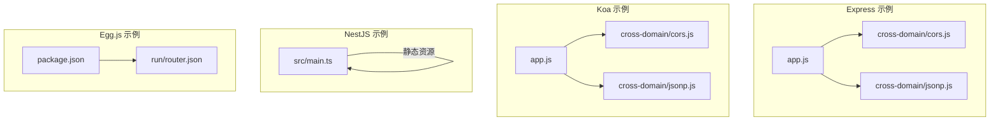
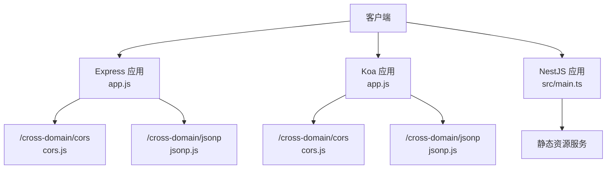
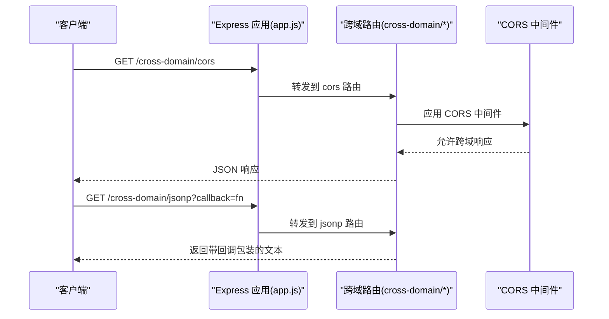
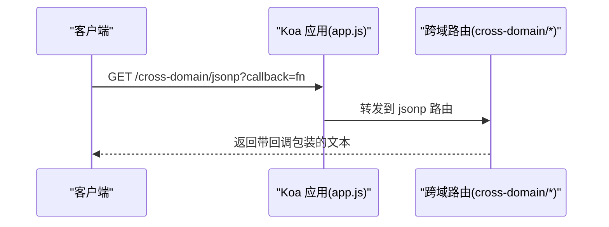
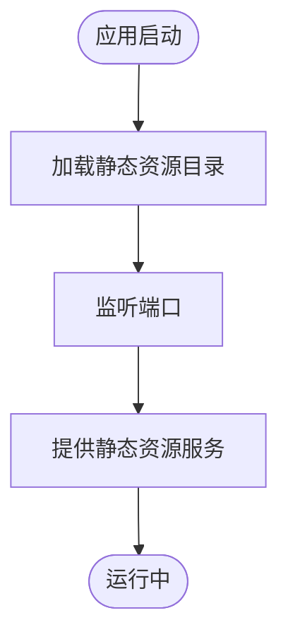
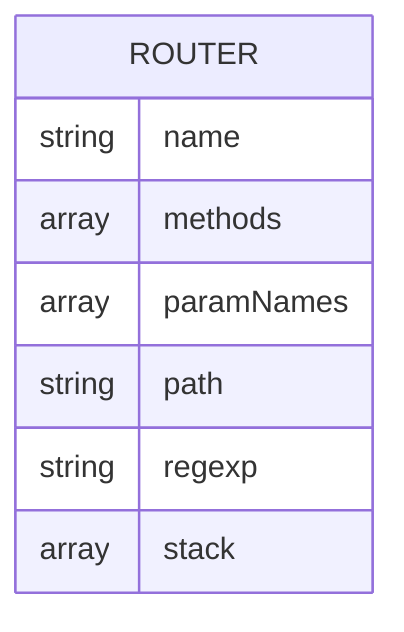
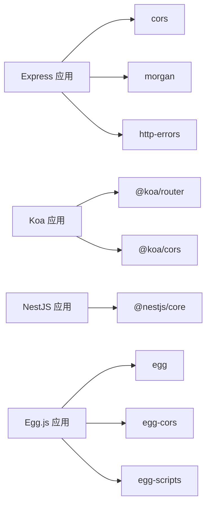

# API接口文档

<cite>
**本文档引用的文件**
- [README.md](file://README.md)
- [README.zh-CN.md](file://README.zh-CN.md)
- [package.json](file://practice/nodejs-service/egg/cross-domain/package.json)
- [app.js](file://practice/nodejs-service/express/cross-domain/app.js)
- [app.js](file://practice/nodejs-service/koa/cross-domain/app.js)
- [main.ts](file://practice/nodejs-service/nest/cross-domain/src/main.ts)
- [cors.js](file://practice/nodejs-service/express/cross-domain/cross-domain/cors.js)
- [jsonp.js](file://practice/nodejs-service/express/cross-domain/cross-domain/jsonp.js)
- [jsonp.js](file://practice/nodejs-service/koa/cross-domain/cross-domain/jsonp.js)
- [router.json](file://practice/nodejs-service/egg/docker-image/run/router.json)
- [router.json](file://practice/nodejs-service/egg/request-log/run/router.json)
- [router.json](file://practice/nodejs-service/egg/request-id/run/router.json)
- [router.json](file://practice/nodejs-service/egg/template/run/router.json)
</cite>

## 目录
1. [简介](#简介)
2. [项目结构](#项目结构)
3. [核心组件](#核心组件)
4. [架构总览](#架构总览)
5. [详细组件分析](#详细组件分析)
6. [依赖关系分析](#依赖关系分析)
7. [性能考虑](#性能考虑)
8. [故障排除指南](#故障排除指南)
9. [结论](#结论)
10. [附录](#附录)

## 简介
本仓库提供了多个 Node.js Web 框架（Express、Koa、NestJS）的跨域与基础路由示例，以及 Egg.js 的模板工程。根据仓库说明，`practice/nodejs-service` 路径下的服务可在 [APIfox](https://apifox.com/apidoc/shared-b220fa2f-dc80-4283-9dee-311a22e04d03) 查看已发布的 API 接口文档。

- 项目目标：通过多框架示例展示跨域处理（CORS、JSONP）、静态资源服务、中间件集成与基础路由组织方式。
- 适用对象：后端开发者、全栈工程师、需要快速集成跨域能力的前端工程师。
- 认证方式：当前示例未内置认证逻辑；如需认证，请在各自框架中按标准方案接入（如 JWT、Cookie 会话等）。
- 错误码与状态码：示例遵循各框架默认行为，未自定义统一错误码；建议在生产环境引入统一错误响应格式。

**章节来源**
- [README.md:15](file://README.md#L15)
- [README.zh-CN.md:15](file://README.zh-CN.md#L15)

## 项目结构
该仓库以实践项目为主，重点在于不同 Node.js 框架的服务示例与配置。核心目录如下：
- practice/nodejs-service/express：基于 Express 的示例，包含跨域、日志、请求 ID、Docker 镜像等变体。
- practice/nodejs-service/koa：基于 Koa 的示例，包含跨域、日志、请求 ID、Docker 镜像等变体。
- practice/nodejs-service/nest：基于 NestJS 的示例，包含跨域、日志、请求 ID、Docker 镜像等变体。
- practice/nodejs-service/egg：Egg.js 模板工程，包含模块化控制器、配置与插件示例。

**图表来源**
- [app.js:1-41](file://practice/nodejs-service/express/cross-domain/app.js#L1-L41)
- [cors.js:1-15](file://practice/nodejs-service/express/cross-domain/cross-domain/cors.js#L1-L15)
- [jsonp.js:1-23](file://practice/nodejs-service/express/cross-domain/cross-domain/jsonp.js#L1-L23)
- [app.js:1-69](file://practice/nodejs-service/koa/cross-domain/app.js#L1-L69)
- [jsonp.js:1-25](file://practice/nodejs-service/koa/cross-domain/cross-domain/jsonp.js#L1-L25)
- [main.ts:1-19](file://practice/nodejs-service/nest/cross-domain/src/main.ts#L1-L19)
- [package.json:1-58](file://practice/nodejs-service/egg/cross-domain/package.json#L1-L58)
- [router.json:1-15](file://practice/nodejs-service/egg/docker-image/run/router.json#L1-L15)

**章节来源**
- [README.md:1-18](file://README.md#L1-L18)
- [README.zh-CN.md:1-18](file://README.zh-CN.md#L1-L18)

## 核心组件
- Express 应用：提供根路径与跨域示例路由，集成 Morgan 日志、JSON 解析与错误处理。
- Koa 应用：提供根路径与跨域示例路由，集成路由中间件与静态资源服务。
- NestJS 应用：通过静态资源适配器提供静态文件服务。
- Egg.js 模板：包含 TypeScript 支持、脚本命令与路由元信息（router.json）。

**章节来源**
- [app.js:1-41](file://practice/nodejs-service/express/cross-domain/app.js#L1-L41)
- [app.js:1-69](file://practice/nodejs-service/koa/cross-domain/app.js#L1-L69)
- [main.ts:1-19](file://practice/nodejs-service/nest/cross-domain/src/main.ts#L1-L19)
- [package.json:1-58](file://practice/nodejs-service/egg/cross-domain/package.json#L1-L58)

## 架构总览
下图展示了跨域示例在不同框架中的路由组织与静态资源服务：

**图表来源**
- [app.js:1-41](file://practice/nodejs-service/express/cross-domain/app.js#L1-L41)
- [cors.js:1-15](file://practice/nodejs-service/express/cross-domain/cross-domain/cors.js#L1-L15)
- [jsonp.js:1-23](file://practice/nodejs-service/express/cross-domain/cross-domain/jsonp.js#L1-L23)
- [app.js:1-69](file://practice/nodejs-service/koa/cross-domain/app.js#L1-L69)
- [jsonp.js:1-25](file://practice/nodejs-service/koa/cross-domain/cross-domain/jsonp.js#L1-L25)
- [main.ts:1-19](file://practice/nodejs-service/nest/cross-domain/src/main.ts#L1-L19)

## 详细组件分析

### Express 跨域组件
- 路由组织：在应用入口中挂载根路由与 `/cross-domain` 前缀路由。
- CORS 路由：提供单路由 CORS 示例，返回 JSON 响应。
- JSONP 路由：支持 callback 查询参数，动态生成回调文本；若无 callback 则返回 JSON。
- 中间件：集成 Morgan 日志、JSON 请求体解析、URL 编码解析与 404/错误处理器。

**图表来源**
- [app.js:1-41](file://practice/nodejs-service/express/cross-domain/app.js#L1-L41)
- [cors.js:1-15](file://practice/nodejs-service/express/cross-domain/cross-domain/cors.js#L1-L15)
- [jsonp.js:1-23](file://practice/nodejs-service/express/cross-domain/cross-domain/jsonp.js#L1-L23)

**章节来源**
- [app.js:1-41](file://practice/nodejs-service/express/cross-domain/app.js#L1-L41)
- [cors.js:1-15](file://practice/nodejs-service/express/cross-domain/cross-domain/cors.js#L1-L15)
- [jsonp.js:1-23](file://practice/nodejs-service/express/cross-domain/cross-domain/jsonp.js#L1-L23)

### Koa 跨域组件
- 路由组织：使用 @koa/router 定义根路径与 `/cross-domain` 前缀路由。
- CORS 路由：提供单路由 CORS 示例，返回 JSON 响应。
- JSONP 路由：支持 callback 查询参数，动态生成回调文本；若无 callback 则返回 JSON。
- 中间件：集成日志中间件与路由中间件。

**图表来源**
- [app.js:1-69](file://practice/nodejs-service/koa/cross-domain/app.js#L1-L69)
- [jsonp.js:1-25](file://practice/nodejs-service/koa/cross-domain/cross-domain/jsonp.js#L1-L25)

**章节来源**
- [app.js:1-69](file://practice/nodejs-service/koa/cross-domain/app.js#L1-L69)
- [jsonp.js:1-25](file://practice/nodejs-service/koa/cross-domain/cross-domain/jsonp.js#L1-L25)

### NestJS 组件
- 静态资源服务：通过 HttpAdapter 使用静态资源目录。
- 应用启动：监听固定端口，提供基础响应。

**图表来源**
- [main.ts:1-19](file://practice/nodejs-service/nest/cross-domain/src/main.ts#L1-L19)

**章节来源**
- [main.ts:1-19](file://practice/nodejs-service/nest/cross-domain/src/main.ts#L1-L19)

### Egg.js 组件
- 包配置：包含 TypeScript 支持、开发脚本与依赖项。
- 路由元信息：router.json 展示了应用注册的路由名称、方法、路径与匹配规则。

**图表来源**
- [router.json:1-15](file://practice/nodejs-service/egg/docker-image/run/router.json#L1-L15)

**章节来源**
- [package.json:1-58](file://practice/nodejs-service/egg/cross-domain/package.json#L1-L58)
- [router.json:1-15](file://practice/nodejs-service/egg/docker-image/run/router.json#L1-L15)
- [router.json:1-15](file://practice/nodejs-service/egg/request-log/run/router.json#L1-L15)
- [router.json:1-15](file://practice/nodejs-service/egg/request-id/run/router.json#L1-L15)
- [router.json:1-15](file://practice/nodejs-service/egg/template/run/router.json#L1-L15)

## 依赖关系分析
- Express 依赖：cors、morgan、http-errors 等。
- Koa 依赖：@koa/router、@koa/cors 等。
- NestJS 依赖：@nestjs/core、静态资源适配器。
- Egg.js 依赖：egg、egg-cors、egg-scripts 等。

**图表来源**
- [package.json:1-25](file://practice/nodejs-service/express/cross-domain/package.json#L1-L25)
- [package.json:1-23](file://practice/nodejs-service/koa/cross-domain/package.json#L1-L23)
- [package.json:1-58](file://practice/nodejs-service/egg/cross-domain/package.json#L1-L58)

**章节来源**
- [package.json:1-25](file://practice/nodejs-service/express/cross-domain/package.json#L1-L25)
- [package.json:1-23](file://practice/nodejs-service/koa/cross-domain/package.json#L1-L23)
- [package.json:1-58](file://practice/nodejs-service/egg/cross-domain/package.json#L1-L58)

## 性能考虑
- 中间件顺序：确保日志中间件在路由之前，避免统计偏差。
- 路由前缀：使用统一前缀（如 `/cross-domain`）便于扩展与治理。
- 静态资源：优先使用静态资源服务，减少动态处理开销。
- 错误处理：在开发环境输出详细错误，在生产环境仅输出必要信息。

[本节为通用建议，不直接分析具体文件]

## 故障排除指南
- 端口占用：Koa 应用监听端口时对 EADDRINUSE/EACCES 进行处理并退出。
- 404 处理：Express 应用统一捕获 404 并交由错误处理器渲染。
- 跨域问题：确认 CORS 中间件配置与浏览器预检请求是否满足。

**章节来源**
- [app.js:40-68](file://practice/nodejs-service/koa/cross-domain/app.js#L40-L68)
- [app.js:24-38](file://practice/nodejs-service/express/cross-domain/app.js#L24-L38)

## 结论
本仓库提供了多框架的跨域与基础路由示例，适合快速验证跨域策略与静态资源服务。生产环境中建议补充统一认证、错误码规范、日志与监控体系，并结合 APIfox 文档进行接口治理与版本管理。

[本节为总结性内容，不直接分析具体文件]

## 附录

### API 接口规范（示例）
以下为基于现有示例的 RESTful 接口规范（以路径与方法为主），实际字段请以 APIfox 文档为准。

- 基础信息
  - 协议：HTTP/HTTPS
  - 默认域名：本地或容器暴露的地址（如 127.0.0.1:端口）
  - 版本：v1（示例）

- 认证方式
  - 当前示例未内置认证；如需认证，请在各框架中按标准方案接入。

- 错误码与状态码
  - 200：成功
  - 404：未找到资源
  - 500：服务器内部错误
  - 跨域相关：由 CORS 中间件控制，常见为 200/204 预检通过或 4xx/5xx 失败

- 接口列表（示例）
  - GET /
    - 描述：根路径响应
    - 成功响应：字符串或 JSON
  - GET /cross-domain/cors
    - 描述：CORS 单路由示例
    - 成功响应：JSON
  - GET /cross-domain/jsonp?callback=fn
    - 描述：JSONP 单路由示例
    - 成功响应：JSON 或带回调包装的文本
  - GET /favicon.ico
    - 描述：静态图标
    - 成功响应：二进制图片

**章节来源**
- [app.js:13-22](file://practice/nodejs-service/express/cross-domain/app.js#L13-L22)
- [cors.js:10-12](file://practice/nodejs-service/express/cross-domain/cross-domain/cors.js#L10-L12)
- [jsonp.js:6-16](file://practice/nodejs-service/express/cross-domain/cross-domain/jsonp.js#L6-L16)
- [app.js:26-34](file://practice/nodejs-service/koa/cross-domain/app.js#L26-L34)
- [jsonp.js:8-22](file://practice/nodejs-service/koa/cross-domain/cross-domain/jsonp.js#L8-L22)

### SDK 使用指南与集成最佳实践
- SDK 选择：根据前端技术栈选择对应 HTTP 客户端（如 fetch、axios、jQuery.ajax）。
- 跨域集成：在浏览器端发起请求时，确保服务端正确配置 CORS；若使用 JSONP，需保证回调参数名一致。
- 错误处理：统一捕获网络异常与业务错误，提示用户并记录日志。
- 版本管理：遵循语义化版本（SemVer），在 API 变更时发布新版本并提供迁移指南。

[本节为通用建议，不直接分析具体文件]

### 接口版本管理、向后兼容与迁移指南
- 版本策略：在 URL 中体现版本号（如 /api/v1/...），或通过 Accept 头协商版本。
- 向后兼容：新增字段采用可选，避免破坏既有客户端；废弃字段保留过渡期。
- 迁移指南：在变更前至少提前两周发布公告，提供迁移脚本与替代方案。

[本节为通用建议，不直接分析具体文件]