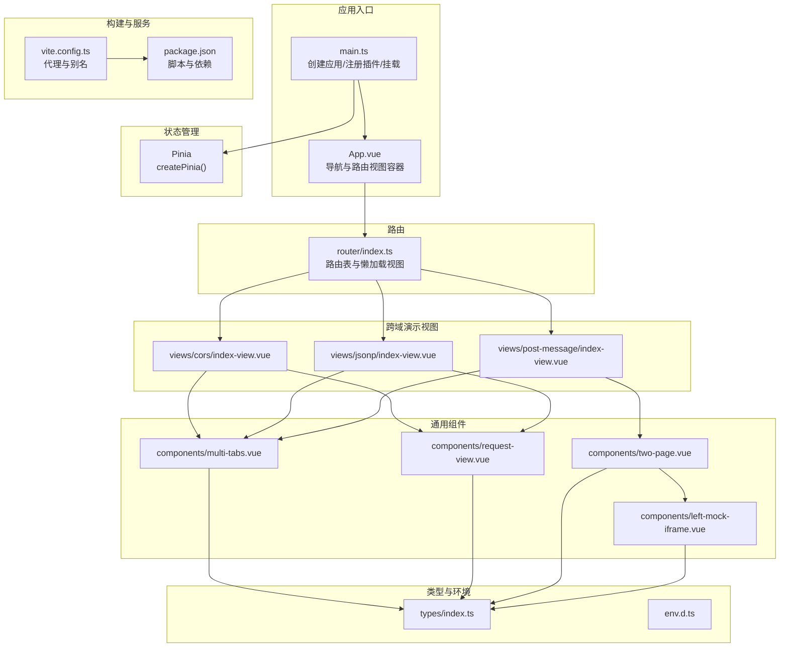
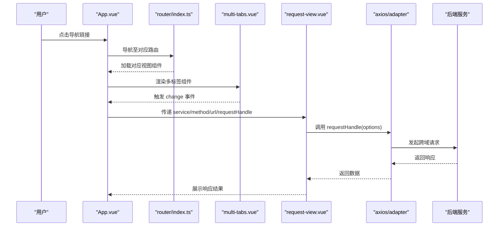
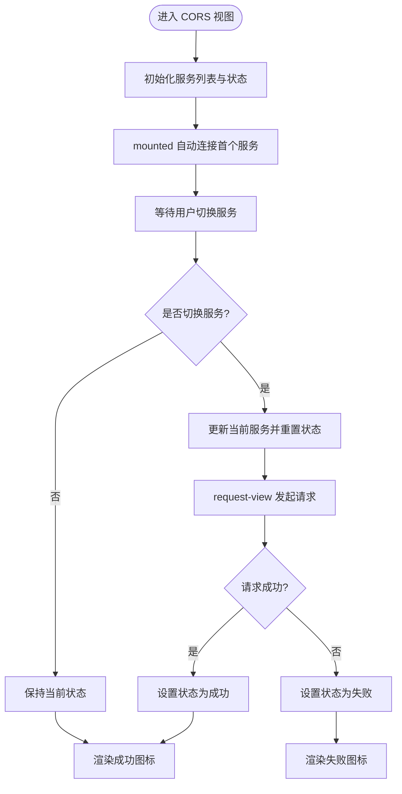
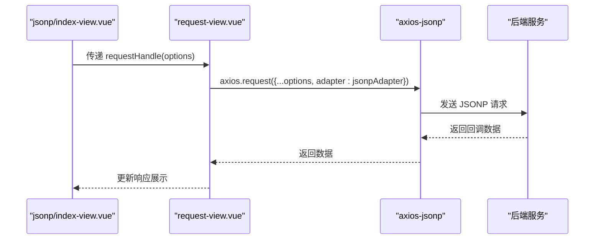
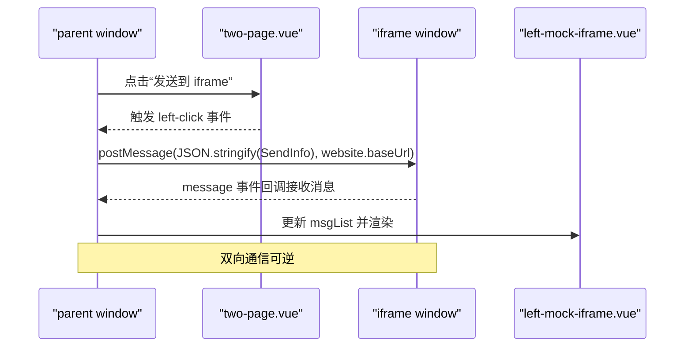
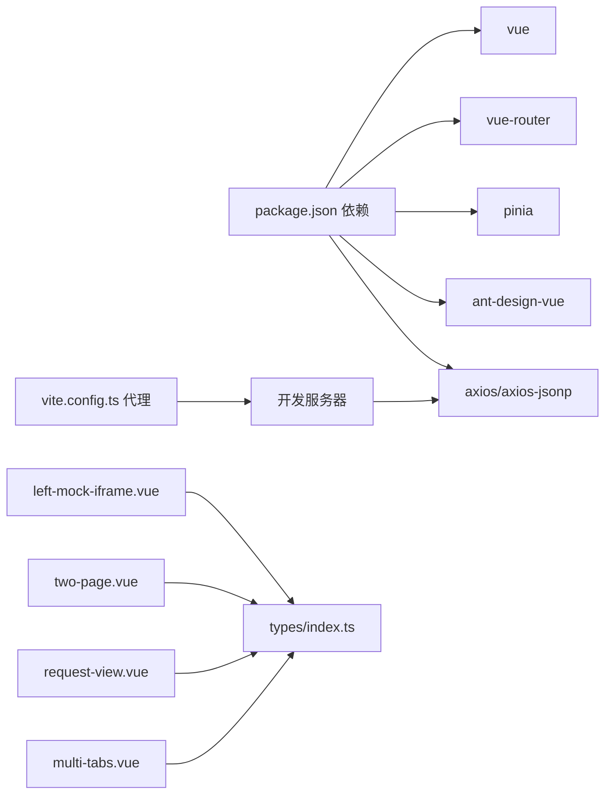

# 前端API接口

<cite>
**本文档引用的文件**
- [main.ts](file://practice/vue3-frontend/cross-domain/src/main.ts)
- [App.vue](file://practice/vue3-frontend/cross-domain/src/App.vue)
- [router/index.ts](file://practice/vue3-frontend/cross-domain/src/router/index.ts)
- [vite.config.ts](file://practice/vue3-frontend/cross-domain/vite.config.ts)
- [package.json](file://practice/vue3-frontend/cross-domain/package.json)
- [env.d.ts](file://practice/vue3-frontend/cross-domain/env.d.ts)
- [types/index.ts](file://practice/vue3-frontend/cross-domain/src/types/index.ts)
- [components/main-content.vue](file://practice/vue3-frontend/cross-domain/src/components/main-content.vue)
- [components/multi-tabs.vue](file://practice/vue3-frontend/cross-domain/src/components/multi-tabs.vue)
- [components/request-view.vue](file://practice/vue3-frontend/cross-domain/src/components/request-view.vue)
- [components/two-page.vue](file://practice/vue3-frontend/cross-domain/src/components/two-page.vue)
- [components/left-mock-iframe.vue](file://practice/vue3-frontend/cross-domain/src/components/left-mock-iframe.vue)
- [views/cors/index-view.vue](file://practice/vue3-frontend/cross-domain/src/views/cors/index-view.vue)
- [views/jsonp/index-view.vue](file://practice/vue3-frontend/cross-domain/src/views/jsonp/index-view.vue)
- [views/post-message/index-view.vue](file://practice/vue3-frontend/cross-domain/src/views/post-message/index-view.vue)
</cite>

## 目录
1. [简介](#简介)
2. [项目结构](#项目结构)
3. [核心组件](#核心组件)
4. [架构总览](#架构总览)
5. [详细组件分析](#详细组件分析)
6. [依赖关系分析](#依赖关系分析)
7. [性能考虑](#性能考虑)
8. [故障排查指南](#故障排查指南)
9. [结论](#结论)
10. [附录](#附录)

## 简介
本文件面向前端开发者，系统化梳理跨域演示应用的API接口与组件体系，覆盖以下方面：
- Vue3 组件的 props 属性、事件监听、插槽使用与生命周期钩子
- 跨域演示组件的 API 接口：CORS、JSONP、PostMessage 等
- 路由 API、状态管理 API（Pinia）与工具函数接口规范
- 组件间通信方式、数据传递与事件处理最佳实践
- TypeScript 类型定义、接口声明与泛型使用示例
- 前端构建配置、开发服务器与部署配置的 API 接口

## 项目结构
该工程采用 Vue3 + Vite + TypeScript 技术栈，结合 Pinia 进行状态管理，并通过路由实现多页面演示。跨域演示以视图组件为入口，配合通用组件完成交互与数据展示。

**图表来源**
- [main.ts:1-16](file://practice/vue3-frontend/cross-domain/src/main.ts#L1-L16)
- [App.vue:1-107](file://practice/vue3-frontend/cross-domain/src/App.vue#L1-L107)
- [router/index.ts:1-50](file://practice/vue3-frontend/cross-domain/src/router/index.ts#L1-L50)
- [vite.config.ts:1-40](file://practice/vue3-frontend/cross-domain/vite.config.ts#L1-L40)
- [package.json:1-43](file://practice/vue3-frontend/cross-domain/package.json#L1-L43)
- [types/index.ts:1-27](file://practice/vue3-frontend/cross-domain/src/types/index.ts#L1-L27)
- [env.d.ts:1-10](file://practice/vue3-frontend/cross-domain/env.d.ts#L1-L10)

**章节来源**
- [main.ts:1-16](file://practice/vue3-frontend/cross-domain/src/main.ts#L1-L16)
- [router/index.ts:1-50](file://practice/vue3-frontend/cross-domain/src/router/index.ts#L1-L50)
- [vite.config.ts:1-40](file://practice/vue3-frontend/cross-domain/vite.config.ts#L1-L40)
- [package.json:1-43](file://practice/vue3-frontend/cross-domain/package.json#L1-L43)

## 核心组件
本节对关键组件进行接口级说明，涵盖 props、事件、插槽与生命周期。

- 多标签页组件 multi-tabs.vue
  - 功能：在多个目标（服务或网站）之间切换，支持额外区域插槽与内容插槽透传当前选中项
  - Props
    - title: 字符串，标题文本
    - list: 数组，元素类型为 Service 或 Website
  - 事件
    - change: 当选中项变化时触发，回调参数为当前选中项
  - 插槽
    - extra: 额外区域，用于显示状态图标等
    - content: 内容区域，透传当前选中项 info
  - 生命周期
    - mounted: 初始化选中第一个项
  - 参考路径
    - [multi-tabs.vue:1-78](file://practice/vue3-frontend/cross-domain/src/components/multi-tabs.vue#L1-L78)

- 请求视图组件 request-view.vue
  - 功能：根据服务与请求信息发起请求，展示请求 URL 与响应结果
  - Props
    - service: Service 接口对象
    - method: 字符串，HTTP 方法
    - url: 字符串，相对路径
    - requestHandle: 函数类型，接收 AxiosRequestConfig 并返回 Promise<any>
  - 事件：无
  - 插槽：无
  - 生命周期
    - watch(requestUrl): 当请求 URL 变化时清空响应数据
  - 参考路径
    - [request-view.vue:1-72](file://practice/vue3-frontend/cross-domain/src/components/request-view.vue#L1-L72)

- 两栏布局组件 two-page.vue
  - 功能：左右两栏布局，支持按钮触发左右交互事件
  - Props
    - leftTitle?: 字符串，左侧标题
    - rightTitle?: 字符串，右侧标题
    - leftButton?: 字符串，左侧按钮文案
    - rightButton?: 字符串，右侧按钮文案
  - 事件
    - left-click: 左侧按钮点击
    - right-click: 右侧按钮点击
  - 插槽
    - left: 左侧内容区
    - right: 右侧内容区（通常放置 iframe）
  - 生命周期：无
  - 参考路径
    - [two-page.vue:1-84](file://practice/vue3-frontend/cross-domain/src/components/two-page.vue#L1-L84)

- 左侧 iframe 模拟组件 left-mock-iframe.vue
  - 功能：展示消息日志列表，限制显示条数并倒序展示
  - Props
    - msgList: MessageLog[]，消息记录数组
  - 事件：无
  - 插槽：无
  - 生命周期：无
  - 参考路径
    - [left-mock-iframe.vue:1-51](file://practice/vue3-frontend/cross-domain/src/components/left-mock-iframe.vue#L1-L51)

- 应用入口与根组件
  - 入口 main.ts：创建应用实例，注册 Pinia、路由、Ant Design Vue，挂载到 DOM
  - 根组件 App.vue：提供顶部导航与 RouterView 容器，包含主标题与导航链接
  - 参考路径
    - [main.ts:1-16](file://practice/vue3-frontend/cross-domain/src/main.ts#L1-L16)
    - [App.vue:1-107](file://practice/vue3-frontend/cross-domain/src/App.vue#L1-L107)

**章节来源**
- [components/multi-tabs.vue:1-78](file://practice/vue3-frontend/cross-domain/src/components/multi-tabs.vue#L1-L78)
- [components/request-view.vue:1-72](file://practice/vue3-frontend/cross-domain/src/components/request-view.vue#L1-L72)
- [components/two-page.vue:1-84](file://practice/vue3-frontend/cross-domain/src/components/two-page.vue#L1-L84)
- [components/left-mock-iframe.vue:1-51](file://practice/vue3-frontend/cross-domain/src/components/left-mock-iframe.vue#L1-L51)
- [main.ts:1-16](file://practice/vue3-frontend/cross-domain/src/main.ts#L1-L16)
- [App.vue:1-107](file://practice/vue3-frontend/cross-domain/src/App.vue#L1-L107)

## 架构总览
下图展示了从入口到视图组件的数据流与交互流程，以及跨域演示的典型调用链。

**图表来源**
- [App.vue:1-107](file://practice/vue3-frontend/cross-domain/src/App.vue#L1-L107)
- [router/index.ts:1-50](file://practice/vue3-frontend/cross-domain/src/router/index.ts#L1-L50)
- [components/multi-tabs.vue:1-78](file://practice/vue3-frontend/cross-domain/src/components/multi-tabs.vue#L1-L78)
- [components/request-view.vue:1-72](file://practice/vue3-frontend/cross-domain/src/components/request-view.vue#L1-L72)

## 详细组件分析

### CORS 组件 API
- 组件：views/cors/index-view.vue
- 关键行为
  - 初始化服务列表（Express/Koa/Nest/Egg），每个服务包含名称与基础 URL
  - 使用 axios.request(options) 执行请求
  - 通过 ServiceStatus 状态机控制 UI 状态（初始化/加载/成功/失败）
  - 将请求处理逻辑封装为 requestHandle，供 request-view 复用
  - 在 mounted 钩子中自动尝试连接首个服务
- 事件与插槽
  - multi-tabs 的 change 事件：当用户切换服务时触发
  - 内容插槽 content：向子组件传递当前选中服务 info
  - 额外插槽 extra：根据 ServiceStatus 显示不同图标
- 数据流
  - 用户选择服务 -> 触发 change -> 更新当前服务 -> request-view 发起请求 -> 更新状态 -> 刷新图标
- 参考路径
  - [views/cors/index-view.vue:1-90](file://practice/vue3-frontend/cross-domain/src/views/cors/index-view.vue#L1-L90)

**图表来源**
- [views/cors/index-view.vue:1-90](file://practice/vue3-frontend/cross-domain/src/views/cors/index-view.vue#L1-L90)
- [components/multi-tabs.vue:1-78](file://practice/vue3-frontend/cross-domain/src/components/multi-tabs.vue#L1-L78)
- [components/request-view.vue:1-72](file://practice/vue3-frontend/cross-domain/src/components/request-view.vue#L1-L72)

**章节来源**
- [views/cors/index-view.vue:1-90](file://practice/vue3-frontend/cross-domain/src/views/cors/index-view.vue#L1-L90)

### JSONP 组件 API
- 组件：views/jsonp/index-view.vue
- 关键行为
  - 引入 axios-jsonp 适配器，通过 adapter: jsonpAdapter 执行跨域 GET 请求
  - 其他逻辑与 CORS 组件一致：服务列表、状态机、requestHandle 包装
- 事件与插槽
  - 同 CORS 视图，使用相同的 multi-tabs 与 request-view
- 数据流
  - 用户选择服务 -> request-view 以 JSONP 方式请求 -> 更新状态 -> 切换图标
- 参考路径
  - [views/jsonp/index-view.vue:1-94](file://practice/vue3-frontend/cross-domain/src/views/jsonp/index-view.vue#L1-L94)

**图表来源**
- [views/jsonp/index-view.vue:1-94](file://practice/vue3-frontend/cross-domain/src/views/jsonp/index-view.vue#L1-L94)
- [components/request-view.vue:1-72](file://practice/vue3-frontend/cross-domain/src/components/request-view.vue#L1-L72)

**章节来源**
- [views/jsonp/index-view.vue:1-94](file://practice/vue3-frontend/cross-domain/src/views/jsonp/index-view.vue#L1-L94)

### PostMessage 组件 API
- 组件：views/post-message/index-view.vue
- 关键行为
  - 提供 Same Domain 与 Diff Domain 两种网站配置，分别指向同源与不同源的 HTML 页面
  - 使用 window.postMessage 在父窗口与 iframe 子窗口之间双向通信
  - 记录消息日志（发送/接收），并在左侧 iframe 模拟器中展示最近若干条
  - 在 mounted 中注册 message 事件监听，在 onBeforeUnmount 中移除监听
  - 通过 two-page 组件承载左右页面，左页为模拟 iframe，右页为真实 iframe
- 事件与插槽
  - two-page 的 left-click/right-click 事件：分别触发向 iframe 发送消息与向父窗口回调
  - multi-tabs 的 change 事件：切换网站时清空消息日志
  - 插槽 content：渲染 two-page
- 数据模型
  - Website：name/baseUrl
  - MessageLog：type/msg
  - SendInfo：type/msg
- 参考路径
  - [views/post-message/index-view.vue:1-108](file://practice/vue3-frontend/cross-domain/src/views/post-message/index-view.vue#L1-L108)
  - [components/two-page.vue:1-84](file://practice/vue3-frontend/cross-domain/src/components/two-page.vue#L1-L84)
  - [components/left-mock-iframe.vue:1-51](file://practice/vue3-frontend/cross-domain/src/components/left-mock-iframe.vue#L1-L51)
  - [types/index.ts:1-27](file://practice/vue3-frontend/cross-domain/src/types/index.ts#L1-L27)

**图表来源**
- [views/post-message/index-view.vue:1-108](file://practice/vue3-frontend/cross-domain/src/views/post-message/index-view.vue#L1-L108)
- [components/two-page.vue:1-84](file://practice/vue3-frontend/cross-domain/src/components/two-page.vue#L1-L84)
- [components/left-mock-iframe.vue:1-51](file://practice/vue3-frontend/cross-domain/src/components/left-mock-iframe.vue#L1-L51)

**章节来源**
- [views/post-message/index-view.vue:1-108](file://practice/vue3-frontend/cross-domain/src/views/post-message/index-view.vue#L1-L108)

### 路由 API
- 路由定义：router/index.ts
  - 基于 createRouter 与 createWebHistory
  - 路由表包含 Home、CORS、Proxy、Jsonp、PostMessage、DocumentDomain、WindowName、LocationHash
  - 所有视图均采用动态导入实现懒加载
- 使用建议
  - 通过 RouterLink 导航至对应路由名称
  - 在视图组件内通过 useRouter 获取路由实例，执行 push/replace 等操作
- 参考路径
  - [router/index.ts:1-50](file://practice/vue3-frontend/cross-domain/src/router/index.ts#L1-L50)

**章节来源**
- [router/index.ts:1-50](file://practice/vue3-frontend/cross-domain/src/router/index.ts#L1-L50)

### 状态管理 API（Pinia）
- 注册与使用
  - 在 main.ts 中通过 app.use(createPinia()) 注册
  - 本项目未在演示组件中直接使用 Pinia 状态，但已按标准方式集成
- 最佳实践
  - 将跨域演示的状态抽象为 Store，如 serviceStatus、msgList 等
  - 通过 Store 的 action 封装请求逻辑，便于复用与测试
- 参考路径
  - [main.ts:1-16](file://practice/vue3-frontend/cross-domain/src/main.ts#L1-L16)

**章节来源**
- [main.ts:1-16](file://practice/vue3-frontend/cross-domain/src/main.ts#L1-L16)

### 工具函数与类型定义
- 类型定义：types/index.ts
  - Service：name/baseUrl
  - ServiceStatus：枚举（init/loading/success/error）
  - Website：name/baseUrl
  - MessageLog：type/msg
  - SendInfo：type/msg
- 环境声明：env.d.ts
  - 声明 window 上的可选方法 receiveMsg/receiveMsgFromParent/syncName，便于与外部页面交互
- 参考路径
  - [types/index.ts:1-27](file://practice/vue3-frontend/cross-domain/src/types/index.ts#L1-L27)
  - [env.d.ts:1-10](file://practice/vue3-frontend/cross-domain/env.d.ts#L1-L10)

**章节来源**
- [types/index.ts:1-27](file://practice/vue3-frontend/cross-domain/src/types/index.ts#L1-L27)
- [env.d.ts:1-10](file://practice/vue3-frontend/cross-domain/env.d.ts#L1-L10)

## 依赖关系分析
- 组件耦合
  - 视图组件依赖通用组件（multi-tabs/request-view/two-page/left-mock-iframe）
  - 通用组件通过 props 与事件解耦，具备良好复用性
- 外部依赖
  - axios/axios-jsonp：跨域请求适配
  - ant-design-vue：UI 组件库
  - pinia/vue-router：状态管理与路由
- 构建与代理
  - vite.config.ts 提供本地开发代理，将 /proxy/3000~3003 重写到对应端口
- 参考路径
  - [package.json:1-43](file://practice/vue3-frontend/cross-domain/package.json#L1-L43)
  - [vite.config.ts:1-40](file://practice/vue3-frontend/cross-domain/vite.config.ts#L1-L40)

**图表来源**
- [package.json:1-43](file://practice/vue3-frontend/cross-domain/package.json#L1-L43)
- [vite.config.ts:1-40](file://practice/vue3-frontend/cross-domain/vite.config.ts#L1-L40)
- [types/index.ts:1-27](file://practice/vue3-frontend/cross-domain/src/types/index.ts#L1-L27)

**章节来源**
- [package.json:1-43](file://practice/vue3-frontend/cross-domain/package.json#L1-L43)
- [vite.config.ts:1-40](file://practice/vue3-frontend/cross-domain/vite.config.ts#L1-L40)

## 性能考虑
- 懒加载视图：路由采用动态导入，减少首屏体积
- 本地代理：Vite 代理避免浏览器跨域限制，提升开发体验
- 组件复用：通过通用组件（multi-tabs/request-view/two-page）降低重复逻辑
- 状态最小化：仅在必要处使用响应式状态，避免过度渲染

## 故障排查指南
- CORS 请求失败
  - 检查后端是否正确设置 Access-Control-Allow-Origin
  - 确认请求方法与头是否被允许
- JSONP 回调异常
  - 确保后端返回合法的回调函数包裹数据
  - 检查 callback 参数名与约定一致
- PostMessage 通信不生效
  - 确认目标域名与 postMessage 第二个参数一致
  - 确保在正确的时机注册/移除 message 事件监听
  - 检查 iframe 加载完成后再发送消息
- 开发代理无效
  - 确认代理规则与请求前缀匹配
  - 检查本地端口与后端服务端口一致

## 结论
本项目以 Vue3 + Vite 为基础，围绕跨域主题构建了可复用的组件体系与清晰的路由结构。通过统一的请求封装与类型定义，提升了可维护性与扩展性；借助 Vite 代理与 axios 适配器，有效解决了开发阶段的跨域问题。建议后续引入 Pinia Store 对演示状态进行集中管理，并完善错误处理与日志上报机制。

## 附录

### 组件间通信与事件处理最佳实践
- 父子通信
  - 使用 props 传递只读数据，使用 emits 向父组件回传事件
  - 对复杂对象使用只读引用或深拷贝，避免意外修改
- 插槽使用
  - 使用作用域插槽向子组件传递上下文数据（如 info）
  - 额外插槽用于渲染状态图标或控制按钮
- 生命周期
  - 在 onMounted 中注册全局事件（如 message），在 onBeforeUnmount 中移除
  - 对响应式数据变更使用 watch，确保副作用可控

### TypeScript 类型与泛型使用示例
- 接口与枚举
  - 使用 Service/Website 表达服务与站点信息
  - 使用 ServiceStatus 表达状态机
  - 使用 MessageLog/SendInfo 表达消息结构
- 泛型
  - 在 requestHandle 中使用泛型约束 AxiosRequestConfig，保证类型安全
- 参考路径
  - [types/index.ts:1-27](file://practice/vue3-frontend/cross-domain/src/types/index.ts#L1-L27)

### 构建配置与开发服务器
- 开发脚本
  - dev：启动 Vite 开发服务器，自动打开浏览器
  - preview：预览打包产物
  - build：类型检查与构建
- 代理配置
  - 将 /proxy/3000~3003 重写到对应后端端口，便于联调
- 环境变量
  - BASE_URL 由 Vite 提供，路由历史模式基于此生成
- 参考路径
  - [vite.config.ts:1-40](file://practice/vue3-frontend/cross-domain/vite.config.ts#L1-L40)
  - [package.json:1-43](file://practice/vue3-frontend/cross-domain/package.json#L1-L43)