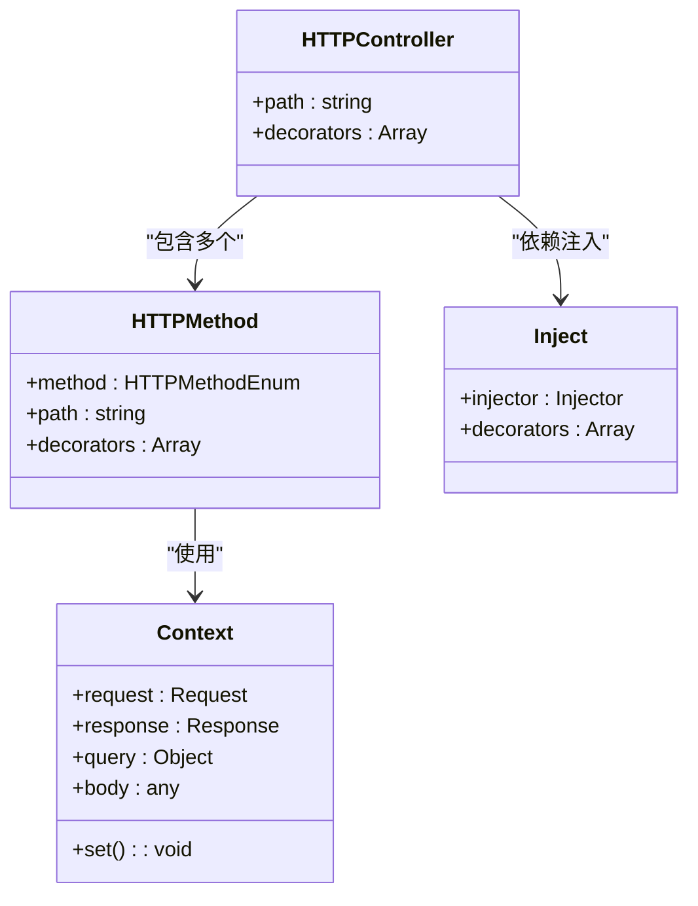
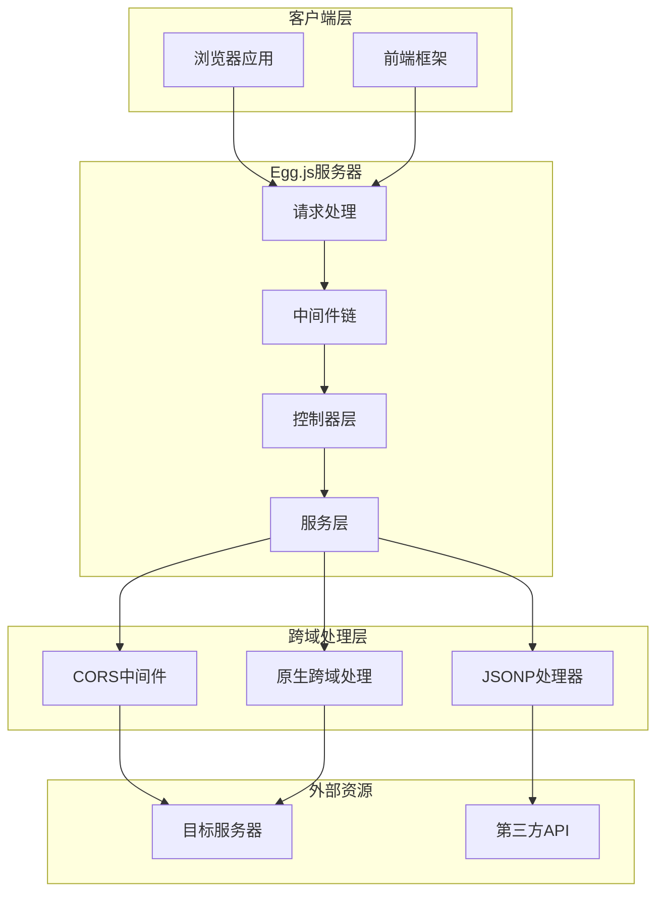
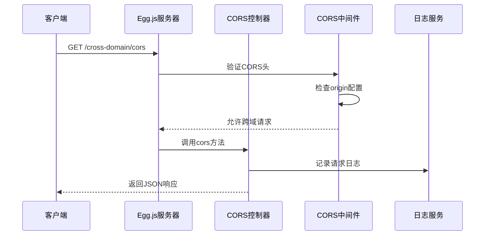
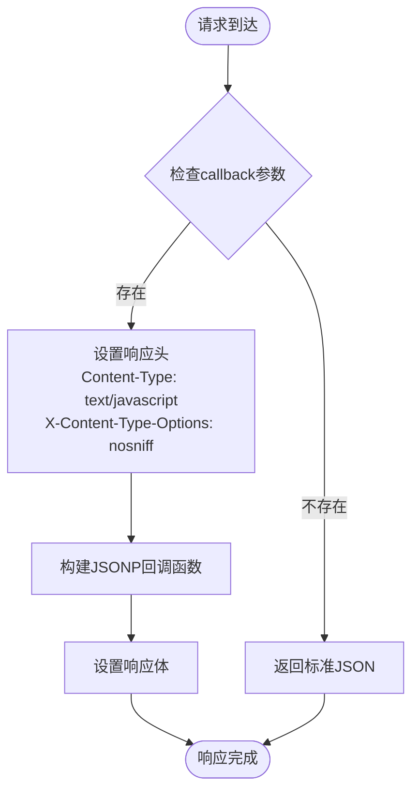
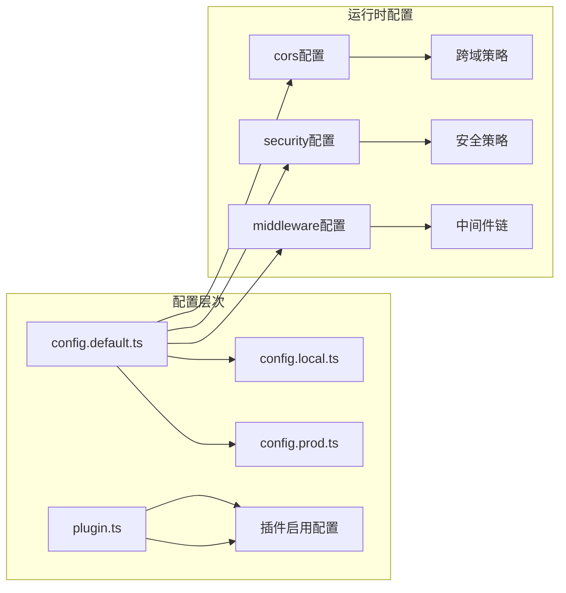
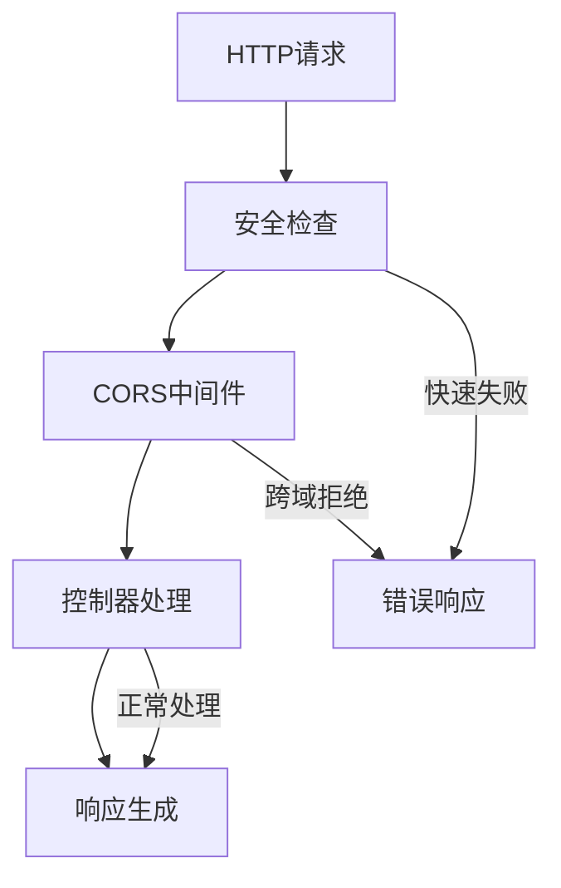

# Egg.js API接口

<cite>
**本文档引用的文件**
- [cors.cross-domain.ts](file://practice/nodejs-service/egg/cross-domain/app/module/cross-domain/controller/cors.cross-domain.ts)
- [jsonp.cross-domain.ts](file://practice/nodejs-service/egg/cross-domain/app/module/cross-domain/controller/jsonp.cross-domain.ts)
- [sample.cross-domain.ts](file://practice/nodejs-service/egg/cross-domain/app/module/cross-domain/controller/sample.cross-domain.ts)
- [home.ts](file://practice/nodejs-service/egg/cross-domain/app/module/home/controller/home.ts)
- [config.default.ts](file://practice/nodejs-service/egg/cross-domain/config/config.default.ts)
- [plugin.ts](file://practice/nodejs-service/egg/cross-domain/config/plugin.ts)
- [package.json](file://practice/nodejs-service/egg/cross-domain/package.json)
</cite>

## 目录
1. [简介](#简介)
2. [项目结构](#项目结构)
3. [核心组件](#核心组件)
4. [架构概览](#架构概览)
5. [详细组件分析](#详细组件分析)
6. [依赖关系分析](#依赖关系分析)
7. [性能考虑](#性能考虑)
8. [故障排除指南](#故障排除指南)
9. [结论](#结论)

## 简介

本项目展示了基于Egg.js TEGG框架的RESTful API实现，专注于跨域请求处理。Egg.js是一个企业级 Node.js 框架，通过 TEGG（Typed Egg）装饰器提供了现代化的依赖注入和模块化开发体验。

该实现包含了多种跨域解决方案：
- CORS（跨域资源共享）
- JSONP（跨域数据请求）
- 原生跨域示例

每个控制器都使用了Egg.js TEGG框架的装饰器模式，提供了清晰的HTTP方法映射和路由配置。

## 项目结构

项目采用Egg.js标准目录结构，结合TEGG框架的模块化设计：

```mermaid
graph TB
subgraph "Egg.js 应用结构"
A[app/] --> B[module/]
A --> C[controller/]
A --> D[service/]
E[config/] --> F[config.default.ts]
E --> G[config.local.ts]
E --> H[config.prod.ts]
E --> I[plugin.ts]
J[package.json] --> K[依赖管理]
L[run/] --> M[运行时配置]
end
subgraph "跨域功能模块"
N[CORS控制器] --> O[/cross-domain/cors]
P[JSONP控制器] --> Q[/cross-domain/jsonp]
R[示例控制器] --> S[/cross-domain/sample]
T[首页控制器] --> U[/]
end
```

**图表来源**
- [config.default.ts:1-49](file://practice/nodejs-service/egg/cross-domain/config/config.default.ts#L1-L49)
- [plugin.ts:1-39](file://practice/nodejs-service/egg/cross-domain/config/plugin.ts#L1-L39)

**章节来源**
- [config.default.ts:1-49](file://practice/nodejs-service/egg/cross-domain/config/config.default.ts#L1-L49)
- [plugin.ts:1-39](file://practice/nodejs-service/egg/cross-domain/config/plugin.ts#L1-L39)

## 核心组件

### 控制器装饰器系统

Egg.js TEGG框架通过装饰器提供了声明式的控制器定义：



**图表来源**
- [cors.cross-domain.ts:1-21](file://practice/nodejs-service/egg/cross-domain/app/module/cross-domain/controller/cors.cross-domain.ts#L1-L21)
- [jsonp.cross-domain.ts:1-31](file://practice/nodejs-service/egg/cross-domain/app/module/cross-domain/controller/jsonp.cross-domain.ts#L1-L31)
- [sample.cross-domain.ts:1-19](file://practice/nodejs-service/egg/cross-domain/app/module/cross-domain/controller/sample.cross-domain.ts#L1-L19)

### 跨域解决方案

项目实现了三种主要的跨域处理方案：

1. **CORS跨域**: 使用egg-cors插件提供标准的跨域支持
2. **JSONP跨域**: 手动实现JSONP回调机制
3. **原生跨域示例**: 展示基础的跨域请求处理

**章节来源**
- [cors.cross-domain.ts:1-21](file://practice/nodejs-service/egg/cross-domain/app/module/cross-domain/controller/cors.cross-domain.ts#L1-L21)
- [jsonp.cross-domain.ts:1-31](file://practice/nodejs-service/egg/cross-domain/app/module/cross-domain/controller/jsonp.cross-domain.ts#L1-L31)
- [sample.cross-domain.ts:1-19](file://practice/nodejs-service/egg/cross-domain/app/module/cross-domain/controller/sample.cross-domain.ts#L1-L19)

## 架构概览



**图表来源**
- [config.default.ts:31-41](file://practice/nodejs-service/egg/cross-domain/config/config.default.ts#L31-L41)
- [plugin.ts:32-35](file://practice/nodejs-service/egg/cross-domain/config/plugin.ts#L32-L35)

## 详细组件分析

### CORS跨域控制器

CORS（跨域资源共享）控制器提供了最标准的跨域解决方案：

#### API端点定义

| 端点 | 方法 | 路径 | 功能描述 |
|------|------|------|----------|
| CorsCrossDomainController | GET | `/cross-domain/cors` | 单个路由的CORS启用 |

#### 实现细节



**图表来源**
- [cors.cross-domain.ts:11-19](file://practice/nodejs-service/egg/cross-domain/app/module/cross-domain/controller/cors.cross-domain.ts#L11-L19)
- [config.default.ts:36-41](file://practice/nodejs-service/egg/cross-domain/config/config.default.ts#L36-L41)

**章节来源**
- [cors.cross-domain.ts:1-21](file://practice/nodejs-service/egg/cross-domain/app/module/cross-domain/controller/cors.cross-domain.ts#L1-L21)
- [config.default.ts:31-41](file://practice/nodejs-service/egg/cross-domain/config/config.default.ts#L31-L41)

### JSONP跨域控制器

JSONP（JSON with Padding）控制器实现了传统的跨域数据传输机制：

#### API端点定义

| 端点 | 方法 | 路径 | 参数 | 功能描述 |
|------|------|------|------|----------|
| JsonpCrossDomainController | GET | `/cross-domain/jsonp` | callback | 支持JSONP回调的跨域请求 |

#### 处理流程



**图表来源**
- [jsonp.cross-domain.ts:15-29](file://practice/nodejs-service/egg/cross-domain/app/module/cross-domain/controller/jsonp.cross-domain.ts#L15-L29)

**章节来源**
- [jsonp.cross-domain.ts:1-31](file://practice/nodejs-service/egg/cross-domain/app/module/cross-domain/controller/jsonp.cross-domain.ts#L1-L31)

### 示例跨域控制器

示例控制器展示了最基本的跨域请求处理：

#### API端点定义

| 端点 | 方法 | 路径 | 功能描述 |
|------|------|------|----------|
| SampleCrossDomainController | GET | `/cross-domain/sample` | 跨域示例响应 |

**章节来源**
- [sample.cross-domain.ts:1-19](file://practice/nodejs-service/egg/cross-domain/app/module/cross-domain/controller/sample.cross-domain.ts#L1-L19)

### 首页控制器

首页控制器提供了基本的应用状态检查：

#### API端点定义

| 端点 | 方法 | 路径 | 功能描述 |
|------|------|------|----------|
| HomeController | GET | `/` | 应用健康检查 |

**章节来源**
- [home.ts:1-19](file://practice/nodejs-service/egg/cross-domain/app/module/home/controller/home.ts#L1-L19)

## 依赖关系分析

### 核心依赖架构

```mermaid
graph TB
subgraph "应用层"
A[Egg.js应用]
B[TEGG框架]
end
subgraph "插件层"
C[egg-cors]
D[@eggjs/tegg-plugin]
E[@eggjs/tegg-controller-plugin]
F[@eggjs/tegg-config]
end
subgraph "工具层"
G[egg-scripts]
H[egg-tracer]
I[egg-mock]
end
subgraph "开发工具"
J[TypeScript]
K[ESLint]
L[Prettier]
end
A --> B
B --> C
B --> D
B --> E
B --> F
A --> G
A --> H
A --> I
A --> J
A --> K
A --> L
```

**图表来源**
- [package.json:23-35](file://practice/nodejs-service/egg/cross-domain/package.json#L23-L35)
- [plugin.ts:3-36](file://practice/nodejs-service/egg/cross-domain/config/plugin.ts#L3-L36)

### 配置依赖关系



**图表来源**
- [config.default.ts:24-41](file://practice/nodejs-service/egg/cross-domain/config/config.default.ts#L24-L41)
- [plugin.ts:32-35](file://practice/nodejs-service/egg/cross-domain/config/plugin.ts#L32-L35)

**章节来源**
- [package.json:1-58](file://practice/nodejs-service/egg/cross-domain/package.json#L1-L58)
- [plugin.ts:1-39](file://practice/nodejs-service/egg/cross-domain/config/plugin.ts#L1-L39)

## 性能考虑

### CORS配置优化

项目中的CORS配置采用了动态origin策略：

- **条件性跨域允许**: 仅对特定路径启用跨域支持
- **方法白名单**: 明确允许的HTTP方法列表
- **安全考虑**: 禁用CSRF保护以避免跨域场景下的冲突

### 中间件执行效率



### 内存和CPU优化建议

1. **缓存策略**: 对静态资源和频繁访问的数据实施缓存
2. **连接池管理**: 合理配置数据库和外部服务连接池
3. **日志级别**: 在生产环境中调整日志级别以减少I/O开销

## 故障排除指南

### 常见问题诊断

#### CORS相关问题

**问题症状**:
- 浏览器控制台出现跨域错误
- 预检请求失败
- Access-Control-Allow-Origin头缺失

**排查步骤**:
1. 检查CORS配置中的origin设置
2. 验证请求URL是否匹配配置规则
3. 确认预检请求的HTTP方法是否在allowMethods中

#### JSONP相关问题

**问题症状**:
- JSONP回调函数未执行
- Content-Type设置不正确
- 安全头配置问题

**排查步骤**:
1. 验证callback参数是否存在
2. 检查响应头设置是否正确
3. 确认JSONP格式字符串的构造

#### 控制器方法映射问题

**问题症状**:
- HTTP方法不匹配导致405错误
- 路由路径不正确
- 装饰器配置错误

**排查步骤**:
1. 检查@HTTPMethod装饰器的method和path配置
2. 验证控制器类上的@HTTPController装饰器
3. 确认依赖注入注解的正确使用

**章节来源**
- [config.default.ts:24-41](file://practice/nodejs-service/egg/cross-domain/config/config.default.ts#L24-L41)
- [jsonp.cross-domain.ts:17-26](file://practice/nodejs-service/egg/cross-domain/app/module/cross-domain/controller/jsonp.cross-domain.ts#L17-L26)

## 结论

本项目成功展示了Egg.js TEGG框架在跨域API开发中的最佳实践。通过装饰器模式和依赖注入，实现了清晰、可维护的控制器架构。

### 主要优势

1. **现代化开发体验**: TEGG装饰器提供了声明式编程模型
2. **灵活的跨域解决方案**: 支持多种跨域处理策略
3. **完善的配置体系**: 分环境的配置管理和插件化架构
4. **良好的扩展性**: 模块化的目录结构便于功能扩展

### 技术特色

- **类型安全**: TypeScript提供编译时类型检查
- **依赖注入**: 自动化的服务依赖管理和生命周期控制
- **中间件生态**: 丰富的中间件插件支持
- **测试友好**: 清晰的模块边界便于单元测试

该实现为基于Egg.js的企业级应用开发提供了坚实的基础，特别适合需要处理复杂跨域场景的微服务架构。