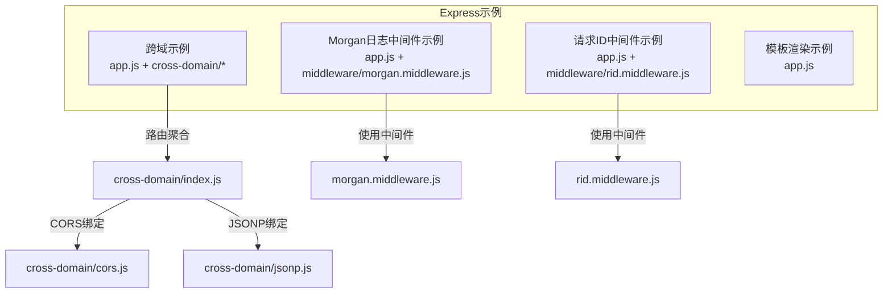
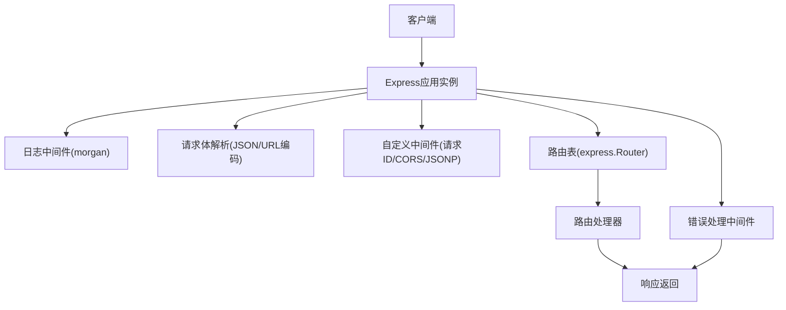
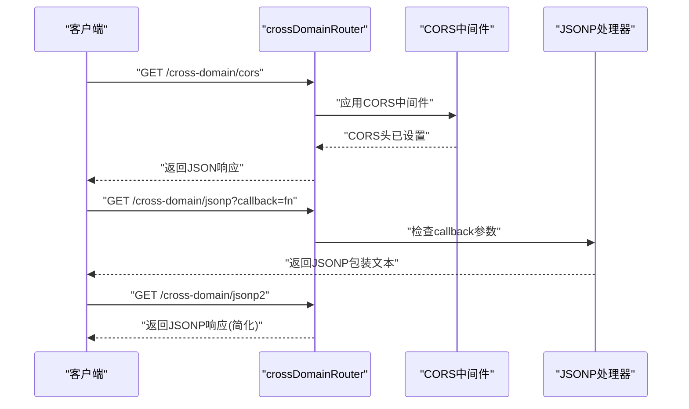
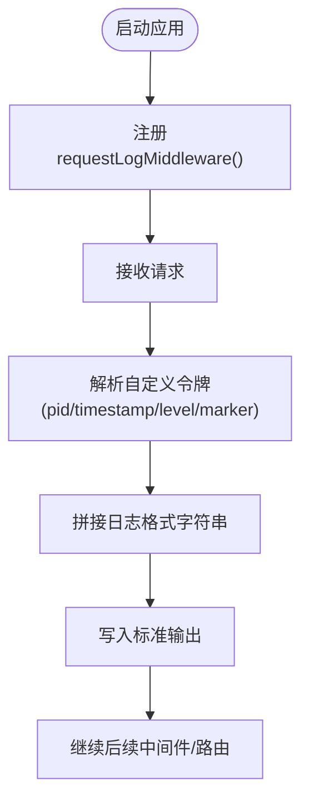
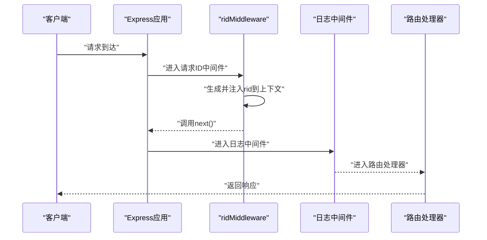
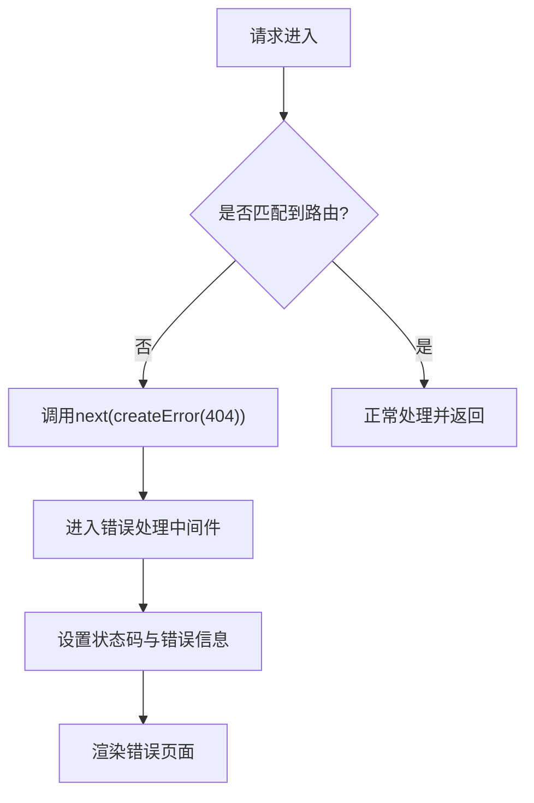
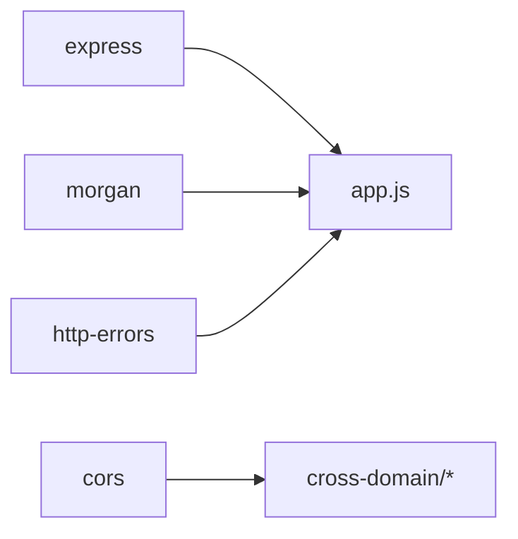

# Express API接口

<cite>
**本文引用的文件**
- [app.js（跨域示例）](file://practice/nodejs-service/express/cross-domain/app.js)
- [index.js（跨域路由聚合）](file://practice/nodejs-service/express/cross-domain/cross-domain/index.js)
- [cors.js（CORS实现）](file://practice/nodejs-service/express/cross-domain/cross-domain/cors.js)
- [jsonp.js（JSONP实现）](file://practice/nodejs-service/express/cross-domain/cross-domain/jsonp.js)
- [app.js（Morgan日志中间件示例）](file://practice/nodejs-service/express/request-log-morgan/app.js)
- [morgan.middleware.js（Morgan中间件封装）](file://practice/nodejs-service/express/request-log-morgan/middleware/morgan.middleware.js)
- [app.js（请求ID中间件示例）](file://practice/nodejs-service/express/request-id/app.js)
- [rid.middleware.js（请求ID中间件实现）](file://practice/nodejs-service/express/request-id/middleware/rid.middleware.js)
- [app.js（模板渲染示例）](file://practice/nodejs-service/express/template/app.js)
- [package.json（Express跨域示例依赖）](file://practice/nodejs-service/express/cross-domain/package.json)
</cite>

## 目录
1. [简介](#简介)
2. [项目结构](#项目结构)
3. [核心组件](#核心组件)
4. [架构总览](#架构总览)
5. [详细组件分析](#详细组件分析)
6. [依赖关系分析](#依赖关系分析)
7. [性能考虑](#性能考虑)
8. [故障排查指南](#故障排查指南)
9. [结论](#结论)
10. [附录](#附录)

## 简介
本文件面向使用Express.js构建RESTful API的开发者，系统性梳理基于Express的路由定义、中间件机制与请求处理流程，并重点说明跨域处理（CORS与JSONP）、路由参数与请求体解析、错误处理以及模块化架构与插件系统的实践方式。文档以仓库中的Express示例为依据，提供可直接对照的实现路径与最佳实践建议。

## 项目结构
Express示例采用按功能模块组织的目录结构，每个子示例独立包含应用入口、中间件封装、路由定义与依赖配置，便于理解不同特性在Express中的落地方式。

- 跨域示例：演示CORS与JSONP两种跨域方案，以及基础路由与静态资源服务。
- Morgan日志中间件示例：展示如何通过自定义格式封装morgan中间件。
- 请求ID中间件示例：演示基于cls-hooked的请求上下文隔离与请求追踪。
- 模板渲染示例：展示Express默认模板引擎的错误页渲染流程。

图表来源
- [app.js（跨域示例）:1-41](file://practice/nodejs-service/express/cross-domain/app.js#L1-L41)
- [index.js（跨域路由聚合）:1-22](file://practice/nodejs-service/express/cross-domain/cross-domain/index.js#L1-L22)
- [cors.js（CORS实现）:1-16](file://practice/nodejs-service/express/cross-domain/cross-domain/cors.js#L1-L16)
- [jsonp.js（JSONP实现）:1-24](file://practice/nodejs-service/express/cross-domain/cross-domain/jsonp.js#L1-L24)
- [app.js（Morgan日志中间件示例）:1-39](file://practice/nodejs-service/express/request-log-morgan/app.js#L1-L39)
- [morgan.middleware.js（Morgan中间件封装）:1-34](file://practice/nodejs-service/express/request-log-morgan/middleware/morgan.middleware.js#L1-L34)
- [app.js（请求ID中间件示例）:1-45](file://practice/nodejs-service/express/request-id/app.js#L1-L45)
- [rid.middleware.js（请求ID中间件实现）:1-35](file://practice/nodejs-service/express/request-id/middleware/rid.middleware.js#L1-L35)
- [app.js（模板渲染示例）:1-39](file://practice/nodejs-service/express/template/app.js#L1-L39)

章节来源
- [app.js（跨域示例）:1-41](file://practice/nodejs-service/express/cross-domain/app.js#L1-L41)
- [app.js（Morgan日志中间件示例）:1-39](file://practice/nodejs-service/express/request-log-morgan/app.js#L1-L39)
- [app.js（请求ID中间件示例）:1-45](file://practice/nodejs-service/express/request-id/app.js#L1-L45)
- [app.js（模板渲染示例）:1-39](file://practice/nodejs-service/express/template/app.js#L1-L39)

## 核心组件
- 应用实例与中间件栈
  - 使用express()创建应用实例，通过app.use()注册全局中间件，如日志、JSON解析、URL编码解析等。
  - 中间件按注册顺序执行，next()用于传递控制权给下一个中间件或路由处理器。
- 路由定义与分发
  - express.Router()创建模块化路由，支持GET/POST等HTTP方法绑定处理器。
  - app.use()将路由挂载到特定路径前缀，实现模块化与命名空间隔离。
- 错误处理中间件
  - 通过接收四个参数的中间件捕获404与业务异常，设置响应状态码与错误页面渲染。
- 静态资源服务
  - 使用res.sendFile()或app.use()提供favicon.ico等静态资源访问。

章节来源
- [app.js（跨域示例）:7-27](file://practice/nodejs-service/express/cross-domain/app.js#L7-L27)
- [app.js（Morgan日志中间件示例）:6-25](file://practice/nodejs-service/express/request-log-morgan/app.js#L6-L25)
- [app.js（请求ID中间件示例）:8-31](file://practice/nodejs-service/express/request-id/app.js#L8-L31)
- [app.js（模板渲染示例）:5-25](file://practice/nodejs-service/express/template/app.js#L5-L25)

## 架构总览
下图展示了Express应用的核心运行时架构：应用实例承载中间件栈与路由表；中间件负责请求预处理（日志、解析、上下文注入等）；路由根据路径与方法匹配到具体处理器；错误中间件统一兜底处理未捕获异常与404。

图表来源
- [app.js（跨域示例）:9-38](file://practice/nodejs-service/express/cross-domain/app.js#L9-L38)
- [app.js（Morgan日志中间件示例）:8-36](file://practice/nodejs-service/express/request-log-morgan/app.js#L8-L36)
- [app.js（请求ID中间件示例）:10-42](file://practice/nodejs-service/express/request-id/app.js#L10-L42)
- [app.js（模板渲染示例）:8-36](file://practice/nodejs-service/express/template/app.js#L8-L36)

## 详细组件分析

### 跨域处理：CORS与JSONP
- CORS实现
  - 在指定路由上应用cors()中间件，实现对单个路由的跨域放行。
  - 可通过配置对象扩展允许源、方法、头等策略。
- JSONP实现
  - 通过查询参数callback判断是否返回JSONP包装文本。
  - 返回时设置安全相关响应头与内容类型，确保兼容性与安全性。
  - 提供简化的res.jsonp()版本作为对比参考。

图表来源
- [index.js（跨域路由聚合）:11-19](file://practice/nodejs-service/express/cross-domain/cross-domain/index.js#L11-L19)
- [cors.js（CORS实现）:3-14](file://practice/nodejs-service/express/cross-domain/cross-domain/cors.js#L3-L14)
- [jsonp.js（JSONP实现）:1-23](file://practice/nodejs-service/express/cross-domain/cross-domain/jsonp.js#L1-L23)

章节来源
- [index.js（跨域路由聚合）:1-22](file://practice/nodejs-service/express/cross-domain/cross-domain/index.js#L1-L22)
- [cors.js（CORS实现）:1-16](file://practice/nodejs-service/express/cross-domain/cross-domain/cors.js#L1-L16)
- [jsonp.js（JSONP实现）:1-24](file://practice/nodejs-service/express/cross-domain/cross-domain/jsonp.js#L1-L24)

### 日志中间件：Morgan自定义格式
- 自定义日志格式
  - 通过morgan.token()注册pid、timestamp、level、marker等自定义令牌。
  - 使用requestLogMiddleware()返回格式化的morgan实例。
- 在应用中集成
  - 在app.js中通过app.use(requestLogMiddleware())启用统一日志输出。

图表来源
- [morgan.middleware.js（Morgan中间件封装）:10-33](file://practice/nodejs-service/express/request-log-morgan/middleware/morgan.middleware.js#L10-L33)
- [app.js（Morgan日志中间件示例）:8-8](file://practice/nodejs-service/express/request-log-morgan/app.js#L8-L8)

章节来源
- [morgan.middleware.js（Morgan中间件封装）:1-34](file://practice/nodejs-service/express/request-log-morgan/middleware/morgan.middleware.js#L1-L34)
- [app.js（Morgan日志中间件示例）:1-39](file://practice/nodejs-service/express/request-log-morgan/app.js#L1-L39)

### 请求ID中间件：上下文隔离与追踪
- 实现原理
  - 基于cls-hooked创建命名空间，生成递增rid并注入到当前请求上下文中。
  - 通过get/set方法在中间件链路中读取与共享请求ID。
- 在应用中集成
  - 注册ridMiddleware后，在路由处理器中可读取请求ID，便于日志关联与问题定位。

图表来源
- [rid.middleware.js（请求ID中间件实现）:14-28](file://practice/nodejs-service/express/request-id/middleware/rid.middleware.js#L14-L28)
- [app.js（请求ID中间件示例）:10-21](file://practice/nodejs-service/express/request-id/app.js#L10-L21)

章节来源
- [rid.middleware.js（请求ID中间件实现）:1-35](file://practice/nodejs-service/express/request-id/middleware/rid.middleware.js#L1-L35)
- [app.js（请求ID中间件示例）:1-45](file://practice/nodejs-service/express/request-id/app.js#L1-L45)

### 错误处理与404转发
- 404捕获
  - 在所有路由之后注册中间件，调用next(createError(404))将未匹配请求转交错误处理流程。
- 错误处理
  - 接收err、req、res、next四个参数的中间件，设置本地变量与状态码，渲染错误页面。

图表来源
- [app.js（跨域示例）:24-38](file://practice/nodejs-service/express/cross-domain/app.js#L24-L38)
- [app.js（Morgan日志中间件示例）:22-36](file://practice/nodejs-service/express/request-log-morgan/app.js#L22-L36)
- [app.js（请求ID中间件示例）:28-42](file://practice/nodejs-service/express/request-id/app.js#L28-L42)
- [app.js（模板渲染示例）:22-36](file://practice/nodejs-service/express/template/app.js#L22-L36)

章节来源
- [app.js（跨域示例）:24-38](file://practice/nodejs-service/express/cross-domain/app.js#L24-L38)
- [app.js（Morgan日志中间件示例）:22-36](file://practice/nodejs-service/express/request-log-morgan/app.js#L22-L36)
- [app.js（请求ID中间件示例）:28-42](file://practice/nodejs-service/express/request-id/app.js#L28-L42)
- [app.js（模板渲染示例）:22-36](file://practice/nodejs-service/express/template/app.js#L22-L36)

### 路由参数处理与请求体解析
- 路由参数
  - 在路由定义中使用动态段（如:id），在处理器中通过req.params读取。
- 查询参数
  - 通过req.query读取URL查询字符串参数。
- 请求体解析
  - express.json()解析application/json；express.urlencoded({ extended: false })解析application/x-www-form-urlencoded。
- 静态资源
  - 通过res.sendFile()或app.use()提供favicon.ico等静态资源。

章节来源
- [app.js（跨域示例）:10-20](file://practice/nodejs-service/express/cross-domain/app.js#L10-L20)
- [app.js（Morgan日志中间件示例）:9-19](file://practice/nodejs-service/express/request-log-morgan/app.js#L9-L19)
- [app.js（请求ID中间件示例）:13-25](file://practice/nodejs-service/express/request-id/app.js#L13-L25)
- [app.js（模板渲染示例）:9-19](file://practice/nodejs-service/express/template/app.js#L9-L19)

### 模块化架构与插件系统
- 模块化路由
  - 将不同功能的路由拆分到独立文件，通过express.Router()聚合，再在主应用中挂载。
- 插件与中间件生态
  - 通过npm安装cors、morgan、http-errors等插件，按需引入并在中间件栈中组合使用。
- 配置与脚本
  - package.json中定义启动脚本与依赖，便于统一管理与部署。

章节来源
- [index.js（跨域路由聚合）:1-22](file://practice/nodejs-service/express/cross-domain/cross-domain/index.js#L1-L22)
- [cors.js（CORS实现）:1-16](file://practice/nodejs-service/express/cross-domain/cross-domain/cors.js#L1-L16)
- [package.json（Express跨域示例依赖）:10-23](file://practice/nodejs-service/express/cross-domain/package.json#L10-L23)

## 依赖关系分析
- 核心依赖
  - express：Web框架核心。
  - morgan：HTTP请求日志中间件。
  - cors：CORS跨域处理。
  - http-errors：标准化HTTP错误对象。
- 开发依赖
  - ESLint与Prettier相关配置，保证代码风格一致性。

图表来源
- [package.json（Express跨域示例依赖）:10-16](file://practice/nodejs-service/express/cross-domain/package.json#L10-L16)
- [app.js（跨域示例）:1-6](file://practice/nodejs-service/express/cross-domain/app.js#L1-L6)

章节来源
- [package.json（Express跨域示例依赖）:1-25](file://practice/nodejs-service/express/cross-domain/package.json#L1-L25)

## 性能考虑
- 中间件顺序优化
  - 将高频且低成本的中间件（如日志）置于前部，减少后续中间件的无效执行。
- 解析器选择
  - 仅启用必要的body-parser选项，避免不必要的数据转换开销。
- 路由粒度
  - 将大型应用拆分为多个Router模块，降低主应用初始化成本与内存占用。
- 错误处理
  - 尽早发现并抛出错误，避免无谓的后续处理链消耗。

## 故障排查指南
- 404问题
  - 确认路由挂载路径与请求路径一致，检查中间件是否提前终止请求。
- CORS失败
  - 检查浏览器开发者工具Network标签中的CORS响应头，确认预检请求是否通过。
- JSONP回调缺失
  - 确认客户端请求是否携带callback参数，服务器端是否正确识别并返回包装文本。
- 日志缺失
  - 确认requestLogMiddleware()已在app.js中注册，且环境变量未屏蔽日志输出。
- 请求ID为空
  - 检查ridMiddleware是否在app.js中注册，且在路由处理器中正确读取上下文。

章节来源
- [app.js（跨域示例）:24-38](file://practice/nodejs-service/express/cross-domain/app.js#L24-L38)
- [app.js（Morgan日志中间件示例）:22-36](file://practice/nodejs-service/express/request-log-morgan/app.js#L22-L36)
- [app.js（请求ID中间件示例）:28-42](file://practice/nodejs-service/express/request-id/app.js#L28-L42)
- [app.js（模板渲染示例）:22-36](file://practice/nodejs-service/express/template/app.js#L22-L36)

## 结论
本文件基于仓库中的Express示例，系统阐述了Express的路由、中间件、跨域处理与错误处理等关键能力。通过模块化设计与插件生态，Express能够灵活适配从简单API到复杂业务场景的需求。建议在实际项目中遵循中间件顺序优化、按需启用解析器、合理拆分路由模块，并完善日志与错误处理机制，以获得更稳定与可维护的服务。

## 附录
- 快速开始
  - 安装依赖：使用package.json中的依赖声明进行安装。
  - 启动应用：执行脚本命令启动服务，观察日志输出与路由响应。
- 最佳实践清单
  - 明确中间件职责边界，避免在一个中间件中做过多事情。
  - 对外暴露的API应明确文档与版本管理。
  - 在生产环境中开启严格的CORS配置与输入校验。
  - 使用请求ID贯穿整个请求链路，提升可观测性。