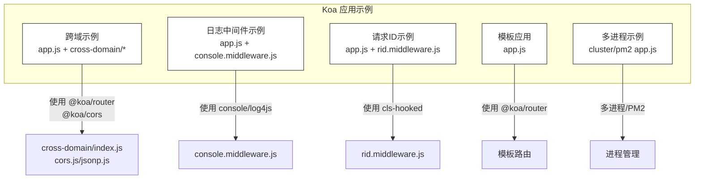
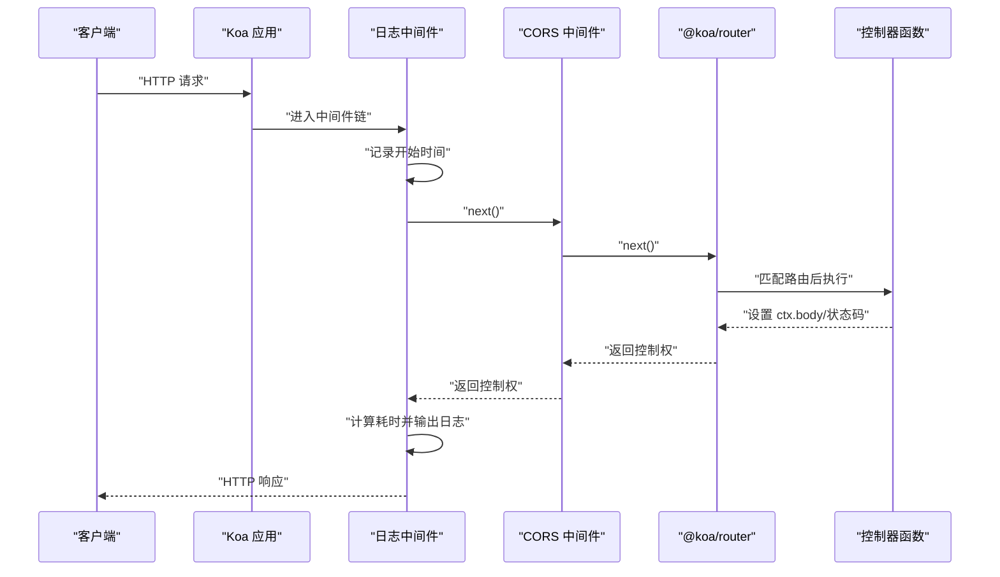
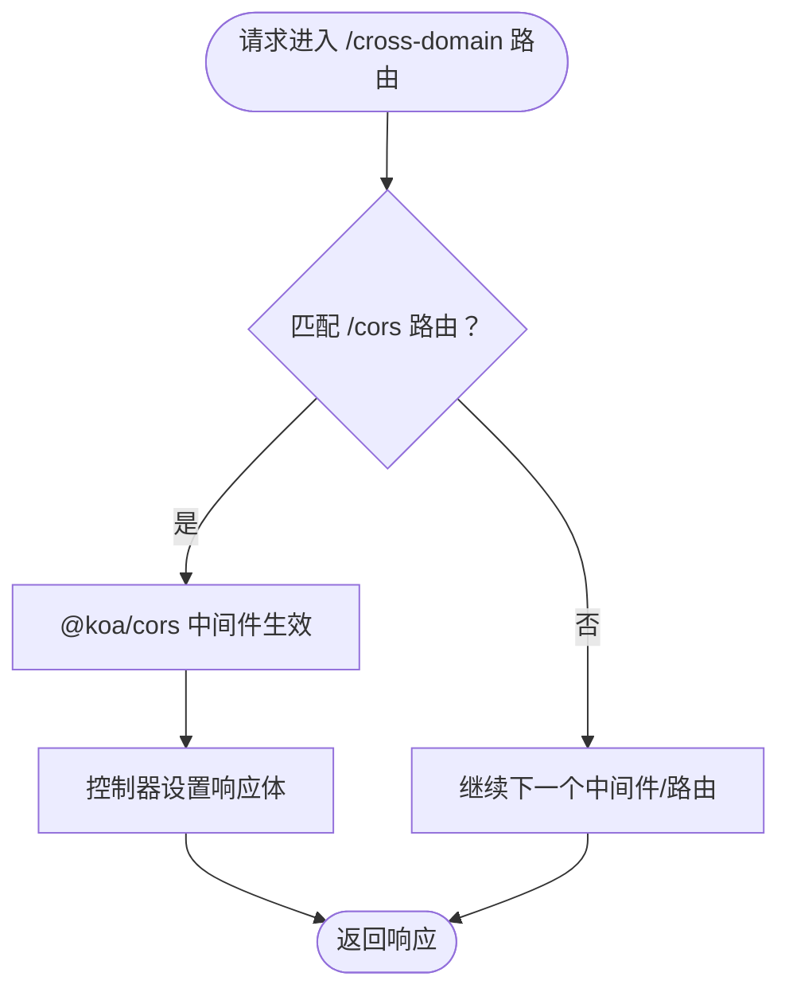
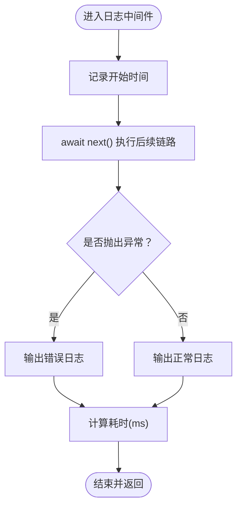
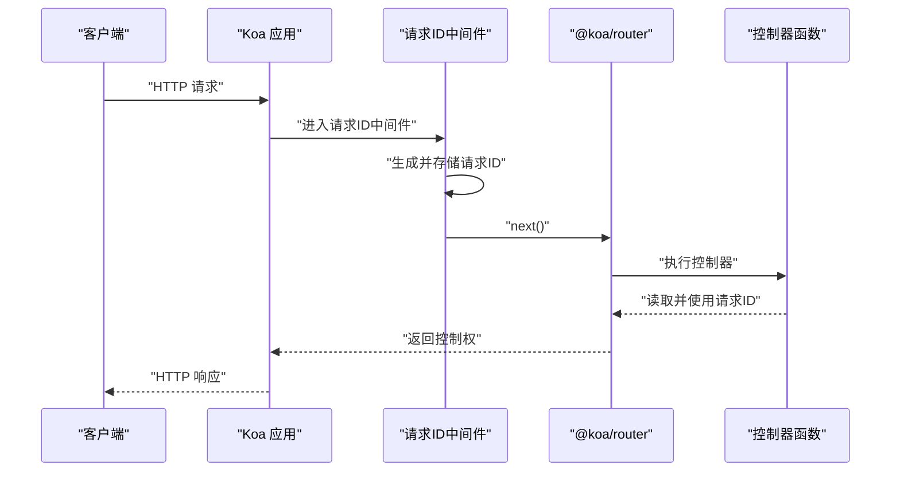
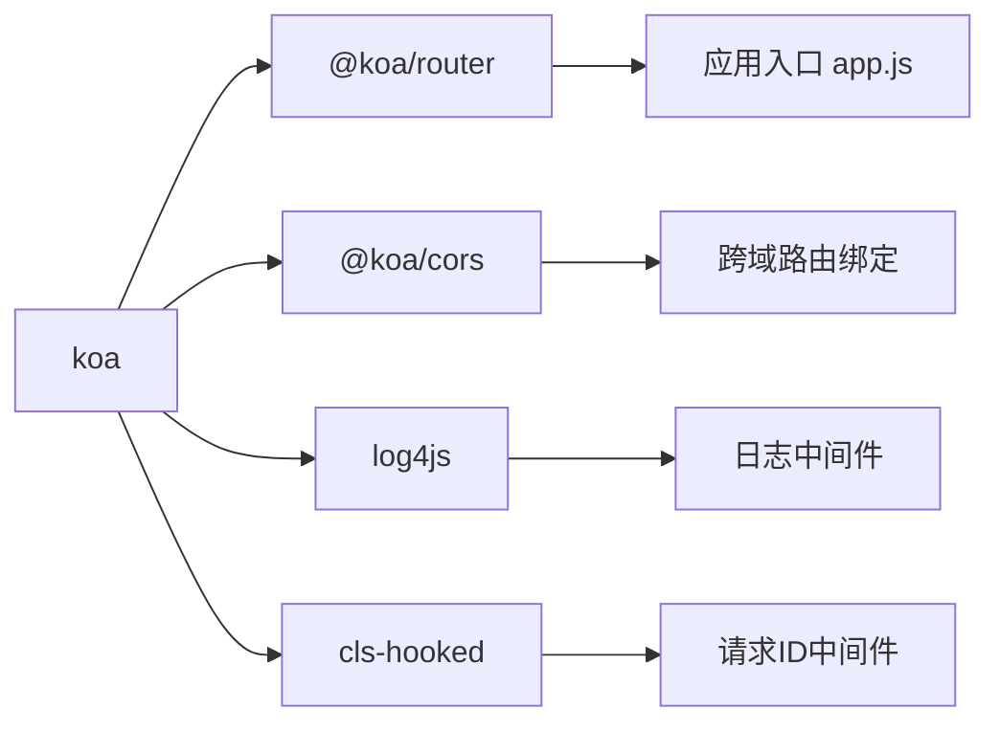

# Koa API接口

<cite>
**本文引用的文件**
- [app.js（跨域示例）](file://practice/nodejs-service/koa/cross-domain/app.js)
- [index.js（跨域路由入口）](file://practice/nodejs-service/koa/cross-domain/cross-domain/index.js)
- [cors.js（CORS中间件绑定）](file://practice/nodejs-service/koa/cross-domain/cross-domain/cors.js)
- [jsonp.js（JSONP实现）](file://practice/nodejs-service/koa/cross-domain/cross-domain/jsonp.js)
- [package.json（依赖声明）](file://practice/nodejs-service/koa/cross-domain/package.json)
- [app.js（日志中间件示例）](file://practice/nodejs-service/koa/request-log-console/app.js)
- [console.middleware.js（控制台日志中间件）](file://practice/nodejs-service/koa/request-log-console/middleware/console.middleware.js)
- [app.js（请求ID示例）](file://practice/nodejs-service/koa/request-id/app.js)
- [rid.middleware.js（请求ID中间件）](file://practice/nodejs-service/koa/request-id/middleware/rid.middleware.js)
- [log4js.middleware.js（log4js日志中间件）](file://practice/nodejs-service/koa/request-log-log4js/middleware/log4js.middleware.js)
- [app.js（模板应用）](file://practice/nodejs-service/koa/template/app.js)
- [app.js（集群多进程示例）](file://practice/nodejs-service/koa/multi-process-cluster/app.js)
- [app.js（PM2多进程示例）](file://practice/nodejs-service/koa/multi-process-pm2/app.js)
</cite>

## 目录
1. [简介](#简介)
2. [项目结构](#项目结构)
3. [核心组件](#核心组件)
4. [架构总览](#架构总览)
5. [详细组件分析](#详细组件分析)
6. [依赖关系分析](#依赖关系分析)
7. [性能考虑](#性能考虑)
8. [故障排查指南](#故障排查指南)
9. [结论](#结论)
10. [附录](#附录)

## 简介
本文件系统性梳理基于 Koa.js 的异步 API 接口实现，重点覆盖以下主题：
- 中间件链式调用与上下文处理
- Koa 异步中间件模式与 Express 中间件的差异与优势
- CORS 跨域处理的 Koa 实现（含 @koa/cors 集成）
- 完整中间件配置示例：日志中间件（控制台与 log4js）、请求 ID 中间件、CORS 中间件
- 错误处理与 async/await 使用
- Koa 的简洁性与灵活性特点

## 项目结构
该仓库在 practice/nodejs-service/koa 下提供了多个最小可运行示例，涵盖：
- 跨域示例（CORS 与 JSONP）
- 日志中间件示例（控制台与 log4js）
- 请求 ID 示例（基于 CLS）
- 模板应用（基础 Koa + Router）
- 多进程部署示例（cluster 与 pm2）

图表来源
- [app.js（跨域示例）:1-69](file://practice/nodejs-service/koa/cross-domain/app.js#L1-L69)
- [index.js（跨域路由入口）:1-22](file://practice/nodejs-service/koa/cross-domain/cross-domain/index.js#L1-L22)
- [cors.js（CORS中间件绑定）:1-14](file://practice/nodejs-service/koa/cross-domain/cross-domain/cors.js#L1-L14)
- [jsonp.js（JSONP实现）:1-26](file://practice/nodejs-service/koa/cross-domain/cross-domain/jsonp.js#L1-L26)
- [app.js（日志中间件示例）:1-59](file://practice/nodejs-service/koa/request-log-console/app.js#L1-L59)
- [console.middleware.js（控制台日志中间件）:1-61](file://practice/nodejs-service/koa/request-log-console/middleware/console.middleware.js#L1-L61)
- [app.js（请求ID示例）:1-70](file://practice/nodejs-service/koa/request-id/app.js#L1-L70)
- [rid.middleware.js（请求ID中间件）:1-35](file://practice/nodejs-service/koa/request-id/middleware/rid.middleware.js#L1-L35)
- [app.js（模板应用）:1-65](file://practice/nodejs-service/koa/template/app.js#L1-L65)
- [app.js（集群多进程示例）:1-65](file://practice/nodejs-service/koa/multi-process-cluster/app.js#L1-L65)
- [app.js（PM2多进程示例）:1-65](file://practice/nodejs-service/koa/multi-process-pm2/app.js#L1-L65)

章节来源
- [app.js（跨域示例）:1-69](file://practice/nodejs-service/koa/cross-domain/app.js#L1-L69)
- [app.js（日志中间件示例）:1-59](file://practice/nodejs-service/koa/request-log-console/app.js#L1-L59)
- [app.js（请求ID示例）:1-70](file://practice/nodejs-service/koa/request-id/app.js#L1-L70)
- [app.js（模板应用）:1-65](file://practice/nodejs-service/koa/template/app.js#L1-L65)
- [app.js（集群多进程示例）:1-65](file://practice/nodejs-service/koa/multi-process-cluster/app.js#L1-L65)
- [app.js（PM2多进程示例）:1-65](file://practice/nodejs-service/koa/multi-process-pm2/app.js#L1-L65)

## 核心组件
- 应用实例与中间件注册
  - 在应用层通过 app.use 注册中间件，支持 async/await 与 next 调用，形成标准的洋葱模型链式调用。
  - 参考路径：[app.js（跨域示例）:13-23](file://practice/nodejs-service/koa/cross-domain/app.js#L13-L23)，[app.js（模板应用）:13-21](file://practice/nodejs-service/koa/template/app.js#L13-L21)

- 路由与控制器
  - 使用 @koa/router 定义路由，控制器函数接收 ctx（上下文）与 next（下一个中间件），返回响应或继续链路。
  - 参考路径：[app.js（跨域示例）:26-38](file://practice/nodejs-service/koa/cross-domain/app.js#L26-L38)，[index.js（跨域路由入口）:5-19](file://practice/nodejs-service/koa/cross-domain/cross-domain/index.js#L5-L19)

- CORS 中间件
  - 通过 @koa/cors 对指定路由启用跨域，支持自定义选项对象。
  - 参考路径：[@koa/cors 引入与使用:1-14](file://practice/nodejs-service/koa/cross-domain/cross-domain/cors.js#L1-L14)

- 日志中间件
  - 控制台日志中间件：格式化输出请求信息与耗时，捕获异常并输出错误日志。
  - log4js 日志中间件：基于 log4js 连接器输出结构化日志。
  - 参考路径：[console.middleware.js:28-60](file://practice/nodejs-service/koa/request-log-console/middleware/console.middleware.js#L28-L60)，[log4js.middleware.js:22-38](file://practice/nodejs-service/koa/request-log-log4js/middleware/log4js.middleware.js#L22-L38)

- 请求 ID 中间件
  - 基于 cls-hooked 维护请求级上下文，生成唯一请求 ID 并贯穿后续中间件与控制器。
  - 参考路径：[rid.middleware.js:19-28](file://practice/nodejs-service/koa/request-id/middleware/rid.middleware.js#L19-L28)

章节来源
- [app.js（跨域示例）:13-38](file://practice/nodejs-service/koa/cross-domain/app.js#L13-L38)
- [index.js（跨域路由入口）:5-19](file://practice/nodejs-service/koa/cross-domain/cross-domain/index.js#L5-L19)
- [cors.js（CORS中间件绑定）:1-14](file://practice/nodejs-service/koa/cross-domain/cross-domain/cors.js#L1-L14)
- [console.middleware.js（控制台日志中间件）:28-60](file://practice/nodejs-service/koa/request-log-console/middleware/console.middleware.js#L28-L60)
- [log4js.middleware.js（log4js日志中间件）:22-38](file://practice/nodejs-service/koa/request-log-log4js/middleware/log4js.middleware.js#L22-L38)
- [rid.middleware.js（请求ID中间件）:19-28](file://practice/nodejs-service/koa/request-id/middleware/rid.middleware.js#L19-L28)

## 架构总览
下图展示一个典型请求在 Koa 应用中的处理流程，包含中间件链、路由匹配与响应返回。

图表来源
- [app.js（跨域示例）:13-38](file://practice/nodejs-service/koa/cross-domain/app.js#L13-L38)
- [cors.js（CORS中间件绑定）:8-10](file://practice/nodejs-service/koa/cross-domain/cross-domain/cors.js#L8-L10)
- [console.middleware.js（控制台日志中间件）:28-60](file://practice/nodejs-service/koa/request-log-console/middleware/console.middleware.js#L28-L60)

## 详细组件分析

### CORS 跨域处理（@koa/cors）
- 设计要点
  - 将 CORS 中间件绑定到特定路由，实现“按需启用”跨域，避免全局污染。
  - 支持自定义 CORS 选项对象，满足不同场景需求。
- 关键实现位置
  - 绑定 CORS 到路由：[cors.js（CORS中间件绑定）:3-12](file://practice/nodejs-service/koa/cross-domain/cross-domain/cors.js#L3-L12)
  - 路由入口聚合：[index.js（跨域路由入口）:11-19](file://practice/nodejs-service/koa/cross-domain/cross-domain/index.js#L11-L19)
  - 应用集成：[app.js（跨域示例）:36-38](file://practice/nodejs-service/koa/cross-domain/app.js#L36-L38)

图表来源
- [cors.js（CORS中间件绑定）:3-12](file://practice/nodejs-service/koa/cross-domain/cross-domain/cors.js#L3-L12)
- [index.js（跨域路由入口）:11-19](file://practice/nodejs-service/koa/cross-domain/cross-domain/index.js#L11-L19)

章节来源
- [cors.js（CORS中间件绑定）:1-14](file://practice/nodejs-service/koa/cross-domain/cross-domain/cors.js#L1-L14)
- [index.js（跨域路由入口）:1-22](file://practice/nodejs-service/koa/cross-domain/cross-domain/index.js#L1-L22)
- [app.js（跨域示例）:36-38](file://practice/nodejs-service/koa/cross-domain/app.js#L36-L38)

### 日志中间件（控制台与 log4js）
- 控制台日志中间件
  - 记录时间戳、PID、IP、方法、URL、状态码、响应长度、耗时、来源页与 UA。
  - 捕获异常并在日志中输出错误对象。
  - 参考路径：[console.middleware.js:28-60](file://practice/nodejs-service/koa/request-log-console/middleware/console.middleware.js#L28-L60)
- log4js 日志中间件
  - 基于 log4js connectLogger 输出结构化日志，格式化字段与布局可配置。
  - 参考路径：[log4js.middleware.js:22-38](file://practice/nodejs-service/koa/request-log-log4js/middleware/log4js.middleware.js#L22-L38)

图表来源
- [console.middleware.js（控制台日志中间件）:28-60](file://practice/nodejs-service/koa/request-log-console/middleware/console.middleware.js#L28-L60)
- [log4js.middleware.js（log4js日志中间件）:22-38](file://practice/nodejs-service/koa/request-log-log4js/middleware/log4js.middleware.js#L22-L38)

章节来源
- [console.middleware.js（控制台日志中间件）:1-61](file://practice/nodejs-service/koa/request-log-console/middleware/console.middleware.js#L1-L61)
- [log4js.middleware.js（log4js日志中间件）:1-39](file://practice/nodejs-service/koa/request-log-log4js/middleware/log4js.middleware.js#L1-L39)
- [app.js（日志中间件示例）:13-28](file://practice/nodejs-service/koa/request-log-console/app.js#L13-L28)

### 请求 ID 中间件（CLS）
- 设计要点
  - 使用 cls-hooked 创建命名空间，为每个请求生成唯一 ID 并存入上下文。
  - 提供 get/set 辅助方法，便于后续中间件读取。
- 关键实现位置
  - 中间件逻辑与导出：[rid.middleware.js:19-34](file://practice/nodejs-service/koa/request-id/middleware/rid.middleware.js#L19-L34)
  - 应用集成与使用：[app.js（请求ID示例）:13-39](file://practice/nodejs-service/koa/request-id/app.js#L13-L39)

图表来源
- [rid.middleware.js（请求ID中间件）:19-34](file://practice/nodejs-service/koa/request-id/middleware/rid.middleware.js#L19-L34)
- [app.js（请求ID示例）:13-39](file://practice/nodejs-service/koa/request-id/app.js#L13-L39)

章节来源
- [rid.middleware.js（请求ID中间件）:1-35](file://practice/nodejs-service/koa/request-id/middleware/rid.middleware.js#L1-L35)
- [app.js（请求ID示例）:1-70](file://practice/nodejs-service/koa/request-id/app.js#L1-L70)

### 模板应用与路由组织
- 模板应用展示了最简 Koa + Router 的组合：注册日志中间件、定义路由、挂载路由并启动服务。
- 参考路径：[app.js（模板应用）:13-34](file://practice/nodejs-service/koa/template/app.js#L13-L34)

章节来源
- [app.js（模板应用）:1-65](file://practice/nodejs-service/koa/template/app.js#L1-L65)

### 多进程部署（Cluster 与 PM2）
- 两个示例展示了多进程部署思路，均采用相同的 Koa 启动模式，差异在于进程管理方式。
- 参考路径：
  - [app.js（集群多进程示例）:1-65](file://practice/nodejs-service/koa/multi-process-cluster/app.js#L1-L65)
  - [app.js（PM2多进程示例）:1-65](file://practice/nodejs-service/koa/multi-process-pm2/app.js#L1-L65)

章节来源
- [app.js（集群多进程示例）:1-65](file://practice/nodejs-service/koa/multi-process-cluster/app.js#L1-L65)
- [app.js（PM2多进程示例）:1-65](file://practice/nodejs-service/koa/multi-process-pm2/app.js#L1-L65)

## 依赖关系分析
- 核心依赖
  - koa：Web 框架核心
  - @koa/router：路由模块
  - @koa/cors：CORS 中间件
  - log4js：结构化日志
  - cls-hooked：请求上下文隔离
- 参考路径：[package.json（依赖声明）:10-21](file://practice/nodejs-service/koa/cross-domain/package.json#L10-L21)

图表来源
- [package.json（依赖声明）:10-21](file://practice/nodejs-service/koa/cross-domain/package.json#L10-L21)
- [cors.js（CORS中间件绑定）:1-1](file://practice/nodejs-service/koa/cross-domain/cross-domain/cors.js#L1-L1)
- [log4js.middleware.js（log4js日志中间件）:1-1](file://practice/nodejs-service/koa/request-log-log4js/middleware/log4js.middleware.js#L1-L1)
- [rid.middleware.js（请求ID中间件）:7-10](file://practice/nodejs-service/koa/request-id/middleware/rid.middleware.js#L7-L10)

章节来源
- [package.json（依赖声明）:1-23](file://practice/nodejs-service/koa/cross-domain/package.json#L1-L23)

## 性能考虑
- 中间件顺序
  - 将耗时操作（如日志、鉴权）置于链路靠前位置，减少后续中间件负担。
  - 将路由匹配放在日志之后，确保路由命中率统计准确。
- 异常处理
  - 使用 try/catch 或中间件统一捕获异常，避免未处理异常导致进程退出。
- 资源释放
  - 在中间件中及时清理定时器、流等资源，防止内存泄漏。
- 并发与锁
  - 使用 CLS 等机制保证请求级上下文隔离，避免并发场景下的数据串扰。

## 故障排查指南
- 端口占用与权限
  - 监听错误处理：区分权限不足与端口被占用，分别输出提示并退出进程。
  - 参考路径：[app.js（跨域示例）监听错误处理:43-62](file://practice/nodejs-service/koa/cross-domain/app.js#L43-L62)
- CORS 生效范围
  - 确认 @koa/cors 是否正确绑定到目标路由，避免全局 CORS 导致的安全风险。
  - 参考路径：[cors.js（CORS中间件绑定）:3-12](file://practice/nodejs-service/koa/cross-domain/cross-domain/cors.js#L3-L12)
- 日志中间件异常
  - 若日志中间件抛错，检查格式化字段与外部依赖（如 log4js 配置）。
  - 参考路径：[console.middleware.js（控制台日志中间件）:32-36](file://practice/nodejs-service/koa/request-log-console/middleware/console.middleware.js#L32-L36)
- 请求 ID 不可见
  - 确认中间件已注册且控制器中正确读取命名空间中的值。
  - 参考路径：[rid.middleware.js（请求ID中间件）:19-28](file://practice/nodejs-service/koa/request-id/middleware/rid.middleware.js#L19-L28)，[app.js（请求ID示例）:34-37](file://practice/nodejs-service/koa/request-id/app.js#L34-L37)

章节来源
- [app.js（跨域示例）监听错误处理:43-62](file://practice/nodejs-service/koa/cross-domain/app.js#L43-L62)
- [cors.js（CORS中间件绑定）:3-12](file://practice/nodejs-service/koa/cross-domain/cross-domain/cors.js#L3-L12)
- [console.middleware.js（控制台日志中间件）:32-36](file://practice/nodejs-service/koa/request-log-console/middleware/console.middleware.js#L32-L36)
- [rid.middleware.js（请求ID中间件）:19-28](file://practice/nodejs-service/koa/request-id/middleware/rid.middleware.js#L19-L28)
- [app.js（请求ID示例）:34-37](file://practice/nodejs-service/koa/request-id/app.js#L34-L37)

## 结论
- Koa 的异步中间件模式以 async/await 与 next 为核心，提供清晰的洋葱模型链式调用，便于分层解耦与复用。
- 相较于 Express，Koa 更加轻量与灵活，不内置中间件生态，开发者可按需选择高质量社区包（如 @koa/cors、@koa/router）。
- 通过合理组织中间件顺序、完善异常处理与日志体系，可在保证性能的同时提升可观测性与可维护性。
- 跨域处理建议按路由粒度启用，结合请求 ID 与结构化日志，快速定位问题并保障安全边界。

## 附录
- 完整中间件配置清单（概念性说明）
  - 日志中间件：控制台日志中间件、log4js 日志中间件
  - 跨域中间件：@koa/cors（按路由启用）
  - 请求 ID 中间件：cls-hooked（请求级上下文隔离）
  - 路由：@koa/router（路由定义与挂载）
- 集成步骤（概念性说明）
  - 在应用入口注册中间件（顺序重要）
  - 定义路由并绑定控制器
  - 启动服务并监听错误事件
- 最佳实践
  - 将耗时操作前置，确保日志与监控覆盖全链路
  - 明确 CORS 生效范围，避免全局放宽策略
  - 使用 CLS 保持请求上下文一致性，便于追踪与审计