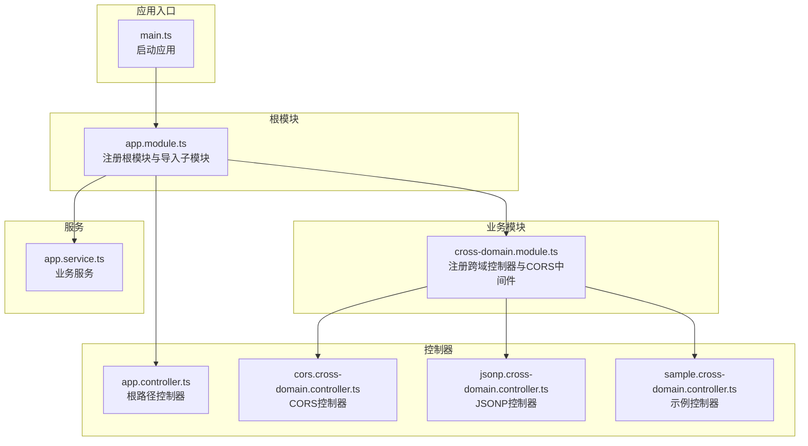
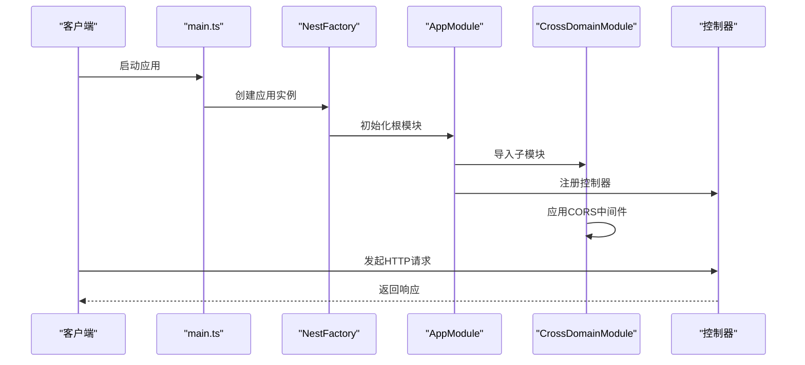
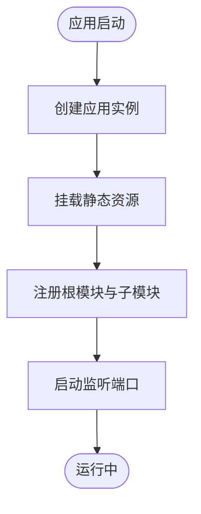
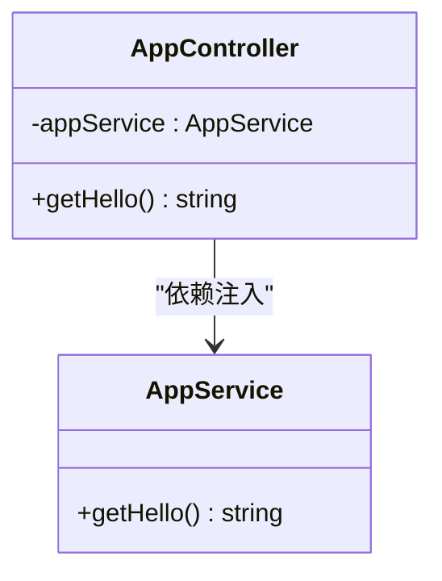
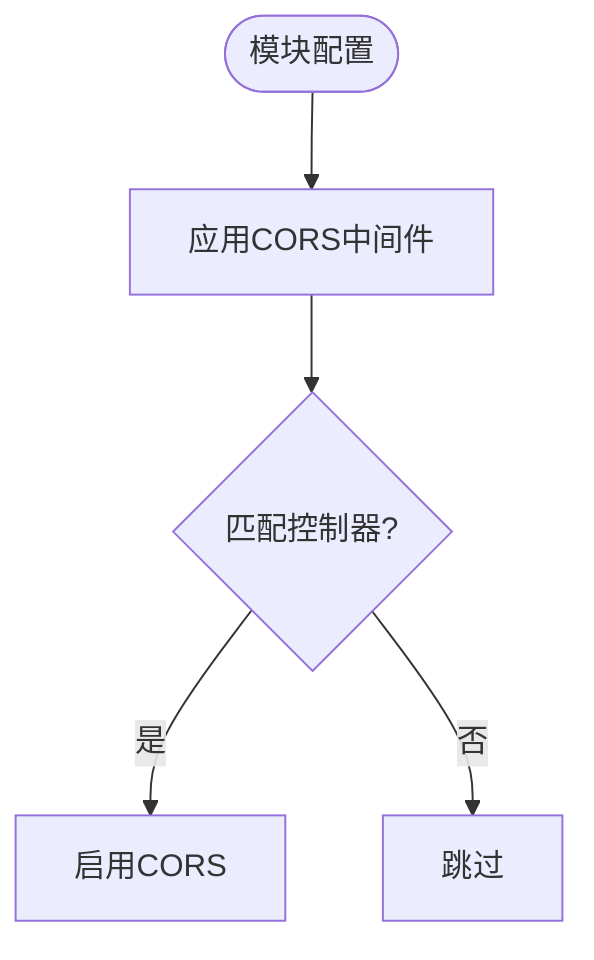
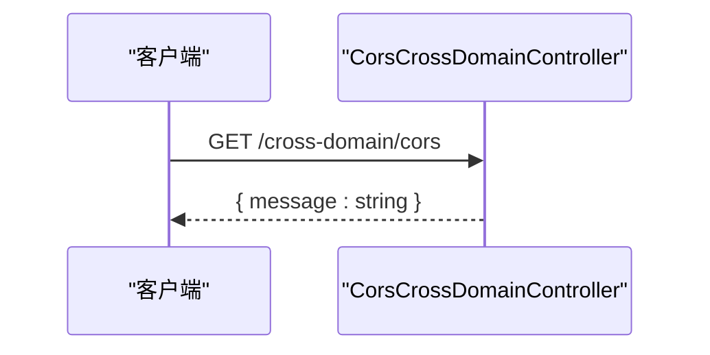
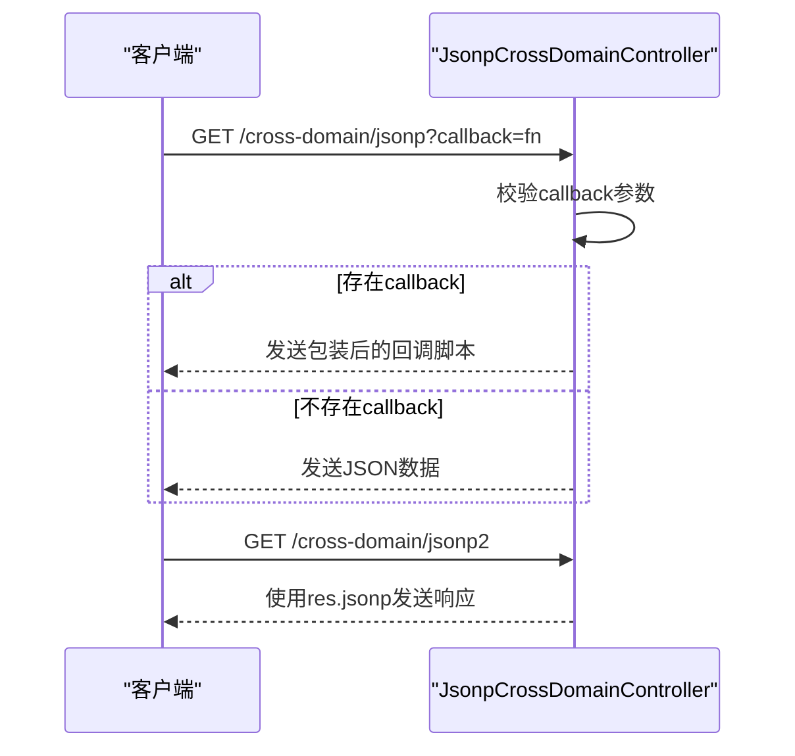
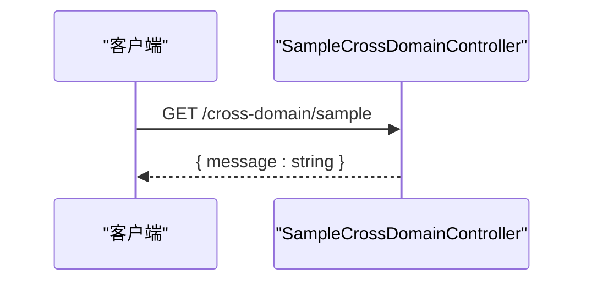
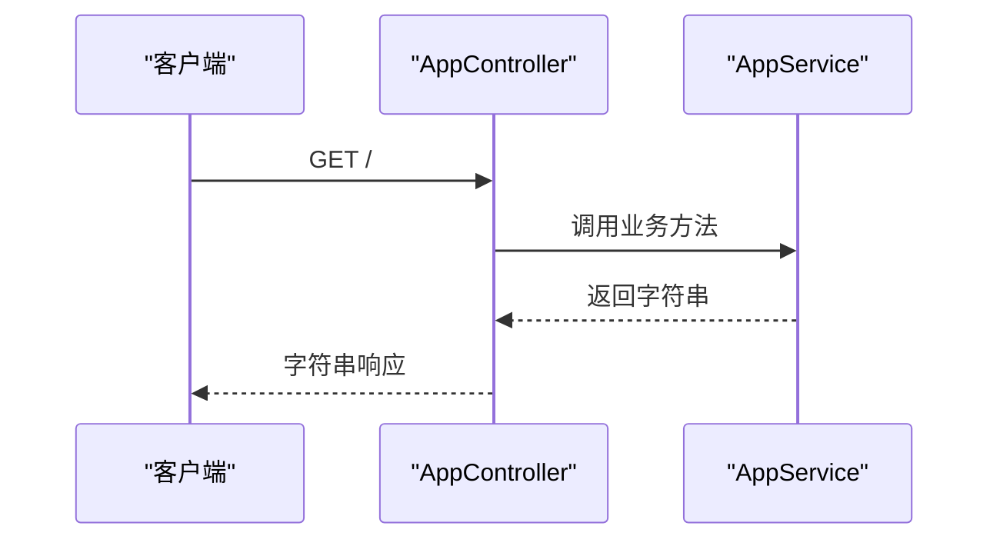
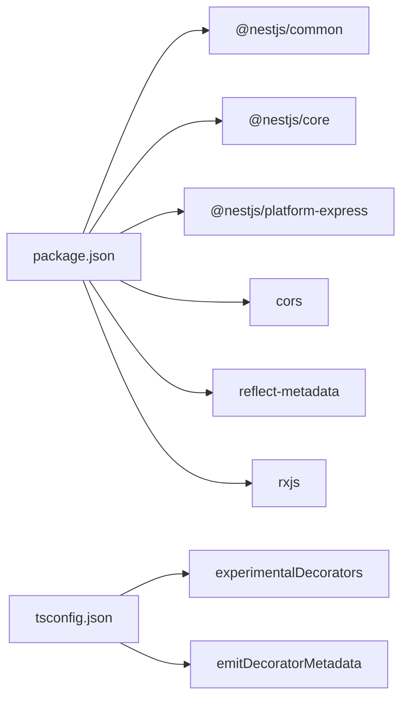

# NestJS API接口

<cite>
**本文档引用的文件**
- [app.controller.ts](file://practice/nodejs-service/nest/cross-domain/src/app.controller.ts)
- [app.module.ts](file://practice/nodejs-service/nest/cross-domain/src/app.module.ts)
- [app.service.ts](file://practice/nodejs-service/nest/cross-domain/src/app.service.ts)
- [main.ts](file://practice/nodejs-service/nest/cross-domain/src/main.ts)
- [cors.cross-domain.controller.ts](file://practice/nodejs-service/nest/cross-domain/src/cross-domain/cors.cross-domain.controller.ts)
- [jsonp.cross-domain.controller.ts](file://practice/nodejs-service/nest/cross-domain/src/cross-domain/jsonp.cross-domain.controller.ts)
- [sample.cross-domain.controller.ts](file://practice/nodejs-service/nest/cross-domain/src/cross-domain/sample.cross-domain.controller.ts)
- [cross-domain.module.ts](file://practice/nodejs-service/nest/cross-domain/src/cross-domain/cross-domain.module.ts)
- [package.json](file://practice/nodejs-service/nest/cross-domain/package.json)
- [tsconfig.json](file://practice/nodejs-service/nest/cross-domain/tsconfig.json)
- [nest-cli.json](file://practice/nodejs-service/nest/cross-domain/nest-cli.json)
</cite>

## 目录
1. [简介](#简介)
2. [项目结构](#项目结构)
3. [核心组件](#核心组件)
4. [架构总览](#架构总览)
5. [详细组件分析](#详细组件分析)
6. [依赖关系分析](#依赖关系分析)
7. [性能考虑](#性能考虑)
8. [故障排除指南](#故障排除指南)
9. [结论](#结论)

## 简介
本文件面向基于 NestJS 的 TypeScript API 接口实现，聚焦于跨域场景下的控制器设计与模块化架构。文档覆盖以下要点：
- 控制器装饰器与路由映射：@Controller、@Get 等
- 依赖注入与模块系统：@Module、@Injectable、NestFactory
- 跨域实现策略：CORS 中间件在模块级应用，以及 JSONP 回调处理
- 请求参数与响应数据类型：通过装饰器与返回值类型约束
- 异常过滤器与错误处理：结合中间件与控制器层的实践建议

该实现以最小示例展示了 NestJS 在跨域场景中的典型用法，便于快速理解控制器、服务与模块之间的协作关系。

## 项目结构
该项目采用标准 NestJS 结构，包含入口文件、根模块、控制器与服务，以及一个专门用于演示跨域功能的子模块。静态资源通过 HTTP 适配器挂载到指定目录。

**图表来源**
- [main.ts:12-18](file://practice/nodejs-service/nest/cross-domain/src/main.ts#L12-L18)
- [app.module.ts:13-18](file://practice/nodejs-service/nest/cross-domain/src/app.module.ts#L13-L18)
- [cross-domain.module.ts:9-13](file://practice/nodejs-service/nest/cross-domain/src/cross-domain/cross-domain.module.ts#L9-L13)

**章节来源**
- [main.ts:12-18](file://practice/nodejs-service/nest/cross-domain/src/main.ts#L12-L18)
- [app.module.ts:13-18](file://practice/nodejs-service/nest/cross-domain/src/app.module.ts#L13-L18)
- [cross-domain.module.ts:9-13](file://practice/nodejs-service/nest/cross-domain/src/cross-domain/cross-domain.module.ts#L9-L13)

## 核心组件
本节概述项目中的关键组件及其职责：
- 入口文件：负责创建 Nest 应用实例、挂载静态资源与启动监听端口
- 根模块：声明控制器与服务，导入子模块
- 业务服务：提供业务逻辑方法（如问候语）
- 跨域模块：集中管理跨域控制器与 CORS 中间件
- 控制器：暴露 HTTP 接口，处理请求并返回响应

**章节来源**
- [main.ts:12-18](file://practice/nodejs-service/nest/cross-domain/src/main.ts#L12-L18)
- [app.module.ts:13-18](file://practice/nodejs-service/nest/cross-domain/src/app.module.ts#L13-L18)
- [app.service.ts:9-14](file://practice/nodejs-service/nest/cross-domain/src/app.service.ts#L9-L14)
- [cross-domain.module.ts:9-24](file://practice/nodejs-service/nest/cross-domain/src/cross-domain/cross-domain.module.ts#L9-L24)

## 架构总览
下图展示从应用启动到请求处理的关键流程，包括模块装配、中间件应用与控制器路由分发。

**图表来源**
- [main.ts:12-18](file://practice/nodejs-service/nest/cross-domain/src/main.ts#L12-L18)
- [app.module.ts:13-18](file://practice/nodejs-service/nest/cross-domain/src/app.module.ts#L13-L18)
- [cross-domain.module.ts:15-23](file://practice/nodejs-service/nest/cross-domain/src/cross-domain/cross-domain.module.ts#L15-L23)

## 详细组件分析

### 根模块与入口
- 入口文件通过 NestFactory 创建应用实例，设置静态资源目录，并监听端口
- 根模块导入跨域子模块，声明控制器与服务，形成模块化边界

**图表来源**
- [main.ts:12-18](file://practice/nodejs-service/nest/cross-domain/src/main.ts#L12-L18)
- [app.module.ts:13-18](file://practice/nodejs-service/nest/cross-domain/src/app.module.ts#L13-L18)

**章节来源**
- [main.ts:12-18](file://practice/nodejs-service/nest/cross-domain/src/main.ts#L12-L18)
- [app.module.ts:13-18](file://practice/nodejs-service/nest/cross-domain/src/app.module.ts#L13-L18)

### 业务服务
- 使用 @Injectable 装饰的服务类，提供业务方法供控制器调用
- 通过构造函数注入到控制器中，体现依赖注入原则

**图表来源**
- [app.service.ts:9-14](file://practice/nodejs-service/nest/cross-domain/src/app.service.ts#L9-L14)
- [app.controller.ts:11-19](file://practice/nodejs-service/nest/cross-domain/src/app.controller.ts#L11-L19)

**章节来源**
- [app.service.ts:9-14](file://practice/nodejs-service/nest/cross-domain/src/app.service.ts#L9-L14)
- [app.controller.ts:11-19](file://practice/nodejs-service/nest/cross-domain/src/app.controller.ts#L11-L19)

### 跨域模块与中间件
- 子模块集中声明多个控制器，并在 configure 钩子中为特定控制器应用 CORS 中间件
- 通过 MiddlewareConsumer 将 cors 中间件绑定到 CorsCrossDomainController

**图表来源**
- [cross-domain.module.ts:15-23](file://practice/nodejs-service/nest/cross-domain/src/cross-domain/cross-domain.module.ts#L15-L23)

**章节来源**
- [cross-domain.module.ts:9-24](file://practice/nodejs-service/nest/cross-domain/src/cross-domain/cross-domain.module.ts#L9-L24)

### CORS 控制器
- 基于 @Controller('/cross-domain') 定义路由前缀
- 使用 @Get('/cors') 暴露单一路由，返回固定格式对象

**图表来源**
- [cors.cross-domain.controller.ts:3-9](file://practice/nodejs-service/nest/cross-domain/src/cross-domain/cors.cross-domain.controller.ts#L3-L9)

**章节来源**
- [cors.cross-domain.controller.ts:3-9](file://practice/nodejs-service/nest/cross-domain/src/cross-domain/cors.cross-domain.controller.ts#L3-L9)

### JSONP 控制器
- 支持两种 JSONP 变体：
  - 手动拼装回调脚本，设置响应头并发送文本
  - 使用 @Res() 获取原生响应对象，调用 res.jsonp 自动处理回调
- 通过 @Query('callback') 获取查询参数

**图表来源**
- [jsonp.cross-domain.controller.ts:6-24](file://practice/nodejs-service/nest/cross-domain/src/cross-domain/jsonp.cross-domain.controller.ts#L6-L24)

**章节来源**
- [jsonp.cross-domain.controller.ts:1-26](file://practice/nodejs-service/nest/cross-domain/src/cross-domain/jsonp.cross-domain.controller.ts#L1-L26)

### 示例控制器
- 提供基础路由示例，展示简单 GET 接口与对象响应

**图表来源**
- [sample.cross-domain.controller.ts:3-9](file://practice/nodejs-service/nest/cross-domain/src/cross-domain/sample.cross-domain.controller.ts#L3-L9)

**章节来源**
- [sample.cross-domain.controller.ts:3-9](file://practice/nodejs-service/nest/cross-domain/src/cross-domain/sample.cross-domain.controller.ts#L3-L9)

### 根控制器与服务交互
- 根控制器通过构造函数注入服务，调用业务方法并返回结果
- 展示了依赖注入在控制器中的典型用法

**图表来源**
- [app.controller.ts:11-19](file://practice/nodejs-service/nest/cross-domain/src/app.controller.ts#L11-L19)
- [app.service.ts:9-14](file://practice/nodejs-service/nest/cross-domain/src/app.service.ts#L9-L14)

**章节来源**
- [app.controller.ts:11-19](file://practice/nodejs-service/nest/cross-domain/src/app.controller.ts#L11-L19)
- [app.service.ts:9-14](file://practice/nodejs-service/nest/cross-domain/src/app.service.ts#L9-L14)

## 依赖关系分析
- 运行时依赖：@nestjs/common、@nestjs/core、@nestjs/platform-express、cors、reflect-metadata、rxjs
- 开发时依赖：Jest 测试框架、ESLint、TypeScript 编译器等
- TypeScript 编译选项启用实验性装饰器与元数据反射，支持 NestJS 装饰器体系

**图表来源**
- [package.json:22-29](file://practice/nodejs-service/nest/cross-domain/package.json#L22-L29)
- [tsconfig.json:6-7](file://practice/nodejs-service/nest/cross-domain/tsconfig.json#L6-L7)

**章节来源**
- [package.json:22-52](file://practice/nodejs-service/nest/cross-domain/package.json#L22-L52)
- [tsconfig.json:2-21](file://practice/nodejs-service/nest/cross-domain/tsconfig.json#L2-L21)

## 性能考虑
- 中间件应用范围：当前仅对特定控制器应用 CORS 中间件，避免全局开销
- 静态资源优化：通过 HTTP 适配器挂载静态资源，减少额外路由处理
- 路由粒度：控制器按功能拆分，降低单控制器复杂度，提升可维护性
- 类型安全：利用 TypeScript 严格模式与装饰器类型推断，减少运行时错误

## 故障排除指南
- CORS 不生效：检查模块中是否正确应用中间件并绑定目标控制器
- JSONP 回调无效：确认查询参数名称与类型，确保 res.jsonp 使用正确
- 静态资源无法访问：核对静态资源目录路径与 HTTP 适配器配置
- 启动失败：检查模块导入顺序与依赖版本兼容性

## 结论
本项目以简洁的结构展示了 NestJS 在跨域场景下的最佳实践：通过模块化组织控制器与中间件，结合装饰器实现清晰的路由与依赖注入。该实现为后续扩展异常过滤器、拦截器与更复杂的业务逻辑提供了良好的基础。