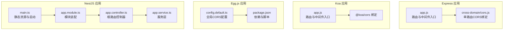
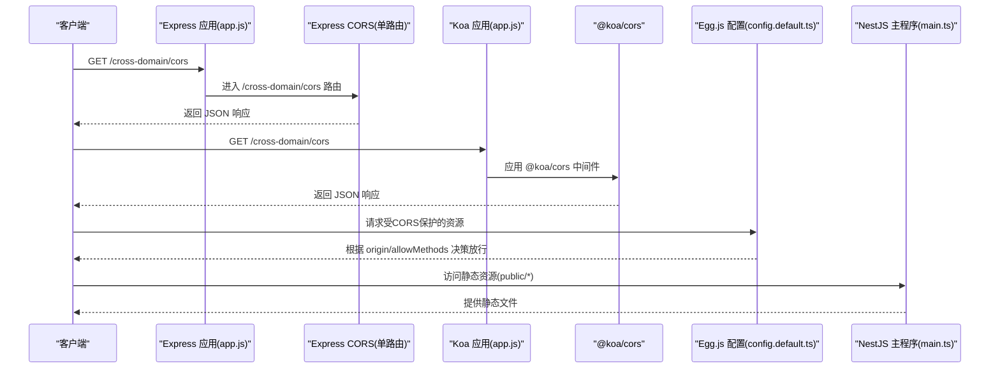
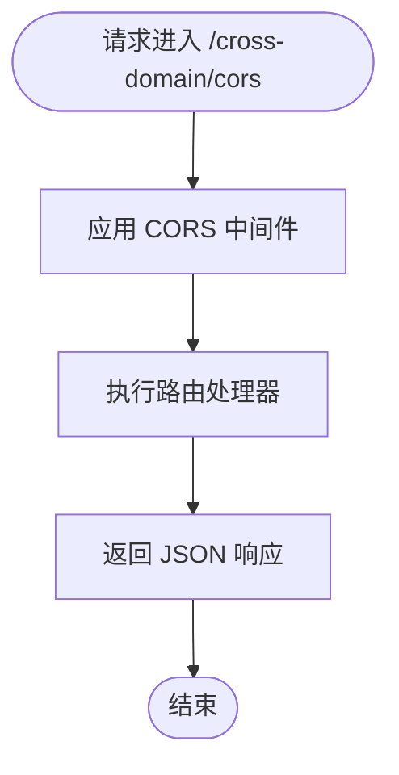
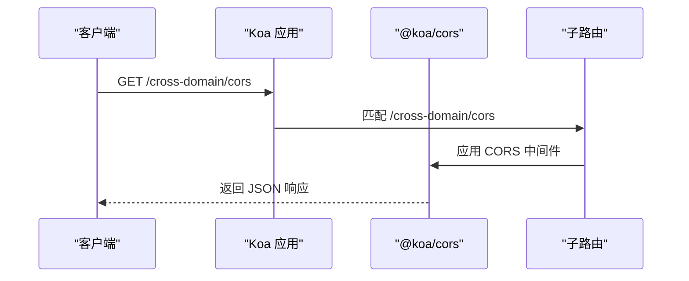
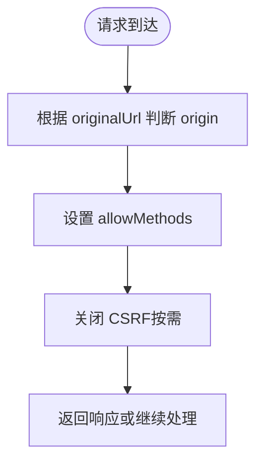
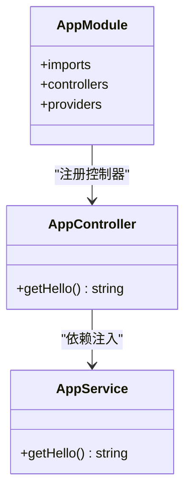
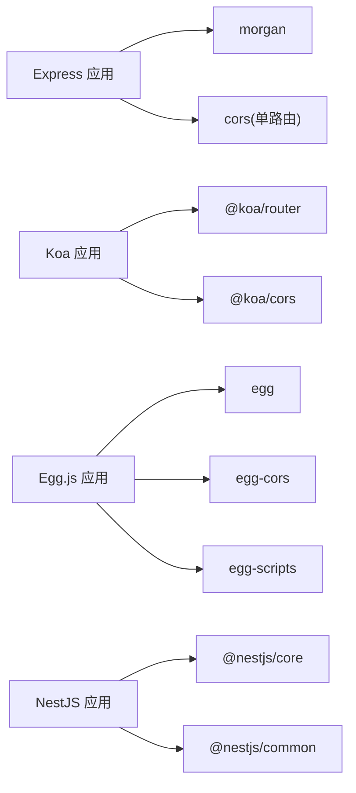

# 后端API接口

<cite>
**本文引用的文件**
- [practice/nodejs-service/express/cross-domain/app.js](file://practice/nodejs-service/express/cross-domain/app.js)
- [practice/nodejs-service/express/cross-domain/cross-domain/cors.js](file://practice/nodejs-service/express/cross-domain/cross-domain/cors.js)
- [practice/nodejs-service/koa/cross-domain/app.js](file://practice/nodejs-service/koa/cross-domain/app.js)
- [practice/nodejs-service/koa/cross-domain/cross-domain/cors.js](file://practice/nodejs-service/koa/cross-domain/cross-domain/cors.js)
- [practice/nodejs-service/egg/cross-domain/config/config.default.ts](file://practice/nodejs-service/egg/cross-domain/config/config.default.ts)
- [practice/nodejs-service/egg/cross-domain/package.json](file://practice/nodejs-service/egg/cross-domain/package.json)
- [practice/nodejs-service/nest/cross-domain/src/main.ts](file://practice/nodejs-service/nest/cross-domain/src/main.ts)
- [practice/nodejs-service/nest/cross-domain/src/app.controller.ts](file://practice/nodejs-service/nest/cross-domain/src/app.controller.ts)
- [practice/nodejs-service/nest/cross-domain/src/app.module.ts](file://practice/nodejs-service/nest/cross-domain/src/app.module.ts)
- [practice/nodejs-service/nest/cross-domain/src/app.service.ts](file://practice/nodejs-service/nest/cross-domain/src/app.service.ts)
</cite>

## 目录
1. [简介](#简介)
2. [项目结构](#项目结构)
3. [核心组件](#核心组件)
4. [架构总览](#架构总览)
5. [详细组件分析](#详细组件分析)
6. [依赖关系分析](#依赖关系分析)
7. [性能与可扩展性](#性能与可扩展性)
8. [故障排查指南](#故障排查指南)
9. [结论](#结论)
10. [附录：接口规范与示例](#附录接口规范与示例)

## 简介
本文件面向Egg.js、Express、Koa、NestJS四类Node.js后端框架，系统化梳理跨域处理（CORS、JSONP）与通用API接口的实现与使用方式，并给出标准化的RESTful接口规范模板，覆盖请求头、查询参数、请求体、响应格式、状态码、认证与安全、版本管理与向后兼容等要点。文档同时提供调用时序图与流程图，帮助开发者快速理解与集成。

## 项目结构
该仓库在 practice/nodejs-service 下提供了四套同构的“跨域示例”服务，分别对应不同框架：
- Express 跨域示例：提供路由挂载与CORS中间件绑定示例
- Koa 跨域示例：提供路由挂载与CORS中间件绑定示例
- Egg.js 跨域示例：通过配置启用全局CORS与白名单策略
- NestJS 跨域示例：通过模块与控制器组织跨域与静态资源

图表来源
- [practice/nodejs-service/express/cross-domain/app.js:1-41](file://practice/nodejs-service/express/cross-domain/app.js#L1-L41)
- [practice/nodejs-service/express/cross-domain/cross-domain/cors.js:1-16](file://practice/nodejs-service/express/cross-domain/cross-domain/cors.js#L1-L16)
- [practice/nodejs-service/koa/cross-domain/app.js:1-69](file://practice/nodejs-service/koa/cross-domain/app.js#L1-L69)
- [practice/nodejs-service/koa/cross-domain/cross-domain/cors.js:1-14](file://practice/nodejs-service/koa/cross-domain/cross-domain/cors.js#L1-L14)
- [practice/nodejs-service/egg/cross-domain/config/config.default.ts:1-49](file://practice/nodejs-service/egg/cross-domain/config/config.default.ts#L1-L49)
- [practice/nodejs-service/egg/cross-domain/package.json:1-58](file://practice/nodejs-service/egg/cross-domain/package.json#L1-L58)
- [practice/nodejs-service/nest/cross-domain/src/main.ts:1-19](file://practice/nodejs-service/nest/cross-domain/src/main.ts#L1-L19)
- [practice/nodejs-service/nest/cross-domain/src/app.module.ts:1-19](file://practice/nodejs-service/nest/cross-domain/src/app.module.ts#L1-L19)
- [practice/nodejs-service/nest/cross-domain/src/app.controller.ts:1-20](file://practice/nodejs-service/nest/cross-domain/src/app.controller.ts#L1-L20)
- [practice/nodejs-service/nest/cross-domain/src/app.service.ts:1-15](file://practice/nodejs-service/nest/cross-domain/src/app.service.ts#L1-L15)

章节来源
- [practice/nodejs-service/express/cross-domain/app.js:1-41](file://practice/nodejs-service/express/cross-domain/app.js#L1-L41)
- [practice/nodejs-service/koa/cross-domain/app.js:1-69](file://practice/nodejs-service/koa/cross-domain/app.js#L1-L69)
- [practice/nodejs-service/egg/cross-domain/config/config.default.ts:1-49](file://practice/nodejs-service/egg/cross-domain/config/config.default.ts#L1-L49)
- [practice/nodejs-service/nest/cross-domain/src/main.ts:1-19](file://practice/nodejs-service/nest/cross-domain/src/main.ts#L1-L19)

## 核心组件
- Express 应用入口负责注册日志、JSON解析、静态资源与路由；跨域示例通过单路由中间件绑定实现。
- Koa 应用入口负责日志中间件与路由注册；跨域示例通过 @koa/cors 中间件绑定到子路由。
- Egg.js 通过配置文件启用全局CORS，支持动态origin与方法白名单。
- NestJS 通过模块装配与控制器暴露根路径，静态资源由主程序设置。

章节来源
- [practice/nodejs-service/express/cross-domain/app.js:1-41](file://practice/nodejs-service/express/cross-domain/app.js#L1-L41)
- [practice/nodejs-service/express/cross-domain/cross-domain/cors.js:1-16](file://practice/nodejs-service/express/cross-domain/cross-domain/cors.js#L1-L16)
- [practice/nodejs-service/koa/cross-domain/app.js:1-69](file://practice/nodejs-service/koa/cross-domain/app.js#L1-L69)
- [practice/nodejs-service/koa/cross-domain/cross-domain/cors.js:1-14](file://practice/nodejs-service/koa/cross-domain/cross-domain/cors.js#L1-L14)
- [practice/nodejs-service/egg/cross-domain/config/config.default.ts:1-49](file://practice/nodejs-service/egg/cross-domain/config/config.default.ts#L1-L49)
- [practice/nodejs-service/nest/cross-domain/src/app.controller.ts:1-20](file://practice/nodejs-service/nest/cross-domain/src/app.controller.ts#L1-L20)
- [practice/nodejs-service/nest/cross-domain/src/app.module.ts:1-19](file://practice/nodejs-service/nest/cross-domain/src/app.module.ts#L1-L19)
- [practice/nodejs-service/nest/cross-domain/src/app.service.ts:1-15](file://practice/nodejs-service/nest/cross-domain/src/app.service.ts#L1-L15)

## 架构总览
下图展示四类框架的跨域与静态资源加载路径，以及Express/Koa中单路由CORS绑定的调用链。

图表来源
- [practice/nodejs-service/express/cross-domain/app.js:1-41](file://practice/nodejs-service/express/cross-domain/app.js#L1-L41)
- [practice/nodejs-service/express/cross-domain/cross-domain/cors.js:1-16](file://practice/nodejs-service/express/cross-domain/cross-domain/cors.js#L1-L16)
- [practice/nodejs-service/koa/cross-domain/app.js:1-69](file://practice/nodejs-service/koa/cross-domain/app.js#L1-L69)
- [practice/nodejs-service/koa/cross-domain/cross-domain/cors.js:1-14](file://practice/nodejs-service/koa/cross-domain/cross-domain/cors.js#L1-L14)
- [practice/nodejs-service/egg/cross-domain/config/config.default.ts:1-49](file://practice/nodejs-service/egg/cross-domain/config/config.default.ts#L1-L49)
- [practice/nodejs-service/nest/cross-domain/src/main.ts:1-19](file://practice/nodejs-service/nest/cross-domain/src/main.ts#L1-L19)

## 详细组件分析

### Express 跨域组件
- 入口与中间件
  - 注册日志、JSON与表单解析中间件
  - 定义根路由与 /favicon.ico 静态文件返回
  - 将跨域子路由挂载至 /cross-domain
- 单路由CORS绑定
  - 在跨域路由中引入 cors 中间件，并对特定路径启用CORS
  - 返回统一JSON响应结构

图表来源
- [practice/nodejs-service/express/cross-domain/app.js:1-41](file://practice/nodejs-service/express/cross-domain/app.js#L1-L41)
- [practice/nodejs-service/express/cross-domain/cross-domain/cors.js:1-16](file://practice/nodejs-service/express/cross-domain/cross-domain/cors.js#L1-L16)

章节来源
- [practice/nodejs-service/express/cross-domain/app.js:1-41](file://practice/nodejs-service/express/cross-domain/app.js#L1-L41)
- [practice/nodejs-service/express/cross-domain/cross-domain/cors.js:1-16](file://practice/nodejs-service/express/cross-domain/cross-domain/cors.js#L1-L16)

### Koa 跨域组件
- 入口与中间件
  - 日志中间件统计耗时
  - 路由注册根路径与 /favicon.ico
  - 将跨域子路由挂载至 /cross-domain
- 单路由CORS绑定
  - 使用 @koa/cors 对指定路径启用CORS
  - 返回统一JSON响应结构

图表来源
- [practice/nodejs-service/koa/cross-domain/app.js:1-69](file://practice/nodejs-service/koa/cross-domain/app.js#L1-L69)
- [practice/nodejs-service/koa/cross-domain/cross-domain/cors.js:1-14](file://practice/nodejs-service/koa/cross-domain/cross-domain/cors.js#L1-L14)

章节来源
- [practice/nodejs-service/koa/cross-domain/app.js:1-69](file://practice/nodejs-service/koa/cross-domain/app.js#L1-L69)
- [practice/nodejs-service/koa/cross-domain/cross-domain/cors.js:1-14](file://practice/nodejs-service/koa/cross-domain/cross-domain/cors.js#L1-L14)

### Egg.js 跨域组件
- 全局CORS配置
  - 通过 config.security.domainWhiteList 设置域名白名单
  - 通过 config.cors.origin 动态判断是否放行
  - 支持 allowMethods 指定允许的方法集合
- 依赖与脚本
  - 引入 egg-cors 插件与 egg-scripts
  - 提供开发与生产启动脚本

图表来源
- [practice/nodejs-service/egg/cross-domain/config/config.default.ts:1-49](file://practice/nodejs-service/egg/cross-domain/config/config.default.ts#L1-L49)
- [practice/nodejs-service/egg/cross-domain/package.json:1-58](file://practice/nodejs-service/egg/cross-domain/package.json#L1-L58)

章节来源
- [practice/nodejs-service/egg/cross-domain/config/config.default.ts:1-49](file://practice/nodejs-service/egg/cross-domain/config/config.default.ts#L1-L49)
- [practice/nodejs-service/egg/cross-domain/package.json:1-58](file://practice/nodejs-service/egg/cross-domain/package.json#L1-L58)

### NestJS 跨域组件
- 模块与控制器
  - AppModule 导入 CrossDomainModule 并注册 AppController
  - AppController 暴露根路径方法
  - AppService 提供业务逻辑（示例返回字符串）
- 静态资源
  - main.ts 中通过静态资源适配器提供 public 目录

图表来源
- [practice/nodejs-service/nest/cross-domain/src/app.module.ts:1-19](file://practice/nodejs-service/nest/cross-domain/src/app.module.ts#L1-L19)
- [practice/nodejs-service/nest/cross-domain/src/app.controller.ts:1-20](file://practice/nodejs-service/nest/cross-domain/src/app.controller.ts#L1-L20)
- [practice/nodejs-service/nest/cross-domain/src/app.service.ts:1-15](file://practice/nodejs-service/nest/cross-domain/src/app.service.ts#L1-L15)

章节来源
- [practice/nodejs-service/nest/cross-domain/src/app.module.ts:1-19](file://practice/nodejs-service/nest/cross-domain/src/app.module.ts#L1-L19)
- [practice/nodejs-service/nest/cross-domain/src/app.controller.ts:1-20](file://practice/nodejs-service/nest/cross-domain/src/app.controller.ts#L1-L20)
- [practice/nodejs-service/nest/cross-domain/src/app.service.ts:1-15](file://practice/nodejs-service/nest/cross-domain/src/app.service.ts#L1-L15)
- [practice/nodejs-service/nest/cross-domain/src/main.ts:1-19](file://practice/nodejs-service/nest/cross-domain/src/main.ts#L1-L19)

## 依赖关系分析
- Express
  - 依赖 http-errors、express、morgan、cors（单路由）
- Koa
  - 依赖 @koa/router、@koa/cors
- Egg.js
  - 依赖 egg、egg-cors、egg-scripts
- NestJS
  - 依赖 @nestjs/core、@nestjs/common 及其模块体系

图表来源
- [practice/nodejs-service/express/cross-domain/app.js:1-41](file://practice/nodejs-service/express/cross-domain/app.js#L1-L41)
- [practice/nodejs-service/express/cross-domain/cross-domain/cors.js:1-16](file://practice/nodejs-service/express/cross-domain/cross-domain/cors.js#L1-L16)
- [practice/nodejs-service/koa/cross-domain/app.js:1-69](file://practice/nodejs-service/koa/cross-domain/app.js#L1-L69)
- [practice/nodejs-service/koa/cross-domain/cross-domain/cors.js:1-14](file://practice/nodejs-service/koa/cross-domain/cross-domain/cors.js#L1-L14)
- [practice/nodejs-service/egg/cross-domain/package.json:1-58](file://practice/nodejs-service/egg/cross-domain/package.json#L1-L58)
- [practice/nodejs-service/nest/cross-domain/src/main.ts:1-19](file://practice/nodejs-service/nest/cross-domain/src/main.ts#L1-L19)

章节来源
- [practice/nodejs-service/egg/cross-domain/package.json:1-58](file://practice/nodejs-service/egg/cross-domain/package.json#L1-L58)

## 性能与可扩展性
- 中间件顺序与开销
  - Express/Koa 的日志中间件会增加请求耗时，建议在生产环境按需开启
  - 单路由CORS仅对目标路径生效，避免全局中间件带来的额外开销
- 静态资源
  - Egg.js 与 NestJS 通过内置静态资源适配器提供 /favicon.ico 与 public 目录，减少额外中间件依赖
- 扩展建议
  - 将CORS配置抽象为可配置项，便于多环境切换
  - 在高并发场景下，结合连接池与限流中间件优化吞吐

[本节为通用指导，不直接分析具体文件]

## 故障排查指南
- 404未找到
  - Express/Koa 应用均在末尾统一捕获404并交由错误处理器处理
- 错误处理
  - Express/Koa 错误中间件会设置本地错误信息并在开发环境输出
- 端口占用
  - Koa 服务监听错误处理中区分权限不足与端口占用并退出进程

章节来源
- [practice/nodejs-service/express/cross-domain/app.js:24-38](file://practice/nodejs-service/express/cross-domain/app.js#L24-L38)
- [practice/nodejs-service/koa/cross-domain/app.js:43-62](file://practice/nodejs-service/koa/cross-domain/app.js#L43-L62)

## 结论
本仓库提供了四类主流Node.js框架的跨域与静态资源示例，涵盖Express/Koa单路由CORS、Egg.js全局CORS配置、NestJS模块化组织与静态资源加载。基于这些实现，可进一步扩展出标准的RESTful接口规范与通用API接口模板，满足认证、权限、版本管理与向后兼容等需求。

[本节为总结性内容，不直接分析具体文件]

## 附录：接口规范与示例

### 通用接口规范模板（适用于四框架）
- 接口命名与版本
  - 建议以 /api/v{version}/resource 形式组织版本号
  - 保持向后兼容：新增字段默认可选，不破坏旧客户端
- 认证与授权
  - JWT：Authorization: Bearer {token}
  - Cookie：Set-Cookie 或 Cookie 头部
  - API Key：X-API-Key 或 Authorization: ApiKey {key}
- 请求头
  - Content-Type: application/json
  - Accept: application/json
  - X-Request-ID: 唯一请求标识（用于追踪）
- 查询参数
  - 分页：page、size
  - 排序：sort、order
  - 过滤：field=value
- 请求体
  - JSON对象；必填字段在文档中标注
  - 字段类型与长度约束明确
- 响应格式
  - 成功：{ code: 0, message: "success", data: {} | [] }
  - 失败：{ code: number, message: string, data?: any }
- 状态码
  - 200 OK
  - 201 Created
  - 400 Bad Request
  - 401 Unauthorized
  - 403 Forbidden
  - 404 Not Found
  - 422 Unprocessable Entity
  - 500 Internal Server Error

[本节为通用规范，不直接分析具体文件]

### 跨域接口（CORS）
- Express 单路由CORS
  - 方法：GET
  - 路径：/cross-domain/cors
  - 请求头：无特殊要求
  - 响应：JSON对象
  - 状态码：200
- Koa 单路由CORS
  - 方法：GET
  - 路径：/cross-domain/cors
  - 请求头：无特殊要求
  - 响应：JSON对象
  - 状态码：200
- Egg.js 全局CORS
  - 配置：config.cors.origin 动态判断，config.cors.allowMethods 指定方法
  - 白名单：config.security.domainWhiteList
  - 示例路径：/cross-domain/cors（受CORS影响）

章节来源
- [practice/nodejs-service/express/cross-domain/cross-domain/cors.js:1-16](file://practice/nodejs-service/express/cross-domain/cross-domain/cors.js#L1-L16)
- [practice/nodejs-service/koa/cross-domain/cross-domain/cors.js:1-14](file://practice/nodejs-service/koa/cross-domain/cross-domain/cors.js#L1-L14)
- [practice/nodejs-service/egg/cross-domain/config/config.default.ts:1-49](file://practice/nodejs-service/egg/cross-domain/config/config.default.ts#L1-L49)

### 示例API（通用RESTful）
以下为示例接口定义，便于在各框架中复用与扩展：

- 获取列表
  - 方法：GET
  - 路径：/api/v1/users
  - 查询参数：page、size、sort、order、status
  - 响应：分页数据对象
  - 状态码：200
- 创建资源
  - 方法：POST
  - 路径：/api/v1/users
  - 请求体：用户对象（含必填字段）
  - 响应：创建后的用户对象
  - 状态码：201
- 更新资源
  - 方法：PUT/PATCH
  - 路径：/api/v1/users/{id}
  - 请求体：更新字段
  - 响应：更新后的用户对象
  - 状态码：200
- 删除资源
  - 方法：DELETE
  - 路径：/api/v1/users/{id}
  - 响应：空对象
  - 状态码：204
- 错误响应
  - 响应：{ code, message, data? }
  - 状态码：400/401/403/404/422/500

[本节为通用示例，不直接分析具体文件]

### 版本管理与向后兼容
- 版本策略
  - 采用语义化版本（SemVer），主版本号变更表示破坏性改动
  - 在路径中显式携带版本号，如 /api/v1/
- 向后兼容
  - 新增字段默认可选
  - 不删除或重命名已有字段
  - 提供迁移指南与过渡期策略

[本节为通用指导，不直接分析具体文件]