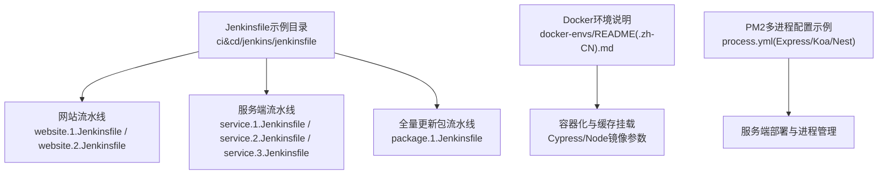
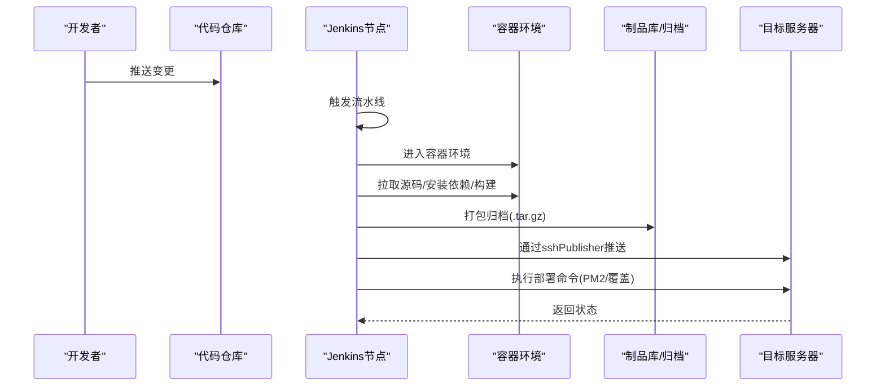
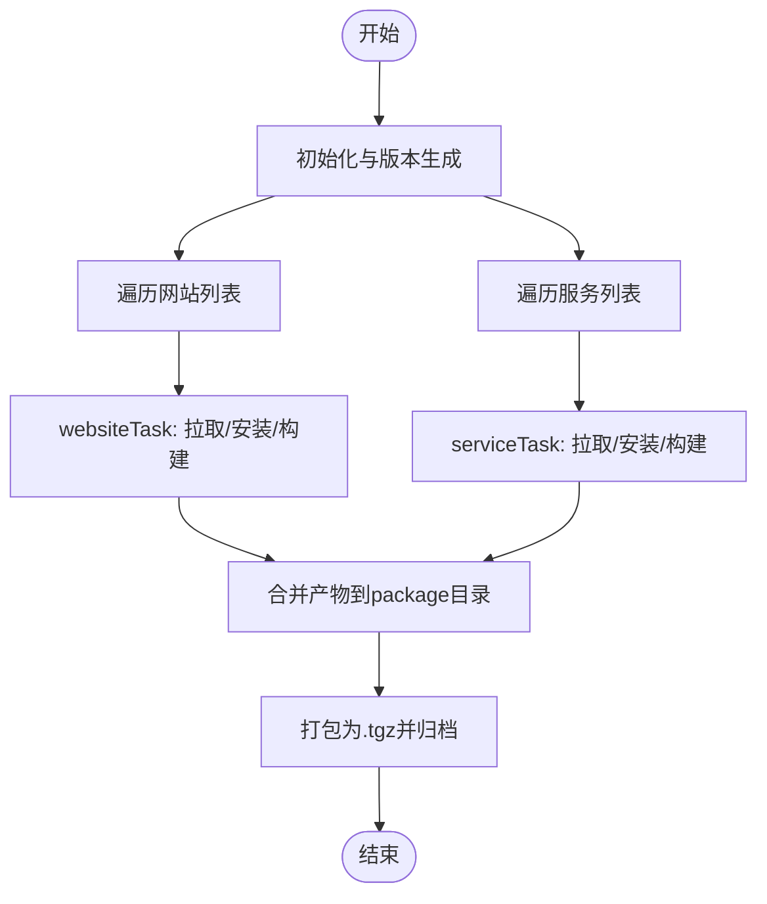
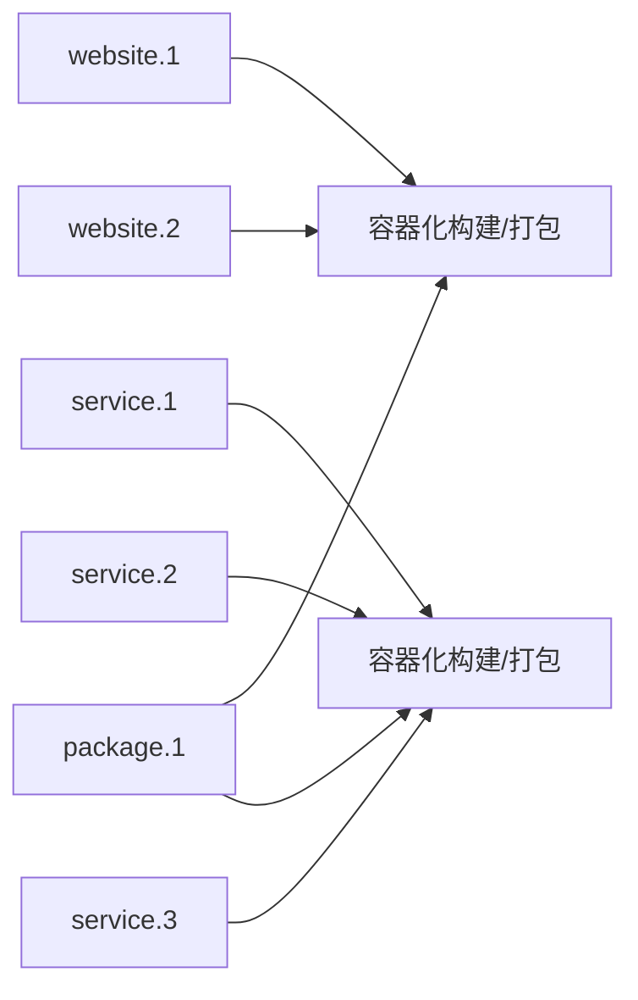

# CI/CD流水线

<cite>
**本文引用的文件**
- [ci&cd/jenkins/jenkinsfile/README.md](file://ci&cd/jenkins/jenkinsfile/README.md)
- [ci&cd/jenkins/jenkinsfile/package.1.Jenkinsfile](file://ci&cd/jenkins/jenkinsfile/package.1.Jenkinsfile)
- [ci&cd/jenkins/jenkinsfile/service.1.Jenkinsfile](file://ci&cd/jenkins/jenkinsfile/service.1.Jenkinsfile)
- [ci&cd/jenkins/jenkinsfile/service.2.Jenkinsfile](file://ci&cd/jenkins/jenkinsfile/service.2.Jenkinsfile)
- [ci&cd/jenkins/jenkinsfile/service.3.Jenkinsfile](file://ci&cd/jenkins/jenkinsfile/service.3.Jenkinsfile)
- [ci&cd/jenkins/jenkinsfile/website.1.Jenkinsfile](file://ci&cd/jenkins/jenkinsfile/website.1.Jenkinsfile)
- [ci&cd/jenkins/jenkinsfile/website.2.Jenkinsfile](file://ci&cd/jenkins/jenkinsfile/website.2.Jenkinsfile)
- [docker-envs/README.md](file://docker-envs/README.md)
- [docker-envs/README.zh-CN.md](file://docker-envs/README.zh-CN.md)
- [practice/nodejs-service/express/multi-process-pm2/process.yml](file://practice/nodejs-service/express/multi-process-pm2/process.yml)
- [practice/nodejs-service/koa/multi-process-pm2/process.yml](file://practice/nodejs-service/koa/multi-process-pm2/process.yml)
- [practice/nodejs-service/nest/multi-process-pm2/process.yml](file://practice/nodejs-service/nest/multi-process-pm2/process.yml)
</cite>

## 目录
1. 引言
2. 项目结构
3. 核心组件
4. 架构总览
5. 组件详解
6. 依赖关系分析
7. 性能与并发
8. 故障排查
9. 结论
10. 附录

## 引言
本技术文档面向企业级CI/CD流水线，系统化阐述基于Jenkins的流水线设计与执行流程，覆盖代码检出、依赖安装、构建测试、打包发布等关键阶段；解释并行构建策略与多环境部署方案；介绍自动化测试、代码质量检查与安全扫描的落地方式；提供部署回滚与蓝绿部署的配置指引；并给出监控告警、日志收集与性能分析的集成建议。目标是为企业DevOps团队提供可复用的工具链与最佳实践。

## 项目结构
本仓库在ci&cd/jenkins/jenkinsfile目录下提供了多种Jenkinsfile示例，分别对应网站前端与服务端的多场景流水线：从仅安装与打包归档，到包含部署（PM2）与全量更新包的完整发布链路。同时，仓库内还包含Docker环境说明与PM2多进程配置示例，便于理解容器化与进程管理在CI/CD中的角色。

图表来源
- [ci&cd/jenkins/jenkinsfile/README.md:1-24](file://ci&cd/jenkins/jenkinsfile/README.md#L1-L24)
- [ci&cd/jenkins/jenkinsfile/website.1.Jenkinsfile:1-81](file://ci&cd/jenkins/jenkinsfile/website.1.Jenkinsfile#L1-L81)
- [ci&cd/jenkins/jenkinsfile/website.2.Jenkinsfile:1-135](file://ci&cd/jenkins/jenkinsfile/website.2.Jenkinsfile#L1-L135)
- [ci&cd/jenkins/jenkinsfile/service.1.Jenkinsfile:1-150](file://ci&cd/jenkins/jenkinsfile/service.1.Jenkinsfile#L1-L150)
- [ci&cd/jenkins/jenkinsfile/service.2.Jenkinsfile:1-82](file://ci&cd/jenkins/jenkinsfile/service.2.Jenkinsfile#L1-L82)
- [ci&cd/jenkins/jenkinsfile/service.3.Jenkinsfile:1-157](file://ci&cd/jenkins/jenkinsfile/service.3.Jenkinsfile#L1-L157)
- [ci&cd/jenkins/jenkinsfile/package.1.Jenkinsfile:1-178](file://ci&cd/jenkins/jenkinsfile/package.1.Jenkinsfile#L1-L178)
- [docker-envs/README.md:1-6](file://docker-envs/README.md#L1-L6)
- [docker-envs/README.zh-CN.md:1-6](file://docker-envs/README.zh-CN.md#L1-L6)
- [practice/nodejs-service/express/multi-process-pm2/process.yml:1-9](file://practice/nodejs-service/express/multi-process-pm2/process.yml#L1-L9)
- [practice/nodejs-service/koa/multi-process-pm2/process.yml:1-7](file://practice/nodejs-service/koa/multi-process-pm2/process.yml#L1-L7)
- [practice/nodejs-service/nest/multi-process-pm2/process.yml:1-7](file://practice/nodejs-service/nest/multi-process-pm2/process.yml#L1-L7)

章节来源
- [ci&cd/jenkins/jenkinsfile/README.md:1-24](file://ci&cd/jenkins/jenkinsfile/README.md#L1-L24)

## 核心组件
- Jenkinsfile流水线模板：提供网站与服务端两类流水线，涵盖安装、构建、打包、归档与部署（PM2）等阶段，支持并行加速与多服务器发布。
- 容器化构建环境：通过Docker镜像（如cypress/base与node）隔离构建环境，并挂载缓存与NPM配置以提升稳定性与速度。
- PM2进程管理：结合process.yml实现多实例集群模式，支撑服务端应用的稳定运行与热更新。
- 多环境部署：通过sshPublisher插件向多台服务器推送归档包并执行部署命令，实现灰度与全量发布。

章节来源
- [ci&cd/jenkins/jenkinsfile/website.1.Jenkinsfile:30-41](file://ci&cd/jenkins/jenkinsfile/website.1.Jenkinsfile#L30-L41)
- [ci&cd/jenkins/jenkinsfile/service.1.Jenkinsfile:30-41](file://ci&cd/jenkins/jenkinsfile/service.1.Jenkinsfile#L30-L41)
- [ci&cd/jenkins/jenkinsfile/service.3.Jenkinsfile:30-41](file://ci&cd/jenkins/jenkinsfile/service.3.Jenkinsfile#L30-L41)
- [practice/nodejs-service/express/multi-process-pm2/process.yml:1-9](file://practice/nodejs-service/express/multi-process-pm2/process.yml#L1-L9)

## 架构总览
下图展示Jenkins流水线在不同场景下的整体执行路径：从代码检出与依赖安装，到构建与打包，再到归档与多服务器部署。网站与服务端流水线共享“安装/构建/打包/归档”阶段，差异在于部署目标与PM2配置。

图表来源
- [ci&cd/jenkins/jenkinsfile/website.1.Jenkinsfile:42-71](file://ci&cd/jenkins/jenkinsfile/website.1.Jenkinsfile#L42-L71)
- [ci&cd/jenkins/jenkinsfile/website.2.Jenkinsfile:42-100](file://ci&cd/jenkins/jenkinsfile/website.2.Jenkinsfile#L42-L100)
- [ci&cd/jenkins/jenkinsfile/service.1.Jenkinsfile:42-115](file://ci&cd/jenkins/jenkinsfile/service.1.Jenkinsfile#L42-L115)
- [ci&cd/jenkins/jenkinsfile/service.3.Jenkinsfile:42-122](file://ci&cd/jenkins/jenkinsfile/service.3.Jenkinsfile#L42-L122)

## 组件详解

### 网站流水线（website.1.Jenkinsfile）
- 关键阶段
  - 初始化与版本生成：清理工作区、创建临时打包目录、生成时间戳版本号。
  - 容器化构建：使用cypress/base镜像，挂载Cypress缓存与NPM配置，执行npm install与构建。
  - 打包归档：复制dist产物到统一目录并压缩为.tgz。
  - 归档保留：仅对成功构建进行制品归档。
- 并行策略：该文件未显式使用并行任务，适合单站点或小规模并行需求。
- 适用场景：仅安装、打包、归档，不包含部署。

章节来源
- [ci&cd/jenkins/jenkinsfile/website.1.Jenkinsfile:1-81](file://ci&cd/jenkins/jenkinsfile/website.1.Jenkinsfile#L1-L81)

### 网站流水线（website.2.Jenkinsfile）
- 关键阶段
  - 容器化构建：同上，使用cypress/base镜像与缓存挂载。
  - 打包归档：复制dist产物至website目录并压缩。
  - 多服务器部署：遍历服务器列表，通过sshPublisher推送.tgz并执行部署命令，覆盖旧资源。
- 并行策略：该文件未显式使用并行任务，但可通过扩展为多站点并行。
- 适用场景：安装、打包、归档与部署一体化。

章节来源
- [ci&cd/jenkins/jenkinsfile/website.2.Jenkinsfile:1-135](file://ci&cd/jenkins/jenkinsfile/website.2.Jenkinsfile#L1-L135)

### 服务端流水线（service.1.Jenkinsfile）
- 关键阶段
  - 容器化构建：使用node镜像，拉取源码、安装依赖、导出打包。
  - 打包归档：复制workspace到package.<timestamp>并压缩。
  - 多服务器部署：遍历服务器列表，推送.tgz并执行PM2停止/清理/启动流程。
- 并行策略：该文件未显式使用并行任务，适合单服务或小规模并行。
- 适用场景：安装、打包、归档与PM2部署一体化。

章节来源
- [ci&cd/jenkins/jenkinsfile/service.1.Jenkinsfile:1-150](file://ci&cd/jenkins/jenkinsfile/service.1.Jenkinsfile#L1-L150)

### 服务端流水线（service.2.Jenkinsfile）
- 关键阶段
  - 容器化构建：使用node镜像，拉取源码、安装依赖、TypeScript构建。
  - 打包归档：复制dist、package.json、process.yml到package.<timestamp>并压缩。
  - 归档保留：仅对成功构建进行制品归档。
- 并行策略：该文件未显式使用并行任务。
- 适用场景：仅安装、打包、归档，不包含部署。

章节来源
- [ci&cd/jenkins/jenkinsfile/service.2.Jenkinsfile:1-82](file://ci&cd/jenkins/jenkinsfile/service.2.Jenkinsfile#L1-L82)

### 服务端流水线（service.3.Jenkinsfile）
- 关键阶段
  - 容器化构建：使用node镜像，拉取源码、安装依赖、TypeScript构建。
  - 打包归档：复制dist、package.json、process.yml到package.<timestamp>并压缩。
  - 多服务器部署：遍历服务器列表，推送.tgz并执行PM2停止/清理/启动流程。
- 并行策略：该文件未显式使用并行任务。
- 适用场景：安装、打包、归档与PM2部署一体化。

章节来源
- [ci&cd/jenkins/jenkinsfile/service.3.Jenkinsfile:1-157](file://ci&cd/jenkins/jenkinsfile/service.3.Jenkinsfile#L1-L157)

### 全量更新包流水线（package.1.Jenkinsfile）
- 关键阶段
  - 初始化：清理历史产物、创建website与service子目录。
  - 网站与服务并行构建：使用websiteTask与serviceTask函数，按配置列表并行拉取仓库、安装依赖、构建产物。
  - 导出与归档：将各站点产物复制到统一package目录并压缩为.tgz。
  - 归档保留：仅对成功构建进行制品归档。
- 并行策略：通过websiteTasks与serviceTasks字典实现分批并行，提高吞吐。
- 适用场景：多站点/多服务的全量打包与归档。

图表来源
- [ci&cd/jenkins/jenkinsfile/package.1.Jenkinsfile:44-133](file://ci&cd/jenkins/jenkinsfile/package.1.Jenkinsfile#L44-L133)
- [ci&cd/jenkins/jenkinsfile/package.1.Jenkinsfile:135-177](file://ci&cd/jenkins/jenkinsfile/package.1.Jenkinsfile#L135-L177)

章节来源
- [ci&cd/jenkins/jenkinsfile/package.1.Jenkinsfile:1-178](file://ci&cd/jenkins/jenkinsfile/package.1.Jenkinsfile#L1-L178)

### 容器化与缓存策略
- 使用cypress/base与node镜像，挂载/root/.cache/Cypress与/root/.npmrc，减少重复下载与提升构建稳定性。
- 在website与service流水线中均体现该策略，确保一致的构建环境。

章节来源
- [ci&cd/jenkins/jenkinsfile/website.1.Jenkinsfile:30-33](file://ci&cd/jenkins/jenkinsfile/website.1.Jenkinsfile#L30-L33)
- [ci&cd/jenkins/jenkinsfile/service.1.Jenkinsfile:30-33](file://ci&cd/jenkins/jenkinsfile/service.1.Jenkinsfile#L30-L33)
- [docker-envs/README.md:1-6](file://docker-envs/README.md#L1-L6)
- [docker-envs/README.zh-CN.md:1-6](file://docker-envs/README.zh-CN.md#L1-L6)

### PM2多进程与部署
- Express/Koa/Nest均提供process.yml示例，采用cluster模式与固定实例数，便于在CI/CD中通过PM2进行启动与重启。
- 服务端Jenkinsfile在部署阶段调用pm2 stop/start，实现平滑替换。

章节来源
- [practice/nodejs-service/express/multi-process-pm2/process.yml:1-9](file://practice/nodejs-service/express/multi-process-pm2/process.yml#L1-L9)
- [practice/nodejs-service/koa/multi-process-pm2/process.yml:1-7](file://practice/nodejs-service/koa/multi-process-pm2/process.yml#L1-L7)
- [practice/nodejs-service/nest/multi-process-pm2/process.yml:1-7](file://practice/nodejs-service/nest/multi-process-pm2/process.yml#L1-L7)
- [ci&cd/jenkins/jenkinsfile/service.1.Jenkinsfile:94-110](file://ci&cd/jenkins/jenkinsfile/service.1.Jenkinsfile#L94-L110)
- [ci&cd/jenkins/jenkinsfile/service.3.Jenkinsfile:101-117](file://ci&cd/jenkins/jenkinsfile/service.3.Jenkinsfile#L101-L117)

## 依赖关系分析
- 流水线文件之间无直接代码依赖，主要通过公共变量（如镜像、参数、版本号）耦合。
- website与service流水线共享“容器化构建—打包归档—部署”的通用步骤，差异在于部署目标与PM2配置。
- package.1.Jenkinsfile通过websiteTask与serviceTask抽象，形成可复用的并行构建逻辑。

图表来源
- [ci&cd/jenkins/jenkinsfile/website.1.Jenkinsfile:42-71](file://ci&cd/jenkins/jenkinsfile/website.1.Jenkinsfile#L42-L71)
- [ci&cd/jenkins/jenkinsfile/website.2.Jenkinsfile:42-100](file://ci&cd/jenkins/jenkinsfile/website.2.Jenkinsfile#L42-L100)
- [ci&cd/jenkins/jenkinsfile/service.1.Jenkinsfile:42-115](file://ci&cd/jenkins/jenkinsfile/service.1.Jenkinsfile#L42-L115)
- [ci&cd/jenkins/jenkinsfile/service.2.Jenkinsfile:42-73](file://ci&cd/jenkins/jenkinsfile/service.2.Jenkinsfile#L42-L73)
- [ci&cd/jenkins/jenkinsfile/service.3.Jenkinsfile:42-122](file://ci&cd/jenkins/jenkinsfile/service.3.Jenkinsfile#L42-L122)
- [ci&cd/jenkins/jenkinsfile/package.1.Jenkinsfile:88-120](file://ci&cd/jenkins/jenkinsfile/package.1.Jenkinsfile#L88-L120)

## 性能与并发
- 并行构建
  - package.1.Jenkinsfile通过websiteTasks与serviceTasks字典分批并行，显著缩短多站点/多服务构建时间。
  - 建议根据服务器与网络带宽调整并行度，避免资源争抢。
- 缓存与镜像
  - 挂载Cypress缓存与NPM配置，减少重复下载，提升构建效率。
  - 使用固定镜像版本，降低环境漂移带来的失败率。
- 归档与清理
  - 成功后归档.tgz，失败时不占用存储空间；部署后清理临时目录，保持磁盘健康。

章节来源
- [ci&cd/jenkins/jenkinsfile/package.1.Jenkinsfile:88-120](file://ci&cd/jenkins/jenkinsfile/package.1.Jenkinsfile#L88-L120)
- [ci&cd/jenkins/jenkinsfile/website.1.Jenkinsfile:30-33](file://ci&cd/jenkins/jenkinsfile/website.1.Jenkinsfile#L30-L33)
- [ci&cd/jenkins/jenkinsfile/service.1.Jenkinsfile:30-33](file://ci&cd/jenkins/jenkinsfile/service.1.Jenkinsfile#L30-L33)

## 故障排查
- 构建失败
  - 检查容器镜像与挂载参数是否正确；确认NPM配置与缓存权限。
  - 查看构建日志定位依赖安装或构建错误。
- 部署失败
  - 确认sshPublisher配置的目标服务器与凭证；检查远程路径与执行命令。
  - 若PM2启动失败，检查process.yml与进程日志。
- 并行问题
  - 若出现资源竞争，适当降低并行度或拆分批次。
- 归档缺失
  - 确认archiveArtifacts仅在成功后触发；检查打包路径与文件是否存在。

章节来源
- [ci&cd/jenkins/jenkinsfile/website.2.Jenkinsfile:102-130](file://ci&cd/jenkins/jenkinsfile/website.2.Jenkinsfile#L102-L130)
- [ci&cd/jenkins/jenkinsfile/service.1.Jenkinsfile:117-144](file://ci&cd/jenkins/jenkinsfile/service.1.Jenkinsfile#L117-L144)
- [ci&cd/jenkins/jenkinsfile/service.3.Jenkinsfile:124-151](file://ci&cd/jenkins/jenkinsfile/service.3.Jenkinsfile#L124-L151)

## 结论
本仓库提供的Jenkinsfile示例覆盖了网站与服务端的典型CI/CD场景，具备清晰的阶段划分、容器化构建与多服务器部署能力。通过并行构建与缓存优化，可在保证质量的同时提升交付效率。建议结合企业实际环境进一步完善自动化测试、代码质量与安全扫描，并制定标准化的监控告警与回滚策略。

## 附录

### 自动化测试、代码质量与安全扫描集成建议
- 测试集成
  - 在构建阶段增加单元测试与E2E测试步骤，失败即中断流水线。
  - 将测试报告上传至制品库或测试平台，便于追踪。
- 代码质量
  - 集成ESLint/Prettier/TypeScript检查，确保提交前质量门禁。
- 安全扫描
  - 使用Trivy/SonarQube等工具扫描镜像与源码漏洞，阻断高危风险。

### 部署回滚与蓝绿部署
- 回滚机制
  - 保留最近N个版本的.tgz归档；部署失败自动回滚至上一版本。
  - 通过PM2的版本管理与日志回溯快速定位问题。
- 蓝绿部署
  - 使用两套服务器组（蓝/绿），先在非活跃组部署并自检，再切换流量，最后回收旧版本。

### 监控告警、日志收集与性能分析
- 监控告警
  - 集成Prometheus/Grafana与告警规则，关注构建成功率、耗时与部署失败率。
- 日志收集
  - 统一日志采集（如Filebeat/Fluentd）与集中存储（如ELK），便于问题定位。
- 性能分析
  - 对关键构建步骤打点计时，识别瓶颈；结合容器资源限制与扩缩容策略优化吞吐。