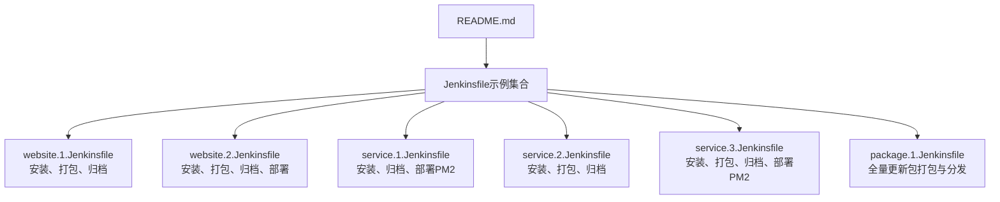
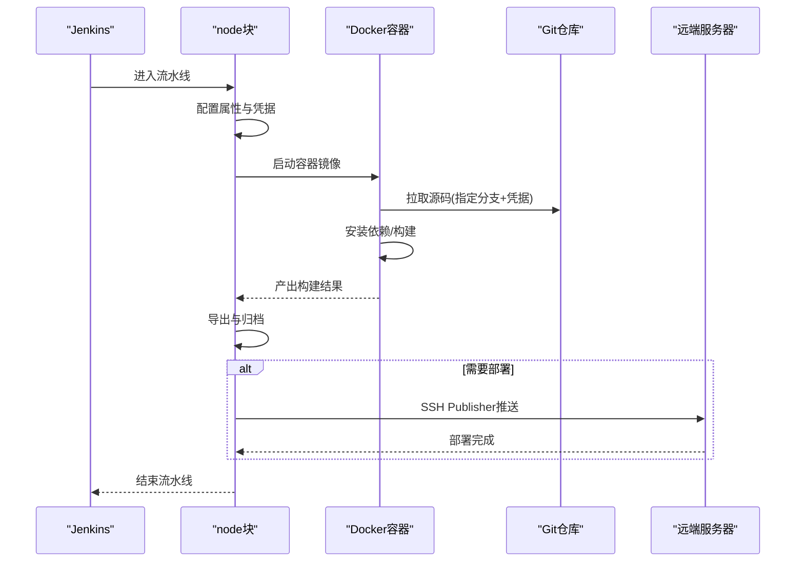
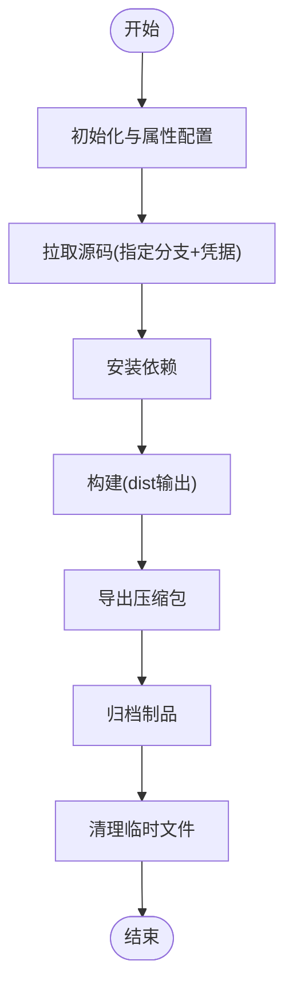
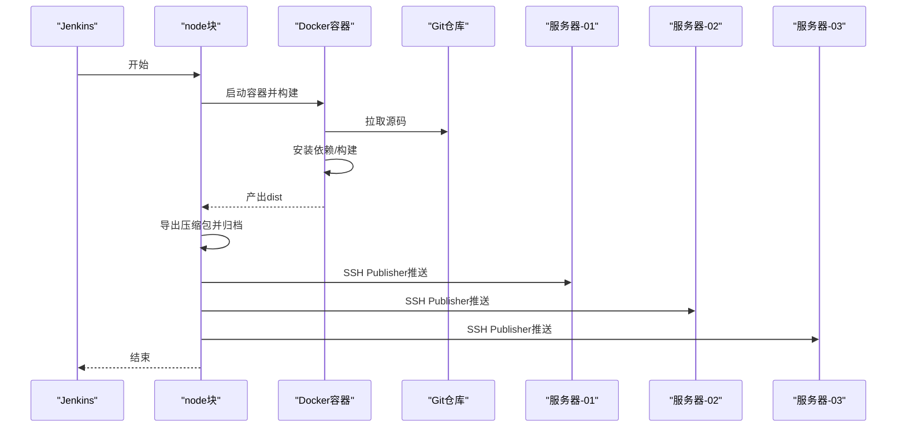
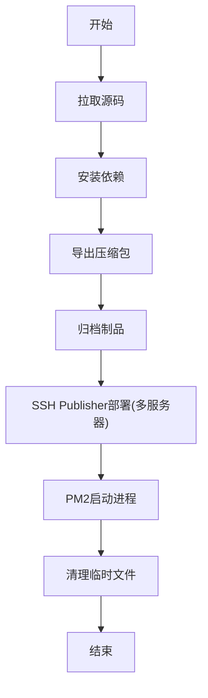
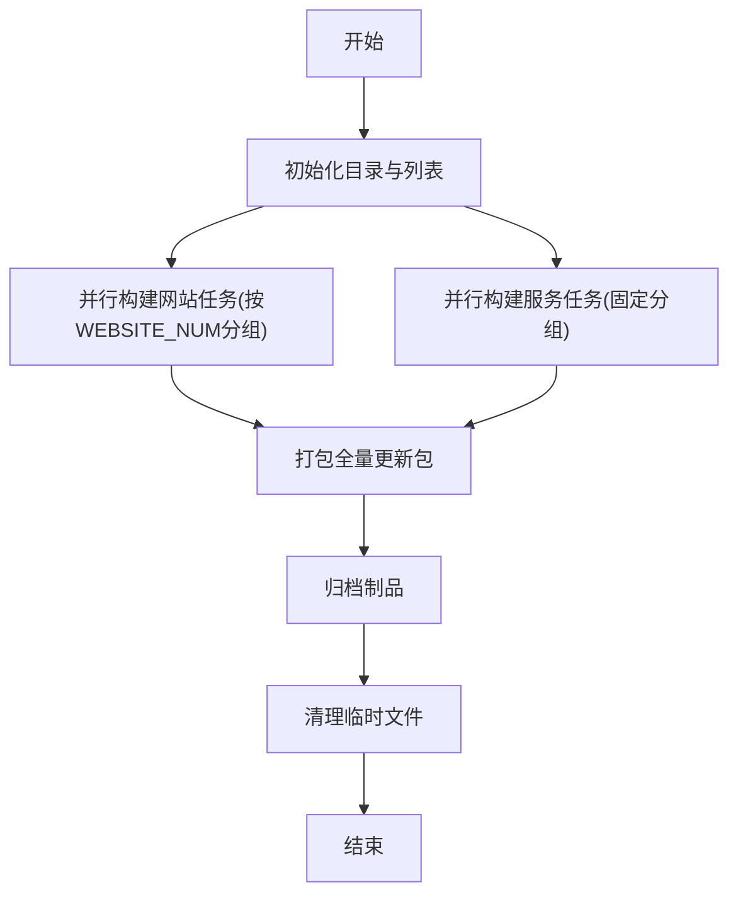
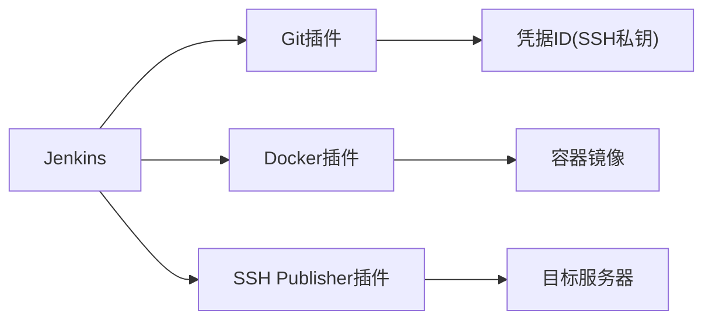

# Jenkins配置管理

<cite>
**本文引用的文件**
- [README.md](file://ci&cd/jenkins/jenkinsfile/README.md)
- [package.1.Jenkinsfile](file://ci&cd/jenkins/jenkinsfile/package.1.Jenkinsfile)
- [service.1.Jenkinsfile](file://ci&cd/jenkins/jenkinsfile/service.1.Jenkinsfile)
- [service.2.Jenkinsfile](file://ci&cd/jenkins/jenkinsfile/service.2.Jenkinsfile)
- [service.3.Jenkinsfile](file://ci&cd/jenkins/jenkinsfile/service.3.Jenkinsfile)
- [website.1.Jenkinsfile](file://ci&cd/jenkins/jenkinsfile/website.1.Jenkinsfile)
- [website.2.Jenkinsfile](file://ci&cd/jenkins/jenkinsfile/website.2.Jenkinsfile)
- [build.sh](file://build.sh)
</cite>

## 目录
1. [简介](#简介)
2. [项目结构](#项目结构)
3. [核心组件](#核心组件)
4. [架构总览](#架构总览)
5. [详细组件分析](#详细组件分析)
6. [依赖关系分析](#依赖关系分析)
7. [性能考量](#性能考量)
8. [故障排查指南](#故障排查指南)
9. [结论](#结论)
10. [附录](#附录)

## 简介
本技术文档面向Jenkins配置管理，围绕仓库中的Jenkinsfile进行系统性解析与实操指导。内容涵盖：
- Jenkinsfile结构与语法：stage、step、agent等核心概念的使用方式
- 多分支流水线配置策略：环境变量管理、凭据配置、分支策略设置
- 并行构建实现原理与配置方法：节点分配与资源管理
- 关键插件安装与配置指南：Git、Docker、SSH Publisher等
- 构建参数化、条件执行与失败重试机制
- 最佳实践与常见问题解决方案

## 项目结构
Jenkins相关配置集中在ci&cd/jenkins/jenkinsfile目录，包含多个Jenkinsfile示例，分别对应不同场景（网站前端、服务端应用、全量更新包），并通过README.md进行导航。

图表来源
- [README.md:1-24](file://ci&cd/jenkins/jenkinsfile/README.md#L1-L24)
- [website.1.Jenkinsfile:1-81](file://ci&cd/jenkins/jenkinsfile/website.1.Jenkinsfile#L1-L81)
- [website.2.Jenkinsfile:1-135](file://ci&cd/jenkins/jenkinsfile/website.2.Jenkinsfile#L1-L135)
- [service.1.Jenkinsfile:1-150](file://ci&cd/jenkins/jenkinsfile/service.1.Jenkinsfile#L1-L150)
- [service.2.Jenkinsfile:1-82](file://ci&cd/jenkins/jenkinsfile/service.2.Jenkinsfile#L1-L82)
- [service.3.Jenkinsfile:1-157](file://ci&cd/jenkins/jenkinsfile/service.3.Jenkinsfile#L1-L157)
- [package.1.Jenkinsfile:1-178](file://ci&cd/jenkins/jenkinsfile/package.1.Jenkinsfile#L1-L178)

章节来源
- [README.md:1-24](file://ci&cd/jenkins/jenkinsfile/README.md#L1-L24)

## 核心组件
本节从Jenkinsfile角度梳理核心组件与职责：
- 流水线定义与阶段划分：每个Jenkinsfile以node块包裹，内部通过stage步骤组织构建流程
- 凭据与源码管理：统一使用git步骤配合credentialsId拉取代码，确保凭据安全
- 容器化构建：通过docker.image(...).inside(...)在容器内执行安装、打包等步骤
- 并行构建：在package.1.Jenkinsfile中演示了基于Groovy闭包的并行任务调度
- 归档与部署：使用archiveArtifacts归档产物；通过sshPublisher将产物推送到远端服务器
- 版本生成与日志轮转：通过createVersion生成版本号；通过buildDiscarder配置日志与制品保留策略

章节来源
- [website.1.Jenkinsfile:6-81](file://ci&cd/jenkins/jenkinsfile/website.1.Jenkinsfile#L6-L81)
- [website.2.Jenkinsfile:6-135](file://ci&cd/jenkins/jenkinsfile/website.2.Jenkinsfile#L6-L135)
- [service.1.Jenkinsfile:6-150](file://ci&cd/jenkins/jenkinsfile/service.1.Jenkinsfile#L6-L150)
- [service.2.Jenkinsfile:6-82](file://ci&cd/jenkins/jenkinsfile/service.2.Jenkinsfile#L6-L82)
- [service.3.Jenkinsfile:6-157](file://ci&cd/jenkins/jenkinsfile/service.3.Jenkinsfile#L6-L157)
- [package.1.Jenkinsfile:6-178](file://ci&cd/jenkins/jenkinsfile/package.1.Jenkinsfile#L6-L178)

## 架构总览
Jenkinsfile整体采用“声明式流水线”风格，结合Docker容器与SSH Publisher实现跨节点部署。核心流程如下：
- 初始化与属性配置：设置Jira集成与日志轮转策略
- 源码拉取：使用git步骤与凭据ID拉取指定分支
- 容器化构建：在指定镜像内执行安装与打包
- 产物导出与归档：压缩产物并归档
- 可选部署：通过SSH Publisher将产物推送至目标服务器

图表来源
- [website.1.Jenkinsfile:6-81](file://ci&cd/jenkins/jenkinsfile/website.1.Jenkinsfile#L6-L81)
- [website.2.Jenkinsfile:6-135](file://ci&cd/jenkins/jenkinsfile/website.2.Jenkinsfile#L6-L135)
- [service.1.Jenkinsfile:6-150](file://ci&cd/jenkins/jenkinsfile/service.1.Jenkinsfile#L6-L150)
- [service.3.Jenkinsfile:6-157](file://ci&cd/jenkins/jenkinsfile/service.3.Jenkinsfile#L6-L157)
- [package.1.Jenkinsfile:6-178](file://ci&cd/jenkins/jenkinsfile/package.1.Jenkinsfile#L6-L178)

## 详细组件分析

### 组件A：网站前端流水线（website.1.Jenkinsfile）
- 功能概述：在容器内拉取前端代码，安装依赖并构建，导出压缩包并归档
- 关键点：
  - 使用cypress/base镜像，挂载Cypress缓存与npmrc
  - 支持通过VUE_BASE_URL控制基础路由
  - 通过createVersion生成版本号，命名规则为website.{timestamp}
  - 仅执行安装、打包与归档，不包含部署步骤

图表来源
- [website.1.Jenkinsfile:6-81](file://ci&cd/jenkins/jenkinsfile/website.1.Jenkinsfile#L6-L81)

章节来源
- [website.1.Jenkinsfile:1-81](file://ci&cd/jenkins/jenkinsfile/website.1.Jenkinsfile#L1-L81)

### 组件B：网站前端流水线（website.2.Jenkinsfile）
- 功能概述：在容器内拉取前端代码，安装依赖并构建，导出压缩包后通过SSH Publisher部署到多台服务器
- 关键点：
  - 使用cypress/base镜像，挂载Cypress缓存与npmrc
  - 通过VUE_BASE_URL控制基础路由
  - 通过sshPublisher配置多台服务器部署，执行远程命令完成替换
  - 仅在部署阶段使用SSH Publisher，其他阶段与website.1一致

图表来源
- [website.2.Jenkinsfile:6-135](file://ci&cd/jenkins/jenkinsfile/website.2.Jenkinsfile#L6-L135)

章节来源
- [website.2.Jenkinsfile:1-135](file://ci&cd/jenkins/jenkinsfile/website.2.Jenkinsfile#L1-L135)

### 组件C：服务端应用流水线（service.1.Jenkinsfile）
- 功能概述：在容器内拉取服务端代码，安装依赖后导出压缩包并归档；随后通过SSH Publisher部署到多台服务器，使用PM2管理进程
- 关键点：
  - 使用node镜像，挂载npmrc
  - 通过sshPublisher配置多台服务器部署，执行远程命令完成停止旧进程、清理目录、解压、启动PM2
  - 未包含构建步骤，直接导出工作区内容

图表来源
- [service.1.Jenkinsfile:6-150](file://ci&cd/jenkins/jenkinsfile/service.1.Jenkinsfile#L6-L150)

章节来源
- [service.1.Jenkinsfile:1-150](file://ci&cd/jenkins/jenkinsfile/service.1.Jenkinsfile#L1-L150)

### 组件D：服务端应用流水线（service.2.Jenkinsfile）
- 功能概述：在容器内拉取服务端代码，安装依赖并构建TypeScript，导出压缩包并归档
- 关键点：
  - 使用node镜像，挂载npmrc
  - 包含构建步骤，复制dist、package.json、process.yml到导出目录
  - 不包含部署步骤，仅归档

章节来源
- [service.2.Jenkinsfile:1-82](file://ci&cd/jenkins/jenkinsfile/service.2.Jenkinsfile#L1-L82)

### 组件E：服务端应用流水线（service.3.Jenkinsfile）
- 功能概述：在容器内拉取服务端代码，安装依赖并构建TypeScript，导出压缩包并归档；随后通过SSH Publisher部署到多台服务器，使用PM2管理进程
- 关键点：
  - 使用node镜像，挂载npmrc
  - 包含构建步骤，复制dist、package.json、process.yml到导出目录
  - 通过sshPublisher配置多台服务器部署，执行远程命令完成停止旧进程、清理目录、解压、启动PM2

章节来源
- [service.3.Jenkinsfile:1-157](file://ci&cd/jenkins/jenkinsfile/service.3.Jenkinsfile#L1-L157)

### 组件F：全量更新包流水线（package.1.Jenkinsfile）
- 功能概述：聚合多个网站与服务端项目的构建，支持并行构建与分组部署
- 关键点：
  - 定义WEBSITE_LIST与SERVICE_LIST，支持动态枚举
  - 使用websiteTask与serviceTask闭包函数封装任务逻辑
  - 通过WEBSITE_NUM与并行阈值控制并行度，提升构建效率
  - 支持将构建产物打包为全量更新包并归档

图表来源
- [package.1.Jenkinsfile:6-178](file://ci&cd/jenkins/jenkinsfile/package.1.Jenkinsfile#L6-L178)

章节来源
- [package.1.Jenkinsfile:1-178](file://ci&cd/jenkins/jenkinsfile/package.1.Jenkinsfile#L1-L178)

## 依赖关系分析
- 插件依赖：
  - Git：用于源码拉取，需配置凭据ID
  - Docker：用于容器化构建，需配置镜像与挂载参数
  - SSH Publisher：用于将制品推送到远端服务器
- 环境变量与凭据：
  - REPO_CREDENTIALSID：凭据ID，用于git拉取
  - REPO_SSH_URL：SSH源码地址
  - BRANCH_NAME：多分支流水线可使用该环境变量选择分支
  - VUE_BASE_URL：前端基础路由前缀
- 资源与节点：
  - Docker镜像与卷挂载：根据项目类型选择合适的基础镜像
  - 并行任务：通过闭包与map实现并行，合理控制并发度避免资源争用

图表来源
- [website.1.Jenkinsfile:20-50](file://ci&cd/jenkins/jenkinsfile/website.1.Jenkinsfile#L20-L50)
- [website.2.Jenkinsfile:20-50](file://ci&cd/jenkins/jenkinsfile/website.2.Jenkinsfile#L20-L50)
- [service.1.Jenkinsfile:20-50](file://ci&cd/jenkins/jenkinsfile/service.1.Jenkinsfile#L20-L50)
- [service.3.Jenkinsfile:20-50](file://ci&cd/jenkins/jenkinsfile/service.3.Jenkinsfile#L20-L50)
- [package.1.Jenkinsfile:20-27](file://ci&cd/jenkins/jenkinsfile/package.1.Jenkinsfile#L20-L27)

章节来源
- [website.1.Jenkinsfile:20-50](file://ci&cd/jenkins/jenkinsfile/website.1.Jenkinsfile#L20-L50)
- [website.2.Jenkinsfile:20-50](file://ci&cd/jenkins/jenkinsfile/website.2.Jenkinsfile#L20-L50)
- [service.1.Jenkinsfile:20-50](file://ci&cd/jenkins/jenkinsfile/service.1.Jenkinsfile#L20-L50)
- [service.3.Jenkinsfile:20-50](file://ci&cd/jenkins/jenkinsfile/service.3.Jenkinsfile#L20-L50)
- [package.1.Jenkinsfile:20-27](file://ci&cd/jenkins/jenkinsfile/package.1.Jenkinsfile#L20-L27)

## 性能考量
- 并行构建策略
  - 在package.1.Jenkinsfile中，通过WEBSITE_NUM与固定阈值控制并行任务数量，避免过度并发导致资源不足
  - 建议根据节点CPU与内存情况调整并行度，优先保证关键任务的资源可用性
- 容器镜像选择
  - 前端项目使用cypress/base镜像，内置浏览器与缓存，减少重复下载
  - 服务端项目使用node镜像，挂载npmrc提升依赖安装效率
- 日志与制品轮转
  - 通过buildDiscarder配置日志与制品保留天数与数量，平衡存储占用与回溯需求
- 磁盘与网络
  - 合理挂载卷（如npmrc、Cypress缓存）可显著减少重复下载与构建时间
  - 将制品归档后再推送，减少传输过程中的IO压力

## 故障排查指南
- 凭据与SSH连接问题
  - 确认REPO_CREDENTIALSID指向正确的SSH私钥凭据
  - 检查REPO_SSH_URL格式是否为SSH协议，且目标主机可访问
  - 若多分支流水线，确认分支名称与凭据匹配
- 容器构建失败
  - 检查Docker镜像是否存在或可拉取
  - 确认挂载卷路径正确，权限充足
  - 查看容器内node/npm版本是否满足项目要求
- 并行任务冲突
  - 调整WEBSITE_NUM或固定阈值，避免同一节点上过多并行任务
  - 分析任务间共享资源（如端口、磁盘）是否冲突
- 部署失败
  - 检查sshPublisher配置的目标服务器名称与远程路径
  - 确认远程命令具备执行权限，必要时在远程服务器上预置脚本
  - 关注execTimeout设置，避免长耗时命令超时
- 制品归档异常
  - 确认archiveArtifacts的文件模式与实际产物路径一致
  - 检查归档目录权限与磁盘空间

章节来源
- [website.1.Jenkinsfile:20-50](file://ci&cd/jenkins/jenkinsfile/website.1.Jenkinsfile#L20-L50)
- [website.2.Jenkinsfile:20-50](file://ci&cd/jenkins/jenkinsfile/website.2.Jenkinsfile#L20-L50)
- [service.1.Jenkinsfile:20-50](file://ci&cd/jenkins/jenkinsfile/service.1.Jenkinsfile#L20-L50)
- [service.3.Jenkinsfile:20-50](file://ci&cd/jenkins/jenkinsfile/service.3.Jenkinsfile#L20-L50)
- [package.1.Jenkinsfile:20-27](file://ci&cd/jenkins/jenkinsfile/package.1.Jenkinsfile#L20-L27)

## 结论
本仓库提供了覆盖前端、服务端与全量更新包的Jenkinsfile模板，展示了从源码拉取、容器化构建、制品归档到多服务器部署的完整流程。通过合理的并行策略、资源挂载与日志轮转配置，可在保证稳定性的同时提升构建效率。建议在生产环境中结合具体硬件与网络条件进一步优化并行度与镜像选择，并完善监控与告警机制。

## 附录
- 构建入口脚本：build.sh用于合并环境准备脚本，便于统一构建环境
- 多分支流水线建议：若启用多分支流水线，可将REPO_BRANCH设为env.BRANCH_NAME，自动适配各分支构建

章节来源
- [build.sh:1-5](file://build.sh#L1-L5)