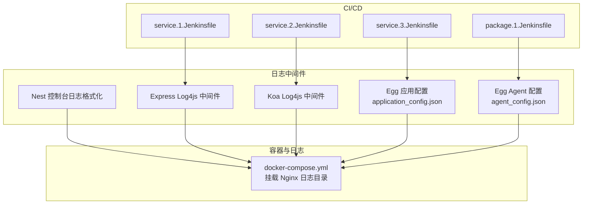
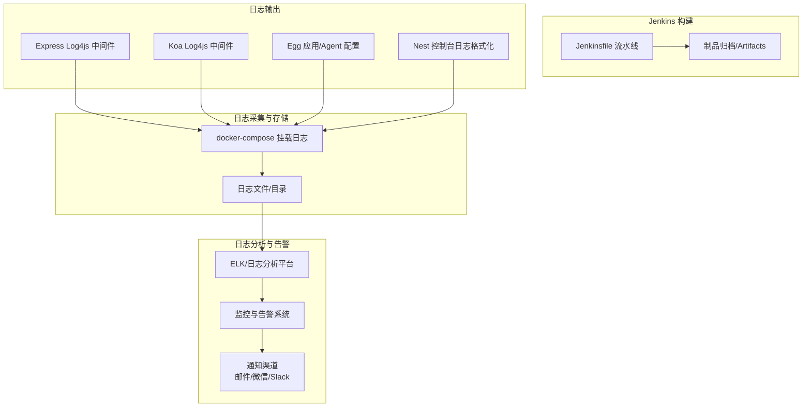
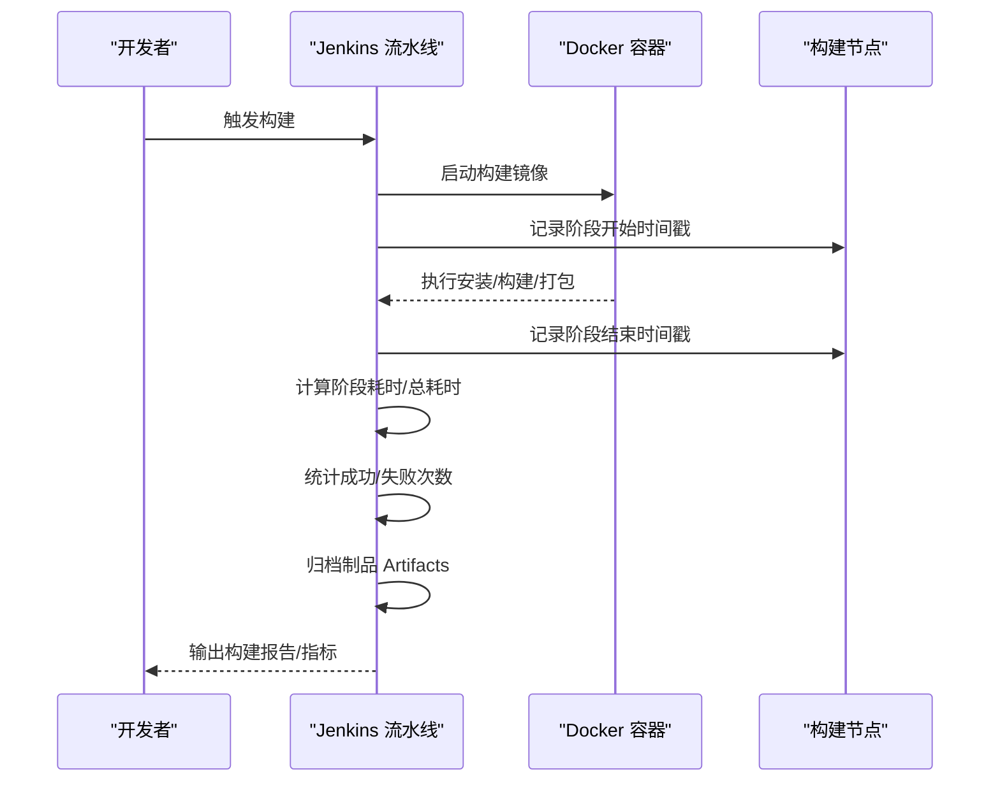
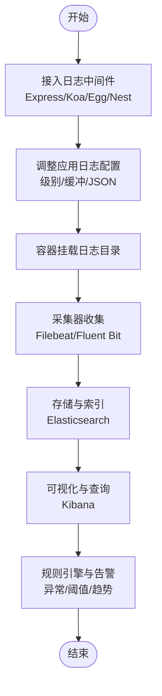
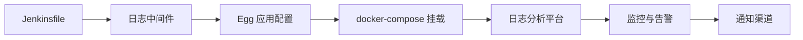

# 监控告警系统

<cite>
**本文引用的文件**
- [ci&cd/jenkins/jenkinsfile/README.md](file://ci&cd/jenkins/jenkinsfile/README.md)
- [ci&cd/jenkins/jenkinsfile/service.1.Jenkinsfile](file://ci&cd/jenkins/jenkinsfile/service.1.Jenkinsfile)
- [ci&cd/jenkins/jenkinsfile/service.2.Jenkinsfile](file://ci&cd/jenkins/jenkinsfile/service.2.Jenkinsfile)
- [ci&cd/jenkins/jenkinsfile/service.3.Jenkinsfile](file://ci&cd/jenkins/jenkinsfile/service.3.Jenkinsfile)
- [ci&cd/jenkins/jenkinsfile/package.1.Jenkinsfile](file://ci&cd/jenkins/jenkinsfile/package.1.Jenkinsfile)
- [practice/docker-env/cross-domain/compose/docker-compose.yml](file://practice/docker-env/cross-domain/compose/docker-compose.yml)
- [practice/nodejs-service/express/request-log-log4js/middleware/log4js.middleware.js](file://practice/nodejs-service/express/request-log-log4js/middleware/log4js.middleware.js)
- [practice/nodejs-service/koa/request-log-log4js/middleware/log4js.middleware.js](file://practice/nodejs-service/koa/request-log-log4js/middleware/log4js.middleware.js)
- [practice/nodejs-service/egg/request-log/run/application_config.json](file://practice/nodejs-service/egg/request-log/run/application_config.json)
- [practice/nodejs-service/egg/cross-domain/run/application_config.json](file://practice/nodejs-service/egg/cross-domain/run/application_config.json)
- [practice/nodejs-service/egg/docker-image/run/agent_config.json](file://practice/nodejs-service/egg/docker-image/run/agent_config.json)
- [practice/nodejs-service/nest/request-log-console/src/middleware/console.logger.ts](file://practice/nodejs-service/nest/request-log-console/src/middleware/console.logger.ts)
</cite>

## 目录
1. [简介](#简介)
2. [项目结构](#项目结构)
3. [核心组件](#核心组件)
4. [架构总览](#架构总览)
5. [组件详解](#组件详解)
6. [依赖关系分析](#依赖关系分析)
7. [性能考量](#性能考量)
8. [故障排查指南](#故障排查指南)
9. [结论](#结论)
10. [附录](#附录)

## 简介
本技术文档面向“监控告警系统”的落地实施，结合当前仓库中的 CI/CD 流水线与日志记录组件，系统性阐述如何在 Jenkins 构建过程中采集监控指标（构建时长、成功率、资源使用），如何通过日志中间件与配置实现日志聚合与分析，并给出告警规则与通知渠道（邮件、微信、Slack）的配置思路；同时提供应用性能监控（APM）与基础设施监控的配置建议，以及基于日志与请求链路的故障诊断与根因分析方法，最后给出监控仪表板定制与可视化的配置指南。

## 项目结构
围绕监控告警主题，本仓库的关键位置如下：
- CI/CD 与构建流程：位于 ci&cd/jenkins/jenkinsfile 下，包含多种 Jenkinsfile 示例，覆盖前端网站、后端服务与全量打包场景。
- 日志中间件与配置：位于 practice/nodejs-service 下，包含 Express/Koa/Nest/Egg 等框架的日志中间件与应用配置文件，用于统一输出访问日志与结构化日志。
- 容器编排与日志落盘：位于 practice/docker-env/cross-domain/compose/docker-compose.yml，定义了 Nginx 与多个 Node.js 服务容器，挂载日志目录以便后续集中采集。

图表来源
- [ci&cd/jenkins/jenkinsfile/service.1.Jenkinsfile:1-150](file://ci&cd/jenkins/jenkinsfile/service.1.Jenkinsfile#L1-L150)
- [ci&cd/jenkins/jenkinsfile/service.2.Jenkinsfile:1-82](file://ci&cd/jenkins/jenkinsfile/service.2.Jenkinsfile#L1-L82)
- [ci&cd/jenkins/jenkinsfile/service.3.Jenkinsfile:1-55](file://ci&cd/jenkins/jenkinsfile/service.3.Jenkinsfile#L1-L55)
- [ci&cd/jenkins/jenkinsfile/package.1.Jenkinsfile:1-178](file://ci&cd/jenkins/jenkinsfile/package.1.Jenkinsfile#L1-L178)
- [practice/docker-env/cross-domain/compose/docker-compose.yml:1-67](file://practice/docker-env/cross-domain/compose/docker-compose.yml#L1-L67)
- [practice/nodejs-service/express/request-log-log4js/middleware/log4js.middleware.js:1-34](file://practice/nodejs-service/express/request-log-log4js/middleware/log4js.middleware.js#L1-L34)
- [practice/nodejs-service/koa/request-log-log4js/middleware/log4js.middleware.js:1-39](file://practice/nodejs-service/koa/request-log-log4js/middleware/log4js.middleware.js#L1-L39)
- [practice/nodejs-service/egg/request-log/run/application_config.json:335-393](file://practice/nodejs-service/egg/request-log/run/application_config.json#L335-L393)
- [practice/nodejs-service/egg/cross-domain/run/application_config.json:325-377](file://practice/nodejs-service/egg/cross-domain/run/application_config.json#L325-L377)
- [practice/nodejs-service/egg/docker-image/run/agent_config.json:267-319](file://practice/nodejs-service/egg/docker-image/run/agent_config.json#L267-L319)
- [practice/nodejs-service/nest/request-log-console/src/middleware/console.logger.ts:1-31](file://practice/nodejs-service/nest/request-log-console/src/middleware/console.logger.ts#L1-L31)

章节来源
- [ci&cd/jenkins/jenkinsfile/README.md:1-24](file://ci&cd/jenkins/jenkinsfile/README.md#L1-L24)
- [ci&cd/jenkins/jenkinsfile/service.1.Jenkinsfile:1-150](file://ci&cd/jenkins/jenkinsfile/service.1.Jenkinsfile#L1-L150)
- [ci&cd/jenkins/jenkinsfile/service.2.Jenkinsfile:1-82](file://ci&cd/jenkins/jenkinsfile/service.2.Jenkinsfile#L1-L82)
- [ci&cd/jenkins/jenkinsfile/service.3.Jenkinsfile:1-55](file://ci&cd/jenkins/jenkinsfile/service.3.Jenkinsfile#L1-L55)
- [ci&cd/jenkins/jenkinsfile/package.1.Jenkinsfile:1-178](file://ci&cd/jenkins/jenkinsfile/package.1.Jenkinsfile#L1-L178)
- [practice/docker-env/cross-domain/compose/docker-compose.yml:1-67](file://practice/docker-env/cross-domain/compose/docker-compose.yml#L1-L67)

## 核心组件
- Jenkins 构建流水线：提供构建时长、成功率、制品归档等可观测性数据来源；支持并行构建与多服务打包，便于扩展到监控指标采集。
- 日志中间件与应用配置：统一输出访问日志与结构化日志，为日志聚合与分析提供基础；Egg 的 application_config.json/agent_config.json 提供日志级别、缓冲与输出 JSON 等开关。
- 容器编排与日志落盘：通过 docker-compose 将 Nginx 日志挂载至宿主机，便于集中采集与持久化存储。

章节来源
- [ci&cd/jenkins/jenkinsfile/service.1.Jenkinsfile:42-70](file://ci&cd/jenkins/jenkinsfile/service.1.Jenkinsfile#L42-L70)
- [ci&cd/jenkins/jenkinsfile/service.2.Jenkinsfile:42-77](file://ci&cd/jenkins/jenkinsfile/service.2.Jenkinsfile#L42-L77)
- [practice/nodejs-service/express/request-log-log4js/middleware/log4js.middleware.js:1-34](file://practice/nodejs-service/express/request-log-log4js/middleware/log4js.middleware.js#L1-L34)
- [practice/nodejs-service/koa/request-log-log4js/middleware/log4js.middleware.js:1-39](file://practice/nodejs-service/koa/request-log-log4js/middleware/log4js.middleware.js#L1-L39)
- [practice/nodejs-service/egg/request-log/run/application_config.json:335-393](file://practice/nodejs-service/egg/request-log/run/application_config.json#L335-L393)
- [practice/nodejs-service/egg/cross-domain/run/application_config.json:325-377](file://practice/nodejs-service/egg/cross-domain/run/application_config.json#L325-L377)
- [practice/nodejs-service/egg/docker-image/run/agent_config.json:267-319](file://practice/nodejs-service/egg/docker-image/run/agent_config.json#L267-L319)
- [practice/docker-env/cross-domain/compose/docker-compose.yml:17-17](file://practice/docker-env/cross-domain/compose/docker-compose.yml#L17-L17)

## 架构总览
下图展示从 Jenkins 构建到日志采集与分析的整体链路，以及可扩展的告警与通知通道。

图表来源
- [ci&cd/jenkins/jenkinsfile/service.1.Jenkinsfile:42-70](file://ci&cd/jenkins/jenkinsfile/service.1.Jenkinsfile#L42-L70)
- [ci&cd/jenkins/jenkinsfile/service.2.Jenkinsfile:42-77](file://ci&cd/jenkins/jenkinsfile/service.2.Jenkinsfile#L42-L77)
- [practice/nodejs-service/express/request-log-log4js/middleware/log4js.middleware.js:1-34](file://practice/nodejs-service/express/request-log-log4js/middleware/log4js.middleware.js#L1-L34)
- [practice/nodejs-service/koa/request-log-log4js/middleware/log4js.middleware.js:1-39](file://practice/nodejs-service/koa/request-log-log4js/middleware/log4js.middleware.js#L1-L39)
- [practice/nodejs-service/egg/request-log/run/application_config.json:335-393](file://practice/nodejs-service/egg/request-log/run/application_config.json#L335-L393)
- [practice/nodejs-service/egg/docker-image/run/agent_config.json:267-319](file://practice/nodejs-service/egg/docker-image/run/agent_config.json#L267-L319)
- [practice/nodejs-service/nest/request-log-console/src/middleware/console.logger.ts:1-31](file://practice/nodejs-service/nest/request-log-console/src/middleware/console.logger.ts#L1-L31)
- [practice/docker-env/cross-domain/compose/docker-compose.yml:17-17](file://practice/docker-env/cross-domain/compose/docker-compose.yml#L17-L17)

## 组件详解

### Jenkins 构建监控指标采集
- 构建时长：可在流水线阶段记录开始/结束时间戳，计算阶段耗时与总耗时，作为“构建时长”指标。
- 成功率：统计成功/失败次数，计算成功率；结合制品归档状态判断是否纳入统计。
- 资源使用：在 Docker 容器内可通过系统命令采集 CPU/内存/IO 指标，或在容器外部使用 cAdvisor/Prometheus Exporter 收集。
- 并行与分发：利用 Jenkins Parallel 构建与多服务打包，提升吞吐并便于按服务维度拆分指标。

图表来源
- [ci&cd/jenkins/jenkinsfile/service.1.Jenkinsfile:42-70](file://ci&cd/jenkins/jenkinsfile/service.1.Jenkinsfile#L42-L70)
- [ci&cd/jenkins/jenkinsfile/service.2.Jenkinsfile:42-77](file://ci&cd/jenkins/jenkinsfile/service.2.Jenkinsfile#L42-L77)
- [ci&cd/jenkins/jenkinsfile/package.1.Jenkinsfile:88-120](file://ci&cd/jenkins/jenkinsfile/package.1.Jenkinsfile#L88-L120)

章节来源
- [ci&cd/jenkins/jenkinsfile/service.1.Jenkinsfile:1-150](file://ci&cd/jenkins/jenkinsfile/service.1.Jenkinsfile#L1-L150)
- [ci&cd/jenkins/jenkinsfile/service.2.Jenkinsfile:1-82](file://ci&cd/jenkins/jenkinsfile/service.2.Jenkinsfile#L1-L82)
- [ci&cd/jenkins/jenkinsfile/package.1.Jenkinsfile:1-178](file://ci&cd/jenkins/jenkinsfile/package.1.Jenkinsfile#L1-L178)

### 日志聚合与分析（ELK/类似方案）
- 日志中间件：Express/Koa 使用 Log4js 中间件统一输出访问日志，格式包含请求方法、URL、状态码、响应时长、Referer、UA 等字段，便于后续解析与检索。
- 应用配置：Egg 的 application_config.json/agent_config.json 提供日志级别、缓冲、JSON 输出等开关，有助于结构化日志与性能权衡。
- 容器挂载：docker-compose 将 Nginx 日志目录挂载到宿主机，便于 Filebeat/Fluent Bit 等采集器统一收集。
- 建议：在日志分析平台中建立索引模板，提取常用字段（如响应时长、状态码、用户代理、来源 IP），并配置异常模式识别与趋势告警。

图表来源
- [practice/nodejs-service/express/request-log-log4js/middleware/log4js.middleware.js:1-34](file://practice/nodejs-service/express/request-log-log4js/middleware/log4js.middleware.js#L1-L34)
- [practice/nodejs-service/koa/request-log-log4js/middleware/log4js.middleware.js:1-39](file://practice/nodejs-service/koa/request-log-log4js/middleware/log4js.middleware.js#L1-L39)
- [practice/nodejs-service/egg/request-log/run/application_config.json:335-393](file://practice/nodejs-service/egg/request-log/run/application_config.json#L335-L393)
- [practice/nodejs-service/egg/cross-domain/run/application_config.json:325-377](file://practice/nodejs-service/egg/cross-domain/run/application_config.json#L325-L377)
- [practice/nodejs-service/egg/docker-image/run/agent_config.json:267-319](file://practice/nodejs-service/egg/docker-image/run/agent_config.json#L267-L319)
- [practice/nodejs-service/nest/request-log-console/src/middleware/console.logger.ts:1-31](file://practice/nodejs-service/nest/request-log-console/src/middleware/console.logger.ts#L1-L31)
- [practice/docker-env/cross-domain/compose/docker-compose.yml:17-17](file://practice/docker-env/cross-domain/compose/docker-compose.yml#L17-L17)

章节来源
- [practice/nodejs-service/express/request-log-log4js/middleware/log4js.middleware.js:1-34](file://practice/nodejs-service/express/request-log-log4js/middleware/log4js.middleware.js#L1-L34)
- [practice/nodejs-service/koa/request-log-log4js/middleware/log4js.middleware.js:1-39](file://practice/nodejs-service/koa/request-log-log4js/middleware/log4js.middleware.js#L1-L39)
- [practice/nodejs-service/egg/request-log/run/application_config.json:335-393](file://practice/nodejs-service/egg/request-log/run/application_config.json#L335-L393)
- [practice/nodejs-service/egg/cross-domain/run/application_config.json:325-377](file://practice/nodejs-service/egg/cross-domain/run/application_config.json#L325-L377)
- [practice/nodejs-service/egg/docker-image/run/agent_config.json:267-319](file://practice/nodejs-service/egg/docker-image/run/agent_config.json#L267-L319)
- [practice/nodejs-service/nest/request-log-console/src/middleware/console.logger.ts:1-31](file://practice/nodejs-service/nest/request-log-console/src/middleware/console.logger.ts#L1-L31)
- [practice/docker-env/cross-domain/compose/docker-compose.yml:1-67](file://practice/docker-env/cross-domain/compose/docker-compose.yml#L1-L67)

### 告警规则与通知渠道
- 规则设计：以“构建时长”、“成功率”、“错误率”、“日志异常模式/高频错误”、“资源使用率”等为触发条件；采用滚动窗口与阈值/基线对比策略。
- 通知渠道：邮件（SMTP）、微信（企业微信/自建 Webhook）、Slack（Incoming Webhooks）；建议按严重等级区分不同渠道与静默时段。
- 可视化：在 Kibana/Grafana 中创建仪表板，展示趋势、分布与异常点位，联动告警面板与事件看板。

章节来源
- [ci&cd/jenkins/jenkinsfile/service.1.Jenkinsfile:42-70](file://ci&cd/jenkins/jenkinsfile/service.1.Jenkinsfile#L42-L70)
- [ci&cd/jenkins/jenkinsfile/service.2.Jenkinsfile:42-77](file://ci&cd/jenkins/jenkinsfile/service.2.Jenkinsfile#L42-L77)
- [practice/nodejs-service/express/request-log-log4js/middleware/log4js.middleware.js:25-32](file://practice/nodejs-service/express/request-log-log4js/middleware/log4js.middleware.js#L25-L32)
- [practice/nodejs-service/koa/request-log-log4js/middleware/log4js.middleware.js:25-32](file://practice/nodejs-service/koa/request-log-log4js/middleware/log4js.middleware.js#L25-L32)

### 性能监控最佳实践（APM 与基础设施）
- 应用性能监控（APM）：在 Egg/Express/Koa/Nest 中启用性能计时与请求追踪，结合 Trace ID 关联日志与指标；对慢接口、高错误率接口进行重点观测。
- 基础设施监控：使用 Prometheus + Grafana + Alertmanager，采集 CPU、内存、磁盘、网络与容器指标；结合日志分析平台进行关联分析。
- 指标体系：构建时长、成功率、P95/P99 响应时长、错误率、重试率、队列长度、连接池使用率、GC 次数与耗时等。

章节来源
- [practice/nodejs-service/egg/request-log/run/application_config.json:335-393](file://practice/nodejs-service/egg/request-log/run/application_config.json#L335-L393)
- [practice/nodejs-service/egg/cross-domain/run/application_config.json:325-377](file://practice/nodejs-service/egg/cross-domain/run/application_config.json#L325-L377)
- [practice/nodejs-service/egg/docker-image/run/agent_config.json:267-319](file://practice/nodejs-service/egg/docker-image/run/agent_config.json#L267-L319)

### 故障诊断与根因分析
- 日志分析：通过 Kibana 快速定位异常时间段、高频错误、异常 UA/Referer；结合请求链路与 Trace ID 进行跨服务追踪。
- 性能分析：结合 APM 的火焰图与调用链，定位慢点与热点；结合资源监控确认是否存在 CPU/内存/IO 瓶颈。
- 依赖追踪：梳理服务间依赖与调用链，识别上游依赖异常、第三方接口超时与限流。

章节来源
- [practice/nodejs-service/express/request-log-log4js/middleware/log4js.middleware.js:25-32](file://practice/nodejs-service/express/request-log-log4js/middleware/log4js.middleware.js#L25-L32)
- [practice/nodejs-service/koa/request-log-log4js/middleware/log4js.middleware.js:25-32](file://practice/nodejs-service/koa/request-log-log4js/middleware/log4js.middleware.js#L25-L32)
- [practice/nodejs-service/nest/request-log-console/src/middleware/console.logger.ts:1-31](file://practice/nodejs-service/nest/request-log-console/src/middleware/console.logger.ts#L1-L31)

### 监控仪表板定制与可视化
- 指标面板：构建时长趋势、成功率与失败原因分布、慢请求占比、错误率与异常模式、资源使用率热力图。
- 日志面板：错误日志 TopN、异常来源与 Referer 分析、请求时长分布直方图。
- 告警面板：当前告警列表、历史告警趋势、通知渠道送达率与静默时段。

章节来源
- [ci&cd/jenkins/jenkinsfile/service.1.Jenkinsfile:42-70](file://ci&cd/jenkins/jenkinsfile/service.1.Jenkinsfile#L42-L70)
- [ci&cd/jenkins/jenkinsfile/service.2.Jenkinsfile:42-77](file://ci&cd/jenkins/jenkinsfile/service.2.Jenkinsfile#L42-L77)
- [practice/nodejs-service/egg/request-log/run/application_config.json:335-393](file://practice/nodejs-service/egg/request-log/run/application_config.json#L335-L393)

## 依赖关系分析
- Jenkins 与日志中间件：Jenkinsfile 在构建阶段输出制品与日志，日志中间件负责结构化输出；二者共同构成可观测性数据来源。
- 应用配置与容器编排：Egg 的日志配置影响日志格式与性能；docker-compose 将日志挂载到宿主机，便于统一采集。
- 告警与通知：日志分析平台与监控系统联动，形成规则驱动的告警闭环，最终通过邮件/微信/Slack 推送。

图表来源
- [ci&cd/jenkins/jenkinsfile/service.1.Jenkinsfile:42-70](file://ci&cd/jenkins/jenkinsfile/service.1.Jenkinsfile#L42-L70)
- [ci&cd/jenkins/jenkinsfile/service.2.Jenkinsfile:42-77](file://ci&cd/jenkins/jenkinsfile/service.2.Jenkinsfile#L42-L77)
- [practice/nodejs-service/express/request-log-log4js/middleware/log4js.middleware.js:1-34](file://practice/nodejs-service/express/request-log-log4js/middleware/log4js.middleware.js#L1-L34)
- [practice/nodejs-service/koa/request-log-log4js/middleware/log4js.middleware.js:1-39](file://practice/nodejs-service/koa/request-log-log4js/middleware/log4js.middleware.js#L1-L39)
- [practice/nodejs-service/egg/request-log/run/application_config.json:335-393](file://practice/nodejs-service/egg/request-log/run/application_config.json#L335-L393)
- [practice/nodejs-service/egg/cross-domain/run/application_config.json:325-377](file://practice/nodejs-service/egg/cross-domain/run/application_config.json#L325-L377)
- [practice/nodejs-service/egg/docker-image/run/agent_config.json:267-319](file://practice/nodejs-service/egg/docker-image/run/agent_config.json#L267-L319)
- [practice/docker-env/cross-domain/compose/docker-compose.yml:17-17](file://practice/docker-env/cross-domain/compose/docker-compose.yml#L17-L17)

章节来源
- [ci&cd/jenkins/jenkinsfile/service.1.Jenkinsfile:1-150](file://ci&cd/jenkins/jenkinsfile/service.1.Jenkinsfile#L1-L150)
- [ci&cd/jenkins/jenkinsfile/service.2.Jenkinsfile:1-82](file://ci&cd/jenkins/jenkinsfile/service.2.Jenkinsfile#L1-L82)
- [practice/nodejs-service/express/request-log-log4js/middleware/log4js.middleware.js:1-34](file://practice/nodejs-service/express/request-log-log4js/middleware/log4js.middleware.js#L1-L34)
- [practice/nodejs-service/koa/request-log-log4js/middleware/log4js.middleware.js:1-39](file://practice/nodejs-service/koa/request-log-log4js/middleware/log4js.middleware.js#L1-L39)
- [practice/nodejs-service/egg/request-log/run/application_config.json:335-393](file://practice/nodejs-service/egg/request-log/run/application_config.json#L335-L393)
- [practice/nodejs-service/egg/cross-domain/run/application_config.json:325-377](file://practice/nodejs-service/egg/cross-domain/run/application_config.json#L325-L377)
- [practice/nodejs-service/egg/docker-image/run/agent_config.json:267-319](file://practice/nodejs-service/egg/docker-image/run/agent_config.json#L267-L319)
- [practice/docker-env/cross-domain/compose/docker-compose.yml:1-67](file://practice/docker-env/cross-domain/compose/docker-compose.yml#L1-L67)

## 性能考量
- 日志输出成本：开启 JSON 输出与缓冲可提升解析效率，但会增加内存占用；需根据业务流量与硬件资源平衡。
- 构建并发：合理设置并行度与容器资源配额，避免资源争抢导致构建时长抖动。
- 采集与存储：控制日志保留周期与索引策略，避免存储膨胀；对高频字段建立合适的数据类型与映射。

## 故障排查指南
- 构建失败定位：检查 Jenkins 构建日志与制品归档状态，结合阶段耗时判断瓶颈环节（安装、构建、打包）。
- 日志异常定位：在 Kibana 中筛选异常时间段与错误模式，结合请求链路与 Trace ID 追踪问题根因。
- 通知通道验证：测试邮件/微信/Slack 通道连通性与静默时段配置，确保告警及时送达。

章节来源
- [ci&cd/jenkins/jenkinsfile/service.1.Jenkinsfile:117-145](file://ci&cd/jenkins/jenkinsfile/service.1.Jenkinsfile#L117-L145)
- [ci&cd/jenkins/jenkinsfile/service.2.Jenkinsfile:63-77](file://ci&cd/jenkins/jenkinsfile/service.2.Jenkinsfile#L63-L77)
- [practice/nodejs-service/express/request-log-log4js/middleware/log4js.middleware.js:25-32](file://practice/nodejs-service/express/request-log-log4js/middleware/log4js.middleware.js#L25-L32)
- [practice/nodejs-service/koa/request-log-log4js/middleware/log4js.middleware.js:25-32](file://practice/nodejs-service/koa/request-log-log4js/middleware/log4js.middleware.js#L25-L32)

## 结论
通过在 Jenkins 构建流程中采集“构建时长/成功率/资源使用”等指标，在应用层统一日志输出并通过 docker-compose 挂载日志目录，结合 ELK/类似方案实现日志聚合与分析，并以规则引擎驱动告警与多渠道通知，可形成完整的监控告警闭环。在此基础上，配合 APM 与基础设施监控、完善的仪表板与可视化，以及系统化的故障诊断与根因分析方法，能够有效保障交付质量与线上稳定性。

## 附录
- 参考文件清单
  - [ci&cd/jenkins/jenkinsfile/README.md](file://ci&cd/jenkins/jenkinsfile/README.md)
  - [ci&cd/jenkins/jenkinsfile/service.1.Jenkinsfile](file://ci&cd/jenkins/jenkinsfile/service.1.Jenkinsfile)
  - [ci&cd/jenkins/jenkinsfile/service.2.Jenkinsfile](file://ci&cd/jenkins/jenkinsfile/service.2.Jenkinsfile)
  - [ci&cd/jenkins/jenkinsfile/service.3.Jenkinsfile](file://ci&cd/jenkins/jenkinsfile/service.3.Jenkinsfile)
  - [ci&cd/jenkins/jenkinsfile/package.1.Jenkinsfile](file://ci&cd/jenkins/jenkinsfile/package.1.Jenkinsfile)
  - [practice/docker-env/cross-domain/compose/docker-compose.yml](file://practice/docker-env/cross-domain/compose/docker-compose.yml)
  - [practice/nodejs-service/express/request-log-log4js/middleware/log4js.middleware.js](file://practice/nodejs-service/express/request-log-log4js/middleware/log4js.middleware.js)
  - [practice/nodejs-service/koa/request-log-log4js/middleware/log4js.middleware.js](file://practice/nodejs-service/koa/request-log-log4js/middleware/log4js.middleware.js)
  - [practice/nodejs-service/egg/request-log/run/application_config.json](file://practice/nodejs-service/egg/request-log/run/application_config.json)
  - [practice/nodejs-service/egg/cross-domain/run/application_config.json](file://practice/nodejs-service/egg/cross-domain/run/application_config.json)
  - [practice/nodejs-service/egg/docker-image/run/agent_config.json](file://practice/nodejs-service/egg/docker-image/run/agent_config.json)
  - [practice/nodejs-service/nest/request-log-console/src/middleware/console.logger.ts](file://practice/nodejs-service/nest/request-log-console/src/middleware/console.logger.ts)