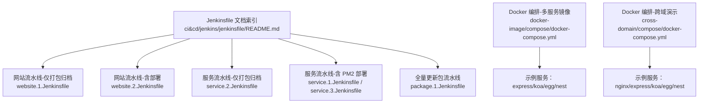
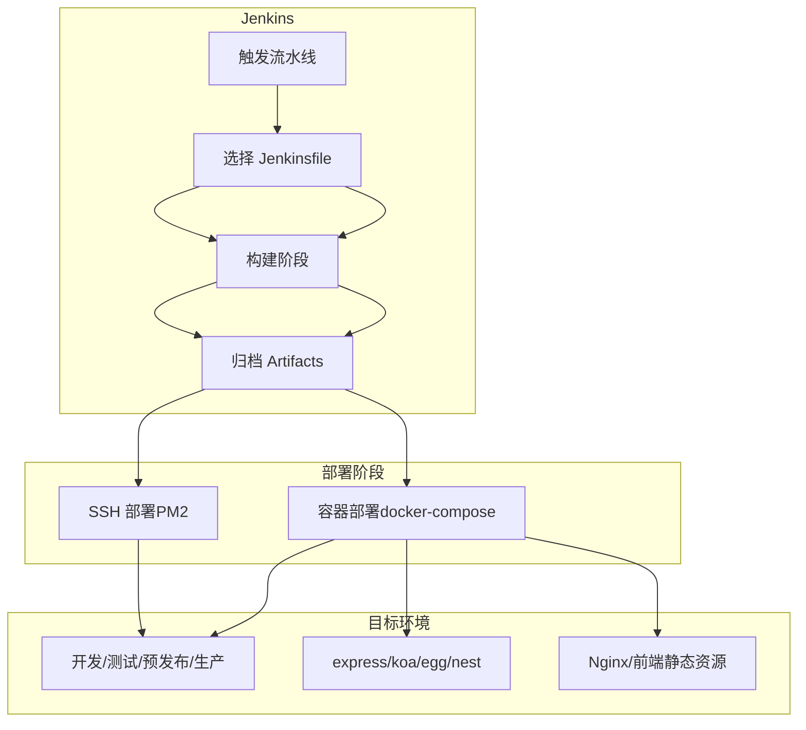
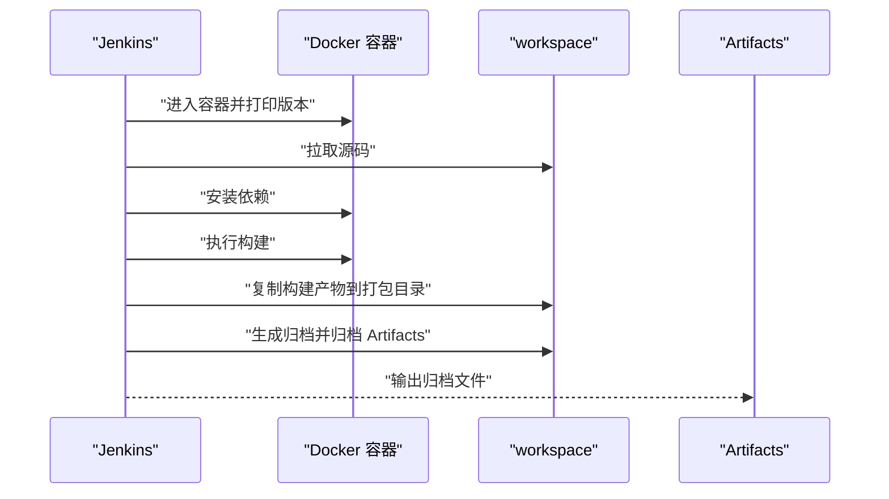
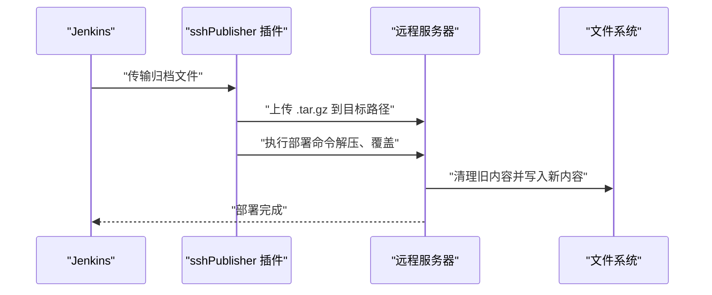
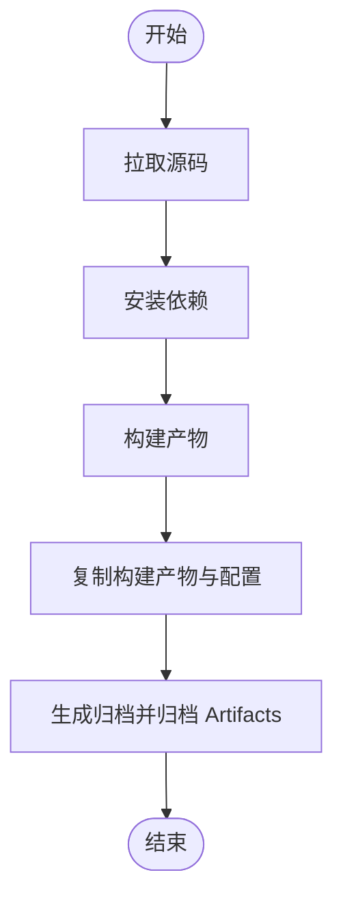
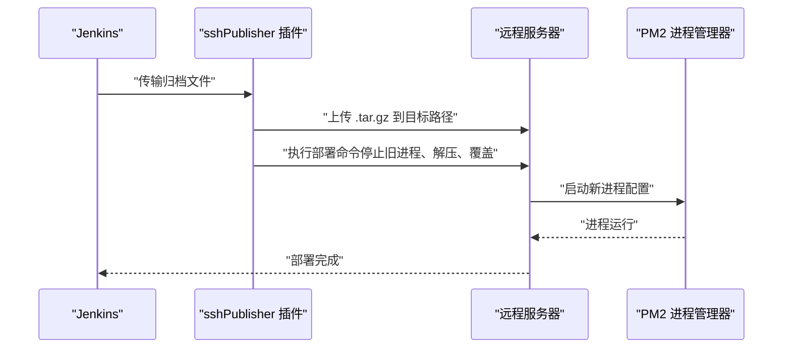
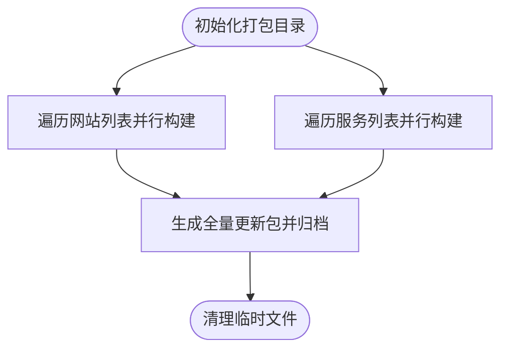
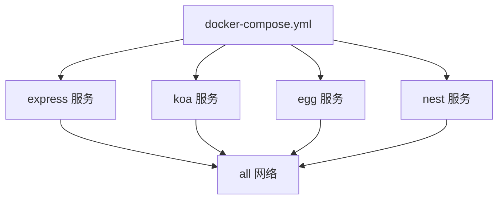
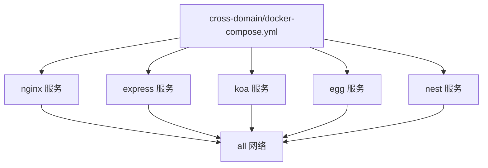
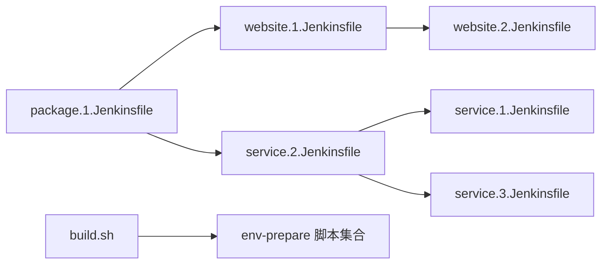

# 自动化部署策略

<cite>
**本文引用的文件**
- [ci&cd/jenkins/jenkinsfile/README.md](file://ci&cd/jenkins/jenkinsfile/README.md)
- [ci&cd/jenkins/jenkinsfile/package.1.Jenkinsfile](file://ci&cd/jenkins/jenkinsfile/package.1.Jenkinsfile)
- [ci&cd/jenkins/jenkinsfile/service.1.Jenkinsfile](file://ci&cd/jenkins/jenkinsfile/service.1.Jenkinsfile)
- [ci&cd/jenkins/jenkinsfile/service.2.Jenkinsfile](file://ci&cd/jenkins/jenkinsfile/service.2.Jenkinsfile)
- [ci&cd/jenkins/jenkinsfile/service.3.Jenkinsfile](file://ci&cd/jenkins/jenkinsfile/service.3.Jenkinsfile)
- [ci&cd/jenkins/jenkinsfile/website.1.Jenkinsfile](file://ci&cd/jenkins/jenkinsfile/website.1.Jenkinsfile)
- [ci&cd/jenkins/jenkinsfile/website.2.Jenkinsfile](file://ci&cd/jenkins/jenkinsfile/website.2.Jenkinsfile)
- [practice/docker-env/docker-image/compose/docker-compose.yml](file://practice/docker-env/docker-image/compose/docker-compose.yml)
- [practice/docker-env/cross-domain/compose/docker-compose.yml](file://practice/docker-env/cross-domain/compose/docker-compose.yml)
- [build.sh](file://build.sh)
</cite>

## 目录
1. [引言](#引言)
2. [项目结构](#项目结构)
3. [核心组件](#核心组件)
4. [架构总览](#架构总览)
5. [详细组件分析](#详细组件分析)
6. [依赖关系分析](#依赖关系分析)
7. [性能考量](#性能考量)
8. [故障排查指南](#故障排查指南)
9. [结论](#结论)
10. [附录](#附录)

## 引言
本文件面向自动化部署策略，围绕基于 Jenkins 的多环境部署流程展开，覆盖开发、测试、预发布与生产的分层策略；解释 SSH 部署与 Docker 容器部署两种方式的实现原理与适用场景；给出部署脚本编写规范（文件传输、权限设置、进程管理）；提供蓝绿部署、滚动更新与回滚机制的配置思路；并说明部署前健康检查、部署后验证与监控告警的集成方法，以及部署失败的处理策略与应急响应流程。

## 项目结构
本仓库在 CI/CD 方向提供了多套 Jenkinsfile 流水线示例，分别对应网站类与服务类应用的构建与部署；同时在 practice/docker-env 下提供了多框架 Node.js 服务与前端跨域演示的 Docker 编排样例，可作为容器化部署参考。

图示来源
- [ci&cd/jenkins/jenkinsfile/README.md:1-24](file://ci&cd/jenkins/jenkinsfile/README.md#L1-L24)
- [ci&cd/jenkins/jenkinsfile/website.1.Jenkinsfile:1-81](file://ci&cd/jenkins/jenkinsfile/website.1.Jenkinsfile#L1-L81)
- [ci&cd/jenkins/jenkinsfile/website.2.Jenkinsfile:1-135](file://ci&cd/jenkins/jenkinsfile/website.2.Jenkinsfile#L1-L135)
- [ci&cd/jenkins/jenkinsfile/service.2.Jenkinsfile:1-82](file://ci&cd/jenkins/jenkinsfile/service.2.Jenkinsfile#L1-L82)
- [ci&cd/jenkins/jenkinsfile/service.1.Jenkinsfile:1-150](file://ci&cd/jenkins/jenkinsfile/service.1.Jenkinsfile#L1-L150)
- [ci&cd/jenkins/jenkinsfile/service.3.Jenkinsfile:1-157](file://ci&cd/jenkins/jenkinsfile/service.3.Jenkinsfile#L1-L157)
- [ci&cd/jenkins/jenkinsfile/package.1.Jenkinsfile:1-178](file://ci&cd/jenkins/jenkinsfile/package.1.Jenkinsfile#L1-L178)
- [practice/docker-env/docker-image/compose/docker-compose.yml:1-53](file://practice/docker-env/docker-image/compose/docker-compose.yml#L1-L53)
- [practice/docker-env/cross-domain/compose/docker-compose.yml:1-67](file://practice/docker-env/cross-domain/compose/docker-compose.yml#L1-L67)

章节来源
- [ci&cd/jenkins/jenkinsfile/README.md:1-24](file://ci&cd/jenkins/jenkinsfile/README.md#L1-L24)

## 核心组件
- 多环境分层策略
  - 开发：本地或共享开发机，强调快速迭代与热更新能力。
  - 测试：独立测试环境，强调可重复性与一致性。
  - 预发布：与生产相近的环境，强调灰度与压测验证。
  - 生产：严格准入控制与可观测性，强调回滚与应急响应。
- 部署方式
  - SSH 部署：通过 sshPublisher 将归档包传输到目标主机并执行部署命令（如 PM2 启停、目录覆盖等），适用于传统单体或少量实例的部署。
  - Docker 容器部署：通过 docker-compose 或编排平台管理镜像生命周期，适用于微服务与多实例场景。
- 部署脚本编写规范
  - 文件传输：明确源文件、远程目录、执行命令与超时控制。
  - 权限设置：确保部署用户对目标目录具备读写与执行权限；必要时在部署命令中设置属主与权限。
  - 进程管理：使用 PM2 等进程管理器进行启停与重启，避免进程残留与端口冲突。
- 蓝绿/滚动/回滚机制
  - 蓝绿：准备两套环境，切换流量后回收旧版本。
  - 滚动：逐批替换实例，保持整体可用。
  - 回滚：记录版本号与配置，一键恢复至上一稳定版本。
- 健康检查与验证
  - 部署前：检查目标主机可达性、磁盘空间、进程占用与网络连通。
  - 部署后：HTTP 探针、端口探测、关键接口校验、日志关键字过滤。
- 监控告警集成
  - 结合部署结果触发告警；在部署脚本中上报状态；结合外部监控系统（如 Prometheus/Grafana/PagerDuty）联动。

章节来源
- [ci&cd/jenkins/jenkinsfile/service.1.Jenkinsfile:73-150](file://ci&cd/jenkins/jenkinsfile/service.1.Jenkinsfile#L73-L150)
- [ci&cd/jenkins/jenkinsfile/service.3.Jenkinsfile:79-157](file://ci&cd/jenkins/jenkinsfile/service.3.Jenkinsfile#L79-L157)
- [ci&cd/jenkins/jenkinsfile/website.2.Jenkinsfile:77-135](file://ci&cd/jenkins/jenkinsfile/website.2.Jenkinsfile#L77-L135)

## 架构总览
下图展示基于 Jenkins 的典型部署架构：Jenkins 触发流水线，按环境选择不同 Jenkinsfile；网站类与服务类采用不同的构建与部署策略；容器化部署通过 docker-compose 管理多服务。

图示来源
- [ci&cd/jenkins/jenkinsfile/website.1.Jenkinsfile:1-81](file://ci&cd/jenkins/jenkinsfile/website.1.Jenkinsfile#L1-L81)
- [ci&cd/jenkins/jenkinsfile/website.2.Jenkinsfile:1-135](file://ci&cd/jenkins/jenkinsfile/website.2.Jenkinsfile#L1-L135)
- [ci&cd/jenkins/jenkinsfile/service.1.Jenkinsfile:1-150](file://ci&cd/jenkins/jenkinsfile/service.1.Jenkinsfile#L1-L150)
- [ci&cd/jenkins/jenkinsfile/service.3.Jenkinsfile:1-157](file://ci&cd/jenkins/jenkinsfile/service.3.Jenkinsfile#L1-L157)
- [practice/docker-env/docker-image/compose/docker-compose.yml:1-53](file://practice/docker-env/docker-image/compose/docker-compose.yml#L1-L53)
- [practice/docker-env/cross-domain/compose/docker-compose.yml:1-67](file://practice/docker-env/cross-domain/compose/docker-compose.yml#L1-L67)

## 详细组件分析

### 组件 A：网站类流水线（打包与归档）
- 功能概述
  - 在容器内完成 Node.js 项目的安装与构建，生成 dist 并打包为归档文件，供后续部署或发布使用。
- 关键流程
  - 容器环境初始化与工具版本打印。
  - 拉取源码、安装依赖、执行构建。
  - 生成打包目录与 tar 归档，归档 Artifacts。
- 适用场景
  - 前端静态站点或需要统一构建产物的场景；不直接进行线上部署，适合与“含部署”的网站流水线配合使用。

图示来源
- [ci&cd/jenkins/jenkinsfile/website.1.Jenkinsfile:42-81](file://ci&cd/jenkins/jenkinsfile/website.1.Jenkinsfile#L42-L81)

章节来源
- [ci&cd/jenkins/jenkinsfile/website.1.Jenkinsfile:1-81](file://ci&cd/jenkins/jenkinsfile/website.1.Jenkinsfile#L1-L81)

### 组件 B：网站类流水线（打包、归档与部署）
- 功能概述
  - 在容器内完成构建后，将归档包通过 sshPublisher 传输到目标服务器，并在目标路径执行部署命令（清理旧内容、解压、覆盖）。
- 关键流程
  - 构建完成后生成归档。
  - 使用 sshPublisher 传输归档到指定远程目录。
  - 在远端执行部署命令（清理旧文件、解压、覆盖目标目录）。
- 适用场景
  - 静态资源或 SPA 应用的快速上线与回滚。

图示来源
- [ci&cd/jenkins/jenkinsfile/website.2.Jenkinsfile:77-135](file://ci&cd/jenkins/jenkinsfile/website.2.Jenkinsfile#L77-L135)

章节来源
- [ci&cd/jenkins/jenkinsfile/website.2.Jenkinsfile:1-135](file://ci&cd/jenkins/jenkinsfile/website.2.Jenkinsfile#L1-L135)

### 组件 C：服务类流水线（打包与归档）
- 功能概述
  - 在容器内完成服务构建，复制 dist、package.json 与进程配置文件到打包目录，生成归档供后续部署使用。
- 关键流程
  - 拉取源码、安装依赖、构建。
  - 复制构建产物与进程配置到打包目录。
  - 生成归档并归档 Artifacts。

图示来源
- [ci&cd/jenkins/jenkinsfile/service.2.Jenkinsfile:42-82](file://ci&cd/jenkins/jenkinsfile/service.2.Jenkinsfile#L42-L82)

章节来源
- [ci&cd/jenkins/jenkinsfile/service.2.Jenkinsfile:1-82](file://ci&cd/jenkins/jenkinsfile/service.2.Jenkinsfile#L1-L82)

### 组件 D：服务类流水线（打包、归档与 PM2 部署）
- 功能概述
  - 在容器内完成服务构建后，生成归档并通过 sshPublisher 传输到目标服务器，随后在目标服务器上执行部署命令（停止旧进程、清理旧文件、解压、覆盖、启动 PM2）。
- 关键流程
  - 构建完成后生成归档。
  - 通过 sshPublisher 传输归档到目标路径。
  - 在远端执行部署命令：解压、清理旧内容、覆盖、PM2 启动。
- 适用场景
  - Node.js 服务的快速部署与回滚，结合 PM2 实现进程管理。

图示来源
- [ci&cd/jenkins/jenkinsfile/service.1.Jenkinsfile:79-150](file://ci&cd/jenkins/jenkinsfile/service.1.Jenkinsfile#L79-L150)
- [ci&cd/jenkins/jenkinsfile/service.3.Jenkinsfile:79-157](file://ci&cd/jenkins/jenkinsfile/service.3.Jenkinsfile#L79-L157)

章节来源
- [ci&cd/jenkins/jenkinsfile/service.1.Jenkinsfile:1-150](file://ci&cd/jenkins/jenkinsfile/service.1.Jenkinsfile#L1-L150)
- [ci&cd/jenkins/jenkinsfile/service.3.Jenkinsfile:1-157](file://ci&cd/jenkins/jenkinsfile/service.3.Jenkinsfile#L1-L157)

### 组件 E：全量更新包流水线
- 功能概述
  - 支持批量构建多个网站与服务的产物，生成统一的全量更新包，便于离线分发或集中部署。
- 关键流程
  - 初始化打包目录，遍历网站与服务列表并行构建。
  - 构建完成后打包为统一的 .tar.gz 并归档 Artifacts。

图示来源
- [ci&cd/jenkins/jenkinsfile/package.1.Jenkinsfile:44-133](file://ci&cd/jenkins/jenkinsfile/package.1.Jenkinsfile#L44-L133)

章节来源
- [ci&cd/jenkins/jenkinsfile/package.1.Jenkinsfile:1-178](file://ci&cd/jenkins/jenkinsfile/package.1.Jenkinsfile#L1-L178)

### 组件 F：容器化部署（docker-compose）
- 功能概述
  - 通过 docker-compose 编排多服务（express/koa/egg/nest），统一管理镜像构建、端口映射与网络。
- 关键流程
  - 定义服务与镜像上下文。
  - 指定端口映射与网络别名。
  - 启动服务并观察日志。

图示来源
- [practice/docker-env/docker-image/compose/docker-compose.yml:1-53](file://practice/docker-env/docker-image/compose/docker-compose.yml#L1-L53)

章节来源
- [practice/docker-env/docker-image/compose/docker-compose.yml:1-53](file://practice/docker-env/docker-image/compose/docker-compose.yml#L1-L53)

### 组件 G：跨域演示（容器化）
- 功能概述
  - 提供 Nginx 与多框架服务的跨域演示编排，便于前端联调与跨域问题验证。
- 关键流程
  - 定义 Nginx 与各后端服务。
  - 映射端口与挂载日志卷。
  - 启动并验证跨域代理效果。

图示来源
- [practice/docker-env/cross-domain/compose/docker-compose.yml:1-67](file://practice/docker-env/cross-domain/compose/docker-compose.yml#L1-L67)

章节来源
- [practice/docker-env/cross-domain/compose/docker-compose.yml:1-67](file://practice/docker-env/cross-domain/compose/docker-compose.yml#L1-L67)

## 依赖关系分析
- Jenkinsfile 之间的依赖
  - website.1 与 website.2：前者仅归档，后者在前者基础上增加部署步骤。
  - service.2 与 service.1/service.3：前者仅归档，后者在前者基础上增加 PM2 部署步骤。
  - package.1：聚合多个网站与服务的构建产物，形成全量更新包。
- 容器编排依赖
  - docker-compose.yml 定义了服务间网络与端口映射，是容器化部署的基础。
- 构建脚本依赖
  - build.sh 调用 env-prepare 中的合并脚本，用于构建环境准备脚本集合。

图示来源
- [ci&cd/jenkins/jenkinsfile/website.1.Jenkinsfile:1-81](file://ci&cd/jenkins/jenkinsfile/website.1.Jenkinsfile#L1-L81)
- [ci&cd/jenkins/jenkinsfile/website.2.Jenkinsfile:1-135](file://ci&cd/jenkins/jenkinsfile/website.2.Jenkinsfile#L1-L135)
- [ci&cd/jenkins/jenkinsfile/service.2.Jenkinsfile:1-82](file://ci&cd/jenkins/jenkinsfile/service.2.Jenkinsfile#L1-L82)
- [ci&cd/jenkins/jenkinsfile/service.1.Jenkinsfile:1-150](file://ci&cd/jenkins/jenkinsfile/service.1.Jenkinsfile#L1-L150)
- [ci&cd/jenkins/jenkinsfile/service.3.Jenkinsfile:1-157](file://ci&cd/jenkins/jenkinsfile/service.3.Jenkinsfile#L1-L157)
- [ci&cd/jenkins/jenkinsfile/package.1.Jenkinsfile:1-178](file://ci&cd/jenkins/jenkinsfile/package.1.Jenkinsfile#L1-L178)
- [build.sh:1-5](file://build.sh#L1-L5)

章节来源
- [build.sh:1-5](file://build.sh#L1-L5)

## 性能考量
- 并行构建
  - 在全量更新包流水线中，对网站与服务任务采用并行策略以缩短构建时间。
- 构建缓存
  - 在容器启动时挂载 npm 缓存目录，减少依赖安装耗时。
- 归档与传输
  - 仅传输最小化归档文件，避免冗余文件带宽占用。
- 容器编排
  - 使用固定平台与重启策略，提升容器稳定性与资源利用率。

## 故障排查指南
- SSH 部署失败
  - 检查 sshPublisher 配置中的主机名、凭据与远程目录权限。
  - 查看执行命令是否正确（解压、覆盖、PM2 启停）。
  - 关注执行超时与远程磁盘空间。
- PM2 进程异常
  - 确认 process.yml 存在且路径正确。
  - 检查进程日志与端口占用情况。
- 容器启动失败
  - 检查镜像构建上下文与 Dockerfile。
  - 核对端口映射与网络别名是否冲突。
- 归档缺失或损坏
  - 确认构建阶段产物复制完整。
  - 校验归档命令与归档 Artifacts 步骤。

章节来源
- [ci&cd/jenkins/jenkinsfile/service.1.Jenkinsfile:117-150](file://ci&cd/jenkins/jenkinsfile/service.1.Jenkinsfile#L117-L150)
- [ci&cd/jenkins/jenkinsfile/service.3.Jenkinsfile:124-157](file://ci&cd/jenkins/jenkinsfile/service.3.Jenkinsfile#L124-L157)
- [ci&cd/jenkins/jenkinsfile/website.2.Jenkinsfile:102-135](file://ci&cd/jenkins/jenkinsfile/website.2.Jenkinsfile#L102-L135)

## 结论
本仓库提供了从网站与服务两类应用的构建与部署流水线，以及容器化编排示例。通过 Jenkinsfile 的模块化设计，可以灵活地在不同环境中执行打包、归档与部署；结合 SSH 与 Docker 两种部署方式，能够满足传统单体与现代微服务的不同需求。建议在生产环境引入蓝绿/滚动/回滚机制、完善的健康检查与监控告警体系，并制定标准化的应急响应流程，以保障交付质量与系统稳定性。

## 附录
- 多环境部署策略建议
  - 开发：快速迭代，本地或共享开发机，支持热更新。
  - 测试：隔离环境，自动化回归与性能测试。
  - 预发布：与生产一致的配置与容量，灰度与压测。
  - 生产：严格的准入控制、可观测性与自动回滚。
- 部署脚本编写规范
  - 文件传输：明确源文件、远程目录、执行命令与超时。
  - 权限设置：确保部署用户具备相应权限；必要时在部署命令中设置属主与权限。
  - 进程管理：使用 PM2 等进程管理器进行启停与重启。
- 蓝绿/滚动/回滚机制
  - 蓝绿：准备两套环境，切换流量后回收旧版本。
  - 滚动：逐批替换实例，保持整体可用。
  - 回滚：记录版本号与配置，一键恢复至上一稳定版本。
- 健康检查与监控告警
  - 部署前：检查目标主机可达性、磁盘空间、进程占用与网络连通。
  - 部署后：HTTP 探针、端口探测、关键接口校验、日志关键字过滤。
  - 告警：结合部署结果触发告警；在部署脚本中上报状态；结合外部监控系统联动。