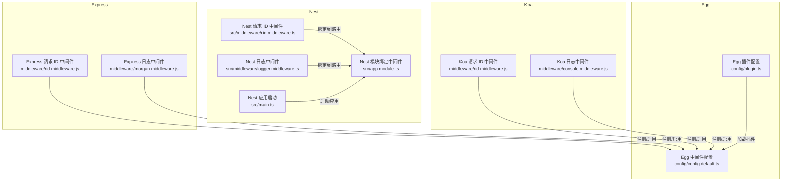
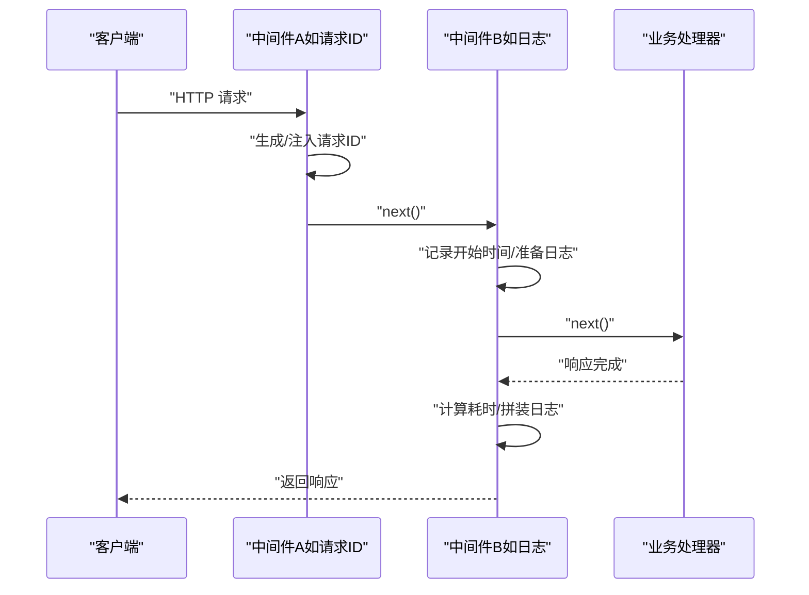
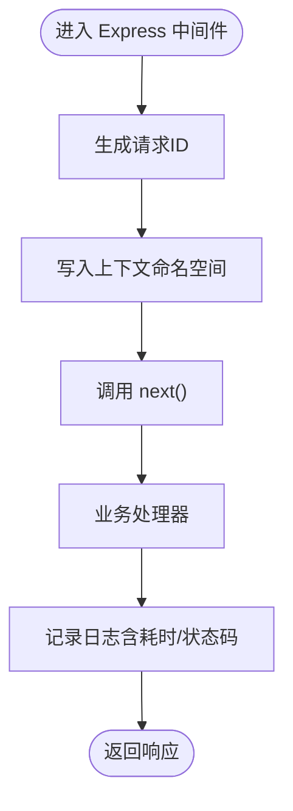
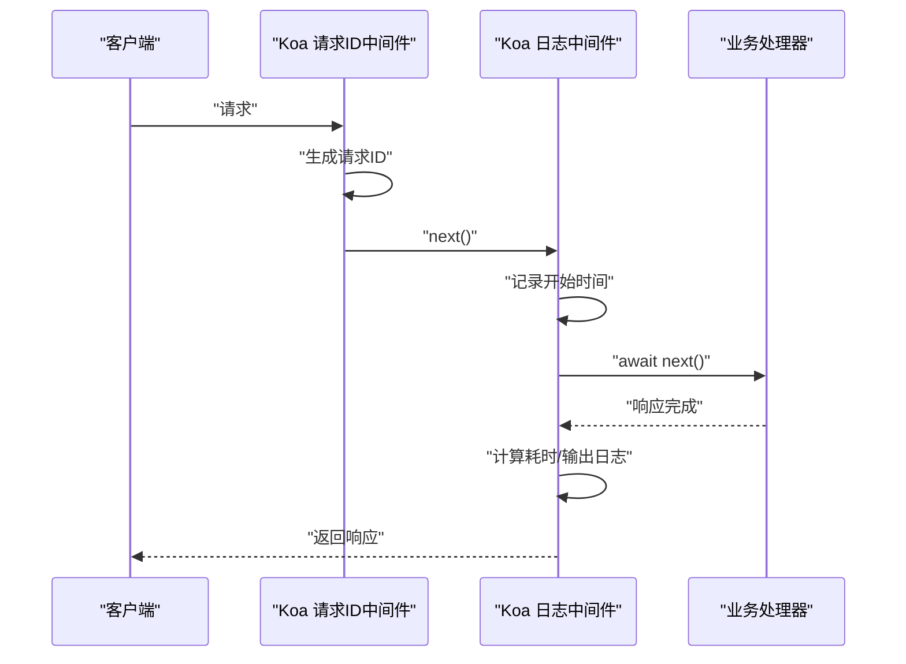
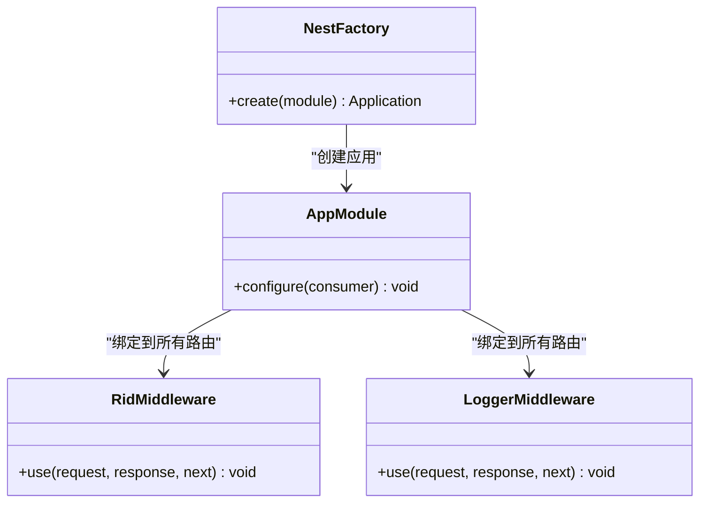
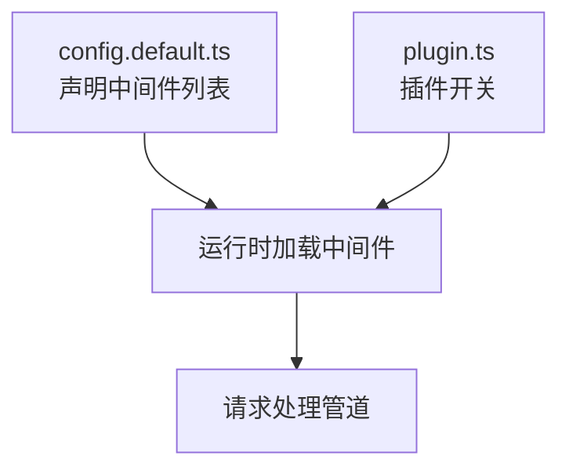
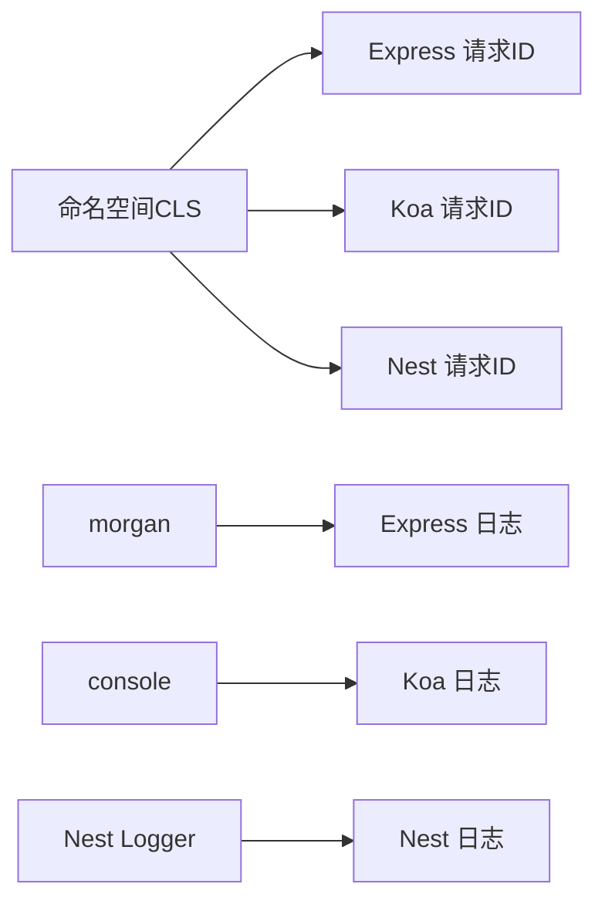

# 中间件系统

<cite>
**本文引用的文件**
- [rid.middleware.js（Express）](file://practice/nodejs-service/express/request-id/middleware/rid.middleware.js)
- [rid.middleware.js（Koa）](file://practice/nodejs-service/koa/request-id/middleware/rid.middleware.js)
- [rid.middleware.ts（Nest）](file://practice/nodejs-service/nest/request-id/src/middleware/rid.middleware.ts)
- [morgan.middleware.js（Express 日志）](file://practice/nodejs-service/express/request-log-morgan/middleware/morgan.middleware.js)
- [console.middleware.js（Koa 日志）](file://practice/nodejs-service/koa/request-log-console/middleware/console.middleware.js)
- [logger.middleware.ts（Nest 日志）](file://practice/nodejs-service/nest/request-log-console/src/middleware/logger.middleware.ts)
- [config.default.ts（Egg 请求 ID 中间件配置）](file://practice/nodejs-service/egg/request-id/config/config.default.ts)
- [plugin.ts（Egg 插件配置）](file://practice/nodejs-service/egg/request-id/config/plugin.ts)
- [app.module.ts（Nest 模块与中间件绑定）](file://practice/nodejs-service/nest/request-id/src/app.module.ts)
- [main.ts（Nest 应用启动）](file://practice/nodejs-service/nest/request-id/src/main.ts)
</cite>

## 目录
1. [引言](#引言)
2. [项目结构](#项目结构)
3. [核心组件](#核心组件)
4. [架构总览](#架构总览)
5. [详细组件分析](#详细组件分析)
6. [依赖分析](#依赖分析)
7. [性能考量](#性能考量)
8. [故障排查指南](#故障排查指南)
9. [结论](#结论)
10. [附录](#附录)

## 引言
本文件面向企业级 Node.js 中间件系统的设计与实施，围绕请求处理管道中的中间件架构、执行顺序控制、跨框架（Express、Koa、Nest、Egg）实现差异与配置方法进行系统化梳理，并给出开发规范、最佳实践（错误处理、性能优化、安全考虑）、自定义中间件开发指南与插件扩展思路。文档以仓库中现有中间件示例为依据，结合请求 ID 与请求日志两类典型场景，帮助读者快速构建可维护、可观测、高性能的中间件体系。

## 项目结构
该仓库在 practice/nodejs-service 下提供了多框架示例，涵盖 Express、Koa、Nest、Egg 的中间件实现与配置方式。其中与中间件直接相关的目录组织如下：
- Express：request-id 与 request-log-morgan 示例位于 express/request-id 与 express/request-log-morgan 的 middleware 目录
- Koa：request-id 与 request-log-console 示例位于 koa/request-id 与 koa/request-log-console 的 middleware 目录
- Nest：request-id 与 request-log-console 示例位于 nest/request-id 与 nest/request-log-console 的 src/middleware 目录
- Egg：request-id 示例位于 egg/request-id，包含 config 配置与 plugin 插件配置

图表来源
- [rid.middleware.js（Express）:1-35](file://practice/nodejs-service/express/request-id/middleware/rid.middleware.js#L1-L35)
- [morgan.middleware.js（Express 日志）:1-34](file://practice/nodejs-service/express/request-log-morgan/middleware/morgan.middleware.js#L1-L34)
- [rid.middleware.js（Koa）:1-35](file://practice/nodejs-service/koa/request-id/middleware/rid.middleware.js#L1-L35)
- [console.middleware.js（Koa 日志）:1-61](file://practice/nodejs-service/koa/request-log-console/middleware/console.middleware.js#L1-L61)
- [rid.middleware.ts（Nest）:1-38](file://practice/nodejs-service/nest/request-id/src/middleware/rid.middleware.ts#L1-L38)
- [logger.middleware.ts（Nest 日志）:1-46](file://practice/nodejs-service/nest/request-log-console/src/middleware/logger.middleware.ts#L1-L46)
- [config.default.ts（Egg 请求 ID 中间件配置）:1-30](file://practice/nodejs-service/egg/request-id/config/config.default.ts#L1-L30)
- [plugin.ts（Egg 插件配置）:1-35](file://practice/nodejs-service/egg/request-id/config/plugin.ts#L1-L35)
- [app.module.ts（Nest 模块与中间件绑定）:1-23](file://practice/nodejs-service/nest/request-id/src/app.module.ts#L1-L23)
- [main.ts（Nest 应用启动）:1-19](file://practice/nodejs-service/nest/request-id/src/main.ts#L1-L19)

章节来源
- [rid.middleware.js（Express）:1-35](file://practice/nodejs-service/express/request-id/middleware/rid.middleware.js#L1-L35)
- [rid.middleware.js（Koa）:1-35](file://practice/nodejs-service/koa/request-id/middleware/rid.middleware.js#L1-L35)
- [rid.middleware.ts（Nest）:1-38](file://practice/nodejs-service/nest/request-id/src/middleware/rid.middleware.ts#L1-L38)
- [morgan.middleware.js（Express 日志）:1-34](file://practice/nodejs-service/express/request-log-morgan/middleware/morgan.middleware.js#L1-L34)
- [console.middleware.js（Koa 日志）:1-61](file://practice/nodejs-service/koa/request-log-console/middleware/console.middleware.js#L1-L61)
- [logger.middleware.ts（Nest 日志）:1-46](file://practice/nodejs-service/nest/request-log-console/src/middleware/logger.middleware.ts#L1-L46)
- [config.default.ts（Egg 请求 ID 中间件配置）:1-30](file://practice/nodejs-service/egg/request-id/config/config.default.ts#L1-L30)
- [plugin.ts（Egg 插件配置）:1-35](file://practice/nodejs-service/egg/request-id/config/plugin.ts#L1-L35)
- [app.module.ts（Nest 模块与中间件绑定）:1-23](file://practice/nodejs-service/nest/request-id/src/app.module.ts#L1-L23)
- [main.ts（Nest 应用启动）:1-19](file://practice/nodejs-service/nest/request-id/src/main.ts#L1-L19)

## 核心组件
- 请求 ID 中间件：用于为每个请求生成唯一标识并在上下文中传递，便于链路追踪与日志关联
- 请求日志中间件：统一输出请求维度的日志格式，包含时间戳、进程 ID、状态码、响应时长等关键指标
- 框架适配层：各框架对中间件的注册与绑定方式存在差异，需按框架规范进行配置

章节来源
- [rid.middleware.js（Express）:14-28](file://practice/nodejs-service/express/request-id/middleware/rid.middleware.js#L14-L28)
- [rid.middleware.js（Koa）:14-28](file://practice/nodejs-service/koa/request-id/middleware/rid.middleware.js#L14-L28)
- [rid.middleware.ts（Nest）:20-36](file://practice/nodejs-service/nest/request-id/src/middleware/rid.middleware.ts#L20-L36)
- [morgan.middleware.js（Express 日志）:28-33](file://practice/nodejs-service/express/request-log-morgan/middleware/morgan.middleware.js#L28-L33)
- [console.middleware.js（Koa 日志）:28-60](file://practice/nodejs-service/koa/request-log-console/middleware/console.middleware.js#L28-L60)
- [logger.middleware.ts（Nest 日志）:20-44](file://practice/nodejs-service/nest/request-log-console/src/middleware/logger.middleware.ts#L20-L44)

## 架构总览
中间件在请求处理管道中的位置决定了其职责边界与影响范围。总体流程如下：
- 请求进入后，按配置顺序依次执行中间件
- 中间件可读取/修改请求上下文，调用 next 进入下一个中间件或最终处理器
- 响应返回前，部分中间件会基于 finish 等事件收集统计信息并输出日志

图表来源
- [rid.middleware.js（Express）:22-28](file://practice/nodejs-service/express/request-id/middleware/rid.middleware.js#L22-L28)
- [console.middleware.js（Koa 日志）:28-60](file://practice/nodejs-service/koa/request-log-console/middleware/console.middleware.js#L28-L60)
- [logger.middleware.ts（Nest 日志）:24-44](file://practice/nodejs-service/nest/request-log-console/src/middleware/logger.middleware.ts#L24-L44)

## 详细组件分析

### Express 中间件
- 请求 ID 中间件
  - 使用线程本地存储命名空间保存请求 ID，确保同一线程内可访问
  - 在每次请求进入时生成新的 ID 并通过 next 继续处理
- 请求日志中间件
  - 自定义 morgan token，统一输出格式，包含进程 ID、时间戳、级别、标记等
  - 返回中间件工厂函数，供应用使用

图表来源
- [rid.middleware.js（Express）:22-28](file://practice/nodejs-service/express/request-id/middleware/rid.middleware.js#L22-L28)
- [morgan.middleware.js（Express 日志）:28-33](file://practice/nodejs-service/express/request-log-morgan/middleware/morgan.middleware.js#L28-L33)

章节来源
- [rid.middleware.js（Express）:1-35](file://practice/nodejs-service/express/request-id/middleware/rid.middleware.js#L1-L35)
- [morgan.middleware.js（Express 日志）:1-34](file://practice/nodejs-service/express/request-log-morgan/middleware/morgan.middleware.js#L1-L34)

### Koa 中间件
- 请求 ID 中间件
  - 与 Express 版本类似，使用命名空间保存请求 ID
  - 采用 async/await 形式，支持在 next 前后执行逻辑
- 请求日志中间件
  - 在进入时记录开始时间，捕获异常并区分错误/成功日志输出
  - 使用 console 输出，便于容器日志采集

图表来源
- [rid.middleware.js（Koa）:22-28](file://practice/nodejs-service/koa/request-id/middleware/rid.middleware.js#L22-L28)
- [console.middleware.js（Koa 日志）:28-60](file://practice/nodejs-service/koa/request-log-console/middleware/console.middleware.js#L28-L60)

章节来源
- [rid.middleware.js（Koa）:1-35](file://practice/nodejs-service/koa/request-id/middleware/rid.middleware.js#L1-L35)
- [console.middleware.js（Koa 日志）:1-61](file://practice/nodejs-service/koa/request-log-console/middleware/console.middleware.js#L1-L61)

### Nest 中间件
- 请求 ID 中间件
  - 作为 Nest 可注入中间件实现，使用 @Injectable 装饰
  - 在 use 方法中生成请求 ID 并通过 next 继续
- 请求日志中间件
  - 使用 Nest Logger 输出日志
  - 通过 response.finish 事件收集响应耗时并输出

图表来源
- [rid.middleware.ts（Nest）:28-37](file://practice/nodejs-service/nest/request-id/src/middleware/rid.middleware.ts#L28-L37)
- [logger.middleware.ts（Nest 日志）:20-45](file://practice/nodejs-service/nest/request-log-console/src/middleware/logger.middleware.ts#L20-L45)
- [app.module.ts（Nest 模块与中间件绑定）:19-22](file://practice/nodejs-service/nest/request-id/src/app.module.ts#L19-L22)
- [main.ts（Nest 应用启动）:12-18](file://practice/nodejs-service/nest/request-id/src/main.ts#L12-L18)

章节来源
- [rid.middleware.ts（Nest）:1-38](file://practice/nodejs-service/nest/request-id/src/middleware/rid.middleware.ts#L1-L38)
- [logger.middleware.ts（Nest 日志）:1-46](file://practice/nodejs-service/nest/request-log-console/src/middleware/logger.middleware.ts#L1-L46)
- [app.module.ts（Nest 模块与中间件绑定）:1-23](file://practice/nodejs-service/nest/request-id/src/app.module.ts#L1-L23)
- [main.ts（Nest 应用启动）:1-19](file://practice/nodejs-service/nest/request-id/src/main.ts#L1-L19)

### Egg 中间件
- 中间件配置
  - 在 config.default.ts 中通过 config.middleware 数组声明启用的中间件名称
- 插件配置
  - plugin.ts 提供插件开关与包名，用于扩展框架能力

图表来源
- [config.default.ts（Egg 请求 ID 中间件配置）:13-13](file://practice/nodejs-service/egg/request-id/config/config.default.ts#L13-L13)
- [plugin.ts（Egg 插件配置）:1-35](file://practice/nodejs-service/egg/request-id/config/plugin.ts#L1-L35)

章节来源
- [config.default.ts（Egg 请求 ID 中间件配置）:1-30](file://practice/nodejs-service/egg/request-id/config/config.default.ts#L1-L30)
- [plugin.ts（Egg 插件配置）:1-35](file://practice/nodejs-service/egg/request-id/config/plugin.ts#L1-L35)

## 依赖分析
- 共性依赖
  - 请求 ID 中间件均依赖线程本地存储命名空间，保证请求上下文隔离
- 框架差异
  - Express/Koa：中间件以函数形式注册，next 控制执行流
  - Nest：通过 MiddlewareConsumer 将中间件绑定到模块或路由
  - Egg：通过配置数组声明中间件名称，由框架自动加载
- 日志中间件
  - Express 使用 morgan 扩展 token 与格式
  - Koa 自定义 token 并在 next 后输出
  - Nest 使用内置 Logger 并监听 finish 事件

图表来源
- [rid.middleware.js（Express）:7-10](file://practice/nodejs-service/express/request-id/middleware/rid.middleware.js#L7-L10)
- [rid.middleware.js（Koa）:7-10](file://practice/nodejs-service/koa/request-id/middleware/rid.middleware.js#L7-L10)
- [rid.middleware.ts（Nest）:7-13](file://practice/nodejs-service/nest/request-id/src/middleware/rid.middleware.ts#L7-L13)
- [morgan.middleware.js（Express 日志）:8-33](file://practice/nodejs-service/express/request-log-morgan/middleware/morgan.middleware.js#L8-L33)
- [console.middleware.js（Koa 日志）:10-26](file://practice/nodejs-service/koa/request-log-console/middleware/console.middleware.js#L10-L26)
- [logger.middleware.ts（Nest 日志）:1-22](file://practice/nodejs-service/nest/request-log-console/src/middleware/logger.middleware.ts#L1-L22)

章节来源
- [rid.middleware.js（Express）:1-35](file://practice/nodejs-service/express/request-id/middleware/rid.middleware.js#L1-L35)
- [rid.middleware.js（Koa）:1-35](file://practice/nodejs-service/koa/request-id/middleware/rid.middleware.js#L1-L35)
- [rid.middleware.ts（Nest）:1-38](file://practice/nodejs-service/nest/request-id/src/middleware/rid.middleware.ts#L1-L38)
- [morgan.middleware.js（Express 日志）:1-34](file://practice/nodejs-service/express/request-log-morgan/middleware/morgan.middleware.js#L1-L34)
- [console.middleware.js（Koa 日志）:1-61](file://practice/nodejs-service/koa/request-log-console/middleware/console.middleware.js#L1-L61)
- [logger.middleware.ts（Nest 日志）:1-46](file://practice/nodejs-service/nest/request-log-console/src/middleware/logger.middleware.ts#L1-L46)

## 性能考量
- 中间件顺序
  - 将无副作用或轻量中间件置于前部，避免阻塞后续处理
  - 日志中间件尽量靠近末尾，减少对业务路径的影响
- 异步与同步
  - Koa 支持 async/await，可在 next 前后分别做上下文注入与统计
  - Nest 使用事件驱动（finish），避免阻塞响应发送
- 资源开销
  - 命名空间与 token 计算应保持简单，避免额外字符串拼接
  - 日志输出建议异步化，防止阻塞主事件循环
- 缓存与复用
  - 复用已有的日志格式器与工具函数，减少重复初始化

## 故障排查指南
- 请求 ID 丢失
  - 检查中间件是否正确写入命名空间并在 next 前后调用
  - 确认框架上下文对象（req/res 或 ctx）是否传入正确
- 日志不输出
  - Express：确认 morgan 已正确返回中间件并挂载到应用
  - Koa：确认中间件在 next 后执行且未被提前终止
  - Nest：确认中间件已通过 MiddlewareConsumer 绑定到目标路由
- 性能问题
  - 定位耗时中间件：对比日志中的响应时长，优先优化瓶颈环节
  - 减少不必要的字符串拼接与 IO 操作
- 异常处理
  - Koa：在中间件中捕获异常并区分错误日志输出
  - Nest：利用 Logger 输出结构化日志，便于检索

章节来源
- [console.middleware.js（Koa 日志）:32-36](file://practice/nodejs-service/koa/request-log-console/middleware/console.middleware.js#L32-L36)
- [logger.middleware.ts（Nest 日志）:24-44](file://practice/nodejs-service/nest/request-log-console/src/middleware/logger.middleware.ts#L24-L44)
- [morgan.middleware.js（Express 日志）:28-33](file://practice/nodejs-service/express/request-log-morgan/middleware/morgan.middleware.js#L28-L33)

## 结论
本仓库展示了在 Express、Koa、Nest、Egg 四类主流 Node.js 框架中实现中间件的一致模式与差异化配置。通过统一的请求 ID 与日志中间件，可以有效提升请求可观测性与可追踪性。建议在实际企业应用中：
- 明确中间件职责边界，遵循“单一职责”
- 严格控制执行顺序，将高频/轻量中间件前置
- 使用结构化日志与统一 token，便于集中采集与检索
- 在 Nest/Egg 中通过模块/配置层进行集中管理，降低耦合度

## 附录

### 开发规范与最佳实践
- 错误处理
  - 在中间件内部捕获异常并输出结构化错误日志
  - 对于可恢复错误，返回标准状态码；对于不可恢复错误，记录堆栈并返回友好提示
- 性能优化
  - 避免在中间件中进行重 IO 操作；必要时异步化
  - 复用对象与字符串，减少 GC 压力
- 安全考虑
  - 不在日志中输出敏感信息（如密码、令牌）
  - 限制日志粒度，生产环境默认 INFO 或更高级别
- 可观测性
  - 统一请求 ID，贯穿整个请求生命周期
  - 输出关键指标（状态码、响应时长、内容长度）

### 自定义中间件开发指南
- Express
  - 编写函数式中间件，接收 (req, res, next)，在 next 前后插入逻辑
  - 将中间件挂载到应用实例或路由
- Koa
  - 编写 async 中间件，使用 ctx 与 await next()
  - 注意错误捕获与日志输出时机
- Nest
  - 实现 NestMiddleware 接口，使用 @Injectable 装饰
  - 通过 MiddlewareConsumer.apply(...).forRoutes('*') 绑定到全部路由或指定路由
- Egg
  - 在 config.default.ts 的 config.middleware 中声明中间件名称
  - 如需插件能力，在 plugin.ts 中开启对应插件

章节来源
- [rid.middleware.js（Express）:22-28](file://practice/nodejs-service/express/request-id/middleware/rid.middleware.js#L22-L28)
- [rid.middleware.js（Koa）:22-28](file://practice/nodejs-service/koa/request-id/middleware/rid.middleware.js#L22-L28)
- [rid.middleware.ts（Nest）:28-36](file://practice/nodejs-service/nest/request-id/src/middleware/rid.middleware.ts#L28-L36)
- [app.module.ts（Nest 模块与中间件绑定）:19-21](file://practice/nodejs-service/nest/request-id/src/app.module.ts#L19-L21)
- [config.default.ts（Egg 请求 ID 中间件配置）:13-13](file://practice/nodejs-service/egg/request-id/config/config.default.ts#L13-L13)
- [plugin.ts（Egg 插件配置）:1-35](file://practice/nodejs-service/egg/request-id/config/plugin.ts#L1-L35)