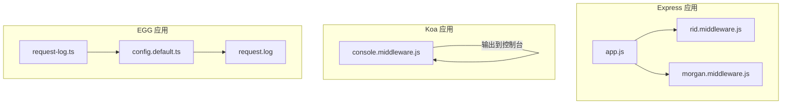
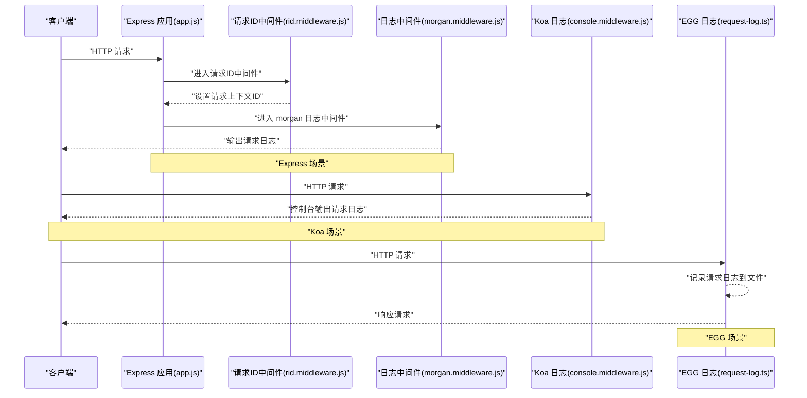
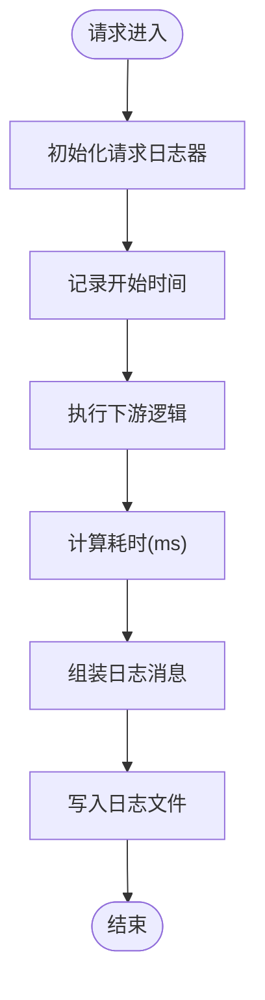
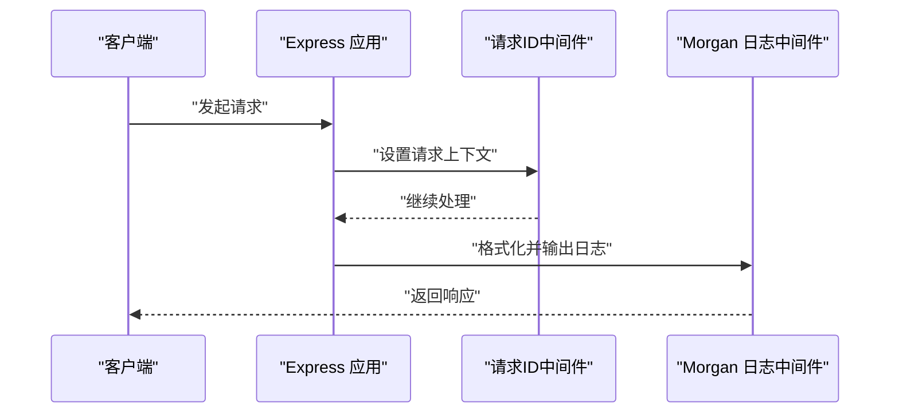
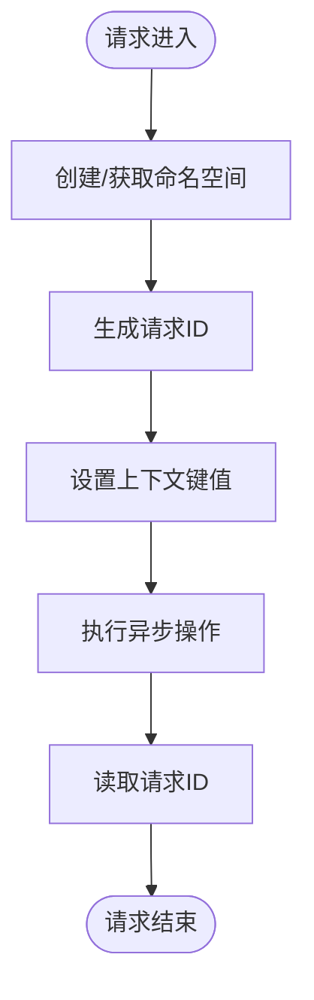
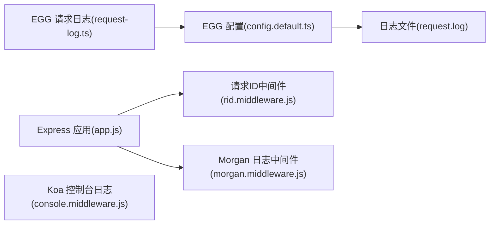

# 企业级功能

<cite>
**本文引用的文件**
- [request-log.ts](file://practice/nodejs-service/egg/request-log/app/middleware/request-log.ts)
- [request.log](file://practice/nodejs-service/egg/request-log/logs/request.log)
- [config.default.ts](file://practice/nodejs-service/egg/request-log/config/config.default.ts)
- [morgan.middleware.js](file://practice/nodejs-service/express/request-log-morgan/middleware/morgan.middleware.js)
- [console.middleware.js](file://practice/nodejs-service/koa/request-log-console/middleware/console.middleware.js)
- [rid.middleware.js](file://practice/nodejs-service/express/request-id/middleware/rid.middleware.js)
- [app.js](file://practice/nodejs-service/express/request-id/app.js)
</cite>

## 目录
1. [引言](#引言)
2. [项目结构](#项目结构)
3. [核心组件](#核心组件)
4. [架构总览](#架构总览)
5. [详细组件分析](#详细组件分析)
6. [依赖关系分析](#依赖关系分析)
7. [性能考量](#性能考量)
8. [故障排查指南](#故障排查指南)
9. [结论](#结论)
10. [附录](#附录)

## 引言
本文件面向企业级应用开发，围绕请求日志系统、请求ID追踪机制与中间件体系，提供从设计到落地的完整参考。内容涵盖：
- 请求日志格式规范与存储策略
- 分布式场景下的请求ID追踪与跨服务关联
- 中间件架构设计与扩展机制
- 错误处理、性能监控、安全防护等企业级能力
- 配置管理、环境隔离与运维监控最佳实践

## 项目结构
本仓库以“多框架示例”组织企业级功能演示，重点模块如下：
- EGG 示例：内置请求日志中间件与自定义日志器配置
- Express 示例：基于 morgan 的请求日志中间件
- Koa 示例：控制台输出型请求日志中间件
- Express 示例（请求ID）：基于 CLS 的请求上下文隔离与请求ID生成

图表来源
- [app.js:1-45](file://practice/nodejs-service/express/request-id/app.js#L1-L45)
- [rid.middleware.js:1-35](file://practice/nodejs-service/express/request-id/middleware/rid.middleware.js#L1-L35)
- [morgan.middleware.js:1-34](file://practice/nodejs-service/express/request-log-morgan/middleware/morgan.middleware.js#L1-L34)
- [console.middleware.js:1-61](file://practice/nodejs-service/koa/request-log-console/middleware/console.middleware.js#L1-L61)
- [request-log.ts:1-48](file://practice/nodejs-service/egg/request-log/app/middleware/request-log.ts#L1-L48)
- [config.default.ts:1-83](file://practice/nodejs-service/egg/request-log/config/config.default.ts#L1-L83)
- [request.log:1-88](file://practice/nodejs-service/egg/request-log/logs/request.log#L1-L88)

章节来源
- [app.js:1-45](file://practice/nodejs-service/express/request-id/app.js#L1-L45)
- [rid.middleware.js:1-35](file://practice/nodejs-service/express/request-id/middleware/rid.middleware.js#L1-L35)
- [morgan.middleware.js:1-34](file://practice/nodejs-service/express/request-log-morgan/middleware/morgan.middleware.js#L1-L34)
- [console.middleware.js:1-61](file://practice/nodejs-service/koa/request-log-console/middleware/console.middleware.js#L1-L61)
- [request-log.ts:1-48](file://practice/nodejs-service/egg/request-log/app/middleware/request-log.ts#L1-L48)
- [config.default.ts:1-83](file://practice/nodejs-service/egg/request-log/config/config.default.ts#L1-L83)
- [request.log:1-88](file://practice/nodejs-service/egg/request-log/logs/request.log#L1-L88)

## 核心组件
- 请求日志系统
  - EGG：通过自定义日志器与格式化器输出统一格式的日志，落盘至指定目录
  - Express：使用 morgan 定制日志令牌与格式，输出到标准输出或文件
  - Koa：控制台输出型日志中间件，便于本地调试与快速验证
- 请求ID追踪机制
  - 基于 CLS（Continuation Local Storage）在请求生命周期内维护上下文
  - 自动生成递增请求ID，并可跨异步调用传递
- 中间件系统
  - 统一的中间件注册与执行顺序控制
  - 可插拔的日志与追踪中间件组合

章节来源
- [request-log.ts:1-48](file://practice/nodejs-service/egg/request-log/app/middleware/request-log.ts#L1-L48)
- [config.default.ts:1-83](file://practice/nodejs-service/egg/request-log/config/config.default.ts#L1-L83)
- [morgan.middleware.js:1-34](file://practice/nodejs-service/express/request-log-morgan/middleware/morgan.middleware.js#L1-L34)
- [console.middleware.js:1-61](file://practice/nodejs-service/koa/request-log-console/middleware/console.middleware.js#L1-L61)
- [rid.middleware.js:1-35](file://practice/nodejs-service/express/request-id/middleware/rid.middleware.js#L1-L35)
- [app.js:1-45](file://practice/nodejs-service/express/request-id/app.js#L1-L45)

## 架构总览
下图展示请求在不同框架中的处理流程与日志输出路径：

图表来源
- [app.js:1-45](file://practice/nodejs-service/express/request-id/app.js#L1-L45)
- [rid.middleware.js:1-35](file://practice/nodejs-service/express/request-id/middleware/rid.middleware.js#L1-L35)
- [morgan.middleware.js:1-34](file://practice/nodejs-service/express/request-log-morgan/middleware/morgan.middleware.js#L1-L34)
- [console.middleware.js:1-61](file://practice/nodejs-service/koa/request-log-console/middleware/console.middleware.js#L1-L61)
- [request-log.ts:1-48](file://practice/nodejs-service/egg/request-log/app/middleware/request-log.ts#L1-L48)

## 详细组件分析

### 请求日志系统（EGG）
- 设计要点
  - 自定义日志器名称与文件名，确保请求日志独立存储
  - 使用格式化器对时间戳、进程ID、标记位、消息体进行统一拼装
  - 在中间件中计算耗时，附加到日志字段
- 日志格式规范
  - 字段顺序与分隔：包含标识、进程ID、时间、级别、标记、远端地址、HTTP信息、状态码、内容长度、耗时、来源页、UA
  - 统一的时间格式与填充规则，便于排序与检索
- 存储策略
  - 指定日志目录与文件名，结合日志轮转策略（建议配合外部工具）
  - 支持上下文日志格式化器，便于扩展更多上下文信息
- 分析方法
  - 基于字段解析与过滤，统计成功率、P95/P99 延迟、异常状态码分布
  - 结合请求ID实现端到端链路追踪

图表来源
- [request-log.ts:1-48](file://practice/nodejs-service/egg/request-log/app/middleware/request-log.ts#L1-L48)
- [config.default.ts:1-83](file://practice/nodejs-service/egg/request-log/config/config.default.ts#L1-L83)

章节来源
- [request-log.ts:1-48](file://practice/nodejs-service/egg/request-log/app/middleware/request-log.ts#L1-L48)
- [config.default.ts:1-83](file://practice/nodejs-service/egg/request-log/config/config.default.ts#L1-L83)
- [request.log:1-88](file://practice/nodejs-service/egg/request-log/logs/request.log#L1-L88)

### 请求日志系统（Express + Morgan）
- 设计要点
  - 自定义日志令牌：进程ID、时间戳、级别、标记、远端地址、HTTP信息、状态码、内容长度、响应时间、来源页、UA
  - 使用 morgan 中间件按自定义格式输出
- 日志格式规范
  - 与 EGG 版本保持一致的字段语义，便于跨框架统一分析
- 存储策略
  - 可直接输出到标准输出，便于容器日志采集；也可重定向到文件

图表来源
- [app.js:1-45](file://practice/nodejs-service/express/request-id/app.js#L1-L45)
- [rid.middleware.js:1-35](file://practice/nodejs-service/express/request-id/middleware/rid.middleware.js#L1-L35)
- [morgan.middleware.js:1-34](file://practice/nodejs-service/express/request-log-morgan/middleware/morgan.middleware.js#L1-L34)

章节来源
- [morgan.middleware.js:1-34](file://practice/nodejs-service/express/request-log-morgan/middleware/morgan.middleware.js#L1-L34)
- [app.js:1-45](file://practice/nodejs-service/express/request-id/app.js#L1-L45)

### 请求日志系统（Koa + 控制台）
- 设计要点
  - 控制台输出便于本地开发与快速验证
  - 记录请求耗时与错误信息，区分普通日志与错误日志
- 适用场景
  - 开发环境、小型服务或无磁盘写入限制的容器环境

章节来源
- [console.middleware.js:1-61](file://practice/nodejs-service/koa/request-log-console/middleware/console.middleware.js#L1-L61)

### 请求ID追踪机制（CLS）
- 工作原理
  - 使用 CLS 创建命名空间，每个请求在命名空间内生成唯一ID
  - 通过中间件注入上下文，后续异步回调可读取该ID
- 分布式应用场景
  - 跨服务调用时，将请求ID作为追踪键传递（如 HTTP 头、消息头）
  - 在日志中统一输出请求ID，实现端到端链路关联
- 注意事项
  - 确保所有异步操作均在相同命名空间内执行
  - 生产环境建议使用更稳定的全局ID生成策略

图表来源
- [rid.middleware.js:1-35](file://practice/nodejs-service/express/request-id/middleware/rid.middleware.js#L1-L35)
- [app.js:1-45](file://practice/nodejs-service/express/request-id/app.js#L1-L45)

章节来源
- [rid.middleware.js:1-35](file://practice/nodejs-service/express/request-id/middleware/rid.middleware.js#L1-L35)
- [app.js:1-45](file://practice/nodejs-service/express/request-id/app.js#L1-L45)

### 中间件系统架构与扩展机制
- 架构设计
  - 统一的中间件注册入口，按顺序执行
  - 将日志与追踪解耦为独立中间件，便于按需启用
- 扩展机制
  - 新增中间件：遵循框架约定，暴露工厂函数或直接导出函数
  - 组合中间件：通过配置或注册函数控制执行顺序
  - 上下文扩展：在请求ID中间件基础上扩展业务上下文键值

章节来源
- [request-log.ts:1-48](file://practice/nodejs-service/egg/request-log/app/middleware/request-log.ts#L1-L48)
- [morgan.middleware.js:1-34](file://practice/nodejs-service/express/request-log-morgan/middleware/morgan.middleware.js#L1-L34)
- [console.middleware.js:1-61](file://practice/nodejs-service/koa/request-log-console/middleware/console.middleware.js#L1-L61)
- [rid.middleware.js:1-35](file://practice/nodejs-service/express/request-id/middleware/rid.middleware.js#L1-L35)

## 依赖关系分析
- 组件耦合
  - 日志中间件与框架运行时强耦合（EGG/Koa/Express），但彼此独立
  - 请求ID中间件与 CLS 强耦合，需保证命名空间一致性
- 外部依赖
  - EGG：内置日志器与配置系统
  - Express：morgan、http-errors
  - Koa：原生上下文与中间件模型
- 循环依赖
  - 当前实现未见循环依赖风险

图表来源
- [request-log.ts:1-48](file://practice/nodejs-service/egg/request-log/app/middleware/request-log.ts#L1-L48)
- [config.default.ts:1-83](file://practice/nodejs-service/egg/request-log/config/config.default.ts#L1-L83)
- [request.log:1-88](file://practice/nodejs-service/egg/request-log/logs/request.log#L1-L88)
- [app.js:1-45](file://practice/nodejs-service/express/request-id/app.js#L1-L45)
- [rid.middleware.js:1-35](file://practice/nodejs-service/express/request-id/middleware/rid.middleware.js#L1-L35)
- [morgan.middleware.js:1-34](file://practice/nodejs-service/express/request-log-morgan/middleware/morgan.middleware.js#L1-L34)
- [console.middleware.js:1-61](file://practice/nodejs-service/koa/request-log-console/middleware/console.middleware.js#L1-L61)

章节来源
- [request-log.ts:1-48](file://practice/nodejs-service/egg/request-log/app/middleware/request-log.ts#L1-L48)
- [config.default.ts:1-83](file://practice/nodejs-service/egg/request-log/config/config.default.ts#L1-L83)
- [request.log:1-88](file://practice/nodejs-service/egg/request-log/logs/request.log#L1-L88)
- [app.js:1-45](file://practice/nodejs-service/express/request-id/app.js#L1-L45)
- [rid.middleware.js:1-35](file://practice/nodejs-service/express/request-id/middleware/rid.middleware.js#L1-L35)
- [morgan.middleware.js:1-34](file://practice/nodejs-service/express/request-log-morgan/middleware/morgan.middleware.js#L1-L34)
- [console.middleware.js:1-61](file://practice/nodejs-service/koa/request-log-console/middleware/console.middleware.js#L1-L61)

## 性能考量
- 日志开销
  - 控制日志字段数量与字符串拼接复杂度，避免在高频路径上进行昂贵格式化
  - 使用异步写入或缓冲队列，降低阻塞概率
- 请求ID成本
  - CLS 命名空间创建与上下文读写存在轻微开销，建议仅在需要追踪时启用
- 并发与资源
  - 合理设置日志轮转与文件句柄上限，防止文件描述符耗尽
  - 在容器环境中优先使用标准输出，由平台侧集中收集

## 故障排查指南
- 日志不输出
  - 检查中间件是否正确注册与顺序
  - 校验日志器名称与文件路径配置
- 日志格式异常
  - 对比字段顺序与分隔符，确认格式化器实现
  - 检查时间戳与进程ID等动态令牌生成逻辑
- 请求ID丢失
  - 确认 CLS 命名空间一致且未被意外销毁
  - 排查异步回调是否在同一线程/命名空间内执行
- 错误处理
  - 在日志中间件中捕获异常并区分错误日志与普通日志
  - 在开发环境输出详细错误，在生产环境避免泄露敏感信息

章节来源
- [request-log.ts:1-48](file://practice/nodejs-service/egg/request-log/app/middleware/request-log.ts#L1-L48)
- [console.middleware.js:1-61](file://practice/nodejs-service/koa/request-log-console/middleware/console.middleware.js#L1-L61)
- [rid.middleware.js:1-35](file://practice/nodejs-service/express/request-id/middleware/rid.middleware.js#L1-L35)

## 结论
本仓库提供了企业级功能的完整参考实现：统一的日志格式、可扩展的中间件体系、可靠的请求ID追踪机制。通过在不同框架中复用相同的日志与追踪策略，可在多语言、多框架的混合架构中实现一致的可观测性体验。

## 附录
- 配置管理
  - 环境变量驱动：通过环境变量切换日志级别、输出目标与追踪开关
  - 分层配置：框架默认配置 + 业务配置 + 运行时覆盖
- 环境隔离
  - 开发：控制台输出、详细日志、关闭请求ID
  - 测试：轻量日志、开启请求ID
  - 生产：文件输出、精简字段、开启请求ID
- 运维监控
  - 日志采集：容器标准输出或文件采集，结合日志平台进行聚合
  - 指标埋点：基于日志统计延迟、错误率、吞吐量
  - 安全防护：脱敏敏感字段、限制日志大小、审计访问