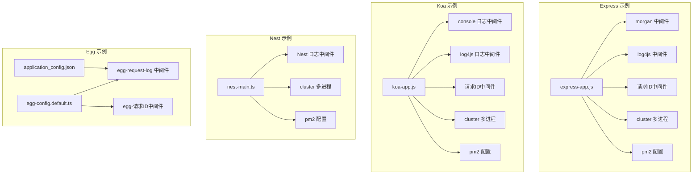
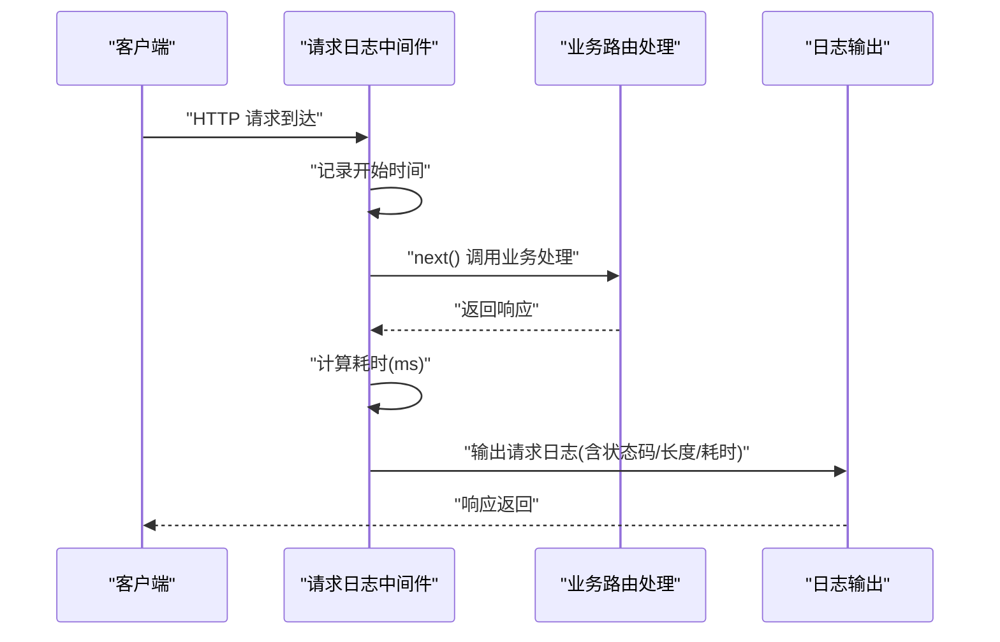
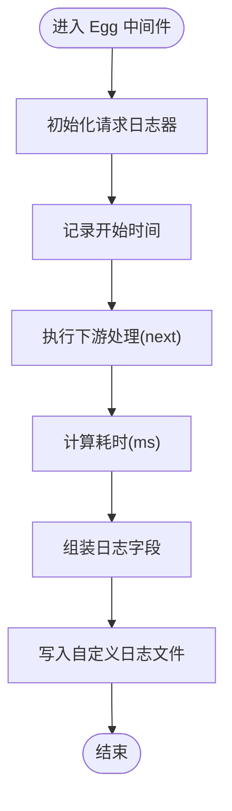
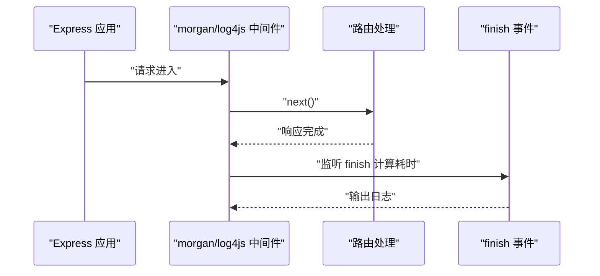
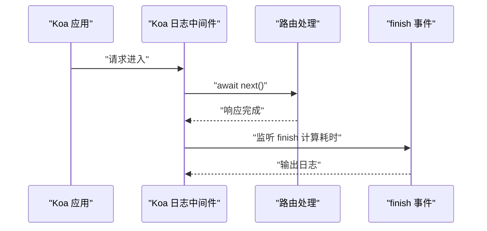
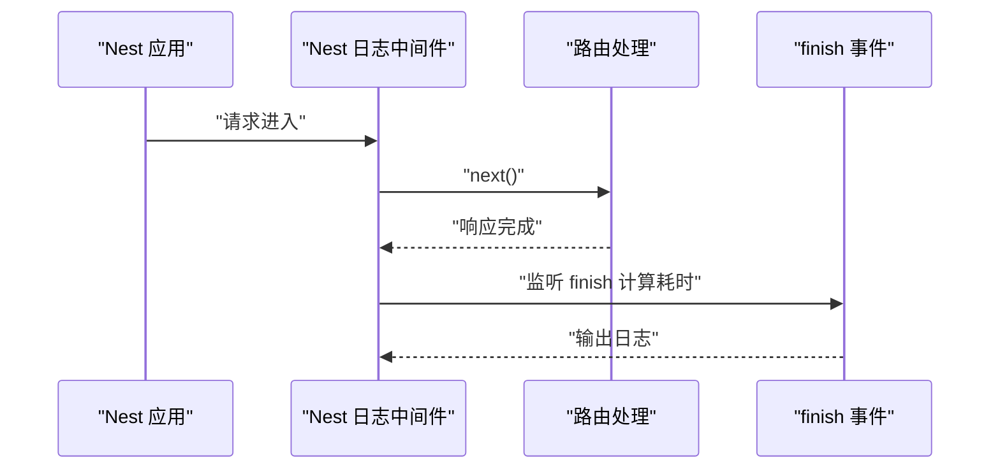
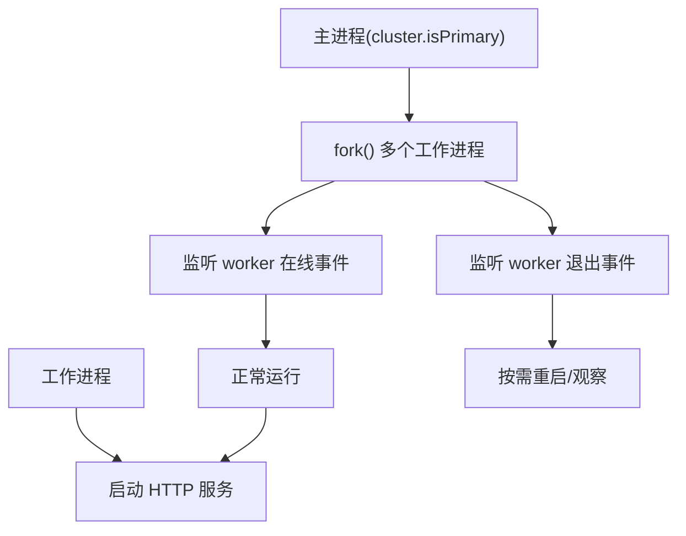
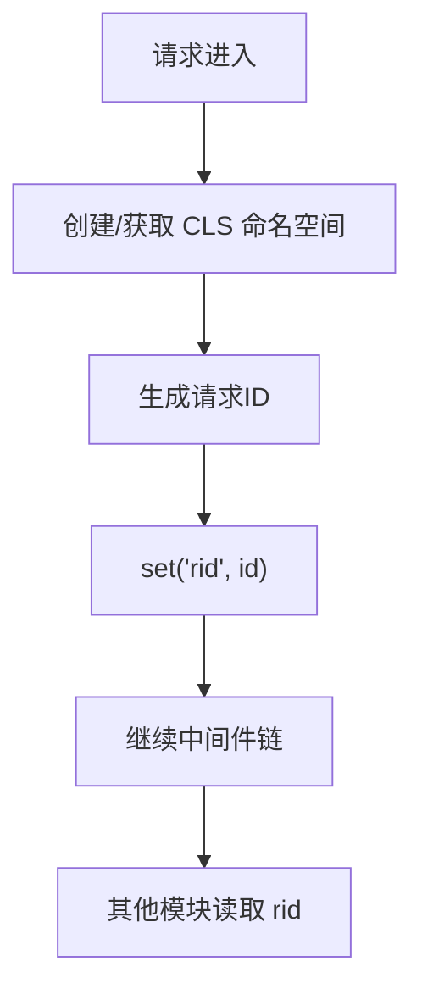
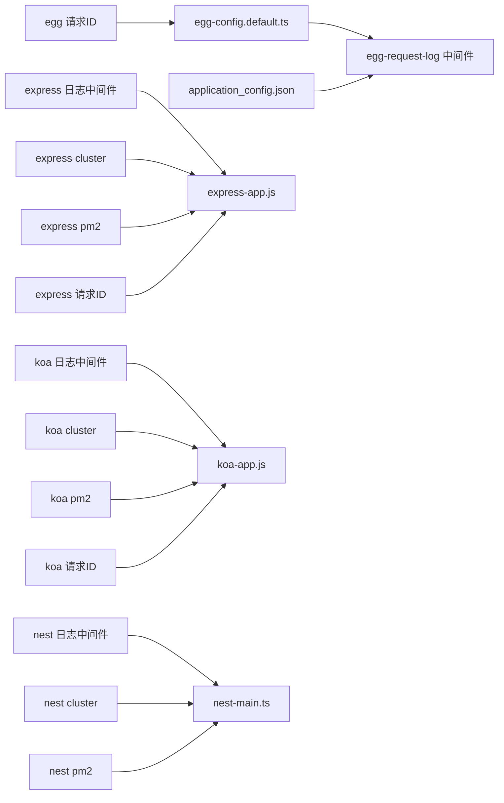

# 性能监控

<cite>
**本文引用的文件**
- [egg-request-log中间件](file://practice/nodejs-service/egg/request-log/app/middleware/request-log.ts)
- [egg-request-log配置](file://practice/nodejs-service/egg/request-log/config/config.default.ts)
- [egg-应用运行配置(application_config.json)](file://practice/nodejs-service/egg/request-log/run/application_config.json)
- [express-morgan日志中间件](file://practice/nodejs-service/express/request-log-morgan/middleware/morgan.middleware.js)
- [express-自定义日志中间件](file://practice/nodejs-service/express/request-log-log4js/middleware/log4js.middleware.js)
- [koa-控制台日志中间件](file://practice/nodejs-service/koa/request-log-console/middleware/console.middleware.js)
- [nest-日志中间件](file://practice/nodejs-service/nest/request-log-log4js/src/middleware/logger.middleware.ts)
- [express-多进程-Cluster](file://practice/nodejs-service/express/multi-process-cluster/bin/multi-process.js)
- [koa-多进程-Cluster](file://practice/nodejs-service/koa/multi-process-cluster/multi-process.js)
- [nest-多进程-Cluster](file://practice/nodejs-service/nest/multi-process-cluster/src/main.ts)
- [express-多进程-pm2](file://practice/nodejs-service/express/multi-process-pm2/process.yml)
- [koa-多进程-pm2](file://practice/nodejs-service/koa/multi-process-pm2/process.yml)
- [nest-多进程-pm2](file://practice/nodejs-service/nest/multi-process-pm2/process.yml)
- [express-请求ID中间件](file://practice/nodejs-service/express/request-id/middleware/rid.middleware.js)
- [koa-请求ID中间件](file://practice/nodejs-service/koa/request-id/middleware/rid.middleware.js)
- [egg-请求ID中间件](file://practice/nodejs-service/egg/request-id/app/middleware/request-id.ts)
- [express-应用入口(app.js)](file://practice/nodejs-service/express/request-id/app.js)
- [koa-应用入口(app.js)](file://practice/nodejs-service/koa/request-id/app.js)
- [nest-应用入口(main.ts)](file://practice/nodejs-service/nest/request-id/src/main.ts)
</cite>

## 目录
1. [引言](#引言)
2. [项目结构](#项目结构)
3. [核心组件](#核心组件)
4. [架构总览](#架构总览)
5. [组件详解](#组件详解)
6. [依赖关系分析](#依赖关系分析)
7. [性能考量与优化建议](#性能考量与优化建议)
8. [故障排查指南](#故障排查指南)
9. [结论](#结论)
10. [附录](#附录)

## 引言
本文件面向企业级 Node.js 应用，系统化梳理在 Express、Koa、Nest、Egg 等框架下如何构建“性能监控体系”，包括指标采集（CPU 使用率、内存占用、请求延迟、吞吐量）、监控数据可视化与告警联动、跨进程/多实例场景下的可观测性落地，以及负载均衡、进程管理与集群监控的最佳实践。文档以仓库中现有中间件与配置为依据，给出可操作的实现路径与优化建议。

## 项目结构
该仓库在 practice/nodejs-service 下提供了多种框架的最小可运行示例，涵盖：
- 请求日志中间件：Express 的 morgan、log4js；Koa 控制台与 log4js；Nest 日志中间件；Egg 自定义请求日志。
- 多进程/集群：Express/Koa/Nest 原生 cluster 示例；pm2 配置示例。
- 请求 ID：基于 CLS 的请求上下文追踪中间件。
- 运行时配置：Egg 的应用运行配置文件，包含 HTTP 客户端与集群监听等参数。

图表来源
- [express-应用入口(app.js):1-45](file://practice/nodejs-service/express/request-id/app.js#L1-L45)
- [koa-应用入口(app.js):1-70](file://practice/nodejs-service/koa/request-id/app.js#L1-L70)
- [nest-应用入口(main.ts):1-19](file://practice/nodejs-service/nest/request-id/src/main.ts#L1-L19)
- [egg-request-log配置:1-83](file://practice/nodejs-service/egg/request-log/config/config.default.ts#L1-L83)
- [egg-应用运行配置(application_config.json):335-393](file://practice/nodejs-service/egg/request-log/run/application_config.json#L335-L393)

章节来源
- [express-应用入口(app.js):1-45](file://practice/nodejs-service/express/request-id/app.js#L1-L45)
- [koa-应用入口(app.js):1-70](file://practice/nodejs-service/koa/request-id/app.js#L1-L70)
- [nest-应用入口(main.ts):1-19](file://practice/nodejs-service/nest/request-id/src/main.ts#L1-L19)
- [egg-request-log配置:1-83](file://practice/nodejs-service/egg/request-log/config/config.default.ts#L1-L83)
- [egg-应用运行配置(application_config.json):335-393](file://practice/nodejs-service/egg/request-log/run/application_config.json#L335-L393)

## 核心组件
- 请求日志中间件：统一采集请求维度指标（远程地址、方法、URL、状态码、响应长度、耗时、来源页、UA），并输出到控制台或日志文件，便于后续聚合与可视化。
- 多进程/集群：通过原生 cluster 或 pm2 启动多实例，提升吞吐与容错能力。
- 请求 ID 中间件：基于 CLS 维持请求上下文，串联日志与指标，支持跨模块/中间件的链路追踪。
- Egg 运行配置：集中管理日志目录、HTTP 客户端连接池、集群监听端口等，影响性能与稳定性。

章节来源
- [egg-request-log中间件:1-48](file://practice/nodejs-service/egg/request-log/app/middleware/request-log.ts#L1-L48)
- [egg-request-log配置:1-83](file://practice/nodejs-service/egg/request-log/config/config.default.ts#L1-L83)
- [egg-应用运行配置(application_config.json):335-393](file://practice/nodejs-service/egg/request-log/run/application_config.json#L335-L393)
- [express-morgan日志中间件:1-34](file://practice/nodejs-service/express/request-log-morgan/middleware/morgan.middleware.js#L1-L34)
- [express-自定义日志中间件:1-33](file://practice/nodejs-service/express/request-log-log4js/middleware/log4js.middleware.js#L1-L33)
- [koa-控制台日志中间件:1-60](file://practice/nodejs-service/koa/request-log-console/middleware/console.middleware.js#L1-L60)
- [nest-日志中间件:1-45](file://practice/nodejs-service/nest/request-log-log4js/src/middleware/logger.middleware.ts#L1-L45)
- [express-多进程-Cluster:1-23](file://practice/nodejs-service/express/multi-process-cluster/bin/multi-process.js#L1-L23)
- [koa-多进程-Cluster:1-25](file://practice/nodejs-service/koa/multi-process-cluster/multi-process.js#L1-L25)
- [nest-多进程-Cluster:1-44](file://practice/nodejs-service/nest/multi-process-cluster/src/main.ts#L1-L44)
- [express-多进程-pm2:1-8](file://practice/nodejs-service/express/multi-process-pm2/process.yml#L1-L8)
- [koa-多进程-pm2:1-6](file://practice/nodejs-service/koa/multi-process-pm2/process.yml#L1-L6)
- [nest-多进程-pm2:1-6](file://practice/nodejs-service/nest/multi-process-pm2/process.yml#L1-L6)
- [express-请求ID中间件:1-35](file://practice/nodejs-service/express/request-id/middleware/rid.middleware.js#L1-L35)
- [koa-请求ID中间件:1-35](file://practice/nodejs-service/koa/request-id/middleware/rid.middleware.js#L1-L35)
- [egg-请求ID中间件:1-200](file://practice/nodejs-service/egg/request-id/app/middleware/request-id.ts#L1-L200)

## 架构总览
下图展示请求在各框架中的典型调用链与指标采集点，强调“请求开始时间”“中间件处理”“响应完成回调/事件”“日志输出”的时序关系，以及多进程/集群对吞吐的影响。

图表来源
- [egg-request-log中间件:22-47](file://practice/nodejs-service/egg/request-log/app/middleware/request-log.ts#L22-L47)
- [express-morgan日志中间件:28-33](file://practice/nodejs-service/express/request-log-morgan/middleware/morgan.middleware.js#L28-L33)
- [express-自定义日志中间件:22-33](file://practice/nodejs-service/express/request-log-log4js/middleware/log4js.middleware.js#L22-L33)
- [koa-控制台日志中间件:28-60](file://practice/nodejs-service/koa/request-log-console/middleware/console.middleware.js#L28-L60)
- [nest-日志中间件:24-44](file://practice/nodejs-service/nest/request-log-log4js/src/middleware/logger.middleware.ts#L24-L44)

## 组件详解

### 请求日志中间件（Egg）
- 指标采集：从请求/响应对象提取远程地址、方法、URL、协议版本、状态码、内容长度、耗时、来源页、UA。
- 输出格式：通过自定义 logger 与 formatter，将指标拼接为统一格式写入日志文件。
- 集成方式：在配置中注册中间件，自动对所有请求生效。

图表来源
- [egg-request-log中间件:22-47](file://practice/nodejs-service/egg/request-log/app/middleware/request-log.ts#L22-L47)
- [egg-request-log配置:41-75](file://practice/nodejs-service/egg/request-log/config/config.default.ts#L41-L75)

章节来源
- [egg-request-log中间件:1-48](file://practice/nodejs-service/egg/request-log/app/middleware/request-log.ts#L1-L48)
- [egg-request-log配置:1-83](file://practice/nodejs-service/egg/request-log/config/config.default.ts#L1-L83)

### 请求日志中间件（Express）
- morgan 中间件：内置 token 扩展 pid、时间戳、级别、标记等，输出统一格式日志。
- log4js 中间件：通过 connectLogger 将请求信息格式化输出至控制台或文件。
- 自定义中间件：在响应 finish 事件中计算耗时并输出日志。

图表来源
- [express-morgan日志中间件:28-33](file://practice/nodejs-service/express/request-log-morgan/middleware/morgan.middleware.js#L28-L33)
- [express-自定义日志中间件:22-33](file://practice/nodejs-service/express/request-log-log4js/middleware/log4js.middleware.js#L22-L33)
- [express-应用入口(app.js):1-45](file://practice/nodejs-service/express/request-id/app.js#L1-L45)

章节来源
- [express-morgan日志中间件:1-34](file://practice/nodejs-service/express/request-log-morgan/middleware/morgan.middleware.js#L1-L34)
- [express-自定义日志中间件:1-33](file://practice/nodejs-service/express/request-log-log4js/middleware/log4js.middleware.js#L1-L33)
- [express-应用入口(app.js):1-45](file://practice/nodejs-service/express/request-id/app.js#L1-L45)

### 请求日志中间件（Koa）
- 控制台中间件：在响应 finish 事件中计算耗时并输出到控制台。
- log4js 中间件：通过 connectLogger 将请求信息格式化输出。
- 特点：Koa 中间件天然支持异步链路，便于在响应阶段统一统计耗时。

图表来源
- [koa-控制台日志中间件:28-60](file://practice/nodejs-service/koa/request-log-console/middleware/console.middleware.js#L28-L60)
- [koa-应用入口(app.js):1-70](file://practice/nodejs-service/koa/request-id/app.js#L1-L70)

章节来源
- [koa-控制台日志中间件:1-60](file://practice/nodejs-service/koa/request-log-console/middleware/console.middleware.js#L1-L60)
- [koa-应用入口(app.js):1-70](file://practice/nodejs-service/koa/request-id/app.js#L1-L70)

### 请求日志中间件（Nest）
- Nest 中间件：在响应 finish 事件中计算耗时并输出到 Nest Logger。
- 适用场景：TypeScript 生态与模块化中间件组织更清晰。

图表来源
- [nest-日志中间件:24-44](file://practice/nodejs-service/nest/request-log-log4js/src/middleware/logger.middleware.ts#L24-L44)
- [nest-应用入口(main.ts):1-19](file://practice/nodejs-service/nest/request-id/src/main.ts#L1-L19)

章节来源
- [nest-日志中间件:1-45](file://practice/nodejs-service/nest/request-log-log4js/src/middleware/logger.middleware.ts#L1-L45)
- [nest-应用入口(main.ts):1-19](file://practice/nodejs-service/nest/request-id/src/main.ts#L1-L19)

### 多进程/集群（Express/Koa/Nest）
- 原生 cluster：根据 CPU 核数启动多个工作进程，主进程负责 fork 与在线/退出事件。
- pm2：通过配置文件指定模式与实例数，适合生产环境部署与自动重启。

图表来源
- [express-多进程-Cluster:4-23](file://practice/nodejs-service/express/multi-process-cluster/bin/multi-process.js#L4-L23)
- [koa-多进程-Cluster:1-25](file://practice/nodejs-service/koa/multi-process-cluster/multi-process.js#L1-L25)
- [nest-多进程-Cluster:20-44](file://practice/nodejs-service/nest/multi-process-cluster/src/main.ts#L20-L44)
- [express-多进程-pm2:1-8](file://practice/nodejs-service/express/multi-process-pm2/process.yml#L1-L8)
- [koa-多进程-pm2:1-6](file://practice/nodejs-service/koa/multi-process-pm2/process.yml#L1-L6)
- [nest-多进程-pm2:1-6](file://practice/nodejs-service/nest/multi-process-pm2/process.yml#L1-L6)

章节来源
- [express-多进程-Cluster:1-23](file://practice/nodejs-service/express/multi-process-cluster/bin/multi-process.js#L1-L23)
- [koa-多进程-Cluster:1-25](file://practice/nodejs-service/koa/multi-process-cluster/multi-process.js#L1-L25)
- [nest-多进程-Cluster:1-44](file://practice/nodejs-service/nest/multi-process-cluster/src/main.ts#L1-L44)
- [express-多进程-pm2:1-8](file://practice/nodejs-service/express/multi-process-pm2/process.yml#L1-L8)
- [koa-多进程-pm2:1-6](file://practice/nodejs-service/koa/multi-process-pm2/process.yml#L1-L6)
- [nest-多进程-pm2:1-6](file://practice/nodejs-service/nest/multi-process-pm2/process.yml#L1-L6)

### 请求 ID 中间件（CLS）
- 作用：为每个请求生成唯一标识，并通过 CLS 在异步链路中传递，便于跨模块/中间件关联日志与指标。
- 实现：创建命名空间，生成自增 ID 并注入上下文。

图表来源
- [express-请求ID中间件:14-28](file://practice/nodejs-service/express/request-id/middleware/rid.middleware.js#L14-L28)
- [koa-请求ID中间件:14-28](file://practice/nodejs-service/koa/request-id/middleware/rid.middleware.js#L14-L28)
- [egg-请求ID中间件:1-200](file://practice/nodejs-service/egg/request-id/app/middleware/request-id.ts#L1-L200)

章节来源
- [express-请求ID中间件:1-35](file://practice/nodejs-service/express/request-id/middleware/rid.middleware.js#L1-L35)
- [koa-请求ID中间件:1-35](file://practice/nodejs-service/koa/request-id/middleware/rid.middleware.js#L1-L35)
- [egg-请求ID中间件:1-200](file://practice/nodejs-service/egg/request-id/app/middleware/request-id.ts#L1-L200)

### Egg 运行配置与性能相关项
- 日志目录：统一输出到 logs 目录，便于采集与归档。
- HTTP 客户端：启用 keepAlive、设置 freeSocketTimeout、maxSockets 等，有助于降低连接开销与提升并发。
- 集群监听：配置监听端口，结合多进程实现水平扩展。
- 其他：workerStartTimeout、serverTimeout、clusterClient 超时等，影响启动与客户端通信稳定性。

章节来源
- [egg-request-log配置:37-75](file://practice/nodejs-service/egg/request-log/config/config.default.ts#L37-L75)
- [egg-应用运行配置(application_config.json):341-393](file://practice/nodejs-service/egg/request-log/run/application_config.json#L341-L393)

## 依赖关系分析
- 中间件依赖：各框架的日志中间件均依赖于框架的请求/响应生命周期钩子（如 Express/Koa 的 next/finalize，Nest 的 Middleware 接口）。
- 多进程依赖：cluster 与 pm2 配置共同决定实例数量与模式，直接影响吞吐与资源占用。
- 请求 ID 依赖：CLS 命名空间贯穿中间件链，确保跨模块可见性。
- Egg 配置依赖：日志、HTTP 客户端、集群参数由配置文件集中管理，影响整体性能与稳定性。

图表来源
- [egg-request-log配置:1-83](file://practice/nodejs-service/egg/request-log/config/config.default.ts#L1-L83)
- [egg-应用运行配置(application_config.json):335-393](file://practice/nodejs-service/egg/request-log/run/application_config.json#L335-L393)
- [express-应用入口(app.js):1-45](file://practice/nodejs-service/express/request-id/app.js#L1-L45)
- [koa-应用入口(app.js):1-70](file://practice/nodejs-service/koa/request-id/app.js#L1-L70)
- [nest-应用入口(main.ts):1-19](file://practice/nodejs-service/nest/request-id/src/main.ts#L1-L19)
- [express-多进程-Cluster:1-23](file://practice/nodejs-service/express/multi-process-cluster/bin/multi-process.js#L1-L23)
- [koa-多进程-Cluster:1-25](file://practice/nodejs-service/koa/multi-process-cluster/multi-process.js#L1-L25)
- [nest-多进程-Cluster:1-44](file://practice/nodejs-service/nest/multi-process-cluster/src/main.ts#L1-L44)
- [express-多进程-pm2:1-8](file://practice/nodejs-service/express/multi-process-pm2/process.yml#L1-L8)
- [koa-多进程-pm2:1-6](file://practice/nodejs-service/koa/multi-process-pm2/process.yml#L1-L6)
- [nest-多进程-pm2:1-6](file://practice/nodejs-service/nest/multi-process-pm2/process.yml#L1-L6)
- [express-请求ID中间件:1-35](file://practice/nodejs-service/express/request-id/middleware/rid.middleware.js#L1-L35)
- [koa-请求ID中间件:1-35](file://practice/nodejs-service/koa/request-id/middleware/rid.middleware.js#L1-L35)
- [egg-请求ID中间件:1-200](file://practice/nodejs-service/egg/request-id/app/middleware/request-id.ts#L1-L200)

## 性能考量与优化建议
- 指标采集
  - 请求延迟与吞吐：通过中间件在响应阶段计算耗时，结合状态码与内容长度，形成 QPS、P95/P99 延迟与错误率的基础数据。
  - CPU/内存：结合操作系统指标与 Node.js 内置采样（如 process.memoryUsage、os.cpus），在多进程/集群场景下进行聚合。
- 可视化与告警
  - 日志采集：将统一格式的日志输出到集中式日志系统（如 ELK、Loki），利用指标查询语言（如 PromQL、LogQL）构建仪表盘。
  - 告警：基于阈值（延迟、错误率、资源使用率）触发告警，结合请求 ID 实现端到端链路定位。
- 多进程/集群
  - 实例数：通常与 CPU 核数相当或略低，避免过度竞争导致抖动；pm2 的 cluster 模式适合快速扩容。
  - 负载均衡：在容器编排或反向代理层进行健康检查与会话亲和，确保流量均匀分布。
- 资源优化与容量规划
  - 连接池：合理设置 keepAlive/freeSocketTimeout/maxSockets，减少连接建立开销。
  - GC 与内存：定期观测堆内外存变化，结合慢日志定位热点接口，优化算法与缓存命中。
  - 容量规划：以峰值 QPS、P99 延迟与资源占用为基准，预留安全余量。

## 故障排查指南
- 日志无法输出
  - 检查日志目录权限与磁盘配额；确认自定义 logger 的 formatter 是否正确。
- 响应耗时不准确
  - 确认中间件顺序与 finish 事件是否在最后触发；避免在下游中间件中覆盖响应头导致 length 不一致。
- 多进程异常
  - 观察主进程 fork/exit 事件日志；核对 pm2 配置的 instances 与模式；检查端口占用与健康检查。
- 请求 ID 丢失
  - 确保 CLS 命名空间创建与 set/get 使用一致；避免在异步回调中未绑定上下文。

章节来源
- [egg-request-log配置:37-75](file://practice/nodejs-service/egg/request-log/config/config.default.ts#L37-L75)
- [egg-request-log中间件:22-47](file://practice/nodejs-service/egg/request-log/app/middleware/request-log.ts#L22-L47)
- [express-多进程-Cluster:16-21](file://practice/nodejs-service/express/multi-process-cluster/bin/multi-process.js#L16-L21)
- [koa-多进程-Cluster:16-21](file://practice/nodejs-service/koa/multi-process-cluster/multi-process.js#L16-L21)
- [nest-多进程-Cluster:30-36](file://practice/nodejs-service/nest/multi-process-cluster/src/main.ts#L30-L36)
- [express-请求ID中间件:14-28](file://practice/nodejs-service/express/request-id/middleware/rid.middleware.js#L14-L28)
- [koa-请求ID中间件:14-28](file://practice/nodejs-service/koa/request-id/middleware/rid.middleware.js#L14-L28)

## 结论
本仓库提供了多框架下的请求日志与多进程实践范式，能够作为企业应用性能监控体系的“观测基础”。通过统一的日志格式、请求 ID 上下文与多实例部署，可以进一步接入指标与告警平台，实现从“可观测”到“可治理”的闭环。

## 附录
- 关键实现路径参考
  - Egg 请求日志中间件与配置：[egg-request-log中间件:1-48](file://practice/nodejs-service/egg/request-log/app/middleware/request-log.ts#L1-L48)、[egg-request-log配置:1-83](file://practice/nodejs-service/egg/request-log/config/config.default.ts#L1-L83)
  - Express/Koa/Nest 日志中间件：[express-morgan日志中间件:1-34](file://practice/nodejs-service/express/request-log-morgan/middleware/morgan.middleware.js#L1-L34)、[express-自定义日志中间件:1-33](file://practice/nodejs-service/express/request-log-log4js/middleware/log4js.middleware.js#L1-L33)、[koa-控制台日志中间件:1-60](file://practice/nodejs-service/koa/request-log-console/middleware/console.middleware.js#L1-L60)、[nest-日志中间件:1-45](file://practice/nodejs-service/nest/request-log-log4js/src/middleware/logger.middleware.ts#L1-L45)
  - 多进程/集群：[express-多进程-Cluster:1-23](file://practice/nodejs-service/express/multi-process-cluster/bin/multi-process.js#L1-L23)、[koa-多进程-Cluster:1-25](file://practice/nodejs-service/koa/multi-process-cluster/multi-process.js#L1-L25)、[nest-多进程-Cluster:1-44](file://practice/nodejs-service/nest/multi-process-cluster/src/main.ts#L1-L44)、[express-多进程-pm2:1-8](file://practice/nodejs-service/express/multi-process-pm2/process.yml#L1-L8)、[koa-多进程-pm2:1-6](file://practice/nodejs-service/koa/multi-process-pm2/process.yml#L1-L6)、[nest-多进程-pm2:1-6](file://practice/nodejs-service/nest/multi-process-pm2/process.yml#L1-L6)
  - 请求 ID：[express-请求ID中间件:1-35](file://practice/nodejs-service/express/request-id/middleware/rid.middleware.js#L1-L35)、[koa-请求ID中间件:1-35](file://practice/nodejs-service/koa/request-id/middleware/rid.middleware.js#L1-L35)、[egg-请求ID中间件:1-200](file://practice/nodejs-service/egg/request-id/app/middleware/request-id.ts#L1-L200)
  - Egg 运行配置：[egg-应用运行配置(application_config.json):335-393](file://practice/nodejs-service/egg/request-log/run/application_config.json#L335-L393)