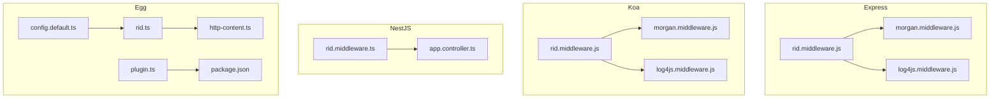
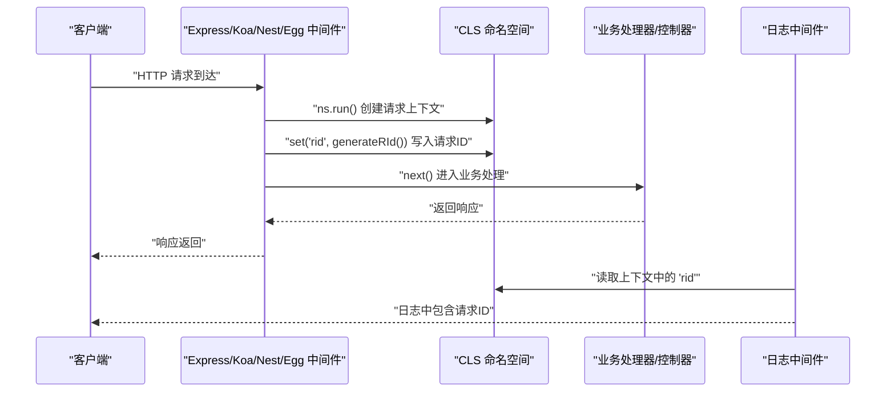
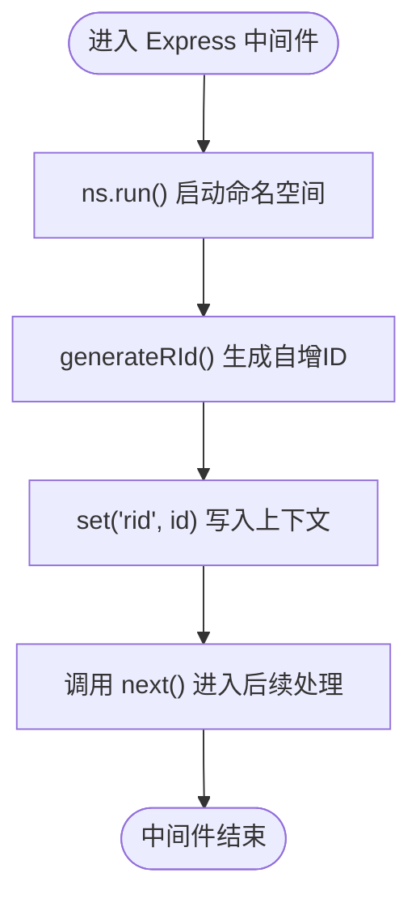
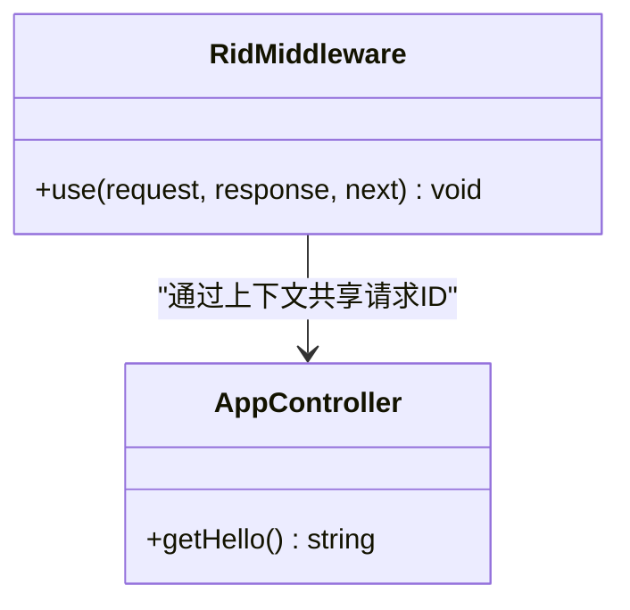
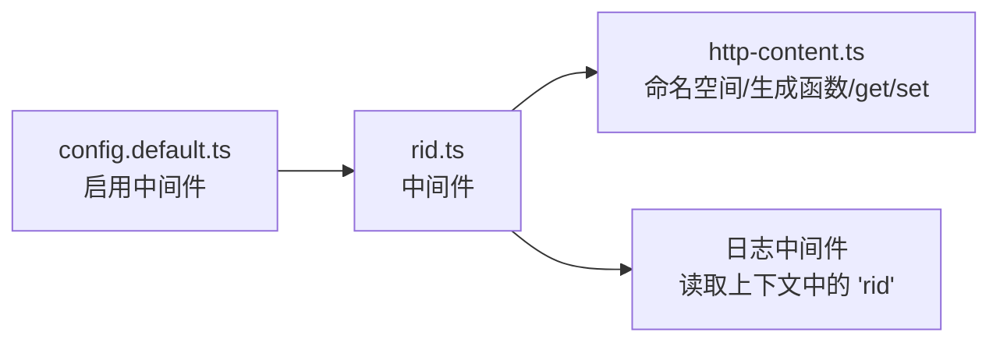
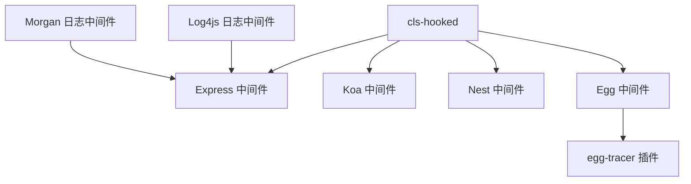

# 请求ID追踪

<cite>
**本文引用的文件**
- [rid.middleware.js（Express）](file://practice/nodejs-service/express/request-id/middleware/rid.middleware.js)
- [rid.middleware.js（Koa）](file://practice/nodejs-service/koa/request-id/middleware/rid.middleware.js)
- [rid.middleware.ts（NestJS）](file://practice/nodejs-service/nest/request-id/src/middleware/rid.middleware.ts)
- [rid.ts（Egg）](file://practice/nodejs-service/egg/request-id/app/middleware/rid.ts)
- [http-content.ts（Egg）](file://practice/nodejs-service/egg/request-id/app/utils/http-content.ts)
- [config.default.ts（Egg 配置）](file://practice/nodejs-service/egg/request-id/config/config.default.ts)
- [plugin.ts（Egg 插件）](file://practice/nodejs-service/egg/request-id/config/plugin.ts)
- [package.json（Egg 项目）](file://practice/nodejs-service/egg/request-id/package.json)
- [app.controller.ts（NestJS 控制器示例）](file://practice/nodejs-service/nest/request-id/src/app.controller.ts)
- [morgan.middleware.js（Express 日志中间件）](file://practice/nodejs-service/express/request-log-morgan/middleware/morgan.middleware.js)
- [log4js.middleware.js（Express 日志中间件）](file://practice/nodejs-service/express/request-log-log4js/middleware/log4js.middleware.js)
</cite>

## 目录
1. [简介](#简介)
2. [项目结构](#项目结构)
3. [核心组件](#核心组件)
4. [架构总览](#架构总览)
5. [组件详解](#组件详解)
6. [依赖关系分析](#依赖关系分析)
7. [性能与可扩展性](#性能与可扩展性)
8. [故障排查指南](#故障排查指南)
9. [结论](#结论)
10. [附录：规范与最佳实践](#附录规范与最佳实践)

## 简介
本文件面向企业级分布式系统，围绕“请求ID追踪”主题，基于仓库中现有的 Express/Koa/Nest/Egg 实现，系统化阐述请求ID的生成策略、在中间件中的注入方式、在日志中的传播与呈现，以及在微服务场景下的应用建议。当前实现采用线程上下文隔离（CLS）与简单自增ID策略，适合入门级追踪与内部演示；对于生产级高并发与多进程/多实例部署，建议结合分布式追踪（如 OpenTelemetry、Jaeger）与全局唯一ID（如 UUID）方案。

## 项目结构
本仓库在多个 Node.js 框架下提供了请求ID中间件与日志集成示例，便于对比不同框架的实现差异与统一接入方式。

图示来源
- [rid.middleware.js（Express）:1-34](file://practice/nodejs-service/express/request-id/middleware/rid.middleware.js#L1-L34)
- [rid.middleware.js（Koa）:1-34](file://practice/nodejs-service/koa/request-id/middleware/rid.middleware.js#L1-L34)
- [rid.middleware.ts（NestJS）:1-37](file://practice/nodejs-service/nest/request-id/src/middleware/rid.middleware.ts#L1-L37)
- [app.controller.ts（NestJS 控制器示例）:1-21](file://practice/nodejs-service/nest/request-id/src/app.controller.ts#L1-L21)
- [rid.ts（Egg）:1-19](file://practice/nodejs-service/egg/request-id/app/middleware/rid.ts#L1-L19)
- [http-content.ts（Egg）:1-23](file://practice/nodejs-service/egg/request-id/app/utils/http-content.ts#L1-L23)
- [config.default.ts（Egg 配置）:1-30](file://practice/nodejs-service/egg/request-id/config/config.default.ts#L1-L30)
- [plugin.ts（Egg 插件）:1-35](file://practice/nodejs-service/egg/request-id/config/plugin.ts#L1-L35)
- [package.json（Egg 项目）:1-57](file://practice/nodejs-service/egg/request-id/package.json#L1-L57)

章节来源
- [rid.middleware.js（Express）:1-34](file://practice/nodejs-service/express/request-id/middleware/rid.middleware.js#L1-L34)
- [rid.middleware.js（Koa）:1-34](file://practice/nodejs-service/koa/request-id/middleware/rid.middleware.js#L1-L34)
- [rid.middleware.ts（NestJS）:1-37](file://practice/nodejs-service/nest/request-id/src/middleware/rid.middleware.ts#L1-L37)
- [app.controller.ts（NestJS 控制器示例）:1-21](file://practice/nodejs-service/nest/request-id/src/app.controller.ts#L1-L21)
- [rid.ts（Egg）:1-19](file://practice/nodejs-service/egg/request-id/app/middleware/rid.ts#L1-L19)
- [http-content.ts（Egg）:1-23](file://practice/nodejs-service/egg/request-id/app/utils/http-content.ts#L1-L23)
- [config.default.ts（Egg 配置）:1-30](file://practice/nodejs-service/egg/request-id/config/config.default.ts#L1-L30)
- [plugin.ts（Egg 插件）:1-35](file://practice/nodejs-service/egg/request-id/config/plugin.ts#L1-L35)
- [package.json（Egg 项目）:1-57](file://practice/nodejs-service/egg/request-id/package.json#L1-L57)

## 核心组件
- 请求ID生成与上下文存储
  - Express/Koa 中间件：使用 CLS 命名空间为每个请求创建独立上下文，并在其中设置键值对（键为“rid”，值为本次请求ID）。生成函数为自增计数器转字符串形式。
  - NestJS 中间件：同理，使用 CLS 命名空间与自增ID生成策略。
  - Egg 中间件：通过工具模块集中管理命名空间、生成函数与 get/set 方法，中间件负责运行命名空间并写入“rid”。

- 日志集成
  - Express/Morgan 与 Express/Log4js：均支持在日志输出中嵌入上下文信息（例如通过 token 注入），从而在日志中呈现请求ID。
  - Koa/Morgan/Log4js：与 Express 类似，可在日志中打印请求ID。

- 配置与插件
  - Egg 的配置文件启用中间件列表，插件清单包含 egg-tracer，表明项目具备扩展分布式追踪的能力。

章节来源
- [rid.middleware.js（Express）:1-34](file://practice/nodejs-service/express/request-id/middleware/rid.middleware.js#L1-L34)
- [rid.middleware.js（Koa）:1-34](file://practice/nodejs-service/koa/request-id/middleware/rid.middleware.js#L1-L34)
- [rid.middleware.ts（NestJS）:1-37](file://practice/nodejs-service/nest/request-id/src/middleware/rid.middleware.ts#L1-L37)
- [rid.ts（Egg）:1-19](file://practice/nodejs-service/egg/request-id/app/middleware/rid.ts#L1-L19)
- [http-content.ts（Egg）:1-23](file://practice/nodejs-service/egg/request-id/app/utils/http-content.ts#L1-L23)
- [morgan.middleware.js（Express 日志中间件）:1-33](file://practice/nodejs-service/express/request-log-morgan/middleware/morgan.middleware.js#L1-L33)
- [log4js.middleware.js（Express 日志中间件）:1-33](file://practice/nodejs-service/express/request-log-log4js/middleware/log4js.middleware.js#L1-L33)
- [config.default.ts（Egg 配置）:1-30](file://practice/nodejs-service/egg/request-id/config/config.default.ts#L1-L30)
- [plugin.ts（Egg 插件）:1-35](file://practice/nodejs-service/egg/request-id/config/plugin.ts#L1-L35)
- [package.json（Egg 项目）:1-57](file://practice/nodejs-service/egg/request-id/package.json#L1-L57)

## 架构总览
以下序列图展示一次请求从进入中间件到被日志采集的关键流程，体现请求ID在系统内的传播路径。

图示来源
- [rid.middleware.js（Express）:22-28](file://practice/nodejs-service/express/request-id/middleware/rid.middleware.js#L22-L28)
- [rid.middleware.js（Koa）:22-28](file://practice/nodejs-service/koa/request-id/middleware/rid.middleware.js#L22-L28)
- [rid.middleware.ts（NestJS）:29-36](file://practice/nodejs-service/nest/request-id/src/middleware/rid.middleware.ts#L29-L36)
- [rid.ts（Egg）:11-18](file://practice/nodejs-service/egg/request-id/app/middleware/rid.ts#L11-L18)
- [http-content.ts（Egg）:20-22](file://practice/nodejs-service/egg/request-id/app/utils/http-content.ts#L20-L22)
- [app.controller.ts（NestJS 控制器示例）:16-20](file://practice/nodejs-service/nest/request-id/src/app.controller.ts#L16-L20)
- [morgan.middleware.js（Express 日志中间件）:28-33](file://practice/nodejs-service/express/request-log-morgan/middleware/morgan.middleware.js#L28-L33)
- [log4js.middleware.js（Express 日志中间件）:22-33](file://practice/nodejs-service/express/request-log-log4js/middleware/log4js.middleware.js#L22-L33)

## 组件详解

### Express 请求ID中间件
- 功能要点
  - 使用 CLS 命名空间隔离请求上下文。
  - 在每次请求进入时生成自增ID并写入上下文。
  - 导出 get/set 以供其他模块读取/写入。
- 关键路径
  - [rid.middleware.js（Express）:1-34](file://practice/nodejs-service/express/request-id/middleware/rid.middleware.js#L1-L34)

图示来源
- [rid.middleware.js（Express）:22-28](file://practice/nodejs-service/express/request-id/middleware/rid.middleware.js#L22-L28)

章节来源
- [rid.middleware.js（Express）:1-34](file://practice/nodejs-service/express/request-id/middleware/rid.middleware.js#L1-L34)

### Koa 请求ID中间件
- 功能要点
  - 与 Express 版本一致，使用 CLS 与自增ID策略。
- 关键路径
  - [rid.middleware.js（Koa）:1-34](file://practice/nodejs-service/koa/request-id/middleware/rid.middleware.js#L1-L34)

章节来源
- [rid.middleware.js（Koa）:1-34](file://practice/nodejs-service/koa/request-id/middleware/rid.middleware.js#L1-L34)

### NestJS 请求ID中间件
- 功能要点
  - 作为 Nest 中间件注册，同样使用 CLS 与自增ID。
  - 控制器示例通过 get('rid') 读取上下文中的请求ID。
- 关键路径
  - [rid.middleware.ts（NestJS）:1-37](file://practice/nodejs-service/nest/request-id/src/middleware/rid.middleware.ts#L1-L37)
  - [app.controller.ts（NestJS 控制器示例）:1-21](file://practice/nodejs-service/nest/request-id/src/app.controller.ts#L1-L21)

图示来源
- [rid.middleware.ts（NestJS）:29-36](file://practice/nodejs-service/nest/request-id/src/middleware/rid.middleware.ts#L29-L36)
- [app.controller.ts（NestJS 控制器示例）:16-20](file://practice/nodejs-service/nest/request-id/src/app.controller.ts#L16-L20)

章节来源
- [rid.middleware.ts（NestJS）:1-37](file://practice/nodejs-service/nest/request-id/src/middleware/rid.middleware.ts#L1-L37)
- [app.controller.ts（NestJS 控制器示例）:1-21](file://practice/nodejs-service/nest/request-id/src/app.controller.ts#L1-L21)

### Egg 请求ID中间件与工具模块
- 功能要点
  - 将 CLS 命名空间、生成函数与 get/set 抽象到工具模块，中间件仅负责运行命名空间并写入“rid”。
  - 配置文件启用中间件列表，插件清单包含 egg-tracer，具备进一步扩展分布式追踪的基础。
- 关键路径
  - [rid.ts（Egg）:1-19](file://practice/nodejs-service/egg/request-id/app/middleware/rid.ts#L1-L19)
  - [http-content.ts（Egg）:1-23](file://practice/nodejs-service/egg/request-id/app/utils/http-content.ts#L1-L23)
  - [config.default.ts（Egg 配置）:1-30](file://practice/nodejs-service/egg/request-id/config/config.default.ts#L1-L30)
  - [plugin.ts（Egg 插件）:1-35](file://practice/nodejs-service/egg/request-id/config/plugin.ts#L1-L35)
  - [package.json（Egg 项目）:1-57](file://practice/nodejs-service/egg/request-id/package.json#L1-L57)

图示来源
- [config.default.ts（Egg 配置）](file://practice/nodejs-service/egg/request-id/config/config.default.ts#L13)
- [rid.ts（Egg）:11-18](file://practice/nodejs-service/egg/request-id/app/middleware/rid.ts#L11-L18)
- [http-content.ts（Egg）:9-22](file://practice/nodejs-service/egg/request-id/app/utils/http-content.ts#L9-L22)

章节来源
- [rid.ts（Egg）:1-19](file://practice/nodejs-service/egg/request-id/app/middleware/rid.ts#L1-L19)
- [http-content.ts（Egg）:1-23](file://practice/nodejs-service/egg/request-id/app/utils/http-content.ts#L1-L23)
- [config.default.ts（Egg 配置）:1-30](file://practice/nodejs-service/egg/request-id/config/config.default.ts#L1-L30)
- [plugin.ts（Egg 插件）:1-35](file://practice/nodejs-service/egg/request-id/config/plugin.ts#L1-L35)
- [package.json（Egg 项目）:1-57](file://practice/nodejs-service/egg/request-id/package.json#L1-L57)

### 日志中间件与请求ID传播
- Morgan/Log4js：均可通过 token 或格式化函数读取上下文中的“rid”，并在日志中输出，实现请求ID在日志链路中的可见性。
- 关键路径
  - [morgan.middleware.js（Express 日志中间件）:1-33](file://practice/nodejs-service/express/request-log-morgan/middleware/morgan.middleware.js#L1-L33)
  - [log4js.middleware.js（Express 日志中间件）:1-33](file://practice/nodejs-service/express/request-log-log4js/middleware/log4js.middleware.js#L1-L33)

章节来源
- [morgan.middleware.js（Express 日志中间件）:1-33](file://practice/nodejs-service/express/request-log-morgan/middleware/morgan.middleware.js#L1-L33)
- [log4js.middleware.js（Express 日志中间件）:1-33](file://practice/nodejs-service/express/request-log-log4js/middleware/log4js.middleware.js#L1-L33)

## 依赖关系分析
- 框架与中间件
  - Express/Koa/Nest/Egg 均依赖 CLS（cls-hooked）以实现请求上下文隔离。
  - Egg 项目声明了 egg-tracer 插件，具备扩展分布式追踪的条件。
- 日志生态
  - Express/Morgan 与 Express/Log4js 提供日志中间件，用于在日志中呈现请求ID。
- 关系图

图示来源
- [rid.middleware.js（Express）](file://practice/nodejs-service/express/request-id/middleware/rid.middleware.js#L7)
- [rid.middleware.js（Koa）](file://practice/nodejs-service/koa/request-id/middleware/rid.middleware.js#L7)
- [rid.middleware.ts（NestJS）](file://practice/nodejs-service/nest/request-id/src/middleware/rid.middleware.ts#L7)
- [rid.ts（Egg）](file://practice/nodejs-service/egg/request-id/app/middleware/rid.ts#L7)
- [package.json（Egg 项目）:30-33](file://practice/nodejs-service/egg/request-id/package.json#L30-L33)
- [morgan.middleware.js（Express 日志中间件）](file://practice/nodejs-service/express/request-log-morgan/middleware/morgan.middleware.js#L8)
- [log4js.middleware.js（Express 日志中间件）](file://practice/nodejs-service/express/request-log-log4js/middleware/log4js.middleware.js#L1)

章节来源
- [package.json（Egg 项目）:1-57](file://practice/nodejs-service/egg/request-id/package.json#L1-L57)

## 性能与可扩展性
- 当前实现
  - 自增ID生成逻辑简单，开销极低；但不具备全局唯一性，不适合多实例/多进程场景。
  - CLS 在单进程内提供上下文隔离，避免参数层层传递，减少样板代码。
- 生产建议
  - 全局唯一ID：引入 UUID v1/v4 或雪花算法（Snowflake）以满足跨实例唯一性与大致有序性需求。
  - 分布式追踪：结合 OpenTelemetry/Jaeger 等生态，实现跨服务链路追踪与可视化。
  - 多实例部署：确保日志采集端能正确读取上下文中的请求ID，并在日志字段中保留该标识以便检索。
- 关键路径
  - [http-content.ts（Egg）:15-18](file://practice/nodejs-service/egg/request-id/app/utils/http-content.ts#L15-L18)
  - [rid.middleware.js（Express）:14-17](file://practice/nodejs-service/express/request-id/middleware/rid.middleware.js#L14-L17)
  - [rid.middleware.js（Koa）:14-17](file://practice/nodejs-service/koa/request-id/middleware/rid.middleware.js#L14-L17)
  - [rid.middleware.ts（NestJS）:20-23](file://practice/nodejs-service/nest/request-id/src/middleware/rid.middleware.ts#L20-L23)

章节来源
- [http-content.ts（Egg）:1-23](file://practice/nodejs-service/egg/request-id/app/utils/http-content.ts#L1-L23)
- [rid.middleware.js（Express）:1-34](file://practice/nodejs-service/express/request-id/middleware/rid.middleware.js#L1-L34)
- [rid.middleware.js（Koa）:1-34](file://practice/nodejs-service/koa/request-id/middleware/rid.middleware.js#L1-L34)
- [rid.middleware.ts（NestJS）:1-37](file://practice/nodejs-service/nest/request-id/src/middleware/rid.middleware.ts#L1-L37)

## 故障排查指南
- 现象：日志中未出现请求ID
  - 排查点
    - 中间件是否在路由之前注册（Egg 配置已启用中间件列表）。
    - 日志中间件是否正确读取上下文中的“rid”。
  - 关键路径
    - [config.default.ts（Egg 配置）](file://practice/nodejs-service/egg/request-id/config/config.default.ts#L13)
    - [morgan.middleware.js（Express 日志中间件）:28-33](file://practice/nodejs-service/express/request-log-morgan/middleware/morgan.middleware.js#L28-L33)
    - [log4js.middleware.js（Express 日志中间件）:22-33](file://practice/nodejs-service/express/request-log-log4js/middleware/log4js.middleware.js#L22-L33)
- 现象：多实例部署后请求ID重复或不唯一
  - 排查点
    - 当前使用自增ID，需替换为全局唯一ID策略。
  - 关键路径
    - [http-content.ts（Egg）:15-18](file://practice/nodejs-service/egg/request-id/app/utils/http-content.ts#L15-L18)
    - [rid.middleware.js（Express）:14-17](file://practice/nodejs-service/express/request-id/middleware/rid.middleware.js#L14-L17)
    - [rid.middleware.js（Koa）:14-17](file://practice/nodejs-service/koa/request-id/middleware/rid.middleware.js#L14-L17)
    - [rid.middleware.ts（NestJS）:20-23](file://practice/nodejs-service/nest/request-id/src/middleware/rid.middleware.ts#L20-L23)

章节来源
- [config.default.ts（Egg 配置）:1-30](file://practice/nodejs-service/egg/request-id/config/config.default.ts#L1-L30)
- [morgan.middleware.js（Express 日志中间件）:1-33](file://practice/nodejs-service/express/request-log-morgan/middleware/morgan.middleware.js#L1-L33)
- [log4js.middleware.js（Express 日志中间件）:1-33](file://practice/nodejs-service/express/request-log-log4js/middleware/log4js.middleware.js#L1-L33)
- [http-content.ts（Egg）:1-23](file://practice/nodejs-service/egg/request-id/app/utils/http-content.ts#L1-L23)
- [rid.middleware.js（Express）:1-34](file://practice/nodejs-service/express/request-id/middleware/rid.middleware.js#L1-L34)
- [rid.middleware.js（Koa）:1-34](file://practice/nodejs-service/koa/request-id/middleware/rid.middleware.js#L1-L34)
- [rid.middleware.ts（NestJS）:1-37](file://practice/nodejs-service/nest/request-id/src/middleware/rid.middleware.ts#L1-L37)

## 结论
本仓库提供了多框架下的请求ID中间件与日志集成示例，展示了通过 CLS 与自增ID实现请求上下文隔离与日志传播的基本思路。对于入门级追踪与内部演示已足够；若要满足企业级分布式系统的需求，建议：
- 引入全局唯一ID（UUID/雪花算法）
- 集成分布式追踪（OpenTelemetry/Jaeger）
- 在多实例/多进程环境下保证请求ID的唯一性与可检索性
- 完善日志字段标准化与审计追踪能力

## 附录：规范与最佳实践
- ID 格式规范
  - 当前实现：自增数字字符串（简单易用，非全局唯一）
  - 生产建议：UUID v4（完全随机）或 UUID v1（带时间戳，可排序）
- 生命周期管理
  - 生成时机：请求进入第一个中间件时
  - 传播范围：贯穿请求处理链路，直至日志输出
  - 清理策略：随请求上下文销毁，无需手动清理
- 应用场景
  - 问题定位：按请求ID聚合日志，快速回溯调用链
  - 性能分析：以请求ID为维度统计响应时间与错误率
  - 审计追踪：在关键操作处记录请求ID，形成可追溯证据链
- 跨服务传递
  - 在请求头中携带请求ID（如 x-request-id），下游服务复用该ID写入日志
  - 若使用分布式追踪，优先采用追踪上下文自动传播（如 OpenTelemetry 的 TextMapPropagator）