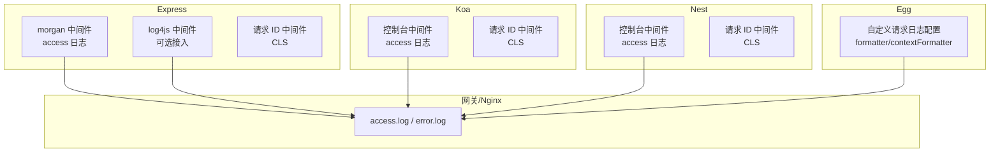
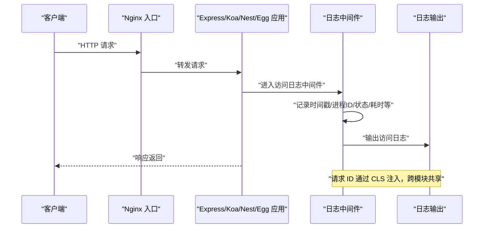
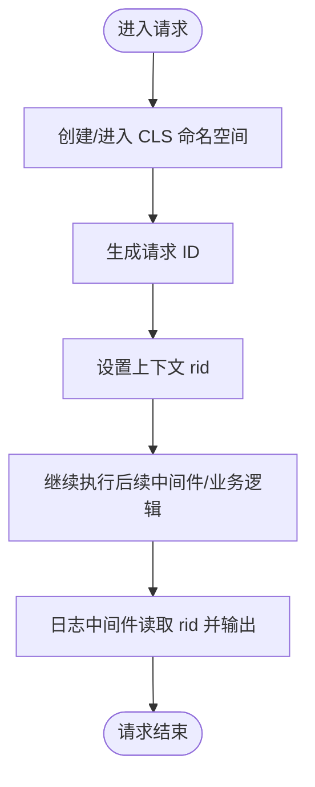
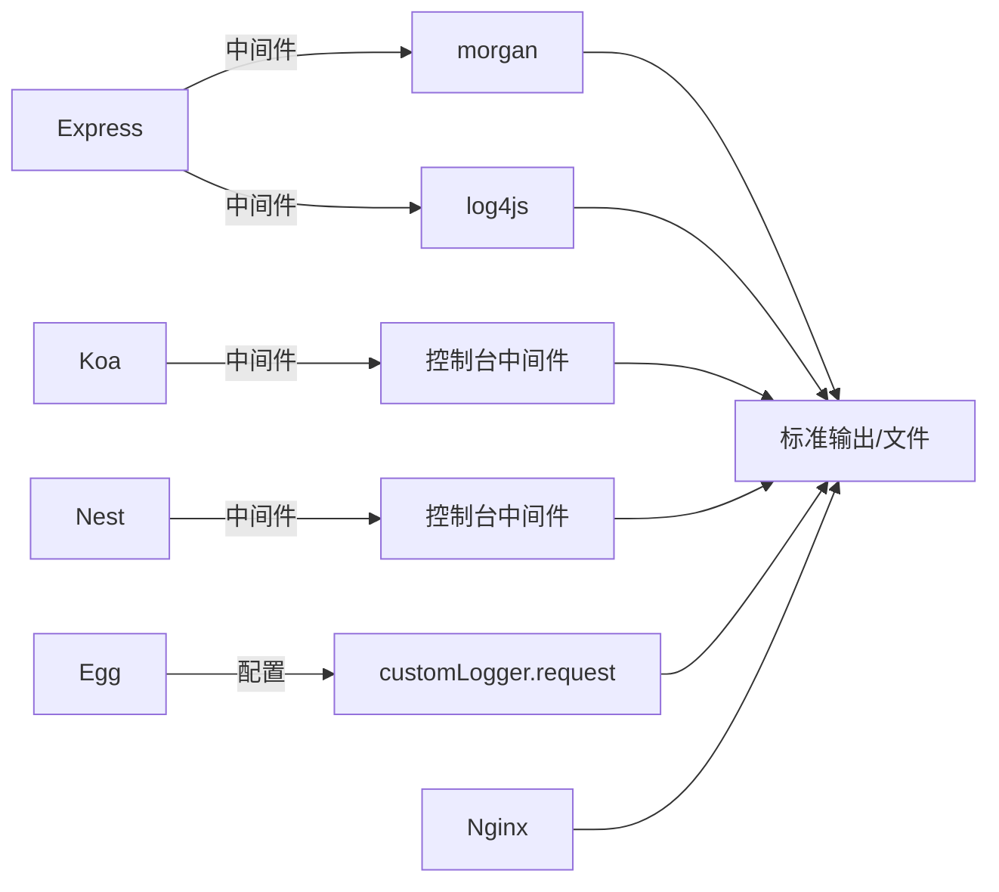

# 请求日志系统

<cite>
**本文引用的文件**
- [morgan 中间件（Express）](file://practice/nodejs-service/express/request-log-morgan/middleware/morgan.middleware.js)
- [log4js 中间件（Express）](file://practice/nodejs-service/express/request-log-log4js/middleware/log4js.middleware.js)
- [控制台中间件（Koa）](file://practice/nodejs-service/koa/request-log-console/middleware/console.middleware.js)
- [Nest 控制台日志中间件](file://practice/nodejs-service/nest/request-log-console/src/middleware/logger.middleware.ts)
- [Egg 日志配置（自定义请求日志）](file://practice/nodejs-service/egg/request-log/config/config.default.ts)
- [Egg 插件配置](file://practice/nodejs-service/egg/request-log/config/plugin.ts)
- [Express 请求 ID 中间件](file://practice/nodejs-service/express/request-id/middleware/rid.middleware.js)
- [Koa 请求 ID 中间件](file://practice/nodejs-service/koa/request-id/middleware/rid.middleware.js)
- [Nest 请求 ID 中间件](file://practice/nodejs-service/nest/request-id/src/middleware/rid.middleware.ts)
- [Nginx 访问日志示例](file://practice/docker-env/cross-domain/nginx/logs/access.log)
- [Nginx 错误日志示例](file://practice/docker-env/cross-domain/nginx/logs/error.log)
</cite>

## 目录
1. [简介](#简介)
2. [项目结构](#项目结构)
3. [核心组件](#核心组件)
4. [架构总览](#架构总览)
5. [组件详解](#组件详解)
6. [依赖关系分析](#依赖关系分析)
7. [性能与容量规划](#性能与容量规划)
8. [故障排查指南](#故障排查指南)
9. [结论](#结论)
10. [附录：日志规范与最佳实践](#附录日志规范与最佳实践)

## 简介
本文件面向企业级 Node.js 应用，系统化阐述请求日志系统的设计与实现，覆盖多框架（Express、Koa、Nest、Egg）下的日志中间件配置、日志格式规范、日志级别与分类、存储策略、日志分析与性能监控、错误/访问/业务日志的区分与处理，以及日志轮转、压缩与归档的最佳实践。通过可视化图示与路径引用，帮助开发者快速落地可维护、可观测、可扩展的日志方案。

## 项目结构
该仓库在 practice/nodejs-service 下提供了多框架的请求日志与请求 ID 示例，便于对比不同框架的接入方式与输出风格；同时在 practice/docker-env/cross-domain/nginx/logs 提供了 Nginx 的访问与错误日志样例，用于理解上游网关层日志。

图表来源
- [morgan 中间件（Express）:28-33](file://practice/nodejs-service/express/request-log-morgan/middleware/morgan.middleware.js#L28-L33)
- [log4js 中间件（Express）:22-33](file://practice/nodejs-service/express/request-log-log4js/middleware/log4js.middleware.js#L22-L33)
- [控制台中间件（Koa）:28-60](file://practice/nodejs-service/koa/request-log-console/middleware/console.middleware.js#L28-L60)
- [Nest 控制台日志中间件:20-45](file://practice/nodejs-service/nest/request-log-console/src/middleware/logger.middleware.ts#L20-L45)
- [Egg 日志配置（自定义请求日志）:37-75](file://practice/nodejs-service/egg/request-log/config/config.default.ts#L37-L75)
- [Nginx 访问日志示例](file://practice/docker-env/cross-domain/nginx/logs/access.log)
- [Nginx 错误日志示例](file://practice/docker-env/cross-domain/nginx/logs/error.log)

章节来源
- [morgan 中间件（Express）:1-34](file://practice/nodejs-service/express/request-log-morgan/middleware/morgan.middleware.js#L1-L34)
- [log4js 中间件（Express）:1-34](file://practice/nodejs-service/express/request-log-log4js/middleware/log4js.middleware.js#L1-L34)
- [控制台中间件（Koa）:1-61](file://practice/nodejs-service/koa/request-log-console/middleware/console.middleware.js#L1-L61)
- [Nest 控制台日志中间件:1-46](file://practice/nodejs-service/nest/request-log-console/src/middleware/logger.middleware.ts#L1-L46)
- [Egg 日志配置（自定义请求日志）:1-83](file://practice/nodejs-service/egg/request-log/config/config.default.ts#L1-L83)
- [Nginx 访问日志示例](file://practice/docker-env/cross-domain/nginx/logs/access.log)
- [Nginx 错误日志示例](file://practice/docker-env/cross-domain/nginx/logs/error.log)

## 核心组件
- Express 访问日志中间件（morgan）
  - 自定义时间戳、进程 ID、日志级别与标记令牌，统一输出格式。
- Express 访问日志中间件（log4js）
  - 基于 log4js 的 connectLogger，支持自定义格式与上下文标记。
- Koa 访问日志中间件（控制台）
  - 手写中间件，记录请求耗时、状态码、长度、UA、Referrer 等。
- Nest 访问日志中间件（控制台）
  - 使用 Nest Logger，在响应 finish 阶段输出访问日志。
- Egg 自定义请求日志
  - 通过 customLogger.request 定义 formatter/contextFormatter，统一输出格式。
- 请求 ID 中间件（Express/Koa/Nest）
  - 基于 cls-hooked 维护请求上下文 ID，贯穿日志链路追踪。
- 网关层日志（Nginx）
  - 提供 access.log 与 error.log 示例，作为上游入口日志参考。

章节来源
- [morgan 中间件（Express）:10-33](file://practice/nodejs-service/express/request-log-morgan/middleware/morgan.middleware.js#L10-L33)
- [log4js 中间件（Express）:3-20](file://practice/nodejs-service/express/request-log-log4js/middleware/log4js.middleware.js#L3-L20)
- [控制台中间件（Koa）:10-60](file://practice/nodejs-service/koa/request-log-console/middleware/console.middleware.js#L10-L60)
- [Nest 控制台日志中间件:4-44](file://practice/nodejs-service/nest/request-log-console/src/middleware/logger.middleware.ts#L4-L44)
- [Egg 日志配置（自定义请求日志）:41-75](file://practice/nodejs-service/egg/request-log/config/config.default.ts#L41-L75)
- [Express 请求 ID 中间件:7-28](file://practice/nodejs-service/express/request-id/middleware/rid.middleware.js#L7-L28)
- [Koa 请求 ID 中间件:7-28](file://practice/nodejs-service/koa/request-id/middleware/rid.middleware.js#L7-L28)
- [Nest 请求 ID 中间件:7-37](file://practice/nodejs-service/nest/request-id/src/middleware/rid.middleware.ts#L7-L37)

## 架构总览
下图展示从客户端到服务端各层的日志生成与流向，强调“请求 ID”贯穿全链路的重要性。

图表来源
- [morgan 中间件（Express）:28-33](file://practice/nodejs-service/express/request-log-morgan/middleware/morgan.middleware.js#L28-L33)
- [log4js 中间件（Express）:22-33](file://practice/nodejs-service/express/request-log-log4js/middleware/log4js.middleware.js#L22-L33)
- [控制台中间件（Koa）:28-60](file://practice/nodejs-service/koa/request-log-console/middleware/console.middleware.js#L28-L60)
- [Nest 控制台日志中间件:20-45](file://practice/nodejs-service/nest/request-log-console/src/middleware/logger.middleware.ts#L20-L45)
- [Express 请求 ID 中间件:22-28](file://practice/nodejs-service/express/request-id/middleware/rid.middleware.js#L22-L28)
- [Koa 请求 ID 中间件:22-28](file://practice/nodejs-service/koa/request-id/middleware/rid.middleware.js#L22-L28)
- [Nest 请求 ID 中间件:28-37](file://practice/nodejs-service/nest/request-id/src/middleware/rid.middleware.ts#L28-L37)

## 组件详解

### Express 访问日志中间件（morgan）
- 设计要点
  - 自定义令牌：pid、timestamp、level、marker，确保统一格式。
  - 输出格式：包含远程地址、方法、URL、协议版本、状态码、内容长度、响应时间、Referrer、UA。
- 适用场景
  - 快速接入、轻量输出；适合中小型服务或开发环境。
- 注意事项
  - 默认输出至标准输出；生产建议结合文件输出与轮转。

章节来源
- [morgan 中间件（Express）:10-33](file://practice/nodejs-service/express/request-log-morgan/middleware/morgan.middleware.js#L10-L33)

### Express 访问日志中间件（log4js）
- 设计要点
  - 通过 log4js.configure 定义 appenders 与 categories。
  - 使用 connectLogger 挂载到 Express，format 回调中拼装字段。
- 适用场景
  - 需要更灵活布局与上下文标记时使用。
- 注意事项
  - 需要额外引入 log4js 依赖；注意连接器的性能开销。

章节来源
- [log4js 中间件（Express）:3-33](file://practice/nodejs-service/express/request-log-log4js/middleware/log4js.middleware.js#L3-L33)

### Koa 访问日志中间件（控制台）
- 设计要点
  - 手写中间件，记录请求开始时间，next 后计算耗时。
  - 在 finish 阶段输出完整访问日志；错误时走 console.error。
- 适用场景
  - 对中间件粒度有更高要求，或希望完全掌控日志结构。
- 注意事项
  - 仅控制台输出；生产需改为文件输出并配合轮转。

章节来源
- [控制台中间件（Koa）:28-60](file://practice/nodejs-service/koa/request-log-console/middleware/console.middleware.js#L28-L60)

### Nest 访问日志中间件（控制台）
- 设计要点
  - 使用 Nest Logger，在响应 finish 事件后输出。
  - 通过工具函数拼接远端地址、方法、URL、协议、状态、长度、耗时、Referrer、UA。
- 适用场景
  - Nest 生态内统一日志输出，便于与框架集成。
- 注意事项
  - 同样默认控制台输出，生产需替换为文件输出与轮转。

章节来源
- [Nest 控制台日志中间件:20-45](file://practice/nodejs-service/nest/request-log-console/src/middleware/logger.middleware.ts#L20-L45)

### Egg 自定义请求日志
- 设计要点
  - 通过 customLogger.request 定义文件名与 formatter/contextFormatter。
  - formatter 将 pid、日期、级别、标记、消息统一格式化输出。
- 适用场景
  - Egg 应用统一接入请求日志，与框架日志体系融合。
- 注意事项
  - 输出目录由 config.logger.dir 指定；需配合文件轮转。

章节来源
- [Egg 日志配置（自定义请求日志）:37-75](file://practice/nodejs-service/egg/request-log/config/config.default.ts#L37-L75)

### 请求 ID 中间件（Express/Koa/Nest）
- 设计要点
  - 基于 cls-hooked 创建命名空间，生成递增 rid 并注入上下文。
  - 在后续日志中间件中读取 rid，实现跨模块链路追踪。
- 适用场景
  - 微服务或多模块协作时，串联同一请求的多段日志。
- 注意事项
  - 保证中间件顺序：请求 ID 中间件在前，日志中间件在其后。

图表来源
- [Express 请求 ID 中间件:22-28](file://practice/nodejs-service/express/request-id/middleware/rid.middleware.js#L22-L28)
- [Koa 请求 ID 中间件:22-28](file://practice/nodejs-service/koa/request-id/middleware/rid.middleware.js#L22-L28)
- [Nest 请求 ID 中间件:28-37](file://practice/nodejs-service/nest/request-id/src/middleware/rid.middleware.ts#L28-L37)

章节来源
- [Express 请求 ID 中间件:7-34](file://practice/nodejs-service/express/request-id/middleware/rid.middleware.js#L7-L34)
- [Koa 请求 ID 中间件:7-34](file://practice/nodejs-service/koa/request-id/middleware/rid.middleware.js#L7-L34)
- [Nest 请求 ID 中间件:7-37](file://practice/nodejs-service/nest/request-id/src/middleware/rid.middleware.ts#L7-L37)

## 依赖关系分析
- 框架侧
  - Express：morgan、log4js、自定义中间件。
  - Koa：自定义中间件。
  - Nest：自定义中间件 + Logger。
  - Egg：customLogger。
- 上游网关
  - Nginx：access.log、error.log，作为入口日志参考。
- 关键依赖
  - cls-hooked：请求上下文隔离与请求 ID 注入。
  - morgan/log4js：Express 访问日志输出。

图表来源
- [morgan 中间件（Express）:8-33](file://practice/nodejs-service/express/request-log-morgan/middleware/morgan.middleware.js#L8-L33)
- [log4js 中间件（Express）:1-33](file://practice/nodejs-service/express/request-log-log4js/middleware/log4js.middleware.js#L1-L33)
- [控制台中间件（Koa）:28-60](file://practice/nodejs-service/koa/request-log-console/middleware/console.middleware.js#L28-L60)
- [Nest 控制台日志中间件:20-45](file://practice/nodejs-service/nest/request-log-console/src/middleware/logger.middleware.ts#L20-L45)
- [Egg 日志配置（自定义请求日志）:41-75](file://practice/nodejs-service/egg/request-log/config/config.default.ts#L41-L75)
- [Nginx 访问日志示例](file://practice/docker-env/cross-domain/nginx/logs/access.log)

章节来源
- [morgan 中间件（Express）:8-33](file://practice/nodejs-service/express/request-log-morgan/middleware/morgan.middleware.js#L8-L33)
- [log4js 中间件（Express）:1-33](file://practice/nodejs-service/express/request-log-log4js/middleware/log4js.middleware.js#L1-L33)
- [控制台中间件（Koa）:28-60](file://practice/nodejs-service/koa/request-log-console/middleware/console.middleware.js#L28-L60)
- [Nest 控制台日志中间件:20-45](file://practice/nodejs-service/nest/request-log-console/src/middleware/logger.middleware.ts#L20-L45)
- [Egg 日志配置（自定义请求日志）:41-75](file://practice/nodejs-service/egg/request-log/config/config.default.ts#L41-L75)
- [Nginx 访问日志示例](file://practice/docker-env/cross-domain/nginx/logs/access.log)

## 性能与容量规划
- 输出路径选择
  - 开发/调试：控制台输出（便于本地查看）。
  - 生产：文件输出 + 轮转，避免 stdout 泄露与磁盘膨胀。
- 日志体积估算
  - 假设每请求日志约 200 字节，QPS 1000，单日约 1.7GB；按 30 天滚动，容量需求约 50GB。
- I/O 优化
  - 异步写入、批量刷盘、缓冲区大小调优。
  - 避免在热路径中进行复杂格式化与字符串拼接。
- 过滤与采样
  - 对高频接口进行采样输出，降低 I/O 压力。
- 资源限制
  - 设置最大文件大小与保留天数，防止磁盘占满。
- 监控指标
  - 写入延迟、队列长度、丢弃数量、磁盘使用率、文件句柄数。

[本节为通用性能建议，不直接分析具体文件]

## 故障排查指南
- 现象：日志中缺少请求 ID
  - 排查：确认请求 ID 中间件是否在日志中间件之前注册。
  - 参考路径：[Express 请求 ID 中间件:22-28](file://practice/nodejs-service/express/request-id/middleware/rid.middleware.js#L22-L28)
- 现象：日志格式不一致
  - 排查：检查 morgan/log4js/format 回调与 Egg formatter 是否统一。
  - 参考路径：[morgan 中间件（Express）:28-33](file://practice/nodejs-service/express/request-log-morgan/middleware/morgan.middleware.js#L28-L33)、[log4js 中间件（Express）:22-33](file://practice/nodejs-service/express/request-log-log4js/middleware/log4js.middleware.js#L22-L33)、[Egg 日志配置（自定义请求日志）:44-73](file://practice/nodejs-service/egg/request-log/config/config.default.ts#L44-L73)
- 现象：Nginx 与应用日志不匹配
  - 排查：核对上游转发头（如 X-Forwarded-For）、时间戳与时区。
  - 参考路径：[Nginx 访问日志示例](file://practice/docker-env/cross-domain/nginx/logs/access.log)
- 现象：日志文件过大未轮转
  - 排查：确认轮转策略（大小/时间）与保留策略已生效。
  - 参考路径：[Nginx 错误日志示例](file://practice/docker-env/cross-domain/nginx/logs/error.log)

章节来源
- [Express 请求 ID 中间件:22-28](file://practice/nodejs-service/express/request-id/middleware/rid.middleware.js#L22-L28)
- [morgan 中间件（Express）:28-33](file://practice/nodejs-service/express/request-log-morgan/middleware/morgan.middleware.js#L28-L33)
- [log4js 中间件（Express）:22-33](file://practice/nodejs-service/express/request-log-log4js/middleware/log4js.middleware.js#L22-L33)
- [Egg 日志配置（自定义请求日志）:44-73](file://practice/nodejs-service/egg/request-log/config/config.default.ts#L44-L73)
- [Nginx 访问日志示例](file://practice/docker-env/cross-domain/nginx/logs/access.log)
- [Nginx 错误日志示例](file://practice/docker-env/cross-domain/nginx/logs/error.log)

## 结论
本方案以“统一格式 + 请求 ID + 多框架适配”为核心，兼顾易用性与可扩展性。通过在 Express/Koa/Nest/Egg 中采用一致的日志中间件模式，并结合 Egg 的自定义日志配置与 Nginx 入口日志，形成从网关到应用的完整观测闭环。生产落地建议优先采用文件输出与轮转策略，配合采样与过滤，确保可观测性与性能平衡。

[本节为总结性内容，不直接分析具体文件]

## 附录：日志规范与最佳实践

### 日志格式规范
- 通用字段
  - 时间戳：ISO8601 或本地化格式（带替换斜杠），确保排序与可读性。
  - 进程 ID：固定宽度，便于多实例对比。
  - 日志级别：INFO/WARN/ERROR 等，统一宽度对齐。
  - 标记（Marker）：COMMON/BUSINESS/SECURITY 等，标识日志类型。
  - 请求 ID：唯一标识一次请求，贯穿全链路。
  - 远端地址：优先取 X-Forwarded-For。
  - 方法/URL/协议版本：标准化输出。
  - 状态码/内容长度：便于统计与告警。
  - 响应时间：毫秒，用于性能分析。
  - Referrer/User-Agent：便于来源与兼容性分析。
- 输出位置
  - 开发：控制台。
  - 生产：文件（统一目录），配合轮转。

章节来源
- [morgan 中间件（Express）:10-33](file://practice/nodejs-service/express/request-log-morgan/middleware/morgan.middleware.js#L10-L33)
- [log4js 中间件（Express）:22-33](file://practice/nodejs-service/express/request-log-log4js/middleware/log4js.middleware.js#L22-L33)
- [控制台中间件（Koa）:10-60](file://practice/nodejs-service/koa/request-log-console/middleware/console.middleware.js#L10-L60)
- [Nest 控制台日志中间件:4-44](file://practice/nodejs-service/nest/request-log-console/src/middleware/logger.middleware.ts#L4-L44)
- [Egg 日志配置（自定义请求日志）:44-73](file://practice/nodejs-service/egg/request-log/config/config.default.ts#L44-L73)

### 日志级别分类
- TRACE：极细粒度诊断信息（谨慎使用）。
- DEBUG：调试信息（开发/测试环境）。
- INFO：常规访问与业务成功事件。
- WARN：潜在问题（配置不当、降级）。
- ERROR：异常与错误（含堆栈与上下文）。

[本节为通用规范说明，不直接分析具体文件]

### 存储策略
- 文件落盘：统一输出到 ./logs，按日期/大小轮转。
- 归档：保留最近 30 天，超过期限压缩归档。
- 清理：定期清理过期文件，监控磁盘阈值告警。

[本节为通用策略说明，不直接分析具体文件]

### 日志分析方法
- 访问分析：UV/PV、Top URL、状态码分布、平均/分位响应时间。
- 错误分析：错误码 Top、错误趋势、关联请求 ID 快速定位。
- 业务分析：埋点日志聚合、转化漏斗、用户行为画像。

[本节为通用方法说明，不直接分析具体文件]

### 性能监控指标
- 写入延迟：P50/P95/P99。
- 队列长度：积压告警。
- 丢弃数量：I/O 压力指标。
- 磁盘使用率：容量预警。
- 文件句柄数：资源上限监控。

[本节为通用指标说明，不直接分析具体文件]

### 错误日志、访问日志、业务日志的区分与处理
- 访问日志：统一格式、高频、低开销，建议采样。
- 错误日志：包含上下文与堆栈，严格级别控制。
- 业务日志：结构化埋点，便于统计与回放。

[本节为通用方法说明，不直接分析具体文件]

### 日志轮转、压缩与归档最佳实践
- 轮转触发：文件大小达到阈值或每日滚动。
- 压缩：历史日志 gzip 压缩，减少存储占用。
- 归档：按月/季度归档至对象存储或冷存储。
- 清理：基于保留策略自动删除过期文件。

[本节为通用实践说明，不直接分析具体文件]