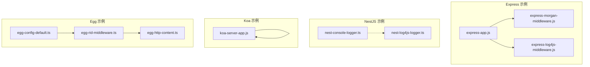
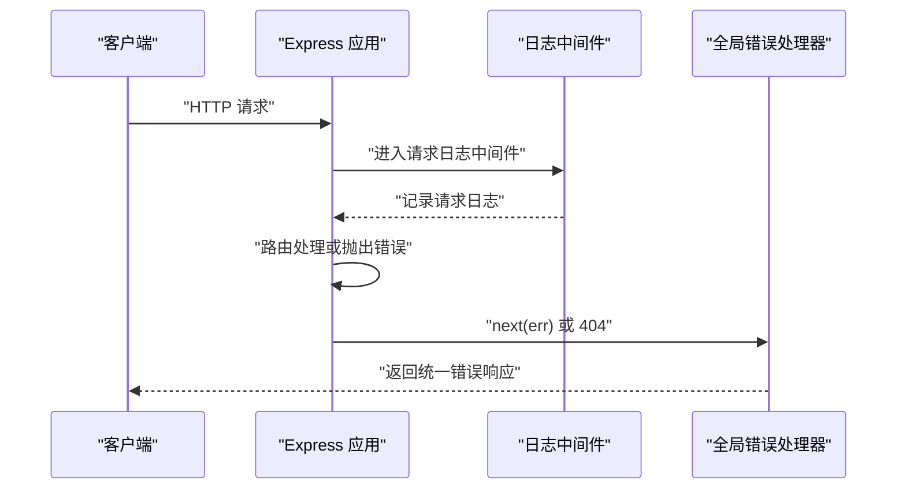
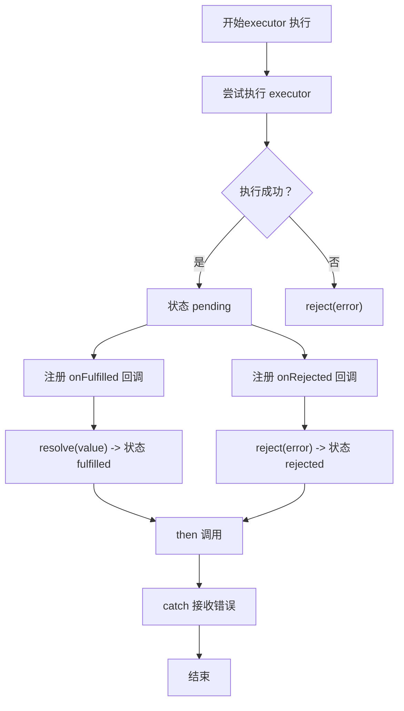
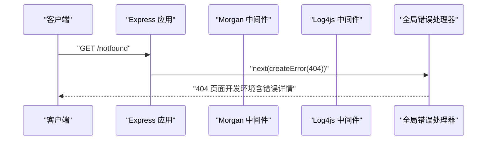
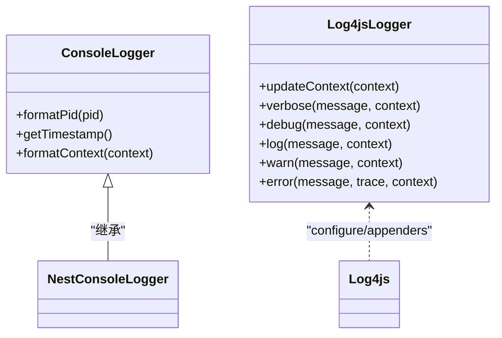
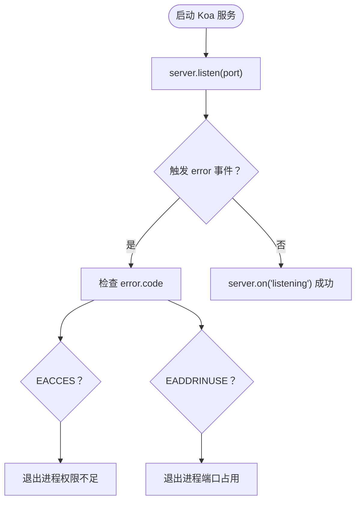
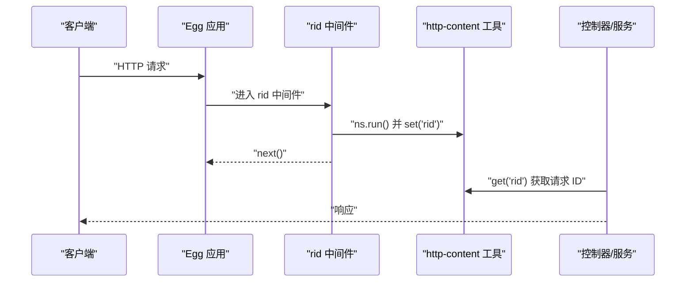
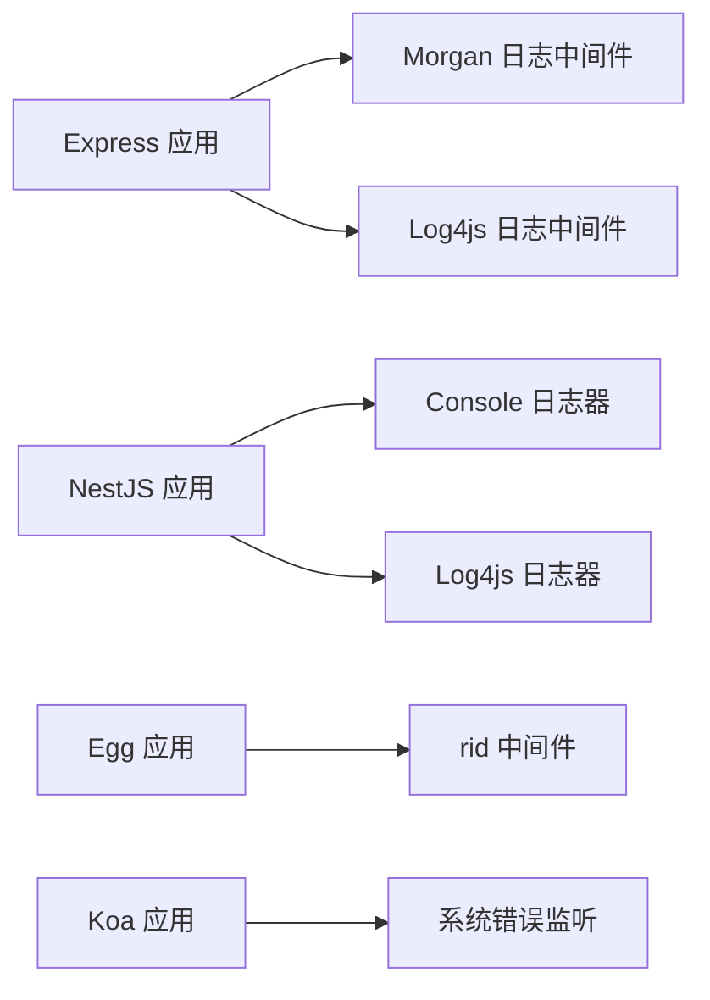

# 错误处理机制

<cite>
**本文引用的文件**   
- [my-promise.ts](file://handwritten-code/src/my-promise.ts)
- [express-app.js](file://practice/nodejs-service/express/request-id/app.js)
- [express-morgan-middleware.js](file://practice/nodejs-service/express/request-log-morgan/middleware/morgan.middleware.js)
- [express-log4js-middleware.js](file://practice/nodejs-service/express/request-log-log4js/middleware/log4js.middleware.js)
- [nest-console-logger.ts](file://practice/nodejs-service/nest/request-log-console/src/middleware/console.logger.ts)
- [nest-log4js-logger.ts](file://practice/nodejs-service/nest/request-log-log4js/src/middleware/log4js.logger.ts)
- [koa-server-app.js](file://practice/nodejs-service/koa/request-id/app.js)
- [egg-config-default.ts](file://practice/nodejs-service/egg/request-id/config/config.default.ts)
- [egg-rid-middleware.ts](file://practice/nodejs-service/egg/request-id/app/middleware/rid.ts)
- [egg-http-content.ts](file://practice/nodejs-service/egg/request-id/app/utils/http-content.ts)
</cite>

## 目录
1. [引言](#引言)
2. [项目结构](#项目结构)
3. [核心组件](#核心组件)
4. [架构总览](#架构总览)
5. [详细组件分析](#详细组件分析)
6. [依赖关系分析](#依赖关系分析)
7. [性能考量](#性能考量)
8. [故障排查指南](#故障排查指南)
9. [结论](#结论)
10. [附录](#附录)

## 引言
本文件系统化梳理仓库中与“错误处理”相关的设计与实现，覆盖以下主题：
- 异常捕获与错误分类：从 Promise 链式调用到 HTTP 层错误处理
- 统一处理策略：中间件与全局错误处理器的协同
- 多框架实现：Express、Koa、NestJS、Egg 的错误处理与日志配置
- 最佳实践：错误日志记录、用户友好响应、调试信息收集
- 常见场景与恢复：网络监听错误、HTTP 资源未找到等
- 监控与告警：日志格式化、上下文追踪与请求 ID 关联
- 性能影响评估与优化建议

## 项目结构
围绕错误处理的关键目录与文件如下：
- 手写 Promise 实现：用于理解错误在异步链中的传播与捕获
- Express 应用：演示 404 捕获与全局错误处理器
- 日志中间件：Morgan 与 Log4js 的请求日志中间件
- NestJS 日志器：自定义控制台与 Log4js 日志器
- Koa 服务：监听错误事件的处理示例
- Egg 配置与中间件：请求 ID 中间件与全局配置

**图表来源**
- [express-app.js:1-45](file://practice/nodejs-service/express/request-id/app.js#L1-L45)
- [express-morgan-middleware.js:1-33](file://practice/nodejs-service/express/request-log-morgan/middleware/morgan.middleware.js#L1-L33)
- [express-log4js-middleware.js:1-34](file://practice/nodejs-service/express/request-log-log4js/middleware/log4js.middleware.js#L1-L34)
- [nest-console-logger.ts:1-32](file://practice/nodejs-service/nest/request-log-console/src/middleware/console.logger.ts#L1-L32)
- [nest-log4js-logger.ts:1-92](file://practice/nodejs-service/nest/request-log-log4js/src/middleware/log4js.logger.ts#L1-L92)
- [koa-server-app.js:1-70](file://practice/nodejs-service/koa/request-id/app.js#L1-L70)
- [egg-config-default.ts:1-30](file://practice/nodejs-service/egg/request-id/config/config.default.ts#L1-L30)
- [egg-rid-middleware.ts:1-19](file://practice/nodejs-service/egg/request-id/app/middleware/rid.ts#L1-L19)
- [egg-http-content.ts:1-23](file://practice/nodejs-service/egg/request-id/app/utils/http-content.ts#L1-L23)

**章节来源**
- [express-app.js:1-45](file://practice/nodejs-service/express/request-id/app.js#L1-L45)
- [express-morgan-middleware.js:1-33](file://practice/nodejs-service/express/request-log-morgan/middleware/morgan.middleware.js#L1-L33)
- [express-log4js-middleware.js:1-34](file://practice/nodejs-service/express/request-log-log4js/middleware/log4js.middleware.js#L1-L34)
- [nest-console-logger.ts:1-32](file://practice/nodejs-service/nest/request-log-console/src/middleware/console.logger.ts#L1-L32)
- [nest-log4js-logger.ts:1-92](file://practice/nodejs-service/nest/request-log-log4js/src/middleware/log4js.logger.ts#L1-L92)
- [koa-server-app.js:1-70](file://practice/nodejs-service/koa/request-id/app.js#L1-L70)
- [egg-config-default.ts:1-30](file://practice/nodejs-service/egg/request-id/config/config.default.ts#L1-L30)
- [egg-rid-middleware.ts:1-19](file://practice/nodejs-service/egg/request-id/app/middleware/rid.ts#L1-L19)
- [egg-http-content.ts:1-23](file://practice/nodejs-service/egg/request-id/app/utils/http-content.ts#L1-L23)

## 核心组件
- 自定义 Promise 实现：展示错误在 then 链中的传播、拒绝处理与循环检测
- Express 全局错误处理器：统一设置响应状态码与错误页面渲染
- 请求日志中间件：Morgan 与 Log4js，标准化访问日志输出
- NestJS 日志器：统一日志格式与上下文注入
- Koa 监听错误事件：端口占用与权限不足等系统级错误处理
- Egg 请求 ID 中间件：基于命名空间的请求上下文传递

**章节来源**
- [my-promise.ts:1-237](file://handwritten-code/src/my-promise.ts#L1-L237)
- [express-app.js:22-42](file://practice/nodejs-service/express/request-id/app.js#L22-L42)
- [express-morgan-middleware.js:28-33](file://practice/nodejs-service/express/request-log-morgan/middleware/morgan.middleware.js#L28-L33)
- [express-log4js-middleware.js:22-33](file://practice/nodejs-service/express/request-log-log4js/middleware/log4js.middleware.js#L22-L33)
- [nest-console-logger.ts:9-31](file://practice/nodejs-service/nest/request-log-console/src/middleware/console.logger.ts#L9-L31)
- [nest-log4js-logger.ts:34-92](file://practice/nodejs-service/nest/request-log-log4js/src/middleware/log4js.logger.ts#L34-L92)
- [koa-server-app.js:44-69](file://practice/nodejs-service/koa/request-id/app.js#L44-L69)
- [egg-rid-middleware.ts:11-18](file://practice/nodejs-service/egg/request-id/app/middleware/rid.ts#L11-L18)
- [egg-http-content.ts:9-23](file://practice/nodejs-service/egg/request-id/app/utils/http-content.ts#L9-L23)

## 架构总览
下图展示了从请求进入应用到错误被捕获与日志输出的整体流程，涵盖 Express、NestJS、Koa 与 Egg 的典型路径。

**图表来源**
- [express-app.js:8-42](file://practice/nodejs-service/express/request-id/app.js#L8-L42)
- [express-morgan-middleware.js:28-33](file://practice/nodejs-service/express/request-log-morgan/middleware/morgan.middleware.js#L28-L33)
- [express-log4js-middleware.js:22-33](file://practice/nodejs-service/express/request-log-log4js/middleware/log4js.middleware.js#L22-L33)

## 详细组件分析

### 自定义 Promise 错误传播与拒绝处理
- 错误在链式 then 中的传播：当 onFulfilled 抛错时，后续 catch 将接收到该错误；若未提供 catch，错误将冒泡至全局
- 循环检测与拒绝保护：对 then 返回自身的情况进行类型检查并拒绝，避免死循环
- 同步执行异常捕获：构造函数内抛出的异常直接转为 rejected 状态

**图表来源**
- [my-promise.ts:84-121](file://handwritten-code/src/my-promise.ts#L84-L121)
- [my-promise.ts:123-182](file://handwritten-code/src/my-promise.ts#L123-L182)
- [my-promise.ts:27-66](file://handwritten-code/src/my-promise.ts#L27-L66)

**章节来源**
- [my-promise.ts:1-237](file://handwritten-code/src/my-promise.ts#L1-L237)

### Express 错误处理与统一响应
- 404 捕获：使用 http-errors 创建 404，并交由全局错误处理器
- 全局错误处理器：根据环境变量决定是否返回错误详情；设置状态码并渲染错误页
- 请求日志：Morgan 与 Log4js 中间件分别输出标准格式与结构化日志

**图表来源**
- [express-app.js:22-42](file://practice/nodejs-service/express/request-id/app.js#L22-L42)
- [express-morgan-middleware.js:28-33](file://practice/nodejs-service/express/request-log-morgan/middleware/morgan.middleware.js#L28-L33)
- [express-log4js-middleware.js:22-33](file://practice/nodejs-service/express/request-log-log4js/middleware/log4js.middleware.js#L22-L33)

**章节来源**
- [express-app.js:1-45](file://practice/nodejs-service/express/request-id/app.js#L1-L45)
- [express-morgan-middleware.js:1-33](file://practice/nodejs-service/express/request-log-morgan/middleware/morgan.middleware.js#L1-L33)
- [express-log4js-middleware.js:1-34](file://practice/nodejs-service/express/request-log-log4js/middleware/log4js.middleware.js#L1-L34)

### NestJS 日志器与上下文追踪
- 控制台日志器：重写 PID、时间戳与上下文格式，便于多模块日志统一
- Log4js 日志器：通过 configure 定义 appenders 与 categories，支持上下文 name 注入
- 上下文更新：按需动态更新日志上下文，便于关联请求 ID 与模块名

**图表来源**
- [nest-console-logger.ts:9-31](file://practice/nodejs-service/nest/request-log-console/src/middleware/console.logger.ts#L9-L31)
- [nest-log4js-logger.ts:34-92](file://practice/nodejs-service/nest/request-log-log4js/src/middleware/log4js.logger.ts#L34-L92)

**章节来源**
- [nest-console-logger.ts:1-32](file://practice/nodejs-service/nest/request-log-console/src/middleware/console.logger.ts#L1-L32)
- [nest-log4js-logger.ts:1-92](file://practice/nodejs-service/nest/request-log-log4js/src/middleware/log4js.logger.ts#L1-L92)

### Koa 监听错误事件与恢复
- 监听 server.on('error')：区分权限不足与端口占用等系统级错误，优雅退出或提示
- 监听 server.on('listening')：确认启动成功

**图表来源**
- [koa-server-app.js:44-69](file://practice/nodejs-service/koa/request-id/app.js#L44-L69)

**章节来源**
- [koa-server-app.js:1-70](file://practice/nodejs-service/koa/request-id/app.js#L1-L70)

### Egg 请求 ID 中间件与配置
- 命名空间：使用 cls-hooked 创建命名空间，保证请求上下文隔离
- 中间件：在每次请求中生成并注入 rid，供后续模块读取
- 配置：在 config.default.ts 中启用中间件，确保全局生效

**图表来源**
- [egg-rid-middleware.ts:11-18](file://practice/nodejs-service/egg/request-id/app/middleware/rid.ts#L11-L18)
- [egg-http-content.ts:9-23](file://practice/nodejs-service/egg/request-id/app/utils/http-content.ts#L9-L23)
- [egg-config-default.ts:13-13](file://practice/nodejs-service/egg/request-id/config/config.default.ts#L13-L13)

**章节来源**
- [egg-rid-middleware.ts:1-19](file://practice/nodejs-service/egg/request-id/app/middleware/rid.ts#L1-L19)
- [egg-http-content.ts:1-23](file://practice/nodejs-service/egg/request-id/app/utils/http-content.ts#L1-L23)
- [egg-config-default.ts:1-30](file://practice/nodejs-service/egg/request-id/config/config.default.ts#L1-L30)

## 依赖关系分析
- Express 与日志中间件：通过中间件顺序控制日志输出时机
- NestJS 日志器：可同时使用控制台与 Log4js，满足不同场景需求
- Egg 与 CLS：通过命名空间实现跨模块请求上下文共享
- Koa 与系统错误：监听底层错误事件，避免未捕获异常导致进程崩溃

**图表来源**
- [express-morgan-middleware.js:28-33](file://practice/nodejs-service/express/request-log-morgan/middleware/morgan.middleware.js#L28-L33)
- [express-log4js-middleware.js:22-33](file://practice/nodejs-service/express/request-log-log4js/middleware/log4js.middleware.js#L22-L33)
- [nest-console-logger.ts:9-31](file://practice/nodejs-service/nest/request-log-console/src/middleware/console.logger.ts#L9-L31)
- [nest-log4js-logger.ts:34-92](file://practice/nodejs-service/nest/request-log-log4js/src/middleware/log4js.logger.ts#L34-L92)
- [egg-rid-middleware.ts:11-18](file://practice/nodejs-service/egg/request-id/app/middleware/rid.ts#L11-L18)
- [koa-server-app.js:44-69](file://practice/nodejs-service/koa/request-id/app.js#L44-L69)

**章节来源**
- [express-morgan-middleware.js:1-33](file://practice/nodejs-service/express/request-log-morgan/middleware/morgan.middleware.js#L1-L33)
- [express-log4js-middleware.js:1-34](file://practice/nodejs-service/express/request-log-log4js/middleware/log4js.middleware.js#L1-L34)
- [nest-console-logger.ts:1-32](file://practice/nodejs-service/nest/request-log-console/src/middleware/console.logger.ts#L1-L32)
- [nest-log4js-logger.ts:1-92](file://practice/nodejs-service/nest/request-log-log4js/src/middleware/log4js.logger.ts#L1-L92)
- [egg-rid-middleware.ts:1-19](file://practice/nodejs-service/egg/request-id/app/middleware/rid.ts#L1-L19)
- [koa-server-app.js:1-70](file://practice/nodejs-service/koa/request-id/app.js#L1-L70)

## 性能考量
- 日志中间件开销：Morgan 与 Log4js 在高并发下会增加 I/O 压力，建议生产环境采用异步 appenders 或采样策略
- 错误处理器成本：全局错误处理器应尽量避免昂贵操作（如数据库查询），仅记录必要字段
- Promise 链深度：过深的链式调用会增加内存与调度开销，建议拆分任务与合理使用并发控制
- 监听错误事件：Koa 的 server.on('error') 可避免未捕获异常导致的崩溃，但频繁端口冲突可能影响可用性，建议预检端口与自动切换

## 故障排查指南
- 404 未找到：确认路由是否存在，检查全局错误处理器是否正确转发 createError
- 开发环境错误详情：确保环境变量设置为开发模式以返回错误堆栈
- 生产环境静默错误：关闭开发模式，仅记录错误消息，避免敏感信息泄露
- 端口占用与权限不足：Koa 监听错误事件中已区分处理，建议在启动前进行端口健康检查
- 请求 ID 丢失：检查 Egg 中间件是否在全局配置中启用，确认命名空间初始化与注入逻辑

**章节来源**
- [express-app.js:28-42](file://practice/nodejs-service/express/request-id/app.js#L28-L42)
- [koa-server-app.js:44-69](file://practice/nodejs-service/koa/request-id/app.js#L44-L69)
- [egg-config-default.ts:13-13](file://practice/nodejs-service/egg/request-id/config/config.default.ts#L13-L13)
- [egg-rid-middleware.ts:11-18](file://practice/nodejs-service/egg/request-id/app/middleware/rid.ts#L11-L18)

## 结论
本仓库提供了从底层 Promise 错误传播到多框架统一错误处理与日志记录的完整参考。通过中间件与全局错误处理器的配合、日志器的上下文注入以及请求 ID 的贯穿，能够实现可观测、可追溯且性能友好的错误处理体系。建议在企业应用中结合业务场景选择合适的日志后端与采样策略，并建立完善的监控与告警机制。

## 附录
- 最佳实践清单
  - 使用统一的错误处理器，避免重复逻辑
  - 对外响应不暴露内部错误细节，仅记录必要字段
  - 为每个请求分配唯一标识，贯穿日志与错误上报
  - 采用结构化日志，便于检索与聚合
  - 在高并发场景下限制日志量，避免 I/O 瓶颈
  - 对系统级错误（如端口占用）进行显式处理与优雅降级