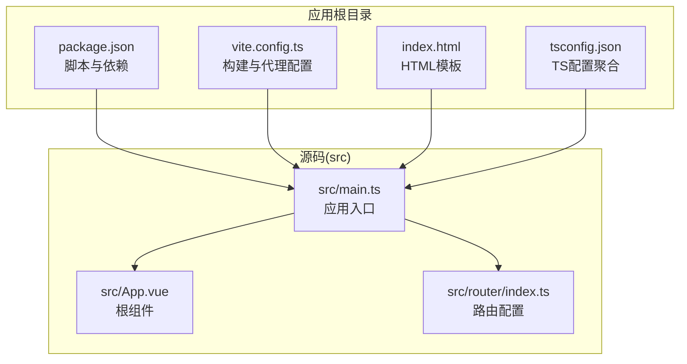
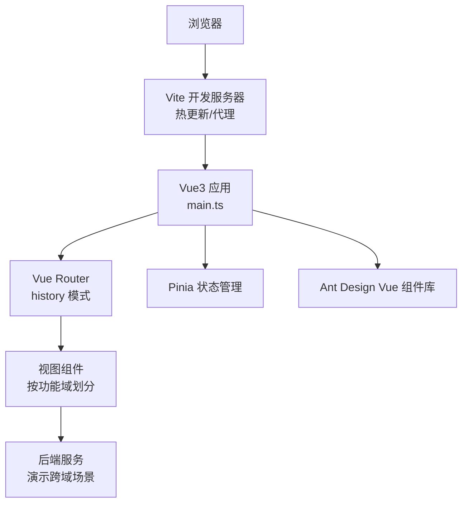
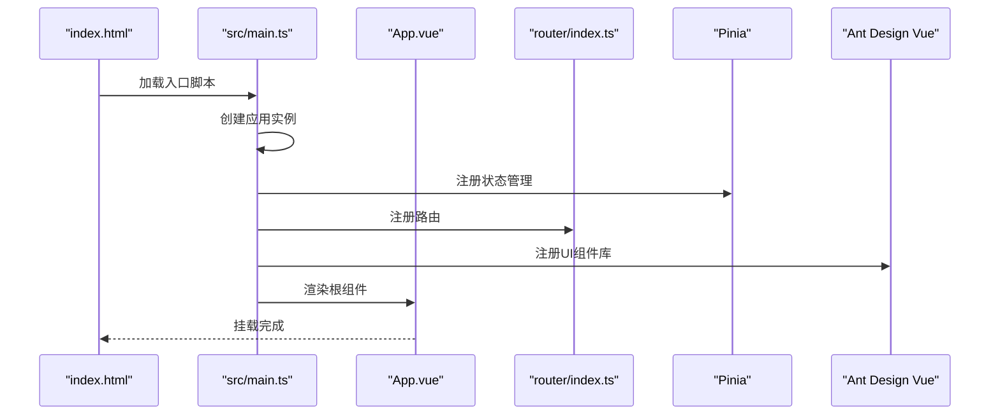
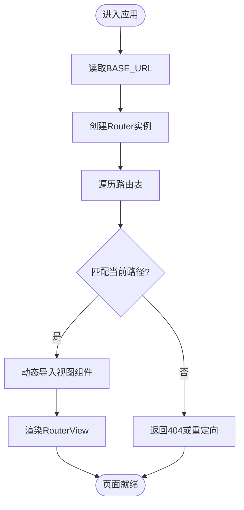
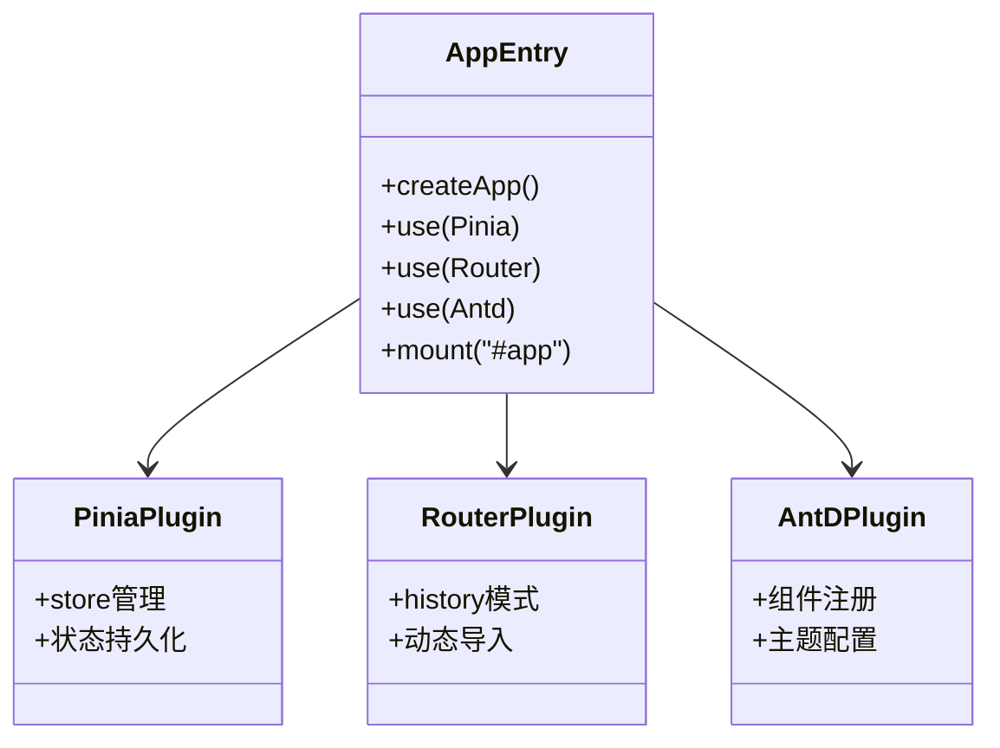
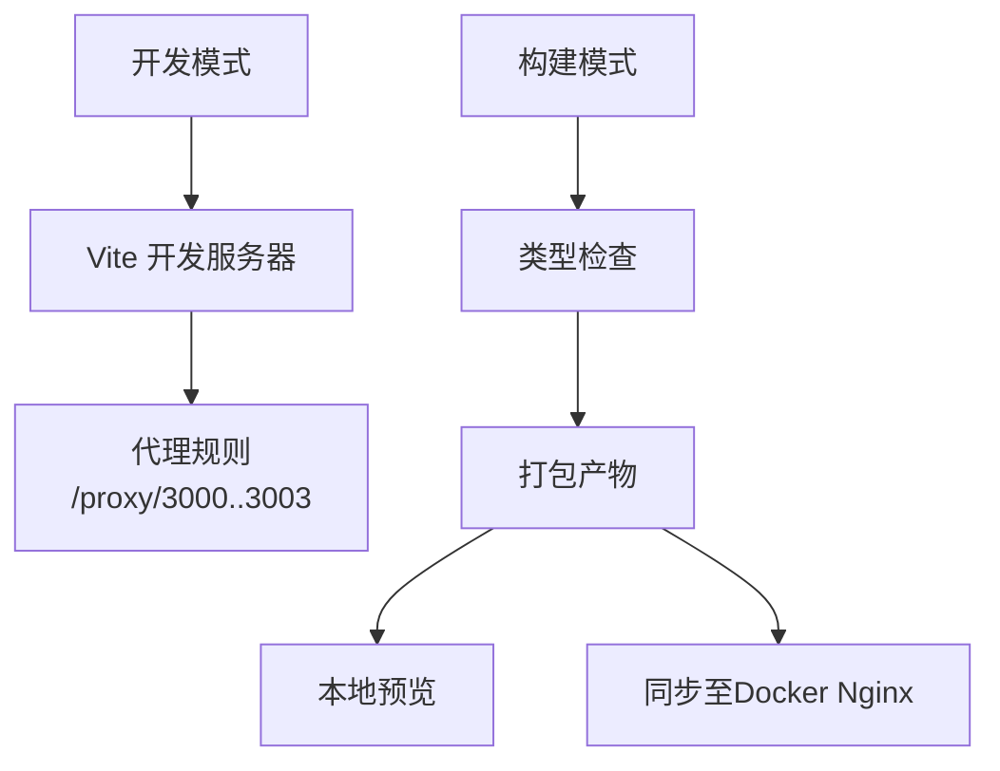
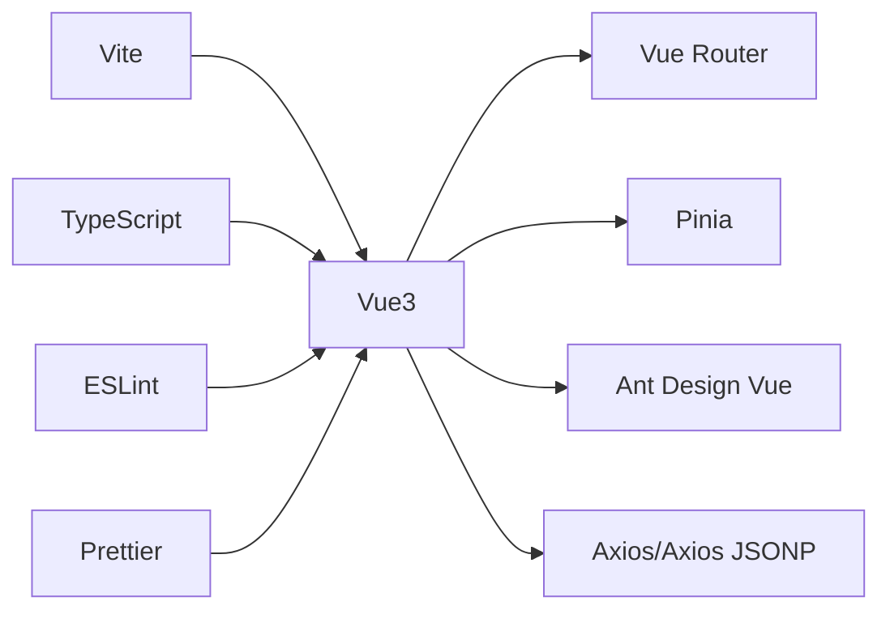

# Vue3应用概览

<cite>
**本文档引用的文件**
- [package.json](file://practice/vue3-frontend/cross-domain/package.json)
- [vite.config.ts](file://practice/vue3-frontend/cross-domain/vite.config.ts)
- [main.ts](file://practice/vue3-frontend/cross-domain/src/main.ts)
- [router/index.ts](file://practice/vue3-frontend/cross-domain/src/router/index.ts)
- [App.vue](file://practice/vue3-frontend/cross-domain/src/App.vue)
- [index.html](file://practice/vue3-frontend/cross-domain/index.html)
- [tsconfig.json](file://practice/vue3-frontend/cross-domain/tsconfig.json)
- [sync-nginx.sh](file://practice/vue3-frontend/cross-domain/sync-nginx.sh)
</cite>

## 目录
1. [引言](#引言)
2. [项目结构](#项目结构)
3. [核心组件](#核心组件)
4. [架构总览](#架构总览)
5. [详细组件分析](#详细组件分析)
6. [依赖分析](#依赖分析)
7. [性能考虑](#性能考虑)
8. [故障排除指南](#故障排除指南)
9. [结论](#结论)
10. [附录](#附录)

## 引言
本文件面向希望快速理解并开展Vue3前端应用开发的工程师与产品同学，基于仓库中的Vue3示例项目（跨域演示）进行系统性概览。内容涵盖：整体架构设计、技术栈选择（Vue3、Pinia、Ant Design Vue）、项目初始化流程、应用入口配置、路由系统设计、构建工具选择原因、目录结构组织原则、模块化理念、开发环境配置、启动流程、插件注册机制以及全局配置最佳实践。

## 项目结构
该Vue3项目采用“功能域+分层”的组织方式，结合Vite作为构建与开发服务器，TypeScript提供类型安全，Pinia负责状态管理，Ant Design Vue提供UI组件库。项目根目录包含构建脚本、Docker环境准备、练习与测试等子模块；本概览聚焦于Vue3前端示例模块。

- 核心目录与职责
  - practice/vue3-frontend/cross-domain：Vue3示例应用，包含源码、路由、视图、组件与构建配置
  - practice/docker-env/cross-domain：跨域演示配套的Nginx部署环境
  - practice/nodejs-service：后端服务示例（用于演示跨域场景）
  - practice/README.*：开发环境准备与使用说明

- 关键文件定位
  - 应用入口：src/main.ts
  - 路由定义：src/router/index.ts
  - 根组件：src/App.vue
  - 构建配置：vite.config.ts
  - 包管理与脚本：package.json
  - HTML模板：index.html
  - TypeScript配置：tsconfig.json、tsconfig.node.json、tsconfig.app.json

**图表来源**
- [package.json:1-43](file://practice/vue3-frontend/cross-domain/package.json#L1-L43)
- [vite.config.ts:1-40](file://practice/vue3-frontend/cross-domain/vite.config.ts#L1-L40)
- [index.html:1-20](file://practice/vue3-frontend/cross-domain/index.html#L1-L20)
- [tsconfig.json:1-12](file://practice/vue3-frontend/cross-domain/tsconfig.json#L1-L12)
- [main.ts:1-16](file://practice/vue3-frontend/cross-domain/src/main.ts#L1-L16)
- [App.vue:1-107](file://practice/vue3-frontend/cross-domain/src/App.vue#L1-L107)
- [router/index.ts:1-50](file://practice/vue3-frontend/cross-domain/src/router/index.ts#L1-L50)

**章节来源**
- [package.json:1-43](file://practice/vue3-frontend/cross-domain/package.json#L1-L43)
- [vite.config.ts:1-40](file://practice/vue3-frontend/cross-domain/vite.config.ts#L1-L40)
- [index.html:1-20](file://practice/vue3-frontend/cross-domain/index.html#L1-L20)
- [tsconfig.json:1-12](file://practice/vue3-frontend/cross-domain/tsconfig.json#L1-L12)

## 核心组件
- 应用入口与初始化
  - 创建Vue应用实例，注册Pinia、路由与Ant Design Vue插件，挂载到DOM节点
  - 入口文件还引入了全局样式与根组件
- 根组件与导航
  - 使用RouterLink与RouterView实现页面切换
  - 提供Logo点击回到首页的交互
- 路由系统
  - 基于History模式，按功能域划分视图（CORS、Proxy、JSONP、postMessage、document.domain、window.name、location.hash）
  - 采用动态导入实现路由级代码分割

**章节来源**
- [main.ts:1-16](file://practice/vue3-frontend/cross-domain/src/main.ts#L1-L16)
- [App.vue:1-107](file://practice/vue3-frontend/cross-domain/src/App.vue#L1-L107)
- [router/index.ts:1-50](file://practice/vue3-frontend/cross-domain/src/router/index.ts#L1-L50)

## 架构总览
该应用采用“单页应用(SPA)”架构，以Vue3为核心，配合Pinia进行状态管理，Ant Design Vue提供UI基础能力，Vite提供开发与构建支持。路由系统通过History模式实现无刷新跳转，构建时启用代码分割与TypeScript类型检查，开发时通过内建代理解决跨域问题。

**图表来源**
- [main.ts:1-16](file://practice/vue3-frontend/cross-domain/src/main.ts#L1-L16)
- [router/index.ts:1-50](file://practice/vue3-frontend/cross-domain/src/router/index.ts#L1-L50)
- [vite.config.ts:15-38](file://practice/vue3-frontend/cross-domain/vite.config.ts#L15-L38)

## 详细组件分析

### 应用入口与启动流程
- 启动步骤
  - 创建应用实例
  - 注册插件：Pinia、Vue Router、Ant Design Vue
  - 引入全局样式与根组件
  - 将应用挂载到DOM
- 最佳实践
  - 将第三方插件集中注册，便于维护与扩展
  - 在入口处统一引入全局样式，确保组件样式一致性
  - 将挂载点与HTML模板保持一致，避免运行时错误

**图表来源**
- [index.html:17-17](file://practice/vue3-frontend/cross-domain/index.html#L17-L17)
- [main.ts:10-16](file://practice/vue3-frontend/cross-domain/src/main.ts#L10-L16)
- [App.vue:1-107](file://practice/vue3-frontend/cross-domain/src/App.vue#L1-L107)
- [router/index.ts:1-50](file://practice/vue3-frontend/cross-domain/src/router/index.ts#L1-L50)

**章节来源**
- [main.ts:1-16](file://practice/vue3-frontend/cross-domain/src/main.ts#L1-L16)
- [index.html:1-20](file://practice/vue3-frontend/cross-domain/index.html#L1-L20)

### 路由系统设计
- 设计思路
  - History模式：适合现代浏览器与静态部署
  - 动态导入：按需加载视图组件，优化首屏性能
  - 视图分层：每个功能域独立目录，便于维护与扩展
- 配置要点
  - BASE_URL参与History构造，影响路由前缀
  - 路由表集中管理，新增页面只需在路由表中添加条目

**图表来源**
- [router/index.ts:1-50](file://practice/vue3-frontend/cross-domain/src/router/index.ts#L1-L50)

**章节来源**
- [router/index.ts:1-50](file://practice/vue3-frontend/cross-domain/src/router/index.ts#L1-L50)

### 插件注册机制与全局配置
- 插件注册
  - Pinia：集中式状态管理，提供响应式数据与模块化store
  - Vue Router：页面级导航与参数传递
  - Ant Design Vue：UI组件库，提供丰富的业务组件
- 全局配置
  - Vite别名：@指向src目录，简化导入路径
  - 代理配置：开发时转发特定路径到本地后端服务
  - TypeScript配置：多tsconfig文件聚合，分别约束Node与应用层

**图表来源**
- [main.ts:12-14](file://practice/vue3-frontend/cross-domain/src/main.ts#L12-L14)
- [vite.config.ts:9-13](file://practice/vue3-frontend/cross-domain/vite.config.ts#L9-L13)

**章节来源**
- [main.ts:1-16](file://practice/vue3-frontend/cross-domain/src/main.ts#L1-L16)
- [vite.config.ts:1-40](file://practice/vue3-frontend/cross-domain/vite.config.ts#L1-L40)
- [tsconfig.json:1-12](file://practice/vue3-frontend/cross-domain/tsconfig.json#L1-L12)

### 构建工具与开发环境
- Vite选择原因
  - 快速冷启动与热更新，提升开发体验
  - 内置代理，便于解决开发期跨域问题
  - 原生ESM支持，与现代前端生态契合
- 构建与预览
  - dev：启动开发服务器，自动打开浏览器
  - build：类型检查与打包
  - preview：本地预览生产包
  - sync：将构建产物同步至Docker Nginx目录
- TypeScript与代码质量
  - 多tsconfig文件分离约束
  - ESLint与Prettier集成，保证代码风格一致

**图表来源**
- [package.json:6-15](file://practice/vue3-frontend/cross-domain/package.json#L6-L15)
- [vite.config.ts:15-38](file://practice/vue3-frontend/cross-domain/vite.config.ts#L15-L38)
- [sync-nginx.sh:1-11](file://practice/vue3-frontend/cross-domain/sync-nginx.sh#L1-L11)

**章节来源**
- [package.json:1-43](file://practice/vue3-frontend/cross-domain/package.json#L1-L43)
- [vite.config.ts:1-40](file://practice/vue3-frontend/cross-domain/vite.config.ts#L1-L40)
- [sync-nginx.sh:1-11](file://practice/vue3-frontend/cross-domain/sync-nginx.sh#L1-L11)

## 依赖分析
- 运行时依赖
  - Vue3：框架核心
  - Vue Router：页面级导航
  - Pinia：状态管理
  - Ant Design Vue：UI组件库
  - Axios/Axios JSONP：HTTP请求与JSONP支持
- 开发依赖
  - Vite：构建与开发服务器
  - TypeScript与类型声明：类型安全
  - ESLint/Prettier：代码规范与格式化
  - Vue相关ESLint与TS配置：统一团队规范

**图表来源**
- [package.json:16-41](file://practice/vue3-frontend/cross-domain/package.json#L16-L41)

**章节来源**
- [package.json:1-43](file://practice/vue3-frontend/cross-domain/package.json#L1-L43)

## 性能考虑
- 代码分割
  - 路由级动态导入减少首屏体积
- 构建优化
  - 生产构建开启压缩与Tree Shaking
- 开发体验
  - Vite热更新与快速冷启动
  - 代理避免CORS带来的额外网络开销
- 样式与资源
  - Ant Design Vue样式按需引入可进一步优化
  - 图片与字体资源建议CDN化

## 故障排除指南
- 启动失败
  - 确认Node版本与包管理器兼容
  - 检查端口占用与代理配置是否正确
- 路由不生效
  - 确认BASE_URL与实际部署路径一致
  - 检查路由表与视图组件导出
- 样式异常
  - 确认全局样式的引入顺序
  - 检查Ant Design Vue样式重置是否生效
- 跨域问题
  - 开发阶段使用Vite代理
  - 生产环境通过Nginx或后端设置CORS头

**章节来源**
- [vite.config.ts:15-38](file://practice/vue3-frontend/cross-domain/vite.config.ts#L15-L38)
- [router/index.ts:1-50](file://practice/vue3-frontend/cross-domain/src/router/index.ts#L1-L50)
- [main.ts:1-16](file://practice/vue3-frontend/cross-domain/src/main.ts#L1-L16)

## 结论
本Vue3示例项目展示了现代前端工程化的典型实践：以Vue3为核心，结合Pinia与Ant Design Vue构建业务界面，借助Vite提供高效开发体验，并通过TypeScript保障代码质量。路由系统采用History模式与动态导入，兼顾性能与可维护性。建议在实际项目中延续此类组织方式与最佳实践，逐步扩展状态管理、国际化、权限控制与测试体系。

## 附录
- 目录结构组织原则
  - 按功能域划分视图与组件，降低耦合度
  - 将公共组件与工具函数抽离，提高复用率
  - 分层清晰：入口、路由、组件、样式、类型声明
- 模块化设计理念
  - 插件集中注册，避免分散配置
  - 路由表集中管理，新增页面只需关注路由与视图
  - 类型声明与配置文件分离，提升可维护性
- 开发环境配置建议
  - 团队统一使用ESLint与Prettier
  - 通过Vite代理处理跨域，生产环境统一走Nginx
  - 使用TypeScript严格模式，配合类型检查脚本