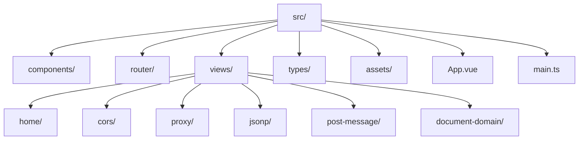
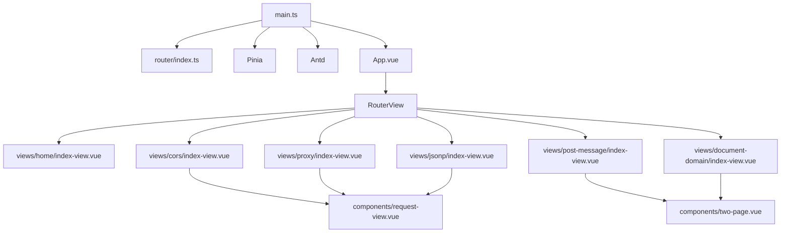
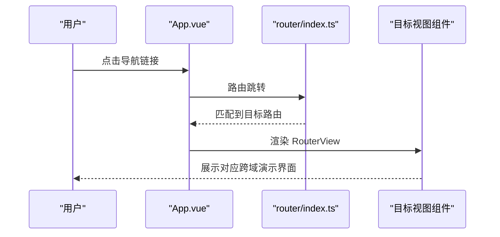
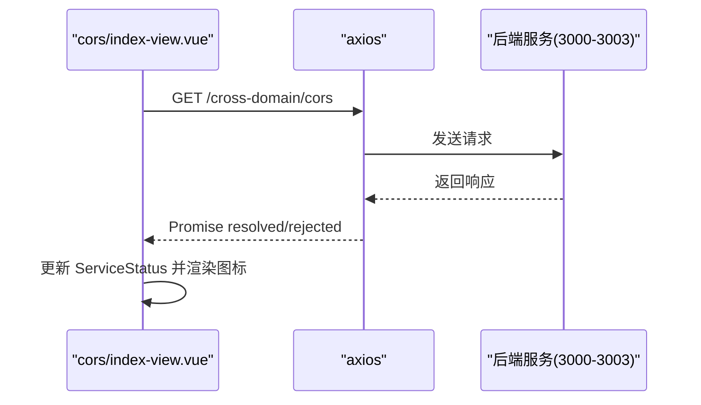
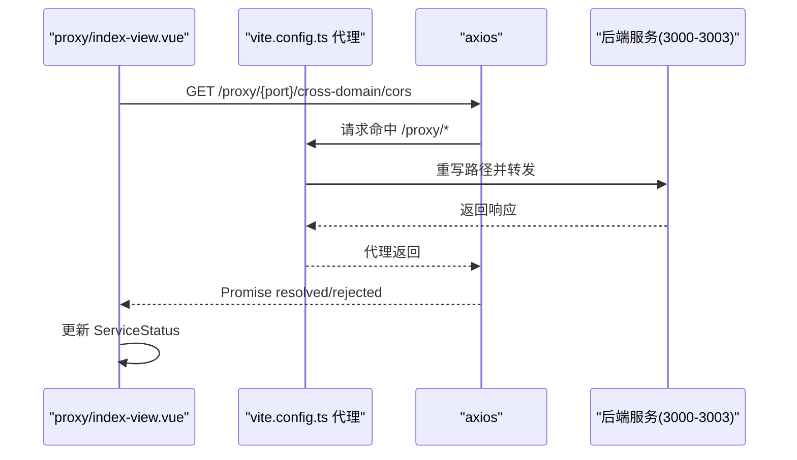
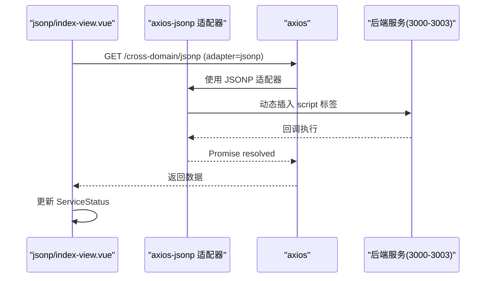
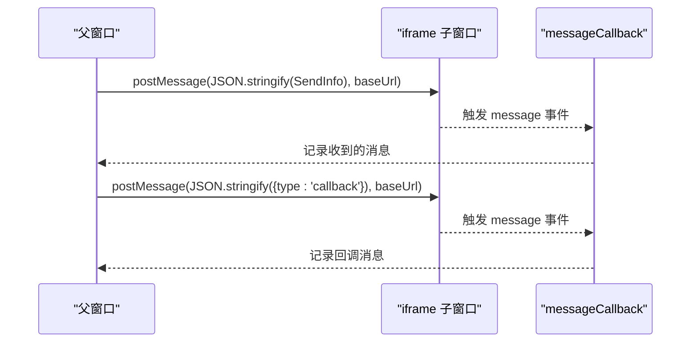
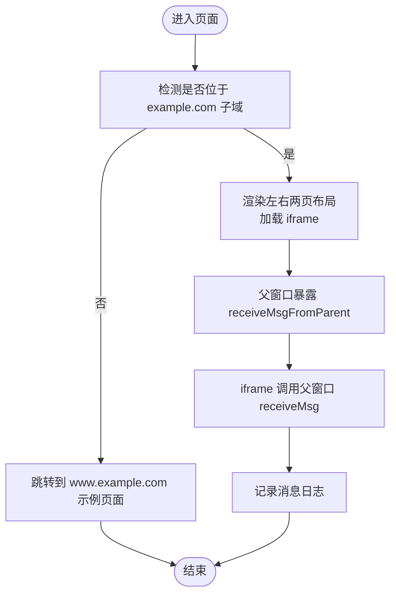
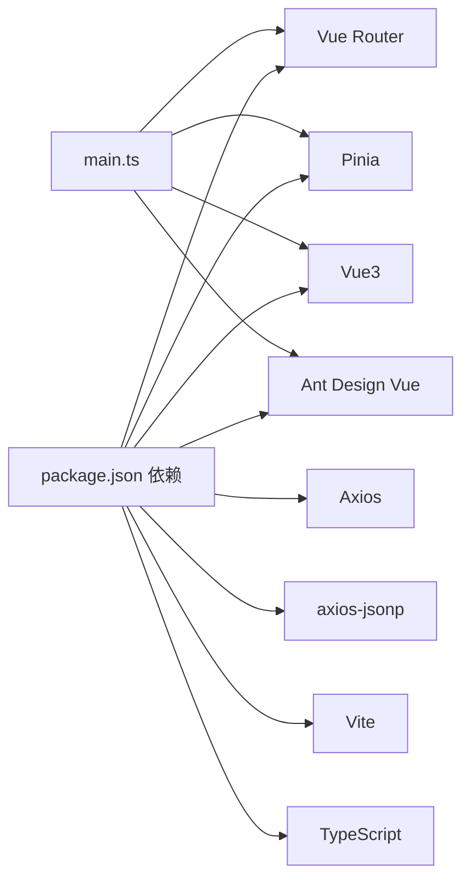

# 前端应用架构

<cite>
**本文引用的文件**
- [package.json](file://practice/vue3-frontend/cross-domain/package.json)
- [vite.config.ts](file://practice/vue3-frontend/cross-domain/vite.config.ts)
- [main.ts](file://practice/vue3-frontend/cross-domain/src/main.ts)
- [router/index.ts](file://practice/vue3-frontend/cross-domain/src/router/index.ts)
- [App.vue](file://practice/vue3-frontend/cross-domain/src/App.vue)
- [home/index-view.vue](file://practice/vue3-frontend/cross-domain/src/views/home/index-view.vue)
- [cors/index-view.vue](file://practice/vue3-frontend/cross-domain/src/views/cors/index-view.vue)
- [proxy/index-view.vue](file://practice/vue3-frontend/cross-domain/src/views/proxy/index-view.vue)
- [jsonp/index-view.vue](file://practice/vue3-frontend/cross-domain/src/views/jsonp/index-view.vue)
- [post-message/index-view.vue](file://practice/vue3-frontend/cross-domain/src/views/post-message/index-view.vue)
- [document-domain/index-view.vue](file://practice/vue3-frontend/cross-domain/src/views/document-domain/index-view.vue)
- [main-content.vue](file://practice/vue3-frontend/cross-domain/src/components/main-content.vue)
- [multi-tabs.vue](file://practice/vue3-frontend/cross-domain/src/components/multi-tabs.vue)
- [request-view.vue](file://practice/vue3-frontend/cross-domain/src/components/request-view.vue)
- [left-mock-iframe.vue](file://practice/vue3-frontend/cross-domain/src/components/left-mock-iframe.vue)
- [two-page.vue](file://practice/vue3-frontend/cross-domain/src/components/two-page.vue)
- [index.ts](file://practice/vue3-frontend/cross-domain/src/types/index.ts)
- [tsconfig.json](file://practice/vue3-frontend/cross-domain/tsconfig.json)
- [tsconfig.app.json](file://practice/vue3-frontend/cross-domain/tsconfig.app.json)
</cite>

## 目录
1. [简介](#简介)
2. [项目结构](#项目结构)
3. [核心组件](#核心组件)
4. [架构总览](#架构总览)
5. [详细组件分析](#详细组件分析)
6. [依赖关系分析](#依赖关系分析)
7. [性能考虑](#性能考虑)
8. [故障排查指南](#故障排查指南)
9. [结论](#结论)
10. [附录](#附录)

## 简介
本项目是一个基于 Vue3 的前端应用，围绕“跨域处理演示”主题构建，系统性展示了多种跨域解决方案（CORS、代理、JSONP、postMessage、document.domain、window.name、location.hash）在真实交互中的实现与对比。应用采用 Vue Router 进行页面级路由管理，使用 Pinia 进行轻量状态管理，并通过 Vite 提供开发服务器与构建能力。项目同时集成 Ant Design Vue 作为 UI 组件库，配合 TypeScript 提升开发体验与类型安全。

## 项目结构
项目采用“按功能分层 + 组件化”的组织方式，核心目录与职责如下：
- src：源代码根目录
  - assets：静态资源与样式
  - components：可复用的通用组件
  - router：路由定义
  - views：页面视图组件
  - types：全局类型定义
  - App.vue、main.ts：应用入口与挂载
- 配置文件：vite.config.ts、tsconfig*.json、package.json
- 跨域演示页面：各子路由对应的视图组件

图表来源
- [main.ts:1-16](file://practice/vue3-frontend/cross-domain/src/main.ts#L1-L16)
- [router/index.ts:1-50](file://practice/vue3-frontend/cross-domain/src/router/index.ts#L1-L50)
- [App.vue:1-107](file://practice/vue3-frontend/cross-domain/src/App.vue#L1-L107)

章节来源
- [main.ts:1-16](file://practice/vue3-frontend/cross-domain/src/main.ts#L1-L16)
- [router/index.ts:1-50](file://practice/vue3-frontend/cross-domain/src/router/index.ts#L1-L50)
- [App.vue:1-107](file://practice/vue3-frontend/cross-domain/src/App.vue#L1-L107)

## 核心组件
- 应用入口与依赖注入
  - main.ts：创建应用实例，注册 Pinia、Vue Router、Ant Design Vue，并挂载到 DOM
- 路由系统
  - router/index.ts：定义首页与各跨域演示页面的懒加载路由
- 视图与布局
  - App.vue：顶部导航与 RouterView 布局，包含主标题与导航链接
  - home/index-view.vue：首页表格，汇总各跨域方案简介与跳转
- 通用组件
  - components/main-content.vue：页面主标题与引导语
  - components/multi-tabs.vue：多服务/多域名切换标签页
  - components/request-view.vue：统一请求视图，封装请求方法与结果展示
  - components/left-mock-iframe.vue、components/two-page.vue：用于演示场景的左右布局与 iframe 容器
- 类型系统
  - types/index.ts：定义 Service、Website、ServiceStatus、MessageLog、SendInfo 等类型

章节来源
- [main.ts:1-16](file://practice/vue3-frontend/cross-domain/src/main.ts#L1-L16)
- [router/index.ts:1-50](file://practice/vue3-frontend/cross-domain/src/router/index.ts#L1-L50)
- [App.vue:1-107](file://practice/vue3-frontend/cross-domain/src/App.vue#L1-L107)
- [home/index-view.vue:1-105](file://practice/vue3-frontend/cross-domain/src/views/home/index-view.vue#L1-L105)
- [main-content.vue:1-32](file://practice/vue3-frontend/cross-domain/src/components/main-content.vue#L1-L32)
- [multi-tabs.vue](file://practice/vue3-frontend/cross-domain/src/components/multi-tabs.vue)
- [request-view.vue](file://practice/vue3-frontend/cross-domain/src/components/request-view.vue)
- [left-mock-iframe.vue](file://practice/vue3-frontend/cross-domain/src/components/left-mock-iframe.vue)
- [two-page.vue](file://practice/vue3-frontend/cross-domain/src/components/two-page.vue)
- [index.ts:1-27](file://practice/vue3-frontend/cross-domain/src/types/index.ts#L1-L27)

## 架构总览
应用采用“单页应用 + 懒加载路由 + 组合式 API + 轻量状态”的架构模式。核心流程：
- 启动阶段：main.ts 注册插件与依赖，创建应用实例
- 路由阶段：router/index.ts 定义页面级路由，按需加载视图组件
- 视图阶段：各页面视图根据业务场景调用通用组件与工具函数
- 数据与交互：通过 axios 或 postMessage 实现跨域数据交互；通过 ServiceStatus 管理请求状态

图表来源
- [main.ts:1-16](file://practice/vue3-frontend/cross-domain/src/main.ts#L1-L16)
- [router/index.ts:1-50](file://practice/vue3-frontend/cross-domain/src/router/index.ts#L1-L50)
- [App.vue:1-107](file://practice/vue3-frontend/cross-domain/src/App.vue#L1-L107)
- [cors/index-view.vue:1-90](file://practice/vue3-frontend/cross-domain/src/views/cors/index-view.vue#L1-L90)
- [proxy/index-view.vue:1-92](file://practice/vue3-frontend/cross-domain/src/views/proxy/index-view.vue#L1-L92)
- [jsonp/index-view.vue:1-94](file://practice/vue3-frontend/cross-domain/src/views/jsonp/index-view.vue#L1-L94)
- [post-message/index-view.vue:1-108](file://practice/vue3-frontend/cross-domain/src/views/post-message/index-view.vue#L1-L108)
- [document-domain/index-view.vue:1-123](file://practice/vue3-frontend/cross-domain/src/views/document-domain/index-view.vue#L1-L123)
- [request-view.vue](file://practice/vue3-frontend/cross-domain/src/components/request-view.vue)
- [two-page.vue](file://practice/vue3-frontend/cross-domain/src/components/two-page.vue)

## 详细组件分析

### 路由与页面导航
- 路由配置要点
  - 使用 createWebHistory 与 BASE_URL
  - 所有页面均采用动态导入实现懒加载
- 页面职责
  - home：概览与跳转入口
  - cors/proxy/jsonp/post-message/document-domain：对应不同跨域方案的演示页面

图表来源
- [router/index.ts:1-50](file://practice/vue3-frontend/cross-domain/src/router/index.ts#L1-L50)
- [App.vue:1-107](file://practice/vue3-frontend/cross-domain/src/App.vue#L1-L107)

章节来源
- [router/index.ts:1-50](file://practice/vue3-frontend/cross-domain/src/router/index.ts#L1-L50)
- [App.vue:1-107](file://practice/vue3-frontend/cross-domain/src/App.vue#L1-L107)

### CORS 演示页面
- 功能概述
  - 列表展示多个后端服务（Express/Koa/Egg/Nest）
  - 通过 axios 发起 GET 请求，根据响应更新 ServiceStatus
  - 使用 RequestView 统一渲染请求参数与结果
- 关键交互
  - onMounted 自动发起一次连接测试
  - onChange 切换服务时重新连接
  - 成功/失败分别以不同图标提示

图表来源
- [cors/index-view.vue:1-90](file://practice/vue3-frontend/cross-domain/src/views/cors/index-view.vue#L1-L90)

章节来源
- [cors/index-view.vue:1-90](file://practice/vue3-frontend/cross-domain/src/views/cors/index-view.vue#L1-L90)

### 代理（Proxy）演示页面
- 功能概述
  - 通过 Vite 本地代理将请求转发至不同端口的服务
  - 代理规则在 vite.config.ts 中集中配置
- 关键交互
  - 将服务 baseUrl 改为 /proxy/{port}，由本地代理重写为真实后端地址
  - 与 CORS 页面类似，使用 ServiceStatus 反映请求状态

图表来源
- [proxy/index-view.vue:1-92](file://practice/vue3-frontend/cross-domain/src/views/proxy/index-view.vue#L1-L92)
- [vite.config.ts:1-40](file://practice/vue3-frontend/cross-domain/vite.config.ts#L1-L40)

章节来源
- [proxy/index-view.vue:1-92](file://practice/vue3-frontend/cross-domain/src/views/proxy/index-view.vue#L1-L92)
- [vite.config.ts:1-40](file://practice/vue3-frontend/cross-domain/vite.config.ts#L1-L40)

### JSONP 演示页面
- 功能概述
  - 使用 axios-jsonp 适配器发起跨域请求
  - 仅支持 GET 请求，适用于不支持 CORS 的旧接口
- 关键交互
  - requestHandle 中传入 adapter: jsonpAdapter
  - 其余逻辑与 CORS 页面一致

图表来源
- [jsonp/index-view.vue:1-94](file://practice/vue3-frontend/cross-domain/src/views/jsonp/index-view.vue#L1-L94)

章节来源
- [jsonp/index-view.vue:1-94](file://practice/vue3-frontend/cross-domain/src/views/jsonp/index-view.vue#L1-L94)

### postMessage 演示页面
- 功能概述
  - 左侧为父窗口，右侧为 iframe 子窗口
  - 通过 window.postMessage 在父子窗口间传递消息
- 关键交互
  - sendToIframe：向 iframe 发送消息
  - sendToParent：接收 iframe 回调
  - messageCallback：监听 message 事件，记录消息日志

图表来源
- [post-message/index-view.vue:1-108](file://practice/vue3-frontend/cross-domain/src/views/post-message/index-view.vue#L1-L108)

章节来源
- [post-message/index-view.vue:1-108](file://practice/vue3-frontend/cross-domain/src/views/post-message/index-view.vue#L1-L108)

### document.domain 演示页面
- 功能概述
  - 通过设置 document.domain 实现同顶级域名下的跨子域通信
  - 需要将 a.example.com 与 www.example.com 指向 127.0.0.1 才能演示
- 关键交互
  - 父窗口暴露 receiveMsgFromParent 接收来自 iframe 的消息
  - iframe 通过 contentWindow.receiveMsg 调用父窗口方法

图表来源
- [document-domain/index-view.vue:1-123](file://practice/vue3-frontend/cross-domain/src/views/document-domain/index-view.vue#L1-L123)

章节来源
- [document-domain/index-view.vue:1-123](file://practice/vue3-frontend/cross-domain/src/views/document-domain/index-view.vue#L1-L123)

## 依赖关系分析
- 技术栈与版本
  - Vue3、Vue Router、Pinia、Ant Design Vue、Axios、axios-jsonp、Vite、TypeScript
- 构建与开发
  - Vite 提供开发服务器与构建能力，支持路径别名与代理
  - TypeScript 多配置文件组织，确保编译与路径解析正确
- 运行时依赖注入
  - main.ts 中统一注册插件与依赖，保证全局可用

图表来源
- [package.json:1-43](file://practice/vue3-frontend/cross-domain/package.json#L1-L43)
- [main.ts:1-16](file://practice/vue3-frontend/cross-domain/src/main.ts#L1-L16)

章节来源
- [package.json:1-43](file://practice/vue3-frontend/cross-domain/package.json#L1-L43)
- [main.ts:1-16](file://practice/vue3-frontend/cross-domain/src/main.ts#L1-L16)
- [tsconfig.json:1-12](file://practice/vue3-frontend/cross-domain/tsconfig.json#L1-L12)
- [tsconfig.app.json:1-24](file://practice/vue3-frontend/cross-domain/tsconfig.app.json#L1-L24)

## 性能考虑
- 路由懒加载
  - 所有页面采用动态导入，减少首屏体积与初次渲染时间
- 组件拆分
  - 通用组件（如 MultiTabs、RequestView、TwoPage）复用性强，降低重复渲染
- 代理与缓存
  - Vite 代理仅用于开发环境，避免生产环境额外负担
- 图标与样式
  - Ant Design Vue 按需引入与样式隔离（scoped），避免全局污染
- 构建优化建议
  - 生产构建时启用压缩与 Tree Shaking
  - 对第三方库进行外部化或预打包，提升二次构建速度

## 故障排查指南
- 跨域问题
  - CORS：确认后端已正确设置响应头；若失败，优先检查后端配置
  - 代理：确认 vite.config.ts 中代理规则与目标端口匹配
  - JSONP：仅支持 GET，且后端需支持回调参数
- postMessage
  - 确认目标域名与协议一致；iframe 加载完成后再发送消息
  - 注意移除事件监听，避免内存泄漏
- document.domain
  - 需要将相关子域指向同一 IP 地址；仅限同顶级域名场景
- 开发服务器
  - 端口冲突：修改 vite.config.ts server.host/port 或 package.json scripts 中的 --host 参数
  - 路径别名：确保 tsconfig.app.json 中的路径映射与实际目录一致

章节来源
- [vite.config.ts:1-40](file://practice/vue3-frontend/cross-domain/vite.config.ts#L1-L40)
- [post-message/index-view.vue:1-108](file://practice/vue3-frontend/cross-domain/src/views/post-message/index-view.vue#L1-L108)
- [document-domain/index-view.vue:1-123](file://practice/vue3-frontend/cross-domain/src/views/document-domain/index-view.vue#L1-L123)

## 结论
本项目以“跨域处理演示”为核心目标，系统性地展示了多种跨域方案在真实交互中的实现细节与差异。通过 Vue3 的组合式 API、Vue Router 的页面级路由、Pinia 的轻量状态管理以及 Vite 的高效开发体验，项目实现了清晰的架构与良好的可维护性。对于前端开发者而言，该仓库既是学习跨域知识的实践范例，也是构建现代前端应用的参考模板。

## 附录
- 开发环境配置
  - 安装依赖：使用包管理器安装项目依赖
  - 启动开发：运行 dev 脚本启动本地服务
  - 预览构建：运行 preview 查看生产构建效果
- 调试技巧
  - 使用浏览器开发者工具观察网络请求与跨域响应头
  - 在 postMessage 页面中打印 message 事件内容，核对数据格式
  - 在 document.domain 页面中检查子域访问是否成功
- 部署策略
  - 生产构建：使用 build 脚本生成静态资源
  - 代理配置：生产环境建议通过 Nginx 或反向代理实现跨域转发
  - 静态托管：将 dist 目录部署至 CDN 或静态服务器