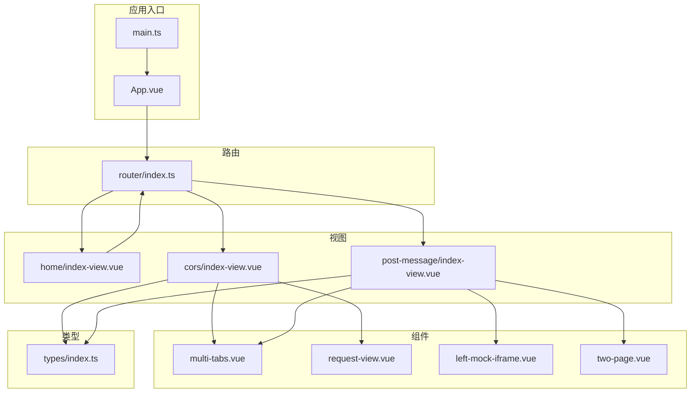
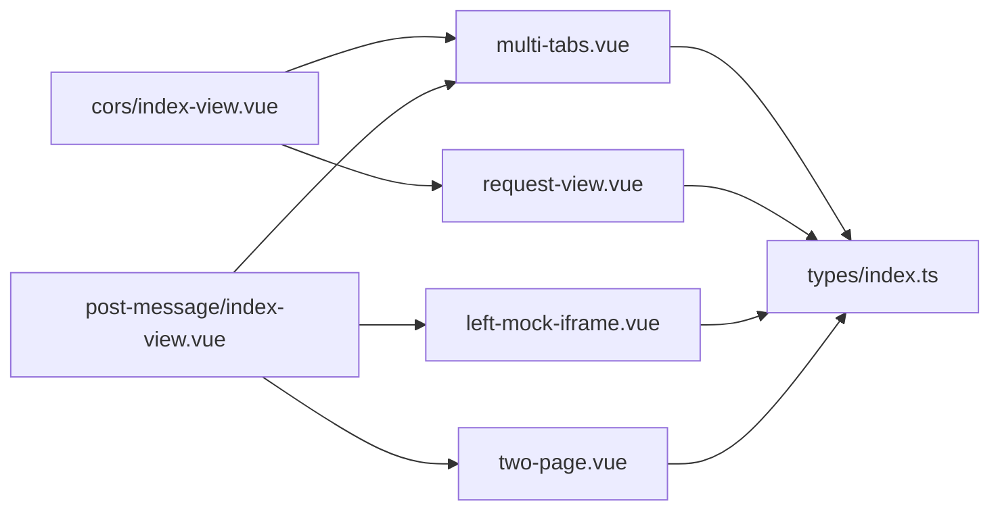
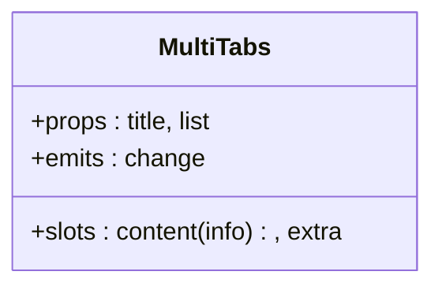
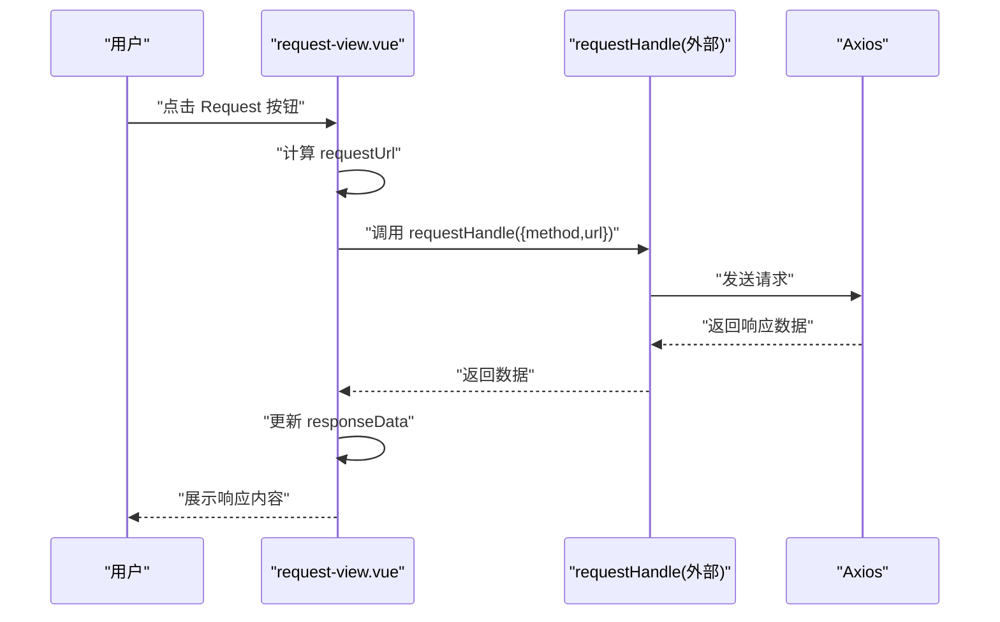
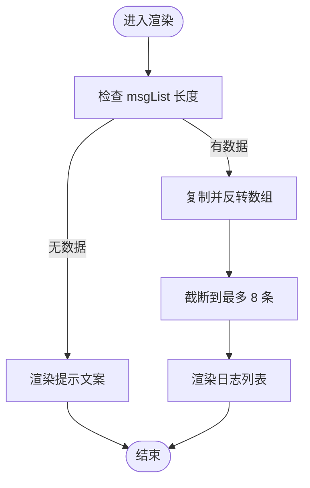
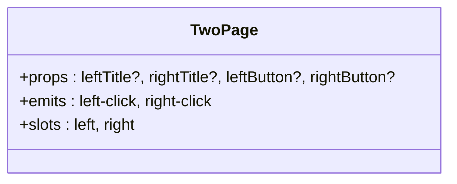
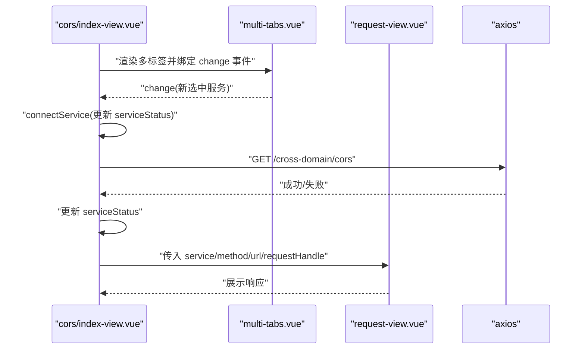
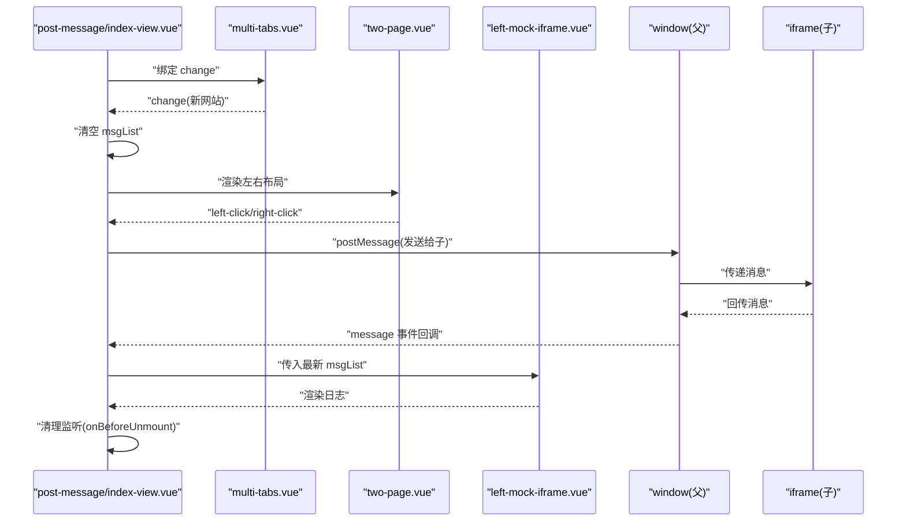
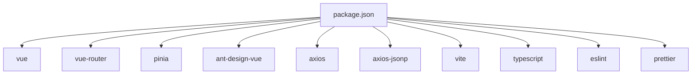

# 组件库

<cite>
**本文引用的文件**
- [multi-tabs.vue](file://practice/vue3-frontend/cross-domain/src/components/multi-tabs.vue)
- [request-view.vue](file://practice/vue3-frontend/cross-domain/src/components/request-view.vue)
- [left-mock-iframe.vue](file://practice/vue3-frontend/cross-domain/src/components/left-mock-iframe.vue)
- [two-page.vue](file://practice/vue3-frontend/cross-domain/src/components/two-page.vue)
- [types/index.ts](file://practice/vue3-frontend/cross-domain/src/types/index.ts)
- [main.ts](file://practice/vue3-frontend/cross-domain/src/main.ts)
- [App.vue](file://practice/vue3-frontend/cross-domain/src/App.vue)
- [router/index.ts](file://practice/vue3-frontend/cross-domain/src/router/index.ts)
- [home/index-view.vue](file://practice/vue3-frontend/cross-domain/src/views/home/index-view.vue)
- [cors/index-view.vue](file://practice/vue3-frontend/cross-domain/src/views/cors/index-view.vue)
- [post-message/index-view.vue](file://practice/vue3-frontend/cross-domain/src/views/post-message/index-view.vue)
- [package.json](file://practice/vue3-frontend/cross-domain/package.json)
</cite>

## 目录
1. [简介](#简介)
2. [项目结构](#项目结构)
3. [核心组件](#核心组件)
4. [架构总览](#架构总览)
5. [详细组件分析](#详细组件分析)
6. [依赖关系分析](#依赖关系分析)
7. [性能考量](#性能考量)
8. [故障排查指南](#故障排查指南)
9. [结论](#结论)
10. [附录](#附录)

## 简介
本组件库围绕“跨域解决方案演示”主题构建，提供一组可复用的 Vue3 组件与视图页面，用于演示多种浏览器跨域技术（如 CORS、代理、JSONP、postMessage、document.domain、window.name、location.hash）。核心组件包括：
- 多标签组件：用于在不同目标（服务或网站）之间切换，并通过插槽传递上下文信息。
- 请求视图组件：封装通用的请求发起与响应展示逻辑，支持外部传入请求函数。
- Mock IFrame 组件：左侧模拟 iframe 的消息日志展示。
- 双页布局组件：左右两栏布局，便于对比演示。
- 类型定义：统一的服务、网站、消息日志等类型。

这些组件在多个视图中组合使用，形成完整的演示流程，帮助前端开发者理解跨域技术的实现与交互方式。

## 项目结构
该组件库位于 practice/vue3-frontend/cross-domain 下，采用典型的 Vue3 + Vite + TypeScript 工程组织方式：
- components：可复用的业务组件
- views：按技术主题划分的视图页面
- types：全局类型定义
- router：路由配置
- main.ts：应用入口，注册 Pinia、路由、Ant Design Vue
- App.vue：根组件，包含导航与 RouterView

**图表来源**
- [main.ts:1-16](file://practice/vue3-frontend/cross-domain/src/main.ts#L1-L16)
- [App.vue:1-107](file://practice/vue3-frontend/cross-domain/src/App.vue#L1-L107)
- [router/index.ts:1-50](file://practice/vue3-frontend/cross-domain/src/router/index.ts#L1-L50)
- [multi-tabs.vue:1-78](file://practice/vue3-frontend/cross-domain/src/components/multi-tabs.vue#L1-L78)
- [request-view.vue:1-72](file://practice/vue3-frontend/cross-domain/src/components/request-view.vue#L1-L72)
- [left-mock-iframe.vue:1-51](file://practice/vue3-frontend/cross-domain/src/components/left-mock-iframe.vue#L1-L51)
- [two-page.vue:1-84](file://practice/vue3-frontend/cross-domain/src/components/two-page.vue#L1-L84)
- [home/index-view.vue:1-105](file://practice/vue3-frontend/cross-domain/src/views/home/index-view.vue#L1-L105)
- [cors/index-view.vue:1-90](file://practice/vue3-frontend/cross-domain/src/views/cors/index-view.vue#L1-L90)
- [post-message/index-view.vue:1-108](file://practice/vue3-frontend/cross-domain/src/views/post-message/index-view.vue#L1-L108)
- [types/index.ts:1-27](file://practice/vue3-frontend/cross-domain/src/types/index.ts#L1-L27)

**章节来源**
- [main.ts:1-16](file://practice/vue3-frontend/cross-domain/src/main.ts#L1-L16)
- [router/index.ts:1-50](file://practice/vue3-frontend/cross-domain/src/router/index.ts#L1-L50)
- [App.vue:1-107](file://practice/vue3-frontend/cross-domain/src/App.vue#L1-L107)

## 核心组件
本节对四个核心组件进行深入解析，涵盖设计理念、props、事件、插槽、样式与使用场景。

- 多标签组件（multi-tabs）
  - 设计理念：抽象出“标题 + 切换按钮组 + 内容区”的通用结构；通过插槽向父级暴露当前选中项，便于上层组合其他组件。
  - 关键 props：title（标题）、list（数组，元素需满足 Website 或 Service 接口）。
  - 事件：change（当选中项变化时触发，回调参数为当前选中项）。
  - 插槽：content（接收 info 上下文），extra（右侧额外区域）。
  - 使用场景：在 CORS、postMessage 等视图中，作为“服务/网站选择器”，并渲染对应内容。
  - 复杂度：列表渲染 O(n)，watch 触发 O(1) 事件派发。

- 请求视图组件（request-view）
  - 设计理念：封装“请求 URL 计算 + 发起请求 + 展示响应”的通用流程；通过外部注入的 requestHandle 实现解耦。
  - 关键 props：service（Service 接口）、method（字符串）、url（相对路径）、requestHandle（函数）。
  - 响应式：computed 计算最终请求地址；watch 监听请求地址变化以清空上次结果。
  - 行为：点击按钮后调用 requestHandle，将 method 与计算后的 URL 传入，更新响应数据。
  - 使用场景：CORS 视图中作为请求面板，配合 axios 封装。
  - 复杂度：计算 O(1)，异步请求受网络影响。

- Mock IFrame 组件（left-mock-iframe）
  - 设计理念：在左侧“模拟 iframe 区域”展示消息日志，最多显示最近 8 条，倒序展示。
  - 关键 props：msgList（MessageLog 数组）。
  - 行为：内部对传入列表做浅拷贝、反转、截断，保证展示稳定性与性能。
  - 使用场景：postMessage 视图中，展示父子窗口消息交互记录。
  - 复杂度：复制 + 反转 + 截断 O(n)。

- 双页布局组件（two-page）
  - 设计理念：左右两栏布局，每栏包含标题、按钮与插槽，便于对比演示。
  - 关键 props：leftTitle/rightTitle、leftButton/rightButton（均为可选字符串）。
  - 事件：left-click、right-click（分别在对应按钮点击时触发）。
  - 插槽：left、right（左右内容区）。
  - 使用场景：postMessage 视图中，左栏为消息日志，右栏为真实 iframe。
  - 复杂度：纯 UI 渲染，O(n) 遍历。

**章节来源**
- [multi-tabs.vue:1-78](file://practice/vue3-frontend/cross-domain/src/components/multi-tabs.vue#L1-L78)
- [request-view.vue:1-72](file://practice/vue3-frontend/cross-domain/src/components/request-view.vue#L1-L72)
- [left-mock-iframe.vue:1-51](file://practice/vue3-frontend/cross-domain/src/components/left-mock-iframe.vue#L1-L51)
- [two-page.vue:1-84](file://practice/vue3-frontend/cross-domain/src/components/two-page.vue#L1-L84)

## 架构总览
组件间协作遵循“视图组合 + 事件/插槽通信”的模式：
- 视图层（views）负责业务场景编排，组合多标签、请求视图、双页布局与 Mock IFrame。
- 组件层（components）提供可复用能力，通过 props、events、slots 解耦。
- 类型层（types）统一数据结构，确保组件间契约清晰。
- 应用入口（main.ts）注册全局插件（Pinia、路由、Ant Design Vue），App.vue 提供导航与路由出口。

**图表来源**
- [cors/index-view.vue:1-90](file://practice/vue3-frontend/cross-domain/src/views/cors/index-view.vue#L1-L90)
- [post-message/index-view.vue:1-108](file://practice/vue3-frontend/cross-domain/src/views/post-message/index-view.vue#L1-L108)
- [multi-tabs.vue:1-78](file://practice/vue3-frontend/cross-domain/src/components/multi-tabs.vue#L1-L78)
- [request-view.vue:1-72](file://practice/vue3-frontend/cross-domain/src/components/request-view.vue#L1-L72)
- [left-mock-iframe.vue:1-51](file://practice/vue3-frontend/cross-domain/src/components/left-mock-iframe.vue#L1-L51)
- [two-page.vue:1-84](file://practice/vue3-frontend/cross-domain/src/components/two-page.vue#L1-L84)
- [types/index.ts:1-27](file://practice/vue3-frontend/cross-domain/src/types/index.ts#L1-L27)

## 详细组件分析

### 多标签组件（multi-tabs）分析
- 数据模型与复杂度
  - chooseOne 为当前选中项，watch 在其变化时触发 change 事件，时间复杂度 O(1)。
  - 列表渲染基于 props.list，渲染复杂度 O(n)。
- 事件与插槽
  - change：向外暴露选中项，便于上层刷新内容。
  - content 插槽：提供 info 上下文，供父级渲染具体内容。
  - extra 插槽：用于放置状态指示或操作按钮。
- 样式与布局
  - 容器与服务区采用 flex 布局，右侧额外区域绝对定位，提升布局灵活性。
- 使用建议
  - 确保 list 元素满足 Website 或 Service 接口，避免运行时报错。
  - 在父级监听 change 并重置相关状态（如消息日志、请求缓存）。

**图表来源**
- [multi-tabs.vue:1-78](file://practice/vue3-frontend/cross-domain/src/components/multi-tabs.vue#L1-L78)

**章节来源**
- [multi-tabs.vue:1-78](file://practice/vue3-frontend/cross-domain/src/components/multi-tabs.vue#L1-L78)

### 请求视图组件（request-view）分析
- 数据流与处理逻辑
  - requestUrl 基于 service.baseUrl 与 props.url 计算，watch 监听变更并清空上次响应。
  - handleRequest 调用外部 requestHandle，传入 method 与 requestUrl，更新响应数据。
- 错误处理与边界
  - 未捕获异常由调用方处理；建议在 requestHandle 中做好错误提示。
- 性能与可用性
  - 计算与赋值为 O(1)，渲染依赖响应式数据，避免不必要的重渲染。

**图表来源**
- [request-view.vue:1-72](file://practice/vue3-frontend/cross-domain/src/components/request-view.vue#L1-L72)

**章节来源**
- [request-view.vue:1-72](file://practice/vue3-frontend/cross-domain/src/components/request-view.vue#L1-L72)

### Mock IFrame 组件（left-mock-iframe）分析
- 数据处理
  - 对传入 msgList 进行深拷贝（浅拷贝副本）+ 反转 + 截断至 8 条，保证展示稳定且性能可控。
- 边界与健壮性
  - 当列表为空时，显示提示文案，避免空白渲染。
- 适用场景
  - 与 postMessage 视图配合，实时反馈消息收发情况。

**图表来源**
- [left-mock-iframe.vue:1-51](file://practice/vue3-frontend/cross-domain/src/components/left-mock-iframe.vue#L1-L51)

**章节来源**
- [left-mock-iframe.vue:1-51](file://practice/vue3-frontend/cross-domain/src/components/left-mock-iframe.vue#L1-L51)

### 双页布局组件（two-page）分析
- 交互与事件
  - 左右按钮分别触发 left-click、right-click 事件，便于父级控制消息流向。
- 插槽与布局
  - left、right 插槽承载左右内容，结合样式实现左右分栏与按钮绝对定位。
- 适配性
  - :deep 选择器用于穿透样式，确保子 iframe 背景色与布局一致。

**图表来源**
- [two-page.vue:1-84](file://practice/vue3-frontend/cross-domain/src/components/two-page.vue#L1-L84)

**章节来源**
- [two-page.vue:1-84](file://practice/vue3-frontend/cross-domain/src/components/two-page.vue#L1-L84)

### 视图与组件组合示例

#### CORS 视图（组件组合与状态管理）
- 组合关系
  - multi-tabs：提供服务选择与状态徽标。
  - request-view：封装请求与响应展示。
  - axios：作为 requestHandle 的实现。
- 状态管理
  - 使用本地 ref 管理 serviceStatus（init/loading/success/error），并在 mounted 时自动尝试连接首个服务。
- 生命周期
  - onMounted：初始化连接。
  - watch/change：当切换服务时重新连接并更新状态。

**图表来源**
- [cors/index-view.vue:1-90](file://practice/vue3-frontend/cross-domain/src/views/cors/index-view.vue#L1-L90)
- [multi-tabs.vue:1-78](file://practice/vue3-frontend/cross-domain/src/components/multi-tabs.vue#L1-L78)
- [request-view.vue:1-72](file://practice/vue3-frontend/cross-domain/src/components/request-view.vue#L1-L72)

**章节来源**
- [cors/index-view.vue:1-90](file://practice/vue3-frontend/cross-domain/src/views/cors/index-view.vue#L1-L90)

#### postMessage 视图（组件组合与消息通信）
- 组合关系
  - multi-tabs：切换“同域/异地”两个网站。
  - two-page：左栏为消息日志，右栏为 iframe。
  - left-mock-iframe：渲染日志。
  - 原生 window.postMessage：实现父子窗口通信。
- 生命周期与事件
  - onMounted：注册 message 事件监听。
  - onBeforeUnmount：移除监听，防止内存泄漏。
  - change：切换目标时清空日志。
- 事件链路
  - 用户点击“发送给 iframe”或“发送给父窗口”按钮，触发相应消息发送与日志追加。

**图表来源**
- [post-message/index-view.vue:1-108](file://practice/vue3-frontend/cross-domain/src/views/post-message/index-view.vue#L1-L108)
- [multi-tabs.vue:1-78](file://practice/vue3-frontend/cross-domain/src/components/multi-tabs.vue#L1-L78)
- [two-page.vue:1-84](file://practice/vue3-frontend/cross-domain/src/components/two-page.vue#L1-L84)
- [left-mock-iframe.vue:1-51](file://practice/vue3-frontend/cross-domain/src/components/left-mock-iframe.vue#L1-L51)

**章节来源**
- [post-message/index-view.vue:1-108](file://practice/vue3-frontend/cross-domain/src/views/post-message/index-view.vue#L1-L108)

## 依赖关系分析
- 运行时依赖
  - Vue3、Vue Router、Pinia、Ant Design Vue、Axios、axios-jsonp。
- 开发时依赖
  - Vite、TypeScript、ESLint、Prettier、vue-tsc。
- 组件间依赖
  - 视图组件依赖多标签、请求视图、双页布局与 Mock IFrame。
  - 所有组件共享 types/index.ts 中的接口定义。

**图表来源**
- [package.json:1-43](file://practice/vue3-frontend/cross-domain/package.json#L1-L43)

**章节来源**
- [package.json:1-43](file://practice/vue3-frontend/cross-domain/package.json#L1-L43)

## 性能考量
- 列表渲染与响应式
  - multi-tabs 与 left-mock-iframe 均存在 v-for 遍历，建议传入稳定 key（如索引）并控制列表长度，避免频繁重排。
- 计算属性与副作用
  - request-view 的 requestUrl 为 computed，减少重复计算；watch 仅在 URL 变更时清空结果，避免无效渲染。
- 异步请求
  - request-view 的请求为异步，建议在父级设置加载态与错误态，提升用户体验。
- DOM 事件
  - postMessage 视图在 onBeforeUnmount 中移除 message 监听，防止内存泄漏。

[本节为通用指导，不直接分析具体文件，故无“章节来源”]

## 故障排查指南
- 请求视图无响应
  - 检查 service.baseUrl 与 url 拼接是否正确；确认 requestHandle 是否传入。
  - 若网络异常，建议在父级增加错误提示与重试机制。
- 多标签切换无效
  - 确认父级已监听 change 事件并更新内部状态（如清空日志、重置请求）。
- postMessage 无日志
  - 确认 iframe 加载完成后再发送消息；检查消息格式与目标源是否匹配。
  - 确认 onBeforeUnmount 是否被调用导致监听提前移除。
- 样式异常
  - two-page 中使用了 :deep 选择器，请确保子组件样式未被覆盖。
  - Ant Design Vue 需要引入样式 reset，已在 main.ts 注册。

**章节来源**
- [request-view.vue:1-72](file://practice/vue3-frontend/cross-domain/src/components/request-view.vue#L1-L72)
- [multi-tabs.vue:1-78](file://practice/vue3-frontend/cross-domain/src/components/multi-tabs.vue#L1-L78)
- [post-message/index-view.vue:1-108](file://practice/vue3-frontend/cross-domain/src/views/post-message/index-view.vue#L1-L108)
- [two-page.vue:1-84](file://practice/vue3-frontend/cross-domain/src/components/two-page.vue#L1-L84)
- [main.ts:1-16](file://practice/vue3-frontend/cross-domain/src/main.ts#L1-L16)

## 结论
本组件库通过一组高内聚、低耦合的 Vue3 组件，系统化地演示了多种跨域解决方案。核心组件具备明确的 props、事件与插槽契约，配合统一的类型定义，使得组合使用更加安全与高效。建议在实际项目中遵循以下原则：
- 明确组件职责，保持单一功能导向。
- 使用插槽与事件实现松耦合通信。
- 通过类型约束与校验保障数据一致性。
- 合理使用计算属性与响应式，避免不必要渲染。
- 在生命周期钩子里妥善处理资源释放与监听清理。

[本节为总结性内容，不直接分析具体文件，故无“章节来源”]

## 附录

### 组件属性与事件速查
- multi-tabs
  - props：title（字符串）、list（数组）
  - emits：change（参数：当前选中项）
  - slots：content（参数：info）、extra
- request-view
  - props：service（Service 接口）、method（字符串）、url（字符串）、requestHandle（函数）
  - emits：无
  - slots：无
- left-mock-iframe
  - props：msgList（MessageLog[]）
  - emits：无
  - slots：无
- two-page
  - props：leftTitle?、rightTitle?、leftButton?、rightButton?
  - emits：left-click、right-click
  - slots：left、right

**章节来源**
- [multi-tabs.vue:1-78](file://practice/vue3-frontend/cross-domain/src/components/multi-tabs.vue#L1-L78)
- [request-view.vue:1-72](file://practice/vue3-frontend/cross-domain/src/components/request-view.vue#L1-L72)
- [left-mock-iframe.vue:1-51](file://practice/vue3-frontend/cross-domain/src/components/left-mock-iframe.vue#L1-L51)
- [two-page.vue:1-84](file://practice/vue3-frontend/cross-domain/src/components/two-page.vue#L1-L84)

### 类型定义概览
- Service：name、baseUrl
- Website：name、baseUrl
- MessageLog：type（'send' | 'receive'）、msg（字符串）
- SendInfo：type（'msg' | 'callback'）、msg（字符串）
- ServiceStatus：枚举（init、loading、success、error）

**章节来源**
- [types/index.ts:1-27](file://practice/vue3-frontend/cross-domain/src/types/index.ts#L1-L27)