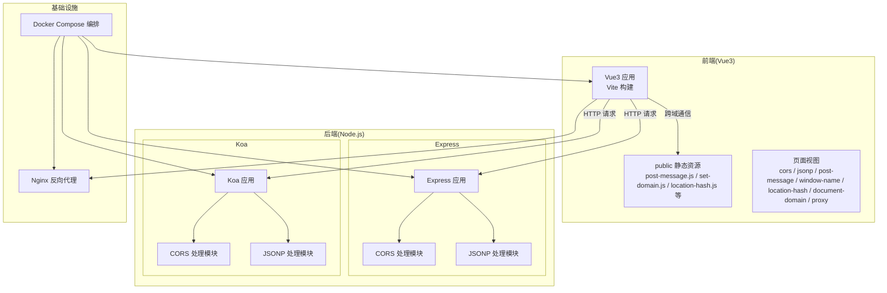
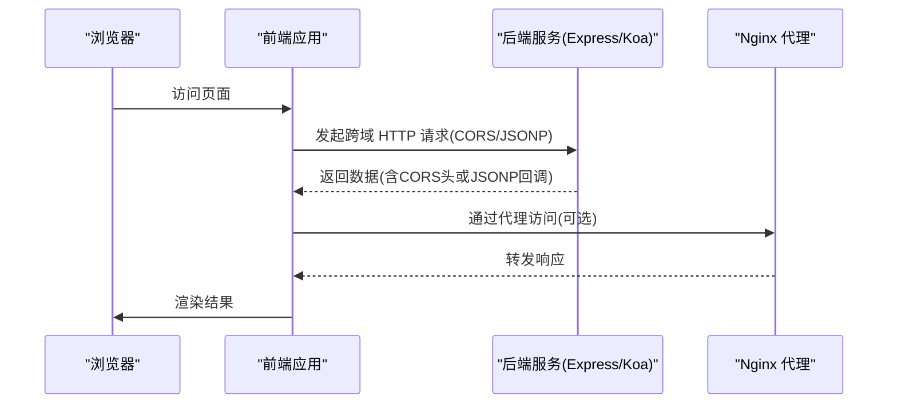
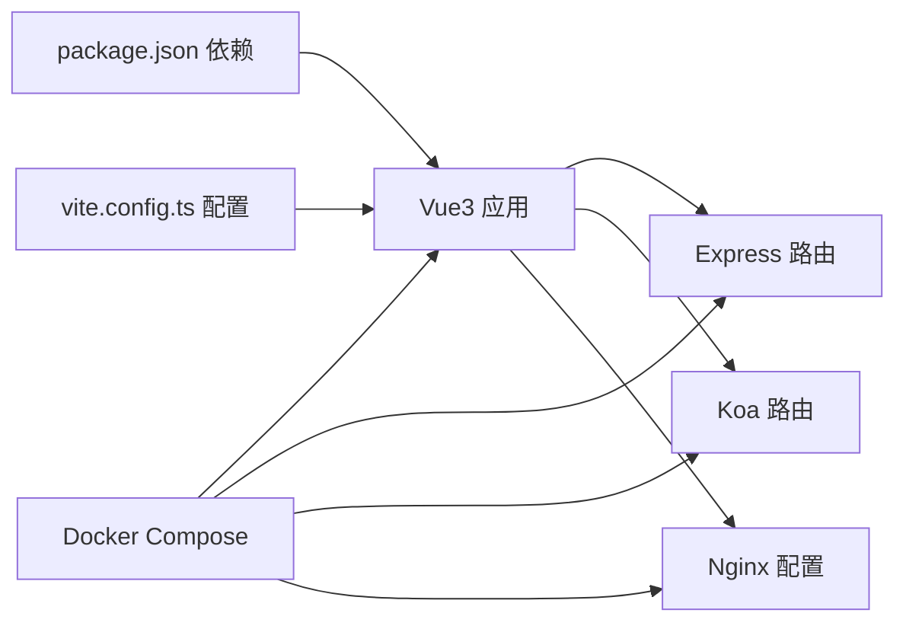

# 跨域演示功能

<cite>
**本文引用的文件**
- [package.json](file://practice/vue3-frontend/cross-domain/package.json)
- [vite.config.ts](file://practice/vue3-frontend/cross-domain/vite.config.ts)
- [index.html](file://practice/vue3-frontend/cross-domain/index.html)
- [post-message.js](file://practice/vue3-frontend/cross-domain/public/post-message.js)
- [set-domain.js](file://practice/vue3-frontend/cross-domain/public/set-domain.js)
- [location-hash.js](file://practice/vue3-frontend/cross-domain/public/location-hash.js)
- [location-hash-left.html](file://practice/vue3-frontend/cross-domain/public/location-hash.left.html)
- [location-hash-middle.html](file://practice/vue3-frontend/cross-domain/public/location-hash.middle.html)
- [location-hash-right.html](file://practice/vue3-frontend/cross-domain/public/location-hash.right.html)
- [receive-msglist.js](file://practice/vue3-frontend/cross-domain/public/receive-msglist.js)
- [common.css](file://practice/vue3-frontend/cross-domain/public/common.css)
- [axios-jsonp.d.ts](file://practice/vue3-frontend/cross-domain/axios-jsonp.d.ts)
- [index.js](file://practice/nodejs-service/express/cross-domain/cross-domain/index.js)
- [cors.js](file://practice/nodejs-service/express/cross-domain/cors.js)
- [jsonp.js](file://practice/nodejs-service/express/cross-domain/jsonp.js)
- [app.js](file://practice/nodejs-service/express/cross-domain/app.js)
- [index.js](file://practice/nodejs-service/koa/cross-domain/cross-domain/index.js)
- [cors.js](file://practice/nodejs-service/koa/cross-domain/cors.js)
- [jsonp.js](file://practice/nodejs-service/koa/cross-domain/jsonp.js)
- [app.js](file://practice/nodejs-service/koa/cross-domain/app.js)
- [docker-compose.yml](file://practice/docker-env/cross-domain/compose/docker-compose.yml)
- [compose.sh](file://practice/docker-env/cross-domain/bin/compose.sh)
- [up.sh](file://practice/docker-env/cross-domain/bin/up.sh)
- [down.sh](file://practice/docker-env/cross-domain/bin/down.sh)
- [nginx.conf](file://practice/vue3-frontend/cross-domain/nginx-conf/nginx.conf)
- [website.conf](file://practice/vue3-frontend/cross-domain/nginx-conf/conf.d/website.conf)
- [proxy.conf](file://practice/vue3-frontend/cross-domain/nginx-conf/conf.d/proxy.conf)
</cite>

## 目录
1. [简介](#简介)
2. [项目结构](#项目结构)
3. [核心组件](#核心组件)
4. [架构总览](#架构总览)
5. [详细组件分析](#详细组件分析)
6. [依赖关系分析](#依赖关系分析)
7. [性能考量](#性能考量)
8. [故障排查指南](#故障排查指南)
9. [结论](#结论)
10. [附录](#附录)

## 简介
本项目围绕“跨域演示功能”构建，覆盖多种跨域解决方案的前端与后端实现：CORS、JSONP、PostMessage、Window Name、Location Hash、Document Domain 以及代理（Nginx）。文档将系统讲解浏览器同源策略与跨域挑战，逐项解析各方案的工作机制、适用场景、优缺点与安全注意事项，并提供可运行的前后端示例与测试方法。

## 项目结构
前端采用 Vue3 + Vite 构建，后端提供 Express 与 Koa 两种框架的跨域服务示例；同时包含 Docker 编排与 Nginx 代理配置，便于在本地快速搭建多域名/多端口环境进行跨域验证。

图表来源
- [index.html](file://practice/vue3-frontend/cross-domain/index.html)
- [post-message.js](file://practice/vue3-frontend/cross-domain/public/post-message.js)
- [cors.js](file://practice/nodejs-service/express/cross-domain/cors.js)
- [jsonp.js](file://practice/nodejs-service/express/cross-domain/jsonp.js)
- [index.js](file://practice/nodejs-service/express/cross-domain/cross-domain/index.js)
- [cors.js](file://practice/nodejs-service/koa/cross-domain/cors.js)
- [jsonp.js](file://practice/nodejs-service/koa/cross-domain/jsonp.js)
- [index.js](file://practice/nodejs-service/koa/cross-domain/cross-domain/index.js)
- [docker-compose.yml](file://practice/docker-env/cross-domain/compose/docker-compose.yml)
- [nginx.conf](file://practice/vue3-frontend/cross-domain/nginx-conf/nginx.conf)

章节来源
- [package.json](file://practice/vue3-frontend/cross-domain/package.json)
- [vite.config.ts](file://practice/vue3-frontend/cross-domain/vite.config.ts)
- [index.html](file://practice/vue3-frontend/cross-domain/index.html)

## 核心组件
- 前端应用与静态脚本：提供 PostMessage、Window Name、Location Hash、Document Domain 等跨域通信示例脚本与页面入口。
- 后端服务（Express/Koa）：分别实现 CORS 与 JSONP 的路由绑定与响应处理。
- Docker 编排与 Nginx：用于启动多容器、多端口/多域名环境，便于真实跨域场景测试。
- 页面视图：按方案划分的页面集合，便于集中演示与对比。

章节来源
- [post-message.js](file://practice/vue3-frontend/cross-domain/public/post-message.js)
- [set-domain.js](file://practice/vue3-frontend/cross-domain/public/set-domain.js)
- [location-hash.js](file://practice/vue3-frontend/cross-domain/public/location-hash.js)
- [index.js](file://practice/nodejs-service/express/cross-domain/cross-domain/index.js)
- [index.js](file://practice/nodejs-service/koa/cross-domain/cross-domain/index.js)
- [docker-compose.yml](file://practice/docker-env/cross-domain/compose/docker-compose.yml)

## 架构总览
下图展示从浏览器到后端与代理的整体调用链路，涵盖跨域请求与跨窗口消息传递的关键节点。

图表来源
- [app.js](file://practice/nodejs-service/express/cross-domain/app.js)
- [index.js](file://practice/nodejs-service/express/cross-domain/cross-domain/index.js)
- [cors.js](file://practice/nodejs-service/express/cross-domain/cors.js)
- [jsonp.js](file://practice/nodejs-service/express/cross-domain/jsonp.js)
- [nginx.conf](file://practice/vue3-frontend/cross-domain/nginx-conf/nginx.conf)

## 详细组件分析

### CORS（跨域资源共享）
- 工作机制
  - 浏览器对跨域请求发送预检（OPTIONS）或直接请求，后端通过设置响应头允许特定来源、方法、头部等，从而放行跨域请求。
  - 支持简单请求与复杂请求，复杂请求需先经预检。
- 适用场景
  - 需要携带 Cookie、自定义头部、非简单方法的跨域请求。
- 优缺点
  - 优点：灵活、支持复杂请求、安全性可控。
  - 缺点：需要后端配合设置响应头；某些旧环境兼容性有限。
- 安全考虑
  - 严格控制 Allow-Origin，避免使用通配符；必要时结合凭证与安全头部。
- 前端实现要点
  - 使用 fetch 或 XMLHttpRequest 发起请求，注意凭证与自定义头部。
- 后端实现要点
  - Express/Koa 中分别绑定 CORS 路由，设置 Access-Control-* 响应头。
- 测试方法
  - 在浏览器网络面板观察预检与实际请求；检查响应头是否包含允许的来源与方法。

章节来源
- [cors.js](file://practice/nodejs-service/express/cross-domain/cors.js)
- [cors.js](file://practice/nodejs-service/koa/cross-domain/cors.js)
- [index.js](file://practice/nodejs-service/express/cross-domain/cross-domain/index.js)
- [index.js](file://practice/nodejs-service/koa/cross-domain/cross-domain/index.js)

### JSONP（基于 script 标签的跨域）
- 工作机制
  - 利用 script 标签不受同源策略限制的特性，通过动态创建 script 元素加载跨域接口，接口返回以回调函数包裹的数据。
- 适用场景
  - 仅 GET 请求、无需凭证、简单数据交互。
- 优缺点
  - 优点：兼容性好、实现简单。
  - 缺点：仅 GET、无错误码语义、易受 CSRF 影响。
- 安全考虑
  - 回调函数名需可控，防止 XSS；仅信任可信接口。
- 前端实现要点
  - 动态插入 script 标签，约定回调参数与函数名。
- 后端实现要点
  - 接收回调参数，返回 “callback(data)” 形式。
- 测试方法
  - 观察网络面板中 script 加载与回调执行；确保返回格式正确。

章节来源
- [jsonp.js](file://practice/nodejs-service/express/cross-domain/jsonp.js)
- [jsonp.js](file://practice/nodejs-service/koa/cross-domain/jsonp.js)
- [axios-jsonp.d.ts](file://practice/vue3-frontend/cross-domain/axios-jsonp.d.ts)

### PostMessage（跨窗口消息传递）
- 工作机制
  - 使用 window.postMessage 在父子窗口或 iframe 间传递消息，接收方监听 message 事件并处理。
- 适用场景
  - 父子窗口通信、iframe 交互、多标签页协作。
- 优缺点
  - 优点：安全可控、可传递任意数据。
  - 缺点：需明确目标窗口与 origin 白名单。
- 安全考虑
  - 校验 source 与 origin；避免 '*'；对数据进行校验与解码。
- 前端实现要点
  - 发送端：window.postMessage(data, targetOrigin)。
  - 接收端：window.addEventListener('message', handler)。
- 后端实现要点
  - 通常无需后端参与，但需确保页面可被嵌入且具备正确 CSP。
- 测试方法
  - 打开多个窗口/iframe，验证消息到达与数据一致性。

章节来源
- [post-message.js](file://practice/vue3-frontend/cross-domain/public/post-message.js)
- [receive-msglist.js](file://practice/vue3-frontend/cross-domain/public/receive-msglist.js)

### Window Name（基于 window.name 的跨域）
- 工作机制
  - 利用 window.name 在不同域之间持久化数据的能力，通过中间页或 iframe 将数据写入 name，再在父窗口读取。
- 适用场景
  - 需要在不同域间传递少量数据，且不希望引入额外协议。
- 优缺点
  - 优点：无需服务器参与、实现相对简单。
  - 缺点：存在兼容性与安全风险，不适合复杂数据。
- 安全考虑
  - 数据必须可序列化；避免敏感信息泄漏。
- 前端实现要点
  - 设置 iframe 源到目标域，等待其加载完成后读取 window.name。
- 后端实现要点
  - 无需特殊处理，只需保证页面可访问。
- 测试方法
  - 在不同域页面间切换，验证 name 数据是否正确传递。

章节来源
- [window-name.html](file://practice/vue3-frontend/cross-domain/public/window-name.html)

### Location Hash（基于 URL hash 的跨域）
- 工作机制
  - 通过改变 hash 或监听 hashchange，在父子窗口间传递消息；也可用 callback 标记回调完成。
- 适用场景
  - 简单消息通知、轻量数据传递。
- 优缺点
  - 优点：无需服务器参与、兼容性好。
  - 缺点：长度受限、易被搜索引擎抓取，不适合大量数据。
- 安全考虑
  - 对 hash 内容进行编码与解码；避免注入恶意内容。
- 前端实现要点
  - 监听 onhashchange，解析 hash 并触发回调。
- 后端实现要点
  - 无需特殊处理。
- 测试方法
  - 修改 hash 并观察回调触发与数据解析。

章节来源
- [location-hash.js](file://practice/vue3-frontend/cross-domain/public/location-hash.js)
- [location-hash-left.html](file://practice/vue3-frontend/cross-domain/public/location-hash.left.html)
- [location-hash-middle.html](file://practice/vue3-frontend/cross-domain/public/location-hash.middle.html)
- [location-hash-right.html](file://practice/vue3-frontend/cross-domain/public/location-hash.right.html)

### Document Domain（修改 document.domain 实现跨域）
- 工作机制
  - 当主域相同时（如 a.example.com 与 b.example.com），可通过设置 document.domain 使两者视为同源，从而共享 Cookie、LocalStorage 等。
- 适用场景
  - 子域共享场景，如主站与子站。
- 优缺点
  - 优点：简单有效。
  - 缺点：仅适用于主域相同的情况；存在安全风险。
- 安全考虑
  - 仅在可信子域间使用；避免提升权限。
- 前端实现要点
  - 在父子窗口均设置 document.domain。
- 后端实现要点
  - 无需特殊处理。
- 测试方法
  - 在不同子域页面间操作共享存储，验证是否生效。

章节来源
- [set-domain.js](file://practice/vue3-frontend/cross-domain/public/set-domain.js)
- [set-domain.html](file://practice/vue3-frontend/cross-domain/public/set-domain.html)

### 代理（Nginx 反向代理）
- 工作机制
  - 将前端请求转发至后端，使浏览器认为是同源请求，从而绕过跨域限制。
- 适用场景
  - 开发环境或生产环境统一走一个端口/域名。
- 优缺点
  - 优点：对前端透明、可统一鉴权与缓存。
  - 缺点：增加部署复杂度。
- 安全考虑
  - 严格控制代理路径与来源；启用 HTTPS。
- 前端实现要点
  - 将 API 地址指向代理域名/端口。
- 后端实现要点
  - 配置 Nginx upstream 指向后端服务。
- 测试方法
  - 在浏览器网络面板查看请求是否经由代理；确认响应正常。

章节来源
- [nginx.conf](file://practice/vue3-frontend/cross-domain/nginx-conf/nginx.conf)
- [website.conf](file://practice/vue3-frontend/cross-domain/nginx-conf/conf.d/website.conf)
- [proxy.conf](file://practice/vue3-frontend/cross-domain/nginx-conf/conf.d/proxy.conf)

## 依赖关系分析
- 前端依赖
  - Vue3、Vite、axios、类型声明等，详见包管理配置。
- 后端依赖
  - Express/Koa 及其路由模块，分别导出跨域处理函数。
- 基础设施
  - Docker Compose 统一编排前端、后端与 Nginx；Nginx 提供反向代理。

图表来源
- [package.json](file://practice/vue3-frontend/cross-domain/package.json)
- [vite.config.ts](file://practice/vue3-frontend/cross-domain/vite.config.ts)
- [index.js](file://practice/nodejs-service/express/cross-domain/cross-domain/index.js)
- [index.js](file://practice/nodejs-service/koa/cross-domain/cross-domain/index.js)
- [docker-compose.yml](file://practice/docker-env/cross-domain/compose/docker-compose.yml)

章节来源
- [package.json](file://practice/vue3-frontend/cross-domain/package.json)
- [vite.config.ts](file://practice/vue3-frontend/cross-domain/vite.config.ts)
- [docker-compose.yml](file://practice/docker-env/cross-domain/compose/docker-compose.yml)

## 性能考量
- CORS
  - 避免频繁预检：减少自定义头部与复杂方法；合并请求。
  - 合理设置缓存：Access-Control-Max-Age。
- JSONP
  - 控制回调数量与生命周期，及时清理 script 标签。
- PostMessage
  - 限制消息大小与频率；避免阻塞主线程。
- Window Name/Location Hash
  - 注意 URL 长度限制；避免频繁刷新。
- 代理
  - 启用压缩与缓存；合理设置超时与并发。

## 故障排查指南
- CORS
  - 现象：预检失败或响应头缺失。
  - 排查：核对 Allow-Origin、Allow-Methods、Allow-Headers 是否匹配；是否携带凭证。
- JSONP
  - 现象：回调未执行或报错。
  - 排查：确认回调函数名与接口返回格式一致；检查网络与跨域白名单。
- PostMessage
  - 现象：消息未到达或 origin 不匹配。
  - 排查：校验 targetOrigin；确保接收端已注册监听。
- Window Name/Location Hash
  - 现象：数据丢失或解析异常。
  - 排查：检查编码/解码逻辑；确认页面加载顺序。
- Document Domain
  - 现象：仍无法共享存储。
  - 排查：确认主域一致且双方均已设置 document.domain。
- 代理
  - 现象：请求未转发或 404。
  - 排查：核对 Nginx upstream 与 location 配置；检查容器连通性。

章节来源
- [cors.js](file://practice/nodejs-service/express/cross-domain/cors.js)
- [jsonp.js](file://practice/nodejs-service/express/cross-domain/jsonp.js)
- [post-message.js](file://practice/vue3-frontend/cross-domain/public/post-message.js)
- [location-hash.js](file://practice/vue3-frontend/cross-domain/public/location-hash.js)
- [set-domain.js](file://practice/vue3-frontend/cross-domain/public/set-domain.js)
- [nginx.conf](file://practice/vue3-frontend/cross-domain/nginx-conf/nginx.conf)

## 结论
本项目提供了从浏览器到后端与代理的完整跨域演示路径。实践中应优先选择 CORS 与代理，辅以 PostMessage 等窗口通信手段；在兼容性要求高的场景可考虑 JSONP；Window Name 与 Location Hash 适合轻量数据传递；Document Domain 仅限于主域相同的子域场景。建议结合安全策略与性能优化，按需组合多种方案。

## 附录
- 快速启动
  - 安装依赖与运行：参考前端根目录命令说明。
  - Docker 编排：使用提供的 compose.sh、up.sh、down.sh 脚本。
- 页面入口
  - 前端入口与静态资源位于 public 目录，页面视图按方案分类组织。
- 类型声明
  - JSONP 类型声明文件用于 TypeScript 项目集成。

章节来源
- [README.md](file://practice/vue3-frontend/cross-domain/README.md)
- [compose.sh](file://practice/docker-env/cross-domain/bin/compose.sh)
- [up.sh](file://practice/docker-env/cross-domain/bin/up.sh)
- [down.sh](file://practice/docker-env/cross-domain/bin/down.sh)
- [index.html](file://practice/vue3-frontend/cross-domain/index.html)
- [common.css](file://practice/vue3-frontend/cross-domain/public/common.css)