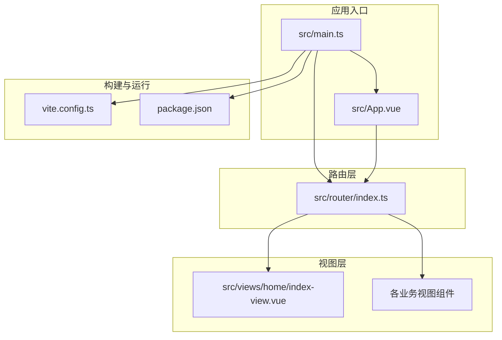
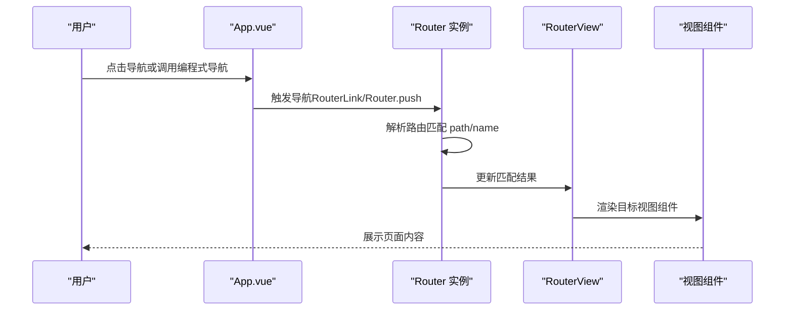
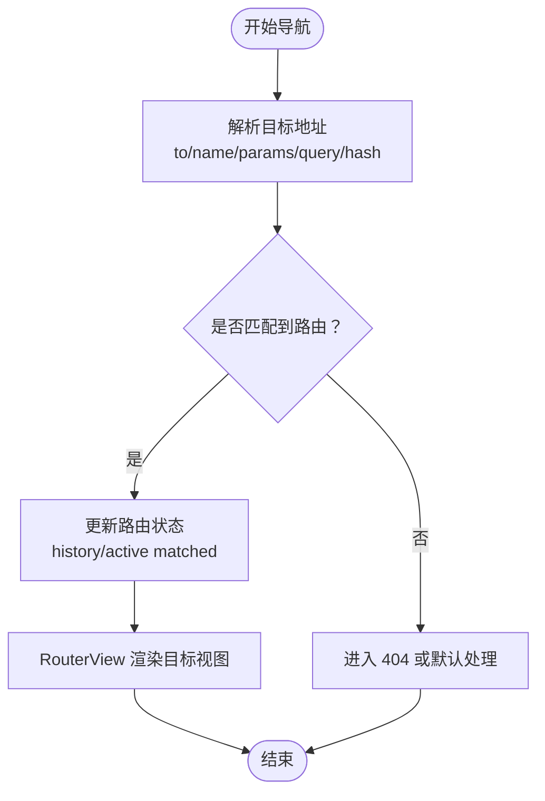
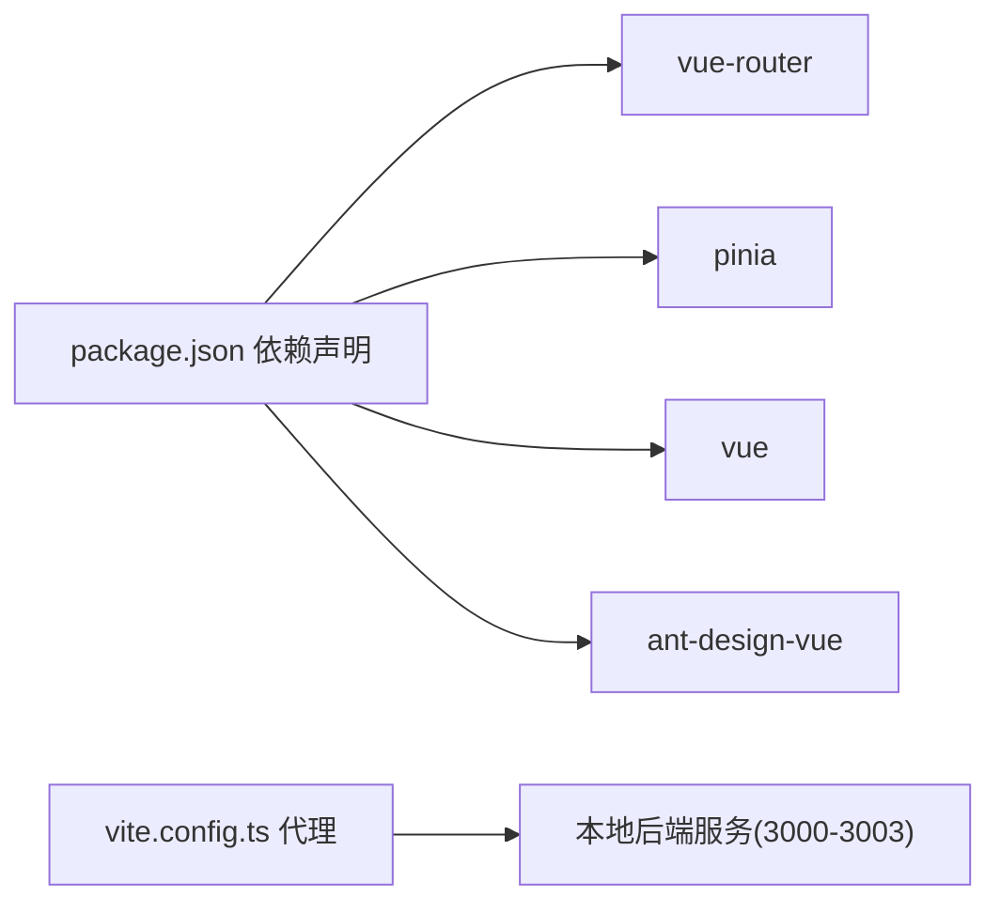

# 路由系统

<cite>
**本文引用的文件**
- [practice/vue3-frontend/cross-domain/src/router/index.ts](file://practice/vue3-frontend/cross-domain/src/router/index.ts)
- [practice/vue3-frontend/cross-domain/src/main.ts](file://practice/vue3-frontend/cross-domain/src/main.ts)
- [practice/vue3-frontend/cross-domain/src/App.vue](file://practice/vue3-frontend/cross-domain/src/App.vue)
- [practice/vue3-frontend/cross-domain/src/views/home/index-view.vue](file://practice/vue3-frontend/cross-domain/src/views/home/index-view.vue)
- [practice/vue3-frontend/cross-domain/src/components/main-content.vue](file://practice/vue3-frontend/cross-domain/src/components/main-content.vue)
- [practice/vue3-frontend/cross-domain/package.json](file://practice/vue3-frontend/cross-domain/package.json)
- [practice/vue3-frontend/cross-domain/vite.config.ts](file://practice/vue3-frontend/cross-domain/vite.config.ts)
</cite>

## 目录
1. [引言](#引言)
2. [项目结构](#项目结构)
3. [核心组件](#核心组件)
4. [架构总览](#架构总览)
5. [详细组件分析](#详细组件分析)
6. [依赖分析](#依赖分析)
7. [性能考虑](#性能考虑)
8. [故障排查指南](#故障排查指南)
9. [结论](#结论)
10. [附录](#附录)

## 引言
本文件围绕 Vue Router 路由系统进行系统化梳理，结合仓库中的实际代码，从路由配置设计、导航解析流程、路由参数与查询字符串处理、动态路由匹配、懒加载、嵌套路由与元信息、组件绑定、路由切换动画与历史记录管理、权限控制、面包屑与状态同步等维度展开，并提供可操作的实践建议与性能优化要点。读者无需具备深厚的前端背景即可理解并应用。

## 项目结构
该示例工程采用“按功能模块组织”的前端目录结构，路由相关的核心文件集中在 src/router/index.ts；应用入口在 src/main.ts 中注册路由；页面视图位于 src/views 下，通用布局与导航在 src/App.vue 与 src/components 中实现；构建工具使用 Vite，代理配置位于 vite.config.ts。

图表来源
- [practice/vue3-frontend/cross-domain/src/main.ts:1-16](file://practice/vue3-frontend/cross-domain/src/main.ts#L1-L16)
- [practice/vue3-frontend/cross-domain/src/router/index.ts:1-50](file://practice/vue3-frontend/cross-domain/src/router/index.ts#L1-L50)
- [practice/vue3-frontend/cross-domain/src/App.vue:1-107](file://practice/vue3-frontend/cross-domain/src/App.vue#L1-L107)
- [practice/vue3-frontend/cross-domain/src/views/home/index-view.vue:1-105](file://practice/vue3-frontend/cross-domain/src/views/home/index-view.vue#L1-L105)
- [practice/vue3-frontend/cross-domain/vite.config.ts:1-40](file://practice/vue3-frontend/cross-domain/vite.config.ts#L1-L40)
- [practice/vue3-frontend/cross-domain/package.json:1-43](file://practice/vue3-frontend/cross-domain/package.json#L1-L43)

章节来源
- [practice/vue3-frontend/cross-domain/src/main.ts:1-16](file://practice/vue3-frontend/cross-domain/src/main.ts#L1-L16)
- [practice/vue3-frontend/cross-domain/src/router/index.ts:1-50](file://practice/vue3-frontend/cross-domain/src/router/index.ts#L1-L50)
- [practice/vue3-frontend/cross-domain/src/App.vue:1-107](file://practice/vue3-frontend/cross-domain/src/App.vue#L1-L107)
- [practice/vue3-frontend/cross-domain/vite.config.ts:1-40](file://practice/vue3-frontend/cross-domain/vite.config.ts#L1-L40)
- [practice/vue3-frontend/cross-domain/package.json:1-43](file://practice/vue3-frontend/cross-domain/package.json#L1-L43)

## 核心组件
- 路由器实例：通过 createRouter 创建，使用 HTML5 History 模式，基于 BASE_URL 初始化，定义了多条静态路由（首页与若干跨域演示页）。
- 应用入口：在 main.ts 中安装路由插件并挂载应用。
- 视图与导航：App.vue 提供全局导航链接与 RouterView 容器；各业务视图组件负责具体页面展示。
- 构建与代理：Vite 配置提供本地开发代理，便于联调后端服务。

章节来源
- [practice/vue3-frontend/cross-domain/src/router/index.ts:1-50](file://practice/vue3-frontend/cross-domain/src/router/index.ts#L1-L50)
- [practice/vue3-frontend/cross-domain/src/main.ts:1-16](file://practice/vue3-frontend/cross-domain/src/main.ts#L1-L16)
- [practice/vue3-frontend/cross-domain/src/App.vue:1-107](file://practice/vue3-frontend/cross-domain/src/App.vue#L1-L107)
- [practice/vue3-frontend/cross-domain/vite.config.ts:1-40](file://practice/vue3-frontend/cross-domain/vite.config.ts#L1-L40)

## 架构总览
下图展示了从应用启动到路由渲染的关键交互：应用在入口处注册路由插件；用户通过 RouterLink 或编程式导航触发路由变更；RouterView 基于当前路由匹配到对应视图组件并渲染。

图表来源
- [practice/vue3-frontend/cross-domain/src/App.vue:1-107](file://practice/vue3-frontend/cross-domain/src/App.vue#L1-L107)
- [practice/vue3-frontend/cross-domain/src/router/index.ts:1-50](file://practice/vue3-frontend/cross-domain/src/router/index.ts#L1-L50)

## 详细组件分析

### 路由配置与导航解析
- 静态路由表：路由表包含首页与多个演示页面，每条路由均采用异步组件导入实现懒加载。
- 导航方式：
  - 声明式：RouterLink 组件生成导航链接。
  - 编程式：useRouter 获取路由实例，支持 push/replace/go 等方法。
- 匹配规则：优先按 path 精确匹配；未显式声明重定向时，按声明顺序匹配首个命中项。

图表来源
- [practice/vue3-frontend/cross-domain/src/router/index.ts:1-50](file://practice/vue3-frontend/cross-domain/src/router/index.ts#L1-L50)
- [practice/vue3-frontend/cross-domain/src/App.vue:1-107](file://practice/vue3-frontend/cross-domain/src/App.vue#L1-L107)

章节来源
- [practice/vue3-frontend/cross-domain/src/router/index.ts:1-50](file://practice/vue3-frontend/cross-domain/src/router/index.ts#L1-L50)
- [practice/vue3-frontend/cross-domain/src/App.vue:1-107](file://practice/vue3-frontend/cross-domain/src/App.vue#L1-L107)

### 路由参数传递、查询字符串与动态匹配
- 动态路由参数：可通过 path 中的占位符捕获路径段，配合 params 使用。
- 查询字符串：通过 query 对象传入，适合无状态数据传递。
- 命名路由：通过 name 与 params/queries 组合，提升可维护性与可读性。
- 实践建议：
  - 对外暴露的路由尽量使用命名路由与查询参数，避免将敏感数据放入路径。
  - 复杂筛选条件建议使用查询参数，利于分享与缓存。

章节来源
- [practice/vue3-frontend/cross-domain/src/router/index.ts:1-50](file://practice/vue3-frontend/cross-domain/src/router/index.ts#L1-L50)
- [practice/vue3-frontend/cross-domain/src/App.vue:1-107](file://practice/vue3-frontend/cross-domain/src/App.vue#L1-L107)

### 路由懒加载、嵌套路由与元信息
- 懒加载：路由组件采用函数式导入，实现按需加载，降低首屏体积。
- 嵌套路由：可在某条路由下定义 children，形成父子视图关系；父路由通过 RouterView 嵌套子视图。
- 元信息：routes 中可为每个路由添加 meta 字段，用于标识权限、标题、图标等，便于统一处理（如菜单生成、面包屑、标题设置）。

章节来源
- [practice/vue3-frontend/cross-domain/src/router/index.ts:1-50](file://practice/vue3-frontend/cross-domain/src/router/index.ts#L1-L50)

### 路由与组件绑定、切换动画与历史记录
- 组件绑定：RouterView 根据当前路由自动渲染对应组件；可通过 keep-alive 包裹实现缓存复用。
- 切换动画：可在 RouterView 上结合过渡动画类实现页面切换动效。
- 历史记录：History 模式下浏览器前进/后退由路由内部维护；可通过 replace 控制是否替换历史栈。

章节来源
- [practice/vue3-frontend/cross-domain/src/App.vue:1-107](file://practice/vue3-frontend/cross-domain/src/App.vue#L1-L107)
- [practice/vue3-frontend/cross-domain/src/router/index.ts:1-50](file://practice/vue3-frontend/cross-domain/src/router/index.ts#L1-L50)

### 权限控制、面包屑与状态同步
- 权限控制：结合路由元信息与全局前置守卫，在导航前校验角色/权限，决定放行或跳转至登录/无权页。
- 面包屑：根据当前路由的 matched 数组逐级生成路径层级，结合 meta.title 显示友好名称。
- 状态同步：将路由状态映射到 Pinia Store，实现页面间共享与持久化（例如筛选条件、分页状态）。

章节来源
- [practice/vue3-frontend/cross-domain/src/main.ts:1-16](file://practice/vue3-frontend/cross-domain/src/main.ts#L1-L16)
- [practice/vue3-frontend/cross-domain/src/router/index.ts:1-50](file://practice/vue3-frontend/cross-domain/src/router/index.ts#L1-L50)

### 开发与构建集成
- 本地开发：Vite 提供热更新与代理能力；示例中配置了多条代理规则，便于联调后端接口。
- 生产构建：通过脚本打包输出静态资源，结合 CDN/反向代理部署。

章节来源
- [practice/vue3-frontend/cross-domain/vite.config.ts:1-40](file://practice/vue3-frontend/cross-domain/vite.config.ts#L1-L40)
- [practice/vue3-frontend/cross-domain/package.json:1-43](file://practice/vue3-frontend/cross-domain/package.json#L1-L43)

## 依赖分析
- 运行时依赖：vue、vue-router、pinia、ant-design-vue 等。
- 构建与开发：vite、@vitejs/plugin-vue、typescript、eslint、prettier 等。
- 代理与网络：示例中通过 Vite 代理将特定路径转发到本地不同端口的服务。

图表来源
- [practice/vue3-frontend/cross-domain/package.json:1-43](file://practice/vue3-frontend/cross-domain/package.json#L1-L43)
- [practice/vue3-frontend/cross-domain/vite.config.ts:1-40](file://practice/vue3-frontend/cross-domain/vite.config.ts#L1-L40)

章节来源
- [practice/vue3-frontend/cross-domain/package.json:1-43](file://practice/vue3-frontend/cross-domain/package.json#L1-L43)
- [practice/vue3-frontend/cross-domain/vite.config.ts:1-40](file://practice/vue3-frontend/cross-domain/vite.config.ts#L1-L40)

## 性能考虑
- 路由懒加载：继续沿用函数式导入，减少初始包体。
- 路由缓存：对频繁访问且状态昂贵的页面使用 keep-alive 缓存，避免重复渲染。
- 路由预加载：对关键路径使用路由级别的预加载策略，缩短首屏等待。
- 资源优化：结合 Vite 的代码分割与 Tree Shaking，确保按需引入第三方库。
- 历史记录：谨慎使用 replace，避免破坏用户前进/后退体验。

## 故障排查指南
- 路由不生效或空白页
  - 检查 RouterView 是否存在且未被包裹在条件渲染中。
  - 确认路由 path/name 是否正确，是否存在同名路由覆盖。
- 参数丢失
  - 使用命名路由时，确认传入的 params/queries 与路由定义一致。
- 404 页面
  - 在路由表末尾添加兜底路由，指向统一的 404 组件。
- 前端代理无效
  - 检查 vite.config.ts 中代理前缀与请求路径是否匹配，确认 changeOrigin 与 rewrite 规则。

章节来源
- [practice/vue3-frontend/cross-domain/src/router/index.ts:1-50](file://practice/vue3-frontend/cross-domain/src/router/index.ts#L1-L50)
- [practice/vue3-frontend/cross-domain/src/App.vue:1-107](file://practice/vue3-frontend/cross-domain/src/App.vue#L1-L107)
- [practice/vue3-frontend/cross-domain/vite.config.ts:1-40](file://practice/vue3-frontend/cross-domain/vite.config.ts#L1-L40)

## 结论
本项目以最小可用为目标，清晰地展示了 Vue Router 的基础用法：静态路由、懒加载、声明式与编程式导航、以及与应用入口的集成。在此基础上，可进一步扩展嵌套路由、元信息驱动的菜单与面包屑、全局守卫实现权限控制、以及与状态管理的联动，从而支撑更复杂的业务场景。

## 附录
- 示例路由清单（来源于路由表）
  - 首页：/，名称 Home
  - CORS：/cors，名称 CORS
  - Proxy：/proxy，名称 Proxy
  - Jsonp：/jsonp，名称 Jsonp
  - PostMessage：/post-message，名称 PostMessage
  - DocumentDomain：/document-domain，名称 DocumentDomain
  - WindowName：/window-name，名称 WindowName
  - LocationHash：/location-hash，名称 LocationHash

章节来源
- [practice/vue3-frontend/cross-domain/src/router/index.ts:1-50](file://practice/vue3-frontend/cross-domain/src/router/index.ts#L1-L50)