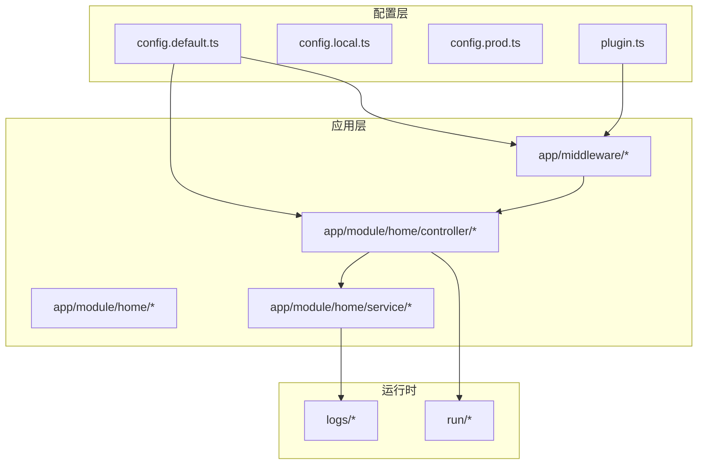
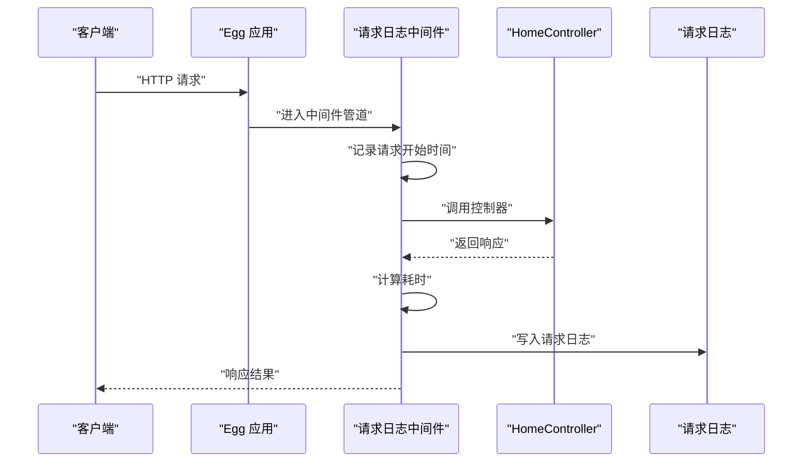
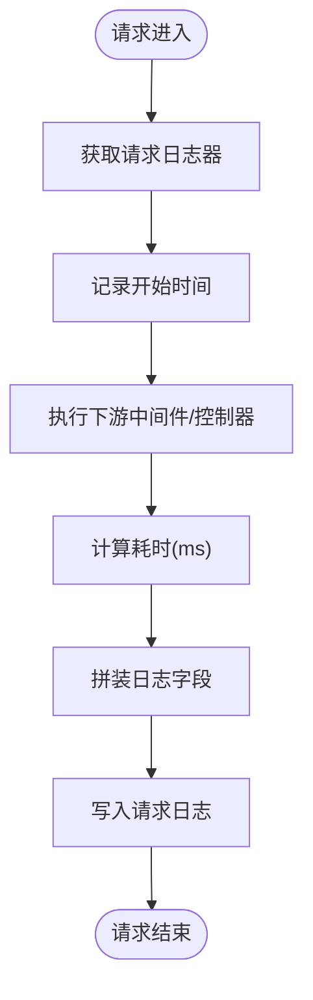
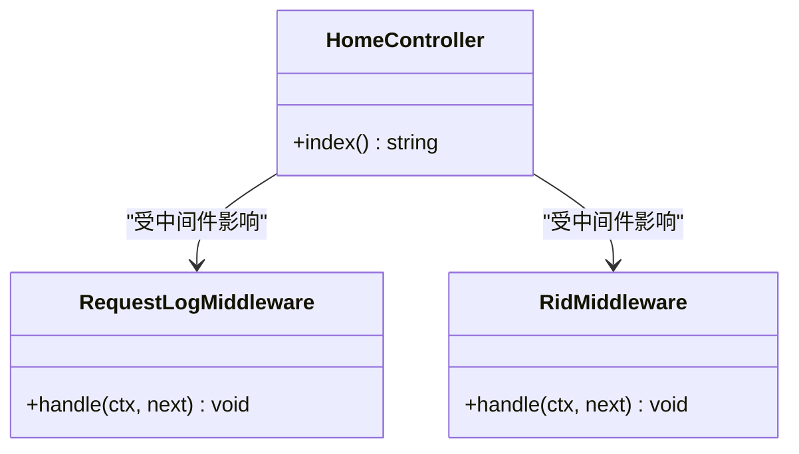
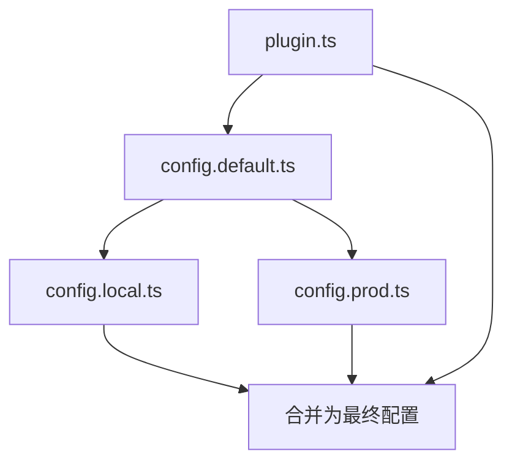
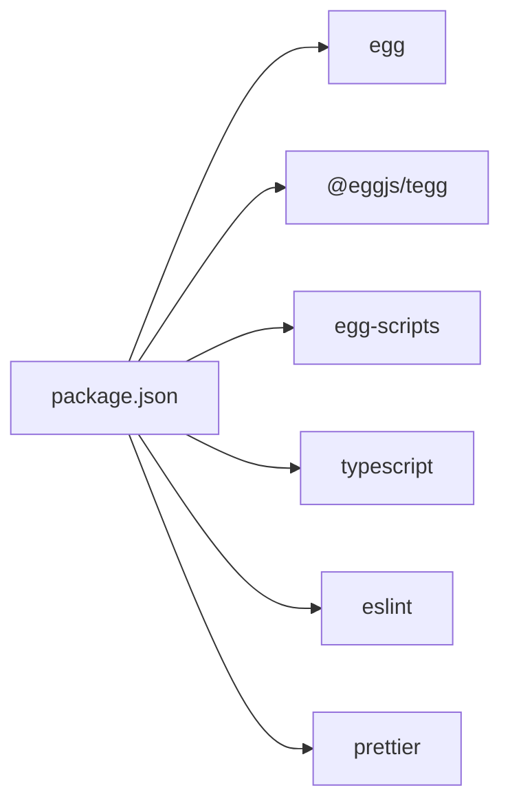

# Egg.js服务

<cite>
**本文引用的文件**
- [package.json](file://practice/nodejs-service/egg/request-log/package.json)
- [config.default.ts](file://practice/nodejs-service/egg/request-log/config/config.default.ts)
- [plugin.ts](file://practice/nodejs-service/egg/request-log/config/plugin.ts)
- [request-log中间件.ts](file://practice/nodejs-service/egg/request-log/app/middleware/request-log.ts)
- [home控制器.ts](file://practice/nodejs-service/egg/request-log/app/module/home/controller/home.ts)
- [跨域配置.ts](file://practice/nodejs-service/egg/cross-domain/config/config.default.ts)
- [请求ID中间件.ts](file://practice/nodejs-service/egg/request-id/app/middleware/rid.ts)
- [模板配置.ts](file://practice/nodejs-service/egg/template/config/config.default.ts)
- [docker镜像配置.ts](file://practice/nodejs-service/egg/docker-image/config/config.default.ts)
</cite>

## 目录
1. [简介](#简介)
2. [项目结构](#项目结构)
3. [核心组件](#核心组件)
4. [架构总览](#架构总览)
5. [详细组件分析](#详细组件分析)
6. [依赖分析](#依赖分析)
7. [性能考虑](#性能考虑)
8. [故障排查指南](#故障排查指南)
9. [结论](#结论)
10. [附录](#附录)

## 简介
本文件面向企业级 Node.js 框架 Egg.js 的服务实现与运维，围绕 MVC 架构模式与插件体系展开，系统性阐述项目结构组织、配置文件管理（config.default.ts、config.local.ts、config.prod.ts）、模块化开发模式；重点解析中间件系统（请求日志中间件、跨域处理中间件等）的实现原理与使用方法；给出控制器与业务逻辑的实现示例；并补充 ORM 集成、数据库连接与事务处理的通用实践建议、性能优化策略、错误处理策略以及部署最佳实践。

## 项目结构
Egg.js 项目采用约定优于配置的设计理念，典型目录结构如下：
- config：存放多环境配置文件，按环境拆分以实现差异化配置
- app：应用主体，包含 controller、service、middleware、module 等
- app/module：模块化开发单元，每个模块可独立组织路由与业务
- app/middleware：中间件层，统一处理横切关注点（如日志、鉴权、跨域）
- logs：运行时日志输出目录
- run：运行时生成的元数据与路由信息
- typings：类型声明扩展
- dockerfile：容器化构建脚本
- package.json：依赖与脚本定义

图表来源
- [config.default.ts:1-83](file://practice/nodejs-service/egg/request-log/config/config.default.ts#L1-L83)
- [plugin.ts:1-35](file://practice/nodejs-service/egg/request-log/config/plugin.ts#L1-L35)
- [request-log中间件.ts:1-48](file://practice/nodejs-service/egg/request-log/app/middleware/request-log.ts#L1-L48)
- [home控制器.ts:1-19](file://practice/nodejs-service/egg/request-log/app/module/home/controller/home.ts#L1-L19)

章节来源
- [config.default.ts:1-83](file://practice/nodejs-service/egg/request-log/config/config.default.ts#L1-L83)
- [plugin.ts:1-35](file://practice/nodejs-service/egg/request-log/config/plugin.ts#L1-L35)

## 核心组件
- 中间件系统：通过 config.default.ts 注册全局中间件，实现统一的日志记录、请求追踪、跨域处理等横切能力
- 控制器（Controller）：基于 TEGG 注解的 HTTP 控制器，负责接收请求、编排业务逻辑、返回响应
- 插件体系：通过 plugin.ts 启用 TEGG 生态与链路追踪等插件，增强框架能力
- 配置管理：多环境配置文件按需覆盖默认配置，支持本地开发、生产环境差异

章节来源
- [request-log中间件.ts:1-48](file://practice/nodejs-service/egg/request-log/app/middleware/request-log.ts#L1-L48)
- [home控制器.ts:1-19](file://practice/nodejs-service/egg/request-log/app/module/home/controller/home.ts#L1-L19)
- [plugin.ts:1-35](file://practice/nodejs-service/egg/request-log/config/plugin.ts#L1-L35)

## 架构总览
下图展示从客户端到控制器、中间件与日志系统的端到端调用流程：

图表来源
- [request-log中间件.ts:22-47](file://practice/nodejs-service/egg/request-log/app/middleware/request-log.ts#L22-L47)
- [home控制器.ts:15-17](file://practice/nodejs-service/egg/request-log/app/module/home/controller/home.ts#L15-L17)
- [config.default.ts:26-39](file://practice/nodejs-service/egg/request-log/config/config.default.ts#L26-L39)

## 详细组件分析

### 中间件系统
- 请求日志中间件
  - 功能：在请求进入与返回时采集远程地址、HTTP 方法与URL、状态码、内容长度、耗时、来源页与UA等信息，并写入自定义请求日志
  - 关键点：通过 ctx.app.getLogger('request') 获取专用日志实例；使用 logToken 记录标准化字段；在 next() 后计算耗时并落盘
  - 使用方式：在 config.default.ts 中将 'requestLog' 加入 config.middleware 即可启用
- 跨域处理中间件
  - 功能：通过 config.security.domainWhiteList 与 config.cors.origin 实现跨域白名单控制
  - 使用方式：在 config.default.ts 中配置 cors 选项，或在特定路由场景动态设置
- 请求 ID 中间件
  - 功能：为每次请求生成唯一标识（rid），并注入上下文命名空间，便于链路追踪与日志关联
  - 使用方式：在 config.default.ts 中将 'rid' 加入 config.middleware 即可启用

图表来源
- [request-log中间件.ts:22-47](file://practice/nodejs-service/egg/request-log/app/middleware/request-log.ts#L22-L47)

章节来源
- [request-log中间件.ts:1-48](file://practice/nodejs-service/egg/request-log/app/middleware/request-log.ts#L1-L48)
- [跨域配置.ts:24-41](file://practice/nodejs-service/egg/cross-domain/config/config.default.ts#L24-L41)
- [请求ID中间件.ts:11-18](file://practice/nodejs-service/egg/request-id/app/middleware/rid.ts#L11-L18)

### 控制器与业务逻辑
- 控制器（TEGG 注解）
  - 通过 @HTTPController 定义路径，@HTTPMethod 定义具体方法与路径
  - 示例：HomeController 在根路径返回简要服务信息
  - 建议：控制器仅做参数校验、编排与响应，复杂业务下沉至 Service
- 业务逻辑（Service）
  - 建议：将数据库访问、第三方接口调用、复杂计算等放入 Service
  - 建议：Service 通过依赖注入在控制器中使用，保持职责单一
  - 建议：结合事务插件与 ORM 进行事务控制（见“性能与事务”）

图表来源
- [home控制器.ts:4-17](file://practice/nodejs-service/egg/request-log/app/module/home/controller/home.ts#L4-L17)
- [request-log中间件.ts:22-26](file://practice/nodejs-service/egg/request-log/app/middleware/request-log.ts#L22-L26)
- [请求ID中间件.ts:11-17](file://practice/nodejs-service/egg/request-id/app/middleware/rid.ts#L11-L17)

章节来源
- [home控制器.ts:1-19](file://practice/nodejs-service/egg/request-log/app/module/home/controller/home.ts#L1-L19)

### 配置文件管理
- config.default.ts：框架与业务的基础配置，包含 keys、middleware、logger、customLogger、siteFile 等
- config.local.ts：本地开发环境覆盖项（如端口、调试开关、本地数据库连接）
- config.prod.ts：生产环境覆盖项（如日志目录、安全策略、只读配置）
- plugin.ts：启用 TEGG 生态与链路追踪等插件，增强框架能力

图表来源
- [config.default.ts:18-82](file://practice/nodejs-service/egg/request-log/config/config.default.ts#L18-L82)
- [plugin.ts:3-32](file://practice/nodejs-service/egg/request-log/config/plugin.ts#L3-L32)

章节来源
- [config.default.ts:1-83](file://practice/nodejs-service/egg/request-log/config/config.default.ts#L1-L83)
- [模板配置.ts:1-30](file://practice/nodejs-service/egg/template/config/config.default.ts#L1-L30)
- [docker镜像配置.ts:1-30](file://practice/nodejs-service/egg/docker-image/config/config.default.ts#L1-L30)

### 插件系统
- TEGG 生态：通过 plugin.ts 启用 tegg、tegg-controller、tegg-schedule、eventbus、aop 等模块，提升模块化与可测试性
- 链路追踪：启用 egg-tracer 插件，配合请求 ID 中间件实现全链路可观测

章节来源
- [plugin.ts:3-32](file://practice/nodejs-service/egg/request-log/config/plugin.ts#L3-L32)
- [package.json:22-33](file://practice/nodejs-service/egg/request-log/package.json#L22-L33)

## 依赖分析
- 运行时依赖：egg、@eggjs/tegg 及其生态插件、egg-scripts（进程管理）
- 开发依赖：typescript、eslint、prettier、egg-bin（开发与测试工具）
- Node 版本要求：>= 20.10.0

图表来源
- [package.json:1-56](file://practice/nodejs-service/egg/request-log/package.json#L1-L56)

章节来源
- [package.json:1-56](file://practice/nodejs-service/egg/request-log/package.json#L1-L56)

## 性能考虑
- 中间件顺序：将高频且轻量的中间件前置（如请求 ID、限流），减少后续处理成本
- 日志落盘：避免在热路径频繁写磁盘，必要时采用异步日志或批量刷盘
- 缓存策略：对静态资源与热点数据使用缓存，降低数据库压力
- 数据库连接池：合理配置连接数上限与超时，避免连接泄漏
- ORM 事务：长事务尽量缩短，批量操作使用事务批处理，避免长时间锁表
- 并发模型：利用 Egg 多进程模型与负载均衡，结合容器编排实现弹性伸缩

## 故障排查指南
- 请求无日志
  - 检查 config.default.ts 是否正确注册 'requestLog' 中间件
  - 确认自定义 logger.request 的 file 输出路径存在且有写权限
- 跨域失败
  - 检查 config.cors.origin 与 config.security.domainWhiteList 配置是否符合预期
  - 对于复杂场景，可在控制器或路由层动态设置 CORS
- 请求 ID 未生效
  - 确认 'rid' 中间件已加入 config.middleware
  - 检查命名空间注入与上下文传播是否正确
- 启动异常
  - 查看 package.json 中脚本与 Node 版本要求
  - 使用 egg-bin dev 或 egg-scripts start --daemon 排查启动日志

章节来源
- [config.default.ts:26-39](file://practice/nodejs-service/egg/request-log/config/config.default.ts#L26-L39)
- [跨域配置.ts:24-41](file://practice/nodejs-service/egg/cross-domain/config/config.default.ts#L24-L41)
- [请求ID中间件.ts:11-18](file://practice/nodejs-service/egg/request-id/app/middleware/rid.ts#L11-L18)
- [package.json:9-21](file://practice/nodejs-service/egg/request-log/package.json#L9-L21)

## 结论
Egg.js 通过清晰的 MVC 分层、灵活的中间件机制与强大的插件生态，为企业级应用提供了稳定高效的开发基座。结合多环境配置与模块化开发，可快速构建高内聚、低耦合的服务；配合日志、链路追踪与进程管理工具，能够满足生产环境的可观测性与可靠性需求。

## 附录
- 部署建议
  - 使用 Dockerfile 构建镜像，结合 docker-compose 管理多服务
  - 利用 egg-scripts 进行守护进程启动与停止，配合 Nginx 做反向代理与静态资源分发
  - 将 config.local.ts 与 config.prod.ts 的敏感信息通过环境变量注入
- ORM 与数据库
  - 建议引入 egg-sequelize 或 egg-typeorm，统一模型定义与查询接口
  - 使用连接池与只读副本，结合事务注解确保一致性
- 错误处理
  - 在中间件层捕获未处理异常，统一格式化响应
  - 结合自定义 logger 与链路追踪，快速定位问题根因