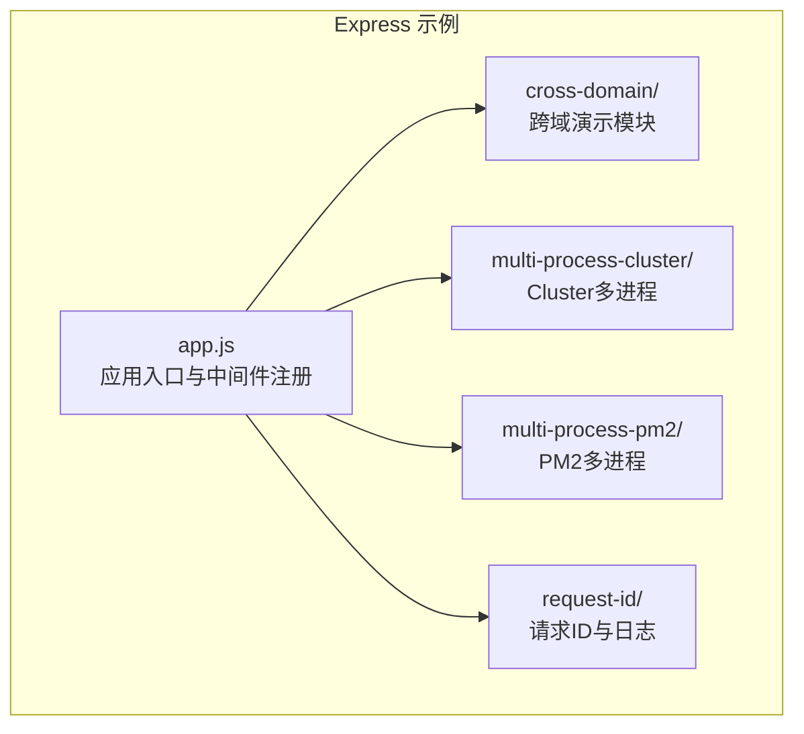
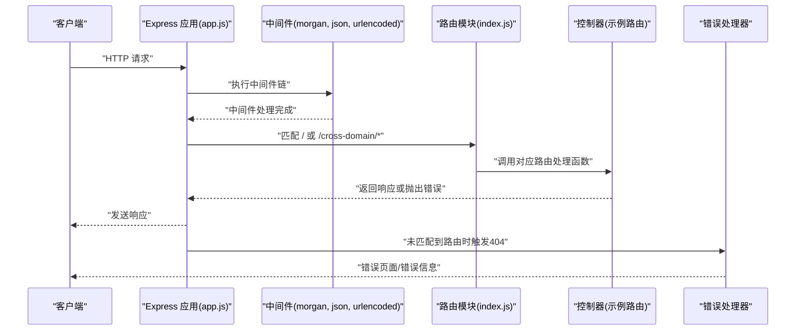
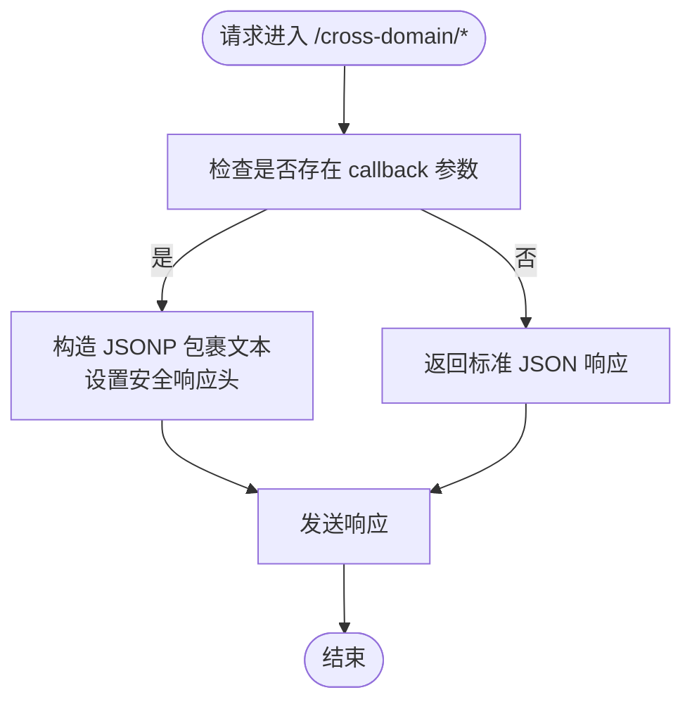
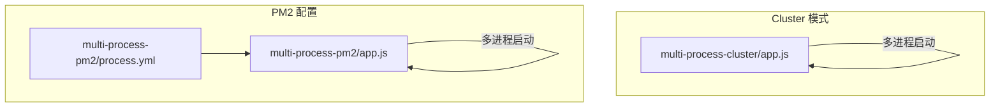
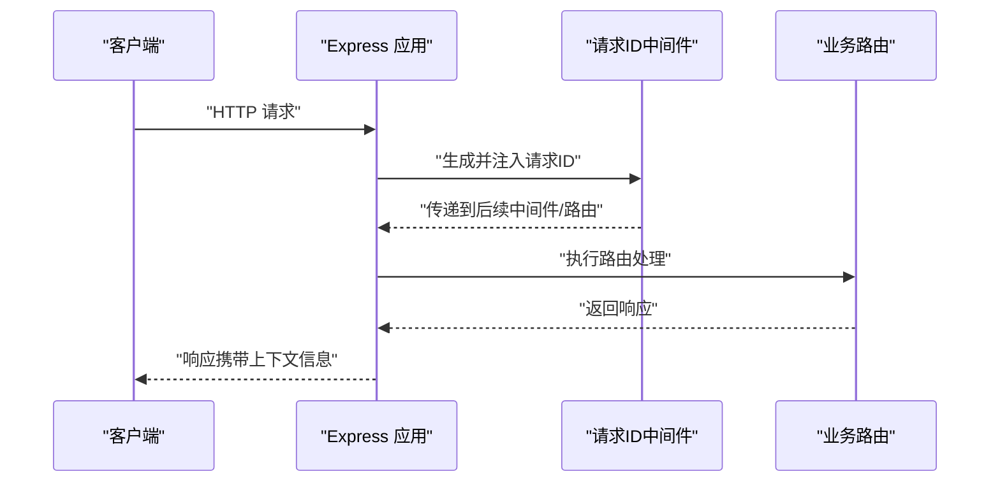
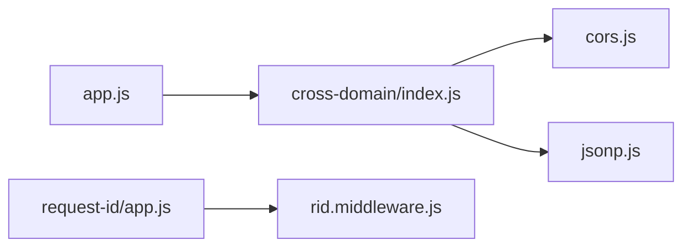

# Express服务

<cite>
**本文引用的文件**
- [practice/nodejs-service/express/cross-domain/app.js](file://practice/nodejs-service/express/cross-domain/app.js)
- [practice/nodejs-service/express/cross-domain/cross-domain/index.js](file://practice/nodejs-service/express/cross-domain/cross-domain/index.js)
- [practice/nodejs-service/express/cross-domain/cross-domain/cors.js](file://practice/nodejs-service/express/cross-domain/cross-domain/cors.js)
- [practice/nodejs-service/express/cross-domain/cross-domain/jsonp.js](file://practice/nodejs-service/express/cross-domain/cross-domain/jsonp.js)
- [practice/nodejs-service/express/multi-process-cluster/app.js](file://practice/nodejs-service/express/multi-process-cluster/app.js)
- [practice/nodejs-service/express/multi-process-pm2/app.js](file://practice/nodejs-service/express/multi-process-pm2/app.js)
- [practice/nodejs-service/express/multi-process-pm2/process.yml](file://practice/nodejs-service/express/multi-process-pm2/process.yml)
- [practice/nodejs-service/express/request-id/app.js](file://practice/nodejs-service/express/request-id/app.js)
- [practice/nodejs-service/express/request-id/middleware/rid.middleware.js](file://practice/nodejs-service/express/request-id/middleware/rid.middleware.js)
</cite>

## 目录
1. [简介](#简介)
2. [项目结构](#项目结构)
3. [核心组件](#核心组件)
4. [架构总览](#架构总览)
5. [详细组件分析](#详细组件分析)
6. [依赖关系分析](#依赖关系分析)
7. [性能考量](#性能考量)
8. [故障排查指南](#故障排查指南)
9. [结论](#结论)
10. [附录](#附录)

## 简介
本文件面向希望系统掌握Express轻量级Web框架的开发者，围绕以下主题展开：项目初始化与基础中间件、路由组织与模块化、错误处理机制、跨域处理（CORS与JSONP）、多进程部署（Cluster模式与PM2）以及请求处理流程、静态资源服务与日志记录等实用能力。通过结合仓库中的Express示例工程，给出可直接参考的实现路径与最佳实践。

## 项目结构
该仓库中与Express相关的核心目录位于 practice/nodejs-service/express 下，按功能划分为：
- 跨域演示：cross-domain
- 多进程Cluster演示：multi-process-cluster
- 多进程PM2演示：multi-process-pm2
- 请求ID与日志：request-id

下面给出一个概念性的项目结构图，帮助理解模块划分与职责边界：

[本图为概念示意，不对应具体源码文件映射，故无“图表来源”]

## 核心组件
- 应用入口与中间件
  - 初始化Express实例，注册通用中间件（日志、JSON解析、URL编码解析），并挂载路由。
  - 参考：[app.js:1-41](file://practice/nodejs-service/express/cross-domain/app.js#L1-L41)
- 路由模块化
  - 将跨域相关路由拆分到独立模块，便于复用与维护。
  - 参考：[cross-domain/index.js:1-22](file://practice/nodejs-service/express/cross-domain/cross-domain/index.js#L1-L22)
- 错误处理
  - 统一捕获404与异常，设置响应状态与视图渲染。
  - 参考：[app.js:24-38](file://practice/nodejs-service/express/cross-domain/app.js#L24-L38)

**章节来源**
- [practice/nodejs-service/express/cross-domain/app.js:1-41](file://practice/nodejs-service/express/cross-domain/app.js#L1-L41)
- [practice/nodejs-service/express/cross-domain/cross-domain/index.js:1-22](file://practice/nodejs-service/express/cross-domain/cross-domain/index.js#L1-L22)

## 架构总览
下图展示了Express应用从请求进入、中间件链路、路由匹配到错误处理的整体流程，并标注了关键文件位置，便于定位实现细节。

**图表来源**
- [practice/nodejs-service/express/cross-domain/app.js:1-41](file://practice/nodejs-service/express/cross-domain/app.js#L1-L41)
- [practice/nodejs-service/express/cross-domain/cross-domain/index.js:1-22](file://practice/nodejs-service/express/cross-domain/cross-domain/index.js#L1-L22)

**章节来源**
- [practice/nodejs-service/express/cross-domain/app.js:1-41](file://practice/nodejs-service/express/cross-domain/app.js#L1-L41)
- [practice/nodejs-service/express/cross-domain/cross-domain/index.js:1-22](file://practice/nodejs-service/express/cross-domain/cross-domain/index.js#L1-L22)

## 详细组件分析

### 跨域处理：CORS与JSONP
- CORS
  - 使用cors中间件对单个路由启用跨域，支持灵活配置项。
  - 参考：[cors.js:1-16](file://practice/nodejs-service/express/cross-domain/cross-domain/cors.js#L1-L16)
- JSONP
  - 手写JSONP逻辑：当存在callback参数时，返回包裹回调的文本；否则返回标准JSON。
  - 另提供Express内置json方法支持的便捷接口。
  - 参考：[jsonp.js:1-24](file://practice/nodejs-service/express/cross-domain/cross-domain/jsonp.js#L1-L24)
- 路由聚合
  - 在统一的路由器中注册CORS与JSONP路由，并导出供应用挂载。
  - 参考：[cross-domain/index.js:1-22](file://practice/nodejs-service/express/cross-domain/cross-domain/index.js#L1-L22)

**图表来源**
- [practice/nodejs-service/express/cross-domain/cross-domain/jsonp.js:1-24](file://practice/nodejs-service/express/cross-domain/cross-domain/jsonp.js#L1-L24)

**章节来源**
- [practice/nodejs-service/express/cross-domain/cross-domain/cors.js:1-16](file://practice/nodejs-service/express/cross-domain/cross-domain/cors.js#L1-L16)
- [practice/nodejs-service/express/cross-domain/cross-domain/jsonp.js:1-24](file://practice/nodejs-service/express/cross-domain/cross-domain/jsonp.js#L1-L24)
- [practice/nodejs-service/express/cross-domain/cross-domain/index.js:1-22](file://practice/nodejs-service/express/cross-domain/cross-domain/index.js#L1-L22)

### 多进程部署：Cluster模式与PM2
- Cluster模式
  - 在应用入口处直接使用Node集群能力，启动多个工作进程。
  - 参考：[multi-process-cluster/app.js:1-39](file://practice/nodejs-service/express/multi-process-cluster/app.js#L1-L39)
- PM2
  - 通过配置文件定义应用名称、脚本、集群模式与实例数，实现进程管理与自动重启。
  - 参考：[multi-process-pm2/process.yml:1-9](file://practice/nodejs-service/express/multi-process-pm2/process.yml#L1-L9)
  - 应用入口与Cluster模式类似，负责中间件与路由注册。
  - 参考：[multi-process-pm2/app.js:1-39](file://practice/nodejs-service/express/multi-process-pm2/app.js#L1-L39)

**图表来源**
- [practice/nodejs-service/express/multi-process-cluster/app.js:1-39](file://practice/nodejs-service/express/multi-process-cluster/app.js#L1-L39)
- [practice/nodejs-service/express/multi-process-pm2/process.yml:1-9](file://practice/nodejs-service/express/multi-process-pm2/process.yml#L1-L9)
- [practice/nodejs-service/express/multi-process-pm2/app.js:1-39](file://practice/nodejs-service/express/multi-process-pm2/app.js#L1-L39)

**章节来源**
- [practice/nodejs-service/express/multi-process-cluster/app.js:1-39](file://practice/nodejs-service/express/multi-process-cluster/app.js#L1-L39)
- [practice/nodejs-service/express/multi-process-pm2/process.yml:1-9](file://practice/nodejs-service/express/multi-process-pm2/process.yml#L1-L9)
- [practice/nodejs-service/express/multi-process-pm2/app.js:1-39](file://practice/nodejs-service/express/multi-process-pm2/app.js#L1-L39)

### 请求ID与日志：基于CLS的请求上下文
- 中间件
  - 使用cls-hooked在每个请求上下文中生成唯一请求ID，并提供get/set访问器。
  - 参考：[rid.middleware.js:1-35](file://practice/nodejs-service/express/request-id/middleware/rid.middleware.js#L1-L35)
- 应用
  - 在应用中注册中间件，随后在路由中打印请求ID，便于日志追踪。
  - 参考：[request-id/app.js:1-45](file://practice/nodejs-service/express/request-id/app.js#L1-L45)

**图表来源**
- [practice/nodejs-service/express/request-id/middleware/rid.middleware.js:1-35](file://practice/nodejs-service/express/request-id/middleware/rid.middleware.js#L1-L35)
- [practice/nodejs-service/express/request-id/app.js:1-45](file://practice/nodejs-service/express/request-id/app.js#L1-L45)

**章节来源**
- [practice/nodejs-service/express/request-id/middleware/rid.middleware.js:1-35](file://practice/nodejs-service/express/request-id/middleware/rid.middleware.js#L1-L35)
- [practice/nodejs-service/express/request-id/app.js:1-45](file://practice/nodejs-service/express/request-id/app.js#L1-L45)

## 依赖关系分析
- 组件耦合
  - 应用入口仅通过模块导出挂载路由模块，降低耦合度，提升可测试性。
  - 跨域模块内部通过函数封装路由绑定，便于按需启用。
- 外部依赖
  - 日志：morgan
  - 跨域：cors
  - 请求上下文：cls-hooked
- 关键导入关系如下所示：

**图表来源**
- [practice/nodejs-service/express/cross-domain/app.js:1-41](file://practice/nodejs-service/express/cross-domain/app.js#L1-L41)
- [practice/nodejs-service/express/cross-domain/cross-domain/index.js:1-22](file://practice/nodejs-service/express/cross-domain/cross-domain/index.js#L1-L22)
- [practice/nodejs-service/express/cross-domain/cross-domain/cors.js:1-16](file://practice/nodejs-service/express/cross-domain/cross-domain/cors.js#L1-L16)
- [practice/nodejs-service/express/cross-domain/cross-domain/jsonp.js:1-24](file://practice/nodejs-service/express/cross-domain/cross-domain/jsonp.js#L1-L24)
- [practice/nodejs-service/express/request-id/app.js:1-45](file://practice/nodejs-service/express/request-id/app.js#L1-L45)
- [practice/nodejs-service/express/request-id/middleware/rid.middleware.js:1-35](file://practice/nodejs-service/express/request-id/middleware/rid.middleware.js#L1-L35)

**章节来源**
- [practice/nodejs-service/express/cross-domain/app.js:1-41](file://practice/nodejs-service/express/cross-domain/app.js#L1-L41)
- [practice/nodejs-service/express/cross-domain/cross-domain/index.js:1-22](file://practice/nodejs-service/express/cross-domain/cross-domain/index.js#L1-L22)
- [practice/nodejs-service/express/cross-domain/cross-domain/cors.js:1-16](file://practice/nodejs-service/express/cross-domain/cross-domain/cors.js#L1-L16)
- [practice/nodejs-service/express/cross-domain/cross-domain/jsonp.js:1-24](file://practice/nodejs-service/express/cross-domain/cross-domain/jsonp.js#L1-L24)
- [practice/nodejs-service/express/request-id/app.js:1-45](file://practice/nodejs-service/express/request-id/app.js#L1-L45)
- [practice/nodejs-service/express/request-id/middleware/rid.middleware.js:1-35](file://practice/nodejs-service/express/request-id/middleware/rid.middleware.js#L1-L35)

## 性能考量
- 中间件顺序
  - 将耗时操作（如日志、解析）置于路由之前，避免重复处理。
- 路由粒度
  - 将跨域等特性拆分为独立模块，按需启用，减少主应用负担。
- 多进程策略
  - Cluster模式适合快速启动多进程，PM2提供更完善的进程管理与监控能力。
  - 实例数量建议根据CPU核数与业务特征调整，避免过度并发导致上下文切换开销增大。
- 静态资源
  - 对于高并发静态资源，建议交由反向代理或CDN处理，Express仅处理动态请求。

[本节为通用指导，无需“章节来源”]

## 故障排查指南
- 404未匹配路由
  - 应用中统一捕获并转发至错误处理器，确保返回一致的错误页面或结构化错误。
  - 参考：[app.js:24-38](file://practice/nodejs-service/express/cross-domain/app.js#L24-L38)
- 跨域问题
  - CORS：确认目标路由已正确挂载cors中间件，必要时补充允许的方法、头部与凭据。
  - JSONP：确保callback参数存在且符合预期，注意安全头设置与内容类型。
  - 参考：[cors.js:1-16](file://practice/nodejs-service/express/cross-domain/cross-domain/cors.js#L1-L16)、[jsonp.js:1-24](file://practice/nodejs-service/express/cross-domain/cross-domain/jsonp.js#L1-L24)
- 请求ID缺失
  - 确认中间件已在应用中注册，且在路由中正确获取。
  - 参考：[rid.middleware.js:1-35](file://practice/nodejs-service/express/request-id/middleware/rid.middleware.js#L1-L35)、[request-id/app.js:1-45](file://practice/nodejs-service/express/request-id/app.js#L1-L45)

**章节来源**
- [practice/nodejs-service/express/cross-domain/app.js:24-38](file://practice/nodejs-service/express/cross-domain/app.js#L24-L38)
- [practice/nodejs-service/express/cross-domain/cross-domain/cors.js:1-16](file://practice/nodejs-service/express/cross-domain/cross-domain/cors.js#L1-L16)
- [practice/nodejs-service/express/cross-domain/cross-domain/jsonp.js:1-24](file://practice/nodejs-service/express/cross-domain/cross-domain/jsonp.js#L1-L24)
- [practice/nodejs-service/express/request-id/middleware/rid.middleware.js:1-35](file://practice/nodejs-service/express/request-id/middleware/rid.middleware.js#L1-L35)
- [practice/nodejs-service/express/request-id/app.js:1-45](file://practice/nodejs-service/express/request-id/app.js#L1-L45)

## 结论
本项目以模块化方式展示了Express在实际工程中的常见用法：中间件链、路由拆分、错误处理、跨域与多进程部署。通过将跨域处理与请求ID中间件独立封装，既保证了灵活性也提升了可维护性。结合Cluster与PM2两种部署方案，可在开发与生产环境中按需选择，兼顾性能与稳定性。

[本节为总结性内容，无需“章节来源”]

## 附录
- 快速上手清单
  - 安装依赖后，分别运行各示例目录下的启动脚本或命令。
  - 访问根路径与跨域相关路由，验证日志输出与响应结果。
- 最佳实践
  - 将公共中间件前置，路由按功能拆分模块，错误处理集中化。
  - 跨域优先考虑CORS，JSONP仅用于兼容旧环境。
  - 生产环境建议配合PM2进行进程管理与健康监控。

[本节为通用指导，无需“章节来源”]