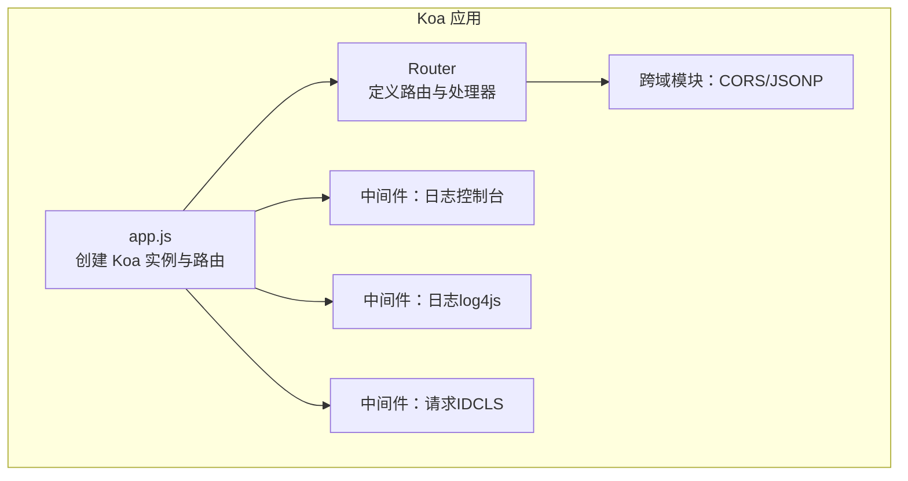
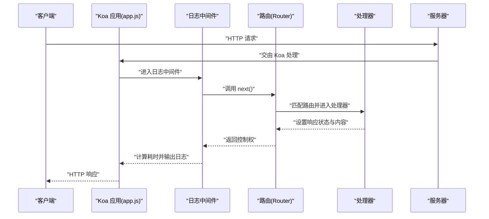
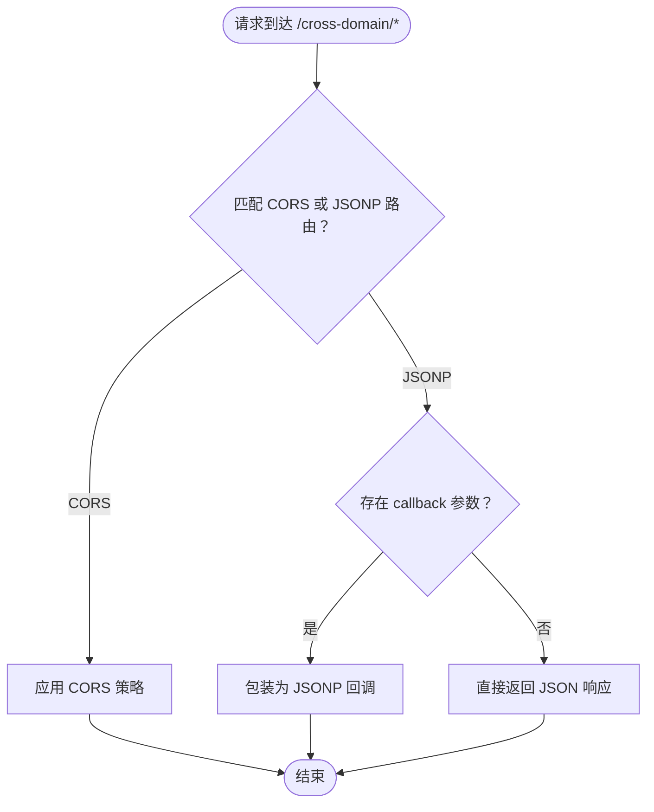
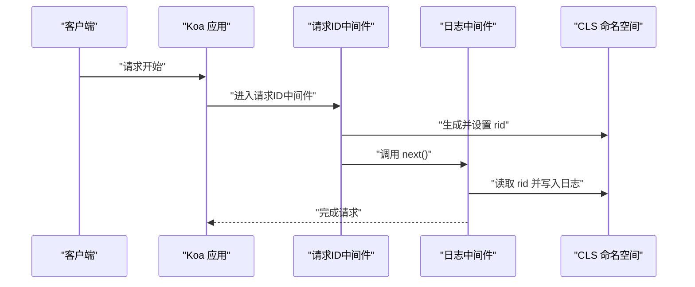
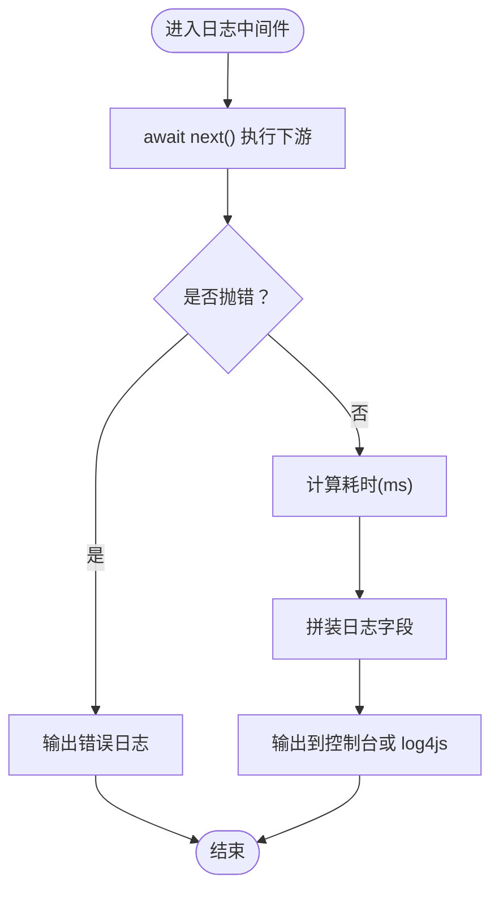
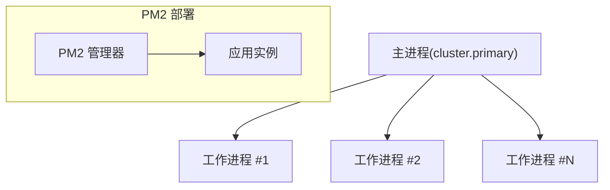
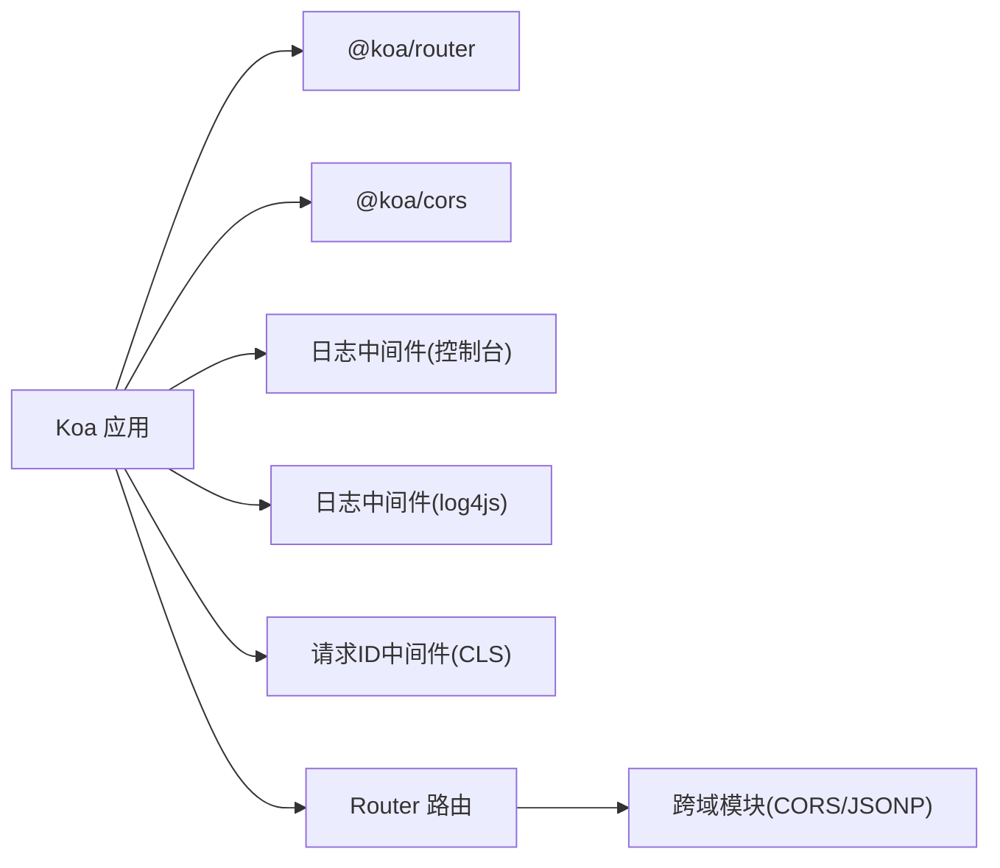

# Koa服务

<cite>
**本文引用的文件**
- [practice/nodejs-service/koa/cross-domain/app.js](file://practice/nodejs-service/koa/cross-domain/app.js)
- [practice/nodejs-service/koa/cross-domain/cross-domain/index.js](file://practice/nodejs-service/koa/cross-domain/cross-domain/index.js)
- [practice/nodejs-service/koa/cross-domain/cross-domain/cors.js](file://practice/nodejs-service/koa/cross-domain/cross-domain/cors.js)
- [practice/nodejs-service/koa/cross-domain/cross-domain/jsonp.js](file://practice/nodejs-service/koa/cross-domain/cross-domain/jsonp.js)
- [practice/nodejs-service/koa/multi-process-cluster/app.js](file://practice/nodejs-service/koa/multi-process-cluster/app.js)
- [practice/nodejs-service/koa/multi-process-cluster/multi-process.js](file://practice/nodejs-service/koa/multi-process-cluster/multi-process.js)
- [practice/nodejs-service/koa/request-id/middleware/rid.middleware.js](file://practice/nodejs-service/koa/request-id/middleware/rid.middleware.js)
- [practice/nodejs-service/koa/request-log-console/middleware/console.middleware.js](file://practice/nodejs-service/koa/request-log-console/middleware/console.middleware.js)
- [practice/nodejs-service/koa/request-log-log4js/middleware/log4js.middleware.js](file://practice/nodejs-service/koa/request-log-log4js/middleware/log4js.middleware.js)
- [practice/nodejs-service/koa/template-ts/src/app.ts](file://practice/nodejs-service/koa/template-ts/src/app.ts)
</cite>

## 目录
1. [引言](#引言)
2. [项目结构](#项目结构)
3. [核心组件](#核心组件)
4. [架构总览](#架构总览)
5. [详细组件分析](#详细组件分析)
6. [依赖关系分析](#依赖关系分析)
7. [性能考量](#性能考量)
8. [故障排查指南](#故障排查指南)
9. [结论](#结论)
10. [附录](#附录)

## 引言
本文件面向希望系统性掌握基于 Koa 的服务开发与运维的工程师，围绕以下目标展开：  
- 深入阐述 Koa 作为“下一代 Web 框架”的设计哲学与异步中间件机制；  
- 解析 Koa 核心概念（上下文、请求、响应、中间件链式调用）；  
- 对比传统回调模式，说明异步中间件在可读性、可维护性与错误传播方面的优势；  
- 提供跨域处理、请求 ID 追踪、日志记录等中间件实现示例路径；  
- 介绍多进程部署策略与性能优化技巧；  
- 给出与 Express 的对比分析，辅助决策何时选择 Koa；  
- 提供从开发到部署的完整实践指南。

## 项目结构
该仓库以“按功能域分层”的方式组织 Koa 示例工程，每个子目录聚焦一个主题（如跨域、请求 ID、日志、多进程、模板），便于快速定位与复用。  
- 跨域示例：提供路由级 CORS 与 JSONP 的绑定与使用；  
- 多进程示例：演示原生 cluster 与 PM2 部署两种策略；  
- 请求追踪：通过 CLS 在上下文中注入并传递请求 ID；  
- 日志记录：提供控制台与 log4js 两种中间件实现；  
- 模板工程：包含 JavaScript 与 TypeScript 两套最小可运行模板。

图表来源
- [practice/nodejs-service/koa/cross-domain/app.js:1-69](file://practice/nodejs-service/koa/cross-domain/app.js#L1-L69)
- [practice/nodejs-service/koa/cross-domain/cross-domain/index.js:1-22](file://practice/nodejs-service/koa/cross-domain/cross-domain/index.js#L1-L22)

章节来源
- [practice/nodejs-service/koa/cross-domain/app.js:1-69](file://practice/nodejs-service/koa/cross-domain/app.js#L1-L69)
- [practice/nodejs-service/koa/cross-domain/cross-domain/index.js:1-22](file://practice/nodejs-service/koa/cross-domain/cross-domain/index.js#L1-L22)

## 核心组件
- 上下文（Context）：封装请求与响应对象，提供统一的 API 访问入口，贯穿中间件链；  
- 请求（Request）：对底层 HTTP 请求进行抽象，提供方法、URL、头信息、查询参数等便捷访问；  
- 响应（Response）：对底层 HTTP 响应进行抽象，提供状态码、头设置、内容类型与主体写入等能力；  
- 中间件（Middleware）：函数式洋葱模型，支持异步 next() 调用，实现横切关注点（如日志、鉴权、跨域）。  

Koa 的异步中间件优势体现在：
- 明确的错误传播：await next() 后的异常可在当前中间件捕获，便于统一处理；  
- 更清晰的执行顺序：先入后出的洋葱模型使前置与后置逻辑天然对称；  
- 与现代异步语法契合：async/await 降低心智负担，提升可读性与可维护性。

章节来源
- [practice/nodejs-service/koa/cross-domain/app.js:15-23](file://practice/nodejs-service/koa/cross-domain/app.js#L15-L23)
- [practice/nodejs-service/koa/request-log-console/middleware/console.middleware.js:28-60](file://practice/nodejs-service/koa/request-log-console/middleware/console.middleware.js#L28-L60)

## 架构总览
下图展示了一个典型 Koa 应用的启动与请求处理流程：  
- 应用初始化：创建 Koa 实例、注册中间件、挂载路由；  
- 请求到来：按中间件注册顺序进入，执行 next() 切换至下一个中间件；  
- 路由匹配：Router 根据路径与方法分发到对应处理器；  
- 响应回传：处理器设置状态码与 body，中间件链回溯输出日志与统计信息。

图表来源
- [practice/nodejs-service/koa/cross-domain/app.js:15-38](file://practice/nodejs-service/koa/cross-domain/app.js#L15-L38)
- [practice/nodejs-service/koa/request-log-console/middleware/console.middleware.js:28-60](file://practice/nodejs-service/koa/request-log-console/middleware/console.middleware.js#L28-L60)

## 详细组件分析

### 跨域处理（CORS 与 JSONP）
- CORS：通过路由级绑定，为特定路由启用跨域策略；  
- JSONP：根据查询参数 callback 动态包装响应，设置安全头与内容类型。

图表来源
- [practice/nodejs-service/koa/cross-domain/cross-domain/index.js:1-22](file://practice/nodejs-service/koa/cross-domain/cross-domain/index.js#L1-L22)
- [practice/nodejs-service/koa/cross-domain/cross-domain/cors.js:1-14](file://practice/nodejs-service/koa/cross-domain/cross-domain/cors.js#L1-L14)
- [practice/nodejs-service/koa/cross-domain/cross-domain/jsonp.js:1-26](file://practice/nodejs-service/koa/cross-domain/cross-domain/jsonp.js#L1-L26)

章节来源
- [practice/nodejs-service/koa/cross-domain/cross-domain/index.js:1-22](file://practice/nodejs-service/koa/cross-domain/cross-domain/index.js#L1-L22)
- [practice/nodejs-service/koa/cross-domain/cross-domain/cors.js:1-14](file://practice/nodejs-service/koa/cross-domain/cross-domain/cors.js#L1-L14)
- [practice/nodejs-service/koa/cross-domain/cross-domain/jsonp.js:1-26](file://practice/nodejs-service/koa/cross-domain/cross-domain/jsonp.js#L1-L26)

### 请求 ID 追踪（基于 CLS）
- 使用 CLS 命名空间在请求生命周期内存储唯一标识；  
- 中间件在进入时生成并注入 rid，后续中间件与业务逻辑可读取该值用于日志关联。

图表来源
- [practice/nodejs-service/koa/request-id/middleware/rid.middleware.js:14-28](file://practice/nodejs-service/koa/request-id/middleware/rid.middleware.js#L14-L28)

章节来源
- [practice/nodejs-service/koa/request-id/middleware/rid.middleware.js:1-35](file://practice/nodejs-service/koa/request-id/middleware/rid.middleware.js#L1-L35)

### 日志记录（控制台与 log4js）
- 控制台中间件：在 next() 前后记录时间戳、耗时、状态码、长度、UA 等；  
- log4js 中间件：通过 connectLogger 输出结构化日志，支持自定义格式与上下文 token。

图表来源
- [practice/nodejs-service/koa/request-log-console/middleware/console.middleware.js:28-60](file://practice/nodejs-service/koa/request-log-console/middleware/console.middleware.js#L28-L60)
- [practice/nodejs-service/koa/request-log-log4js/middleware/log4js.middleware.js:22-38](file://practice/nodejs-service/koa/request-log-log4js/middleware/log4js.middleware.js#L22-L38)

章节来源
- [practice/nodejs-service/koa/request-log-console/middleware/console.middleware.js:1-61](file://practice/nodejs-service/koa/request-log-console/middleware/console.middleware.js#L1-L61)
- [practice/nodejs-service/koa/request-log-log4js/middleware/log4js.middleware.js:1-39](file://practice/nodejs-service/koa/request-log-log4js/middleware/log4js.middleware.js#L1-L39)

### 多进程部署策略
- 原生 cluster：主进程 fork 工作进程，自动监听 CPU 数量，处理在线与退出事件；  
- PM2：通过配置文件管理进程数量、重启策略与日志聚合，适合生产环境。

图表来源
- [practice/nodejs-service/koa/multi-process-cluster/multi-process.js:6-25](file://practice/nodejs-service/koa/multi-process-cluster/multi-process.js#L6-L25)

章节来源
- [practice/nodejs-service/koa/multi-process-cluster/app.js:1-65](file://practice/nodejs-service/koa/multi-process-cluster/app.js#L1-L65)
- [practice/nodejs-service/koa/multi-process-cluster/multi-process.js:1-26](file://practice/nodejs-service/koa/multi-process-cluster/multi-process.js#L1-L26)

### 模板工程（JavaScript 与 TypeScript）
- JavaScript 模板：最小化示例，演示 Koa 初始化、路由与监听端口；  
- TypeScript 模板：同构逻辑，类型安全增强，适合大型团队协作。

章节来源
- [practice/nodejs-service/koa/cross-domain/app.js:1-69](file://practice/nodejs-service/koa/cross-domain/app.js#L1-L69)
- [practice/nodejs-service/koa/template-ts/src/app.ts:1-66](file://practice/nodejs-service/koa/template-ts/src/app.ts#L1-L66)

## 依赖关系分析
- 应用层依赖：Koa、@koa/router、@koa/cors；  
- 跨域模块：将 CORS 与 JSONP 绑定到统一 Router，便于按需启用；  
- 中间件层：日志与请求 ID 通过 app.use 注册，形成洋葱模型；  
- 部署层：cluster 与 PM2 作为进程管理方案，提升可用性与吞吐。

图表来源
- [practice/nodejs-service/koa/cross-domain/app.js:9-11](file://practice/nodejs-service/koa/cross-domain/app.js#L9-L11)
- [practice/nodejs-service/koa/cross-domain/cross-domain/cors.js:1](file://practice/nodejs-service/koa/cross-domain/cross-domain/cors.js#L1)
- [practice/nodejs-service/koa/request-log-console/middleware/console.middleware.js:28](file://practice/nodejs-service/koa/request-log-console/middleware/console.middleware.js#L28)
- [practice/nodejs-service/koa/request-log-log4js/middleware/log4js.middleware.js:22](file://practice/nodejs-service/koa/request-log-log4js/middleware/log4js.middleware.js#L22)
- [practice/nodejs-service/koa/request-id/middleware/rid.middleware.js:22](file://practice/nodejs-service/koa/request-id/middleware/rid.middleware.js#L22)

章节来源
- [practice/nodejs-service/koa/cross-domain/app.js:1-69](file://practice/nodejs-service/koa/cross-domain/app.js#L1-L69)
- [practice/nodejs-service/koa/cross-domain/cross-domain/index.js:1-22](file://practice/nodejs-service/koa/cross-domain/cross-domain/index.js#L1-L22)

## 性能考量
- 中间件顺序与职责：将耗时操作（如 IO、鉴权）置于靠前位置，避免阻塞后续中间件；  
- 异步链路优化：减少不必要的 await next() 层级，避免深层嵌套；  
- 日志开销：控制台输出在高并发场景建议降级为采样或使用结构化日志（如 log4js）；  
- 多进程：结合 cluster 或 PM2，充分利用多核 CPU；  
- 资源释放：确保静态资源读取与流式响应正确关闭句柄。

## 故障排查指南
- 端口占用与权限：监听错误时区分 EACCES 与 EADDRINUSE，分别处理提权与端口冲突；  
- 路由未命中：检查路由注册顺序与 allowedMethods 是否生效；  
- 跨域失败：确认 CORS 配置项与预检请求处理；  
- 日志缺失：确认中间件注册顺序与 next() 调用；  
- 请求 ID 不见：检查 CLS 命名空间是否在同一作用域内读取。

章节来源
- [practice/nodejs-service/koa/cross-domain/app.js:43-62](file://practice/nodejs-service/koa/cross-domain/app.js#L43-L62)
- [practice/nodejs-service/koa/multi-process-cluster/app.js:39-58](file://practice/nodejs-service/koa/multi-process-cluster/app.js#L39-L58)

## 结论
Koa 以简洁优雅的 API 与强大的中间件生态，为构建现代化 Node.js 服务提供了坚实基础。通过合理的中间件设计、跨域与日志策略以及多进程部署，可以在保证开发效率的同时获得稳定的运行表现。对于需要更强生态与约定式脚手架的项目，可考虑 Express；而对于追求更佳异步体验与可组合性的场景，Koa 是更优选择。

## 附录
- 开发与调试：使用模板工程快速启动，逐步引入中间件与路由；  
- 部署建议：生产环境优先采用 PM2，辅以健康检查与日志聚合；  
- 规范建议：统一中间件命名与错误处理，明确职责边界，避免“上帝对象”。