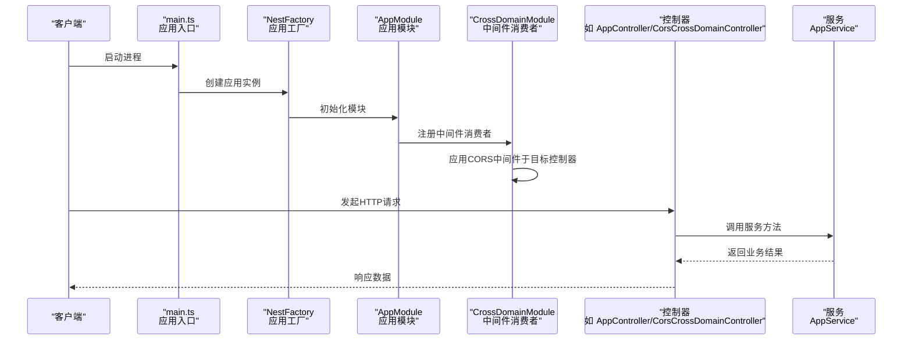
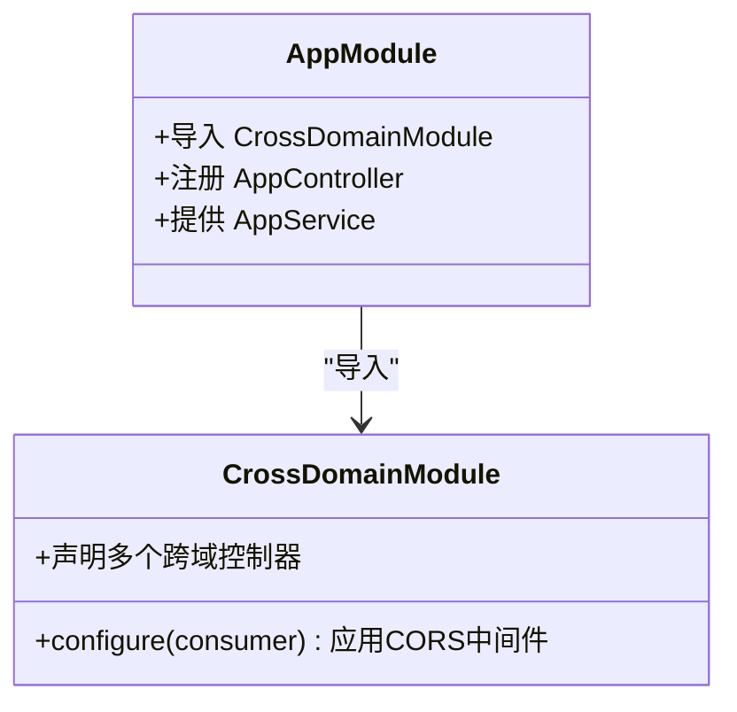
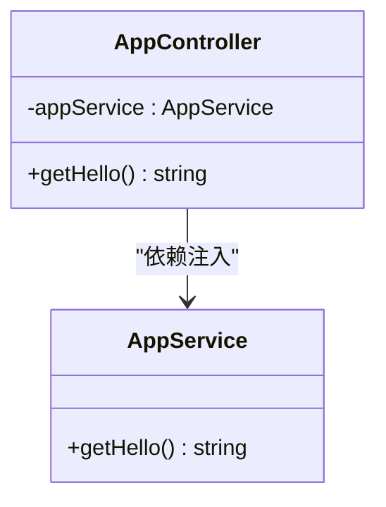
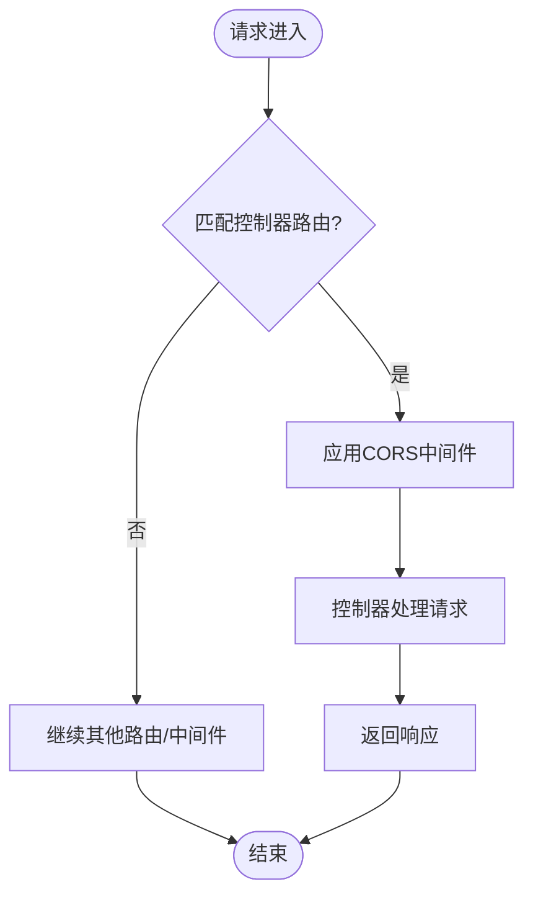
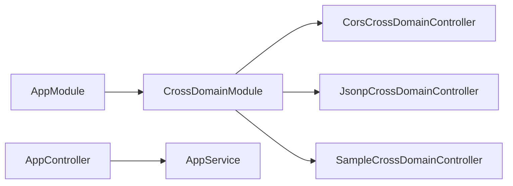

# NestJS服务

<cite>
**本文引用的文件**
- [practice/nodejs-service/nest/cross-domain/src/main.ts](file://practice/nodejs-service/nest/cross-domain/src/main.ts)
- [practice/nodejs-service/nest/cross-domain/src/app.module.ts](file://practice/nodejs-service/nest/cross-domain/src/app.module.ts)
- [practice/nodejs-service/nest/cross-domain/src/app.controller.ts](file://practice/nodejs-service/nest/cross-domain/src/app.controller.ts)
- [practice/nodejs-service/nest/cross-domain/src/app.service.ts](file://practice/nodejs-service/nest/cross-domain/src/app.service.ts)
- [practice/nodejs-service/nest/cross-domain/src/cross-domain/cross-domain.module.ts](file://practice/nodejs-service/nest/cross-domain/src/cross-domain/cross-domain.module.ts)
- [practice/nodejs-service/nest/cross-domain/src/cross-domain/cors.cross-domain.controller.ts](file://practice/nodejs-service/nest/cross-domain/src/cross-domain/cors.cross-domain.controller.ts)
- [practice/nodejs-service/nest/cross-domain/src/cross-domain/jsonp.cross-domain.controller.ts](file://practice/nodejs-service/nest/cross-domain/src/cross-domain/jsonp.cross-domain.controller.ts)
- [practice/nodejs-service/nest/cross-domain/src/cross-domain/sample.cross-domain.controller.ts](file://practice/nodejs-service/nest/cross-domain/src/cross-domain/sample.cross-domain.controller.ts)
- [practice/nodejs-service/nest/cross-domain/package.json](file://practice/nodejs-service/nest/cross-domain/package.json)
- [practice/nodejs-service/nest/cross-domain/nest-cli.json](file://practice/nodejs-service/nest/cross-domain/nest-cli.json)
- [practice/nodejs-service/nest/request-id/src/main.ts](file://practice/nodejs-service/nest/request-id/src/main.ts)
- [practice/nodejs-service/nest/request-id/src/app.module.ts](file://practice/nodejs-service/nest/request-id/src/app.module.ts)
- [practice/nodejs-service/nest/request-id/src/app.controller.ts](file://practice/nodejs-service/nest/request-id/src/app.controller.ts)
- [practice/nodejs-service/nest/request-id/src/app.service.ts](file://practice/nodejs-service/nest/request-id/src/app.service.ts)
- [practice/nodejs-service/nest/request-id/src/middleware/rid.middleware.ts](file://practice/nodejs-service/nest/request-id/src/middleware/rid.middleware.ts)
- [practice/nodejs-service/nest/request-log-console/src/main.ts](file://practice/nodejs-service/nest/request-log-console/src/main.ts)
- [practice/nodejs-service/nest/request-log-console/src/app.module.ts](file://practice/nodejs-service/nest/request-log-console/src/app.module.ts)
- [practice/nodejs-service/nest/request-log-console/src/app.controller.ts](file://practice/nodejs-service/nest/request-log-console/src/app.controller.ts)
- [practice/nodejs-service/nest/request-log-console/src/app.service.ts](file://practice/nodejs-service/nest/request-log-console/src/app.service.ts)
- [practice/nodejs-service/nest/request-log-console/src/middleware/logger.middleware.ts](file://practice/nodejs-service/nest/request-log-console/src/middleware/logger.middleware.ts)
- [practice/nodejs-service/nest/request-log-console/src/middleware/console.logger.ts](file://practice/nodejs-service/nest/request-log-console/src/middleware/console.logger.ts)
</cite>

## 目录
1. 引言
2. 项目结构
3. 核心组件
4. 架构总览
5. 组件详解
6. 依赖关系分析
7. 性能考量
8. 故障排查指南
9. 结论
10. 附录

## 引言
本文件为NestJS服务的权威技术文档，围绕企业级TypeScript后端框架的设计理念与Angular风格架构展开，系统阐述模块化系统（Module）、依赖注入容器（Container）与装饰器（Decorators）三大核心，并深入解析控制器（Controller）、服务（Service）、模块（Module）之间的职责划分与协作关系。文档同时提供跨域处理、中间件集成、日志与请求ID等实际应用场景的实现路径，结合TypeScript类型安全优势与开发体验提升，给出与传统Node.js框架的对比与迁移建议，并提供可落地的项目结构规划与最佳实践。

## 项目结构
本仓库中与NestJS相关的服务示例位于 practice/nodejs-service/nest 目录下，包含以下典型子项目：
- cross-domain：演示跨域处理（CORS、JSONP）与静态资源托管
- request-id：演示请求ID中间件的集成与使用
- request-log-console：演示自定义日志中间件与控制台日志输出
- request-log-log4js：演示基于第三方日志库的日志中间件（在该仓库中以目录形式存在，但当前上下文未包含其具体实现文件）

各子项目均采用标准NestJS CLI生成的目录结构，包含 src、package.json、nest-cli.json 等关键配置文件，便于快速启动与构建。

```mermaid
graph TB
subgraph "NestJS 示例服务"
CD["cross-domain<br/>跨域与静态资源"]
RID["request-id<br/>请求ID中间件"]
RLC["request-log-console<br/>控制台日志中间件"]
end
CD --> |"使用"@nestjs/common/@nestjs/core|"应用入口 main.ts"
RID --> |"使用"@nestjs/common/@nestjs/core|"应用入口 main.ts"
RLC --> |"使用"@nestjs/common/@nestjs/core|"应用入口 main.ts"
subgraph "通用配置"
Pkg["package.json<br/>依赖与脚本"]
Cli["nest-cli.json<br/>编译与源码根目录"]
end
CD --- Pkg
RID --- Pkg
RLC --- Pkg
CD --- Cli
RID --- Cli
RLC --- Cli
```

图示来源
- [practice/nodejs-service/nest/cross-domain/src/main.ts:1-19](file://practice/nodejs-service/nest/cross-domain/src/main.ts#L1-L19)
- [practice/nodejs-service/nest/cross-domain/package.json:1-71](file://practice/nodejs-service/nest/cross-domain/package.json#L1-L71)
- [practice/nodejs-service/nest/cross-domain/nest-cli.json:1-9](file://practice/nodejs-service/nest/cross-domain/nest-cli.json#L1-L9)

章节来源
- [practice/nodejs-service/nest/cross-domain/src/main.ts:1-19](file://practice/nodejs-service/nest/cross-domain/src/main.ts#L1-L19)
- [practice/nodejs-service/nest/cross-domain/package.json:1-71](file://practice/nodejs-service/nest/cross-domain/package.json#L1-L71)
- [practice/nodejs-service/nest/cross-domain/nest-cli.json:1-9](file://practice/nodejs-service/nest/cross-domain/nest-cli.json#L1-L9)

## 核心组件
- 模块（Module）
  - 负责组织应用结构，声明控制器、服务与中间件，管理导入与导出。
  - 在 cross-domain 示例中，AppModule 导入 CrossDomainModule 并注册 AppController 与 AppService；CrossDomainModule 配置跨域中间件并声明多个跨域控制器。
- 控制器（Controller）
  - 处理HTTP请求，映射路由与方法，返回响应数据。
  - 示例控制器包括 AppController、CorsCrossDomainController、JsonpCrossDomainController、SampleCrossDomainController。
- 服务（Service）
  - 承载业务逻辑与数据访问，通过依赖注入在控制器中使用。
  - 示例服务 AppService 提供基础业务方法。
- 中间件（Middleware）
  - 在请求进入路由处理前执行，如跨域、请求ID、日志等。
  - CrossDomainModule 使用 MiddlewareConsumer 应用 cors 中间件到指定控制器；request-id 与 request-log-console 子项目分别提供自定义中间件实现。

章节来源
- [practice/nodejs-service/nest/cross-domain/src/app.module.ts:1-19](file://practice/nodejs-service/nest/cross-domain/src/app.module.ts#L1-L19)
- [practice/nodejs-service/nest/cross-domain/src/app.controller.ts:1-20](file://practice/nodejs-service/nest/cross-domain/src/app.controller.ts#L1-L20)
- [practice/nodejs-service/nest/cross-domain/src/app.service.ts:1-15](file://practice/nodejs-service/nest/cross-domain/src/app.service.ts#L1-L15)
- [practice/nodejs-service/nest/cross-domain/src/cross-domain/cross-domain.module.ts:1-25](file://practice/nodejs-service/nest/cross-domain/src/cross-domain/cross-domain.module.ts#L1-L25)
- [practice/nodejs-service/nest/cross-domain/src/cross-domain/cors.cross-domain.controller.ts:1-10](file://practice/nodejs-service/nest/cross-domain/src/cross-domain/cors.cross-domain.controller.ts#L1-L10)
- [practice/nodejs-service/nest/cross-domain/src/cross-domain/jsonp.cross-domain.controller.ts:1-26](file://practice/nodejs-service/nest/cross-domain/src/cross-domain/jsonp.cross-domain.controller.ts#L1-L26)
- [practice/nodejs-service/nest/cross-domain/src/cross-domain/sample.cross-domain.controller.ts:1-10](file://practice/nodejs-service/nest/cross-domain/src/cross-domain/sample.cross-domain.controller.ts#L1-L10)

## 架构总览
下图展示NestJS应用从入口到控制器与中间件的整体调用链路，体现模块装配、依赖注入与路由分发的关键流程。



图示来源
- [practice/nodejs-service/nest/cross-domain/src/main.ts:12-18](file://practice/nodejs-service/nest/cross-domain/src/main.ts#L12-L18)
- [practice/nodejs-service/nest/cross-domain/src/app.module.ts:13-18](file://practice/nodejs-service/nest/cross-domain/src/app.module.ts#L13-L18)
- [practice/nodejs-service/nest/cross-domain/src/cross-domain/cross-domain.module.ts:14-24](file://practice/nodejs-service/nest/cross-domain/src/cross-domain/cross-domain.module.ts#L14-L24)
- [practice/nodejs-service/nest/cross-domain/src/app.controller.ts:11-19](file://practice/nodejs-service/nest/cross-domain/src/app.controller.ts#L11-L19)
- [practice/nodejs-service/nest/cross-domain/src/app.service.ts:9-14](file://practice/nodejs-service/nest/cross-domain/src/app.service.ts#L9-L14)

## 组件详解

### 模块化系统（Module）
- 职责与边界
  - AppModule：声明导入 CrossDomainModule，注册 AppController 与 AppService，作为应用主模块。
  - CrossDomainModule：声明多个跨域控制器，通过 configure 方法在 MiddlewareConsumer 上应用 cors 中间件，限定作用范围至特定控制器。
- 设计要点
  - 将关注点分离到功能模块（如跨域模块），提升复用性与可维护性。
  - 使用 NestModule 接口显式配置中间件，确保中间件仅对目标控制器生效。



图示来源
- [practice/nodejs-service/nest/cross-domain/src/app.module.ts:13-18](file://practice/nodejs-service/nest/cross-domain/src/app.module.ts#L13-L18)
- [practice/nodejs-service/nest/cross-domain/src/cross-domain/cross-domain.module.ts:9-24](file://practice/nodejs-service/nest/cross-domain/src/cross-domain/cross-domain.module.ts#L9-L24)

章节来源
- [practice/nodejs-service/nest/cross-domain/src/app.module.ts:1-19](file://practice/nodejs-service/nest/cross-domain/src/app.module.ts#L1-L19)
- [practice/nodejs-service/nest/cross-domain/src/cross-domain/cross-domain.module.ts:1-25](file://practice/nodejs-service/nest/cross-domain/src/cross-domain/cross-domain.module.ts#L1-L25)

### 控制器与服务（Controller & Service）
- 职责划分
  - 控制器负责路由映射与请求处理，不直接承载复杂业务逻辑。
  - 服务封装业务规则与数据访问，通过构造函数注入到控制器中。
- 典型实现
  - AppController 通过注入 AppService 返回问候信息。
  - 跨域控制器分别演示CORS与JSONP两种跨域方案。



图示来源
- [practice/nodejs-service/nest/cross-domain/src/app.controller.ts:11-19](file://practice/nodejs-service/nest/cross-domain/src/app.controller.ts#L11-L19)
- [practice/nodejs-service/nest/cross-domain/src/app.service.ts:9-14](file://practice/nodejs-service/nest/cross-domain/src/app.service.ts#L9-L14)

章节来源
- [practice/nodejs-service/nest/cross-domain/src/app.controller.ts:1-20](file://practice/nodejs-service/nest/cross-domain/src/app.controller.ts#L1-L20)
- [practice/nodejs-service/nest/cross-domain/src/app.service.ts:1-15](file://practice/nodejs-service/nest/cross-domain/src/app.service.ts#L1-L15)

### 跨域处理（CORS 与 JSONP）
- CORS
  - 在 CrossDomainModule 的 configure 中应用 cors 中间件，并限定作用于 CorsCrossDomainController。
  - 可通过配置对象扩展允许来源、方法、头等选项。
- JSONP
  - JsonpCrossDomainController 支持通过回调参数返回JSONP响应，或使用框架内置的 JSONP 支持。
  - 注意设置 Content-Type 与安全头，避免内容类型嗅探风险。



图示来源
- [practice/nodejs-service/nest/cross-domain/src/cross-domain/cross-domain.module.ts:15-23](file://practice/nodejs-service/nest/cross-domain/src/cross-domain/cross-domain.module.ts#L15-L23)
- [practice/nodejs-service/nest/cross-domain/src/cross-domain/cors.cross-domain.controller.ts:3-9](file://practice/nodejs-service/nest/cross-domain/src/cross-domain/cors.cross-domain.controller.ts#L3-L9)
- [practice/nodejs-service/nest/cross-domain/src/cross-domain/jsonp.cross-domain.controller.ts:6-24](file://practice/nodejs-service/nest/cross-domain/src/cross-domain/jsonp.cross-domain.controller.ts#L6-L24)

章节来源
- [practice/nodejs-service/nest/cross-domain/src/cross-domain/cross-domain.module.ts:1-25](file://practice/nodejs-service/nest/cross-domain/src/cross-domain/cross-domain.module.ts#L1-L25)
- [practice/nodejs-service/nest/cross-domain/src/cross-domain/cors.cross-domain.controller.ts:1-10](file://practice/nodejs-service/nest/cross-domain/src/cross-domain/cors.cross-domain.controller.ts#L1-L10)
- [practice/nodejs-service/nest/cross-domain/src/cross-domain/jsonp.cross-domain.controller.ts:1-26](file://practice/nodejs-service/nest/cross-domain/src/cross-domain/jsonp.cross-domain.controller.ts#L1-L26)

### 中间件集成（请求ID与日志）
- 请求ID中间件
  - 在 request-id 子项目中，通过自定义中间件为每个请求生成唯一标识，便于链路追踪与问题定位。
- 日志中间件
  - 在 request-log-console 子项目中，提供自定义日志中间件与控制台日志记录器，统一记录请求与响应信息。
- 实践建议
  - 中间件按需启用，避免对所有路由无差别应用造成性能开销。
  - 将敏感信息过滤与脱敏纳入中间件策略。

章节来源
- [practice/nodejs-service/nest/request-id/src/middleware/rid.middleware.ts](file://practice/nodejs-service/nest/request-id/src/middleware/rid.middleware.ts)
- [practice/nodejs-service/nest/request-log-console/src/middleware/logger.middleware.ts](file://practice/nodejs-service/nest/request-log-console/src/middleware/logger.middleware.ts)
- [practice/nodejs-service/nest/request-log-console/src/middleware/console.logger.ts](file://practice/nodejs-service/nest/request-log-console/src/middleware/console.logger.ts)

### 类型安全与开发体验
- TypeScript 类型系统
  - 通过强类型接口与泛型约束，减少运行时错误，提升重构安全性。
  - NestJS 装饰器与依赖注入配合TS类型，使IDE智能提示与自动补全更精准。
- 开发工具链
  - ESLint、Prettier、Jest 等工具贯穿开发、格式化与测试环节，保障代码质量与一致性。

章节来源
- [practice/nodejs-service/nest/cross-domain/package.json:30-52](file://practice/nodejs-service/nest/cross-domain/package.json#L30-L52)

## 依赖关系分析
- 内部依赖
  - AppModule 依赖 CrossDomainModule；CrossDomainModule 依赖多个跨域控制器。
  - 控制器依赖服务；服务不依赖控制器，保持单向依赖。
- 外部依赖
  - @nestjs/common、@nestjs/core、@nestjs/platform-express 提供核心能力。
  - cors 用于跨域中间件；reflect-metadata、rxjs 为运行时与响应式支持。
- 构建与运行
  - nest-cli.json 指定源码根目录与编译行为；package.json 定义脚本与测试配置。



图示来源
- [practice/nodejs-service/nest/cross-domain/src/app.module.ts:13-18](file://practice/nodejs-service/nest/cross-domain/src/app.module.ts#L13-L18)
- [practice/nodejs-service/nest/cross-domain/src/cross-domain/cross-domain.module.ts:9-13](file://practice/nodejs-service/nest/cross-domain/src/cross-domain/cross-domain.module.ts#L9-L13)
- [practice/nodejs-service/nest/cross-domain/src/app.controller.ts:11-13](file://practice/nodejs-service/nest/cross-domain/src/app.controller.ts#L11-L13)
- [practice/nodejs-service/nest/cross-domain/src/app.service.ts:9-10](file://practice/nodejs-service/nest/cross-domain/src/app.service.ts#L9-L10)

章节来源
- [practice/nodejs-service/nest/cross-domain/src/app.module.ts:1-19](file://practice/nodejs-service/nest/cross-domain/src/app.module.ts#L1-L19)
- [practice/nodejs-service/nest/cross-domain/src/cross-domain/cross-domain.module.ts:1-25](file://practice/nodejs-service/nest/cross-domain/src/cross-domain/cross-domain.module.ts#L1-L25)
- [practice/nodejs-service/nest/cross-domain/src/app.controller.ts:1-20](file://practice/nodejs-service/nest/cross-domain/src/app.controller.ts#L1-L20)
- [practice/nodejs-service/nest/cross-domain/src/app.service.ts:1-15](file://practice/nodejs-service/nest/cross-domain/src/app.service.ts#L1-L15)

## 性能考量
- 中间件作用范围
  - 仅对必要控制器应用中间件，避免全局中间件带来的额外开销。
- 静态资源托管
  - 将静态资源交由HTTP服务器或框架静态资源适配器处理，降低应用层压力。
- 依赖注入与生命周期
  - 合理设计服务单例与作用域，避免重复计算与内存泄漏。
- 构建优化
  - 利用CLI与TS编译配置，开启删除输出目录与增量编译，缩短构建时间。

## 故障排查指南
- 跨域问题
  - 确认中间件是否正确绑定至目标控制器；核对CORS配置项（来源、方法、头）。
- JSONP 回调
  - 确保回调参数存在且合法；注意设置正确的Content-Type与安全头。
- 日志与请求ID
  - 检查中间件注册顺序与作用范围；确认日志级别与输出位置。
- 启动与监听
  - 核对入口文件与模块装配；检查端口占用与权限。

章节来源
- [practice/nodejs-service/nest/cross-domain/src/cross-domain/cross-domain.module.ts:15-23](file://practice/nodejs-service/nest/cross-domain/src/cross-domain/cross-domain.module.ts#L15-L23)
- [practice/nodejs-service/nest/cross-domain/src/cross-domain/jsonp.cross-domain.controller.ts:7-18](file://practice/nodejs-service/nest/cross-domain/src/cross-domain/jsonp.cross-domain.controller.ts#L7-L18)
- [practice/nodejs-service/nest/request-id/src/middleware/rid.middleware.ts](file://practice/nodejs-service/nest/request-id/src/middleware/rid.middleware.ts)
- [practice/nodejs-service/nest/request-log-console/src/middleware/logger.middleware.ts](file://practice/nodejs-service/nest/request-log-console/src/middleware/logger.middleware.ts)

## 结论
NestJS以模块化、依赖注入与装饰器为核心，提供了清晰的职责边界与可扩展的架构形态。通过跨域、中间件、日志与请求ID等实践，可以快速搭建具备企业级特征的TypeScript服务。结合TypeScript类型安全与完善的工具链，开发者能够获得稳定、可维护且高效率的开发体验。对于传统Node.js框架的迁移，建议以模块化拆分与中间件策略为切入点，逐步替换路由与业务层，确保平滑过渡与持续演进。

## 附录
- 项目脚本与依赖
  - 通过 package.json 中的脚本进行开发、调试、测试与构建。
  - nest-cli.json 指定源码根目录与编译行为，确保构建一致性。
- 迁移策略建议
  - 以功能模块为单位进行拆分，优先迁移路由与中间件层。
  - 逐步引入装饰器与依赖注入，保持服务层的纯函数特性。
  - 在生产环境启用严格的类型检查与代码规范，配合CI/CD保障质量。

章节来源
- [practice/nodejs-service/nest/cross-domain/package.json:8-21](file://practice/nodejs-service/nest/cross-domain/package.json#L8-L21)
- [practice/nodejs-service/nest/cross-domain/nest-cli.json:5-7](file://practice/nodejs-service/nest/cross-domain/nest-cli.json#L5-L7)