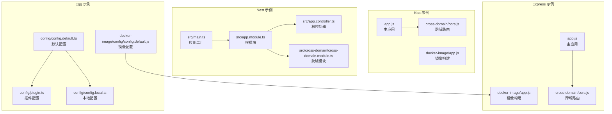
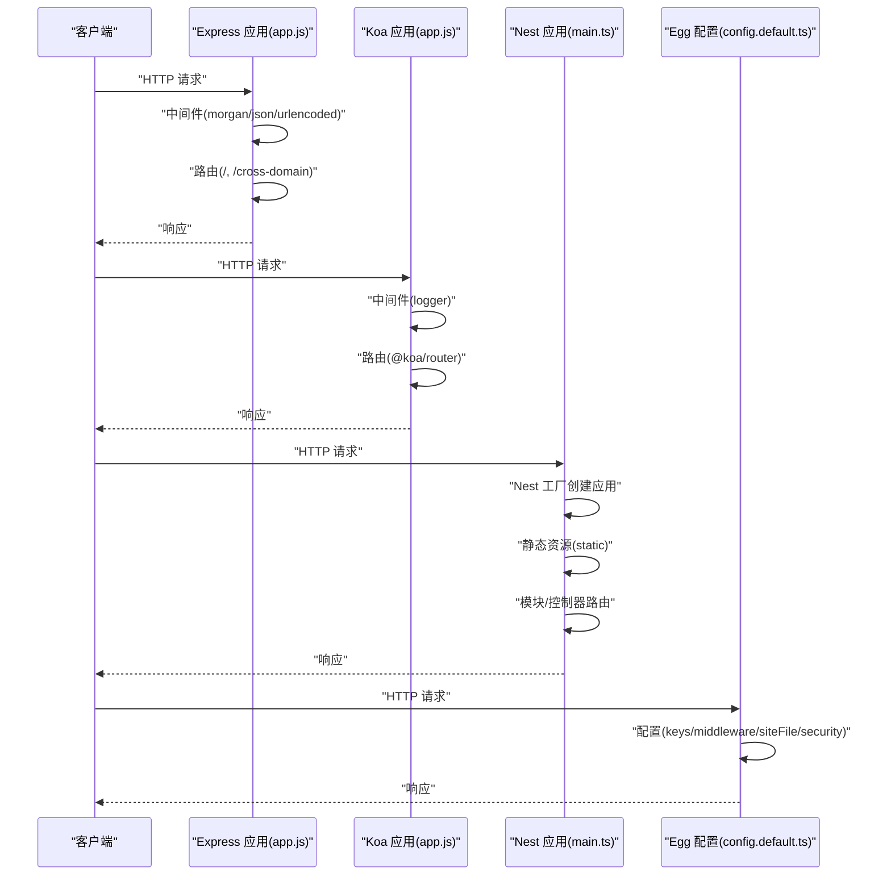
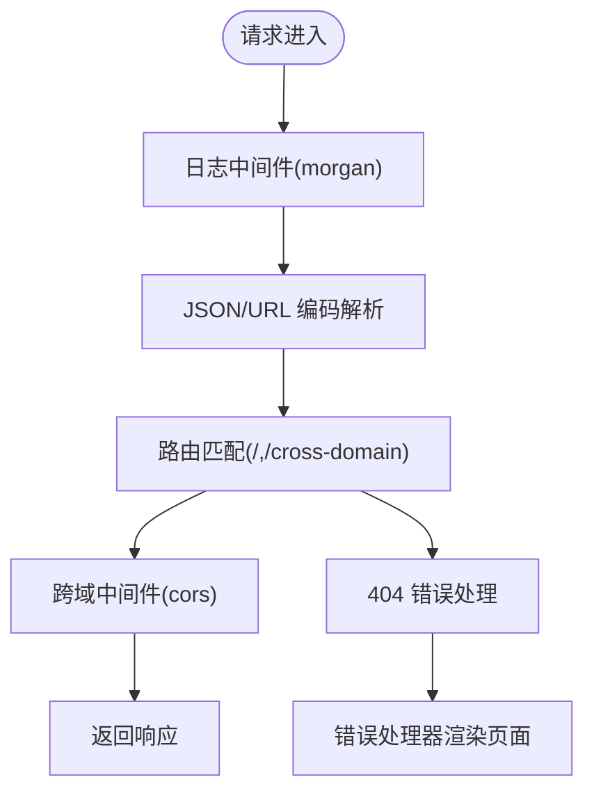
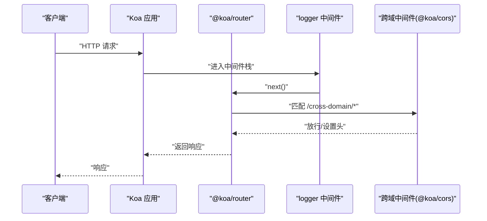
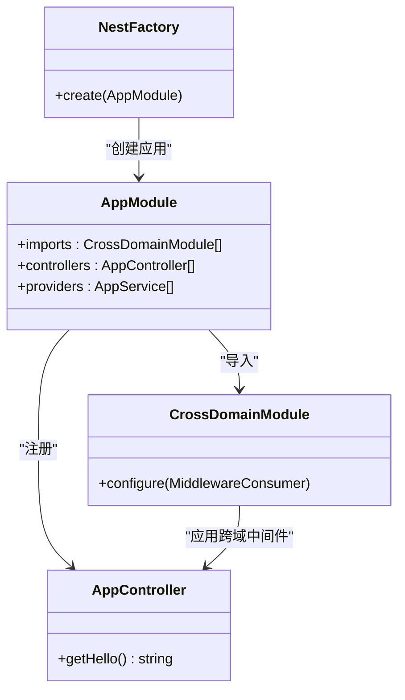
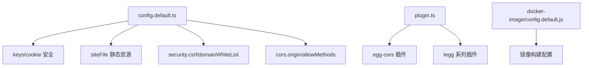
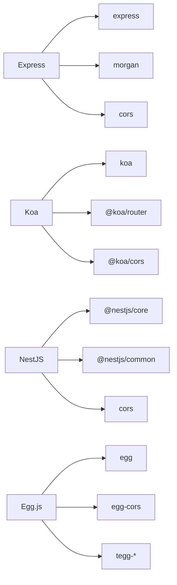

# 后端服务架构

<cite>
**本文引用的文件**
- [practice/nodejs-service/express/cross-domain/app.js](file://practice/nodejs-service/express/cross-domain/app.js)
- [practice/nodejs-service/express/cross-domain/cross-domain/cors.js](file://practice/nodejs-service/express/cross-domain/cross-domain/cors.js)
- [practice/nodejs-service/express/docker-image/app.js](file://practice/nodejs-service/express/docker-image/app.js)
- [practice/nodejs-service/koa/cross-domain/app.js](file://practice/nodejs-service/koa/cross-domain/app.js)
- [practice/nodejs-service/koa/cross-domain/cross-domain/cors.js](file://practice/nodejs-service/koa/cross-domain/cross-domain/cors.js)
- [practice/nodejs-service/nest/cross-domain/src/main.ts](file://practice/nodejs-service/nest/cross-domain/src/main.ts)
- [practice/nodejs-service/nest/cross-domain/src/app.module.ts](file://practice/nodejs-service/nest/cross-domain/src/app.module.ts)
- [practice/nodejs-service/nest/cross-domain/src/app.controller.ts](file://practice/nodejs-service/nest/cross-domain/src/app.controller.ts)
- [practice/nodejs-service/nest/cross-domain/src/cross-domain/cross-domain.module.ts](file://practice/nodejs-service/nest/cross-domain/src/cross-domain/cross-domain.module.ts)
- [practice/nodejs-service/egg/cross-domain/config/config.default.ts](file://practice/nodejs-service/egg/cross-domain/config/config.default.ts)
- [practice/nodejs-service/egg/cross-domain/config/config.local.ts](file://practice/nodejs-service/egg/cross-domain/config/config.local.ts)
- [practice/nodejs-service/egg/cross-domain/config/plugin.ts](file://practice/nodejs-service/egg/cross-domain/config/plugin.ts)
- [practice/nodejs-service/egg/docker-image/config/config.default.js](file://practice/nodejs-service/egg/docker-image/config/config.default.js)
</cite>

## 目录
1. [引言](#引言)
2. [项目结构](#项目结构)
3. [核心组件](#核心组件)
4. [架构总览](#架构总览)
5. [详细组件分析](#详细组件分析)
6. [依赖分析](#依赖分析)
7. [性能考量](#性能考量)
8. [故障排查指南](#故障排查指南)
9. [结论](#结论)
10. [附录](#附录)

## 引言
本文件面向 Collection-Space 的后端服务架构，围绕四种主流 Node.js 框架（Egg.js、Express、Koa、NestJS）进行系统化技术文档整理。内容涵盖设计理念、架构特性、项目结构、配置管理、中间件与路由处理等核心主题，并通过仓库中实际示例文件展示各框架在跨域、静态资源、错误处理等方面的实现差异与优势。最后提供性能对比分析、扩展性建议与最佳实践，帮助开发者基于业务需求做出合适的技术选型。

## 项目结构
该仓库在 practice/nodejs-service 下提供了四类框架的最小可运行示例，每个框架均包含以下典型模块：
- 跨域演示：Express/Koa/Nest 均提供独立的跨域子路由模块；Egg 提供配置与插件体系。
- Docker 镜像示例：Express/Egg 提供纯 JS 的构建产物配置；Koa/Nest 保持 TS 构建产物。
- 主入口与模块：Express/Koa/Nest 均有 main 入口或应用工厂；Nest 还包含模块与控制器。

下图给出一个概念性的项目结构视图（不映射具体源码文件）：

## 核心组件
本节从四个维度对各框架进行对比：设计理念、项目结构、配置管理、中间件与路由处理。

- 设计理念
  - Express：极简路由与中间件模型，适合快速搭建原型与小型服务。
  - Koa：基于 async/await 的中间件栈，强调异步流程控制与更清晰的错误传播。
  - NestJS：以 TypeScript 为中心的面向对象架构，内置依赖注入、模块化与装饰器驱动的控制器/服务。
  - Egg.js：企业级 Node.js 框架，强调约定优于配置、插件生态与多进程 Agent/Worker 架构。

- 项目结构
  - Express/Koa：通常以 app.js 作为入口，按功能拆分路由模块；静态资源通过中间件或直接路由处理。
  - NestJS：采用模块化结构，根模块导入子模块，控制器负责路由，服务提供业务逻辑。
  - Egg.js：以 config 目录集中管理配置与插件，约定 app/module 下的模块化目录结构。

- 配置管理
  - Express/Koa：在入口文件中直接组合中间件与路由，配置相对扁平。
  - NestJS：通过 @Module 装饰器组织模块，支持全局中间件与拦截器配置。
  - Egg.js：提供 config.default.ts/config.local.ts 等环境配置文件，配合 plugin.ts 管理插件启用与参数。

- 中间件与路由
  - Express：app.use(...) 注册中间件，express.Router() 组织路由。
  - Koa：app.use(async (ctx, next) => {...}) 组织中间件，@koa/router 定义路由。
  - NestJS：@Controller/@Get 等装饰器定义路由，@Injectable 的服务注入到控制器。
  - Egg.js：config.middleware 数组注册全局中间件，插件如 egg-cors 提供 CORS 支持。

**章节来源**
- [practice/nodejs-service/express/cross-domain/app.js:1-41](file://practice/nodejs-service/express/cross-domain/app.js#L1-L41)
- [practice/nodejs-service/koa/cross-domain/app.js:1-69](file://practice/nodejs-service/koa/cross-domain/app.js#L1-L69)
- [practice/nodejs-service/nest/cross-domain/src/main.ts:1-19](file://practice/nodejs-service/nest/cross-domain/src/main.ts#L1-L19)
- [practice/nodejs-service/nest/cross-domain/src/app.module.ts:1-19](file://practice/nodejs-service/nest/cross-domain/src/app.module.ts#L1-L19)
- [practice/nodejs-service/nest/cross-domain/src/app.controller.ts:1-20](file://practice/nodejs-service/nest/cross-domain/src/app.controller.ts#L1-L20)
- [practice/nodejs-service/nest/cross-domain/src/cross-domain/cross-domain.module.ts:1-25](file://practice/nodejs-service/nest/cross-domain/src/cross-domain/cross-domain.module.ts#L1-L25)
- [practice/nodejs-service/egg/cross-domain/config/config.default.ts:1-49](file://practice/nodejs-service/egg/cross-domain/config/config.default.ts#L1-L49)
- [practice/nodejs-service/egg/cross-domain/config/plugin.ts:1-39](file://practice/nodejs-service/egg/cross-domain/config/plugin.ts#L1-L39)
- [practice/nodejs-service/egg/cross-domain/config/config.local.ts:1-7](file://practice/nodejs-service/egg/cross-domain/config/config.local.ts#L1-L7)
- [practice/nodejs-service/egg/docker-image/config/config.default.js:1-28](file://practice/nodejs-service/egg/docker-image/config/config.default.js#L1-L28)

## 架构总览
下图展示了四类框架在“请求进入—中间件—路由—响应”的通用处理链路，以及跨域与静态资源的关键节点。

**图表来源**
- [practice/nodejs-service/express/cross-domain/app.js:1-41](file://practice/nodejs-service/express/cross-domain/app.js#L1-L41)
- [practice/nodejs-service/koa/cross-domain/app.js:1-69](file://practice/nodejs-service/koa/cross-domain/app.js#L1-L69)
- [practice/nodejs-service/nest/cross-domain/src/main.ts:1-19](file://practice/nodejs-service/nest/cross-domain/src/main.ts#L1-L19)
- [practice/nodejs-service/egg/cross-domain/config/config.default.ts:1-49](file://practice/nodejs-service/egg/cross-domain/config/config.default.ts#L1-L49)

## 详细组件分析

### Express 组件分析
- 设计理念与结构
  - 以中间件为核心，通过 app.use(...) 串联日志、解析、路由等处理逻辑。
  - 使用 express.Router() 将路由拆分为模块化文件，便于维护。
- 关键实现要点
  - 错误处理统一使用 next(createError(404)) 与自定义错误处理器。
  - 静态资源通过路由返回或第三方中间件处理。
  - 跨域通过 cors 插件绑定到特定路由。
- 代码片段路径
  - [主应用入口:1-41](file://practice/nodejs-service/express/cross-domain/app.js#L1-L41)
  - [跨域路由绑定:1-16](file://practice/nodejs-service/express/cross-domain/cross-domain/cors.js#L1-L16)
  - [Docker 镜像构建入口:1-39](file://practice/nodejs-service/express/docker-image/app.js#L1-L39)

**图表来源**
- [practice/nodejs-service/express/cross-domain/app.js:1-41](file://practice/nodejs-service/express/cross-domain/app.js#L1-L41)
- [practice/nodejs-service/express/cross-domain/cross-domain/cors.js:1-16](file://practice/nodejs-service/express/cross-domain/cross-domain/cors.js#L1-L16)

**章节来源**
- [practice/nodejs-service/express/cross-domain/app.js:1-41](file://practice/nodejs-service/express/cross-domain/app.js#L1-L41)
- [practice/nodejs-service/express/cross-domain/cross-domain/cors.js:1-16](file://practice/nodejs-service/express/cross-domain/cross-domain/cors.js#L1-L16)
- [practice/nodejs-service/express/docker-image/app.js:1-39](file://practice/nodejs-service/express/docker-image/app.js#L1-L39)

### Koa 组件分析
- 设计理念与结构
  - 基于 async/await 的洋葱模型中间件，强调清晰的请求/响应生命周期。
  - 使用 @koa/router 定义路由，支持 GET/POST 等方法与中间件组合。
- 关键实现要点
  - 自定义 logger 中间件记录耗时。
  - 路由层通过 router.routes()/allowedMethods() 注册。
  - 跨域通过 @koa/cors 插件绑定到子路由。
- 代码片段路径
  - [主应用入口:1-69](file://practice/nodejs-service/koa/cross-domain/app.js#L1-L69)
  - [跨域路由绑定:1-14](file://practice/nodejs-service/koa/cross-domain/cross-domain/cors.js#L1-L14)

**图表来源**
- [practice/nodejs-service/koa/cross-domain/app.js:1-69](file://practice/nodejs-service/koa/cross-domain/app.js#L1-L69)
- [practice/nodejs-service/koa/cross-domain/cross-domain/cors.js:1-14](file://practice/nodejs-service/koa/cross-domain/cross-domain/cors.js#L1-L14)

**章节来源**
- [practice/nodejs-service/koa/cross-domain/app.js:1-69](file://practice/nodejs-service/koa/cross-domain/app.js#L1-L69)
- [practice/nodejs-service/koa/cross-domain/cross-domain/cors.js:1-14](file://practice/nodejs-service/koa/cross-domain/cross-domain/cors.js#L1-L14)

### NestJS 组件分析
- 设计理念与结构
  - 模块化架构，根模块导入子模块；控制器负责路由；服务提供业务逻辑。
  - 通过 @NestFactory 创建应用实例，支持静态资源挂载。
- 关键实现要点
  - 根模块 AppModule 导入 CrossDomainModule 并注册控制器/服务。
  - 跨域模块通过 MiddlewareConsumer.apply(cors(options)).forRoutes(...) 对指定控制器生效。
  - 主入口 main.ts 中使用静态资源适配器挂载 public 目录。
- 代码片段路径
  - [应用工厂入口:1-19](file://practice/nodejs-service/nest/cross-domain/src/main.ts#L1-19)
  - [根模块:1-19](file://practice/nodejs-service/nest/cross-domain/src/app.module.ts#L1-19)
  - [根控制器:1-20](file://practice/nodejs-service/nest/cross-domain/src/app.controller.ts#L1-20)
  - [跨域模块:1-25](file://practice/nodejs-service/nest/cross-domain/src/cross-domain/cross-domain.module.ts#L1-25)

**图表来源**
- [practice/nodejs-service/nest/cross-domain/src/app.module.ts:1-19](file://practice/nodejs-service/nest/cross-domain/src/app.module.ts#L1-L19)
- [practice/nodejs-service/nest/cross-domain/src/app.controller.ts:1-20](file://practice/nodejs-service/nest/cross-domain/src/app.controller.ts#L1-L20)
- [practice/nodejs-service/nest/cross-domain/src/cross-domain/cross-domain.module.ts:1-25](file://practice/nodejs-service/nest/cross-domain/src/cross-domain/cross-domain.module.ts#L1-L25)
- [practice/nodejs-service/nest/cross-domain/src/main.ts:1-19](file://practice/nodejs-service/nest/cross-domain/src/main.ts#L1-L19)

**章节来源**
- [practice/nodejs-service/nest/cross-domain/src/main.ts:1-19](file://practice/nodejs-service/nest/cross-domain/src/main.ts#L1-L19)
- [practice/nodejs-service/nest/cross-domain/src/app.module.ts:1-19](file://practice/nodejs-service/nest/cross-domain/src/app.module.ts#L1-L19)
- [practice/nodejs-service/nest/cross-domain/src/app.controller.ts:1-20](file://practice/nodejs-service/nest/cross-domain/src/app.controller.ts#L1-L20)
- [practice/nodejs-service/nest/cross-domain/src/cross-domain/cross-domain.module.ts:1-25](file://practice/nodejs-service/nest/cross-domain/src/cross-domain/cross-domain.module.ts#L1-L25)

### Egg.js 组件分析
- 设计理念与结构
  - 约定优于配置，通过 config/*.ts 与 plugin.ts 管理配置与插件。
  - 支持多进程模型（Agent/Worker），内置安全、静态文件等能力。
- 关键实现要点
  - config.default.ts 定义 keys、siteFile、security、cors 等配置。
  - plugin.ts 启用 egg-cors、tegg 系列插件等。
  - Docker 镜像构建使用生成的 JS 配置文件。
- 代码片段路径
  - [默认配置:1-49](file://practice/nodejs-service/egg/cross-domain/config/config.default.ts#L1-49)
  - [插件配置:1-39](file://practice/nodejs-service/egg/cross-domain/config/plugin.ts#L1-39)
  - [本地配置:1-7](file://practice/nodejs-service/egg/cross-domain/config/config.local.ts#L1-7)
  - [Docker 镜像配置:1-28](file://practice/nodejs-service/egg/docker-image/config/config.default.js#L1-28)

**图表来源**
- [practice/nodejs-service/egg/cross-domain/config/config.default.ts:1-49](file://practice/nodejs-service/egg/cross-domain/config/config.default.ts#L1-L49)
- [practice/nodejs-service/egg/cross-domain/config/plugin.ts:1-39](file://practice/nodejs-service/egg/cross-domain/config/plugin.ts#L1-L39)
- [practice/nodejs-service/egg/docker-image/config/config.default.js:1-28](file://practice/nodejs-service/egg/docker-image/config/config.default.js#L1-L28)

**章节来源**
- [practice/nodejs-service/egg/cross-domain/config/config.default.ts:1-49](file://practice/nodejs-service/egg/cross-domain/config/config.default.ts#L1-L49)
- [practice/nodejs-service/egg/cross-domain/config/plugin.ts:1-39](file://practice/nodejs-service/egg/cross-domain/config/plugin.ts#L1-L39)
- [practice/nodejs-service/egg/cross-domain/config/config.local.ts:1-7](file://practice/nodejs-service/egg/cross-domain/config/config.local.ts#L1-L7)
- [practice/nodejs-service/egg/docker-image/config/config.default.js:1-28](file://practice/nodejs-service/egg/docker-image/config/config.default.js#L1-L28)

## 依赖分析
- Express
  - 依赖：express、morgan、cors（跨域）、@koa/router（示例中未使用）
  - 特点：轻量、灵活，适合快速迭代
- Koa
  - 依赖：koa、@koa/router、@koa/cors
  - 特点：中间件模型清晰，异步友好
- NestJS
  - 依赖：@nestjs/core、@nestjs/common、cors（跨域）
  - 特点：强类型、模块化、DI 易于测试
- Egg.js
  - 依赖：egg、egg-cors、tegg 系列插件
  - 特点：企业级、约定优于配置、插件生态丰富

**图表来源**
- [practice/nodejs-service/express/cross-domain/app.js:1-41](file://practice/nodejs-service/express/cross-domain/app.js#L1-L41)
- [practice/nodejs-service/koa/cross-domain/app.js:1-69](file://practice/nodejs-service/koa/cross-domain/app.js#L1-L69)
- [practice/nodejs-service/nest/cross-domain/src/main.ts:1-19](file://practice/nodejs-service/nest/cross-domain/src/main.ts#L1-L19)
- [practice/nodejs-service/egg/cross-domain/config/plugin.ts:1-39](file://practice/nodejs-service/egg/cross-domain/config/plugin.ts#L1-L39)

## 性能考量
- 中间件数量与顺序
  - Express/Koa：中间件越多，请求链路越长；应避免重复解析与冗余中间件。
  - NestJS：模块化中间件按需应用，减少全局开销。
  - Egg.js：插件启用需谨慎，仅启用必要插件以降低启动与运行成本。
- 路由与静态资源
  - 将静态资源交由专用服务器或 CDN 处理，减少 Node 侧压力。
  - 在 Nest 中使用静态资源适配器挂载 public 目录，避免在业务路由中重复处理。
- 错误处理
  - 统一的错误处理器可减少异常传播成本，避免未捕获异常导致的性能抖动。
- 跨域策略
  - 尽量将跨域配置集中在入口或模块级别，避免在每个路由重复设置。
  - Egg.js 的 config.cors 可按路径动态决定 origin，提升安全性与灵活性。

[本节为通用指导，无需列出具体文件来源]

## 故障排查指南
- 404 与错误处理
  - Express：通过 next(createError(404)) 与自定义错误处理器统一处理。
  - NestJS：确保路由装饰器正确绑定，检查模块导入与控制器注册。
  - Koa：确认 @koa/router 的 allowedMethods() 是否正确调用。
  - Egg.js：检查 config.default.ts 中的 siteFile 与 security 配置是否覆盖默认行为。
- 跨域问题
  - Express/Koa：核对 cors 中间件的选项与路由绑定位置。
  - NestJS：确认 MiddlewareConsumer.apply(cors(options)).forRoutes() 是否针对正确控制器。
  - Egg.js：检查 config.cors.origin 返回值与 allowMethods 设置。
- 端口占用与监听
  - Koa：监听错误处理中区分权限不足与端口占用，及时退出进程。
- 静态资源访问
  - Express：确认 /favicon.ico 路由与 public 目录路径。
  - NestJS：确认 static 资源挂载路径与控制器路由冲突。

**章节来源**
- [practice/nodejs-service/express/cross-domain/app.js:24-38](file://practice/nodejs-service/express/cross-domain/app.js#L24-L38)
- [practice/nodejs-service/koa/cross-domain/app.js:43-68](file://practice/nodejs-service/koa/cross-domain/app.js#L43-L68)
- [practice/nodejs-service/nest/cross-domain/src/cross-domain/cross-domain.module.ts:15-24](file://practice/nodejs-service/nest/cross-domain/src/cross-domain/cross-domain.module.ts#L15-L24)
- [practice/nodejs-service/egg/cross-domain/config/config.default.ts:31-41](file://practice/nodejs-service/egg/cross-domain/config/config.default.ts#L31-L41)

## 结论
- 若追求极致简洁与快速开发，Express 是首选；若需要更强的异步中间件模型，可优先考虑 Koa。
- 对于大型团队与复杂业务，NestJS 的模块化与 DI 能显著提升可维护性与可测试性。
- 对于企业级场景与多进程架构，Egg.js 提供完善的配置与插件体系，适合长期演进。
- 实际选型应综合考虑团队熟悉度、生态成熟度、部署与运维成本以及未来扩展需求。

[本节为总结性内容，无需列出具体文件来源]

## 附录
- 最佳实践清单
  - 明确中间件职责边界，避免在中间件中做重逻辑。
  - 统一日志格式与错误码，便于监控与排障。
  - 将跨域与静态资源处理收敛到入口或模块层。
  - 使用环境变量与配置文件分离开发/生产配置。
  - 对外暴露的接口尽量幂等与无状态，便于横向扩展。

[本节为通用指导，无需列出具体文件来源]