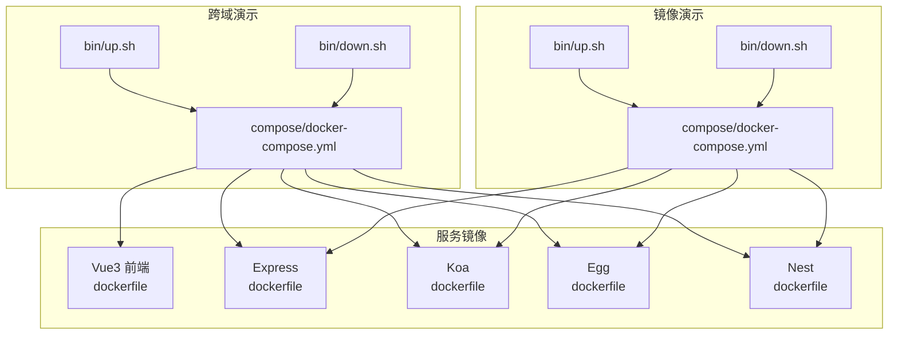
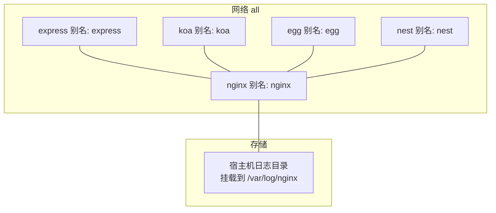
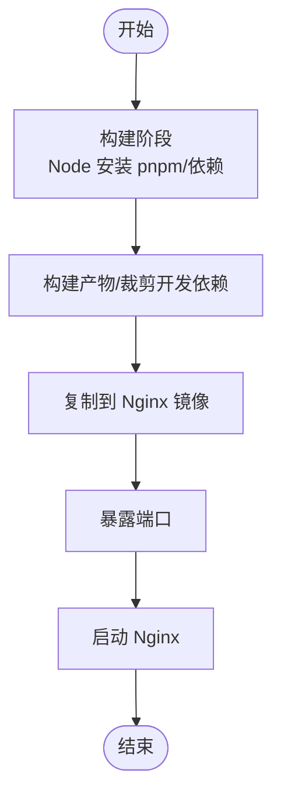
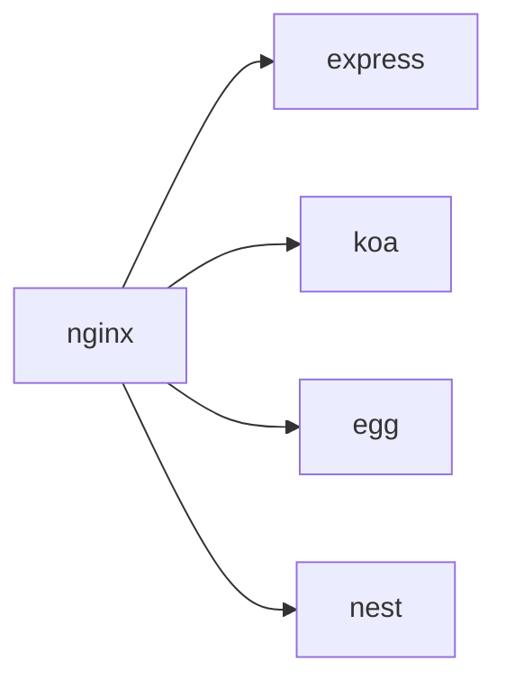

# Docker Compose编排

<cite>
**本文引用的文件**
- [docker-compose.yml（跨域演示）](file://practice/docker-env/cross-domain/compose/docker-compose.yml)
- [up.sh（跨域演示）](file://practice/docker-env/cross-domain/bin/up.sh)
- [down.sh（跨域演示）](file://practice/docker-env/cross-domain/bin/down.sh)
- [compose.sh（跨域演示）](file://practice/docker-env/cross-domain/bin/compose.sh)
- [README.md（跨域演示）](file://practice/docker-env/cross-domain/README.md)
- [docker-compose.yml（镜像演示）](file://practice/docker-env/docker-image/compose/docker-compose.yml)
- [up.sh（镜像演示）](file://practice/docker-env/docker-image/bin/up.sh)
- [down.sh（镜像演示）](file://practice/docker-env/docker-image/bin/down.sh)
- [compose.sh（镜像演示）](file://practice/docker-env/docker-image/bin/compose.sh)
- [README.md（镜像演示）](file://practice/docker-env/docker-image/README.md)
- [dockerfile（Vue3前端）](file://practice/vue3-frontend/cross-domain/dockerfile)
- [dockerfile（Express）](file://practice/nodejs-service/express/cross-domain/dockerfile)
- [dockerfile（Koa）](file://practice/nodejs-service/koa/cross-domain/dockerfile)
- [dockerfile（Egg）](file://practice/nodejs-service/egg/cross-domain/dockerfile)
- [dockerfile（Nest）](file://practice/nodejs-service/nest/cross-domain/dockerfile)
</cite>

## 目录
1. [简介](#简介)
2. [项目结构](#项目结构)
3. [核心组件](#核心组件)
4. [架构总览](#架构总览)
5. [详细组件分析](#详细组件分析)
6. [依赖分析](#依赖分析)
7. [性能考虑](#性能考虑)
8. [故障排查指南](#故障排查指南)
9. [结论](#结论)
10. [附录](#附录)

## 简介
本文件系统性阐述基于 Docker Compose 的多服务编排实践，覆盖服务定义、网络与卷挂载、环境变量管理、服务间依赖与启动顺序、端口映射、健康检查与重启策略、命令行操作、脚本化部署与环境切换、以及故障排查与性能优化建议。仓库提供了两套可直接运行的编排示例：跨域演示与镜像演示，分别用于演示前端静态资源与后端服务的组合运行。

## 项目结构
- 跨域演示（cross-domain）
  - 编排文件：practice/docker-env/cross-domain/compose/docker-compose.yml
  - 启动脚本：bin/up.sh、down.sh、compose.sh
  - 使用说明：README.md
- 镜像演示（docker-image）
  - 编排文件：practice/docker-env/docker-image/compose/docker-compose.yml
  - 启动脚本：bin/up.sh、down.sh、compose.sh
  - 使用说明：README.md
- 服务镜像构建
  - Vue3 前端（Nginx 托管）：practice/vue3-frontend/cross-domain/dockerfile
  - Express/Koa/Egg/Nest 后端：各自目录下的 dockerfile

图表来源
- [docker-compose.yml（跨域演示）:1-67](file://practice/docker-env/cross-domain/compose/docker-compose.yml#L1-L67)
- [docker-compose.yml（镜像演示）:1-53](file://practice/docker-env/docker-image/compose/docker-compose.yml#L1-L53)
- [dockerfile（Vue3前端）:1-37](file://practice/vue3-frontend/cross-domain/dockerfile#L1-L37)
- [dockerfile（Express）:1-20](file://practice/nodejs-service/express/cross-domain/dockerfile#L1-L20)
- [dockerfile（Koa）:1-20](file://practice/nodejs-service/koa/cross-domain/dockerfile#L1-L20)
- [dockerfile（Egg）:1-26](file://practice/nodejs-service/egg/cross-domain/dockerfile#L1-L26)
- [dockerfile（Nest）:1-26](file://practice/nodejs-service/nest/cross-domain/dockerfile#L1-L26)

章节来源
- [docker-compose.yml（跨域演示）:1-67](file://practice/docker-env/cross-domain/compose/docker-compose.yml#L1-L67)
- [docker-compose.yml（镜像演示）:1-53](file://practice/docker-env/docker-image/compose/docker-compose.yml#L1-L53)
- [README.md（跨域演示）:1-18](file://practice/docker-env/cross-domain/README.md#L1-L18)
- [README.md（镜像演示）:1-18](file://practice/docker-env/docker-image/README.md#L1-L18)

## 核心组件
- 版本声明与服务列表
  - 版本：使用 v3 格式，确保网络、卷等特性可用
  - 服务：nginx、express、koa、egg、nest（跨域演示）；express、koa、egg、nest（镜像演示）
- 平台与构建
  - platform：统一指定为 linux/amd64，保证跨平台一致性
  - build：context 指向各服务源码目录，dockerfile 指向对应镜像构建文件
- 网络与别名
  - 统一加入名为 all 的自定义网络，并为每个服务设置别名，便于服务发现
- 卷挂载
  - nginx：挂载宿主机日志目录到容器内 Nginx 日志路径，便于持久化与外部查看
- 端口映射
  - nginx：范围映射 5173-5179 → 5173-5179，支持多实例或不同端口
  - 后端服务：单端口映射，如 3000、3001、3002、3003
- 重启策略
  - restart: always，确保异常退出时自动重启
- 健康检查与依赖
  - 当前编排未显式配置 healthcheck 和 depends_on；可在需要时补充

章节来源
- [docker-compose.yml（跨域演示）:1-67](file://practice/docker-env/cross-domain/compose/docker-compose.yml#L1-L67)
- [docker-compose.yml（镜像演示）:1-53](file://practice/docker-env/docker-image/compose/docker-compose.yml#L1-L53)

## 架构总览
跨域演示通过 Nginx 提供前端静态资源与反向代理能力，后端以 Express/Koa/Egg/Nest 多框架并存，均通过统一网络 all 进行互联。镜像演示聚焦后端服务，不包含前端层。

图表来源
- [docker-compose.yml（跨域演示）:10-17](file://practice/docker-env/cross-domain/compose/docker-compose.yml#L10-L17)
- [docker-compose.yml（跨域演示）:18-65](file://practice/docker-env/cross-domain/compose/docker-compose.yml#L18-L65)

## 详细组件分析

### 服务定义与镜像构建
- nginx（跨域演示）
  - 构建上下文指向 Vue3 前端工程，采用多阶段构建：先在 Node 镜像中安装 pnpm、构建产物，再复制到 Nginx 镜像作为静态站点
  - 端口暴露 5173-5179，映射至宿主机相同范围
  - 挂载日志目录，便于持久化
- express/koa/egg/nest（跨域与镜像演示）
  - 基于 Alpine 的 Node 镜像，安装 pnpm 或 npm，拷贝依赖与源码，按需执行构建与裁剪开发依赖
  - 端口暴露与映射分别为 3000/3001/3002/3003
- 镜像演示差异
  - 仅包含后端服务，无前端层，适合纯后端联调

图表来源
- [dockerfile（Vue3前端）:1-37](file://practice/vue3-frontend/cross-domain/dockerfile#L1-L37)

章节来源
- [dockerfile（Vue3前端）:1-37](file://practice/vue3-frontend/cross-domain/dockerfile#L1-L37)
- [dockerfile（Express）:1-20](file://practice/nodejs-service/express/cross-domain/dockerfile#L1-L20)
- [dockerfile（Koa）:1-20](file://practice/nodejs-service/koa/cross-domain/dockerfile#L1-L20)
- [dockerfile（Egg）:1-26](file://practice/nodejs-service/egg/cross-domain/dockerfile#L1-L26)
- [dockerfile（Nest）:1-26](file://practice/nodejs-service/nest/cross-domain/dockerfile#L1-L26)

### 网络与服务发现
- 自定义网络 all：所有服务加入该网络，通过服务别名进行通信
- 别名规则：nginx、express、koa、egg、nest
- 适用场景：微服务间解耦、容器间互访无需硬编码 IP

章节来源
- [docker-compose.yml（跨域演示）:12-15](file://practice/docker-env/cross-domain/compose/docker-compose.yml#L12-L15)
- [docker-compose.yml（跨域演示）:26-29](file://practice/docker-env/cross-domain/compose/docker-compose.yml#L26-L29)
- [docker-compose.yml（跨域演示）:38-41](file://practice/docker-env/cross-domain/compose/docker-compose.yml#L38-L41)
- [docker-compose.yml（跨域演示）:50-53](file://practice/docker-env/cross-domain/compose/docker-compose.yml#L50-L53)
- [docker-compose.yml（跨域演示）:62-65](file://practice/docker-env/cross-domain/compose/docker-compose.yml#L62-L65)

### 卷挂载与持久化
- nginx 日志卷：将宿主机目录挂载到容器内的 Nginx 日志路径，实现日志持久化与外部查看
- 建议：为其他有状态服务（数据库、缓存）增加命名卷或绑定挂载，明确数据生命周期

章节来源
- [docker-compose.yml（跨域演示）:16-17](file://practice/docker-env/cross-domain/compose/docker-compose.yml#L16-L17)

### 端口映射与访问
- nginx：范围映射 5173-5179 → 5173-5179，便于多实例或不同端口测试
- 后端服务：单端口映射，避免冲突
- 建议：生产环境使用固定端口与反向代理统一入口

章节来源
- [docker-compose.yml（跨域演示）:10-11](file://practice/docker-env/cross-domain/compose/docker-compose.yml#L10-L11)
- [docker-compose.yml（跨域演示）:24-25](file://practice/docker-env/cross-domain/compose/docker-compose.yml#L24-L25)
- [docker-compose.yml（跨域演示）:36-37](file://practice/docker-env/cross-domain/compose/docker-compose.yml#L36-L37)
- [docker-compose.yml（跨域演示）:48-49](file://practice/docker-env/cross-domain/compose/docker-compose.yml#L48-L49)
- [docker-compose.yml（跨域演示）:60-61](file://practice/docker-env/cross-domain/compose/docker-compose.yml#L60-L61)

### 重启策略与健康检查
- 重启策略：restart: always，提升可用性
- 健康检查：当前未配置，建议为关键服务添加 healthcheck，结合 depends_on 条件启动

章节来源
- [docker-compose.yml（跨域演示）](file://practice/docker-env/cross-domain/compose/docker-compose.yml#L9)
- [docker-compose.yml（跨域演示）](file://practice/docker-env/cross-domain/compose/docker-compose.yml#L23)
- [docker-compose.yml（跨域演示）](file://practice/docker-env/cross-domain/compose/docker-compose.yml#L35)
- [docker-compose.yml（跨域演示）](file://practice/docker-env/cross-domain/compose/docker-compose.yml#L47)
- [docker-compose.yml（跨域演示）](file://practice/docker-env/cross-domain/compose/docker-compose.yml#L59)

### 服务间依赖与启动顺序
- 当前编排未使用 depends_on，服务默认并行启动
- 若存在强依赖（如后端依赖数据库），建议在 docker-compose 中添加 depends_on，并配合 healthcheck 实现条件等待

章节来源
- [docker-compose.yml（跨域演示）:3-65](file://practice/docker-env/cross-domain/compose/docker-compose.yml#L3-L65)
- [docker-compose.yml（镜像演示）:3-51](file://practice/docker-env/docker-image/compose/docker-compose.yml#L3-L51)

### 环境变量管理
- 当前编排未显式声明环境变量
- 建议：通过 env_file 引入环境文件，或在服务级 environment 注入，区分开发/测试/生产

章节来源
- [docker-compose.yml（跨域演示）:1-67](file://practice/docker-env/cross-domain/compose/docker-compose.yml#L1-L67)
- [docker-compose.yml（镜像演示）:1-53](file://practice/docker-env/docker-image/compose/docker-compose.yml#L1-L53)

## 依赖分析
- 组件耦合
  - nginx 与后端服务通过自定义网络 all 解耦，依赖别名进行通信
  - 后端服务彼此独立，无显式依赖
- 外部依赖
  - Node 与 pnpm 版本由各 dockerfile 决定
  - Nginx 版本由前端 dockerfile 的第二阶段决定
- 可能的循环依赖
  - 当前未见循环依赖风险

图表来源
- [docker-compose.yml（跨域演示）:12-15](file://practice/docker-env/cross-domain/compose/docker-compose.yml#L12-L15)
- [docker-compose.yml（跨域演示）:26-29](file://practice/docker-env/cross-domain/compose/docker-compose.yml#L26-L29)
- [docker-compose.yml（跨域演示）:38-41](file://practice/docker-env/cross-domain/compose/docker-compose.yml#L38-L41)
- [docker-compose.yml（跨域演示）:50-53](file://practice/docker-env/cross-domain/compose/docker-compose.yml#L50-L53)
- [docker-compose.yml（跨域演示）:62-65](file://practice/docker-env/cross-domain/compose/docker-compose.yml#L62-L65)

## 性能考虑
- 多阶段构建：前端使用多阶段减少最终镜像体积，提升拉取与启动速度
- 平台统一：linux/amd64 统一平台，避免跨平台性能差异
- 端口范围映射：合理规划端口，避免宿主机资源争用
- 卷类型选择：优先使用命名卷管理有状态数据，提高 IO 性能与数据安全
- 重启策略：always 适合无状态服务，有状态服务需谨慎评估

## 故障排查指南
- 无法访问服务
  - 检查端口映射是否冲突，确认宿主机防火墙放行
  - 查看 nginx 日志卷挂载是否正确
- 服务频繁重启
  - 检查 restart: always 是否符合预期；若为调试，可临时改为 no
- 依赖服务未就绪
  - 为依赖服务添加 depends_on 与 healthcheck，确保顺序启动
- 环境变量问题
  - 使用 env_file 或 environment 明确注入，避免硬编码
- 日志定位
  - 通过 compose 日志命令查看容器日志，结合卷挂载的日志文件定位问题

章节来源
- [docker-compose.yml（跨域演示）:9-17](file://practice/docker-env/cross-domain/compose/docker-compose.yml#L9-L17)
- [docker-compose.yml（跨域演示）:23-29](file://practice/docker-env/cross-domain/compose/docker-compose.yml#L23-L29)
- [docker-compose.yml（跨域演示）:35-41](file://practice/docker-env/cross-domain/compose/docker-compose.yml#L35-L41)
- [docker-compose.yml（跨域演示）:47-53](file://practice/docker-env/cross-domain/compose/docker-compose.yml#L47-L53)
- [docker-compose.yml（跨域演示）:59-65](file://practice/docker-env/cross-domain/compose/docker-compose.yml#L59-L65)

## 结论
本仓库提供了两套可直接运行的 Docker Compose 编排示例，覆盖前端静态资源与多后端框架的组合运行。通过统一网络、卷挂载与重启策略，实现了服务间的解耦与高可用。建议在实际生产中补充健康检查、环境变量管理与依赖顺序控制，以进一步提升稳定性与可观测性。

## 附录

### Compose 命令行操作指南
- 启动
  - 跨域演示：进入目录，执行启动脚本
  - 镜像演示：进入目录，执行启动脚本
- 停止
  - 跨域演示：执行停止脚本
  - 镜像演示：执行停止脚本
- 重建
  - 使用 compose 脚本传递 build 参数，实现增量重建
- 日志查看
  - 使用 compose 脚本传递 logs 参数，实时查看容器日志

章节来源
- [README.md（跨域演示）:1-18](file://practice/docker-env/cross-domain/README.md#L1-L18)
- [README.md（镜像演示）:1-18](file://practice/docker-env/docker-image/README.md#L1-L18)
- [up.sh（跨域演示）:1-6](file://practice/docker-env/cross-domain/bin/up.sh#L1-L6)
- [down.sh（跨域演示）:1-6](file://practice/docker-env/cross-domain/bin/down.sh#L1-L6)
- [compose.sh（跨域演示）:1-6](file://practice/docker-env/cross-domain/bin/compose.sh#L1-L6)
- [up.sh（镜像演示）:1-6](file://practice/docker-env/docker-image/bin/up.sh#L1-L6)
- [down.sh（镜像演示）:1-6](file://practice/docker-env/docker-image/bin/down.sh#L1-L6)
- [compose.sh（镜像演示）:1-6](file://practice/docker-env/docker-image/bin/compose.sh#L1-L6)

### 脚本自动化部署流程
- 批量操作
  - 通过 compose 脚本统一入口，传入任意 docker-compose 子命令，实现批量启停与重建
- 环境切换
  - 通过项目前缀参数区分不同环境（如 cross-domain、docker-image），避免命名冲突
- 最佳实践
  - 将敏感配置放入 env_file，避免提交到版本库
  - 对有状态服务使用命名卷，明确数据生命周期
  - 在 CI/CD 中结合 compose 脚本实现一键部署与回滚

章节来源
- [compose.sh（跨域演示）:1-6](file://practice/docker-env/cross-domain/bin/compose.sh#L1-L6)
- [compose.sh（镜像演示）:1-6](file://practice/docker-env/docker-image/bin/compose.sh#L1-L6)