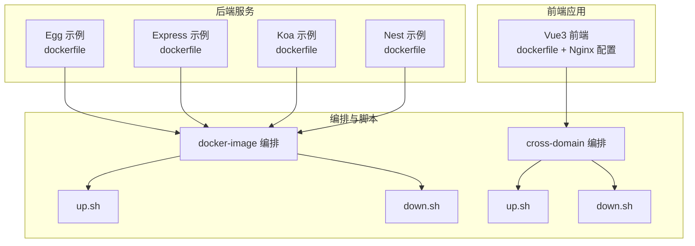
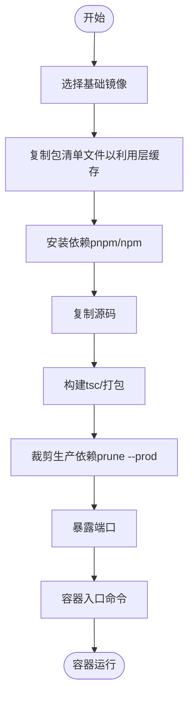
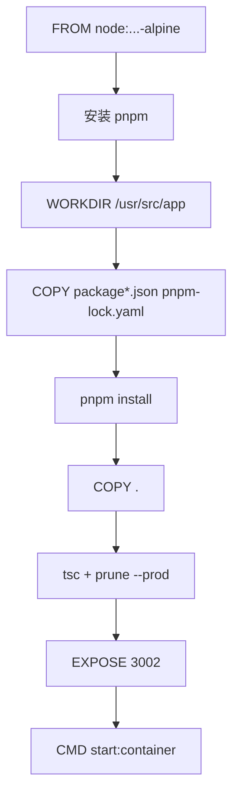
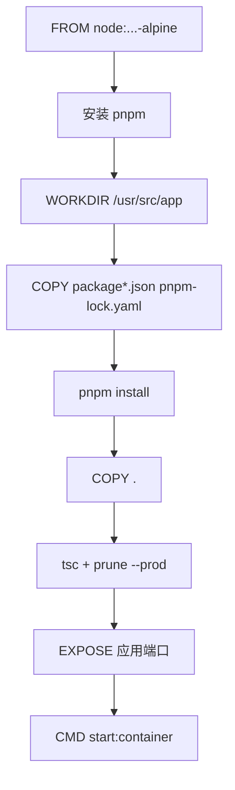
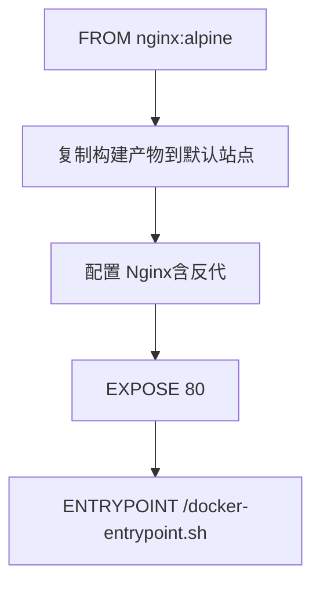
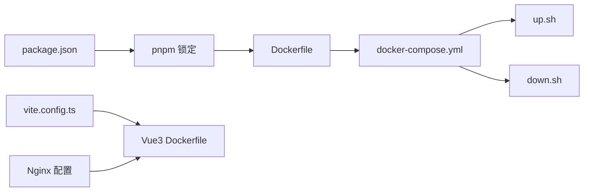

# Docker配置

<cite>
**本文引用的文件**
- [dockerfile（Egg示例）](file://practice/nodejs-service/egg/docker-image/dockerfile)
- [package.json（Egg示例）](file://practice/nodejs-service/egg/package.json)
- [pnpm-lock.yaml（Egg示例）](file://practice/nodejs-service/egg/pnpm-lock.yaml)
- [tsconfig.json（Egg示例）](file://practice/nodejs-service/egg/tsconfig.json)
- [dockerfile（Express示例）](file://practice/nodejs-service/express/docker-image/dockerfile)
- [package.json（Express示例）](file://practice/nodejs-service/express/package.json)
- [pnpm-lock.yaml（Express示例）](file://practice/nodejs-service/express/pnpm-lock.yaml)
- [dockerfile（Koa示例）](file://practice/nodejs-service/koa/docker-image/dockerfile)
- [package.json（Koa示例）](file://practice/nodejs-service/koa/package.json)
- [pnpm-lock.yaml（Koa示例）](file://practice/nodejs-service/koa/pnpm-lock.yaml)
- [dockerfile（Nest示例）](file://practice/nodejs-service/nest/docker-image/dockerfile)
- [package.json（Nest示例）](file://practice/nodejs-service/nest/package.json)
- [pnpm-lock.yaml（Nest示例）](file://practice/nodejs-service/nest/pnpm-lock.yaml)
- [dockerfile（Vue3前端示例）](file://practice/vue3-frontend/cross-domain/dockerfile)
- [package.json（Vue3前端示例）](file://practice/vue3-frontend/cross-domain/package.json)
- [vite.config.ts（Vue3前端示例）](file://practice/vue3-frontend/cross-domain/vite.config.ts)
- [nginx.conf（Vue3前端示例）](file://practice/vue3-frontend/cross-domain/nginx-conf/nginx.conf)
- [proxy.conf（Vue3前端示例）](file://practice/vue3-frontend/cross-domain/nginx-conf/conf.d/proxy.conf)
- [website.conf（Vue3前端示例）](file://practice/vue3-frontend/cross-domain/nginx-conf/conf.d/website.conf)
- [docker-compose.yml（docker-image示例）](file://practice/docker-env/docker-image/compose/docker-compose.yml)
- [up.sh（docker-image示例）](file://practice/docker-env/docker-image/bin/up.sh)
- [down.sh（docker-image示例）](file://practice/docker-env/docker-image/bin/down.sh)
- [docker-compose.yml（cross-domain示例）](file://practice/docker-env/cross-domain/compose/docker-compose.yml)
- [up.sh（cross-domain示例）](file://practice/docker-env/cross-domain/bin/up.sh)
- [down.sh（cross-domain示例）](file://practice/docker-env/cross-domain/bin/down.sh)
- [README.md（docker-image示例）](file://practice/docker-env/docker-image/README.md)
- [README.md（cross-domain示例）](file://practice/docker-env/cross-domain/README.md)
- [README.md（Docker Envs）](file://docker-envs/README.md)
- [README.zh-CN.md（Docker Envs）](file://docker-envs/README.zh-CN.md)
</cite>

## 目录
1. [简介](#简介)
2. [项目结构](#项目结构)
3. [核心组件](#核心组件)
4. [架构总览](#架构总览)
5. [详细组件分析](#详细组件分析)
6. [依赖关系分析](#依赖关系分析)
7. [性能与优化](#性能与优化)
8. [故障排查指南](#故障排查指南)
9. [结论](#结论)
10. [附录](#附录)

## 简介
本指南聚焦于本仓库中的Docker配置实践，系统讲解Dockerfile编写规范、多阶段构建策略、依赖管理与镜像优化，并对比不同服务类型（Node.js后端框架：Egg、Express、Koa、Nest；前端Vue3应用）的差异化配置要点。同时提供构建过程的最佳实践（缓存策略、安全配置、性能优化）、调试技巧与常见问题解决方案，兼顾初学者与进阶开发者的深度需求。

## 项目结构
围绕Docker相关的内容主要分布在以下位置：
- 后端Node.js服务示例：位于 practice/nodejs-service 下的多个子目录（egg、express、koa、nest），每个子目录均包含独立的 dockerfile 与运行脚本。
- 前端Vue3示例：位于 practice/vue3-frontend/cross-domain，包含前端构建产物与Nginx代理配置。
- Docker编排与启动脚本：位于 practice/docker-env 下的 docker-image 与 cross-domain 两套环境，分别提供 compose 文件与 up/down 脚本。

图表来源
- [dockerfile（Egg示例）:1-26](file://practice/nodejs-service/egg/docker-image/dockerfile#L1-L26)
- [dockerfile（Express示例）:1-26](file://practice/nodejs-service/express/docker-image/dockerfile#L1-L26)
- [dockerfile（Koa示例）:1-26](file://practice/nodejs-service/koa/docker-image/dockerfile#L1-L26)
- [dockerfile（Nest示例）:1-26](file://practice/nodejs-service/nest/docker-image/dockerfile#L1-L26)
- [dockerfile（Vue3前端示例）](file://practice/vue3-frontend/cross-domain/dockerfile)
- [docker-compose.yml（docker-image示例）](file://practice/docker-env/docker-image/compose/docker-compose.yml)
- [docker-compose.yml（cross-domain示例）](file://practice/docker-env/cross-domain/compose/docker-compose.yml)
- [up.sh（docker-image示例）](file://practice/docker-env/docker-image/bin/up.sh)
- [down.sh（docker-image示例）](file://practice/docker-env/docker-image/bin/down.sh)
- [up.sh（cross-domain示例）](file://practice/docker-env/cross-domain/bin/up.sh)
- [down.sh（cross-domain示例）](file://practice/docker-env/cross-domain/bin/down.sh)

章节来源
- [README.md（docker-image示例）:1-18](file://practice/docker-env/docker-image/README.md#L1-L18)
- [README.md（cross-domain示例）:1-18](file://practice/docker-env/cross-domain/README.md#L1-L18)
- [README.md（Docker Envs）:1-6](file://docker-envs/README.md#L1-L6)
- [README.zh-CN.md（Docker Envs）:1-6](file://docker-envs/README.zh-CN.md#L1-L6)

## 核心组件
- 后端服务Dockerfile（以Egg为例）
  - 基础镜像：使用官方 Node 镜像并指定版本。
  - 包管理器：全局安装 pnpm 并使用其进行依赖安装。
  - 工作目录：设置工作目录并先复制包清单文件以利用层缓存。
  - 构建流程：执行类型检查与打包命令，随后裁剪仅保留生产依赖。
  - 运行指令：通过容器内脚本启动服务。
- 前端Vue3应用Dockerfile
  - 使用 Nginx 镜像作为运行时，将构建产物拷贝到 Nginx 默认站点目录。
  - 通过 Nginx 配置实现静态资源分发与反向代理。
- Docker编排与脚本
  - docker-compose.yml 定义服务、网络与卷。
  - up.sh/down.sh 提供一键启动/停止环境。

章节来源
- [dockerfile（Egg示例）:1-26](file://practice/nodejs-service/egg/docker-image/dockerfile#L1-L26)
- [dockerfile（Express示例）:1-26](file://practice/nodejs-service/express/docker-image/dockerfile#L1-L26)
- [dockerfile（Koa示例）:1-26](file://practice/nodejs-service/koa/docker-image/dockerfile#L1-L26)
- [dockerfile（Nest示例）:1-26](file://practice/nodejs-service/nest/docker-image/dockerfile#L1-L26)
- [dockerfile（Vue3前端示例）](file://practice/vue3-frontend/cross-domain/dockerfile)
- [docker-compose.yml（docker-image示例）](file://practice/docker-env/docker-image/compose/docker-compose.yml)
- [docker-compose.yml（cross-domain示例）](file://practice/docker-env/cross-domain/compose/docker-compose.yml)
- [up.sh（docker-image示例）](file://practice/docker-env/docker-image/bin/up.sh)
- [down.sh（docker-image示例）](file://practice/docker-env/docker-image/bin/down.sh)
- [up.sh（cross-domain示例）](file://practice/docker-env/cross-domain/bin/up.sh)
- [down.sh（cross-domain示例）](file://practice/docker-env/cross-domain/bin/down.sh)

## 架构总览
下图展示了从源码到容器运行的整体流程，以及不同服务类型的差异化配置点。

图表来源
- [dockerfile（Egg示例）:1-26](file://practice/nodejs-service/egg/docker-image/dockerfile#L1-L26)
- [dockerfile（Express示例）:1-26](file://practice/nodejs-service/express/docker-image/dockerfile#L1-L26)
- [dockerfile（Koa示例）:1-26](file://practice/nodejs-service/koa/docker-image/dockerfile#L1-L26)
- [dockerfile（Nest示例）:1-26](file://practice/nodejs-service/nest/docker-image/dockerfile#L1-L26)

## 详细组件分析

### Egg 后端服务 Dockerfile 分析
- 基础镜像与工具链
  - 使用 Node 官方镜像并固定版本，保证可重复性。
  - 全局安装 pnpm，统一包管理器，提升安装速度与磁盘占用控制。
- 层缓存优化
  - 先复制 package.json/pnpm-lock.yaml 再复制源码，使依赖变更时仅重建依赖层。
- 构建与裁剪
  - 执行类型检查与打包命令，随后裁剪仅保留生产依赖，缩小镜像体积。
- 运行时
  - 暴露服务端口并在容器内通过脚本启动应用。

图表来源
- [dockerfile（Egg示例）:1-26](file://practice/nodejs-service/egg/docker-image/dockerfile#L1-L26)

章节来源
- [dockerfile（Egg示例）:1-26](file://practice/nodejs-service/egg/docker-image/dockerfile#L1-L26)
- [package.json（Egg示例）](file://practice/nodejs-service/egg/package.json)
- [pnpm-lock.yaml（Egg示例）](file://practice/nodejs-service/egg/pnpm-lock.yaml)
- [tsconfig.json（Egg示例）](file://practice/nodejs-service/egg/tsconfig.json)

### Express 后端服务 Dockerfile 分析
- 结构与 Egg 类似，同样采用 pnpm、分层缓存、裁剪生产依赖与端口暴露。
- 适合轻量 Web 服务场景，构建步骤可按需简化或扩展。

图表来源
- [dockerfile（Express示例）:1-26](file://practice/nodejs-service/express/docker-image/dockerfile#L1-L26)

章节来源
- [dockerfile（Express示例）:1-26](file://practice/nodejs-service/express/docker-image/dockerfile#L1-L26)
- [package.json（Express示例）](file://practice/nodejs-service/express/package.json)
- [pnpm-lock.yaml（Express示例）](file://practice/nodejs-service/express/pnpm-lock.yaml)

### Koa 后端服务 Dockerfile 分析
- 与 Express 类似，强调极简与中间件生态，Dockerfile 可沿用相同优化策略。

图表来源
- [dockerfile（Koa示例）:1-26](file://practice/nodejs-service/koa/docker-image/dockerfile#L1-L26)

章节来源
- [dockerfile（Koa示例）:1-26](file://practice/nodejs-service/koa/docker-image/dockerfile#L1-L26)
- [package.json（Koa示例）](file://practice/nodejs-service/koa/package.json)
- [pnpm-lock.yaml（Koa示例）](file://practice/nodejs-service/koa/pnpm-lock.yaml)

### Nest 后端服务 Dockerfile 分析
- 与 Egg/Express/Koa 的Dockerfile结构一致，体现跨框架通用优化策略。

图表来源
- [dockerfile（Nest示例）:1-26](file://practice/nodejs-service/nest/docker-image/dockerfile#L1-L26)

章节来源
- [dockerfile（Nest示例）:1-26](file://practice/nodejs-service/nest/docker-image/dockerfile#L1-L26)
- [package.json（Nest示例）](file://practice/nodejs-service/nest/package.json)
- [pnpm-lock.yaml（Nest示例）](file://practice/nodejs-service/nest/pnpm-lock.yaml)

### Vue3 前端应用 Dockerfile 分析
- 运行时镜像：使用 Nginx 镜像承载静态资源。
- 构建与部署：在构建阶段生成静态产物，运行阶段将产物拷贝至 Nginx 默认站点目录。
- 反向代理：通过 Nginx 配置实现跨域与后端接口转发。

图表来源
- [dockerfile（Vue3前端示例）](file://practice/vue3-frontend/cross-domain/dockerfile)
- [nginx.conf（Vue3前端示例）](file://practice/vue3-frontend/cross-domain/nginx-conf/nginx.conf)
- [proxy.conf（Vue3前端示例）](file://practice/vue3-frontend/cross-domain/nginx-conf/conf.d/proxy.conf)
- [website.conf（Vue3前端示例）](file://practice/vue3-frontend/cross-domain/nginx-conf/conf.d/website.conf)

章节来源
- [dockerfile（Vue3前端示例）](file://practice/vue3-frontend/cross-domain/dockerfile)
- [package.json（Vue3前端示例）](file://practice/vue3-frontend/cross-domain/package.json)
- [vite.config.ts（Vue3前端示例）](file://practice/vue3-frontend/cross-domain/vite.config.ts)
- [nginx.conf（Vue3前端示例）](file://practice/vue3-frontend/cross-domain/nginx-conf/nginx.conf)
- [proxy.conf（Vue3前端示例）](file://practice/vue3-frontend/cross-domain/nginx-conf/conf.d/proxy.conf)
- [website.conf（Vue3前端示例）](file://practice/vue3-frontend/cross-domain/nginx-conf/conf.d/website.conf)

### 多阶段构建策略（建议）
- 目标：进一步减小最终镜像体积，分离构建与运行时环境。
- 方案：
  - 阶段一：使用完整 Node 镜像进行依赖安装与构建。
  - 阶段二：使用精简 Nginx 或 Alpine Linux，仅复制构建产物与最小运行时。
- 适用范围：所有后端服务与前端应用均可采用该策略。

[本节为通用建议，不直接分析具体文件，故无“章节来源”]

## 依赖关系分析
- 后端服务共同依赖
  - 包管理器：pnpm（统一安装与锁文件）。
  - 构建工具：TypeScript 编译（tsc）与生产依赖裁剪（prune --prod）。
- 前端服务依赖
  - 构建工具：Vite（由 package.json 与 vite.config.ts 驱动）。
  - 运行时：Nginx（由 dockerfile 与 Nginx 配置驱动）。
- 编排与脚本
  - docker-compose.yml 定义服务拓扑与端口映射。
  - up.sh/down.sh 封装 compose 启停流程。

图表来源
- [package.json（Egg示例）](file://practice/nodejs-service/egg/package.json)
- [pnpm-lock.yaml（Egg示例）](file://practice/nodejs-service/egg/pnpm-lock.yaml)
- [dockerfile（Egg示例）:1-26](file://practice/nodejs-service/egg/docker-image/dockerfile#L1-L26)
- [docker-compose.yml（docker-image示例）](file://practice/docker-env/docker-image/compose/docker-compose.yml)
- [up.sh（docker-image示例）](file://practice/docker-env/docker-image/bin/up.sh)
- [down.sh（docker-image示例）](file://practice/docker-env/docker-image/bin/down.sh)
- [package.json（Vue3前端示例）](file://practice/vue3-frontend/cross-domain/package.json)
- [vite.config.ts（Vue3前端示例）](file://practice/vue3-frontend/cross-domain/vite.config.ts)
- [dockerfile（Vue3前端示例）](file://practice/vue3-frontend/cross-domain/dockerfile)
- [nginx.conf（Vue3前端示例）](file://practice/vue3-frontend/cross-domain/nginx-conf/nginx.conf)

章节来源
- [docker-compose.yml（docker-image示例）](file://practice/docker-env/docker-image/compose/docker-compose.yml)
- [docker-compose.yml（cross-domain示例）](file://practice/docker-env/cross-domain/compose/docker-compose.yml)
- [up.sh（docker-image示例）](file://practice/docker-env/docker-image/bin/up.sh)
- [down.sh（docker-image示例）](file://practice/docker-env/docker-image/bin/down.sh)
- [up.sh（cross-domain示例）](file://practice/docker-env/cross-domain/bin/up.sh)
- [down.sh（cross-domain示例）](file://practice/docker-env/cross-domain/bin/down.sh)

## 性能与优化
- 层缓存策略
  - 将包清单文件复制放在复制源码之前，避免无关变更导致缓存失效。
- 依赖安装优化
  - 使用 pnpm 并配合锁文件，减少重复安装与磁盘占用。
- 生产依赖裁剪
  - 在构建完成后裁剪仅保留生产依赖，显著降低镜像体积。
- 多阶段构建
  - 将构建与运行时分离，最终镜像仅包含必要运行时组件。
- 前端镜像优化
  - 使用 Nginx 静态托管，结合 gzip/HTTP/2 等优化手段（可在 Nginx 配置中启用）。
- 端口与健康检查
  - 明确暴露端口并在 docker-compose 中合理映射；可添加健康检查以提升可观测性。

[本节提供通用优化建议，不直接分析具体文件，故无“章节来源”]

## 故障排查指南
- 构建失败（依赖安装）
  - 检查包管理器与锁文件是否匹配，确认网络可达性。
  - 若使用 pnpm，请确保全局安装版本与 Dockerfile 中一致。
- 构建缓慢
  - 确认已正确分层：先复制包清单再复制源码。
  - 使用 .dockerignore 排除不必要的文件，减少上下文大小。
- 运行时端口冲突
  - 检查 docker-compose 中的端口映射与宿主机占用情况。
- 前端静态资源无法加载
  - 确认构建产物已正确复制到 Nginx 默认站点目录。
  - 检查 Nginx 配置中的 root 与 location 规则。
- 跨域与反向代理问题
  - 核对 proxy.conf 与 website.conf 中的上游地址与路径前缀。
- 容器启停
  - 使用提供的 up.sh/down.sh 脚本进行环境启停，避免误操作。

章节来源
- [dockerfile（Egg示例）:1-26](file://practice/nodejs-service/egg/docker-image/dockerfile#L1-L26)
- [dockerfile（Vue3前端示例）](file://practice/vue3-frontend/cross-domain/dockerfile)
- [nginx.conf（Vue3前端示例）](file://practice/vue3-frontend/cross-domain/nginx-conf/nginx.conf)
- [proxy.conf（Vue3前端示例）](file://practice/vue3-frontend/cross-domain/nginx-conf/conf.d/proxy.conf)
- [website.conf（Vue3前端示例）](file://practice/vue3-frontend/cross-domain/nginx-conf/conf.d/website.conf)
- [README.md（docker-image示例）:1-18](file://practice/docker-env/docker-image/README.md#L1-L18)
- [README.md（cross-domain示例）:1-18](file://practice/docker-env/cross-domain/README.md#L1-L18)

## 结论
本仓库提供了多类服务的Docker配置范式：后端 Node.js（Egg/Express/Koa/Nest）与前端 Vue3 应用。通过统一的分层缓存、依赖裁剪与运行时镜像选择，可有效提升构建效率与镜像安全性。结合 docker-compose 与脚本化启停，形成可复用的本地开发与演示环境。建议在生产环境中引入多阶段构建与健康检查，持续优化镜像体积与运行时稳定性。

## 附录
- 快速上手
  - 进入对应示例目录，使用提供的 up.sh 启动环境，down.sh 停止环境。
- 参考文件索引
  - 后端服务：Egg/Express/Koa/Nest 的 dockerfile 与其依赖文件。
  - 前端服务：Vue3 的 dockerfile、vite.config.ts 与 Nginx 配置。
  - 编排与脚本：docker-compose.yml、up.sh、down.sh。

章节来源
- [README.md（docker-image示例）:1-18](file://practice/docker-env/docker-image/README.md#L1-L18)
- [README.md（cross-domain示例）:1-18](file://practice/docker-env/cross-domain/README.md#L1-L18)
- [README.md（Docker Envs）:1-6](file://docker-envs/README.md#L1-L6)
- [README.zh-CN.md（Docker Envs）:1-6](file://docker-envs/README.zh-CN.md#L1-L6)