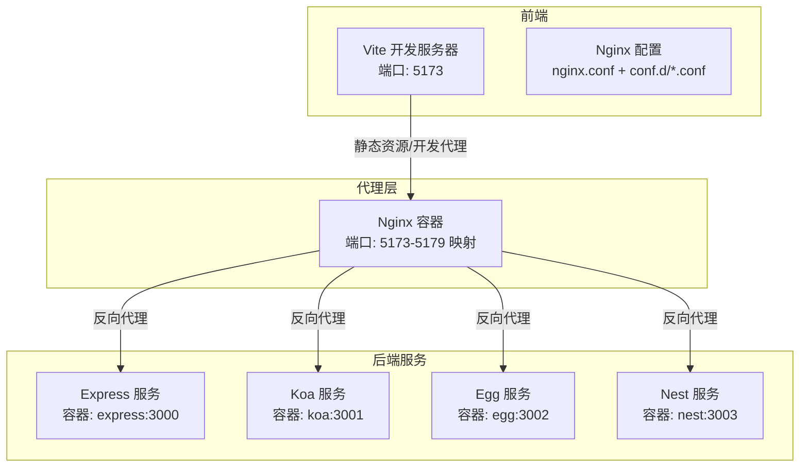
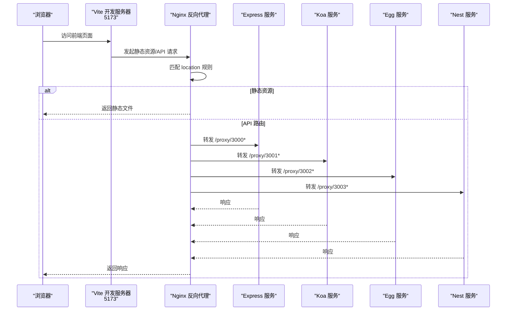
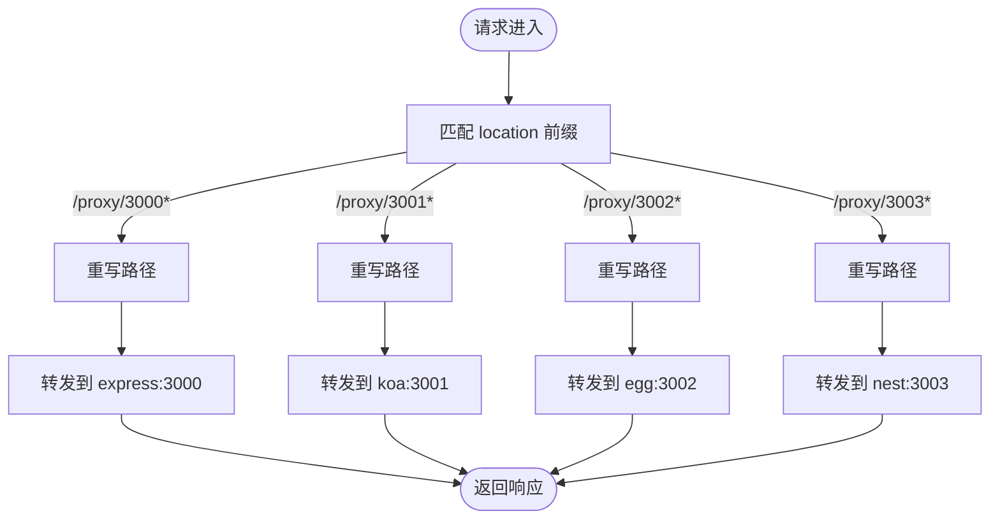
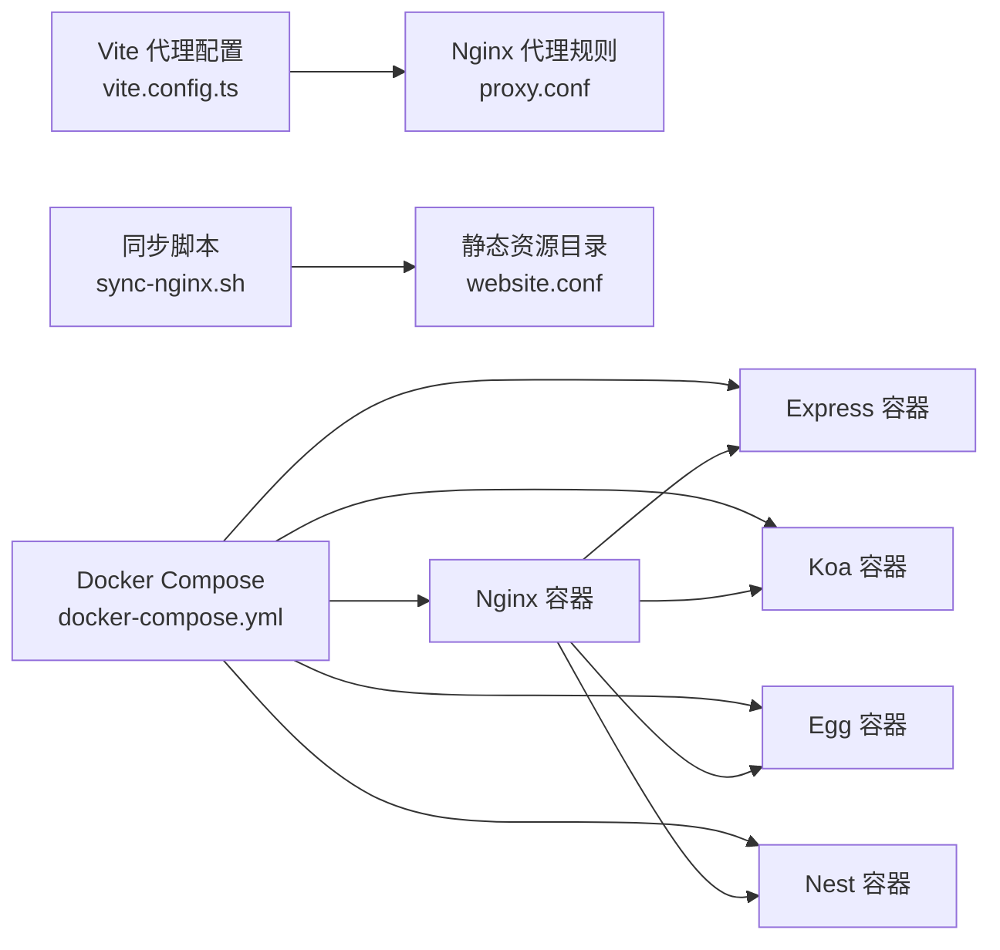

# Nginx反向代理

<cite>
**本文引用的文件**
- [nginx.conf](file://practice/vue3-frontend/cross-domain/nginx-conf/nginx.conf)
- [proxy.conf](file://practice/vue3-frontend/cross-domain/nginx-conf/conf.d/proxy.conf)
- [website.conf](file://practice/vue3-frontend/cross-domain/nginx-conf/conf.d/website.conf)
- [docker-compose.yml](file://practice/docker-env/cross-domain/compose/docker-compose.yml)
- [up.sh](file://practice/docker-env/cross-domain/bin/up.sh)
- [compose.sh](file://practice/docker-env/cross-domain/bin/compose.sh)
- [down.sh](file://practice/docker-env/cross-domain/bin/down.sh)
- [sync-nginx.sh](file://practice/vue3-frontend/cross-domain/sync-nginx.sh)
- [vite.config.ts](file://practice/vue3-frontend/cross-domain/vite.config.ts)
- [app.js（Express）](file://practice/nodejs-service/express/cross-domain/app.js)
- [app.js（Koa）](file://practice/nodejs-service/koa/cross-domain/app.js)
- [config.default.ts（Egg）](file://practice/nodejs-service/egg/cross-domain/config/config.default.ts)
</cite>

## 目录
1. [简介](#简介)
2. [项目结构](#项目结构)
3. [核心组件](#核心组件)
4. [架构总览](#架构总览)
5. [详细组件分析](#详细组件分析)
6. [依赖关系分析](#依赖关系分析)
7. [性能考虑](#性能考虑)
8. [故障排查指南](#故障排查指南)
9. [结论](#结论)
10. [附录](#附录)

## 简介
本指南围绕仓库中的Nginx反向代理实践进行系统化梳理，重点覆盖以下方面：
- Nginx配置文件结构与模块化组织（主配置与include机制）
- 反向代理规则：静态资源服务、API路由转发、跨域处理
- 负载均衡策略与健康检查（概念性说明）
- SSL/TLS证书与HTTPS重定向（概念性说明）
- 性能优化：连接池、缓存策略、压缩配置
- 实用运维：热部署、配置验证、故障排查

本指南在不直接展示具体代码内容的前提下，通过“章节来源”与“图示来源”标注具体实现位置，帮助读者快速定位到仓库中的真实配置。

## 项目结构
该工程采用“前端+多后端服务+Nginx代理”的组合架构，并通过Docker Compose统一编排。Nginx作为反向代理位于前端与后端服务之间，负责：
- 将静态资源请求直接交由Nginx本地目录提供
- 将特定路径的API请求转发至对应后端服务容器
- 提供日志与运行环境隔离

图表来源
- [nginx.conf:22-44](file://practice/vue3-frontend/cross-domain/nginx-conf/nginx.conf#L22-L44)
- [proxy.conf:1-20](file://practice/vue3-frontend/cross-domain/nginx-conf/conf.d/proxy.conf#L1-L20)
- [website.conf:1-11](file://practice/vue3-frontend/cross-domain/nginx-conf/conf.d/website.conf#L1-L11)
- [docker-compose.yml:4-65](file://practice/docker-env/cross-domain/compose/docker-compose.yml#L4-L65)

章节来源
- [nginx.conf:1-46](file://practice/vue3-frontend/cross-domain/nginx-conf/nginx.conf#L1-L46)
- [proxy.conf:1-20](file://practice/vue3-frontend/cross-domain/nginx-conf/conf.d/proxy.conf#L1-L20)
- [website.conf:1-11](file://practice/vue3-frontend/cross-domain/nginx-conf/conf.d/website.conf#L1-L11)
- [docker-compose.yml:1-67](file://practice/docker-env/cross-domain/compose/docker-compose.yml#L1-L67)

## 核心组件
- 主配置与模块化管理
  - 主配置文件通过include方式加载模块化配置，便于维护与扩展
  - 模块化配置拆分为反向代理规则与静态资源服务两部分
- 反向代理规则
  - 基于路径前缀的location匹配，将请求重写后转发至后端容器
  - 支持多端口监听与多server块组织
- 静态资源服务
  - 使用root与try_files实现SPA回退与静态资源命中
  - 对HTML类文件设置no-cache头，避免浏览器缓存
- 运维脚本
  - Docker Compose编排与容器生命周期管理
  - 前端构建产物同步至Nginx网站目录

章节来源
- [nginx.conf:9-45](file://practice/vue3-frontend/cross-domain/nginx-conf/nginx.conf#L9-L45)
- [proxy.conf:1-20](file://practice/vue3-frontend/cross-domain/nginx-conf/conf.d/proxy.conf#L1-L20)
- [website.conf:1-11](file://practice/vue3-frontend/cross-domain/nginx-conf/conf.d/website.conf#L1-L11)
- [docker-compose.yml:1-67](file://practice/docker-env/cross-domain/compose/docker-compose.yml#L1-L67)
- [sync-nginx.sh:1-11](file://practice/vue3-frontend/cross-domain/sync-nginx.sh#L1-L11)

## 架构总览
下图展示了从浏览器到后端服务的完整链路，以及Nginx在其中承担的角色。

图表来源
- [nginx.conf:22-44](file://practice/vue3-frontend/cross-domain/nginx-conf/nginx.conf#L22-L44)
- [proxy.conf:1-20](file://practice/vue3-frontend/cross-domain/nginx-conf/conf.d/proxy.conf#L1-L20)
- [website.conf:1-11](file://practice/vue3-frontend/cross-domain/nginx-conf/conf.d/website.conf#L1-L11)
- [docker-compose.yml:4-65](file://practice/docker-env/cross-domain/compose/docker-compose.yml#L4-L65)

## 详细组件分析

### Nginx主配置与模块化组织
- 主配置文件定义全局事件与HTTP块，启用sendfile与长连接超时
- 多个server块分别监听不同端口，均include同一套模块化配置
- include conf.d/*.conf实现规则解耦，便于按功能拆分

章节来源
- [nginx.conf:1-46](file://practice/vue3-frontend/cross-domain/nginx-conf/nginx.conf#L1-L46)

### 反向代理规则（API路由转发）
- 基于location前缀匹配，对路径进行rewrite后转发
- 每个后端服务（Express/Koa/Egg/Nest）映射到不同的端口前缀
- 通过容器别名实现服务发现与通信

图表来源
- [proxy.conf:1-20](file://practice/vue3-frontend/cross-domain/nginx-conf/conf.d/proxy.conf#L1-L20)

章节来源
- [proxy.conf:1-20](file://practice/vue3-frontend/cross-domain/nginx-conf/conf.d/proxy.conf#L1-L20)

### 静态资源服务（SPA与缓存控制）
- 根目录指向网站根，支持index回退
- HTML类文件设置no-cache头，避免缓存导致的开发调试问题
- try_files实现SPA单页应用回退逻辑

章节来源
- [website.conf:1-11](file://practice/vue3-frontend/cross-domain/nginx-conf/conf.d/website.conf#L1-L11)

### 跨域处理（概念性说明）
- 在Nginx层面可设置CORS相关响应头，但本仓库中未直接在Nginx配置中体现
- 后端服务（如Egg）已内置CORS配置，可作为参考
- 若需在Nginx侧统一处理跨域，可在location或http块中添加add_header指令

章节来源
- [config.default.ts（Egg）:24-41](file://practice/nodejs-service/egg/cross-domain/config/config.default.ts#L24-L41)

### 负载均衡与健康检查（概念性说明）
- Nginx可通过upstream块定义后端组，结合轮询/权重/健康检查实现高可用
- 本仓库未使用upstream，建议在生产环境中引入
- 健康检查可借助第三方探针或Nginx Plus特性实现

### SSL/TLS与HTTPS重定向（概念性说明）
- 生产环境建议启用TLS证书与HTTPS重定向
- 可在server块中监听443端口并配置ssl_certificate/ssl_certificate_key
- 通过return 301强制跳转至HTTPS

## 依赖关系分析
- 前端开发代理与Nginx代理保持一致的路径前缀，确保开发与生产的路由行为一致
- Docker Compose为各服务提供网络互通与容器别名，简化proxy_pass目标地址
- 前端构建产物通过脚本同步至Nginx网站目录，保证静态资源可用

图表来源
- [vite.config.ts:15-38](file://practice/vue3-frontend/cross-domain/vite.config.ts#L15-L38)
- [proxy.conf:1-20](file://practice/vue3-frontend/cross-domain/nginx-conf/conf.d/proxy.conf#L1-L20)
- [website.conf:7-10](file://practice/vue3-frontend/cross-domain/nginx-conf/conf.d/website.conf#L7-L10)
- [docker-compose.yml:4-65](file://practice/docker-env/cross-domain/compose/docker-compose.yml#L4-L65)
- [sync-nginx.sh:9-10](file://practice/vue3-frontend/cross-domain/sync-nginx.sh#L9-L10)

章节来源
- [vite.config.ts:1-40](file://practice/vue3-frontend/cross-domain/vite.config.ts#L1-L40)
- [docker-compose.yml:1-67](file://practice/docker-env/cross-domain/compose/docker-compose.yml#L1-L67)
- [sync-nginx.sh:1-11](file://practice/vue3-frontend/cross-domain/sync-nginx.sh#L1-L11)

## 性能考虑
- 连接与并发
  - 合理设置worker_processes与worker_connections，平衡CPU核数与并发能力
  - 启用sendfile与适度的keepalive_timeout，降低握手开销
- 缓存策略
  - 对静态资源设置合理的Cache-Control与过期时间，减少带宽占用
  - SPA场景下对HTML设置no-cache，避免开发调试时的缓存干扰
- 压缩与传输
  - 在生产环境开启gzip等压缩，降低传输体积
- 日志与监控
  - 启用rewrite_log便于调试，生产环境谨慎开启
  - 结合access/error日志与外部监控工具进行性能观测

## 故障排查指南
- 配置验证
  - 使用Docker Compose命令行参数执行配置测试（例如在容器内执行Nginx配置校验命令）
  - 修改配置后重启Nginx容器，观察日志输出
- 日志定位
  - 查看Nginx访问与错误日志，定位4xx/5xx错误与上游异常
  - 关注代理路径rewrite是否正确，确认proxy_pass目标可达
- 常见问题
  - 路径不匹配：检查location前缀与rewrite规则
  - 容器不可达：确认Docker网络与容器别名
  - 静态资源404：确认root路径与try_files回退逻辑
  - 跨域失败：检查后端CORS配置或在Nginx侧补充CORS头

章节来源
- [up.sh:1-6](file://practice/docker-env/cross-domain/bin/up.sh#L1-L6)
- [compose.sh:1-6](file://practice/docker-env/cross-domain/bin/compose.sh#L1-L6)
- [down.sh:1-6](file://practice/docker-env/cross-domain/bin/down.sh#L1-L6)

## 结论
本仓库提供了基于Nginx的反向代理实践范例，通过模块化配置与Docker Compose编排，实现了静态资源服务与多后端API转发的清晰分离。建议在生产环境中进一步完善：
- 引入upstream与健康检查，提升可用性
- 配置TLS证书与HTTPS重定向，保障安全
- 优化缓存与压缩策略，提升性能
- 建立完善的日志与监控体系，支撑持续运维

## 附录
- 快速操作
  - 启动：执行编排脚本启动所有服务
  - 停止：执行编排脚本停止并清理镜像
  - 同步：构建前端后，使用同步脚本将产物复制到Nginx目录
- 参考实现
  - 前端开发代理与Nginx代理路径保持一致，便于一致性验证

章节来源
- [up.sh:1-6](file://practice/docker-env/cross-domain/bin/up.sh#L1-L6)
- [compose.sh:1-6](file://practice/docker-env/cross-domain/bin/compose.sh#L1-L6)
- [down.sh:1-6](file://practice/docker-env/cross-domain/bin/down.sh#L1-L6)
- [sync-nginx.sh:1-11](file://practice/vue3-frontend/cross-domain/sync-nginx.sh#L1-L11)
- [vite.config.ts:15-38](file://practice/vue3-frontend/cross-domain/vite.config.ts#L15-L38)