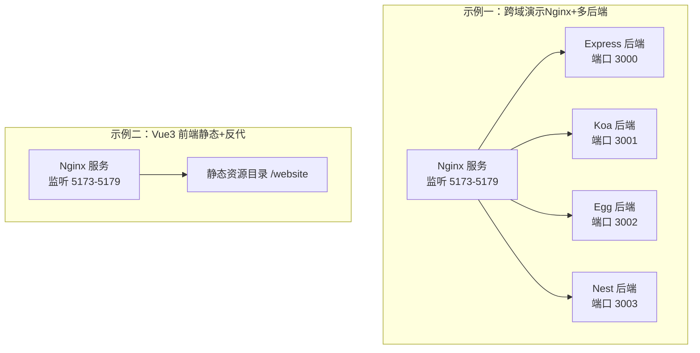
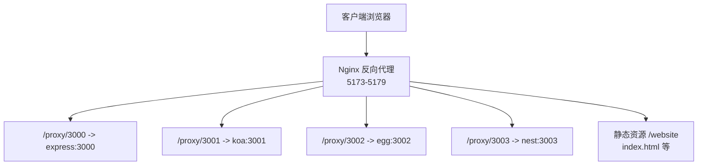
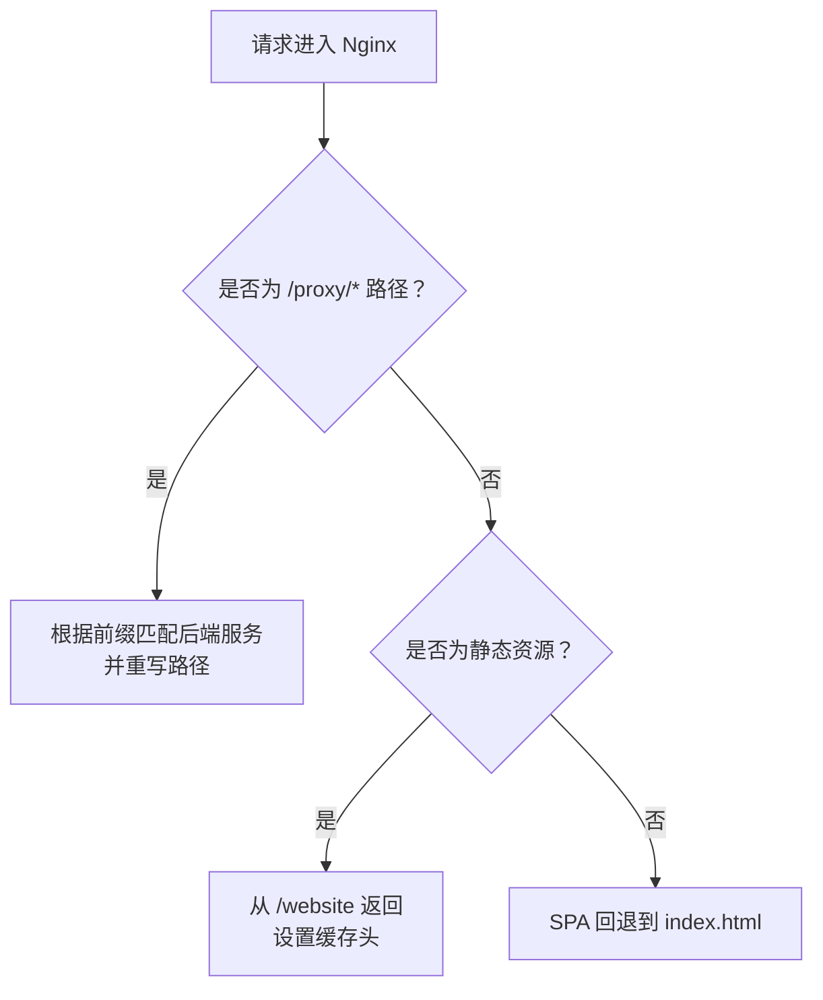
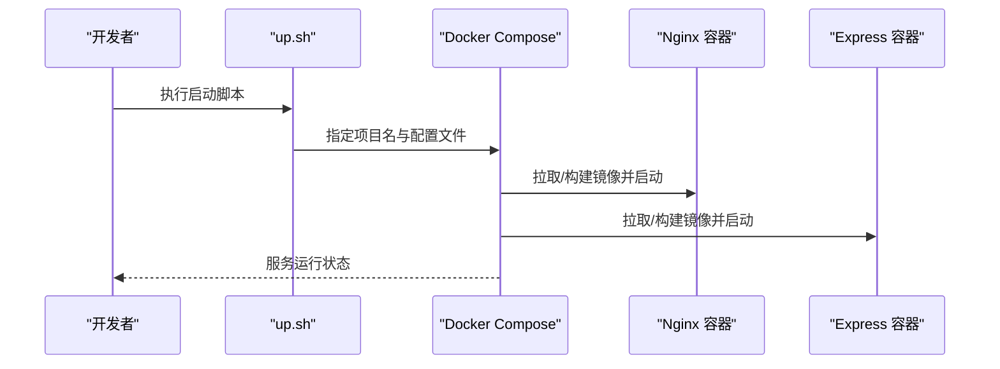
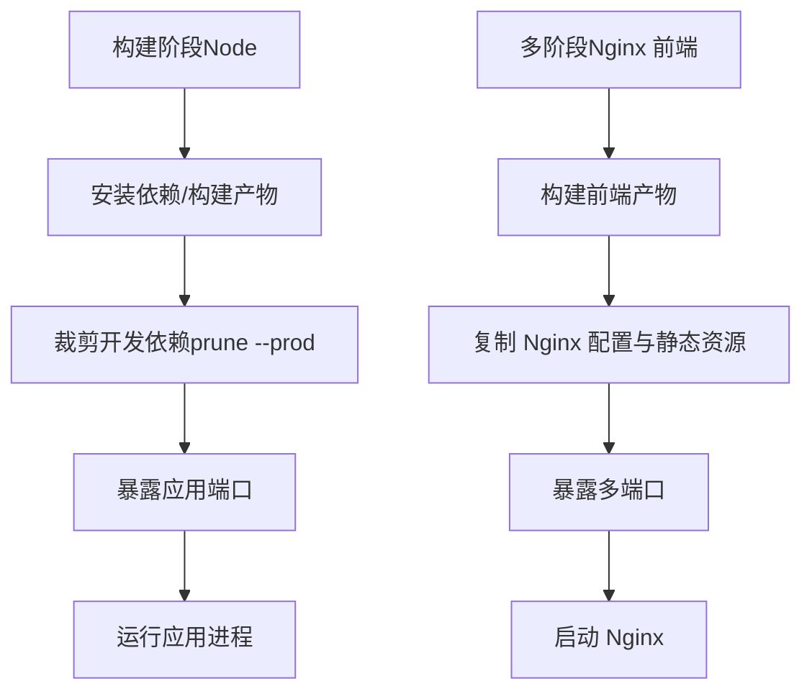
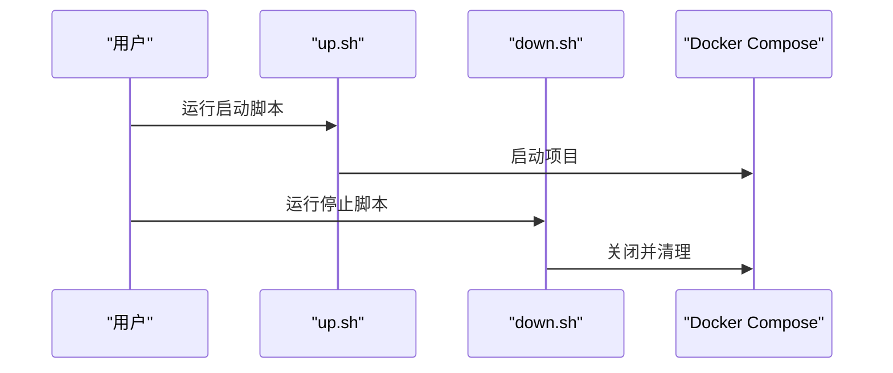

# 容器化部署

<cite>
**本文引用的文件**
- [docker-envs/README.zh-CN.md](file://docker-envs/README.zh-CN.md)
- [practice/docker-env/cross-domain/README.md](file://practice/docker-env/cross-domain/README.md)
- [practice/docker-env/docker-image/README.md](file://practice/docker-env/docker-image/README.md)
- [practice/docker-env/cross-domain/compose/docker-compose.yml](file://practice/docker-env/cross-domain/compose/docker-compose.yml)
- [practice/docker-env/docker-image/compose/docker-compose.yml](file://practice/docker-env/docker-image/compose/docker-compose.yml)
- [practice/docker-env/cross-domain/bin/up.sh](file://practice/docker-env/cross-domain/bin/up.sh)
- [practice/docker-env/cross-domain/bin/down.sh](file://practice/docker-env/cross-domain/bin/down.sh)
- [practice/vue3-frontend/cross-domain/dockerfile](file://practice/vue3-frontend/cross-domain/dockerfile)
- [practice/vue3-frontend/cross-domain/nginx-conf/nginx.conf](file://practice/vue3-frontend/cross-domain/nginx-conf/nginx.conf)
- [practice/vue3-frontend/cross-domain/nginx-conf/conf.d/proxy.conf](file://practice/vue3-frontend/cross-domain/nginx-conf/conf.d/proxy.conf)
- [practice/vue3-frontend/cross-domain/nginx-conf/conf.d/website.conf](file://practice/vue3-frontend/cross-domain/nginx-conf/conf.d/website.conf)
- [practice/nodejs-service/express/docker-image/dockerfile](file://practice/nodejs-service/express/docker-image/dockerfile)
- [practice/nodejs-service/koa/docker-image/dockerfile](file://practice/nodejs-service/koa/docker-image/dockerfile)
- [practice/nodejs-service/egg/docker-image/dockerfile](file://practice/nodejs-service/egg/docker-image/dockerfile)
- [practice/nodejs-service/nest/docker-image/dockerfile](file://practice/nodejs-service/nest/docker-image/dockerfile)
</cite>

## 目录
1. [简介](#简介)
2. [项目结构](#项目结构)
3. [核心组件](#核心组件)
4. [架构总览](#架构总览)
5. [详细组件分析](#详细组件分析)
6. [依赖关系分析](#依赖关系分析)
7. [性能考量](#性能考量)
8. [故障排查指南](#故障排查指南)
9. [结论](#结论)
10. [附录](#附录)

## 简介
本指南面向企业级容器化部署，基于仓库中的示例工程，系统讲解以下内容：
- Docker 镜像构建最佳实践：Dockerfile 编写规范、多阶段构建与镜像优化策略
- Docker Compose 编排：服务定义、网络、卷挂载与环境变量管理
- Nginx 反向代理与负载均衡：静态资源分发、后端服务路由与缓存控制
- 生产部署流程：环境准备、服务启动、健康检查与监控配置
- 安全与可靠性：容器安全加固、资源限制与故障恢复方案

## 项目结构
该仓库提供了两类典型场景的容器化示例：
- 前端多端口 Nginx 反向代理 + 多后端 Node.js 框架（Express/Koa/Egg/Nest）组合
- 单一前端应用（Vue3）多端口 Nginx 作为静态站点与反向代理



图表来源
- [practice/docker-env/cross-domain/compose/docker-compose.yml:1-67](file://practice/docker-env/cross-domain/compose/docker-compose.yml#L1-L67)
- [practice/docker-env/docker-image/compose/docker-compose.yml:1-53](file://practice/docker-env/docker-image/compose/docker-compose.yml#L1-L53)
- [practice/vue3-frontend/cross-domain/nginx-conf/nginx.conf:22-45](file://practice/vue3-frontend/cross-domain/nginx-conf/nginx.conf#L22-L45)

章节来源
- [practice/docker-env/cross-domain/README.md:1-18](file://practice/docker-env/cross-domain/README.md#L1-L18)
- [practice/docker-env/docker-image/README.md:1-18](file://practice/docker-env/docker-image/README.md#L1-L18)

## 核心组件
- Nginx 反向代理与静态站点
  - 提供多端口监听（5173-5179），统一入口与静态资源分发
  - 通过 include 引入子配置，实现模块化管理
- Express/Koa/Egg/Nest 后端服务
  - 分别暴露 3000/3001/3002/3003 端口，由 Nginx 路由转发
- Docker Compose 编排
  - 统一定义服务、网络、端口映射与卷挂载
- Shell 启停脚本
  - 封装 compose up/down，支持命名空间隔离

章节来源
- [practice/vue3-frontend/cross-domain/nginx-conf/nginx.conf:22-45](file://practice/vue3-frontend/cross-domain/nginx-conf/nginx.conf#L22-L45)
- [practice/vue3-frontend/cross-domain/nginx-conf/conf.d/proxy.conf:1-20](file://practice/vue3-frontend/cross-domain/nginx-conf/conf.d/proxy.conf#L1-L20)
- [practice/vue3-frontend/cross-domain/nginx-conf/conf.d/website.conf:1-11](file://practice/vue3-frontend/cross-domain/nginx-conf/conf.d/website.conf#L1-L11)
- [practice/docker-env/cross-domain/compose/docker-compose.yml:1-67](file://practice/docker-env/cross-domain/compose/docker-compose.yml#L1-L67)
- [practice/docker-env/docker-image/compose/docker-compose.yml:1-53](file://practice/docker-env/docker-image/compose/docker-compose.yml#L1-L53)
- [practice/docker-env/cross-domain/bin/up.sh:1-6](file://practice/docker-env/cross-domain/bin/up.sh#L1-L6)
- [practice/docker-env/cross-domain/bin/down.sh:1-6](file://practice/docker-env/cross-domain/bin/down.sh#L1-L6)

## 架构总览
下图展示“前端 Nginx + 多后端 Node.js”在容器内的交互关系。



图表来源
- [practice/vue3-frontend/cross-domain/nginx-conf/nginx.conf:22-45](file://practice/vue3-frontend/cross-domain/nginx-conf/nginx.conf#L22-L45)
- [practice/vue3-frontend/cross-domain/nginx-conf/conf.d/proxy.conf:1-20](file://practice/vue3-frontend/cross-domain/nginx-conf/conf.d/proxy.conf#L1-L20)
- [practice/vue3-frontend/cross-domain/nginx-conf/conf.d/website.conf:1-11](file://practice/vue3-frontend/cross-domain/nginx-conf/conf.d/website.conf#L1-L11)
- [practice/docker-env/cross-domain/compose/docker-compose.yml:1-67](file://practice/docker-env/cross-domain/compose/docker-compose.yml#L1-L67)

## 详细组件分析

### Nginx 配置与反向代理
- 多 server 块：分别监听 5173/5174/5175，统一包含公共配置
- 反向代理规则：按路径前缀将请求转发到对应后端服务
- 静态站点：根目录指向 /website，支持 SPA 回退到 index.html
- 缓存控制：对 HTML/HTM 设置 no-cache，避免开发期缓存干扰



图表来源
- [practice/vue3-frontend/cross-domain/nginx-conf/nginx.conf:22-45](file://practice/vue3-frontend/cross-domain/nginx-conf/nginx.conf#L22-L45)
- [practice/vue3-frontend/cross-domain/nginx-conf/conf.d/proxy.conf:1-20](file://practice/vue3-frontend/cross-domain/nginx-conf/conf.d/proxy.conf#L1-L20)
- [practice/vue3-frontend/cross-domain/nginx-conf/conf.d/website.conf:1-11](file://practice/vue3-frontend/cross-domain/nginx-conf/conf.d/website.conf#L1-L11)

章节来源
- [practice/vue3-frontend/cross-domain/nginx-conf/nginx.conf:1-46](file://practice/vue3-frontend/cross-domain/nginx-conf/nginx.conf#L1-L46)
- [practice/vue3-frontend/cross-domain/nginx-conf/conf.d/proxy.conf:1-20](file://practice/vue3-frontend/cross-domain/nginx-conf/conf.d/proxy.conf#L1-L20)
- [practice/vue3-frontend/cross-domain/nginx-conf/conf.d/website.conf:1-11](file://practice/vue3-frontend/cross-domain/nginx-conf/conf.d/website.conf#L1-L11)

### Docker Compose 编排
- 服务定义：每个服务均指定平台、构建上下文与 Dockerfile、重启策略、端口映射、网络与别名
- 网络：统一使用名为 all 的自定义网络，便于服务间通过别名通信
- 卷挂载：Nginx 将日志目录挂载到宿主机，便于运维审计与问题定位
- 命名空间：通过 -p cross-domain 区分不同环境或任务的 compose 实例



图表来源
- [practice/docker-env/cross-domain/bin/up.sh:1-6](file://practice/docker-env/cross-domain/bin/up.sh#L1-L6)
- [practice/docker-env/cross-domain/compose/docker-compose.yml:1-67](file://practice/docker-env/cross-domain/compose/docker-compose.yml#L1-L67)

章节来源
- [practice/docker-env/cross-domain/compose/docker-compose.yml:1-67](file://practice/docker-env/cross-domain/compose/docker-compose.yml#L1-L67)
- [practice/docker-env/docker-image/compose/docker-compose.yml:1-53](file://practice/docker-env/docker-image/compose/docker-compose.yml#L1-L53)
- [practice/docker-env/cross-domain/bin/up.sh:1-6](file://practice/docker-env/cross-domain/bin/up.sh#L1-L6)
- [practice/docker-env/cross-domain/bin/down.sh:1-6](file://practice/docker-env/cross-domain/bin/down.sh#L1-L6)

### Dockerfile 最佳实践与多阶段优化
- Node.js 应用（Express/Koa/Egg/Nest）
  - 使用 alpine 基础镜像减小体积
  - 使用 pnpm 并在构建后执行裁剪（prune --prod）移除开发依赖
  - 显式 WORKDIR 与 COPY 顺序优化层缓存
- Vue3 前端（多端口 Nginx）
  - 多阶段构建：第一阶段构建前端产物，第二阶段仅复制静态资源与 Nginx 配置
  - 在生产阶段仅保留 Nginx 与最小化静态文件，显著降低镜像体积
  - 暴露多端口以满足本地联调与反向代理需求



图表来源
- [practice/nodejs-service/express/docker-image/dockerfile:1-20](file://practice/nodejs-service/express/docker-image/dockerfile#L1-L20)
- [practice/nodejs-service/koa/docker-image/dockerfile:1-26](file://practice/nodejs-service/koa/docker-image/dockerfile#L1-L26)
- [practice/nodejs-service/egg/docker-image/dockerfile:1-26](file://practice/nodejs-service/egg/docker-image/dockerfile#L1-L26)
- [practice/nodejs-service/nest/docker-image/dockerfile:1-26](file://practice/nodejs-service/nest/docker-image/dockerfile#L1-L26)
- [practice/vue3-frontend/cross-domain/dockerfile:1-37](file://practice/vue3-frontend/cross-domain/dockerfile#L1-L37)

章节来源
- [practice/nodejs-service/express/docker-image/dockerfile:1-20](file://practice/nodejs-service/express/docker-image/dockerfile#L1-L20)
- [practice/nodejs-service/koa/docker-image/dockerfile:1-26](file://practice/nodejs-service/koa/docker-image/dockerfile#L1-L26)
- [practice/nodejs-service/egg/docker-image/dockerfile:1-26](file://practice/nodejs-service/egg/docker-image/dockerfile#L1-L26)
- [practice/nodejs-service/nest/docker-image/dockerfile:1-26](file://practice/nodejs-service/nest/docker-image/dockerfile#L1-L26)
- [practice/vue3-frontend/cross-domain/dockerfile:1-37](file://practice/vue3-frontend/cross-domain/dockerfile#L1-L37)

### 启动与停止流程
- 启动：进入示例目录，执行 bin/up.sh，compose 以分离模式启动所有服务
- 停止：执行 bin/down.sh，关闭并清理本地镜像（可选）



图表来源
- [practice/docker-env/cross-domain/bin/up.sh:1-6](file://practice/docker-env/cross-domain/bin/up.sh#L1-L6)
- [practice/docker-env/cross-domain/bin/down.sh:1-6](file://practice/docker-env/cross-domain/bin/down.sh#L1-L6)

章节来源
- [practice/docker-env/cross-domain/README.md:1-18](file://practice/docker-env/cross-domain/README.md#L1-L18)
- [practice/docker-env/docker-image/README.md:1-18](file://practice/docker-env/docker-image/README.md#L1-L18)

## 依赖关系分析
- 服务耦合
  - Nginx 依赖后端服务别名进行通信（express/koa/egg/nest）
  - 后端服务之间无直接耦合，通过 Nginx 统一入口
- 网络与端口
  - Nginx 暴露 5173-5179，后端各自暴露 3000-3003
  - 端口映射采用一对一或范围映射，便于本地调试
- 卷与持久化
  - Nginx 日志目录挂载到宿主机，便于审计与问题追踪

```mermaid
graph LR
N["Nginx"] -- "反向代理" --> E["Express:3000"]
N -- "反向代理" --> K["Koa:3001"]
N -- "反向代理" --> G["Egg:3002"]
N -- "反向代理" --> T["Nest:3003"]
V["宿主机日志卷"] <- --> N
```

图表来源
- [practice/docker-env/cross-domain/compose/docker-compose.yml:1-67](file://practice/docker-env/cross-domain/compose/docker-compose.yml#L1-L67)
- [practice/vue3-frontend/cross-domain/nginx-conf/nginx.conf:17-18](file://practice/vue3-frontend/cross-domain/nginx-conf/nginx.conf#L17-L18)

章节来源
- [practice/docker-env/cross-domain/compose/docker-compose.yml:1-67](file://practice/docker-env/cross-domain/compose/docker-compose.yml#L1-L67)
- [practice/docker-env/docker-image/compose/docker-compose.yml:1-53](file://practice/docker-env/docker-image/compose/docker-compose.yml#L1-L53)

## 性能考量
- 镜像体积优化
  - 使用 alpine 基础镜像与包管理器裁剪
  - 多阶段构建仅保留运行时所需文件
- 层缓存优化
  - 将依赖安装与源码拷贝拆分为独立层，减少重复构建时间
- 进程与并发
  - Nginx worker 连接数与 keepalive 超时参数可根据业务调整
  - 后端服务建议结合进程/集群模式（示例工程已提供多进程/PM2 示例）

[本节为通用指导，不直接分析具体文件]

## 故障排查指南
- 无法访问静态页面
  - 检查 Nginx 是否正确挂载 /website 目录与 include 子配置
  - 确认 try_files 回退逻辑生效
- 反向代理 404 或路径异常
  - 核对 proxy_pass 与 location 前缀是否一致
  - 检查后端服务别名与端口映射
- 日志定位
  - 查看 Nginx 访问/错误日志（宿主机挂载目录）
- 启停问题
  - 使用 up.sh/down.sh 确保 compose 项目名与配置路径一致
  - 如需清理本地镜像，可在 down.sh 中保留或启用删除逻辑

章节来源
- [practice/vue3-frontend/cross-domain/nginx-conf/conf.d/website.conf:1-11](file://practice/vue3-frontend/cross-domain/nginx-conf/conf.d/website.conf#L1-L11)
- [practice/vue3-frontend/cross-domain/nginx-conf/conf.d/proxy.conf:1-20](file://practice/vue3-frontend/cross-domain/nginx-conf/conf.d/proxy.conf#L1-L20)
- [practice/docker-env/cross-domain/bin/up.sh:1-6](file://practice/docker-env/cross-domain/bin/up.sh#L1-L6)
- [practice/docker-env/cross-domain/bin/down.sh:1-6](file://practice/docker-env/cross-domain/bin/down.sh#L1-L6)

## 结论
本指南基于仓库中的真实示例，总结了容器化部署的关键环节：镜像构建、编排与反向代理。通过多阶段构建与 alpine 基础镜像，显著降低镜像体积；通过 Nginx 的多端口与反向代理能力，实现前端静态资源与后端服务的统一接入。配合 Compose 的网络与卷管理，以及脚本化的启停流程，可快速落地企业级容器化方案。

[本节为总结性内容，不直接分析具体文件]

## 附录

### A. Dockerfile 编写规范清单
- 明确基础镜像版本与架构（如 linux/amd64）
- 使用 .dockerignore 排除无关文件
- 依赖安装与源码拷贝分层，提升缓存命中率
- 构建后清理开发依赖与临时文件
- 显式声明 EXPOSE 端口
- 使用非 root 用户运行（建议在生产镜像中实施）

章节来源
- [practice/nodejs-service/express/docker-image/dockerfile:1-20](file://practice/nodejs-service/express/docker-image/dockerfile#L1-L20)
- [practice/nodejs-service/koa/docker-image/dockerfile:1-26](file://practice/nodejs-service/koa/docker-image/dockerfile#L1-L26)
- [practice/nodejs-service/egg/docker-image/dockerfile:1-26](file://practice/nodejs-service/egg/docker-image/dockerfile#L1-L26)
- [practice/nodejs-service/nest/docker-image/dockerfile:1-26](file://practice/nodejs-service/nest/docker-image/dockerfile#L1-L26)
- [practice/vue3-frontend/cross-domain/dockerfile:1-37](file://practice/vue3-frontend/cross-domain/dockerfile#L1-L37)

### B. Docker Compose 配置要点
- 服务平台与构建上下文明确
- 端口映射清晰，避免冲突
- 自定义网络与服务别名确保内部通信稳定
- 卷挂载用于日志与数据持久化
- 重启策略与健康检查（建议在生产中补充）

章节来源
- [practice/docker-env/cross-domain/compose/docker-compose.yml:1-67](file://practice/docker-env/cross-domain/compose/docker-compose.yml#L1-L67)
- [practice/docker-env/docker-image/compose/docker-compose.yml:1-53](file://practice/docker-env/docker-image/compose/docker-compose.yml#L1-L53)

### C. Nginx 反向代理与负载均衡
- 路径前缀区分不同后端服务
- 支持多端口监听，便于本地联调
- 静态资源缓存与 SPA 回退策略
- 负载均衡：可在上游增加多个实例或使用外部 LB（建议在生产中扩展）

章节来源
- [practice/vue3-frontend/cross-domain/nginx-conf/nginx.conf:22-45](file://practice/vue3-frontend/cross-domain/nginx-conf/nginx.conf#L22-L45)
- [practice/vue3-frontend/cross-domain/nginx-conf/conf.d/proxy.conf:1-20](file://practice/vue3-frontend/cross-domain/nginx-conf/conf.d/proxy.conf#L1-L20)
- [practice/vue3-frontend/cross-domain/nginx-conf/conf.d/website.conf:1-11](file://practice/vue3-frontend/cross-domain/nginx-conf/conf.d/website.conf#L1-L11)

### D. 生产部署流程建议
- 环境准备
  - 准备生产镜像仓库与凭证
  - 规划网络与 DNS，确保服务可达
- 服务启动
  - 使用 Compose 或编排平台（K8s/Harbor 等）部署
  - 启用健康检查与自动重启
- 监控与告警
  - 收集 Nginx 与应用日志，接入集中化日志系统
  - 指标采集（CPU/内存/请求量/错误率）
- 安全与合规
  - 使用只读根文件系统、drop unnecessary capabilities
  - 限制资源配额（CPU/内存/文件句柄）
  - 定期扫描镜像漏洞并更新基础镜像

[本节为通用指导，不直接分析具体文件]

### E. 容器安全与资源限制
- 安全基线
  - 非 root 运行、最小权限原则
  - 禁用不必要网络与设备访问
- 资源限制
  - 在 Compose 中添加 deploy.resources.limits 和 reservations
- 故障恢复
  - 启用 restart 策略与健康检查
  - 多副本部署与滚动升级

[本节为通用指导，不直接分析具体文件]