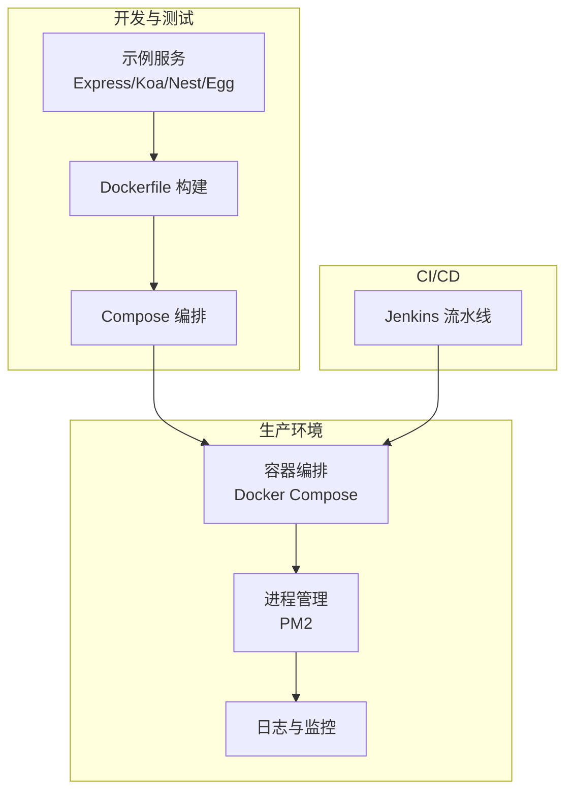
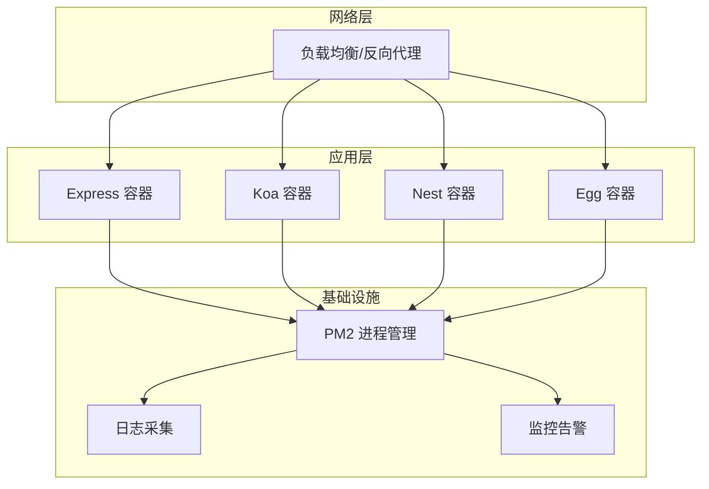
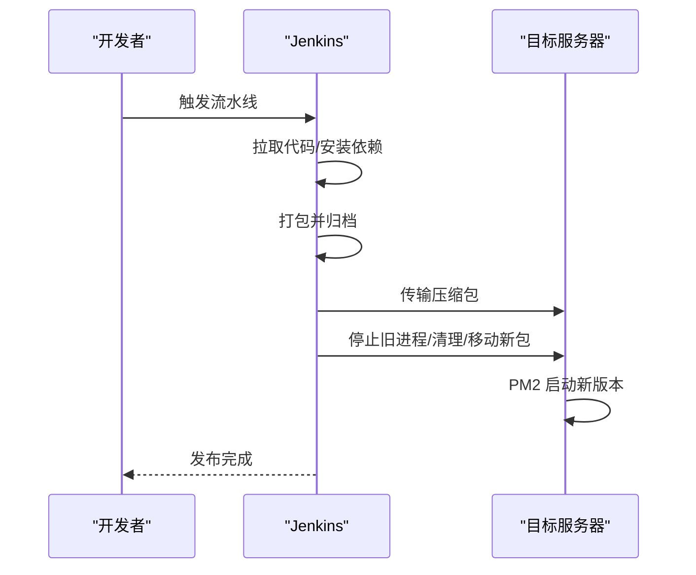
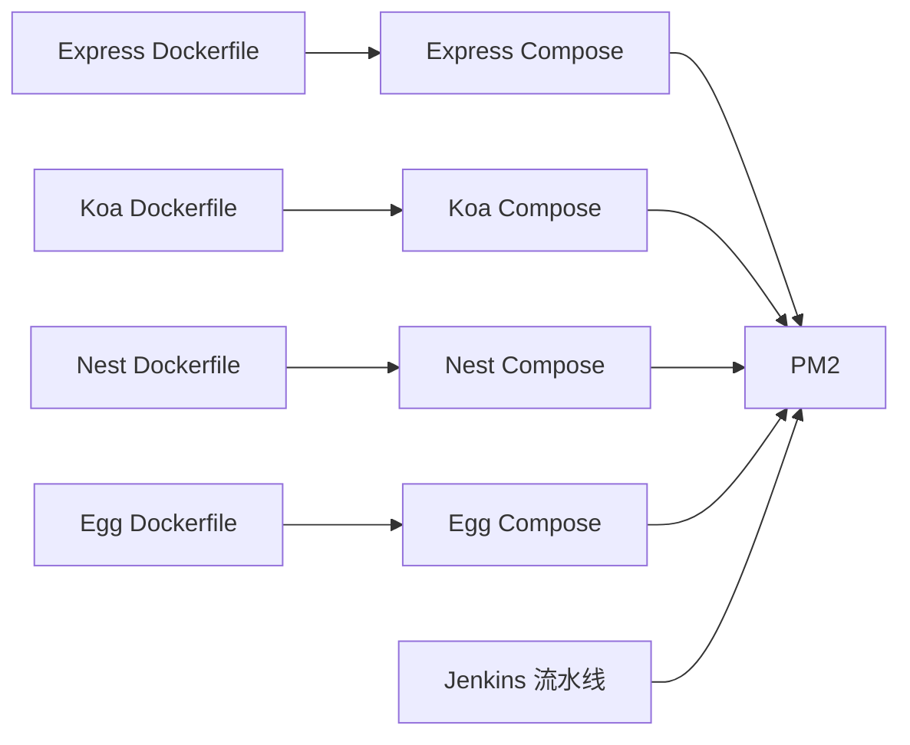

# 生产环境部署

<cite>
**本文引用的文件**
- [env-prepare/README.zh-CN.md](file://env-prepare/README.zh-CN.md)
- [docker-envs/README.zh-CN.md](file://docker-envs/README.zh-CN.md)
- [practice/docker-env/docker-image/compose/docker-compose.yml](file://practice/docker-env/docker-image/compose/docker-compose.yml)
- [practice/docker-env/cross-domain/compose/docker-compose.yml](file://practice/docker-env/cross-domain/compose/docker-compose.yml)
- [practice/nodejs-service/egg/docker-image/dockerfile](file://practice/nodejs-service/egg/docker-image/dockerfile)
- [practice/nodejs-service/egg/docker-image/package.json](file://practice/nodejs-service/egg/docker-image/package.json)
- [practice/nodejs-service/express/docker-image/dockerfile](file://practice/nodejs-service/express/docker-image/dockerfile)
- [practice/nodejs-service/express/docker-image/package.json](file://practice/nodejs-service/express/docker-image/package.json)
- [practice/nodejs-service/koa/docker-image/dockerfile](file://practice/nodejs-service/koa/docker-image/dockerfile)
- [practice/nodejs-service/koa/docker-image/package.json](file://practice/nodejs-service/koa/docker-image/package.json)
- [practice/nodejs-service/nest/docker-image/dockerfile](file://practice/nodejs-service/nest/docker-image/dockerfile)
- [practice/nodejs-service/nest/docker-image/package.json](file://practice/nodejs-service/nest/docker-image/package.json)
- [ci&cd/jenkins/jenkinsfile/service.1.Jenkinsfile](file://ci&cd/jenkins/jenkinsfile/service.1.Jenkinsfile)
</cite>

## 目录
1. [引言](#引言)
2. [项目结构](#项目结构)
3. [核心组件](#核心组件)
4. [架构总览](#架构总览)
5. [详细组件分析](#详细组件分析)
6. [依赖关系分析](#依赖关系分析)
7. [性能考虑](#性能考虑)
8. [故障排查指南](#故障排查指南)
9. [结论](#结论)
10. [附录](#附录)

## 引言
本指南面向在生产环境中部署与运维基于 Node.js 的多框架示例（Express、Koa、Nest、Egg）的服务团队，目标是提供从服务器准备、网络与安全加固、部署流程、环境变量与启动顺序、健康检查、监控与日志、备份与恢复到性能调优与容量规划的完整实施建议。同时给出常见问题的诊断与解决思路。

## 项目结构
该仓库以“实践”为主，包含多种 Node.js 框架示例与 Docker 化编排样例，以及 CI/CD 流水线脚本。生产部署可直接复用其中的 Dockerfile、compose 编排与 PM2 启动配置，并结合 Jenkins 脚本实现自动化发布。

图示来源
- [practice/docker-env/docker-image/compose/docker-compose.yml:1-53](file://practice/docker-env/docker-image/compose/docker-compose.yml#L1-L53)
- [practice/nodejs-service/express/docker-image/dockerfile:1-20](file://practice/nodejs-service/express/docker-image/dockerfile#L1-L20)
- [ci&cd/jenkins/jenkinsfile/service.1.Jenkinsfile:1-150](file://ci&cd/jenkins/jenkinsfile/service.1.Jenkinsfile#L1-L150)

章节来源
- [practice/docker-env/docker-image/compose/docker-compose.yml:1-53](file://practice/docker-env/docker-image/compose/docker-compose.yml#L1-L53)
- [practice/docker-env/cross-domain/compose/docker-compose.yml:1-67](file://practice/docker-env/cross-domain/compose/docker-compose.yml#L1-L67)
- [ci&cd/jenkins/jenkinsfile/service.1.Jenkinsfile:1-150](file://ci&cd/jenkins/jenkinsfile/service.1.Jenkinsfile#L1-L150)

## 核心组件
- 容器化服务：Express、Koa、Nest、Egg 四类服务均提供独立的 Dockerfile 与 docker-compose 编排，便于按需组合部署。
- 进程管理：各服务通过 PM2 在容器内启动，支持守护模式与多进程集群。
- CI/CD：Jenkins 流水线负责拉取代码、安装依赖、打包、归档与远程部署。
- 日志：跨域示例中 Nginx 将日志挂载到宿主机目录，便于集中采集。

章节来源
- [practice/nodejs-service/express/docker-image/dockerfile:1-20](file://practice/nodejs-service/express/docker-image/dockerfile#L1-L20)
- [practice/nodejs-service/koa/docker-image/dockerfile:1-20](file://practice/nodejs-service/koa/docker-image/dockerfile#L1-L20)
- [practice/nodejs-service/nest/docker-image/dockerfile:1-26](file://practice/nodejs-service/nest/docker-image/dockerfile#L1-L26)
- [practice/nodejs-service/egg/docker-image/dockerfile:1-26](file://practice/nodejs-service/egg/docker-image/dockerfile#L1-L26)
- [practice/nodejs-service/express/docker-image/package.json:1-24](file://practice/nodejs-service/express/docker-image/package.json#L1-L24)
- [practice/nodejs-service/koa/docker-image/package.json:1-22](file://practice/nodejs-service/koa/docker-image/package.json#L1-L22)
- [practice/nodejs-service/nest/docker-image/package.json:1-69](file://practice/nodejs-service/nest/docker-image/package.json#L1-L69)
- [practice/nodejs-service/egg/docker-image/package.json:1-57](file://practice/nodejs-service/egg/docker-image/package.json#L1-L57)
- [practice/docker-env/cross-domain/compose/docker-compose.yml:1-67](file://practice/docker-env/cross-domain/compose/docker-compose.yml#L1-L67)
- [ci&cd/jenkins/jenkinsfile/service.1.Jenkinsfile:1-150](file://ci&cd/jenkins/jenkinsfile/service.1.Jenkinsfile#L1-L150)

## 架构总览
生产部署采用“容器化 + 进程管理 + 统一日志”的三层架构：服务以容器形式运行，PM2 负责进程生命周期与健康态；日志统一输出到宿主机或集中平台；Jenkins 实现自动化构建与分发。

图示来源
- [practice/docker-env/docker-image/compose/docker-compose.yml:1-53](file://practice/docker-env/docker-image/compose/docker-compose.yml#L1-L53)
- [ci&cd/jenkins/jenkinsfile/service.1.Jenkinsfile:1-150](file://ci&cd/jenkins/jenkinsfile/service.1.Jenkinsfile#L1-L150)

## 详细组件分析

### Express 服务
- 容器镜像：基于指定 Node 版本的 Alpine 基础镜像，安装依赖后启动。
- 启动方式：通过 PM2 守护进程启动，端口映射 3000。
- 健康检查：建议在编排中添加 HTTP GET /health 探针。
- 日志：容器标准输出，结合宿主机日志采集。

章节来源
- [practice/nodejs-service/express/docker-image/dockerfile:1-20](file://practice/nodejs-service/express/docker-image/dockerfile#L1-L20)
- [practice/nodejs-service/express/docker-image/package.json:1-24](file://practice/nodejs-service/express/docker-image/package.json#L1-L24)
- [practice/docker-env/docker-image/compose/docker-compose.yml:18-29](file://practice/docker-env/docker-image/compose/docker-compose.yml#L18-L29)

### Koa 服务
- 容器镜像：同 Express，使用 Node 18 Alpine。
- 启动方式：PM2 守护进程，端口映射 3001。
- 建议：增加探活接口与超时配置，避免上游流量压垮实例。

章节来源
- [practice/nodejs-service/koa/docker-image/dockerfile:1-20](file://practice/nodejs-service/koa/docker-image/dockerfile#L1-L20)
- [practice/nodejs-service/koa/docker-image/package.json:1-22](file://practice/nodejs-service/koa/docker-image/package.json#L1-L22)
- [practice/docker-env/docker-image/compose/docker-compose.yml:30-41](file://practice/docker-env/docker-image/compose/docker-compose.yml#L30-L41)

### Nest 服务
- 容器镜像：基于 Node 20 Alpine，构建产物后仅保留生产依赖。
- 启动方式：PM2 守护进程，端口映射 3003。
- 建议：启用 AOT 构建与进程隔离，提升冷启动与稳定性。

章节来源
- [practice/nodejs-service/nest/docker-image/dockerfile:1-26](file://practice/nodejs-service/nest/docker-image/dockerfile#L1-L26)
- [practice/nodejs-service/nest/docker-image/package.json:1-69](file://practice/nodejs-service/nest/docker-image/package.json#L1-L69)
- [practice/docker-env/docker-image/compose/docker-compose.yml:40-51](file://practice/docker-env/docker-image/compose/docker-compose.yml#L40-L51)

### Egg 服务
- 容器镜像：基于 Node 20 Alpine，使用 pnpm 并裁剪 dev 依赖。
- 启动方式：PM2 守护进程，端口映射 3002。
- 建议：配合 egg-scripts 的 --daemon 参数与标题标识，便于进程管理。

章节来源
- [practice/nodejs-service/egg/docker-image/dockerfile:1-26](file://practice/nodejs-service/egg/docker-image/dockerfile#L1-L26)
- [practice/nodejs-service/egg/docker-image/package.json:1-57](file://practice/nodejs-service/egg/docker-image/package.json#L1-L57)
- [practice/docker-env/docker-image/compose/docker-compose.yml:28-39](file://practice/docker-env/docker-image/compose/docker-compose.yml#L28-L39)

### CI/CD 流水线（Jenkins）
- 步骤概览：打印版本信息 → 拉取代码 → 安装依赖 → 打包归档 → 分发到目标服务器 → PM2 启动。
- 关键点：使用 SSH 发布器推送压缩包，执行停止旧进程、清理、移动新包、PM2 启动的命令序列。

图示来源
- [ci&cd/jenkins/jenkinsfile/service.1.Jenkinsfile:1-150](file://ci&cd/jenkins/jenkinsfile/service.1.Jenkinsfile#L1-L150)

章节来源
- [ci&cd/jenkins/jenkinsfile/service.1.Jenkinsfile:1-150](file://ci&cd/jenkins/jenkinsfile/service.1.Jenkinsfile#L1-L150)

### 日志与监控（跨域示例）
- Nginx 日志挂载：将容器内 Nginx 日志目录挂载到宿主机，便于统一采集与轮转。
- 建议：接入集中日志系统（如 ELK/Fluentd/Loki），对应用与网关日志进行结构化处理与索引。

章节来源
- [practice/docker-env/cross-domain/compose/docker-compose.yml:16-17](file://practice/docker-env/cross-domain/compose/docker-compose.yml#L16-L17)

## 依赖关系分析
- 服务间依赖：示例中各服务通过独立容器运行，无强耦合；可通过同一网络互通。
- 外部依赖：PM2、Node 运行时、包管理器（npm/pnpm）、Docker 引擎。
- CI/CD 依赖：Jenkins 插件、SSH 凭据、远端发布路径权限。

图示来源
- [practice/nodejs-service/express/docker-image/dockerfile:1-20](file://practice/nodejs-service/express/docker-image/dockerfile#L1-L20)
- [practice/nodejs-service/koa/docker-image/dockerfile:1-20](file://practice/nodejs-service/koa/docker-image/dockerfile#L1-L20)
- [practice/nodejs-service/nest/docker-image/dockerfile:1-26](file://practice/nodejs-service/nest/docker-image/dockerfile#L1-L26)
- [practice/nodejs-service/egg/docker-image/dockerfile:1-26](file://practice/nodejs-service/egg/docker-image/dockerfile#L1-L26)
- [practice/docker-env/docker-image/compose/docker-compose.yml:1-53](file://practice/docker-env/docker-image/compose/docker-compose.yml#L1-L53)
- [ci&cd/jenkins/jenkinsfile/service.1.Jenkinsfile:1-150](file://ci&cd/jenkins/jenkinsfile/service.1.Jenkinsfile#L1-L150)

章节来源
- [practice/docker-env/docker-image/compose/docker-compose.yml:1-53](file://practice/docker-env/docker-image/compose/docker-compose.yml#L1-L53)
- [ci&cd/jenkins/jenkinsfile/service.1.Jenkinsfile:1-150](file://ci&cd/jenkins/jenkinsfile/service.1.Jenkinsfile#L1-L150)

## 性能考虑
- 容器与镜像优化
  - 使用多阶段构建与裁剪 dev 依赖，减少镜像体积与攻击面。
  - 固定 Node 版本，避免运行时差异导致的性能波动。
- 进程与并发
  - PM2 启动多进程时，合理设置 CPU 核数与内存阈值，避免 OOM。
  - 为不同服务设置独立的 PM2 配置文件，隔离资源。
- 网络与 IO
  - 合理设置请求超时与连接池大小，避免慢查询拖垮实例。
  - 将日志与静态资源分离，降低容器内 IO 压力。
- 监控指标
  - 关注 CPU、内存、GC、QPS、P95/P99 延迟、错误率、重启次数等关键指标。

## 故障排查指南
- 启动失败
  - 检查容器日志与 PM2 日志，确认端口占用与权限。
  - 核对环境变量与配置文件是否正确挂载。
- 服务不可达
  - 校验容器健康检查与探针配置，确保反向代理正确转发。
  - 检查防火墙与安全组规则，确认端口放行。
- 发布回滚
  - 利用 Jenkins 归档与 PM2 停止/启动命令快速回滚。
  - 建议保留最近 N 个版本包以便快速恢复。
- 日志定位
  - 结合 Nginx 与应用日志，使用时间戳与请求 ID 进行关联分析。
  - 对高频错误与异常堆栈建立告警阈值。

章节来源
- [ci&cd/jenkins/jenkinsfile/service.1.Jenkinsfile:84-115](file://ci&cd/jenkins/jenkinsfile/service.1.Jenkinsfile#L84-L115)

## 结论
通过容器化与 PM2 的组合，结合 Jenkins 自动化流水线，可以实现稳定、可重复的生产部署。建议在上线前完善健康检查、日志与监控体系，并制定完善的备份与回滚策略，持续优化性能与容量规划。

## 附录

### A. 生产环境准备清单
- 服务器
  - 固定主机名与时间同步，关闭不必要服务与端口。
  - 配置 SSH 公钥认证与 sudo 规则，限制登录来源。
- 网络
  - 开启反向代理（Nginx/Tengine），统一入口与证书管理。
  - 设置限流、超时与健康检查，保障高可用。
- 安全
  - 使用只读根文件系统与最小权限运行容器。
  - 启用镜像签名与漏洞扫描，定期更新基础镜像。

章节来源
- [env-prepare/README.zh-CN.md:1-6](file://env-prepare/README.zh-CN.md#L1-L6)
- [docker-envs/README.zh-CN.md:1-6](file://docker-envs/README.zh-CN.md#L1-L6)

### B. 部署流程（步骤化）
- 环境变量与配置
  - 在 Jenkins 中配置源码仓库凭据与发布服务器凭据。
  - 在目标服务器创建发布路径并赋予 PM2 写权限。
- 服务启动顺序
  - 先启动数据库/缓存等依赖服务，再启动应用容器。
  - 应用容器内由 PM2 启动主进程，确保守护与自愈。
- 健康检查
  - 在 Compose 中添加 healthcheck 或在反向代理中配置探针。
  - 对关键接口编写集成测试，纳入发布前校验。

章节来源
- [ci&cd/jenkins/jenkinsfile/service.1.Jenkinsfile:72-115](file://ci&cd/jenkins/jenkinsfile/service.1.Jenkinsfile#L72-L115)
- [practice/docker-env/docker-image/compose/docker-compose.yml:1-53](file://practice/docker-env/docker-image/compose/docker-compose.yml#L1-L53)

### C. 监控与日志配置
- 容器监控
  - 使用 cAdvisor/Prometheus 抓取容器指标，设置告警规则。
- 应用日志
  - 将容器日志输出到 stdout/stderr，结合 Fluent Bit/Fluentd 收集。
- 告警设置
  - 基于阈值与趋势模型触发告警，区分严重、警告与通知级别。

### D. 备份与恢复策略
- 数据备份
  - 定期导出数据库与缓存快照，加密存储于对象存储。
- 配置备份
  - 将 Compose 文件、Jenkins 配置、PM2 配置纳入版本控制。
- 灾难恢复
  - 制定 RTO/RPO 指标，演练跨机房切换与一键回滚流程。

### E. 性能调优与容量规划
- 调优方向
  - 调整 Node 堆大小与 GC 参数，优化长尾延迟。
  - 通过水平扩展与限流保护，保证 SLA。
- 容量规划
  - 基于峰值 QPS 与资源利用率，预留 30%-50% 缓冲。

### F. 常见问题与解决方案
- 镜像构建失败
  - 检查网络与缓存配置，必要时离线导入依赖包。
- 容器频繁重启
  - 查看 PM2 日志与健康检查返回码，修复探针逻辑。
- 发布后接口异常
  - 核对环境变量与配置文件挂载路径，确认端口映射一致。