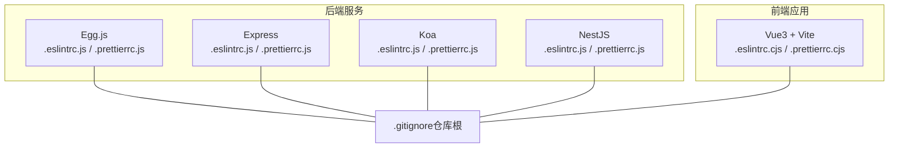
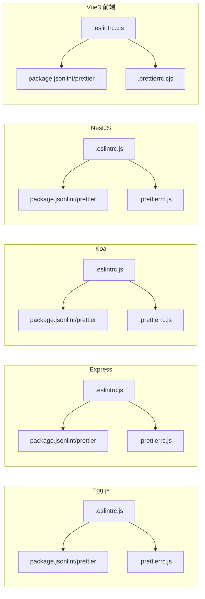
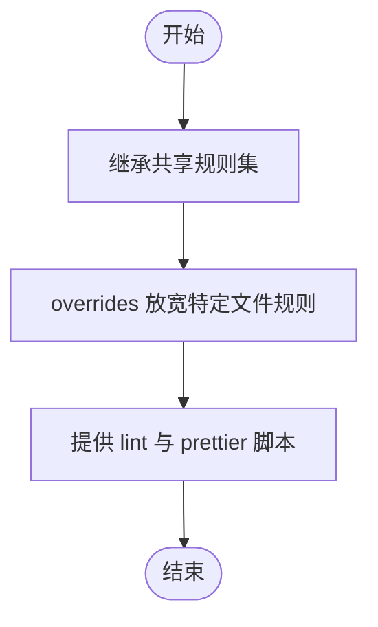
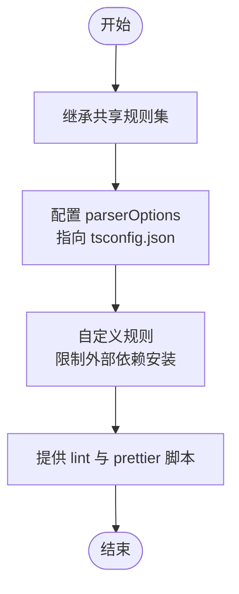
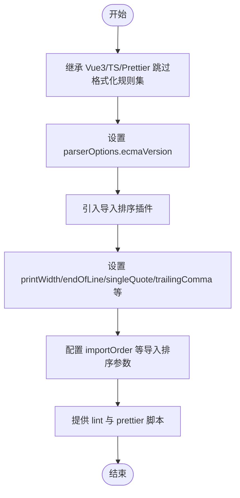
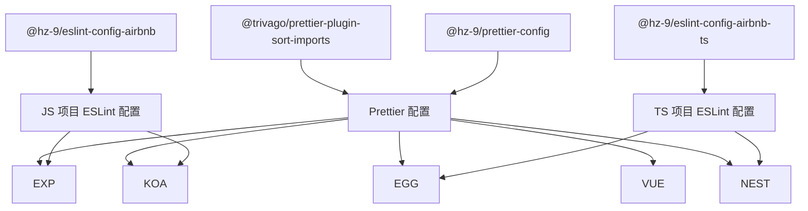

# 代码质量工具

<cite>
**本文引用的文件**
- [.eslintrc.js（Egg 示例）](file://practice/nodejs-service/egg/cross-domain/.eslintrc.js)
- [.prettierrc.js（Egg 示例）](file://practice/nodejs-service/egg/cross-domain/.prettierrc.js)
- [package.json（Egg 示例）](file://practice/nodejs-service/egg/cross-domain/package.json)
- [.eslintrc.js（Express 示例）](file://practice/nodejs-service/express/cross-domain/.eslintrc.js)
- [.prettierrc.js（Express 示例）](file://practice/nodejs-service/express/cross-domain/.prettierrc.js)
- [package.json（Express 示例）](file://practice/nodejs-service/express/cross-domain/package.json)
- [.eslintrc.js（Koa 示例）](file://practice/nodejs-service/koa/cross-domain/.eslintrc.js)
- [.prettierrc.js（Koa 示例）](file://practice/nodejs-service/koa/cross-domain/.prettierrc.js)
- [package.json（Koa 示例）](file://practice/nodejs-service/koa/cross-domain/package.json)
- [.eslintrc.js（NestJS 示例）](file://practice/nodejs-service/nest/cross-domain/.eslintrc.js)
- [.prettierrc.js（NestJS 示例）](file://practice/nodejs-service/nest/cross-domain/.prettierrc.js)
- [package.json（NestJS 示例）](file://practice/nodejs-service/nest/cross-domain/package.json)
- [.eslintrc.cjs（Vue3 前端示例）](file://practice/vue3-frontend/cross-domain/.eslintrc.cjs)
- [.prettierrc.cjs（Vue3 前端示例）](file://practice/vue3-frontend/cross-domain/.prettierrc.cjs)
- [package.json（Vue3 前端示例）](file://practice/vue3-frontend/cross-domain/package.json)
- [.gitignore（仓库根）](file://.gitignore)
</cite>

## 目录
1. [简介](#简介)
2. [项目结构](#项目结构)
3. [核心组件](#核心组件)
4. [架构总览](#架构总览)
5. [详细组件分析](#详细组件分析)
6. [依赖关系分析](#依赖关系分析)
7. [性能考量](#性能考量)
8. [故障排查指南](#故障排查指南)
9. [结论](#结论)
10. [附录](#附录)

## 简介
本指南围绕代码质量工具 ESLint 与 Prettier 在多框架项目中的配置与实践展开，覆盖：
- ESLint 配置：基础规则、语法检查、代码风格、自定义规则与 overrides 使用
- Prettier 配置：缩进、引号、换行、分号、尾逗号、插件与导入排序等
- 多框架差异：Egg.js、Express、Koa、NestJS、Vue3 的具体配置要点
- 团队协作与 CI/CD：统一规范与质量门禁建议
- VS Code 集成：保存时自动格式化与 Linting

## 项目结构
本仓库在多个子项目中提供了不同框架下的 ESLint 与 Prettier 配置示例，便于对比与复用。

图表来源
- [.eslintrc.js（Egg 示例）:1-13](file://practice/nodejs-service/egg/cross-domain/.eslintrc.js#L1-L13)
- [.prettierrc.js（Egg 示例）:1-2](file://practice/nodejs-service/egg/cross-domain/.prettierrc.js#L1-L2)
- [.eslintrc.js（Express 示例）:1-14](file://practice/nodejs-service/express/cross-domain/.eslintrc.js#L1-L14)
- [.prettierrc.js（Express 示例）:1-2](file://practice/nodejs-service/express/cross-domain/.prettierrc.js#L1-L2)
- [.eslintrc.js（Koa 示例）:1-14](file://practice/nodejs-service/koa/cross-domain/.eslintrc.js#L1-L14)
- [.prettierrc.js（Koa 示例）:1-2](file://practice/nodejs-service/koa/cross-domain/.prettierrc.js#L1-L2)
- [.eslintrc.js（NestJS 示例）:1-13](file://practice/nodejs-service/nest/cross-domain/.eslintrc.js#L1-L13)
- [.prettierrc.js（NestJS 示例）:1-2](file://practice/nodejs-service/nest/cross-domain/.prettierrc.js#L1-L2)
- [.eslintrc.cjs（Vue3 前端示例）:1-16](file://practice/vue3-frontend/cross-domain/.eslintrc.cjs#L1-L16)
- [.prettierrc.cjs（Vue3 前端示例）:1-43](file://practice/vue3-frontend/cross-domain/.prettierrc.cjs#L1-L43)
- [.gitignore（仓库根）:1-12](file://.gitignore#L1-L12)

章节来源
- [.eslintrc.js（Egg 示例）:1-13](file://practice/nodejs-service/egg/cross-domain/.eslintrc.js#L1-L13)
- [.prettierrc.js（Egg 示例）:1-2](file://practice/nodejs-service/egg/cross-domain/.prettierrc.js#L1-L2)
- [.eslintrc.js（Express 示例）:1-14](file://practice/nodejs-service/express/cross-domain/.eslintrc.js#L1-L14)
- [.prettierrc.js（Express 示例）:1-2](file://practice/nodejs-service/express/cross-domain/.prettierrc.js#L1-L2)
- [.eslintrc.js（Koa 示例）:1-14](file://practice/nodejs-service/koa/cross-domain/.eslintrc.js#L1-L14)
- [.prettierrc.js（Koa 示例）:1-2](file://practice/nodejs-service/koa/cross-domain/.prettierrc.js#L1-L2)
- [.eslintrc.js（NestJS 示例）:1-13](file://practice/nodejs-service/nest/cross-domain/.eslintrc.js#L1-L13)
- [.prettierrc.js（NestJS 示例）:1-2](file://practice/nodejs-service/nest/cross-domain/.prettierrc.js#L1-L2)
- [.eslintrc.cjs（Vue3 前端示例）:1-16](file://practice/vue3-frontend/cross-domain/.eslintrc.cjs#L1-L16)
- [.prettierrc.cjs（Vue3 前端示例）:1-43](file://practice/vue3-frontend/cross-domain/.prettierrc.cjs#L1-L43)
- [.gitignore（仓库根）:1-12](file://.gitignore#L1-L12)

## 核心组件
- ESLint 配置要点
  - 继承共享配置：通过 extends 引入统一的 AirBnB 或 AirBnB TypeScript 规则集
  - 解析器选项：parserOptions 中指定 tsconfig 路径与模块源类型，确保 TS 项目正确解析
  - 自定义规则：使用 rules 字段覆盖或新增规则；使用 overrides 对特定文件放宽限制
- Prettier 配置要点
  - 插件化扩展：通过 plugins 引入导入排序等插件
  - 代码风格：printWidth、singleQuote、semi、trailingComma、arrowParens、endOfLine 等
  - 导入排序：importOrder、importOrderSeparation、importOrderSortSpecifiers 等
- 脚本与缓存
  - 后端 Node 项目通过 scripts 提供 lint 与 prettier 命令，并可结合缓存提升性能
  - 前端项目通过脚本整合 ESLint 与 Prettier，并在 Vue3 场景下引入 Prettier 插件以支持导入排序

章节来源
- [.eslintrc.js（Egg 示例）:1-13](file://practice/nodejs-service/egg/cross-domain/.eslintrc.js#L1-L13)
- [.prettierrc.js（Egg 示例）:1-2](file://practice/nodejs-service/egg/cross-domain/.prettierrc.js#L1-L2)
- [package.json（Egg 示例）:18-19](file://practice/nodejs-service/egg/cross-domain/package.json#L18-L19)
- [.eslintrc.js（Express 示例）:1-14](file://practice/nodejs-service/express/cross-domain/.eslintrc.js#L1-L14)
- [.prettierrc.js（Express 示例）:1-2](file://practice/nodejs-service/express/cross-domain/.prettierrc.js#L1-L2)
- [package.json（Express 示例）:5-8](file://practice/nodejs-service/express/cross-domain/package.json#L5-L8)
- [.eslintrc.js（Koa 示例）:1-14](file://practice/nodejs-service/koa/cross-domain/.eslintrc.js#L1-L14)
- [.prettierrc.js（Koa 示例）:1-2](file://practice/nodejs-service/koa/cross-domain/.prettierrc.js#L1-L2)
- [package.json（Koa 示例）:5-8](file://practice/nodejs-service/koa/cross-domain/package.json#L5-L8)
- [.eslintrc.js（NestJS 示例）:1-13](file://practice/nodejs-service/nest/cross-domain/.eslintrc.js#L1-L13)
- [.prettierrc.js（NestJS 示例）:1-2](file://practice/nodejs-service/nest/cross-domain/.prettierrc.js#L1-L2)
- [package.json（NestJS 示例）:10-15](file://practice/nodejs-service/nest/cross-domain/package.json#L10-L15)
- [.eslintrc.cjs（Vue3 前端示例）:1-16](file://practice/vue3-frontend/cross-domain/.eslintrc.cjs#L1-L16)
- [.prettierrc.cjs（Vue3 前端示例）:1-43](file://practice/vue3-frontend/cross-domain/.prettierrc.cjs#L1-L43)
- [package.json（Vue3 前端示例）:13-14](file://practice/vue3-frontend/cross-domain/package.json#L13-L14)

## 架构总览
下图展示了各框架项目中 ESLint 与 Prettier 的配置关系与调用路径。

图表来源
- [.eslintrc.js（Egg 示例）:1-13](file://practice/nodejs-service/egg/cross-domain/.eslintrc.js#L1-L13)
- [package.json（Egg 示例）:18-19](file://practice/nodejs-service/egg/cross-domain/package.json#L18-L19)
- [.prettierrc.js（Egg 示例）:1-2](file://practice/nodejs-service/egg/cross-domain/.prettierrc.js#L1-L2)
- [.eslintrc.js（Express 示例）:1-14](file://practice/nodejs-service/express/cross-domain/.eslintrc.js#L1-L14)
- [package.json（Express 示例）:5-8](file://practice/nodejs-service/express/cross-domain/package.json#L5-L8)
- [.prettierrc.js（Express 示例）:1-2](file://practice/nodejs-service/express/cross-domain/.prettierrc.js#L1-L2)
- [.eslintrc.js（Koa 示例）:1-14](file://practice/nodejs-service/koa/cross-domain/.eslintrc.js#L1-L14)
- [package.json（Koa 示例）:5-8](file://practice/nodejs-service/koa/cross-domain/package.json#L5-L8)
- [.prettierrc.js（Koa 示例）:1-2](file://practice/nodejs-service/koa/cross-domain/.prettierrc.js#L1-L2)
- [.eslintrc.js（NestJS 示例）:1-13](file://practice/nodejs-service/nest/cross-domain/.eslintrc.js#L1-L13)
- [package.json（NestJS 示例）:10-15](file://practice/nodejs-service/nest/cross-domain/package.json#L10-L15)
- [.prettierrc.js（NestJS 示例）:1-2](file://practice/nodejs-service/nest/cross-domain/.prettierrc.js#L1-L2)
- [.eslintrc.cjs（Vue3 前端示例）:1-16](file://practice/vue3-frontend/cross-domain/.eslintrc.cjs#L1-L16)
- [package.json（Vue3 前端示例）:13-14](file://practice/vue3-frontend/cross-domain/package.json#L13-L14)
- [.prettierrc.cjs（Vue3 前端示例）:1-43](file://practice/vue3-frontend/cross-domain/.prettierrc.cjs#L1-L43)

## 详细组件分析

### Egg.js 配置分析
- ESLint
  - 继承共享 TS 规则集，启用 TypeScript 解析器选项，指向当前目录 tsconfig 并声明模块源类型
  - 自定义规则：限制 package 目录外的依赖安装导致的外部依赖报错
- Prettier
  - 使用共享服务端导入排序配置，保持与后端一致的导入顺序风格
- 脚本
  - 提供 lint 与 prettier 命令，TS 项目同时支持类型检查清理

图表来源
- [.eslintrc.js（Egg 示例）:1-13](file://practice/nodejs-service/egg/cross-domain/.eslintrc.js#L1-L13)
- [package.json（Egg 示例）:18-19](file://practice/nodejs-service/egg/cross-domain/package.json#L18-L19)

章节来源
- [.eslintrc.js（Egg 示例）:1-13](file://practice/nodejs-service/egg/cross-domain/.eslintrc.js#L1-L13)
- [.prettierrc.js（Egg 示例）:1-2](file://practice/nodejs-service/egg/cross-domain/.prettierrc.js#L1-L2)
- [package.json（Egg 示例）:18-19](file://practice/nodejs-service/egg/cross-domain/package.json#L18-L19)

### Express 配置分析
- ESLint
  - 继承共享 JS 规则集，通过 overrides 对特定入口文件放宽控制台输出规则
- Prettier
  - 使用共享服务端导入排序配置
- 脚本
  - 提供 lint 与 prettier 命令

图表来源
- [.eslintrc.js（Express 示例）:1-14](file://practice/nodejs-service/express/cross-domain/.eslintrc.js#L1-L14)
- [package.json（Express 示例）:5-8](file://practice/nodejs-service/express/cross-domain/package.json#L5-L8)

章节来源
- [.eslintrc.js（Express 示例）:1-14](file://practice/nodejs-service/express/cross-domain/.eslintrc.js#L1-L14)
- [.prettierrc.js（Express 示例）:1-2](file://practice/nodejs-service/express/cross-domain/.prettierrc.js#L1-L2)
- [package.json（Express 示例）:5-8](file://practice/nodejs-service/express/cross-domain/package.json#L5-L8)

### Koa 配置分析
- ESLint
  - 继承共享 JS 规则集，通过 overrides 对主程序文件放宽控制台输出规则
- Prettier
  - 使用共享服务端导入排序配置
- 脚本
  - 提供 lint 与 prettier 命令

图表来源
- [.eslintrc.js（Koa 示例）:1-14](file://practice/nodejs-service/koa/cross-domain/.eslintrc.js#L1-L14)
- [package.json（Koa 示例）:5-8](file://practice/nodejs-service/koa/cross-domain/package.json#L5-L8)

章节来源
- [.eslintrc.js（Koa 示例）:1-14](file://practice/nodejs-service/koa/cross-domain/.eslintrc.js#L1-L14)
- [.prettierrc.js（Koa 示例）:1-2](file://practice/nodejs-service/koa/cross-domain/.prettierrc.js#L1-L2)
- [package.json（Koa 示例）:5-8](file://practice/nodejs-service/koa/cross-domain/package.json#L5-L8)

### NestJS 配置分析
- ESLint
  - 继承共享 TS 规则集，启用 TypeScript 解析器选项，指向当前目录 tsconfig 并声明模块源类型
  - 自定义规则：限制 package 目录外的依赖安装导致的外部依赖报错
- Prettier
  - 使用共享服务端导入排序配置
- 脚本
  - 提供 lint 与 prettier 命令，覆盖 src、apps、libs、test 等目录

图表来源
- [.eslintrc.js（NestJS 示例）:1-13](file://practice/nodejs-service/nest/cross-domain/.eslintrc.js#L1-L13)
- [package.json（NestJS 示例）:10-15](file://practice/nodejs-service/nest/cross-domain/package.json#L10-L15)

章节来源
- [.eslintrc.js（NestJS 示例）:1-13](file://practice/nodejs-service/nest/cross-domain/.eslintrc.js#L1-L13)
- [.prettierrc.js（NestJS 示例）:1-2](file://practice/nodejs-service/nest/cross-domain/.prettierrc.js#L1-L2)
- [package.json（NestJS 示例）:10-15](file://practice/nodejs-service/nest/cross-domain/package.json#L10-L15)

### Vue3 前端配置分析
- ESLint
  - 使用现代模块解析补丁，继承 Vue3 基础、ESLint 推荐、TypeScript 与 Prettier 跳过格式化配置
  - 指定最新 ECMAScript 版本
- Prettier
  - 引入导入排序插件，设置打印宽度、换行符、单引号、尾逗号、箭头函数括号、分号、块大括号位置、HTML 空白敏感度、单属性换行、导入顺序与解析插件等
- 脚本
  - 提供 lint 与 prettier 命令，覆盖 .vue、.js、.ts 等扩展名

图表来源
- [.eslintrc.cjs（Vue3 前端示例）:1-16](file://practice/vue3-frontend/cross-domain/.eslintrc.cjs#L1-L16)
- [.prettierrc.cjs（Vue3 前端示例）:1-43](file://practice/vue3-frontend/cross-domain/.prettierrc.cjs#L1-L43)
- [package.json（Vue3 前端示例）:13-14](file://practice/vue3-frontend/cross-domain/package.json#L13-L14)

章节来源
- [.eslintrc.cjs（Vue3 前端示例）:1-16](file://practice/vue3-frontend/cross-domain/.eslintrc.cjs#L1-L16)
- [.prettierrc.cjs（Vue3 前端示例）:1-43](file://practice/vue3-frontend/cross-domain/.prettierrc.cjs#L1-L43)
- [package.json（Vue3 前端示例）:13-14](file://practice/vue3-frontend/cross-domain/package.json#L13-L14)

## 依赖关系分析
- 共享配置
  - @hz-9/eslint-config-airbnb 与 @hz-9/eslint-config-airbnb-ts 提供统一的 JS/TS 规则基线
  - @hz-9/prettier-config 提供统一的 Prettier 风格基线
  - @trivago/prettier-plugin-sort-imports 用于导入排序
- 工具链
  - ESLint 与 Prettier 在各项目中通过 scripts 调用，形成本地与 CI 的统一执行入口

图表来源
- [.eslintrc.js（Egg 示例）:1-13](file://practice/nodejs-service/egg/cross-domain/.eslintrc.js#L1-L13)
- [.eslintrc.js（Express 示例）:1-14](file://practice/nodejs-service/express/cross-domain/.eslintrc.js#L1-L14)
- [.eslintrc.js（Koa 示例）:1-14](file://practice/nodejs-service/koa/cross-domain/.eslintrc.js#L1-L14)
- [.eslintrc.js（NestJS 示例）:1-13](file://practice/nodejs-service/nest/cross-domain/.eslintrc.js#L1-L13)
- [.prettierrc.js（Egg 示例）:1-2](file://practice/nodejs-service/egg/cross-domain/.prettierrc.js#L1-L2)
- [.prettierrc.js（Express 示例）:1-2](file://practice/nodejs-service/express/cross-domain/.prettierrc.js#L1-L2)
- [.prettierrc.js（Koa 示例）:1-2](file://practice/nodejs-service/koa/cross-domain/.prettierrc.js#L1-L2)
- [.prettierrc.js（NestJS 示例）:1-2](file://practice/nodejs-service/nest/cross-domain/.prettierrc.js#L1-L2)
- [.prettierrc.cjs（Vue3 前端示例）:1-43](file://practice/vue3-frontend/cross-domain/.prettierrc.cjs#L1-L43)

章节来源
- [package.json（Egg 示例）:38-40](file://practice/nodejs-service/egg/cross-domain/package.json#L38-L40)
- [package.json（Express 示例）:18-19](file://practice/nodejs-service/express/cross-domain/package.json#L18-L19)
- [package.json（Koa 示例）:16-17](file://practice/nodejs-service/koa/cross-domain/package.json#L16-L17)
- [package.json（NestJS 示例）:31-32](file://practice/nodejs-service/nest/cross-domain/package.json#L31-L32)
- [package.json（Vue3 前端示例）:30-32](file://practice/vue3-frontend/cross-domain/package.json#L30-L32)

## 性能考量
- 缓存与增量检查
  - 后端 Node 项目提供 ESLint 缓存能力，可在大型项目中显著减少检查时间
- 脚本优化
  - 将 lint 与 prettier 命令组合到统一脚本中，便于在开发与 CI 中快速执行
- 类型检查分离
  - TS 项目将类型检查与 ESLint 分离，避免重复扫描，提高整体效率

章节来源
- [package.json（Egg 示例）:18-19](file://practice/nodejs-service/egg/cross-domain/package.json#L18-L19)
- [package.json（NestJS 示例）:10-15](file://practice/nodejs-service/nest/cross-domain/package.json#L10-L15)

## 故障排查指南
- ESLint 无法识别 TS 文件
  - 确认 parserOptions.project 指向正确的 tsconfig.json，且 tsconfigRootDir 指向当前目录
- overrides 未生效
  - 检查 overrides.files 是否匹配目标文件路径，确认规则键值书写正确
- Prettier 导入排序不生效
  - 确认已安装并启用导入排序插件，检查 importOrder 等相关配置项是否合理
- VS Code 保存时格式化冲突
  - 确保编辑器设置中启用 Prettier 作为默认格式化器，并关闭与 ESLint 冲突的格式化选项

章节来源
- [.eslintrc.js（Egg 示例）:3-7](file://practice/nodejs-service/egg/cross-domain/.eslintrc.js#L3-L7)
- [.eslintrc.js（NestJS 示例）:3-7](file://practice/nodejs-service/nest/cross-domain/.eslintrc.js#L3-L7)
- [.prettierrc.cjs（Vue3 前端示例）:1-43](file://practice/vue3-frontend/cross-domain/.prettierrc.cjs#L1-L43)

## 结论
本仓库提供了多框架场景下的 ESLint 与 Prettier 配置范式，通过共享规则集与统一的导入排序策略，实现跨项目的一致性与可维护性。建议在团队内推广使用相同的配置文件与脚本约定，并在 CI/CD 中强制执行 lint 与格式化校验，以保障代码质量与协作效率。

## 附录
- VS Code 集成建议
  - 安装 ESLint 与 Prettier 扩展
  - 设置默认格式化器为 Prettier
  - 在工作区设置中启用“保存时格式化”与“保存时修复”
  - 关闭与 Prettier 冲突的编辑器格式化选项
- .gitignore 建议
  - 忽略构建产物与依赖目录
  - 保留 pre-commit 钩子以便在提交前运行质量检查

章节来源
- [.gitignore（仓库根）:1-12](file://.gitignore#L1-L12)