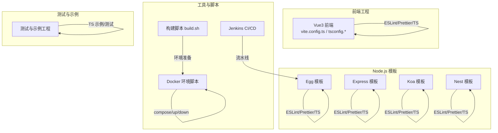
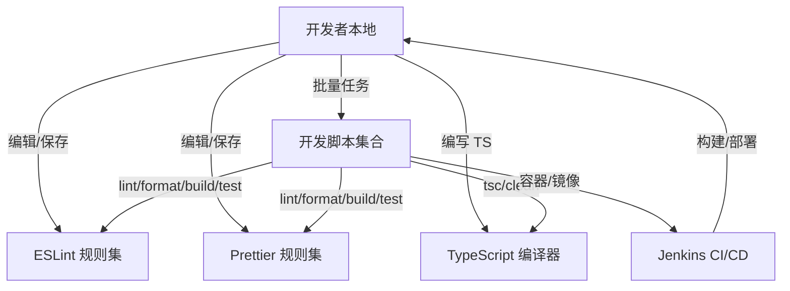
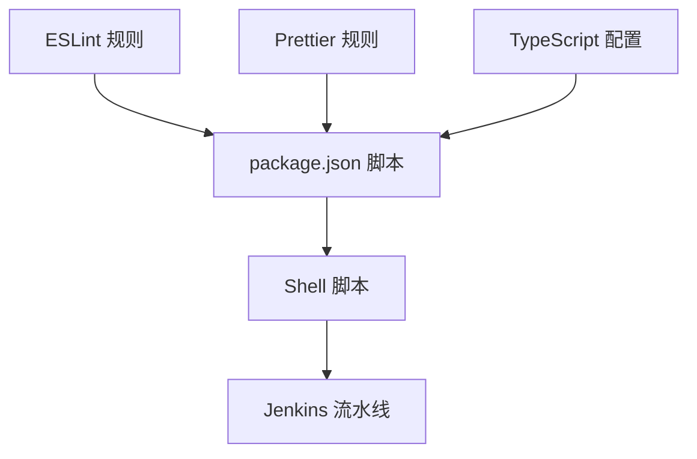

# 开发工具与脚本

<cite>
**本文引用的文件**
- [handwritten-code/package.json](file://handwritten-code/package.json)
- [handwritten-code/tsconfig.json](file://handwritten-code/tsconfig.json)
- [practice/nodejs-service/egg/docker-image/package.json](file://practice/nodejs-service/egg/docker-image/package.json)
- [practice/nodejs-service/egg/docker-image/tsconfig.json](file://practice/nodejs-service/egg/docker-image/tsconfig.json)
- [practice/nodejs-service/egg/run.sh](file://practice/nodejs-service/egg/run.sh)
- [build.sh](file://build.sh)
- [practice/docker-env/cross-domain/bin/compose.sh](file://practice/docker-env/cross-domain/bin/compose.sh)
- [practice/vue3-frontend/cross-domain/vite.config.ts](file://practice/vue3-frontend/cross-domain/vite.config.ts)
- [practice/vue3-frontend/cross-domain/.eslintrc.cjs](file://practice/vue3-frontend/cross-domain/.eslintrc.cjs)
- [practice/vue3-frontend/cross-domain/.prettierrc.cjs](file://practice/vue3-frontend/cross-domain/.prettierrc.cjs)
- [practice/vue3-frontend/cross-domain/tsconfig.app.json](file://practice/vue3-frontend/cross-domain/tsconfig.app.json)
- [practice/vue3-frontend/cross-domain/tsconfig.json](file://practice/vue3-frontend/cross-domain/tsconfig.json)
- [practice/vue3-frontend/cross-domain/tsconfig.node.json](file://practice/vue3-frontend/cross-domain/tsconfig.node.json)
- [practice/nodejs-service/express/template-ts/package.json](file://practice/nodejs-service/express/template-ts/package.json)
- [practice/nodejs-service/express/template-ts/tsconfig.json](file://practice/nodejs-service/express/template-ts/tsconfig.json)
- [practice/nodejs-service/koa/template-ts/package.json](file://practice/nodejs-service/koa/template-ts/package.json)
- [practice/nodejs-service/koa/template-ts/tsconfig.json](file://practice/nodejs-service/koa/template-ts/tsconfig.json)
- [practice/nodejs-service/nest/template/package.json](file://practice/nodejs-service/nest/template/package.json)
- [practice/nodejs-service/nest/template/tsconfig.json](file://practice/nodejs-service/nest/template/tsconfig.json)
- [test-space/hz-9/docs-build/ts-node18-cjs/package.json](file://test-space/hz-9/docs-build/ts-node18-cjs/package.json)
- [test-space/hz-9/docs-build/ts-node18-cjs/tsconfig.json](file://test-space/hz-9/docs-build/ts-node18-cjs/tsconfig.json)
- [test-space/hz-9/redlock-dist/ts-node18-cjs/package.json](file://test-space/hz-9/redlock-dist/ts-node18-cjs/package.json)
- [test-space/hz-9/redlock-dist/ts-node18-cjs/tsconfig.json](file://test-space/hz-9/redlock-dist/ts-node18-cjs/tsconfig.json)
- [test-space/hz-9/redlock-dist/ts-node18-esm/tsconfig.json](file://test-space/hz-9/redlock-dist/ts-node18-esm/tsconfig.json)
- [ci&cd/jenkins/jenkinsfile/README.md](file://ci&cd/jenkins/jenkinsfile/README.md)
- [ci&cd/jenkins/jenkinsfile/service.1.Jenkinsfile](file://ci&cd/jenkins/jenkinsfile/service.1.Jenkinsfile)
- [ci&cd/jenkins/jenkinsfile/service.2.Jenkinsfile](file://ci&cd/jenkins/jenkinsfile/service.2.Jenkinsfile)
- [ci&cd/jenkins/jenkinsfile/service.3.Jenkinsfile](file://ci&cd/jenkins/jenkinsfile/service.3.Jenkinsfile)
- [ci&cd/jenkins/jenkinsfile/website.1.Jenkinsfile](file://ci&cd/jenkins/jenkinsfile/website.1.Jenkinsfile)
- [ci&cd/jenkins/jenkinsfile/website.2.Jenkinsfile](file://ci&cd/jenkins/jenkinsfile/website.2.Jenkinsfile)
</cite>

## 目录
1. [简介](#简介)
2. [项目结构](#项目结构)
3. [核心组件](#核心组件)
4. [架构总览](#架构总览)
5. [详细组件分析](#详细组件分析)
6. [依赖关系分析](#依赖关系分析)
7. [性能考虑](#性能考虑)
8. [故障排查指南](#故障排查指南)
9. [结论](#结论)
10. [附录](#附录)

## 简介
本指南面向使用该代码库进行前端与后端开发的工程师，系统讲解以下内容：
- ESLint 代码规范配置与使用
- Prettier 格式化规则与集成
- TypeScript 类型检查与编译配置
- VS Code 开发环境配置、插件推荐与调试技巧
- 各类开发脚本（构建、部署、环境管理）的功能说明与使用场景
- 代码生成工具、自动化测试脚本与性能分析工具的使用方法
- 提升开发效率的最佳实践与团队协作规范

## 项目结构
该仓库采用多工程并存的组织方式：包含手写实现示例、Node.js 框架模板（Egg/Express/Koa/Nest）、Vue3 前端示例、Docker 环境准备与同步脚本、Jenkins CI/CD 脚本等。不同子工程分别维护各自的 ESLint、Prettier、TypeScript 配置与脚本。

## 核心组件
本节聚焦于开发工具链的核心配置与脚本，帮助你快速在本地与 CI 中统一风格与质量标准。

- ESLint 配置与使用
  - 在多个工程中存在独立的 ESLint 配置文件，用于约束代码风格与潜在问题。
  - 推荐通过脚本统一运行，确保本地与 CI 一致。
  - 参考路径：
    - [practice/vue3-frontend/cross-domain/.eslintrc.cjs](file://practice/vue3-frontend/cross-domain/.eslintrc.cjs)
    - [practice/nodejs-service/egg/docker-image/package.json](file://practice/nodejs-service/egg/docker-image/package.json)

- Prettier 格式化规则
  - 工程内提供 Prettier 配置文件，支持对代码进行自动格式化。
  - 可通过脚本批量格式化，保证团队一致性。
  - 参考路径：
    - [practice/vue3-frontend/cross-domain/.prettierrc.cjs](file://practice/vue3-frontend/cross-domain/.prettierrc.cjs)

- TypeScript 编译与类型检查
  - 各工程维护独立 tsconfig 文件，控制编译目标、模块系统、路径映射与输出目录等。
  - 可结合脚本执行 tsc 或增量编译清理。
  - 参考路径：
    - [handwritten-code/tsconfig.json](file://handwritten-code/tsconfig.json)
    - [practice/nodejs-service/egg/docker-image/tsconfig.json](file://practice/nodejs-service/egg/docker-image/tsconfig.json)
    - [practice/vue3-frontend/cross-domain/tsconfig.app.json](file://practice/vue3-frontend/cross-domain/tsconfig.app.json)
    - [practice/vue3-frontend/cross-domain/tsconfig.json](file://practice/vue3-frontend/cross-domain/tsconfig.json)
    - [practice/vue3-frontend/cross-domain/tsconfig.node.json](file://practice/vue3-frontend/cross-domain/tsconfig.node.json)

- 开发脚本与工作流
  - 统一的脚本入口与批量操作脚本，便于在多工程环境下执行 lint、format、build、test 等任务。
  - 参考路径：
    - [practice/nodejs-service/egg/run.sh](file://practice/nodejs-service/egg/run.sh)
    - [build.sh](file://build.sh)
    - [practice/docker-env/cross-domain/bin/compose.sh](file://practice/docker-env/cross-domain/bin/compose.sh)

**章节来源**
- [practice/vue3-frontend/cross-domain/.eslintrc.cjs](file://practice/vue3-frontend/cross-domain/.eslintrc.cjs)
- [practice/vue3-frontend/cross-domain/.prettierrc.cjs](file://practice/vue3-frontend/cross-domain/.prettierrc.cjs)
- [handwritten-code/tsconfig.json](file://handwritten-code/tsconfig.json)
- [practice/nodejs-service/egg/docker-image/tsconfig.json](file://practice/nodejs-service/egg/docker-image/tsconfig.json)
- [practice/vue3-frontend/cross-domain/tsconfig.app.json](file://practice/vue3-frontend/cross-domain/tsconfig.app.json)
- [practice/vue3-frontend/cross-domain/tsconfig.json](file://practice/vue3-frontend/cross-domain/tsconfig.json)
- [practice/vue3-frontend/cross-domain/tsconfig.node.json](file://practice/vue3-frontend/cross-domain/tsconfig.node.json)
- [practice/nodejs-service/egg/run.sh](file://practice/nodejs-service/egg/run.sh)
- [build.sh](file://build.sh)
- [practice/docker-env/cross-domain/bin/compose.sh](file://practice/docker-env/cross-domain/bin/compose.sh)

## 架构总览
下图展示了前端与后端工程在开发工具链上的交互关系：ESLint 与 Prettier 作为质量门禁，TypeScript 作为类型保障，脚本作为统一入口，CI/CD 作为发布通道。

## 详细组件分析

### ESLint 配置与使用
- 配置位置与作用域
  - Vue3 前端工程提供独立的 ESLint 配置文件，用于约束前端代码风格与潜在问题。
  - Node.js 模板工程在 package.json 的 scripts 中定义了 lint 命令，通常指向 eslint 并传入扩展名与缓存参数。
- 使用建议
  - 在本地 IDE 中启用 ESLint 插件，保存时自动修复可修复项。
  - 在 CI 中仅运行 lint 步骤，失败即阻断合并。
- 参考路径
  - [practice/vue3-frontend/cross-domain/.eslintrc.cjs](file://practice/vue3-frontend/cross-domain/.eslintrc.cjs)
  - [practice/nodejs-service/egg/docker-image/package.json](file://practice/nodejs-service/egg/docker-image/package.json)

**章节来源**
- [practice/vue3-frontend/cross-domain/.eslintrc.cjs](file://practice/vue3-frontend/cross-domain/.eslintrc.cjs)
- [practice/nodejs-service/egg/docker-image/package.json](file://practice/nodejs-service/egg/docker-image/package.json)

### Prettier 格式化规则
- 配置位置与作用域
  - Vue3 前端工程提供 Prettier 配置文件，用于统一缩进、引号、换行等格式细节。
  - Node.js 模板工程在 package.json 的 scripts 中定义了 prettier 命令，用于对项目进行批量格式化。
- 使用建议
  - 在本地 IDE 中启用 Prettier 插件，保存时自动格式化。
  - 在 CI 中增加格式化校验步骤，避免格式漂移。
- 参考路径
  - [practice/vue3-frontend/cross-domain/.prettierrc.cjs](file://practice/vue3-frontend/cross-domain/.prettierrc.cjs)
  - [practice/nodejs-service/egg/docker-image/package.json](file://practice/nodejs-service/egg/docker-image/package.json)

**章节来源**
- [practice/vue3-frontend/cross-domain/.prettierrc.cjs](file://practice/vue3-frontend/cross-domain/.prettierrc.cjs)
- [practice/nodejs-service/egg/docker-image/package.json](file://practice/nodejs-service/egg/docker-image/package.json)

### TypeScript 类型检查与编译
- 配置位置与作用域
  - 手写实现示例工程提供基础 tsconfig，控制目标语言版本、模块系统、输出目录与 sourcemap。
  - Egg 模板工程通过继承 @eggjs/tsconfig 并自定义路径别名与 baseUrl，适配模块化与路径映射。
  - Vue3 前端工程提供三套 tsconfig 文件，分别覆盖应用、Node 环境与构建工具链。
  - Express/Koa/Nest 模板工程均提供独立的 tsconfig，满足各自框架的编译需求。
- 使用建议
  - 在本地 IDE 中开启“始终打开 TS 诊断”或类似选项，实时查看类型错误。
  - 在 CI 中执行 tsc 全量检查，确保类型安全。
- 参考路径
  - [handwritten-code/tsconfig.json](file://handwritten-code/tsconfig.json)
  - [practice/nodejs-service/egg/docker-image/tsconfig.json](file://practice/nodejs-service/egg/docker-image/tsconfig.json)
  - [practice/vue3-frontend/cross-domain/tsconfig.app.json](file://practice/vue3-frontend/cross-domain/tsconfig.app.json)
  - [practice/vue3-frontend/cross-domain/tsconfig.json](file://practice/vue3-frontend/cross-domain/tsconfig.json)
  - [practice/vue3-frontend/cross-domain/tsconfig.node.json](file://practice/vue3-frontend/cross-domain/tsconfig.node.json)
  - [practice/nodejs-service/express/template-ts/tsconfig.json](file://practice/nodejs-service/express/template-ts/tsconfig.json)
  - [practice/nodejs-service/koa/template-ts/tsconfig.json](file://practice/nodejs-service/koa/template-ts/tsconfig.json)
  - [practice/nodejs-service/nest/template/tsconfig.json](file://practice/nodejs-service/nest/template/tsconfig.json)

**章节来源**
- [handwritten-code/tsconfig.json](file://handwritten-code/tsconfig.json)
- [practice/nodejs-service/egg/docker-image/tsconfig.json](file://practice/nodejs-service/egg/docker-image/tsconfig.json)
- [practice/vue3-frontend/cross-domain/tsconfig.app.json](file://practice/vue3-frontend/cross-domain/tsconfig.app.json)
- [practice/vue3-frontend/cross-domain/tsconfig.json](file://practice/vue3-frontend/cross-domain/tsconfig.json)
- [practice/vue3-frontend/cross-domain/tsconfig.node.json](file://practice/vue3-frontend/cross-domain/tsconfig.node.json)
- [practice/nodejs-service/express/template-ts/tsconfig.json](file://practice/nodejs-service/express/template-ts/tsconfig.json)
- [practice/nodejs-service/koa/template-ts/tsconfig.json](file://practice/nodejs-service/koa/template-ts/tsconfig.json)
- [practice/nodejs-service/nest/template/tsconfig.json](file://practice/nodejs-service/nest/template/tsconfig.json)

### VS Code 开发环境配置、插件推荐与调试技巧
- 推荐插件
  - ESLint：提供实时语法与风格检查。
  - Prettier：提供一键格式化能力。
  - TypeScript Importer：自动导入模块与类型。
  - EditorConfig：保持团队缩进与换行一致。
  - Docker / Kubernetes：如需调试容器化服务。
- 工作区设置建议
  - 将默认 formatter 设为 Prettier，default editor 为 ESLint。
  - 在工作区 settings 中启用“保存时格式化”和“保存时修复 ESLint 警告”。
  - 针对不同工程设置不同的 tsconfigPath，避免类型解析冲突。
- 调试技巧
  - 使用多根工作区（Multi-root Workspace）同时打开多个工程，共享插件与快捷键。
  - 为不同工程配置 launch.json，区分端口与环境变量。
  - 在前端工程中使用 Vite 的调试配置，在 Node.js 模板中使用 egg-bin 或 pm2 进行调试。

### 开发脚本功能说明与使用场景
- 统一脚本入口
  - 多工程模板提供 run.sh，遍历子目录执行安装、lint、format 等任务，适合批量治理。
  - 参考路径：[practice/nodejs-service/egg/run.sh](file://practice/nodejs-service/egg/run.sh)
- 构建脚本
  - build.sh 负责环境准备相关脚本的合并与执行，适合在 CI 或本地初始化阶段使用。
  - 参考路径：[build.sh](file://build.sh)
- 容器与环境管理
  - compose.sh 封装 docker-compose 命令，支持跨平台启动/停止/编排服务。
  - 参考路径：[practice/docker-env/cross-domain/bin/compose.sh](file://practice/docker-env/cross-domain/bin/compose.sh)
- 前端工程脚本
  - Vite 配置文件用于本地开发服务器、代理与构建优化，建议配合 package.json 中的 scripts 使用。
  - 参考路径：[practice/vue3-frontend/cross-domain/vite.config.ts](file://practice/vue3-frontend/cross-domain/vite.config.ts)

**章节来源**
- [practice/nodejs-service/egg/run.sh](file://practice/nodejs-service/egg/run.sh)
- [build.sh](file://build.sh)
- [practice/docker-env/cross-domain/bin/compose.sh](file://practice/docker-env/cross-domain/bin/compose.sh)
- [practice/vue3-frontend/cross-domain/vite.config.ts](file://practice/vue3-frontend/cross-domain/vite.config.ts)

### 代码生成工具、自动化测试脚本与性能分析
- 代码生成工具
  - Node.js 模板工程提供多种脚手架模板（Egg/Express/Koa/Nest），可直接复制使用，减少重复劳动。
  - 参考路径：
    - [practice/nodejs-service/egg/docker-image/package.json](file://practice/nodejs-service/egg/docker-image/package.json)
    - [practice/nodejs-service/express/template-ts/package.json](file://practice/nodejs-service/express/template-ts/package.json)
    - [practice/nodejs-service/koa/template-ts/package.json](file://practice/nodejs-service/koa/template-ts/package.json)
    - [practice/nodejs-service/nest/template/package.json](file://practice/nodejs-service/nest/template/package.json)
- 自动化测试脚本
  - Node.js 模板工程提供 test:local、cov、ci 等脚本，覆盖本地测试、覆盖率与全量流水线。
  - 参考路径：
    - [practice/nodejs-service/egg/docker-image/package.json](file://practice/nodejs-service/egg/docker-image/package.json)
- 性能分析工具
  - Node.js 模板工程未内置性能分析脚本，可在 CI 中引入火焰图或 heap dump 分析；前端工程可结合浏览器性能面板与 Lighthouse 进行分析。

**章节来源**
- [practice/nodejs-service/egg/docker-image/package.json](file://practice/nodejs-service/egg/docker-image/package.json)
- [practice/nodejs-service/express/template-ts/package.json](file://practice/nodejs-service/express/template-ts/package.json)
- [practice/nodejs-service/koa/template-ts/package.json](file://practice/nodejs-service/koa/template-ts/package.json)
- [practice/nodejs-service/nest/template/package.json](file://practice/nodejs-service/nest/template/package.json)

### CI/CD 流水线与部署脚本
- Jenkins 流水线
  - 提供多套 Jenkinsfile，分别对应服务与网站的构建与部署流程，建议按工程选择合适的流水线。
  - 参考路径：
    - [ci&cd/jenkins/jenkinsfile/README.md](file://ci&cd/jenkins/jenkinsfile/README.md)
    - [ci&cd/jenkins/jenkinsfile/service.1.Jenkinsfile](file://ci&cd/jenkins/jenkinsfile/service.1.Jenkinsfile)
    - [ci&cd/jenkins/jenkinsfile/service.2.Jenkinsfile](file://ci&cd/jenkins/jenkinsfile/service.2.Jenkinsfile)
    - [ci&cd/jenkins/jenkinsfile/service.3.Jenkinsfile](file://ci&cd/jenkins/jenkinsfile/service.3.Jenkinsfile)
    - [ci&cd/jenkins/jenkinsfile/website.1.Jenkinsfile](file://ci&cd/jenkins/jenkinsfile/website.1.Jenkinsfile)
    - [ci&cd/jenkins/jenkinsfile/website.2.Jenkinsfile](file://ci&cd/jenkins/jenkinsfile/website.2.Jenkinsfile)

**章节来源**
- [ci&cd/jenkins/jenkinsfile/README.md](file://ci&cd/jenkins/jenkinsfile/README.md)
- [ci&cd/jenkins/jenkinsfile/service.1.Jenkinsfile](file://ci&cd/jenkins/jenkinsfile/service.1.Jenkinsfile)
- [ci&cd/jenkins/jenkinsfile/service.2.Jenkinsfile](file://ci&cd/jenkins/jenkinsfile/service.2.Jenkinsfile)
- [ci&cd/jenkins/jenkinsfile/service.3.Jenkinsfile](file://ci&cd/jenkins/jenkinsfile/service.3.Jenkinsfile)
- [ci&cd/jenkins/jenkinsfile/website.1.Jenkinsfile](file://ci&cd/jenkins/jenkinsfile/website.1.Jenkinsfile)
- [ci&cd/jenkins/jenkinsfile/website.2.Jenkinsfile](file://ci&cd/jenkins/jenkinsfile/website.2.Jenkinsfile)

## 依赖关系分析
下图展示开发工具链在各工程中的依赖关系：ESLint 与 Prettier 作为前置检查，TypeScript 作为类型保障，脚本作为统一入口，CI/CD 作为发布通道。

**图表来源**
- [practice/vue3-frontend/cross-domain/.eslintrc.cjs](file://practice/vue3-frontend/cross-domain/.eslintrc.cjs)
- [practice/vue3-frontend/cross-domain/.prettierrc.cjs](file://practice/vue3-frontend/cross-domain/.prettierrc.cjs)
- [handwritten-code/tsconfig.json](file://handwritten-code/tsconfig.json)
- [practice/nodejs-service/egg/docker-image/package.json](file://practice/nodejs-service/egg/docker-image/package.json)
- [practice/nodejs-service/egg/run.sh](file://practice/nodejs-service/egg/run.sh)
- [ci&cd/jenkins/jenkinsfile/service.1.Jenkinsfile](file://ci&cd/jenkins/jenkinsfile/service.1.Jenkinsfile)

**章节来源**
- [practice/vue3-frontend/cross-domain/.eslintrc.cjs](file://practice/vue3-frontend/cross-domain/.eslintrc.cjs)
- [practice/vue3-frontend/cross-domain/.prettierrc.cjs](file://practice/vue3-frontend/cross-domain/.prettierrc.cjs)
- [handwritten-code/tsconfig.json](file://handwritten-code/tsconfig.json)
- [practice/nodejs-service/egg/docker-image/package.json](file://practice/nodejs-service/egg/docker-image/package.json)
- [practice/nodejs-service/egg/run.sh](file://practice/nodejs-service/egg/run.sh)
- [ci&cd/jenkins/jenkinsfile/service.1.Jenkinsfile](file://ci&cd/jenkins/jenkinsfile/service.1.Jenkinsfile)

## 性能考虑
- 增量编译与缓存
  - 在 CI 中优先使用增量编译与缓存策略，缩短构建时间。
- 依赖安装与缓存
  - 在 CI 中缓存包管理器缓存目录，减少网络开销。
- Lint 与格式化并行
  - 在本地与 CI 中尽量并行执行 lint 与 format，减少等待时间。
- 容器化部署
  - 使用 compose.sh 管理容器生命周期，避免重复构建镜像。

## 故障排查指南
- ESLint 报错
  - 检查工程内 ESLint 配置文件是否正确加载，确认 IDE 插件与 CLI 版本一致。
  - 参考路径：[practice/vue3-frontend/cross-domain/.eslintrc.cjs](file://practice/vue3-frontend/cross-domain/.eslintrc.cjs)
- Prettier 格式化异常
  - 检查工程内 Prettier 配置文件是否存在，确认 IDE 插件已启用。
  - 参考路径：[practice/vue3-frontend/cross-domain/.prettierrc.cjs](file://practice/vue3-frontend/cross-domain/.prettierrc.cjs)
- TypeScript 编译失败
  - 检查 tsconfig 是否正确继承与覆盖，确认路径映射与输出目录配置无误。
  - 参考路径：
    - [handwritten-code/tsconfig.json](file://handwritten-code/tsconfig.json)
    - [practice/nodejs-service/egg/docker-image/tsconfig.json](file://practice/nodejs-service/egg/docker-image/tsconfig.json)
- 脚本执行失败
  - 检查脚本权限与 shebang，确认依赖工具（如 docker-compose、pnpm）已安装。
  - 参考路径：
    - [practice/nodejs-service/egg/run.sh](file://practice/nodejs-service/egg/run.sh)
    - [build.sh](file://build.sh)
    - [practice/docker-env/cross-domain/bin/compose.sh](file://practice/docker-env/cross-domain/bin/compose.sh)

**章节来源**
- [practice/vue3-frontend/cross-domain/.eslintrc.cjs](file://practice/vue3-frontend/cross-domain/.eslintrc.cjs)
- [practice/vue3-frontend/cross-domain/.prettierrc.cjs](file://practice/vue3-frontend/cross-domain/.prettierrc.cjs)
- [handwritten-code/tsconfig.json](file://handwritten-code/tsconfig.json)
- [practice/nodejs-service/egg/docker-image/tsconfig.json](file://practice/nodejs-service/egg/docker-image/tsconfig.json)
- [practice/nodejs-service/egg/run.sh](file://practice/nodejs-service/egg/run.sh)
- [build.sh](file://build.sh)
- [practice/docker-env/cross-domain/bin/compose.sh](file://practice/docker-env/cross-domain/bin/compose.sh)

## 结论
通过统一 ESLint、Prettier 与 TypeScript 配置，并结合脚本与 CI/CD 流水线，可以在多工程环境中显著提升开发效率与代码质量。建议团队在本地与 CI 中严格执行 lint、format、tsc 与测试流程，形成稳定可靠的交付节奏。

## 附录
- 最佳实践清单
  - 保存即格式化，提交即检查。
  - 严格遵循 tsconfig 继承与路径映射约定。
  - 在 CI 中分步执行 lint、format、tsc、test、coverage，失败即阻断。
  - 使用多根工作区统一管理多个工程，减少切换成本。
- 团队协作规范
  - 新增工程时，复制对应模板的 ESLint、Prettier、tsconfig 与脚本，确保一致性。
  - 对于容器化服务，统一使用 compose.sh 管理生命周期。
  - 在 PR 中要求 CI 通过后再合并，避免引入风格与类型问题。