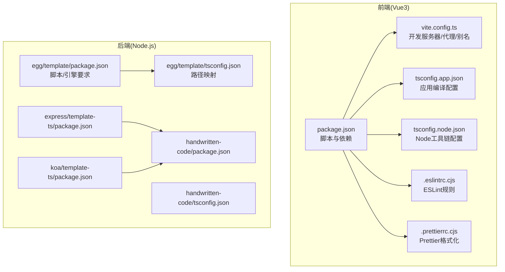
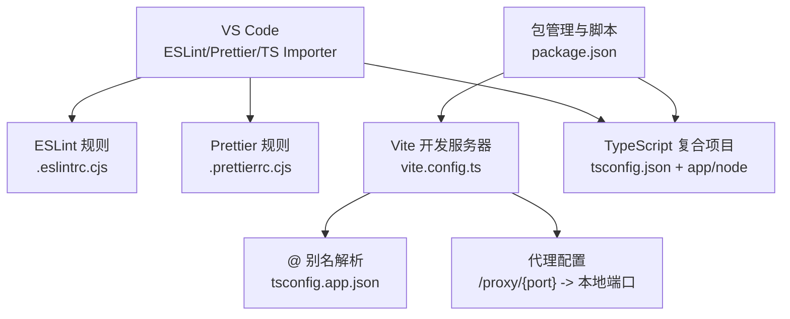
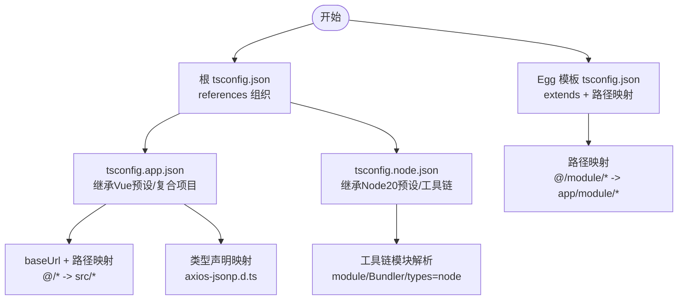
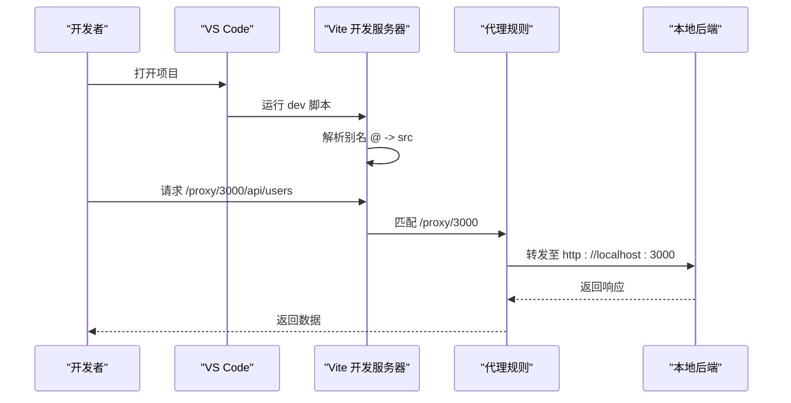
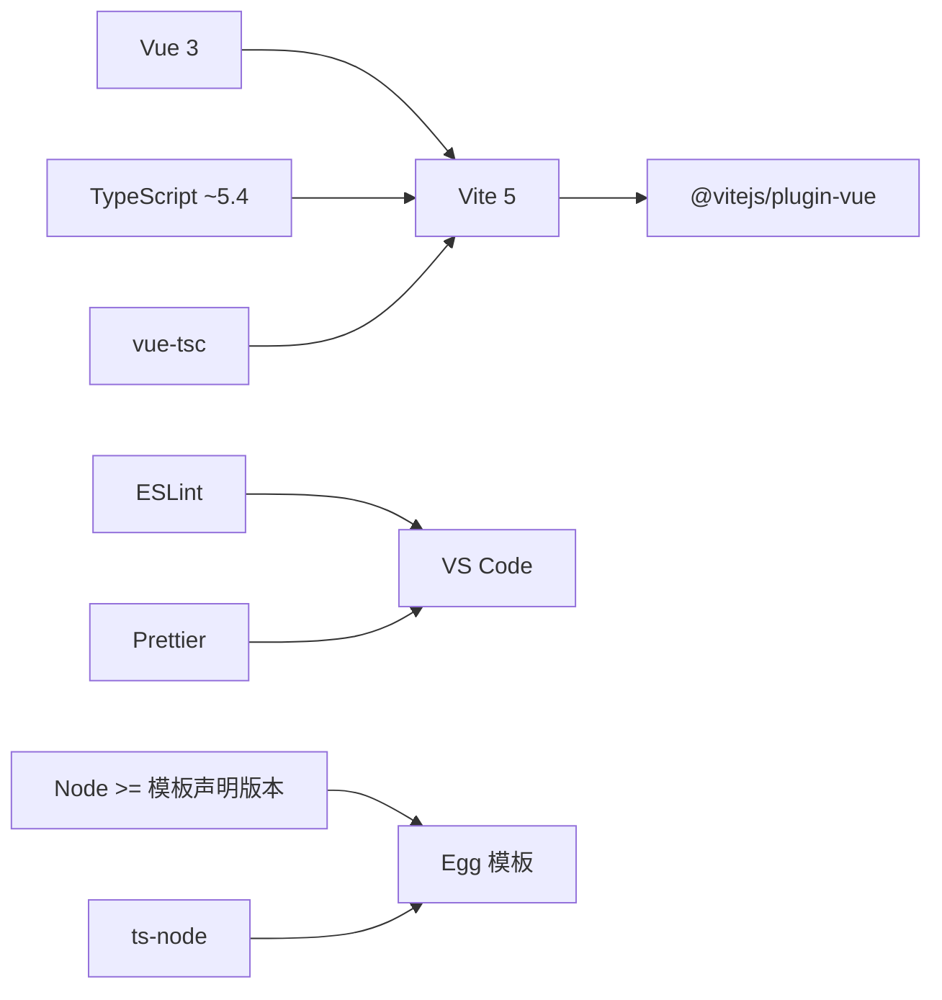

# 开发环境配置

<cite>
**本文引用的文件**
- [package.json](file://practice/vue3-frontend/cross-domain/package.json)
- [vite.config.ts](file://practice/vue3-frontend/cross-domain/vite.config.ts)
- [tsconfig.json](file://practice/vue3-frontend/cross-domain/tsconfig.json)
- [tsconfig.app.json](file://practice/vue3-frontend/cross-domain/tsconfig.app.json)
- [tsconfig.node.json](file://practice/vue3-frontend/cross-domain/tsconfig.node.json)
- [.eslintrc.cjs](file://practice/vue3-frontend/cross-domain/.eslintrc.cjs)
- [.prettierrc.cjs](file://practice/vue3-frontend/cross-domain/.prettierrc.cjs)
- [package.json](file://practice/nodejs-service/egg/template/package.json)
- [tsconfig.json](file://practice/nodejs-service/egg/template/tsconfig.json)
- [package.json](file://practice/nodejs-service/express/template-ts/package.json)
- [package.json](file://practice/nodejs-service/koa/template-ts/package.json)
- [package.json](file://handwritten-code/package.json)
- [tsconfig.json](file://handwritten-code/tsconfig.json)
</cite>

## 目录
1. [简介](#简介)
2. [项目结构](#项目结构)
3. [核心组件](#核心组件)
4. [架构总览](#架构总览)
5. [详细组件分析](#详细组件分析)
6. [依赖分析](#依赖分析)
7. [性能考虑](#性能考虑)
8. [故障排查指南](#故障排查指南)
9. [结论](#结论)
10. [附录](#附录)

## 简介
本指南面向在该代码库中进行前端与 Node.js 后端开发的工程师，提供从环境准备到日常开发工作流的完整配置说明。内容覆盖：
- Node.js 版本要求与包管理器选择（pnpm/yarn/npm）
- TypeScript 编译配置与路径映射
- Vite 构建与开发服务器配置、代理与构建优化
- VS Code 推荐插件与配置要点
- 调试配置（断点、远程、多进程）
- 环境变量、IDE 快捷键与开发工作流优化建议

## 项目结构
该仓库包含多个实践子项目，其中与前端开发最相关的是 Vue3 前端示例，后端模板涵盖 Egg、Express、Koa 等框架。下图给出与“开发环境配置”直接相关的目录与文件关系。

图表来源
- [package.json:1-43](file://practice/vue3-frontend/cross-domain/package.json#L1-L43)
- [vite.config.ts:1-40](file://practice/vue3-frontend/cross-domain/vite.config.ts#L1-L40)
- [tsconfig.app.json:1-24](file://practice/vue3-frontend/cross-domain/tsconfig.app.json#L1-L24)
- [tsconfig.node.json:1-20](file://practice/vue3-frontend/cross-domain/tsconfig.node.json#L1-L20)
- [.eslintrc.cjs:1-16](file://practice/vue3-frontend/cross-domain/.eslintrc.cjs#L1-L16)
- [.prettierrc.cjs:1-43](file://practice/vue3-frontend/cross-domain/.prettierrc.cjs#L1-L43)
- [package.json:1-56](file://practice/nodejs-service/egg/template/package.json#L1-L56)
- [tsconfig.json:1-11](file://practice/nodejs-service/egg/template/tsconfig.json#L1-L11)
- [package.json:1-31](file://practice/nodejs-service/express/template-ts/package.json#L1-L31)
- [package.json:1-29](file://practice/nodejs-service/koa/template-ts/package.json#L1-L29)
- [package.json:1-23](file://handwritten-code/package.json#L1-L23)
- [tsconfig.json:1-17](file://handwritten-code/tsconfig.json#L1-L17)

章节来源
- [package.json:1-43](file://practice/vue3-frontend/cross-domain/package.json#L1-L43)
- [vite.config.ts:1-40](file://practice/vue3-frontend/cross-domain/vite.config.ts#L1-L40)
- [tsconfig.json:1-12](file://practice/vue3-frontend/cross-domain/tsconfig.json#L1-L12)
- [tsconfig.app.json:1-24](file://practice/vue3-frontend/cross-domain/tsconfig.app.json#L1-L24)
- [tsconfig.node.json:1-20](file://practice/vue3-frontend/cross-domain/tsconfig.node.json#L1-L20)
- [.eslintrc.cjs:1-16](file://practice/vue3-frontend/cross-domain/.eslintrc.cjs#L1-L16)
- [.prettierrc.cjs:1-43](file://practice/vue3-frontend/cross-domain/.prettierrc.cjs#L1-L43)
- [package.json:1-56](file://practice/nodejs-service/egg/template/package.json#L1-L56)
- [tsconfig.json:1-11](file://practice/nodejs-service/egg/template/tsconfig.json#L1-L11)
- [package.json:1-31](file://practice/nodejs-service/express/template-ts/package.json#L1-L31)
- [package.json:1-29](file://practice/nodejs-service/koa/template-ts/package.json#L1-L29)
- [package.json:1-23](file://handwritten-code/package.json#L1-L23)
- [tsconfig.json:1-17](file://handwritten-code/tsconfig.json#L1-L17)

## 核心组件
- 包管理器与脚本
  - 前端工程使用 Vite 5 与 Vue 3，脚本涵盖 dev/build/preview/type-check/lint/prettier 等。
  - 后端 Egg 模板声明 Node 引擎最低版本，并提供开发/生产启动、测试、覆盖率、类型检查等脚本。
- TypeScript 配置
  - 应用侧采用复合项目（references），分别针对应用层与 Node 工具链设置不同编译目标与模块解析策略。
  - 后端 Egg 模板通过 extends 使用统一 TS 配置，并自定义路径映射。
- Vite 配置
  - 提供基于 @vitejs/plugin-vue 的开发服务器，配置了路径别名与多端口代理，便于联调本地服务。
- 代码质量
  - ESLint 与 Prettier 规则集中于根级配置，前端使用 Vue 官方 ESLint 预设与 Prettier 插件排序导入。

章节来源
- [package.json:1-43](file://practice/vue3-frontend/cross-domain/package.json#L1-L43)
- [package.json:1-56](file://practice/nodejs-service/egg/template/package.json#L1-L56)
- [tsconfig.json:1-12](file://practice/vue3-frontend/cross-domain/tsconfig.json#L1-L12)
- [tsconfig.app.json:1-24](file://practice/vue3-frontend/cross-domain/tsconfig.app.json#L1-L24)
- [tsconfig.node.json:1-20](file://practice/vue3-frontend/cross-domain/tsconfig.node.json#L1-L20)
- [tsconfig.json:1-11](file://practice/nodejs-service/egg/template/tsconfig.json#L1-L11)
- [vite.config.ts:1-40](file://practice/vue3-frontend/cross-domain/vite.config.ts#L1-L40)
- [.eslintrc.cjs:1-16](file://practice/vue3-frontend/cross-domain/.eslintrc.cjs#L1-L16)
- [.prettierrc.cjs:1-43](file://practice/vue3-frontend/cross-domain/.prettierrc.cjs#L1-L43)

## 架构总览
下图展示前端开发环境的关键组件及其交互：VS Code 通过 ESLint/Prettier 插件接入代码质量工具；Vite 作为开发服务器，结合代理与别名提升联调效率；TypeScript 复合项目确保应用与工具链分别编译与类型检查。

图表来源
- [.eslintrc.cjs:1-16](file://practice/vue3-frontend/cross-domain/.eslintrc.cjs#L1-L16)
- [.prettierrc.cjs:1-43](file://practice/vue3-frontend/cross-domain/.prettierrc.cjs#L1-L43)
- [vite.config.ts:1-40](file://practice/vue3-frontend/cross-domain/vite.config.ts#L1-L40)
- [tsconfig.app.json:1-24](file://practice/vue3-frontend/cross-domain/tsconfig.app.json#L1-L24)
- [tsconfig.json:1-12](file://practice/vue3-frontend/cross-domain/tsconfig.json#L1-L12)
- [package.json:1-43](file://practice/vue3-frontend/cross-domain/package.json#L1-L43)

## 详细组件分析

### Node.js 版本与包管理器
- 版本要求
  - Egg 模板明确声明 Node 引擎最低版本，建议以模板为准进行本地与 CI 环境对齐。
- 包管理器选择
  - 仓库中同时出现 pnpm 与 npm 的锁文件与配置，可按团队习惯选择。若使用 pnpm，请确保使用 pnpm-lock.yaml 并遵循 pnpm 的工作区/严格模式最佳实践。
- 依赖安装步骤
  - 建议先安装 Node.js 至满足引擎要求的版本，再根据团队约定安装 pnpm 或 npm，最后执行安装命令完成依赖拉取。

章节来源
- [package.json:46-48](file://practice/nodejs-service/egg/template/package.json#L46-L48)

### TypeScript 配置详解
- 复合项目组织
  - 根 tsconfig.json 通过 references 组织应用与 Node 工具链两个子项目，提升增量编译与类型检查效率。
- 应用侧配置（tsconfig.app.json）
  - 继承 Vue DOM 预设，启用 composite 与 tsBuildInfoFile，提升大型项目的构建性能。
  - 配置 baseUrl 与路径映射，如 @/* 指向 src/*，并为特定库（如 axios-jsonp）提供类型声明映射。
- Node 工具链配置（tsconfig.node.json）
  - 继承 Node 20 预设，设置 module/moduleResolution/types 等，适配 Vite/Vitest/Cypress 等工具链。
- 后端 Egg 模板
  - 通过 extends 使用统一 TS 配置，并自定义路径映射（如 @/module/* → app/module/*），提升模块化开发体验。

图表来源
- [tsconfig.json:1-12](file://practice/vue3-frontend/cross-domain/tsconfig.json#L1-L12)
- [tsconfig.app.json:1-24](file://practice/vue3-frontend/cross-domain/tsconfig.app.json#L1-L24)
- [tsconfig.node.json:1-20](file://practice/vue3-frontend/cross-domain/tsconfig.node.json#L1-L20)
- [tsconfig.json:1-11](file://practice/nodejs-service/egg/template/tsconfig.json#L1-L11)

章节来源
- [tsconfig.json:1-12](file://practice/vue3-frontend/cross-domain/tsconfig.json#L1-L12)
- [tsconfig.app.json:1-24](file://practice/vue3-frontend/cross-domain/tsconfig.app.json#L1-L24)
- [tsconfig.node.json:1-20](file://practice/vue3-frontend/cross-domain/tsconfig.node.json#L1-L20)
- [tsconfig.json:1-11](file://practice/nodejs-service/egg/template/tsconfig.json#L1-L11)

### Vite 配置详解
- 开发服务器
  - 默认开启 host 与自动打开浏览器，便于多设备联调与快速预览。
- 路径别名
  - 将 @ 映射到 src 目录，简化导入路径书写。
- 代理配置
  - 提供多条 /proxy/{port} 到本地不同端口的代理规则，支持 changeOrigin 与路径重写，便于前端直连后端或跨域场景联调。
- 构建优化
  - 结合脚本中的 type-check 与 build-only 分离，配合复合 TS 项目实现更快的增量构建与类型检查。

图表来源
- [vite.config.ts:1-40](file://practice/vue3-frontend/cross-domain/vite.config.ts#L1-L40)
- [package.json:6-15](file://practice/vue3-frontend/cross-domain/package.json#L6-L15)

章节来源
- [vite.config.ts:1-40](file://practice/vue3-frontend/cross-domain/vite.config.ts#L1-L40)
- [package.json:6-15](file://practice/vue3-frontend/cross-domain/package.json#L6-L15)

### 代码质量：ESLint 与 Prettier
- ESLint
  - 使用 Vue 官方 ESLint 预设与 TypeScript 支持，结合 Prettier 跳过格式化规则，避免重复格式化冲突。
- Prettier
  - 启用导入排序插件，配置打印宽度、单引号、尾逗号、箭头函数括号、HTML 敏感度、单属性换行等风格参数，并指定导入顺序分组与解析插件。

章节来源
- [.eslintrc.cjs:1-16](file://practice/vue3-frontend/cross-domain/.eslintrc.cjs#L1-L16)
- [.prettierrc.cjs:1-43](file://practice/vue3-frontend/cross-domain/.prettierrc.cjs#L1-L43)

### VS Code 推荐插件与配置
- 推荐插件
  - ESLint：与项目 ESLint 规则联动，实时提示问题。
  - Prettier：与项目 Prettier 配置联动，保存时自动格式化。
  - TypeScript Importer：智能导入与类型推断，提升导入效率。
  - Vue Language Features：提供 Vue 单文件组件的语法高亮与智能感知。
- 配置要点
  - 在工作区设置中启用 editor.formatOnSave 与 editor.codeActionsOnSave（含 ESLint 自动修复）。
  - 对于 TypeScript 项目，建议启用“在工作区中使用版本”以匹配项目内 TypeScript 版本。

（本节为通用实践建议，不直接分析具体文件）

### 调试配置
- 断点调试（前端）
  - 在浏览器或 VS Code 中设置断点，结合 Vite dev 脚本启动的开发服务器进行源码映射调试。
- 远程调试（后端）
  - Egg/Express/Koa 模板均支持 ts-node 直接运行 TS 文件，可在 VS Code 中添加相应 launch 配置，连接 Node 调试器。
- 多进程调试
  - 对于需要集群或多进程的后端服务，可使用 PM2 或 Node 内置 cluster 模块，并在 VS Code 中配置多进程调试入口。

（本节为通用实践建议，不直接分析具体文件）

### 环境变量与 IDE 快捷键
- 环境变量
  - 前端可通过 .env* 文件注入变量，Vite 会自动识别并注入到客户端代码。
  - 后端可通过 ts-node 或生产环境的环境变量机制加载配置。
- IDE 快捷键
  - 建议统一团队快捷键方案，如“保存即格式化”、“Ctrl+Shift+P 打开命令面板”等，减少切换成本。

（本节为通用实践建议，不直接分析具体文件）

## 依赖分析
- 前端工程依赖
  - Vite 5、@vitejs/plugin-vue、Vue 3、TypeScript ~5.4、vue-tsc 等，构成现代前端开发栈。
- 后端工程依赖
  - Egg 模板声明 Node 引擎最低版本，并集成 ts-node、ESLint、Prettier、TypeScript 等工具链。
- 类型与路径映射
  - 前端通过复合 TS 项目与路径映射提升开发体验；后端通过 extends 与自定义路径映射统一模块化结构。

图表来源
- [package.json:25-41](file://practice/vue3-frontend/cross-domain/package.json#L25-L41)
- [package.json:1-56](file://practice/nodejs-service/egg/template/package.json#L1-L56)

章节来源
- [package.json:1-43](file://practice/vue3-frontend/cross-domain/package.json#L1-L43)
- [package.json:1-56](file://practice/nodejs-service/egg/template/package.json#L1-L56)

## 性能考虑
- TypeScript 复合项目
  - 通过 composite 与 tsBuildInfoFile 减少重复编译，提升大型项目的增量构建速度。
- Vite 开发服务器
  - 启用 host 与自动打开，结合别名与代理减少网络往返与路径解析成本。
- 代码质量工具
  - ESLint 与 Prettier 的合理配置可降低人工干预，减少构建前的格式化时间。

（本节提供一般性指导，不直接分析具体文件）

## 故障排查指南
- TypeScript 报错
  - 若出现路径映射或模块解析错误，优先检查 baseUrl 与 paths 配置是否与实际目录一致。
- Vite 代理失效
  - 确认代理前缀与目标端口正确，且 rewrite 规则未遗漏路径前缀。
- ESLint/Prettier 冲突
  - 确保已启用 ESLint 的跳过格式化规则，并在 VS Code 中统一保存行为。
- Node 版本不匹配
  - 按模板声明的最低 Node 版本进行升级或切换，避免运行时差异导致的问题。

章节来源
- [tsconfig.app.json:11-22](file://practice/vue3-frontend/cross-domain/tsconfig.app.json#L11-L22)
- [vite.config.ts:15-38](file://practice/vue3-frontend/cross-domain/vite.config.ts#L15-L38)
- [.eslintrc.cjs:6-11](file://practice/vue3-frontend/cross-domain/.eslintrc.cjs#L6-L11)
- [package.json:46-48](file://practice/nodejs-service/egg/template/package.json#L46-L48)

## 结论
本指南围绕前端（Vite + Vue3 + TypeScript）与后端（Egg/Express/Koa + TypeScript）两类典型场景，给出了从 Node 版本、包管理器、TypeScript 配置、Vite 代理与别名、代码质量工具到调试与工作流优化的系统化建议。建议团队在此基础上形成统一的本地与 CI 环境规范，持续迭代以提升开发效率与一致性。

## 附录
- 参考脚本与配置位置
  - 前端脚本与依赖：[package.json:6-15](file://practice/vue3-frontend/cross-domain/package.json#L6-L15)
  - Vite 配置：[vite.config.ts:7-39](file://practice/vue3-frontend/cross-domain/vite.config.ts#L7-L39)
  - TypeScript 复合项目：[tsconfig.json:3-10](file://practice/vue3-frontend/cross-domain/tsconfig.json#L3-L10)、[tsconfig.app.json:11-22](file://practice/vue3-frontend/cross-domain/tsconfig.app.json#L11-L22)、[tsconfig.node.json:10-18](file://practice/vue3-frontend/cross-domain/tsconfig.node.json#L10-L18)
  - ESLint 配置：[.eslintrc.cjs:4-14](file://practice/vue3-frontend/cross-domain/.eslintrc.cjs#L4-L14)
  - Prettier 配置：[.prettierrc.cjs:3-42](file://practice/vue3-frontend/cross-domain/.prettierrc.cjs#L3-L42)
  - 后端 Egg 模板脚本与引擎要求：[package.json:9-21](file://practice/nodejs-service/egg/template/package.json#L9-L21)
  - 后端 Egg 模板 TS 配置：[tsconfig.json:2-9](file://practice/nodejs-service/egg/template/tsconfig.json#L2-L9)
  - Express/Koa 模板脚本与依赖：[package.json:5-11](file://practice/nodejs-service/express/template-ts/package.json#L5-L11)、[package.json:5-11](file://practice/nodejs-service/koa/template-ts/package.json#L5-L11)
  - 手写代码示例 TS 配置：[tsconfig.json:1-17](file://handwritten-code/tsconfig.json#L1-L17)