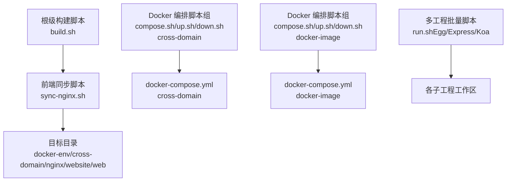
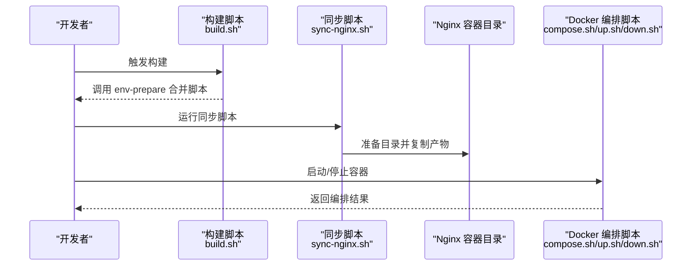
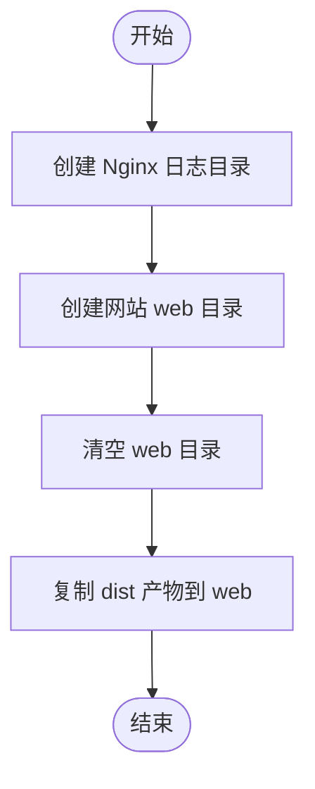
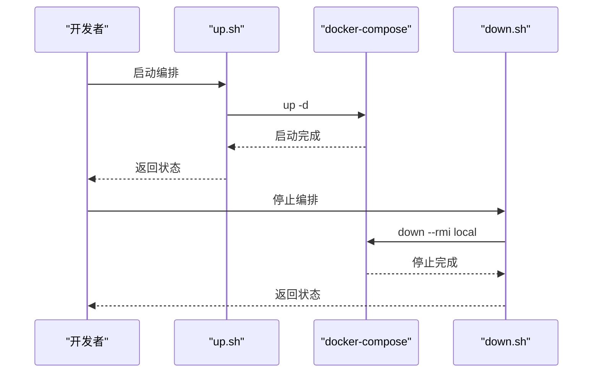
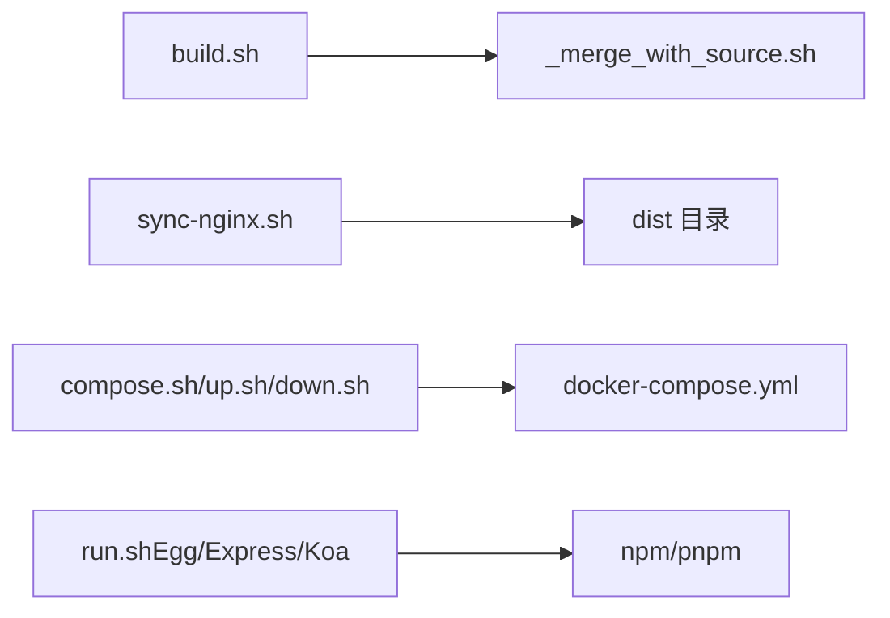

# 自动化脚本

<cite>
**本文引用的文件**
- [build.sh](file://build.sh)
- [sync-nginx.sh](file://practice/vue3-frontend/cross-domain/sync-nginx.sh)
- [compose.sh（cross-domain）](file://practice/docker-env/cross-domain/bin/compose.sh)
- [up.sh（cross-domain）](file://practice/docker-env/cross-domain/bin/up.sh)
- [down.sh（cross-domain）](file://practice/docker-env/cross-domain/bin/down.sh)
- [compose.sh（docker-image）](file://practice/docker-env/docker-image/bin/compose.sh)
- [up.sh（docker-image）](file://practice/docker-env/docker-image/bin/up.sh)
- [down.sh（docker-image）](file://practice/docker-env/docker-image/bin/down.sh)
- [run.sh（Egg 示例）](file://practice/nodejs-service/egg/run.sh)
- [run.sh（Express 示例）](file://practice/nodejs-service/express/run.sh)
- [run.sh（Koa 示例）](file://practice/nodejs-service/koa/run.sh)
</cite>

## 目录
1. [简介](#简介)
2. [项目结构](#项目结构)
3. [核心组件](#核心组件)
4. [架构总览](#架构总览)
5. [详细组件分析](#详细组件分析)
6. [依赖关系分析](#依赖关系分析)
7. [性能考虑](#性能考虑)
8. [故障排查指南](#故障排查指南)
9. [结论](#结论)
10. [附录](#附录)

## 简介
本指南聚焦于仓库中的自动化脚本，帮助你理解与定制以下三类任务：
- 构建脚本：将前端产物同步到 Nginx 容器可访问目录，实现快速部署与预览。
- Docker 脚本：通过 compose.sh、up.sh、down.sh 统一管理容器编排与服务启停。
- 工程化辅助脚本：批量对多子工程执行安装、校验与格式化等任务。

同时提供权限设置、环境变量配置、错误处理策略、调试技巧、日志记录与性能优化建议，便于按项目需求进行扩展与定制。

## 项目结构
围绕自动化脚本的关键位置如下：
- 根级构建入口：build.sh
- 前端构建后同步脚本：practice/vue3-frontend/cross-domain/sync-nginx.sh
- Docker 编排脚本组（cross-domain 场景）：practice/docker-env/cross-domain/bin/compose.sh、up.sh、down.sh
- Docker 编排脚本组（docker-image 场景）：practice/docker-env/docker-image/bin/compose.sh、up.sh、down.sh
- 多工程批量运行示例：practice/nodejs-service/*/run.sh

图表来源
- [build.sh:1-5](file://build.sh#L1-L5)
- [sync-nginx.sh:1-11](file://practice/vue3-frontend/cross-domain/sync-nginx.sh#L1-L11)
- [compose.sh（cross-domain）:1-6](file://practice/docker-env/cross-domain/bin/compose.sh#L1-L6)
- [up.sh（cross-domain）:1-6](file://practice/docker-env/cross-domain/bin/up.sh#L1-L6)
- [down.sh（cross-domain）:1-6](file://practice/docker-env/cross-domain/bin/down.sh#L1-L6)
- [compose.sh（docker-image）:1-6](file://practice/docker-env/docker-image/bin/compose.sh#L1-L6)
- [up.sh（docker-image）:1-6](file://practice/docker-env/docker-image/bin/up.sh#L1-L6)
- [down.sh（docker-image）:1-6](file://practice/docker-env/docker-image/bin/down.sh#L1-L6)

章节来源
- [build.sh:1-5](file://build.sh#L1-L5)
- [sync-nginx.sh:1-11](file://practice/vue3-frontend/cross-domain/sync-nginx.sh#L1-L11)
- [compose.sh（cross-domain）:1-6](file://practice/docker-env/cross-domain/bin/compose.sh#L1-L6)
- [up.sh（cross-domain）:1-6](file://practice/docker-env/cross-domain/bin/up.sh#L1-L6)
- [down.sh（cross-domain）:1-6](file://practice/docker-env/cross-domain/bin/down.sh#L1-L6)
- [compose.sh（docker-image）:1-6](file://practice/docker-env/docker-image/bin/compose.sh#L1-L6)
- [up.sh（docker-image）:1-6](file://practice/docker-env/docker-image/bin/up.sh#L1-L6)
- [down.sh（docker-image）:1-6](file://practice/docker-env/docker-image/bin/down.sh#L1-L6)

## 核心组件
- 根级构建脚本 build.sh
  - 功能：调用 env-prepare/utils/_merge_with_source.sh 执行构建前置合并逻辑。
  - 入口：bash env-prepare/utils/_merge_with_source.sh
  - 注意：根据 env-prepare/README.zh-CN.md 提示，该脚本已迁移至独立仓库，需确保本地存在对应脚本或切换到新仓库。

- 前端同步脚本 sync-nginx.sh
  - 功能：准备目标目录、清空旧内容、复制 dist 目录产物到 Nginx 可访问目录。
  - 关键步骤：创建日志与网站目录、清空 web 目录、复制前端构建产物。

- Docker 编排脚本组
  - compose.sh：统一透传 docker-compose 命令，自动定位 compose 文件路径。
  - up.sh：以守护进程方式启动编排栈。
  - down.sh：停止并删除本地镜像（--rmi local）。

章节来源
- [build.sh:1-5](file://build.sh#L1-L5)
- [sync-nginx.sh:1-11](file://practice/vue3-frontend/cross-domain/sync-nginx.sh#L1-L11)
- [compose.sh（cross-domain）:1-6](file://practice/docker-env/cross-domain/bin/compose.sh#L1-L6)
- [up.sh（cross-domain）:1-6](file://practice/docker-env/cross-domain/bin/up.sh#L1-L6)
- [down.sh（cross-domain）:1-6](file://practice/docker-env/cross-domain/bin/down.sh#L1-L6)
- [compose.sh（docker-image）:1-6](file://practice/docker-env/docker-image/bin/compose.sh#L1-L6)
- [up.sh（docker-image）:1-6](file://practice/docker-env/docker-image/bin/up.sh#L1-L6)
- [down.sh（docker-image）:1-6](file://practice/docker-env/docker-image/bin/down.sh#L1-L6)

## 架构总览
下图展示从构建到部署的典型流程：前端构建产物经由 sync-nginx.sh 同步至 Nginx 容器目录，随后通过 Docker 脚本进行编排与启停。

图表来源
- [build.sh:1-5](file://build.sh#L1-L5)
- [sync-nginx.sh:1-11](file://practice/vue3-frontend/cross-domain/sync-nginx.sh#L1-L11)
- [compose.sh（cross-domain）:1-6](file://practice/docker-env/cross-domain/bin/compose.sh#L1-L6)
- [up.sh（cross-domain）:1-6](file://practice/docker-env/cross-domain/bin/up.sh#L1-L6)
- [down.sh（cross-domain）:1-6](file://practice/docker-env/cross-domain/bin/down.sh#L1-L6)

## 详细组件分析

### 构建脚本 build.sh
- 设计要点
  - 使用 bash 解释器，保持跨平台一致性。
  - 通过相对路径定位 env-prepare/utils/_merge_with_source.sh 并执行。
- 可定制点
  - 添加 TypeScript 编译、资源打包、文件复制与清理步骤。
  - 将合并逻辑替换为自定义构建流水线。
- 错误处理
  - 当前未显式检查返回码；可在调用后检查 $? 并在失败时退出。
- 性能建议
  - 并行化不依赖上游的任务（如多工程 lint/format）。
  - 对大体积资源采用增量构建策略。

章节来源
- [build.sh:1-5](file://build.sh#L1-L5)

### 前端同步脚本 sync-nginx.sh
- 设计要点
  - 自动创建 Nginx 日志与网站目录，避免手动干预。
  - 清空 web 目录后再复制，确保产物一致性。
  - 将 dist 目录全部复制到容器可访问路径。
- 可定制点
  - 支持多环境（开发/测试/生产）目标目录映射。
  - 增加校验（如哈希比对）与回滚机制。
- 错误处理
  - 建议在 mkdir/cp/rm 前后检查返回码，并在失败时输出错误信息与退出码。
- 性能建议
  - 对于大型站点，可采用 rsync 或仅复制变更文件。
  - 避免在同步过程中重启 Nginx，必要时使用热重载或优雅信号。

图表来源
- [sync-nginx.sh:1-11](file://practice/vue3-frontend/cross-domain/sync-nginx.sh#L1-L11)

章节来源
- [sync-nginx.sh:1-11](file://practice/vue3-frontend/cross-domain/sync-nginx.sh#L1-L11)

### Docker 编排脚本组（cross-domain）
- 设计要点
  - compose.sh 通过定位脚本所在目录，自动拼接 docker-compose.yml 路径并透传参数。
  - up.sh 以守护进程方式启动，便于 CI/CD 持续运行。
  - down.sh 停止并删除本地镜像（--rmi local），释放空间。
- 可定制点
  - 支持多环境命名空间（-p）与多 compose 文件组合。
  - 增加健康检查、日志聚合与资源限制。
- 错误处理
  - 建议在 docker-compose 命令后检查返回码，失败时输出上下文信息。
- 性能建议
  - 启动时避免重复拉取镜像，使用本地缓存。
  - 对长时间运行的服务启用资源配额与监控。

图表来源
- [up.sh（cross-domain）:1-6](file://practice/docker-env/cross-domain/bin/up.sh#L1-L6)
- [down.sh（cross-domain）:1-6](file://practice/docker-env/cross-domain/bin/down.sh#L1-L6)
- [compose.sh（cross-domain）:1-6](file://practice/docker-env/cross-domain/bin/compose.sh#L1-L6)

章节来源
- [compose.sh（cross-domain）:1-6](file://practice/docker-env/cross-domain/bin/compose.sh#L1-L6)
- [up.sh（cross-domain）:1-6](file://practice/docker-env/cross-domain/bin/up.sh#L1-L6)
- [down.sh（cross-domain）:1-6](file://practice/docker-env/cross-domain/bin/down.sh#L1-L6)

### Docker 编排脚本组（docker-image）
- 设计要点
  - 与 cross-domain 场景一致，但命名空间与 compose 文件不同。
- 可定制点
  - 针对镜像构建场景，增加 build 参数与缓存策略。
- 错误处理
  - 建议在 compose 与 up/down 前后增加健壮性检查。
- 性能建议
  - 利用多阶段构建减少镜像体积，启用层缓存。

章节来源
- [compose.sh（docker-image）:1-6](file://practice/docker-env/docker-image/bin/compose.sh#L1-L6)
- [up.sh（docker-image）:1-6](file://practice/docker-env/docker-image/bin/up.sh#L1-L6)
- [down.sh（docker-image）:1-6](file://practice/docker-env/docker-image/bin/down.sh#L1-L6)

### 多工程批量运行脚本（Egg/Express/Koa）
- 设计要点
  - 遍历当前目录下的子工程，清理 node_modules、安装依赖、执行 lint 与格式化。
- 可定制点
  - 支持并发执行多个子工程任务，提升吞吐。
  - 将安装与校验命令抽象为可配置项，便于扩展新工具链。
- 错误处理
  - 建议在每个子工程执行前后记录日志与返回码，失败时中断或继续但汇总结果。
- 性能建议
  - 使用并行安装与校验，缩短整体耗时。

章节来源
- [run.sh（Egg 示例）:1-22](file://practice/nodejs-service/egg/run.sh#L1-L22)
- [run.sh（Express 示例）:1-22](file://practice/nodejs-service/express/run.sh#L1-L22)
- [run.sh（Koa 示例）:1-22](file://practice/nodejs-service/koa/run.sh#L1-L22)

## 依赖关系分析
- 脚本间耦合
  - build.sh 依赖 env-prepare/utils/_merge_with_source.sh 的可用性。
  - sync-nginx.sh 依赖 dist 目录的存在与权限。
  - Docker 脚本依赖 docker-compose.yml 的正确路径与权限。
- 外部依赖
  - docker-compose、bash、cp、rm、mkdir 等系统命令。
  - Node 生态工具（npm/pnpm）用于安装与校验。
- 潜在循环依赖
  - 当前脚本无直接循环依赖，但若在 compose.yml 中互相依赖容器，需谨慎设计启动顺序。

图表来源
- [build.sh:1-5](file://build.sh#L1-L5)
- [sync-nginx.sh:1-11](file://practice/vue3-frontend/cross-domain/sync-nginx.sh#L1-L11)
- [compose.sh（cross-domain）:1-6](file://practice/docker-env/cross-domain/bin/compose.sh#L1-L6)
- [run.sh（Egg 示例）:1-22](file://practice/nodejs-service/egg/run.sh#L1-L22)

章节来源
- [build.sh:1-5](file://build.sh#L1-L5)
- [sync-nginx.sh:1-11](file://practice/vue3-frontend/cross-domain/sync-nginx.sh#L1-L11)
- [compose.sh（cross-domain）:1-6](file://practice/docker-env/cross-domain/bin/compose.sh#L1-L6)
- [run.sh（Egg 示例）:1-22](file://practice/nodejs-service/egg/run.sh#L1-L22)

## 性能考虑
- 并行化
  - 在多工程场景中，使用并行安装与校验，减少等待时间。
- 增量构建
  - 前端同步阶段采用 rsync 或仅复制变更文件，降低 IO 开销。
- 缓存利用
  - docker-compose 与包管理器的缓存策略，避免重复下载与构建。
- 资源控制
  - 为容器设置 CPU/内存配额，防止资源争用影响构建稳定性。

## 故障排查指南
- 权限问题
  - 确保脚本具备执行权限：chmod +x *.sh。
  - 确认用户对目标目录（dist、nginx logs、web）有读写权限。
- 环境变量
  - 如需指定 docker-compose 命令路径或命名空间，可在脚本中显式声明或通过外部环境注入。
- 错误处理
  - 在关键命令后检查返回码，失败时输出详细日志与退出码。
  - 对敏感操作（rm -rf）增加确认提示或备份策略。
- 日志记录
  - 将标准输出与错误输出重定向到日志文件，便于回溯。
- 调试技巧
  - 使用 set -x 快速定位执行流。
  - 分段执行脚本，逐步缩小问题范围。

章节来源
- [sync-nginx.sh:1-11](file://practice/vue3-frontend/cross-domain/sync-nginx.sh#L1-L11)
- [compose.sh（cross-domain）:1-6](file://practice/docker-env/cross-domain/bin/compose.sh#L1-L6)
- [up.sh（cross-domain）:1-6](file://practice/docker-env/cross-domain/bin/up.sh#L1-L6)
- [down.sh（cross-domain）:1-6](file://practice/docker-env/cross-domain/bin/down.sh#L1-L6)

## 结论
本指南提供了从构建、同步到容器编排的完整自动化脚本使用与定制方法。通过明确的错误处理、日志记录与性能优化策略，你可以将这些脚本适配到更复杂的工程场景，并按需扩展新的工具链与流程。

## 附录
- 执行权限设置
  - chmod +x build.sh practice/vue3-frontend/cross-domain/sync-nginx.sh practice/docker-env/*/bin/*.sh
- 环境变量配置
  - 在脚本头部或外部配置文件中设置命名空间（-p）、compose 文件路径等。
- 定制建议
  - 新增构建步骤：在 build.sh 中插入 TypeScript 编译、资源打包与清理命令。
  - 修改部署流程：在 sync-nginx.sh 中增加校验与回滚逻辑。
  - 集成新工具链：在 run.sh 中新增命令并支持并行执行。