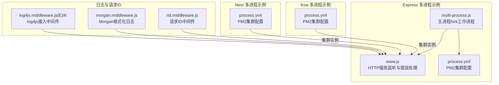
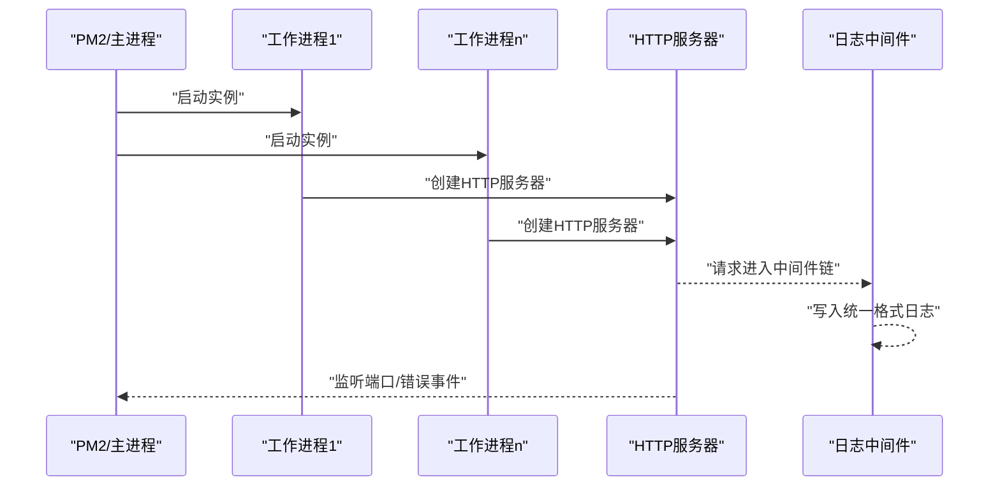
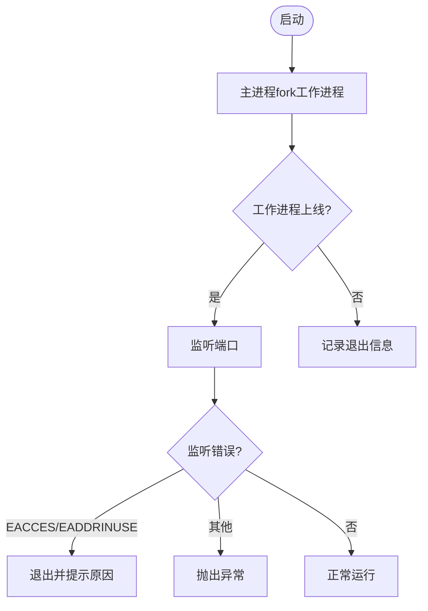
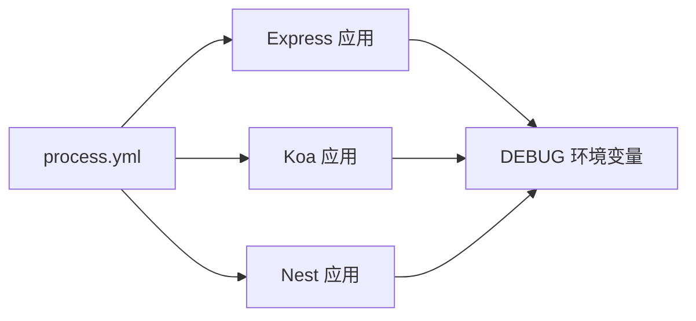
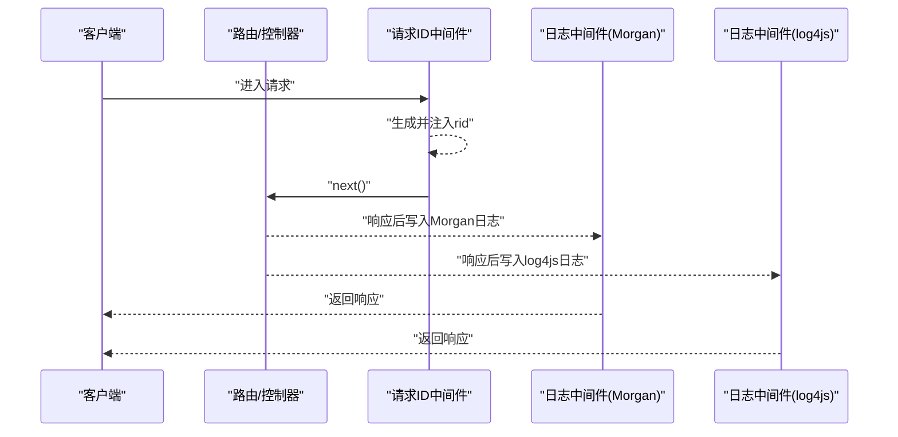
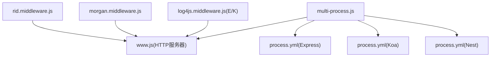

# 调试与性能分析

<cite>
**本文引用的文件**
- [practice/nodejs-service/express/multi-process-cluster/bin/multi-process.js](file://practice/nodejs-service/express/multi-process-cluster/bin/multi-process.js)
- [practice/nodejs-service/express/multi-process-cluster/bin/www.js](file://practice/nodejs-service/express/multi-process-cluster/bin/www.js)
- [practice/nodejs-service/express/multi-process-pm2/process.yml](file://practice/nodejs-service/express/multi-process-pm2/process.yml)
- [practice/nodejs-service/koa/multi-process-pm2/process.yml](file://practice/nodejs-service/koa/multi-process-pm2/process.yml)
- [practice/nodejs-service/nest/multi-process-pm2/process.yml](file://practice/nodejs-service/nest/multi-process-pm2/process.yml)
- [practice/nodejs-service/express/request-id/middleware/rid.middleware.js](file://practice/nodejs-service/express/request-id/middleware/rid.middleware.js)
- [practice/nodejs-service/express/request-log-morgan/middleware/morgan.middleware.js](file://practice/nodejs-service/express/request-log-morgan/middleware/morgan.middleware.js)
- [practice/nodejs-service/express/request-log-log4js/middleware/log4js.middleware.js](file://practice/nodejs-service/express/request-log-log4js/middleware/log4js.middleware.js)
- [practice/nodejs-service/koa/request-log-log4js/middleware/log4js.middleware.js](file://practice/nodejs-service/koa/request-log-log4js/middleware/log4js.middleware.js)
</cite>

## 目录
1. 引言
2. 项目结构
3. 核心组件
4. 架构总览
5. 组件详解
6. 依赖关系分析
7. 性能考量
8. 故障排查指南
9. 结论
10. 附录

## 引言
本指南面向Node.js应用开发者，系统讲解调试与性能分析方法，覆盖断点调试、条件断点、异步堆栈跟踪、多进程调试（含cluster与PM2）、CPU/内存/网络性能分析、Chrome DevTools与Node内置调试器的高级用法，并对Egg.js、Express、Koa、NestJS等框架的调试差异进行对比。同时提供日志分析、错误追踪、性能瓶颈定位以及生产环境调试的安全与监控建议。

## 项目结构
该仓库包含多个Node.js示例工程，涵盖Express/Koa/Nest等框架及Egg.js生态，配套了请求ID生成、日志中间件（Morgan、log4js）以及多进程调试配置（cluster与PM2）。这些文件为本指南提供了真实可操作的参考路径。

图示来源
- [practice/nodejs-service/express/multi-process-cluster/bin/multi-process.js:1-24](file://practice/nodejs-service/express/multi-process-cluster/bin/multi-process.js#L1-L24)
- [practice/nodejs-service/express/multi-process-cluster/bin/www.js:1-88](file://practice/nodejs-service/express/multi-process-cluster/bin/www.js#L1-L88)
- [practice/nodejs-service/express/multi-process-pm2/process.yml:1-9](file://practice/nodejs-service/express/multi-process-pm2/process.yml#L1-L9)
- [practice/nodejs-service/koa/multi-process-pm2/process.yml:1-7](file://practice/nodejs-service/koa/multi-process-pm2/process.yml#L1-L7)
- [practice/nodejs-service/nest/multi-process-pm2/process.yml:1-7](file://practice/nodejs-service/nest/multi-process-pm2/process.yml#L1-L7)
- [practice/nodejs-service/express/request-id/middleware/rid.middleware.js:1-35](file://practice/nodejs-service/express/request-id/middleware/rid.middleware.js#L1-L35)
- [practice/nodejs-service/express/request-log-morgan/middleware/morgan.middleware.js:1-34](file://practice/nodejs-service/express/request-log-morgan/middleware/morgan.middleware.js#L1-L34)
- [practice/nodejs-service/express/request-log-log4js/middleware/log4js.middleware.js:1-34](file://practice/nodejs-service/express/request-log-log4js/middleware/log4js.middleware.js#L1-L34)
- [practice/nodejs-service/koa/request-log-log4js/middleware/log4js.middleware.js:1-39](file://practice/nodejs-service/koa/request-log-log4js/middleware/log4js.middleware.js#L1-L39)

章节来源
- [practice/nodejs-service/express/multi-process-cluster/bin/multi-process.js:1-24](file://practice/nodejs-service/express/multi-process-cluster/bin/multi-process.js#L1-L24)
- [practice/nodejs-service/express/multi-process-cluster/bin/www.js:1-88](file://practice/nodejs-service/express/multi-process-cluster/bin/www.js#L1-L88)
- [practice/nodejs-service/express/multi-process-pm2/process.yml:1-9](file://practice/nodejs-service/express/multi-process-pm2/process.yml#L1-L9)
- [practice/nodejs-service/koa/multi-process-pm2/process.yml:1-7](file://practice/nodejs-service/koa/multi-process-pm2/process.yml#L1-L7)
- [practice/nodejs-service/nest/multi-process-pm2/process.yml:1-7](file://practice/nodejs-service/nest/multi-process-pm2/process.yml#L1-L7)
- [practice/nodejs-service/express/request-id/middleware/rid.middleware.js:1-35](file://practice/nodejs-service/express/request-id/middleware/rid.middleware.js#L1-L35)
- [practice/nodejs-service/express/request-log-morgan/middleware/morgan.middleware.js:1-34](file://practice/nodejs-service/express/request-log-morgan/middleware/morgan.middleware.js#L1-L34)
- [practice/nodejs-service/express/request-log-log4js/middleware/log4js.middleware.js:1-34](file://practice/nodejs-service/express/request-log-log4js/middleware/log4js.middleware.js#L1-L34)
- [practice/nodejs-service/koa/request-log-log4js/middleware/log4js.middleware.js:1-39](file://practice/nodejs-service/koa/request-log-log4js/middleware/log4js.middleware.js#L1-L39)

## 核心组件
- 多进程调试基础：Express的cluster实现与PM2集群配置，便于理解多进程调试入口与进程间通信。
- 请求ID与日志：通过中间件生成请求ID并在日志中透传，形成端到端追踪线索；Morgan与log4js两种日志方案。
- 错误处理与监听：HTTP服务器错误事件处理与友好提示，避免因端口占用或权限问题导致的启动失败。

章节来源
- [practice/nodejs-service/express/multi-process-cluster/bin/multi-process.js:1-24](file://practice/nodejs-service/express/multi-process-cluster/bin/multi-process.js#L1-L24)
- [practice/nodejs-service/express/multi-process-cluster/bin/www.js:49-87](file://practice/nodejs-service/express/multi-process-cluster/bin/www.js#L49-L87)
- [practice/nodejs-service/express/request-id/middleware/rid.middleware.js:14-28](file://practice/nodejs-service/express/request-id/middleware/rid.middleware.js#L14-L28)
- [practice/nodejs-service/express/request-log-morgan/middleware/morgan.middleware.js:28-33](file://practice/nodejs-service/express/request-log-morgan/middleware/morgan.middleware.js#L28-L33)
- [practice/nodejs-service/express/request-log-log4js/middleware/log4js.middleware.js:22-33](file://practice/nodejs-service/express/request-log-log4js/middleware/log4js.middleware.js#L22-L33)
- [practice/nodejs-service/koa/request-log-log4js/middleware/log4js.middleware.js:22-38](file://practice/nodejs-service/koa/request-log-log4js/middleware/log4js.middleware.js#L22-L38)

## 架构总览
下图展示Express多进程调试的典型流程：主进程fork多个工作进程，每个进程运行HTTP服务器；PM2同样以cluster模式启动多个实例；日志中间件在请求链路中输出统一格式日志，配合请求ID实现跨进程追踪。

图示来源
- [practice/nodejs-service/express/multi-process-cluster/bin/multi-process.js:4-23](file://practice/nodejs-service/express/multi-process-cluster/bin/multi-process.js#L4-L23)
- [practice/nodejs-service/express/multi-process-cluster/bin/www.js:43-87](file://practice/nodejs-service/express/multi-process-cluster/bin/www.js#L43-L87)
- [practice/nodejs-service/express/multi-process-pm2/process.yml:1-9](file://practice/nodejs-service/express/multi-process-pm2/process.yml#L1-L9)
- [practice/nodejs-service/express/request-log-morgan/middleware/morgan.middleware.js:28-33](file://practice/nodejs-service/express/request-log-morgan/middleware/morgan.middleware.js#L28-L33)

## 组件详解

### Express 多进程调试（cluster）
- 主进程逻辑：fork多个工作进程，监听在线与退出事件，便于观察各实例生命周期。
- 工作进程：加载HTTP服务器，监听端口并处理错误事件，确保异常可诊断。
- 调试要点：结合DEBUG命名空间输出与日志中间件，快速定位请求路径与响应时间。

图示来源
- [practice/nodejs-service/express/multi-process-cluster/bin/multi-process.js:4-23](file://practice/nodejs-service/express/multi-process-cluster/bin/multi-process.js#L4-L23)
- [practice/nodejs-service/express/multi-process-cluster/bin/www.js:49-87](file://practice/nodejs-service/express/multi-process-cluster/bin/www.js#L49-L87)

章节来源
- [practice/nodejs-service/express/multi-process-cluster/bin/multi-process.js:1-24](file://practice/nodejs-service/express/multi-process-cluster/bin/multi-process.js#L1-L24)
- [practice/nodejs-service/express/multi-process-cluster/bin/www.js:1-88](file://practice/nodejs-service/express/multi-process-cluster/bin/www.js#L1-L88)

### PM2 集群调试（Express/Koa/Nest）
- 配置要点：指定script、mode为cluster、instances数量，以及环境变量（如DEBUG）。
- 实践建议：为不同应用设置独立namespace，便于区分日志与指标；在生产环境开启日志轮转与采样。

图示来源
- [practice/nodejs-service/express/multi-process-pm2/process.yml:1-9](file://practice/nodejs-service/express/multi-process-pm2/process.yml#L1-L9)
- [practice/nodejs-service/koa/multi-process-pm2/process.yml:1-7](file://practice/nodejs-service/koa/multi-process-pm2/process.yml#L1-L7)
- [practice/nodejs-service/nest/multi-process-pm2/process.yml:1-7](file://practice/nodejs-service/nest/multi-process-pm2/process.yml#L1-L7)

章节来源
- [practice/nodejs-service/express/multi-process-pm2/process.yml:1-9](file://practice/nodejs-service/express/multi-process-pm2/process.yml#L1-L9)
- [practice/nodejs-service/koa/multi-process-pm2/process.yml:1-7](file://practice/nodejs-service/koa/multi-process-pm2/process.yml#L1-L7)
- [practice/nodejs-service/nest/multi-process-pm2/process.yml:1-7](file://practice/nodejs-service/nest/multi-process-pm2/process.yml#L1-L7)

### 请求ID与日志中间件
- 请求ID中间件：基于cls-hooked创建命名空间，生成递增ID并注入上下文，贯穿请求链路。
- 日志中间件（Morgan）：自定义token输出pid、时间戳、级别、标记等字段，统一格式便于检索。
- 日志中间件（log4js）：配置控制台appender与连接器，支持在Express/Koa中按需接入。

图示来源
- [practice/nodejs-service/express/request-id/middleware/rid.middleware.js:14-28](file://practice/nodejs-service/express/request-id/middleware/rid.middleware.js#L14-L28)
- [practice/nodejs-service/express/request-log-morgan/middleware/morgan.middleware.js:10-33](file://practice/nodejs-service/express/request-log-morgan/middleware/morgan.middleware.js#L10-L33)
- [practice/nodejs-service/express/request-log-log4js/middleware/log4js.middleware.js:22-33](file://practice/nodejs-service/express/request-log-log4js/middleware/log4js.middleware.js#L22-L33)
- [practice/nodejs-service/koa/request-log-log4js/middleware/log4js.middleware.js:22-38](file://practice/nodejs-service/koa/request-log-log4js/middleware/log4js.middleware.js#L22-L38)

章节来源
- [practice/nodejs-service/express/request-id/middleware/rid.middleware.js:1-35](file://practice/nodejs-service/express/request-id/middleware/rid.middleware.js#L1-L35)
- [practice/nodejs-service/express/request-log-morgan/middleware/morgan.middleware.js:1-34](file://practice/nodejs-service/express/request-log-morgan/middleware/morgan.middleware.js#L1-L34)
- [practice/nodejs-service/express/request-log-log4js/middleware/log4js.middleware.js:1-34](file://practice/nodejs-service/express/request-log-log4js/middleware/log4js.middleware.js#L1-L34)
- [practice/nodejs-service/koa/request-log-log4js/middleware/log4js.middleware.js:1-39](file://practice/nodejs-service/koa/request-log-log4js/middleware/log4js.middleware.js#L1-L39)

### 框架调试差异（Egg.js/Express/Koa/Nest）
- Egg.js：示例中包含请求ID与日志配置文件，可类比Express/Koa的中间件实践；注意其约定式目录结构与插件机制。
- Express：使用cluster或PM2集群部署，结合DEBUG命名空间与日志中间件进行调试。
- Koa：与Express类似，但中间件风格为async/await，日志接入方式略有差异。
- Nest：编译产物dist/main.js作为PM2入口，调试时需关注构建产物与源码映射。

章节来源
- [practice/nodejs-service/express/multi-process-pm2/process.yml:1-9](file://practice/nodejs-service/express/multi-process-pm2/process.yml#L1-L9)
- [practice/nodejs-service/koa/multi-process-pm2/process.yml:1-7](file://practice/nodejs-service/koa/multi-process-pm2/process.yml#L1-L7)
- [practice/nodejs-service/nest/multi-process-pm2/process.yml:1-7](file://practice/nodejs-service/nest/multi-process-pm2/process.yml#L1-L7)

## 依赖关系分析
- 运行时依赖：cluster、http、cls-hooked、morgan、log4js等。
- 配置依赖：PM2配置文件定义应用名、脚本、集群模式与实例数。
- 耦合性：日志中间件与请求ID中间件解耦于业务路由，便于复用与替换。

图示来源
- [practice/nodejs-service/express/multi-process-cluster/bin/multi-process.js:1-24](file://practice/nodejs-service/express/multi-process-cluster/bin/multi-process.js#L1-L24)
- [practice/nodejs-service/express/multi-process-cluster/bin/www.js:1-88](file://practice/nodejs-service/express/multi-process-cluster/bin/www.js#L1-L88)
- [practice/nodejs-service/express/multi-process-pm2/process.yml:1-9](file://practice/nodejs-service/express/multi-process-pm2/process.yml#L1-L9)
- [practice/nodejs-service/koa/multi-process-pm2/process.yml:1-7](file://practice/nodejs-service/koa/multi-process-pm2/process.yml#L1-L7)
- [practice/nodejs-service/nest/multi-process-pm2/process.yml:1-7](file://practice/nodejs-service/nest/multi-process-pm2/process.yml#L1-L7)
- [practice/nodejs-service/express/request-id/middleware/rid.middleware.js:1-35](file://practice/nodejs-service/express/request-id/middleware/rid.middleware.js#L1-L35)
- [practice/nodejs-service/express/request-log-morgan/middleware/morgan.middleware.js:1-34](file://practice/nodejs-service/express/request-log-morgan/middleware/morgan.middleware.js#L1-L34)
- [practice/nodejs-service/express/request-log-log4js/middleware/log4js.middleware.js:1-34](file://practice/nodejs-service/express/request-log-log4js/middleware/log4js.middleware.js#L1-L34)
- [practice/nodejs-service/koa/request-log-log4js/middleware/log4js.middleware.js:1-39](file://practice/nodejs-service/koa/request-log-log4js/middleware/log4js.middleware.js#L1-L39)

## 性能考量
- CPU分析：使用Node内置profiler或Chrome DevTools采集火焰图，定位热点函数；在PM2中可通过进程级采样与日志响应时间评估。
- 内存泄漏检测：结合heap snapshot与增长曲线，关注长生命周期对象与闭包持有；在cluster模式下逐个实例检查。
- 网络性能监控：利用日志中间件统计响应时间、状态码分布与错误率，结合APM工具做端到端追踪。
- 并发与阻塞：避免在主进程中执行重任务，保持主进程只负责fork；工作进程内避免同步阻塞调用。

## 故障排查指南
- 启动失败（端口占用/权限不足）：根据HTTP服务器错误事件输出提示，修正端口或权限。
- 多进程崩溃：查看cluster在线/退出事件日志，结合应用日志定位异常点。
- 日志不一致：统一使用Morgan或log4js格式，确保请求ID贯穿所有中间件。
- 生产调试安全：限制DEBUG范围、关闭敏感信息输出、启用访问控制与审计日志。

章节来源
- [practice/nodejs-service/express/multi-process-cluster/bin/www.js:49-87](file://practice/nodejs-service/express/multi-process-cluster/bin/www.js#L49-L87)

## 结论
通过cluster与PM2的多进程调试配置、统一的日志与请求ID中间件，以及针对Express/Koa/Nest的差异化实践，可以有效提升Node.js应用的可观测性与可维护性。结合CPU/内存/网络性能分析工具，可在开发与生产环境中快速定位问题并优化性能。

## 附录
- Chrome DevTools高级用法：断点调试、条件断点、异步堆栈跟踪、内存快照与性能面板。
- Node内置调试器：inspect-brk、--inspect与远程调试配置。
- 生产监控：APM集成、日志聚合、告警策略与金丝雀发布。