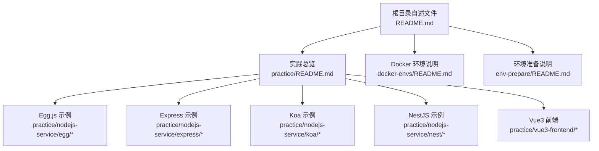
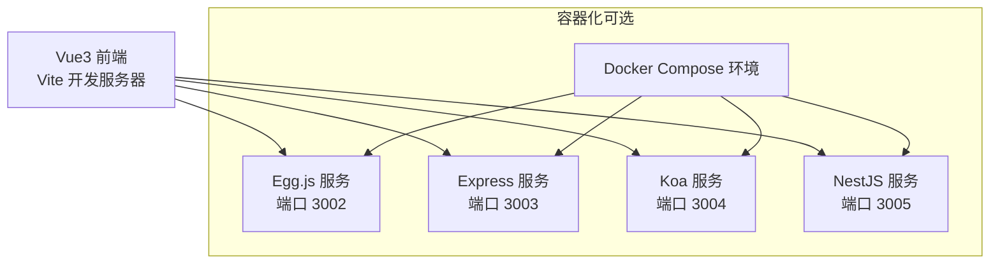
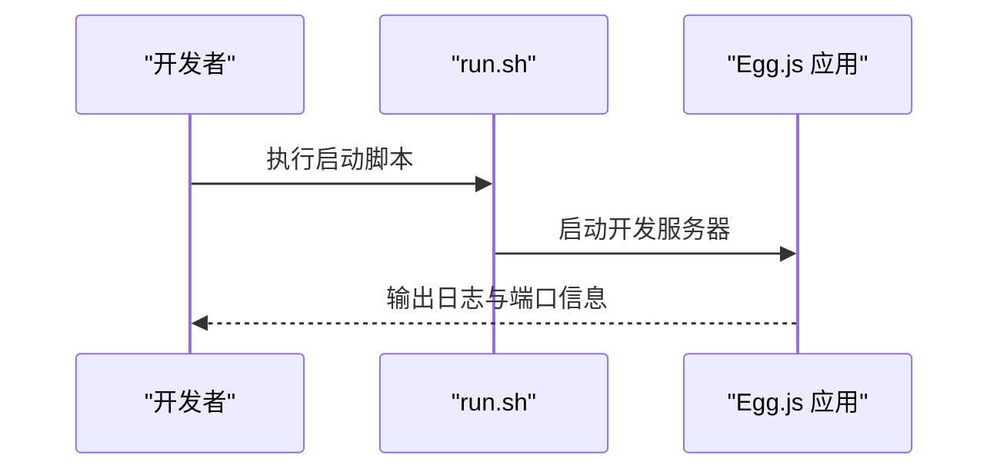
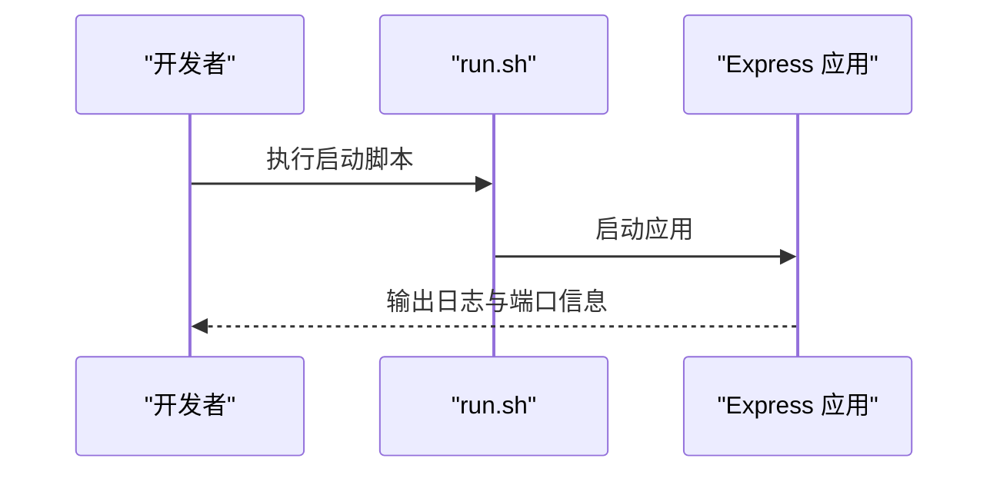
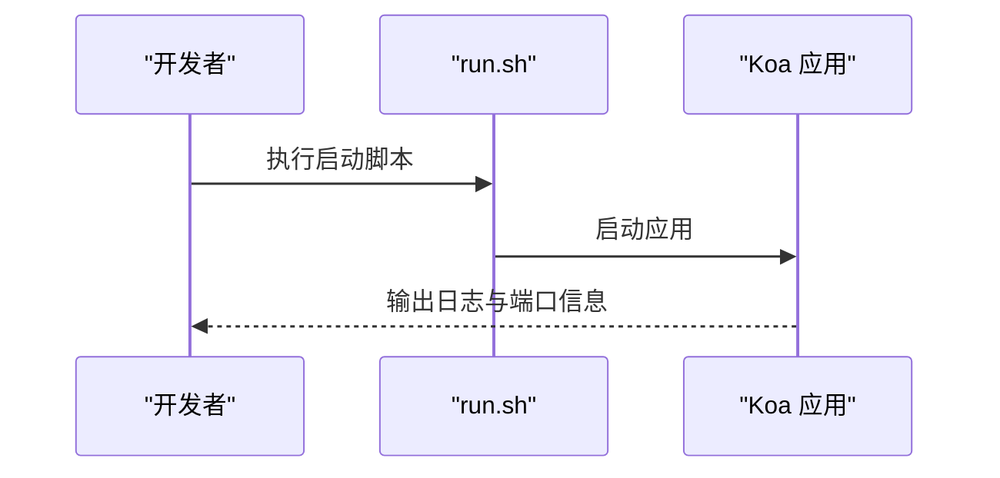
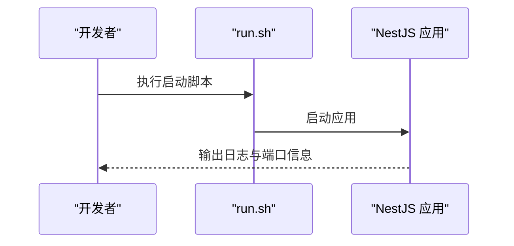
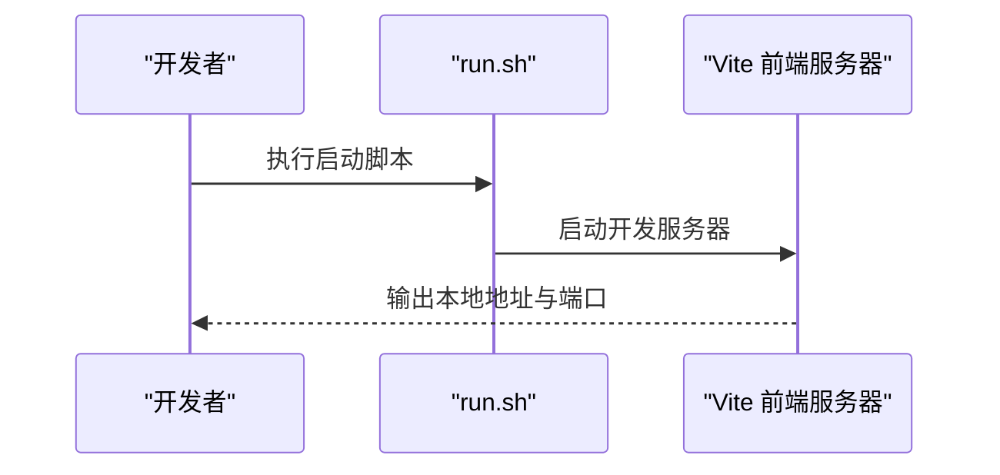
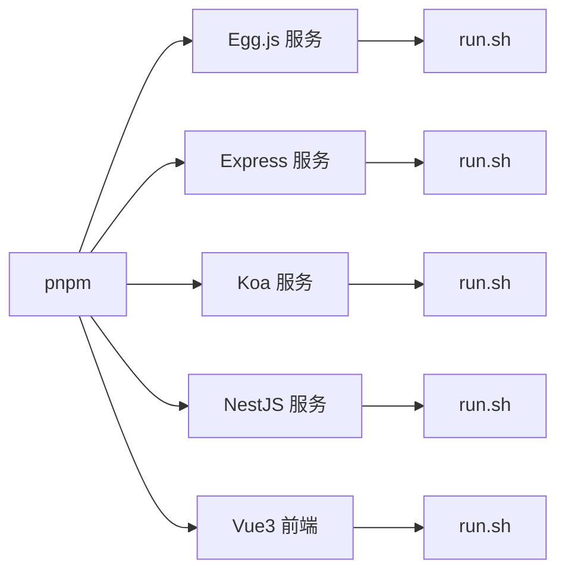

# 快速开始

<cite>
**本文引用的文件**
- [根目录自述文件](file://README.md)
- [实践总览](file://practice/README.md)
- [Egg.js 模板 package.json](file://practice/nodejs-service/egg/cross-domain/package.json)
- [Express 示例 package.json](file://practice/nodejs-service/express/cross-domain/package.json)
- [Koa 示例 package.json](file://practice/nodejs-service/koa/cross-domain/package.json)
- [NestJS 示例 package.json](file://practice/nodejs-service/nest/cross-domain/package.json)
- [Vue3 前端 package.json](file://practice/vue3-frontend/cross-domain/package.json)
- [Egg.js 运行脚本](file://practice/nodejs-service/egg/run.sh)
- [Express 运行脚本](file://practice/nodejs-service/express/run.sh)
- [Koa 运行脚本](file://practice/nodejs-service/koa/run.sh)
- [NestJS 运行脚本](file://practice/nodejs-service/nest/run.sh)
- [Docker 环境说明](file://docker-envs/README.md)
- [环境准备说明](file://env-prepare/README.md)
</cite>

## 目录
1. [简介](#简介)
2. [项目结构](#项目结构)
3. [核心组件](#核心组件)
4. [架构概览](#架构概览)
5. [详细组件分析](#详细组件分析)
6. [依赖分析](#依赖分析)
7. [性能考虑](#性能考虑)
8. [故障排除指南](#故障排除指南)
9. [结论](#结论)
10. [附录](#附录)

## 简介
本指南面向希望快速搭建并运行 Collection-Space 项目的开发者，覆盖以下内容：
- 环境准备：Node.js 版本要求、包管理器（pnpm）选择与依赖安装
- 各服务组件启动：Egg.js、Express、Koa、NestJS 以及 Vue3 前端
- Docker 容器化快速启动
- 常见问题与验证步骤，帮助你快速看到预期效果

## 项目结构
该项目以“实践”为主线，提供多框架后端示例与 Vue3 前端示例，便于对比学习与快速上手。

图示来源
- [根目录自述文件:1-18](file://README.md#L1-L18)
- [实践总览:1-26](file://practice/README.md#L1-L26)
- [Docker 环境说明:1-6](file://docker-envs/README.md#L1-L6)
- [环境准备说明:1-6](file://env-prepare/README.md#L1-L6)

章节来源
- [根目录自述文件:1-18](file://README.md#L1-L18)
- [实践总览:1-26](file://practice/README.md#L1-L26)

## 核心组件
- Egg.js 服务：基于 TypeScript 的企业级框架，提供开发模式与生产模式启动脚本
- Express 服务：轻量 Web 框架，支持多种中间件与跨域方案
- Koa 服务：更小、更富有想象力且更健壮的 Web 框架
- NestJS 服务：渐进式 Node.js 框架，结合 TypeScript 与 RxJS
- Vue3 前端：使用 Vite 构建的现代前端应用，演示跨域等交互

章节来源
- [实践总览:12-26](file://practice/README.md#L12-L26)

## 架构概览
下图展示各组件在本地的典型运行关系：前端通过代理或直接访问后端服务，后端服务可按需扩展为多进程或容器化部署。

图示来源
- [Egg.js 模板 package.json:9-22](file://practice/nodejs-service/egg/cross-domain/package.json#L9-L22)
- [Express 示例 package.json:1-200](file://practice/nodejs-service/express/cross-domain/package.json#L1-L200)
- [Koa 示例 package.json:1-200](file://practice/nodejs-service/koa/cross-domain/package.json#L1-L200)
- [NestJS 示例 package.json:1-200](file://practice/nodejs-service/nest/cross-domain/package.json#L1-L200)
- [Vue3 前端 package.json:1-200](file://practice/vue3-frontend/cross-domain/package.json#L1-L200)

## 详细组件分析

### 环境与依赖准备
- Node.js 版本要求：请参考各服务模板中的 engines 字段，确保本地 Node.js 版本满足要求
- 包管理器：推荐使用 pnpm，以获得更快的安装速度与更好的磁盘占用
- 依赖安装：在各服务根目录执行 pnpm 安装命令，完成依赖下载

章节来源
- [Egg.js 模板 package.json:48-50](file://practice/nodejs-service/egg/cross-domain/package.json#L48-L50)

### Egg.js 服务启动
- 开发模式：在 Egg.js 模板根目录执行启动脚本，监听指定端口
- 生产模式：可使用内置脚本进行守护进程启动
- 停止服务：提供停止脚本，释放端口资源

图示来源
- [Egg.js 运行脚本](file://practice/nodejs-service/egg/run.sh)
- [Egg.js 模板 package.json:9-22](file://practice/nodejs-service/egg/cross-domain/package.json#L9-L22)

章节来源
- [Egg.js 模板 package.json:9-22](file://practice/nodejs-service/egg/cross-domain/package.json#L9-L22)
- [Egg.js 运行脚本](file://practice/nodejs-service/egg/run.sh)

### Express 服务启动
- 多种示例：包含跨域、请求日志、请求 ID、模板等变体
- 启动方式：在对应示例目录执行启动脚本或使用包管理器脚本

图示来源
- [Express 运行脚本](file://practice/nodejs-service/express/run.sh)
- [Express 示例 package.json:1-200](file://practice/nodejs-service/express/cross-domain/package.json#L1-L200)

章节来源
- [Express 示例 package.json:1-200](file://practice/nodejs-service/express/cross-domain/package.json#L1-L200)
- [Express 运行脚本](file://practice/nodejs-service/express/run.sh)

### Koa 服务启动
- 多种示例：包含跨域、请求日志、请求 ID、模板等变体
- 启动方式：在对应示例目录执行启动脚本或使用包管理器脚本

图示来源
- [Koa 运行脚本](file://practice/nodejs-service/koa/run.sh)
- [Koa 示例 package.json:1-200](file://practice/nodejs-service/koa/cross-domain/package.json#L1-L200)

章节来源
- [Koa 示例 package.json:1-200](file://practice/nodejs-service/koa/cross-domain/package.json#L1-L200)
- [Koa 运行脚本](file://practice/nodejs-service/koa/run.sh)

### NestJS 服务启动
- 多种示例：包含跨域、请求日志、请求 ID、模板等变体
- 启动方式：在对应示例目录执行启动脚本或使用包管理器脚本

图示来源
- [NestJS 运行脚本](file://practice/nodejs-service/nest/run.sh)
- [NestJS 示例 package.json:1-200](file://practice/nodejs-service/nest/cross-domain/package.json#L1-L200)

章节来源
- [NestJS 示例 package.json:1-200](file://practice/nodejs-service/nest/cross-domain/package.json#L1-L200)
- [NestJS 运行脚本](file://practice/nodejs-service/nest/run.sh)

### Vue3 前端启动
- 使用 Vite 开发服务器，提供热更新与跨域代理能力
- 启动方式：在前端根目录执行启动脚本或使用包管理器脚本

图示来源
- [Vue3 前端 package.json:1-200](file://practice/vue3-frontend/cross-domain/package.json#L1-L200)

章节来源
- [Vue3 前端 package.json:1-200](file://practice/vue3-frontend/cross-domain/package.json#L1-L200)

### Docker 容器化快速启动
- Docker 环境说明：相关脚本已迁移至独立仓库，可前往查看最新示例
- 建议流程：在各服务的 docker-image 或 cross-domain 目录中，使用提供的 dockerfile 与 compose 文件构建镜像并启动容器

章节来源
- [Docker 环境说明:1-6](file://docker-envs/README.md#L1-L6)

## 依赖分析
- 统一使用 pnpm 作为包管理器，提升安装效率与一致性
- 各服务模板均定义了 engines 字段，确保 Node.js 版本满足要求
- 启动脚本位于各服务根目录的 run.sh，便于一键启动

图示来源
- [Egg.js 模板 package.json:48-50](file://practice/nodejs-service/egg/cross-domain/package.json#L48-L50)
- [Express 示例 package.json:1-200](file://practice/nodejs-service/express/cross-domain/package.json#L1-L200)
- [Koa 示例 package.json:1-200](file://practice/nodejs-service/koa/cross-domain/package.json#L1-L200)
- [NestJS 示例 package.json:1-200](file://practice/nodejs-service/nest/cross-domain/package.json#L1-L200)
- [Vue3 前端 package.json:1-200](file://practice/vue3-frontend/cross-domain/package.json#L1-L200)

## 性能考虑
- 使用 pnpm 可减少磁盘占用并加速安装
- 后端服务建议在生产环境采用多进程或容器化部署，以提升稳定性与资源利用率
- 前端开发阶段启用 Vite 的热更新功能，缩短迭代周期

## 故障排除指南
- Node.js 版本不匹配：检查各服务模板 engines 字段，升级或切换到符合要求的 Node.js 版本
- 端口冲突：修改服务监听端口或释放被占用端口
- 依赖安装失败：清理缓存后重试，或更换镜像源；确认网络连通性
- 跨域问题：根据示例中的跨域配置调整 CORS 设置
- Docker 启动异常：检查 dockerfile 与 compose 配置，确保镜像构建成功

章节来源
- [Egg.js 模板 package.json:48-50](file://practice/nodejs-service/egg/cross-domain/package.json#L48-L50)
- [Docker 环境说明:1-6](file://docker-envs/README.md#L1-L6)
- [环境准备说明:1-6](file://env-prepare/README.md#L1-L6)

## 结论
通过本指南，你可以快速完成环境准备、安装依赖并启动所有服务组件。建议先从前端入手，再逐一启动后端服务，最后根据需要进行 Docker 容器化部署。遇到问题时，优先核对 Node.js 版本与端口占用情况，并参考各服务模板的启动脚本与配置文件。

## 附录
- API 文档入口：可在实践总览中找到 API 接口文档链接，便于联调测试
- 相关仓库：如需更多示例与脚本，请参考迁移后的独立仓库链接

章节来源
- [根目录自述文件:15-15](file://README.md#L15-L15)
- [实践总览:1-26](file://practice/README.md#L1-L26)