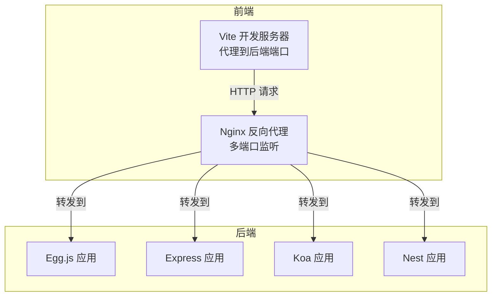
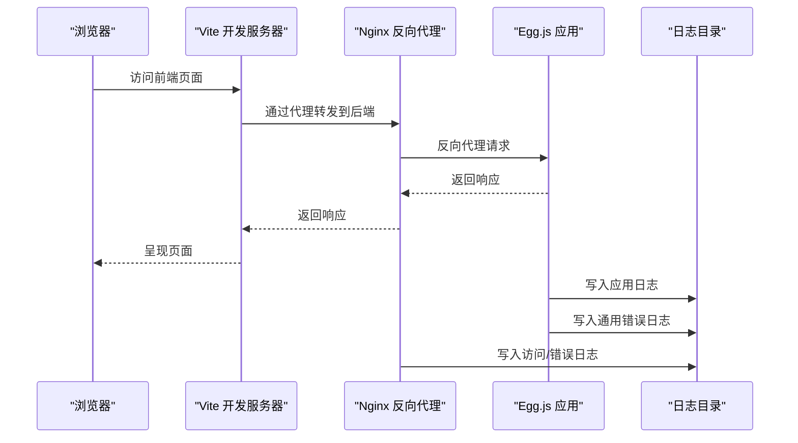
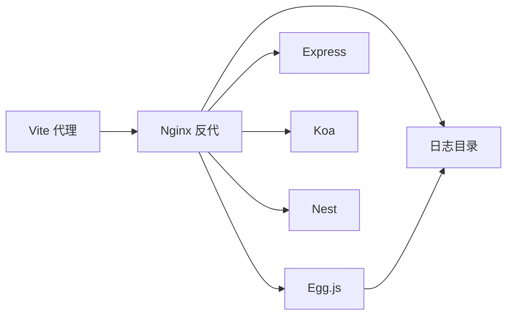

# 故障排除指南

<cite>
**本文引用的文件**
- [根目录说明](file://README.md)
- [根目录说明（中文）](file://README.zh-CN.md)
- [跨域演示 Docker Compose（前端+后端）](file://practice/docker-env/cross-domain/compose/docker-compose.yml)
- [镜像化演示 Docker Compose（后端）](file://practice/docker-env/docker-image/compose/docker-compose.yml)
- [Egg.js 跨域配置（默认）](file://practice/nodejs-service/egg/cross-domain/config/config.default.ts)
- [Egg.js 生产配置（空）](file://practice/nodejs-service/egg/cross-domain/config/config.prod.ts)
- [Egg.js Web 日志（模板站点）](file://practice/nodejs-service/egg/cross-domain/logs/template/egg-web.log)
- [Egg.js 通用错误日志（模板站点）](file://practice/nodejs-service/egg/cross-domain/logs/template/common-error.log)
- [Vue3 前端 Vite 配置（代理）](file://practice/vue3-frontend/cross-domain/vite.config.ts)
- [Nginx 主配置（多端口监听）](file://practice/vue3-frontend/cross-domain/nginx-conf/nginx.conf)
- [CI/CD Jenkinsfile 概览](file://ci&cd/jenkins/jenkinsfile/README.md)
</cite>

## 目录
1. [简介](#简介)
2. [项目结构](#项目结构)
3. [核心组件](#核心组件)
4. [架构总览](#架构总览)
5. [详细组件分析](#详细组件分析)
6. [依赖关系分析](#依赖关系分析)
7. [性能考量](#性能考量)
8. [故障排除指南](#故障排除指南)
9. [结论](#结论)
10. [附录](#附录)

## 简介
本指南面向运维与开发者，聚焦于该仓库中“练习”与“演示”场景下的常见问题：开发环境搭建、容器编排、跨域与代理、日志与错误追踪、性能与稳定性等。文档以系统化流程与可视化图示帮助快速定位与解决问题，并提供紧急恢复与备份建议。

## 项目结构
该仓库包含多语言与多框架实践示例，其中与故障排除直接相关的关键路径如下：
- 练习与演示：practice
  - docker-env：跨域演示（Nginx + 多后端服务）
  - nodejs-service：Egg/Express/Koa/Nest 示例（含多种中间件与日志）
  - vue3-frontend：Vue3 前端（Vite 代理 + Nginx 配置）
- CI/CD：jenkinsfile（流水线脚本）

图表来源
- [跨域演示 Docker Compose（前端+后端）:1-67](file://practice/docker-env/cross-domain/compose/docker-compose.yml#L1-L67)
- [镜像化演示 Docker Compose（后端）:1-53](file://practice/docker-env/docker-image/compose/docker-compose.yml#L1-L53)
- [Vue3 前端 Vite 配置（代理）:1-40](file://practice/vue3-frontend/cross-domain/vite.config.ts#L1-L40)
- [Nginx 主配置（多端口监听）:1-46](file://practice/vue3-frontend/cross-domain/nginx-conf/nginx.conf#L1-L46)

章节来源
- [根目录说明:1-18](file://README.md#L1-L18)
- [根目录说明（中文）:1-18](file://README.zh-CN.md#L1-L18)

## 核心组件
- 容器编排
  - 使用 Docker Compose 启动 Nginx 与多个 Node.js 框架服务，便于端到端联调与跨域验证。
- 前端代理
  - Vite 提供开发代理，将特定前缀请求转发到本地后端端口；Nginx 提供生产级反向代理与静态资源服务。
- 后端框架
  - Egg.js 在本仓库中用于演示安全中间件、CORS 配置与日志输出；其他框架（Express/Koa/Nest）亦可作为对照。
- 日志与错误追踪
  - Egg.js 输出应用日志与通用错误日志；Nginx 提供访问与错误日志；Vite 提供开发期控制台信息。

章节来源
- [跨域演示 Docker Compose（前端+后端）:1-67](file://practice/docker-env/cross-domain/compose/docker-compose.yml#L1-L67)
- [镜像化演示 Docker Compose（后端）:1-53](file://practice/docker-env/docker-image/compose/docker-compose.yml#L1-L53)
- [Vue3 前端 Vite 配置（代理）:1-40](file://practice/vue3-frontend/cross-domain/vite.config.ts#L1-L40)
- [Nginx 主配置（多端口监听）:1-46](file://practice/vue3-frontend/cross-domain/nginx-conf/nginx.conf#L1-L46)
- [Egg.js 跨域配置（默认）:1-49](file://practice/nodejs-service/egg/cross-domain/config/config.default.ts#L1-L49)
- [Egg.js Web 日志（模板站点）:1-397](file://practice/nodejs-service/egg/cross-domain/logs/template/egg-web.log#L1-L397)
- [Egg.js 通用错误日志（模板站点）:1-1](file://practice/nodejs-service/egg/cross-domain/logs/template/common-error.log#L1-L1)

## 架构总览
下图展示从浏览器到后端服务的典型链路，以及日志落盘位置，便于定位问题：

图表来源
- [Vue3 前端 Vite 配置（代理）:15-38](file://practice/vue3-frontend/cross-domain/vite.config.ts#L15-L38)
- [Nginx 主配置（多端口监听）:22-44](file://practice/vue3-frontend/cross-domain/nginx-conf/nginx.conf#L22-L44)
- [Egg.js Web 日志（模板站点）:1-397](file://practice/nodejs-service/egg/cross-domain/logs/template/egg-web.log#L1-L397)
- [Egg.js 通用错误日志（模板站点）:1-1](file://practice/nodejs-service/egg/cross-domain/logs/template/common-error.log#L1-L1)

## 详细组件分析

### Egg.js 跨域与安全配置
- 关键点
  - CSRF 关闭、跨域白名单放开、动态 Origin 判定仅对特定路由生效。
  - 安全中间件组合加载，日志初始化与中间件加载时间线清晰可见。
- 常见问题
  - 生产环境应开启 CSRF 并限制白名单。
  - 动态 Origin 逻辑可能被误用导致跨域策略不一致。
- 排查要点
  - 对比 config.default.ts 与 config.prod.ts 的差异。
  - 查看 egg-web.log 中的安全中间件加载顺序与时间线。

章节来源
- [Egg.js 跨域配置（默认）:1-49](file://practice/nodejs-service/egg/cross-domain/config/config.default.ts#L1-L49)
- [Egg.js 生产配置（空）:1-7](file://practice/nodejs-service/egg/cross-domain/config/config.prod.ts#L1-L7)
- [Egg.js Web 日志（模板站点）:1-397](file://practice/nodejs-service/egg/cross-domain/logs/template/egg-web.log#L1-L397)

### Vue3 前端代理与 Nginx 反代
- 关键点
  - Vite server.proxy 将 /proxy/3000~3003 转发到对应后端端口。
  - Nginx 多 server 块监听 5173~5175，统一 include 代理与网站配置。
- 常见问题
  - 代理前缀与后端端口不匹配导致 404/502。
  - Nginx upstream 地址或端口未正确映射。
- 排查要点
  - 核对 vite.config.ts 代理规则与后端实际端口。
  - 检查 nginx.conf 的 listen 与 include 文件是否生效。

章节来源
- [Vue3 前端 Vite 配置（代理）:15-38](file://practice/vue3-frontend/cross-domain/vite.config.ts#L15-L38)
- [Nginx 主配置（多端口监听）:22-44](file://practice/vue3-frontend/cross-domain/nginx-conf/nginx.conf#L22-L44)

### 容器编排与端口映射
- 关键点
  - docker-compose.yml 映射前端与后端端口，Nginx 暴露 5173-5179，后端服务暴露 3000-3003。
  - 所有服务加入同一网络，便于容器内互访。
- 常见问题
  - 端口冲突或占用导致容器启动失败。
  - 网络别名或服务名变更导致互相无法解析。
- 排查要点
  - 使用 docker ps/docker-compose ps 检查容器状态。
  - 使用 curl 或浏览器访问容器内服务地址验证连通性。

章节来源
- [跨域演示 Docker Compose（前端+后端）:1-67](file://practice/docker-env/cross-domain/compose/docker-compose.yml#L1-L67)
- [镜像化演示 Docker Compose（后端）:1-53](file://practice/docker-env/docker-image/compose/docker-compose.yml#L1-L53)

### 日志与错误追踪
- 关键点
  - Egg.js 应用日志与通用错误日志分别输出，便于区分业务异常与系统异常。
  - Nginx 分别记录访问与错误日志，便于定位代理层问题。
- 常见问题
  - 日志目录权限不足导致写入失败。
  - 日志轮转或磁盘空间耗尽引发服务中断。
- 排查要点
  - 检查日志文件是否存在、大小变化与最新条目。
  - 结合 Egg.js 启动时间线与中间件加载顺序定位异常发生阶段。

章节来源
- [Egg.js Web 日志（模板站点）:1-397](file://practice/nodejs-service/egg/cross-domain/logs/template/egg-web.log#L1-L397)
- [Egg.js 通用错误日志（模板站点）:1-1](file://practice/nodejs-service/egg/cross-domain/logs/template/common-error.log#L1-L1)

## 依赖关系分析
- 组件耦合
  - 前端代理依赖后端端口；Nginx 依赖后端服务名称；容器编排统一网络降低耦合。
- 外部依赖
  - Node.js 运行时、Docker、Nginx、浏览器。
- 潜在循环依赖
  - 本仓库示例以单向请求为主，未发现明显循环依赖。

图表来源
- [跨域演示 Docker Compose（前端+后端）:1-67](file://practice/docker-env/cross-domain/compose/docker-compose.yml#L1-L67)
- [Vue3 前端 Vite 配置（代理）:15-38](file://practice/vue3-frontend/cross-domain/vite.config.ts#L15-L38)
- [Nginx 主配置（多端口监听）:22-44](file://practice/vue3-frontend/cross-domain/nginx-conf/nginx.conf#L22-L44)
- [Egg.js Web 日志（模板站点）:1-397](file://practice/nodejs-service/egg/cross-domain/logs/template/egg-web.log#L1-L397)

## 性能考量
- 启动与加载
  - Egg.js 启动时间线显示插件加载、配置加载、中间件加载等阶段，有助于识别慢启动瓶颈。
- 代理与反代
  - Vite 代理适合开发联调；生产使用 Nginx 反代更稳定，注意 keepalive 与 gzip 配置。
- 日志与 IO
  - 日志缓冲与 JSON 输出可影响 IO；建议按需调整以平衡可观测性与性能。

章节来源
- [Egg.js Web 日志（模板站点）:1-397](file://practice/nodejs-service/egg/cross-domain/logs/template/egg-web.log#L1-L397)
- [Nginx 主配置（多端口监听）:16-20](file://practice/vue3-frontend/cross-domain/nginx-conf/nginx.conf#L16-L20)

## 故障排除指南

### 一、开发环境问题
- 症状：前端无法访问后端接口
  - 排查步骤
    - 确认 Vite 代理前缀与后端端口一致。
    - 检查 Nginx 是否正确 include 代理配置。
    - 使用 curl 测试后端服务可达性。
  - 相关文件
    - [Vue3 前端 Vite 配置（代理）:15-38](file://practice/vue3-frontend/cross-domain/vite.config.ts#L15-L38)
    - [Nginx 主配置（多端口监听）:22-44](file://practice/vue3-frontend/cross-domain/nginx-conf/nginx.conf#L22-L44)

- 症状：浏览器报跨域错误
  - 排查步骤
    - 检查 Egg.js CORS 配置与动态 Origin 规则。
    - 确认生产配置未覆盖默认配置中的安全策略。
  - 相关文件
    - [Egg.js 跨域配置（默认）:31-41](file://practice/nodejs-service/egg/cross-domain/config/config.default.ts#L31-L41)
    - [Egg.js 生产配置（空）:1-7](file://practice/nodejs-service/egg/cross-domain/config/config.prod.ts#L1-L7)

- 症状：Egg.js 启动缓慢
  - 排查步骤
    - 查看 egg-web.log 中各阶段耗时，定位加载慢的插件或中间件。
  - 相关文件
    - [Egg.js Web 日志（模板站点）:112-197](file://practice/nodejs-service/egg/cross-domain/logs/template/egg-web.log#L112-L197)

### 二、部署问题
- 症状：容器启动失败或端口冲突
  - 排查步骤
    - 使用 docker ps/docker-compose ps 检查状态。
    - 修改 docker-compose.yml 中的端口映射或停止占用进程。
  - 相关文件
    - [跨域演示 Docker Compose（前端+后端）:10-11](file://practice/docker-env/cross-domain/compose/docker-compose.yml#L10-L11)
    - [镜像化演示 Docker Compose（后端）:10-11](file://practice/docker-env/docker-image/compose/docker-compose.yml#L10-L11)

- 症状：Nginx 502/504
  - 排查步骤
    - 检查后端服务是否正常启动。
    - 核对 Nginx upstream 地址与容器网络别名。
  - 相关文件
    - [Nginx 主配置（多端口监听）:22-44](file://practice/vue3-frontend/cross-domain/nginx-conf/nginx.conf#L22-L44)

### 三、运行时错误
- 症状：应用崩溃或无响应
  - 排查步骤
    - 查看 egg-web.log 最新条目与异常堆栈。
    - 检查 common-error.log 是否存在错误摘要。
  - 相关文件
    - [Egg.js Web 日志（模板站点）:1-397](file://practice/nodejs-service/egg/cross-domain/logs/template/egg-web.log#L1-L397)
    - [Egg.js 通用错误日志（模板站点）:1-1](file://practice/nodejs-service/egg/cross-domain/logs/template/common-error.log#L1-L1)

- 症状：Nginx 访问/错误日志异常
  - 排查步骤
    - 检查日志文件权限与磁盘空间。
    - 核对 rewrite_log 与 include 配置是否生效。
  - 相关文件
    - [Nginx 主配置（多端口监听）:20-27](file://practice/vue3-frontend/cross-domain/nginx-conf/nginx.conf#L20-L27)

### 四、日志分析与性能监控
- 日志分析流程
  - 步骤一：确认日志目录挂载与权限。
  - 步骤二：查看应用日志定位异常阶段。
  - 步骤三：结合 Nginx 访问/错误日志定位代理层问题。
- 性能监控建议
  - Egg.js 启动时间线可用于评估加载性能。
  - Nginx keepalive 与 gzip 可提升吞吐。

章节来源
- [Egg.js Web 日志（模板站点）:1-397](file://practice/nodejs-service/egg/cross-domain/logs/template/egg-web.log#L1-L397)
- [Nginx 主配置（多端口监听）:16-27](file://practice/vue3-frontend/cross-domain/nginx-conf/nginx.conf#L16-L27)

### 五、网络连接问题
- 常见症状
  - 前端无法代理到后端、跨主机访问失败、容器间通信异常。
- 排查清单
  - 确认端口映射与防火墙放行。
  - 检查容器网络别名与服务名解析。
  - 使用 curl 或浏览器验证连通性。
- 相关文件
  - [跨域演示 Docker Compose（前端+后端）:12-16](file://practice/docker-env/cross-domain/compose/docker-compose.yml#L12-L16)
  - [镜像化演示 Docker Compose（后端）:12-15](file://practice/docker-env/docker-image/compose/docker-compose.yml#L12-L15)

### 六、权限配置问题
- 常见症状
  - 日志写入失败、静态资源无法访问、容器启动报权限错误。
- 排查清单
  - 检查宿主机日志目录权限与属主。
  - 确认 Nginx/Node.js 进程用户与权限。
- 相关文件
  - [Egg.js Web 日志（模板站点）:1-397](file://practice/nodejs-service/egg/cross-domain/logs/template/egg-web.log#L1-L397)
  - [Nginx 主配置（多端口监听）:1-46](file://practice/vue3-frontend/cross-domain/nginx-conf/nginx.conf#L1-L46)

### 七、内存泄漏与资源占用
- 常见症状
  - 进程内存持续增长、CPU 占用高、偶发 OOM。
- 排查建议
  - 使用容器监控工具观察 CPU/内存曲线。
  - 检查 Egg.js 插件与中间件是否持有全局引用。
  - 缩小问题范围：禁用可疑插件逐一验证。
- 相关文件
  - [Egg.js Web 日志（模板站点）:1-397](file://practice/nodejs-service/egg/cross-domain/logs/template/egg-web.log#L1-L397)

### 八、紧急恢复与备份方案
- 快速恢复
  - 重启容器：docker-compose restart <服务名>。
  - 回滚配置：对比最近修改的配置文件，恢复上一个稳定版本。
  - 清理日志：删除过大日志文件释放磁盘空间。
- 备份建议
  - 定期备份 docker-compose.yml 与关键配置文件。
  - 备份日志目录以便事后分析。
- 相关文件
  - [跨域演示 Docker Compose（前端+后端）:1-67](file://practice/docker-env/cross-domain/compose/docker-compose.yml#L1-L67)
  - [镜像化演示 Docker Compose（后端）:1-53](file://practice/docker-env/docker-image/compose/docker-compose.yml#L1-L53)

## 结论
本指南基于仓库中的真实配置与日志，提供了从开发到生产的系统化故障排除流程。通过明确的组件边界、日志落盘位置与可视化图示，能够快速定位问题并采取针对性措施。建议在日常运维中固化检查清单与回滚预案，确保问题可控、恢复迅速。

## 附录
- CI/CD 参考
  - Jenkinsfile 目录包含多个示例，可用于构建与部署流水线的参考与审计。
- 相关文件
  - [CI/CD Jenkinsfile 概览](file://ci&cd/jenkins/jenkinsfile/README.md)