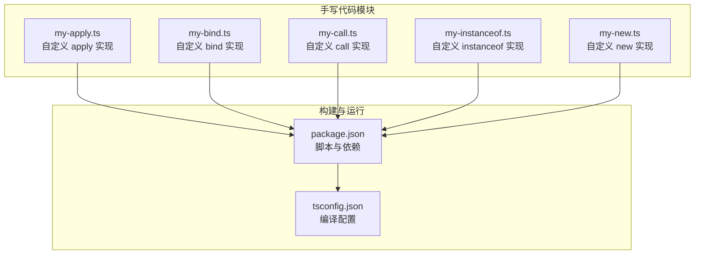
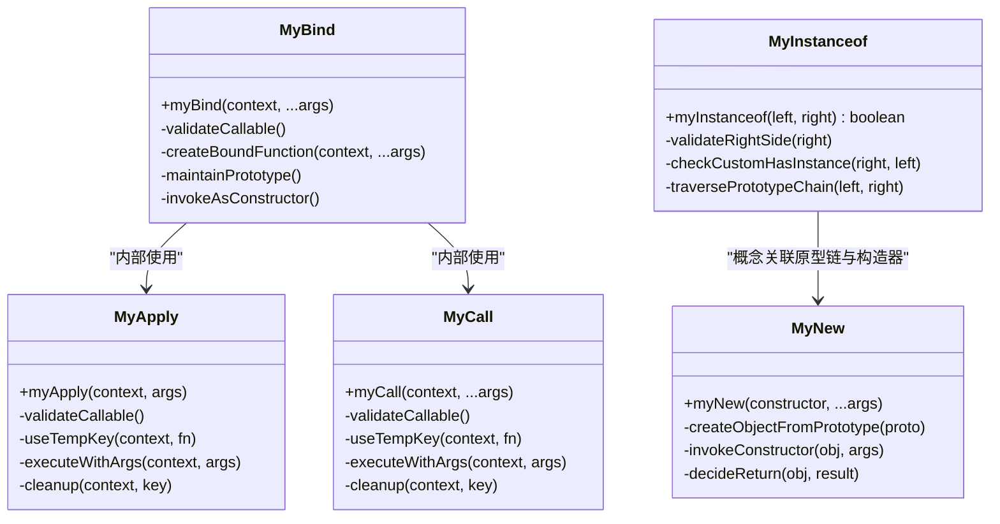
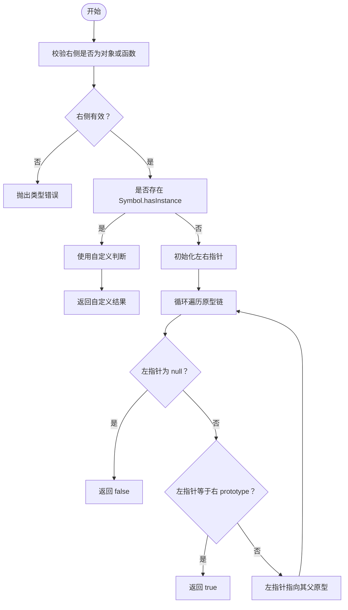
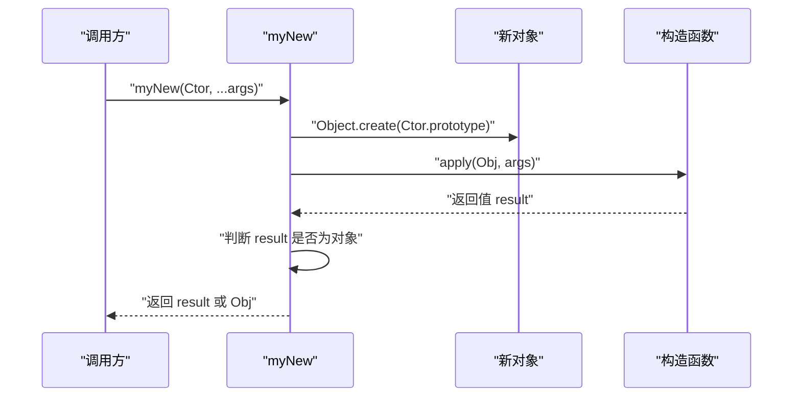
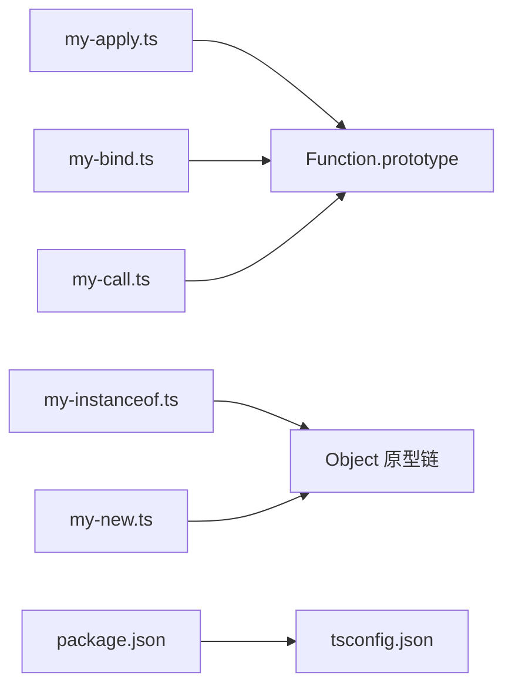

# JavaScript 原生方法实现

<cite>
**本文引用的文件**
- [my-apply.ts](file://handwritten-code/src/my-apply.ts)
- [my-bind.ts](file://handwritten-code/src/my-bind.ts)
- [my-call.ts](file://handwritten-code/src/my-call.ts)
- [my-instanceof.ts](file://handwritten-code/src/my-instanceof.ts)
- [my-new.ts](file://handwritten-code/src/my-new.ts)
- [package.json](file://handwritten-code/package.json)
- [tsconfig.json](file://handwritten-code/tsconfig.json)
</cite>

## 目录
1. [引言](#引言)
2. [项目结构](#项目结构)
3. [核心组件](#核心组件)
4. [架构概览](#架构概览)
5. [详细组件分析](#详细组件分析)
6. [依赖关系分析](#依赖关系分析)
7. [性能考量](#性能考量)
8. [故障排查指南](#故障排查指南)
9. [结论](#结论)
10. [附录](#附录)

## 引言
本技术文档围绕 JavaScript 原生方法的自定义实现展开，重点解析以下五个核心能力：
- apply、bind、call 的实现原理：涵盖 this 绑定机制、参数传递与返回值处理
- instanceof 运算符的原型链检查算法与类型判断逻辑
- new 操作符的实例创建过程、原型继承与构造函数调用机制
同时，文档提供边界情况处理、性能考虑与兼容性分析，并给出与原生方法的行为对比与使用建议，帮助读者在理解底层机制的同时，安全地应用到实际开发中。

## 项目结构
该项目位于 handwritten-code 子目录下，采用 TypeScript 编写，通过 CommonJS 模块系统导出功能。核心实现集中在 src 目录下的独立文件中，每个文件对应一个原生方法的自定义实现。

图表来源
- [package.json:1-23](file://handwritten-code/package.json#L1-L23)
- [tsconfig.json:1-17](file://handwritten-code/tsconfig.json#L1-L17)

章节来源
- [package.json:1-23](file://handwritten-code/package.json#L1-L23)
- [tsconfig.json:1-17](file://handwritten-code/tsconfig.json#L1-L17)

## 核心组件
本节概述五个自定义实现的核心职责与关键点：
- apply：将函数以指定上下文执行，并传入参数数组；通过临时属性挂载函数到上下文对象上，避免污染全局命名空间
- bind：返回一个“惰性绑定”的函数，支持预设 this 与部分参数（柯里化）；维持原函数的原型链，确保作为构造器时仍能正确继承
- call：与 apply 类似，但参数以列表形式传入；同样通过临时属性实现上下文绑定
- instanceof：基于原型链向上查找，判断左侧对象是否处于右侧构造函数的原型链上；优先使用 Symbol.hasInstance 自定义判断
- new：创建新对象并将其原型指向构造函数的 prototype，随后以新对象为 this 调用构造函数，最后根据返回值决定返回对象或构造结果

章节来源
- [my-apply.ts:21-31](file://handwritten-code/src/my-apply.ts#L21-L31)
- [my-bind.ts:18-37](file://handwritten-code/src/my-bind.ts#L18-L37)
- [my-call.ts:21-31](file://handwritten-code/src/my-call.ts#L21-L31)
- [my-instanceof.ts:17-40](file://handwritten-code/src/my-instanceof.ts#L17-L40)
- [my-new.ts:8-12](file://handwritten-code/src/my-new.ts#L8-L12)

## 架构概览
下面的类图展示了五个自定义实现之间的关系与职责划分。它们均通过扩展 Function.prototype 来提供原生方法的替代实现，其中 bind 的实现尤为复杂，因为它需要维护原型链与构造器语义。

图表来源
- [my-apply.ts:21-31](file://handwritten-code/src/my-apply.ts#L21-L31)
- [my-call.ts:21-31](file://handwritten-code/src/my-call.ts#L21-L31)
- [my-bind.ts:18-37](file://handwritten-code/src/my-bind.ts#L18-L37)
- [my-instanceof.ts:17-40](file://handwritten-code/src/my-instanceof.ts#L17-L40)
- [my-new.ts:8-12](file://handwritten-code/src/my-new.ts#L8-L12)

## 详细组件分析

### apply 方法实现
- this 绑定机制：通过 Function.prototype.myApply 将当前函数作为临时属性挂载到传入的上下文对象上，再以扩展运算符解包参数数组执行，从而实现 this 切换与参数传递
- 参数传递：要求第二个参数为数组，内部通过扩展运算符解包后传入目标函数
- 返回值处理：执行完成后删除临时属性并返回函数执行结果
- 边界情况：
  - 当前函数不是可调用的函数时抛出类型错误
  - 上下文为 undefined 或 null 时，默认绑定到全局对象
- 兼容性：该实现直接修改 Function.prototype，可能影响其他依赖原生行为的代码；建议仅用于学习目的或在沙箱环境中使用

章节来源
- [my-apply.ts:21-31](file://handwritten-code/src/my-apply.ts#L21-L31)

### bind 方法实现
- this 绑定机制：返回一个“惰性绑定”的函数，内部通过 apply 执行原函数，并在作为构造器调用时将 this 指向新创建的对象
- 参数传递：支持预设部分参数（柯里化），后续调用时将预设参数与实际参数合并
- 原型链维护：通过中间构造器 NOP 保持原函数的 prototype，使 bind 后的函数仍可作为构造器使用
- 返回值处理：返回新函数，不立即执行原函数
- 边界情况：
  - 当前函数不可调用时抛出类型错误
  - 作为构造器调用时，this 指向新实例而非传入的上下文
- 兼容性：与原生 bind 的行为高度一致，但在严格模式下对 this 的处理细节可能存在差异

章节来源
- [my-bind.ts:18-37](file://handwritten-code/src/my-bind.ts#L18-L37)

### call 方法实现
- this 绑定机制：与 apply 类似，但参数以列表形式传入；通过临时属性挂载函数到上下文对象上并执行
- 参数传递：支持任意数量的参数，内部通过扩展运算符解包后传入目标函数
- 返回值处理：执行完成后删除临时属性并返回函数执行结果
- 边界情况：
  - 当前函数不是可调用的函数时抛出类型错误
  - 上下文为 undefined 或 null 时，默认绑定到全局对象
- 兼容性：与原生 call 行为一致，适合在不支持原生方法的环境中使用

章节来源
- [my-call.ts:21-31](file://handwritten-code/src/my-call.ts#L21-L31)

### instanceof 运算符实现
- 算法流程：先校验右侧必须为对象或函数，若存在 Symbol.hasInstance 则优先使用自定义判断；否则从左侧对象的原型链向上遍历，直到找到与右侧构造函数的 prototype 相等的节点
- 类型判断逻辑：若遍历结束仍未找到匹配，则返回 false；若找到则返回 true
- 边界情况：
  - 右侧不是对象或函数时抛出类型错误
  - 左侧为 null 或 undefined 时返回 false（由原型链遍历终止条件保证）
- 兼容性：与原生 instanceof 行为一致，支持自定义判断逻辑

图表来源
- [my-instanceof.ts:17-40](file://handwritten-code/src/my-instanceof.ts#L17-L40)

章节来源
- [my-instanceof.ts:17-40](file://handwritten-code/src/my-instanceof.ts#L17-L40)

### new 操作符实现
- 实例创建过程：使用 Object.create 将新对象的原型指向构造函数的 prototype
- 原型继承：新对象的原型链包含构造函数的 prototype，从而继承构造函数的原型方法
- 构造函数调用机制：以新对象为 this 调用构造函数，并根据返回值决定最终返回对象
- 返回值决策：若构造函数返回对象类型，则返回该对象；否则返回新创建的对象
- 边界情况：
  - 构造函数未显式返回对象时，返回新对象
  - 构造函数返回非对象类型时，忽略返回值并返回新对象

图表来源
- [my-new.ts:8-12](file://handwritten-code/src/my-new.ts#L8-L12)

章节来源
- [my-new.ts:8-12](file://handwritten-code/src/my-new.ts#L8-L12)

## 依赖关系分析
- 模块依赖：各实现均为独立文件，彼此无直接导入关系，通过 Function.prototype 扩展实现
- 构建依赖：TypeScript 编译配置为 CommonJS，目标 ESNext，输出至 dist 目录
- 测试依赖：Promise 相关测试使用 promises-aplus-tests，但与本文主题的原生方法实现无直接耦合

图表来源
- [package.json:1-23](file://handwritten-code/package.json#L1-L23)
- [tsconfig.json:1-17](file://handwritten-code/tsconfig.json#L1-L17)

章节来源
- [package.json:1-23](file://handwritten-code/package.json#L1-L23)
- [tsconfig.json:1-17](file://handwritten-code/tsconfig.json#L1-L17)

## 性能考量
- apply/bind/call 的临时属性方案：频繁创建与销毁临时属性会带来额外开销；在高并发场景下建议谨慎使用
- instanceof 的原型链遍历：时间复杂度与原型链长度成正比；对于深层继承链的判断可能较慢
- new 的对象创建：使用 Object.create 通常比通过构造函数直接实例化更快；但需注意返回值的分支判断
- 内存占用：bind 返回的新函数持有对原函数与上下文的引用，可能导致闭包内存泄漏；在大量绑定场景下应关注 GC 行为

## 故障排查指南
- 类型错误（非可调用函数）：当尝试对非函数对象调用 apply/bind/call 时会抛出类型错误。请确认目标对象确实为函数
- 上下文丢失：在严格模式下，传入 null/undefined 时的默认绑定行为可能与预期不同；建议明确传入期望的上下文
- instanceof 报错：右侧必须为对象或函数；若传入原始类型会抛出类型错误
- bind 作为构造器：bind 后的函数作为构造器调用时，this 指向新实例而非传入的上下文；如需保留上下文，请使用 call/apply
- new 返回值：若构造函数返回对象类型，new 将返回该对象；否则返回新创建的对象。请确保构造函数的返回值符合预期

章节来源
- [my-apply.ts:22-23](file://handwritten-code/src/my-apply.ts#L22-L23)
- [my-bind.ts:19-20](file://handwritten-code/src/my-bind.ts#L19-L20)
- [my-call.ts:22-23](file://handwritten-code/src/my-call.ts#L22-L23)
- [my-instanceof.ts:18-19](file://handwritten-code/src/my-instanceof.ts#L18-L19)

## 结论
本文档系统梳理了 apply、bind、call、instanceof 与 new 的自定义实现，解释了它们的底层机制与边界情况。这些实现有助于深入理解 JavaScript 的动态调用、原型链与构造器语义。在生产环境中，建议优先使用原生方法；仅在特殊需求或教学场景下考虑使用自定义实现，并充分评估其性能与兼容性风险。

## 附录
- 使用建议：
  - 在需要预设 this 与部分参数时使用 bind，结合柯里化提升复用性
  - 在需要灵活切换 this 且参数为数组时使用 apply
  - 在需要灵活切换 this 且参数为列表时使用 call
  - 在需要自定义 instanceof 判断逻辑时，优先实现 Symbol.hasInstance
  - 在需要模拟 new 行为时，确保构造函数返回值的合理性
- 兼容性提示：
  - 本实现直接修改 Function.prototype，可能与第三方库产生冲突
  - 在严格模式与不同宿主环境（浏览器/Node.js）下，行为细节可能存在差异