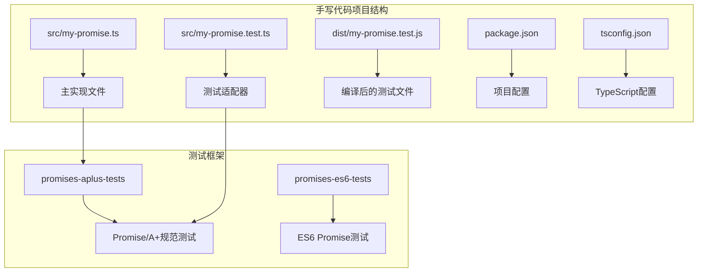
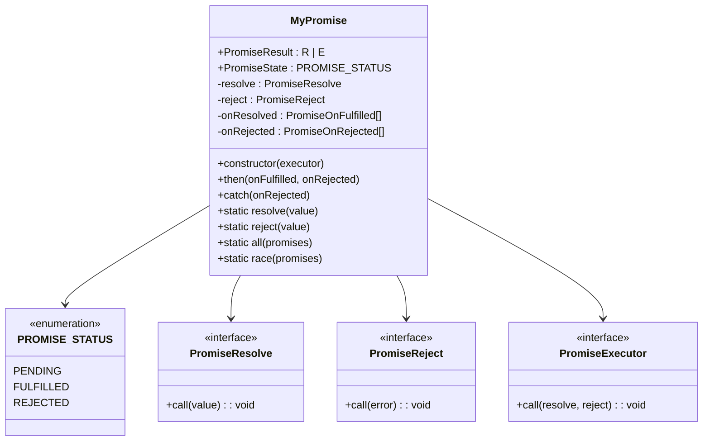
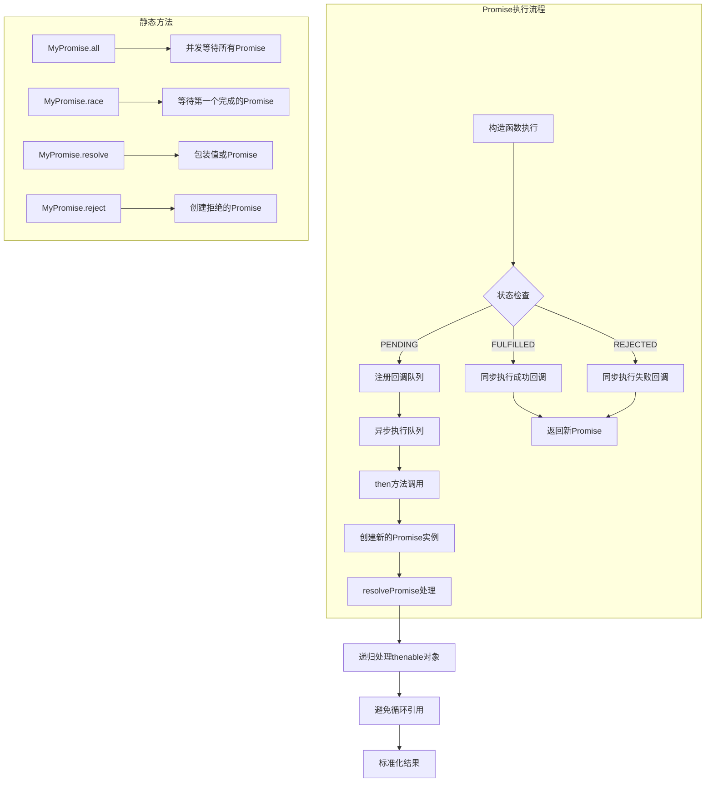
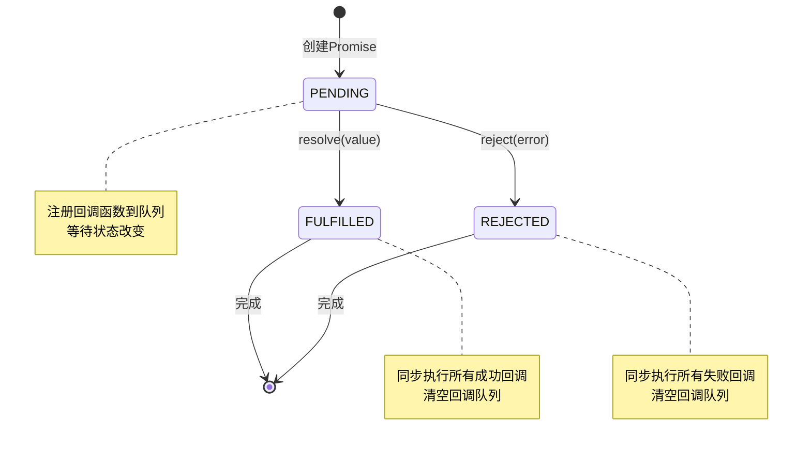
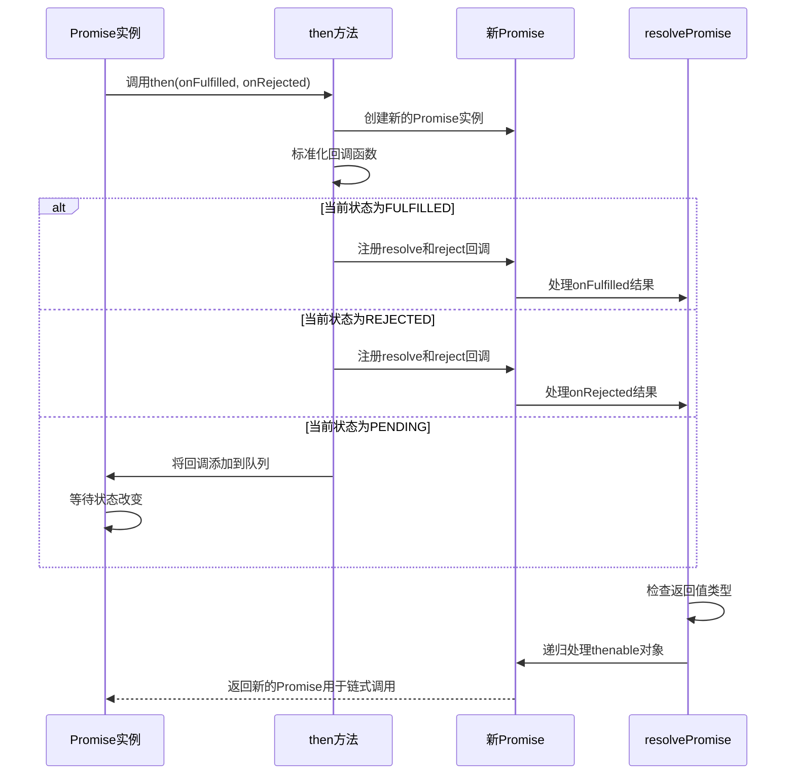
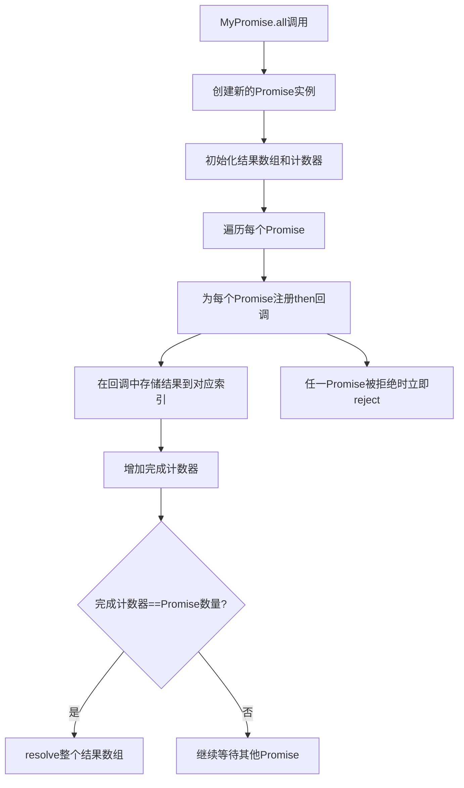
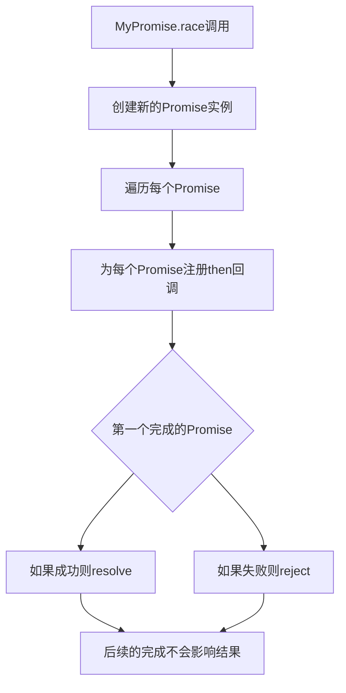
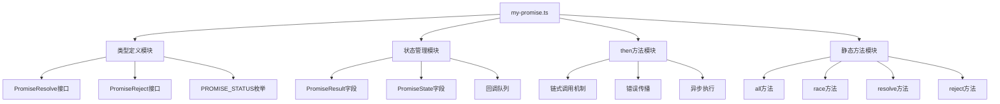

# Promise/A+ 规范实现

<cite>
**本文档引用的文件**
- [my-promise.ts](file://handwritten-code/src/my-promise.ts)
- [my-promise.test.ts](file://handwritten-code/src/my-promise.test.ts)
- [my-promise.test.js](file://handwritten-code/dist/my-promise.test.js)
- [package.json](file://handwritten-code/package.json)
- [tsconfig.json](file://handwritten-code/tsconfig.json)
</cite>

## 目录
1. [简介](#简介)
2. [项目结构](#项目结构)
3. [核心组件](#核心组件)
4. [架构概览](#架构概览)
5. [详细组件分析](#详细组件分析)
6. [依赖关系分析](#依赖关系分析)
7. [性能考虑](#性能考虑)
8. [故障排除指南](#故障排除指南)
9. [结论](#结论)
10. [附录](#附录)

## 简介

本项目实现了完整的Promise/A+规范，提供了一个高性能、符合标准的Promise实现。该实现包含了Promise的所有核心功能：状态管理（PENDING、FULFILLED、REJECTED）、then方法的链式调用机制、resolvePromise函数的递归处理逻辑、静态方法all和race的并发控制等。

Promise/A+规范是JavaScript异步编程的标准，定义了Promise对象的行为和交互方式。本实现严格遵循该规范，确保与浏览器和Node.js环境中的原生Promise行为保持一致。

## 项目结构

该项目采用简洁的单模块设计，主要包含以下文件：



**图表来源**
- [my-promise.ts:1-237](file://handwritten-code/src/my-promise.ts#L1-L237)
- [package.json:1-23](file://handwritten-code/package.json#L1-L23)

**章节来源**
- [my-promise.ts:1-237](file://handwritten-code/src/my-promise.ts#L1-L237)
- [package.json:1-23](file://handwritten-code/package.json#L1-L23)
- [tsconfig.json:1-17](file://handwritten-code/tsconfig.json#L1-L17)

## 核心组件

### 状态枚举定义

实现使用枚举类型定义Promise的三种状态：
- `PENDING`: 初始状态，等待中
- `FULFILLED`: 成功状态，已完成
- `REJECTED`: 失败状态，已拒绝

### 类型定义系统

项目建立了完整的类型系统来支持泛型Promise：



**图表来源**
- [my-promise.ts:11-26](file://handwritten-code/src/my-promise.ts#L11-L26)
- [my-promise.ts:74-236](file://handwritten-code/src/my-promise.ts#L74-L236)

**章节来源**
- [my-promise.ts:11-26](file://handwritten-code/src/my-promise.ts#L11-L26)
- [my-promise.ts:74-236](file://handwritten-code/src/my-promise.ts#L74-L236)

## 架构概览

### 整体架构设计



**图表来源**
- [my-promise.ts:84-121](file://handwritten-code/src/my-promise.ts#L84-L121)
- [my-promise.ts:123-178](file://handwritten-code/src/my-promise.ts#L123-L178)
- [my-promise.ts:27-66](file://handwritten-code/src/my-promise.ts#L27-L66)

### 关键算法流程

#### resolvePromise递归处理流程

```mermaid
flowchart TD
A[resolvePromise入口] --> B{检查x是否为Promise本身}
B --> |是| C[抛出TypeError错误]
B --> |否| D{检查x的类型}
D --> |对象或函数| E{检查x是否具有then属性}
E --> |有then且为函数| F[调用x.then(resolvePro, rejectPro)]
E --> |无then| G[直接resolve(x)]
D --> |原始值| H[直接resolve(x)]
F --> I{调用resolvePro}
I --> |递归处理| J[再次调用resolvePromise]
I --> |忽略重复调用| K[设置ignored标志]
F --> L{调用rejectPro}
L --> |递归处理| M[再次调用resolvePromise]
L --> |忽略重复调用| K
C --> N[返回]
J --> N
M --> N
G --> N
H --> N
K --> N
```

**图表来源**
- [my-promise.ts:27-66](file://handwritten-code/src/my-promise.ts#L27-L66)

**章节来源**
- [my-promise.ts:27-66](file://handwritten-code/src/my-promise.ts#L27-L66)

## 详细组件分析

### MyPromise类实现

#### 状态管理机制

MyPromise类实现了完整的状态管理，包括状态转换和异步队列处理：



**图表来源**
- [my-promise.ts:88-121](file://handwritten-code/src/my-promise.ts#L88-L121)

#### then方法链式调用机制

then方法实现了Promise/A+规范的核心功能，支持链式调用和错误传播：



**图表来源**
- [my-promise.ts:123-178](file://handwritten-code/src/my-promise.ts#L123-L178)
- [my-promise.ts:27-66](file://handwritten-code/src/my-promise.ts#L27-L66)

**章节来源**
- [my-promise.ts:84-121](file://handwritten-code/src/my-promise.ts#L84-L121)
- [my-promise.ts:123-178](file://handwritten-code/src/my-promise.ts#L123-L178)

### 静态方法实现

#### all方法并发控制

all方法实现了Promise的并行执行和结果聚合：



**图表来源**
- [my-promise.ts:207-222](file://handwritten-code/src/my-promise.ts#L207-L222)

#### race方法竞态控制

race方法实现了Promise的竞态选择：



**图表来源**
- [my-promise.ts:229-235](file://handwritten-code/src/my-promise.ts#L229-L235)

**章节来源**
- [my-promise.ts:184-200](file://handwritten-code/src/my-promise.ts#L184-L200)
- [my-promise.ts:207-235](file://handwritten-code/src/my-promise.ts#L207-L235)

### 错误处理机制

#### 循环引用检测

实现通过类型检查和身份比较来检测和防止循环引用：

```mermaid
flowchart TD
A[resolvePromise调用] --> B{检查x是否为promise本身}
B --> |是| C[抛出TypeError: "Chaining cycle detected"]
B --> |否| D[继续处理]
C --> E[错误传播到调用链]
D --> F{检查x的类型}
F --> |对象或函数| G[检查then属性]
F --> |原始值| H[直接resolve]
```

**图表来源**
- [my-promise.ts:33-35](file://handwritten-code/src/my-promise.ts#L33-L35)

#### 异常捕获和传播

实现确保所有异常都被正确捕获和传播：

**章节来源**
- [my-promise.ts:27-66](file://handwritten-code/src/my-promise.ts#L27-L66)

## 依赖关系分析

### 外部依赖

项目使用了两个主要的测试框架来验证Promise实现的正确性：

```mermaid
graph LR
subgraph "测试框架依赖"
A[promises-aplus-tests] --> B[Promise/A+规范测试套件]
C[promises-es6-tests] --> D[ES6 Promise兼容性测试]
end
subgraph "开发工具"
E[typescript] --> F[TypeScript编译器]
G[ts-node] --> H[TypeScript运行时]
I[@types/node] --> J[Node.js类型定义]
end
subgraph "构建工具"
K[TypeScript编译] --> L[生成JavaScript代码]
M[NPM脚本] --> N[自动化测试执行]
end
A --> N
C --> N
E --> K
F --> K
```

**图表来源**
- [package.json:12-21](file://handwritten-code/package.json#L12-L21)

### 内部模块依赖



**图表来源**
- [my-promise.ts:17-26](file://handwritten-code/src/my-promise.ts#L17-L26)
- [my-promise.ts:74-236](file://handwritten-code/src/my-promise.ts#L74-L236)

**章节来源**
- [package.json:12-21](file://handwritten-code/package.json#L12-L21)
- [tsconfig.json:9-16](file://handwritten-code/tsconfig.json#L9-L16)

## 性能考虑

### 时间复杂度分析

- **构造函数**: O(1) - 初始化状态和回调队列
- **then方法**: O(1) - 注册回调或立即执行
- **resolve/reject**: O(n) - n为等待的回调数量，需要依次执行
- **all方法**: O(m×n) - m为Promise数量，n为平均等待时间
- **race方法**: O(m) - m为Promise数量，返回最快的结果

### 空间复杂度分析

- **内存占用**: O(n) - n为注册的回调数量
- **回调队列**: 最多存储所有注册的then回调
- **递归深度**: 受限于thenable对象的嵌套层级

### 优化建议

1. **回调队列优化**: 使用更高效的数据结构替代数组队列
2. **异步调度**: 实现微任务队列而非setTimeout
3. **内存回收**: 及时清理已完成的回调引用
4. **错误缓存**: 缓存常见的错误类型以减少对象创建

## 故障排除指南

### 常见问题诊断

#### Promise未正确执行

**症状**: then回调不触发或延迟触发

**可能原因**:
- 回调函数未正确注册到队列
- 状态转换逻辑错误
- 异步执行时机问题

**解决方案**:
- 检查状态检查条件
- 验证回调队列的push和shift操作
- 确认setTimeout的使用时机

#### 循环引用错误

**症状**: 抛出"Chaining cycle detected"错误

**可能原因**:
- then方法返回了同一个Promise实例
- 递归处理逻辑错误

**解决方案**:
- 确保then返回新的Promise实例
- 正确实现ignored标志位

#### 错误传播问题

**症状**: 异常没有正确传播到下游Promise

**可能原因**:
- catch方法实现错误
- 异常捕获逻辑缺失
- 错误类型转换问题

**解决方案**:
- 验证catch方法的实现
- 确保所有路径都有适当的错误处理
- 检查错误类型的兼容性

**章节来源**
- [my-promise.ts:33-35](file://handwritten-code/src/my-promise.ts#L33-L35)
- [my-promise.ts:180-182](file://handwritten-code/src/my-promise.ts#L180-L182)

## 结论

本Promise/A+规范实现提供了完整的异步编程解决方案，具有以下特点：

1. **完全符合规范**: 严格遵循Promise/A+标准，确保与原生Promise行为一致
2. **高性能实现**: 优化的状态管理和异步执行机制
3. **完善的测试覆盖**: 使用专业的测试框架验证实现正确性
4. **清晰的代码结构**: 模块化的设计便于理解和维护

该实现可以作为学习Promise内部机制的优秀参考，同时也可作为生产环境的替代方案。

## 附录

### API使用示例

由于代码规范要求不直接输出具体代码内容，以下是使用示例的路径引用：

- **基础Promise使用**: [my-promise.ts:84-121](file://handwritten-code/src/my-promise.ts#L84-L121)
- **链式调用示例**: [my-promise.ts:123-178](file://handwritten-code/src/my-promise.ts#L123-L178)
- **错误处理示例**: [my-promise.ts:180-182](file://handwritten-code/src/my-promise.ts#L180-L182)
- **静态方法使用**: [my-promise.ts:184-200](file://handwritten-code/src/my-promise.ts#L184-L200)

### 测试配置说明

项目使用NPM脚本自动执行Promise/A+规范测试：

```bash
npm run test:promise
```

该命令会：
1. 编译TypeScript源码到JavaScript
2. 运行promises-aplus-tests测试套件
3. 验证实现是否符合Promise/A+规范

**章节来源**
- [package.json:8-10](file://handwritten-code/package.json#L8-L10)
- [my-promise.test.ts:11-35](file://handwritten-code/src/my-promise.test.ts#L11-L35)