# TypeScript 函数工具

<cite>
**本文引用的文件**
- [typescript-function.ts](file://handwritten-code/src/typescript-function.ts)
- [function-debounce.ts](file://handwritten-code/src/function-debounce.ts)
- [function-throttle.ts](file://handwritten-code/src/function-throttle.ts)
- [my-apply.ts](file://handwritten-code/src/my-apply.ts)
- [my-bind.ts](file://handwritten-code/src/my-bind.ts)
- [my-call.ts](file://handwritten-code/src/my-call.ts)
- [my-instanceof.ts](file://handwritten-code/src/my-instanceof.ts)
- [my-new.ts](file://handwritten-code/src/my-new.ts)
- [my-promise.ts](file://handwritten-code/src/my-promise.ts)
- [my-promise.test.ts](file://handwritten-code/src/my-promise.test.ts)
- [package.json](file://handwritten-code/package.json)
- [tsconfig.json](file://handwritten-code/tsconfig.json)
</cite>

## 目录
1. [简介](#简介)
2. [项目结构](#项目结构)
3. [核心组件](#核心组件)
4. [架构总览](#架构总览)
5. [详细组件分析](#详细组件分析)
6. [依赖关系分析](#依赖关系分析)
7. [性能考量](#性能考量)
8. [故障排查指南](#故障排查指南)
9. [结论](#结论)
10. [附录](#附录)

## 简介
本技术文档聚焦于手写代码仓库中与“TypeScript 函数工具”相关的实现，系统性阐述以下主题：
- TypeScript 类型推导、泛型约束与类型安全机制在函数实现中的应用
- 函数重载、条件类型、映射类型等高级特性的使用场景与实现技巧
- 类型守卫、类型断言与类型变换的实际案例
- TypeScript 编译时类型检查对运行时性能的影响与优化策略
- 与纯 JavaScript 实现的差异对比与最佳实践建议

文档以仓库中的源码为依据，结合图示与分层讲解，帮助读者从原理到实践全面掌握这些工具函数的设计思想与工程化落地方法。

## 项目结构
该模块位于 handwritten-code 子目录，采用按功能分组的组织方式：函数节流防抖、函数调用上下文绑定、自定义 instanceof、new 操作符模拟、以及一个完整的自定义 Promise 实现与配套测试。

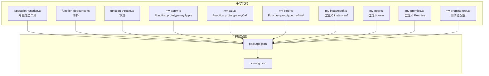

图表来源
- [package.json:1-23](file://handwritten-code/package.json#L1-L23)
- [tsconfig.json:1-17](file://handwritten-code/tsconfig.json#L1-L17)

章节来源
- [package.json:1-23](file://handwritten-code/package.json#L1-L23)
- [tsconfig.json:1-17](file://handwritten-code/tsconfig.json#L1-L17)

## 核心组件
本节从“类型工具”“函数节流防抖”“函数调用上下文绑定”“对象关系判断”“构造器模拟”“自定义 Promise”六个维度，梳理关键能力与设计要点。

- 内置类型工具（映射类型、条件类型、字符串字面量映射）
  - Partial/Required/Readonly、Record/Pick/Omit、Exclude/Extract/NonNullable、Parameters/ConstructorParameters/ReturnType/InstanceType/ThisParameterType/OmitThisParameter、字符串映射 Uppercase/Lowercase/Capitalize/Uncapitalize
  - 关键点：通过映射类型遍历键集合；通过条件类型进行类型筛选与推断；通过 infer 进行参数/返回值/实例类型的提取

- 函数节流与防抖
  - 防抖：在延迟时间内多次触发仅保留最后一次执行
  - 节流：在固定周期内只允许一次执行，其余忽略
  - 关键点：利用闭包保存定时器状态；正确传递 this 与 arguments

- 函数调用上下文绑定
  - myCall/myApply/myBind：模拟原生 Function.prototype 的调用与绑定行为
  - 关键点：Symbol 属性隔离；原型链维护；new 绑定的兼容处理

- 自定义 instanceof
  - 基于原型链查找与 Symbol.hasInstance 的判断
  - 关键点：类型校验与异常抛出；循环查找父类链

- 自定义 new
  - 基于 Object.create 与 apply 的组合
  - 关键点：返回值类型判定与默认对象返回

- 自定义 Promise
  - 状态机、then 链式调用、静态方法 all/race、resolve/reject、thenable 解决
  - 关键点：异步调度、错误传播、循环引用检测

章节来源
- [typescript-function.ts:17-209](file://handwritten-code/src/typescript-function.ts#L17-L209)
- [function-debounce.ts:17-29](file://handwritten-code/src/function-debounce.ts#L17-L29)
- [function-throttle.ts:16-30](file://handwritten-code/src/function-throttle.ts#L16-L30)
- [my-call.ts:21-31](file://handwritten-code/src/my-call.ts#L21-L31)
- [my-apply.ts:21-31](file://handwritten-code/src/my-apply.ts#L21-L31)
- [my-bind.ts:18-37](file://handwritten-code/src/my-bind.ts#L18-L37)
- [my-instanceof.ts:17-40](file://handwritten-code/src/my-instanceof.ts#L17-L40)
- [my-new.ts:8-12](file://handwritten-code/src/my-new.ts#L8-L12)
- [my-promise.ts:74-236](file://handwritten-code/src/my-promise.ts#L74-L236)

## 架构总览
下图展示“类型工具”与“运行时函数工具”的协作关系：类型工具在编译期提供类型安全与推断，运行时函数工具在执行期完成逻辑控制与状态管理。

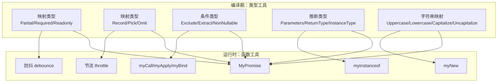

图表来源
- [typescript-function.ts:17-209](file://handwritten-code/src/typescript-function.ts#L17-L209)
- [function-debounce.ts:17-29](file://handwritten-code/src/function-debounce.ts#L17-L29)
- [function-throttle.ts:16-30](file://handwritten-code/src/function-throttle.ts#L16-L30)
- [my-call.ts:21-31](file://handwritten-code/src/my-call.ts#L21-L31)
- [my-apply.ts:21-31](file://handwritten-code/src/my-apply.ts#L21-L31)
- [my-bind.ts:18-37](file://handwritten-code/src/my-bind.ts#L18-L37)
- [my-instanceof.ts:17-40](file://handwritten-code/src/my-instanceof.ts#L17-L40)
- [my-new.ts:8-12](file://handwritten-code/src/my-new.ts#L8-L12)
- [my-promise.ts:74-236](file://handwritten-code/src/my-promise.ts#L74-L236)

## 详细组件分析

### 类型工具：映射类型与条件类型
- 映射类型
  - 遍历对象键集合，批量修改属性特性（可选/必填/只读）或选择子集（Pick/Omit）
  - 通过 keyof T 获取键集合，再用 in 遍历，配合 +、-、readonly 等修饰符
- 条件类型
  - 通过 extends 进行类型匹配，结合 infer 提取参数、返回值、实例类型
  - 用于类型过滤（Exclude/Extract）、排除 null/undefined（NonNullable）
- 字符串映射类型
  - 对字符串字面量进行大小写转换，便于模板字符串与键名规范化

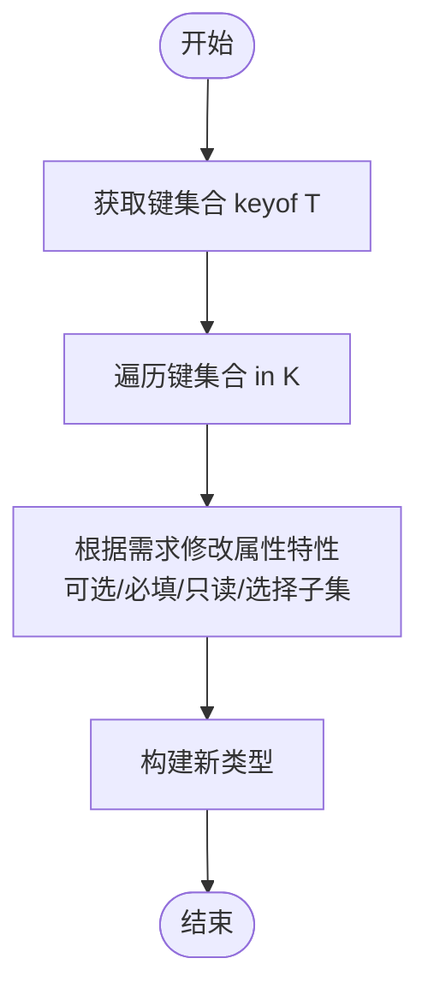

图表来源
- [typescript-function.ts:17-86](file://handwritten-code/src/typescript-function.ts#L17-L86)

章节来源
- [typescript-function.ts:17-209](file://handwritten-code/src/typescript-function.ts#L17-L209)

### 函数节流与防抖
- 防抖（debounce）
  - 在每次触发后延时执行，若再次触发则重置计时器
  - 关键点：闭包保存定时器；正确传递 this 与 arguments；清理旧定时器
- 节流（throttle）
  - 固定周期内仅执行一次，其余请求忽略
  - 关键点：利用标志位避免并发执行；到期后重置标志

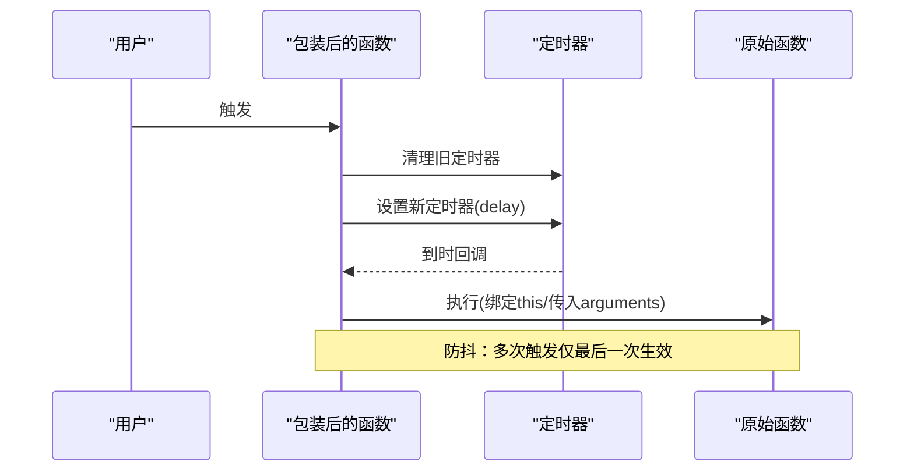

图表来源
- [function-debounce.ts:17-29](file://handwritten-code/src/function-debounce.ts#L17-L29)

```mermaid
sequenceDiagram
participant U as "用户"
participant F as "包装后的函数"
participant T as "定时器"
participant O as "原始函数"
U->>F : 触发
alt 定时器未占用
F->>T : 设置定时器(delay)
T-->>F : 到时回调
F->>O : 执行(绑定this/传入arguments)
F->>T : 重置定时器
else 已占用
F-->>U : 忽略本次触发
end
Note over F,O : 节流：固定周期内仅一次生效
```

图表来源
- [function-throttle.ts:16-30](file://handwritten-code/src/function-throttle.ts#L16-L30)

章节来源
- [function-debounce.ts:17-29](file://handwritten-code/src/function-debounce.ts#L17-L29)
- [function-throttle.ts:16-30](file://handwritten-code/src/function-throttle.ts#L16-L30)

### 函数调用上下文绑定：myCall/myApply/myBind
- myCall/myApply
  - 将目标函数作为 context 的临时方法执行，传入参数后删除该属性
  - 使用 Symbol 作为唯一键避免覆盖
- myBind
  - 返回一个新函数，内部通过 apply 调用原函数，并维护原型链
  - 支持 new 调用时的 this 指向

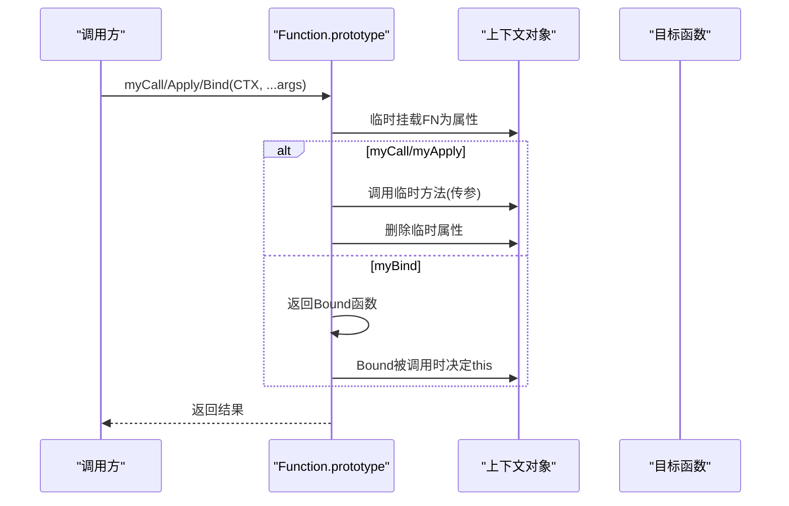

图表来源
- [my-call.ts:21-31](file://handwritten-code/src/my-call.ts#L21-L31)
- [my-apply.ts:21-31](file://handwritten-code/src/my-apply.ts#L21-L31)
- [my-bind.ts:18-37](file://handwritten-code/src/my-bind.ts#L18-L37)

章节来源
- [my-call.ts:21-31](file://handwritten-code/src/my-call.ts#L21-L31)
- [my-apply.ts:21-31](file://handwritten-code/src/my-apply.ts#L21-L31)
- [my-bind.ts:18-37](file://handwritten-code/src/my-bind.ts#L18-L37)

### 自定义 instanceof
- 通过原型链向上查找，直到找到目标构造函数的 prototype 或到达 null
- 若目标对象实现了 Symbol.hasInstance，则优先使用其自定义判断

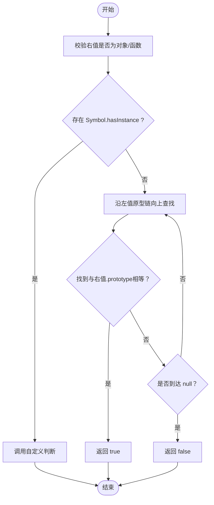

图表来源
- [my-instanceof.ts:17-40](file://handwritten-code/src/my-instanceof.ts#L17-L40)

章节来源
- [my-instanceof.ts:17-40](file://handwritten-code/src/my-instanceof.ts#L17-L40)

### 自定义 new
- 使用 Object.create 构造实例，再通过 apply 调用构造函数初始化
- 若构造函数返回对象类型则直接返回，否则返回新实例

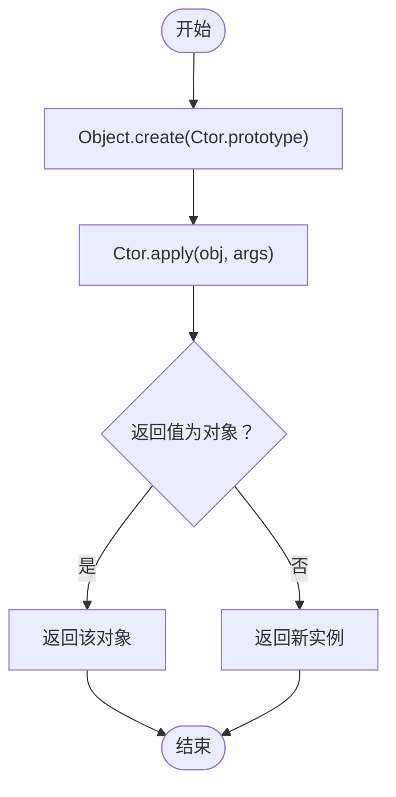

图表来源
- [my-new.ts:8-12](file://handwritten-code/src/my-new.ts#L8-L12)

章节来源
- [my-new.ts:8-12](file://handwritten-code/src/my-new.ts#L8-L12)

### 自定义 Promise：状态机与链式调用
- 状态机：pending/fufilled/rejected，状态不可逆
- then 链式调用：支持 onFulfilled/onRejected，返回新的 Promise
- 静态方法：resolve/reject/all/race
- thenable 解决：递归展开 thenable，避免循环引用

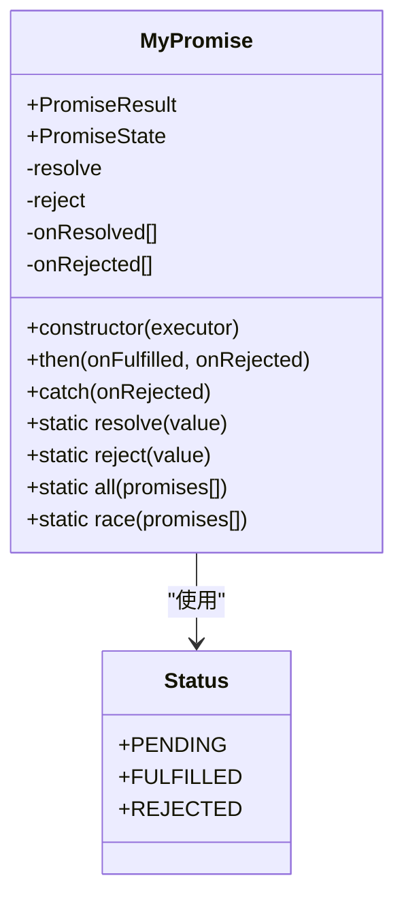

图表来源
- [my-promise.ts:74-236](file://handwritten-code/src/my-promise.ts#L74-L236)

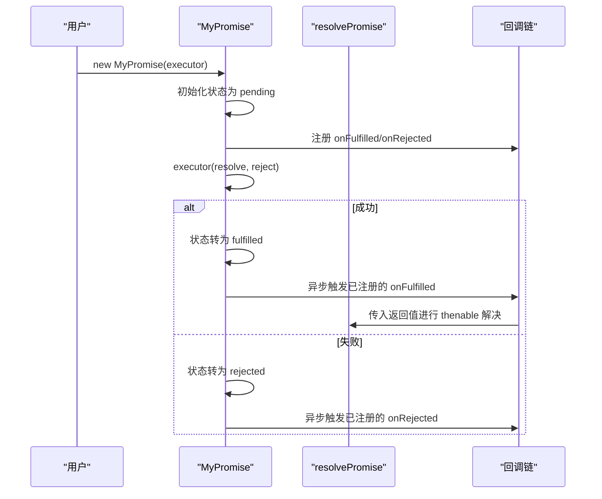

图表来源
- [my-promise.ts:84-178](file://handwritten-code/src/my-promise.ts#L84-L178)
- [my-promise.ts:27-66](file://handwritten-code/src/my-promise.ts#L27-L66)

章节来源
- [my-promise.ts:74-236](file://handwritten-code/src/my-promise.ts#L74-L236)
- [my-promise.test.ts:8-35](file://handwritten-code/src/my-promise.test.ts#L8-L35)

## 依赖关系分析
- 构建与运行时依赖
  - TypeScript 版本与编译选项：ESNext 目标、CommonJS 模块、包含 src 下所有 .ts 文件、输出 dist
  - 开发依赖：@types/node、ts-node、typescript
- 测试依赖：promises-aplus-tests
- 运行时环境：Node.js（含 setTimeout、Symbol 等）

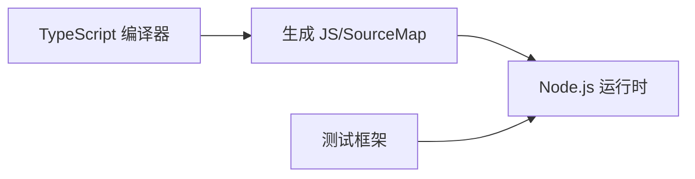

图表来源
- [package.json:1-23](file://handwritten-code/package.json#L1-L23)
- [tsconfig.json:1-17](file://handwritten-code/tsconfig.json#L1-L17)

章节来源
- [package.json:1-23](file://handwritten-code/package.json#L1-L23)
- [tsconfig.json:1-17](file://handwritten-code/tsconfig.json#L1-L17)

## 性能考量
- 编译时类型检查对运行时性能的影响
  - 类型工具在编译期完成，不引入运行时开销；但过多的泛型嵌套可能增加编译时间
  - 条件类型与映射类型在复杂场景下会增大类型计算成本
- 运行时性能优化建议
  - 防抖/节流：合理设置 delay，避免频繁创建/销毁定时器；在高频事件中优先使用节流
  - 函数绑定：尽量减少重复绑定；必要时缓存 Bound 函数
  - instanceof：避免在热路径中频繁调用；可考虑缓存原型链信息
  - Promise：then 中避免同步阻塞；all/race 合理使用，避免大量微任务堆积

[本节为通用指导，无需特定文件来源]

## 故障排查指南
- 防抖/节流无效
  - 检查是否正确传递 this 与 arguments；确认定时器是否被清理或重置
- 绑定失败
  - 确认目标不是非函数；检查 Symbol 键是否冲突；new 绑定的 this 判定逻辑
- instanceof 报错
  - 右值必须为对象或函数；若自定义了 Symbol.hasInstance，请确保其返回布尔值
- Promise 链异常
  - 检查 thenable 循环引用检测；捕获回调中的异常并交给 reject
  - all/race 的数组元素是否全部为 MyPromise 实例

章节来源
- [function-debounce.ts:17-29](file://handwritten-code/src/function-debounce.ts#L17-L29)
- [function-throttle.ts:16-30](file://handwritten-code/src/function-throttle.ts#L16-L30)
- [my-call.ts:21-31](file://handwritten-code/src/my-call.ts#L21-L31)
- [my-apply.ts:21-31](file://handwritten-code/src/my-apply.ts#L21-L31)
- [my-bind.ts:18-37](file://handwritten-code/src/my-bind.ts#L18-L37)
- [my-instanceof.ts:17-40](file://handwritten-code/src/my-instanceof.ts#L17-L40)
- [my-promise.ts:27-66](file://handwritten-code/src/my-promise.ts#L27-L66)

## 结论
本项目通过一系列“手写实现”，完整展示了 TypeScript 类型系统与运行时函数工具的协同工作方式：
- 类型工具在编译期提供强大的类型安全与推断能力，降低运行时风险
- 运行时工具在实际业务中承担性能与交互的关键职责
- 通过合理的泛型约束、条件类型与映射类型，可以写出既安全又灵活的工具函数
- 在工程实践中，应平衡编译时类型检查与运行时性能，持续优化高并发场景下的稳定性与吞吐

[本节为总结，无需特定文件来源]

## 附录
- 最佳实践建议
  - 类型工具：优先使用内置类型别名；复杂类型组合时拆分为多个小类型，提升可读性
  - 函数工具：在高频调用场景优先考虑节流；防抖适用于输入框搜索等场景
  - instanceof：尽量避免在热路径中使用；必要时可做类型守卫前置
  - Promise：统一错误处理；避免在 then 中抛出同步异常；all/race 合理使用
- 与纯 JavaScript 的差异
  - TypeScript 提供类型安全与自动补全；运行时行为一致但类型错误在编译期暴露
  - 泛型与条件类型使工具函数具备更强的复用性与表达力

[本节为通用指导，无需特定文件来源]