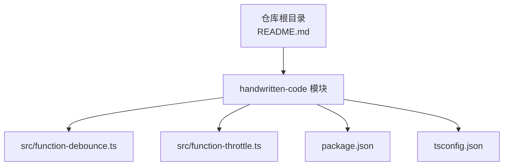
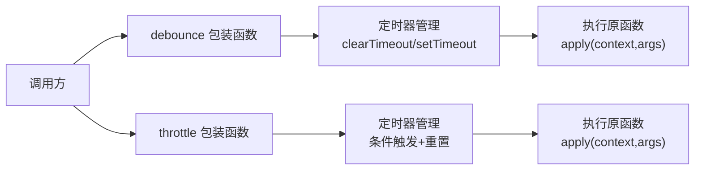
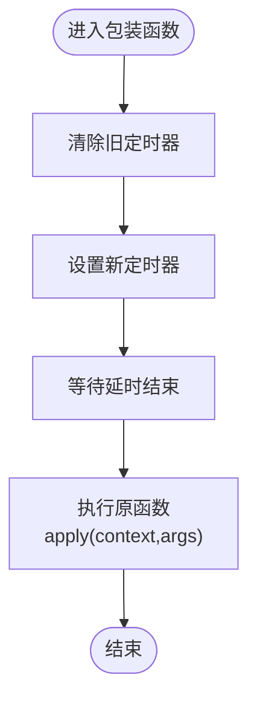
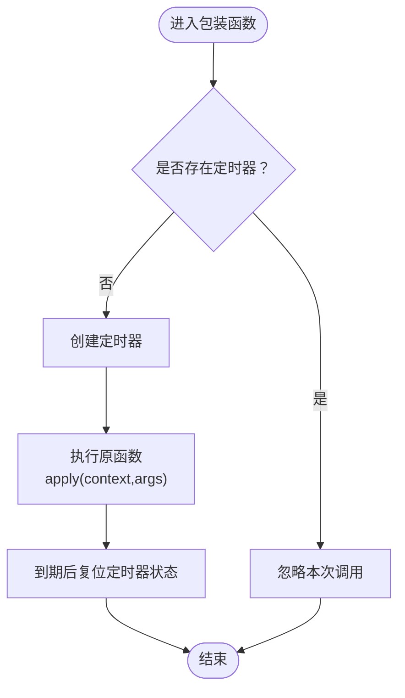
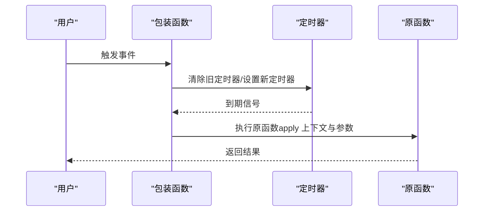
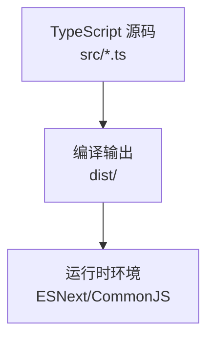

# 性能优化工具函数

<cite>
**本文引用的文件**
- [function-debounce.ts](file://handwritten-code/src/function-debounce.ts)
- [function-throttle.ts](file://handwritten-code/src/function-throttle.ts)
- [package.json](file://handwritten-code/package.json)
- [tsconfig.json](file://handwritten-code/tsconfig.json)
- [README.md](file://collection-space/README.md)
</cite>

## 目录
1. [引言](#引言)
2. [项目结构](#项目结构)
3. [核心组件](#核心组件)
4. [架构总览](#架构总览)
5. [详细组件分析](#详细组件分析)
6. [依赖关系分析](#依赖关系分析)
7. [性能考量](#性能考量)
8. [故障排查指南](#故障排查指南)
9. [结论](#结论)
10. [附录](#附录)

## 引言
本文件围绕“性能优化工具函数”主题，系统梳理并解析仓库中的防抖（debounce）与节流（throttle）实现。内容涵盖：
- 原理与算法设计：时间窗口控制、立即执行与延迟执行模式的差异与取舍
- 应用场景：DOM 事件处理、搜索输入、窗口调整等
- 性能优化效果与内存占用评估
- 不同实现版本的对比与适用场景指导
- 可视化流程图与调用序列图，帮助快速理解与落地应用

## 项目结构
本次文档聚焦于 handwritten-code 模块中的防抖与节流实现文件，以及构建配置与依赖说明。

图表来源
- [README.md:1-18](file://collection-space/README.md#L1-L18)
- [function-debounce.ts:1-30](file://handwritten-code/src/function-debounce.ts#L1-L30)
- [function-throttle.ts:1-31](file://handwritten-code/src/function-throttle.ts#L1-L31)
- [package.json:1-23](file://handwritten-code/package.json#L1-L23)
- [tsconfig.json:1-17](file://handwritten-code/tsconfig.json#L1-L17)

章节来源
- [README.md:1-18](file://collection-space/README.md#L1-L18)
- [package.json:1-23](file://handwritten-code/package.json#L1-L23)
- [tsconfig.json:1-17](file://handwritten-code/tsconfig.json#L1-L17)

## 核心组件
本模块提供两个核心工具函数：
- 防抖（debounce）：在连续触发时，仅在最后一次触发后的指定时间窗口结束后执行一次目标函数
- 节流（throttle）：在指定时间窗口内最多执行一次目标函数，重复触发会被忽略

两者均通过定时器（setTimeout）实现，并在每次包装后返回一个闭包函数以维持状态。

章节来源
- [function-debounce.ts:17-29](file://handwritten-code/src/function-debounce.ts#L17-L29)
- [function-throttle.ts:16-30](file://handwritten-code/src/function-throttle.ts#L16-L30)

## 架构总览
从调用链路看，两个函数的共同点是：
- 接收原函数与延迟时间作为参数
- 返回一个可多次调用的包装函数
- 在包装函数内部管理定时器状态
- 使用 apply 维持原函数的 this 上下文与实参传递

图表来源
- [function-debounce.ts:17-29](file://handwritten-code/src/function-debounce.ts#L17-L29)
- [function-throttle.ts:16-30](file://handwritten-code/src/function-throttle.ts#L16-L30)

## 详细组件分析

### 防抖（debounce）
- 设计要点
  - 每次触发都会清除旧定时器并重新设置新的定时器
  - 仅在最后一次触发后的延时结束后执行一次原函数
  - 通过闭包保存定时器句柄，避免全局污染
- 执行流程
  - 包装函数被调用 → 清除旧定时器 → 设置新定时器 → 到期后执行原函数（保持上下文与实参）

图表来源
- [function-debounce.ts:17-29](file://handwritten-code/src/function-debounce.ts#L17-L29)

章节来源
- [function-debounce.ts:17-29](file://handwritten-code/src/function-debounce.ts#L17-L29)

### 节流（throttle）
- 设计要点
  - 仅在无定时器运行时才创建新定时器
  - 定时器到期后会主动将自身状态复位，允许下个窗口内的首次触发再次创建定时器
- 执行流程
  - 包装函数被调用 → 若无定时器则创建并执行原函数 → 定时器到期后复位状态

图表来源
- [function-throttle.ts:16-30](file://handwritten-code/src/function-throttle.ts#L16-L30)

章节来源
- [function-throttle.ts:16-30](file://handwritten-code/src/function-throttle.ts#L16-L30)

### 立即执行与延迟执行模式
- 当前实现均为“延迟执行”模式
  - 防抖：最后一次触发后等待延时再执行
  - 节流：在时间窗口内首次触发时执行，后续触发被忽略
- “立即执行”模式的实现思路（概念性说明）
  - 防抖：首次触发立即执行，随后 N 秒内忽略；N 秒后再允许下一次立即执行
  - 节流：首次触发立即执行，随后 N 秒内忽略；N 秒后恢复首次执行能力
- 选择建议
  - 输入校验、搜索建议：优先延迟执行（防抖），避免频繁请求
  - 滚动事件、鼠标移动：优先延迟执行（节流），保证稳定采样频率
  - 按钮点击、确认操作：可考虑立即执行（需结合业务幂等性与服务端压力）

[本小节为概念性说明，不直接分析具体文件，故无章节来源]

### 典型应用场景与示例路径
- DOM 事件处理（滚动、拖拽、输入）
  - 示例路径：[function-debounce.ts:17-29](file://handwritten-code/src/function-debounce.ts#L17-L29)
  - 示例路径：[function-throttle.ts:16-30](file://handwritten-code/src/function-throttle.ts#L16-L30)
- 搜索输入（联想、分页加载）
  - 示例路径：[function-debounce.ts:17-29](file://handwritten-code/src/function-debounce.ts#L17-L29)
- 窗口调整（布局重算、图片懒加载）
  - 示例路径：[function-throttle.ts:16-30](file://handwritten-code/src/function-throttle.ts#L16-L30)

[本小节仅给出示例路径，未展示具体代码内容]

### 调用序列图（概念性）
以下序列图用于说明“延迟执行”模式下的典型调用过程（概念示意，非特定源码映射）：

[本图为概念性示意，不对应具体源码文件，故无图表来源]

## 依赖关系分析
- 运行时环境
  - 目标语言：ESNext
  - 模块格式：CommonJS
  - 类库支持：ESNext、dom
- 构建与测试
  - TypeScript 编译
  - 测试框架（与本主题无关的 Promise 测试）

图表来源
- [tsconfig.json:9-16](file://handwritten-code/tsconfig.json#L9-L16)
- [package.json:8-11](file://handwritten-code/package.json#L8-L11)

章节来源
- [tsconfig.json:1-17](file://handwritten-code/tsconfig.json#L1-L17)
- [package.json:1-23](file://handwritten-code/package.json#L1-L23)

## 性能考量
- 时间复杂度
  - 两次实现均为 O(1) 的常数级开销，不随触发次数线性增长
- 内存占用
  - 闭包持有定时器句柄与上下文引用，存在少量持续内存占用
  - 防抖在高频触发时会频繁清理与重建定时器，但总体仍为轻量
- 优化建议
  - 合理设置延时窗口，避免过短导致抖动过大或过长导致响应迟滞
  - 对长驻页面的高频事件（如 scroll、mousemove），优先采用节流
  - 对需要最终态的请求（如搜索建议），优先采用防抖
  - 注意及时释放或取消定时器，避免内存泄漏（当前实现已通过 clearTimeout/setTimeout 管理）

[本节为通用性能讨论，不直接分析具体文件，故无章节来源]

## 故障排查指南
- 常见问题
  - 函数上下文丢失：确保通过 apply/bind/call 正确绑定 this
  - 参数丢失：包装函数应透传 arguments
  - 频繁触发导致资源占用：确认是否选择了正确的模式（防抖 vs 节流）
- 定位方法
  - 在包装函数入口与执行点添加日志，观察触发与执行时机
  - 检查定时器是否正确清理与复位
- 修复建议
  - 确保每次触发都调用 clearTimeout 清理旧定时器（防抖）
  - 确保仅在无定时器时创建新定时器（节流）
  - 对长任务进行拆分，避免阻塞主线程

[本节为通用排障建议，不直接分析具体文件，故无章节来源]

## 结论
- 防抖与节流是前端性能优化的两类关键策略：前者追求“最后时刻的一次执行”，后者追求“固定周期内的一次执行”
- 当前实现简洁可靠，适合大多数场景；在高并发或长驻页面中，建议结合业务特性选择合适的模式并合理设置延时窗口
- 如需更丰富的行为（如立即执行、取消、查询剩余时间等），可在现有基础上扩展状态管理与 API

[本节为总结性内容，不直接分析具体文件，故无章节来源]

## 附录

### 不同实现版本的对比与适用场景
- 版本一：基础版（当前实现）
  - 特点：仅保留核心逻辑，无额外开关
  - 适用：常规搜索、滚动、窗口调整等
- 版本二：立即执行 + 延迟执行双模式
  - 特点：增加 leading/trailing 开关，支持首尾触发
  - 适用：按钮点击、首屏渲染、实时监控等对首帧响应敏感的场景
- 版本三：带取消与查询能力
  - 特点：提供 cancel、flush 方法，便于生命周期管理
  - 适用：组件卸载、路由切换、动态启停等

[本小节为概念性说明，不直接分析具体文件，故无章节来源]