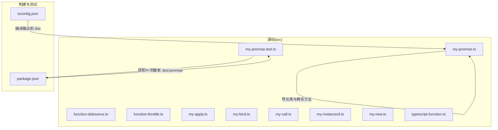
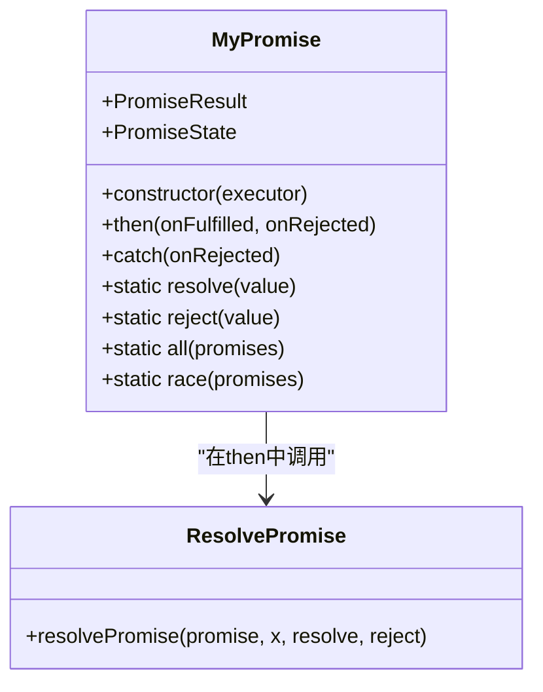
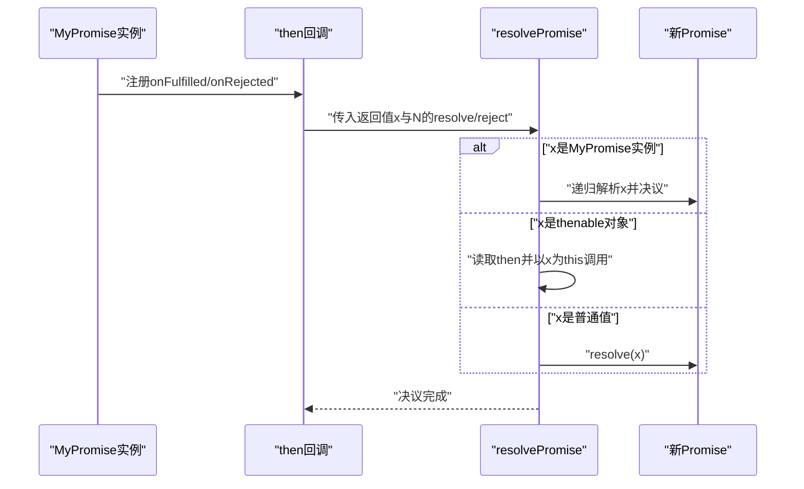
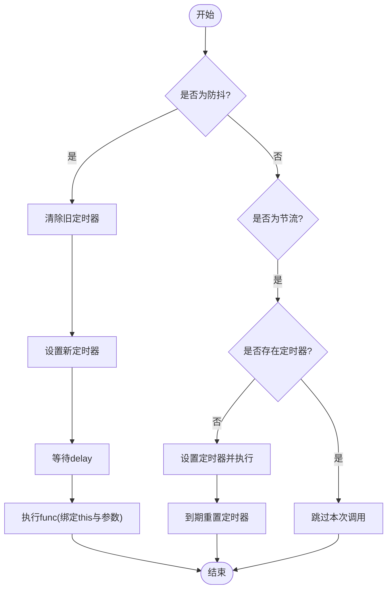
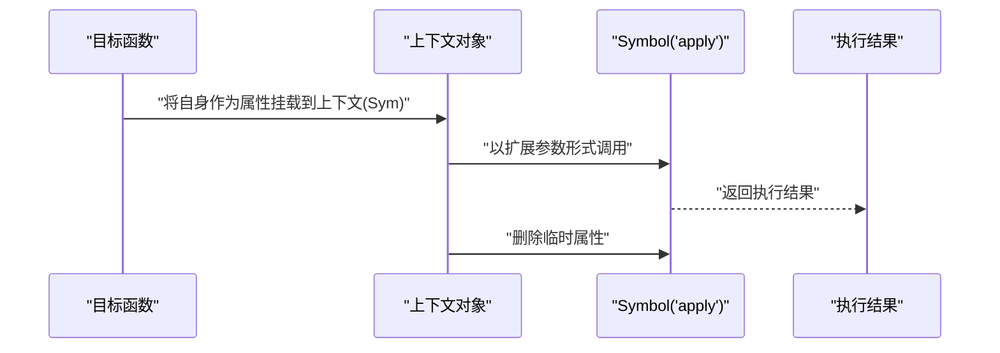
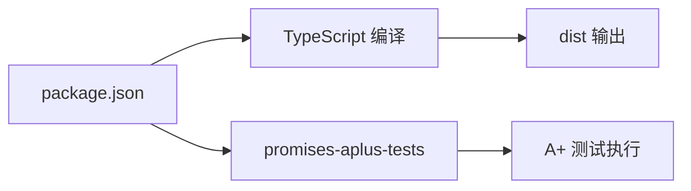

# 自定义代码实现

<cite>
**本文引用的文件**   
- [my-promise.ts](file://handwritten-code/src/my-promise.ts)
- [my-promise.test.ts](file://handwritten-code/src/my-promise.test.ts)
- [function-debounce.ts](file://handwritten-code/src/function-debounce.ts)
- [function-throttle.ts](file://handwritten-code/src/function-throttle.ts)
- [my-apply.ts](file://handwritten-code/src/my-apply.ts)
- [my-bind.ts](file://handwritten-code/src/my-bind.ts)
- [my-call.ts](file://handwritten-code/src/my-call.ts)
- [my-instanceof.ts](file://handwritten-code/src/my-instanceof.ts)
- [my-new.ts](file://handwritten-code/src/my-new.ts)
- [package.json](file://handwritten-code/package.json)
- [tsconfig.json](file://handwritten-code/tsconfig.json)
- [typescript-function.ts](file://handwritten-code/src/typescript-function.ts)
</cite>

## 目录
1. 引言
2. 项目结构
3. 核心组件
4. 架构总览
5. 组件详解
6. 依赖关系分析
7. 性能考量
8. 故障排查指南
9. 结论
10. 附录

## 引言
本技术文档围绕“自定义代码实现”主题，系统梳理并深入解析以下内容：
- Promise/A+ 规范的完整实现：状态管理、链式调用、错误传播与规范兼容性（含静态方法 all/race/resolve/reject）。
- 防抖与节流函数的实现原理、使用场景与性能优化要点。
- JavaScript 原生方法的自定义实现：apply/bind/call/instanceof/new 的设计思路与边界条件处理。
- TypeScript 内置工具类型的自定义实现，帮助理解类型编程思想。
- 单元测试与规范测试（Promises/A+ 测试套件）的集成方式与最佳实践。
- 性能基准测试与代码质量保障策略。

## 项目结构
该项目位于 handwritten-code 子目录中，采用 TypeScript 编写，通过 tsconfig.json 指定源码与输出目录，使用 promises-aplus-tests 进行 Promise/A+ 规范验证，并在 package.json 中提供构建与测试脚本。

图表来源
- [tsconfig.json:1-17](file://handwritten-code/tsconfig.json#L1-L17)
- [package.json:1-23](file://handwritten-code/package.json#L1-L23)

章节来源
- [tsconfig.json:1-17](file://handwritten-code/tsconfig.json#L1-L17)
- [package.json:1-23](file://handwritten-code/package.json#L1-L23)

## 核心组件
- Promise/A+ 实现：MyPromise 类、then/catch 链式调用、静态方法 all/race/resolve/reject、内部 resolvePromise 解析器。
- 函数防抖与节流：debounce/throttle 包装器，基于定时器的延迟与限流控制。
- 原生方法自定义实现：Function.prototype.myApply/myCall/myBind、自定义 instanceof、自定义 new。
- TypeScript 工具类型：Partial/Required/Readonly/Record/Pick/Omit/Exclude/Extract/NonNullable/Parameters/ConstructorParameters/ReturnType/InstanceType/ThisParameterType/OmitThisParameter/ThisType 等。
- 测试与质量：A+ 测试适配器、构建与测试脚本。

章节来源
- [my-promise.ts:74-236](file://handwritten-code/src/my-promise.ts#L74-L236)
- [function-debounce.ts:17-29](file://handwritten-code/src/function-debounce.ts#L17-L29)
- [function-throttle.ts:16-30](file://handwritten-code/src/function-throttle.ts#L16-L30)
- [my-apply.ts:21-31](file://handwritten-code/src/my-apply.ts#L21-L31)
- [my-call.ts:21-31](file://handwritten-code/src/my-call.ts#L21-L31)
- [my-bind.ts:18-37](file://handwritten-code/src/my-bind.ts#L18-L37)
- [my-instanceof.ts:17-40](file://handwritten-code/src/my-instanceof.ts#L17-L40)
- [my-new.ts:8-12](file://handwritten-code/src/my-new.ts#L8-L12)
- [typescript-function.ts:16-209](file://handwritten-code/src/typescript-function.ts#L16-L209)

## 架构总览
下图展示 Promise/A+ 实现的类结构与关键方法之间的关系，以及静态方法与内部解析器的协作。

图表来源
- [my-promise.ts:74-236](file://handwritten-code/src/my-promise.ts#L74-L236)
- [my-promise.ts:27-66](file://handwritten-code/src/my-promise.ts#L27-L66)

## 组件详解

### Promise/A+ 完整实现
- 状态模型：使用枚举表示 pending/fulfilled/rejected，确保状态不可逆。
- 执行器与回调队列：构造函数内保存 resolve/reject 并立即执行 executor；then 注册回调至 onResolved/onRejected 队列；状态变为 fulfilled/rejected 后按序出队执行。
- 链式调用与值穿透：then 默认对 onFulfilled/onRejected 进行兜底包装，使非函数参数按值穿透；内部 resolvePromise 支持嵌套 Promise、thenable 对象与普通值的统一处理。
- 错误传播：捕获执行异常并 reject；对 onFulfilled/onRejected 抛错进行二次 reject，保证链路错误可冒泡。
- 静态方法：
  - resolve：若传入值为 Promise 则透传其决议；否则直接 fulfilled。
  - reject：直接 rejected。
  - all：收集结果数组，按索引填充，全部完成才 resolve，首个拒绝即拒绝。
  - race：任一 settle 即 settle。
- 规范兼容：通过 promises-aplus-tests 脚本进行验证。

图表来源
- [my-promise.ts:123-178](file://handwritten-code/src/my-promise.ts#L123-L178)
- [my-promise.ts:27-66](file://handwritten-code/src/my-promise.ts#L27-L66)

章节来源
- [my-promise.ts:11-15](file://handwritten-code/src/my-promise.ts#L11-L15)
- [my-promise.ts:74-121](file://handwritten-code/src/my-promise.ts#L74-L121)
- [my-promise.ts:123-178](file://handwritten-code/src/my-promise.ts#L123-L178)
- [my-promise.ts:184-200](file://handwritten-code/src/my-promise.ts#L184-L200)
- [my-promise.ts:207-235](file://handwritten-code/src/my-promise.ts#L207-L235)

### 防抖与节流
- 防抖（debounce）：在 delay 时间内多次触发仅保留最后一次，超时后执行一次。适合搜索输入、窗口调整等高频事件。
- 节流（throttle）：固定时间间隔内只允许一次执行，其余忽略。适合滚动、鼠标移动等持续高频事件。
- 关键点：使用闭包保存定时器句柄；注意 this 与参数透传；避免内存泄漏需及时清理定时器。

图表来源
- [function-debounce.ts:17-29](file://handwritten-code/src/function-debounce.ts#L17-L29)
- [function-throttle.ts:16-30](file://handwritten-code/src/function-throttle.ts#L16-L30)

章节来源
- [function-debounce.ts:17-29](file://handwritten-code/src/function-debounce.ts#L17-L29)
- [function-throttle.ts:16-30](file://handwritten-code/src/function-throttle.ts#L16-L30)

### apply/bind/call/instanceof/new 的自定义实现
- myApply：
  - 校验调用者必须为函数；通过 Symbol 作为临时属性名挂载到 context 上；展开参数列表调用；删除临时属性并返回结果。
  - 边界：context 可为 null/undefined 时映射到全局对象；传入非函数抛出类型错误。
- myCall：
  - 与 apply 类似，但参数以逗号分隔传入，内部统一转为数组形式。
- myBind：
  - 返回一个“绑定函数”，支持 new 调用时正确设置 this 指向；维持原型链关系（通过中间构造器 NOP）；柯里化参数拼接。
  - 边界：非函数调用抛错；new 绑定函数时 this 指向实例。
- myInstanceof：
  - 若右值无 Symbol.hasInstance，则沿左值原型链向上查找右值的 prototype；若存在则优先委托给该符号方法。
  - 边界：右值必须为对象或函数；null/undefined 直接报错。
- myNew：
  - 使用 Object.create(foo.prototype) 创建对象；以 obj 为 this 调用构造函数；若构造函数返回对象则返回该对象，否则返回 obj。

图表来源
- [my-apply.ts:21-31](file://handwritten-code/src/my-apply.ts#L21-L31)
- [my-call.ts:21-31](file://handwritten-code/src/my-call.ts#L21-L31)
- [my-bind.ts:18-37](file://handwritten-code/src/my-bind.ts#L18-L37)
- [my-instanceof.ts:17-40](file://handwritten-code/src/my-instanceof.ts#L17-L40)
- [my-new.ts:8-12](file://handwritten-code/src/my-new.ts#L8-L12)

章节来源
- [my-apply.ts:21-31](file://handwritten-code/src/my-apply.ts#L21-L31)
- [my-call.ts:21-31](file://handwritten-code/src/my-call.ts#L21-L31)
- [my-bind.ts:18-37](file://handwritten-code/src/my-bind.ts#L18-L37)
- [my-instanceof.ts:17-40](file://handwritten-code/src/my-instanceof.ts#L17-L40)
- [my-new.ts:8-12](file://handwritten-code/src/my-new.ts#L8-L12)

### TypeScript 内置工具类型的自定义实现
- 通过映射类型与条件类型实现 Partial/Required/Readonly/Record/Pick/Omit/Exclude/Extract/NonNullable/Parameters/ConstructorParameters/ReturnType/InstanceType/ThisParameterType/OmitThisParameter/ThisType 等。
- 设计要点：利用 keyof、infer、extends、never、Exclude 等语言特性进行类型推导与过滤；保持与内置行为一致的语义。

章节来源
- [typescript-function.ts:16-209](file://handwritten-code/src/typescript-function.ts#L16-L209)

## 依赖关系分析
- 构建与运行时依赖：
  - TypeScript 编译器与类型声明；
  - promises-aplus-tests 用于 Promise/A+ 规范测试；
  - ts-node 与 @types/node 便于开发调试。
- 测试脚本：
  - test:promise：先构建，再使用 A+ 测试套件对 my-promise.test.js 进行测试。

图表来源
- [package.json:8-21](file://handwritten-code/package.json#L8-L21)

章节来源
- [package.json:8-21](file://handwritten-code/package.json#L8-L21)

## 性能考量
- Promise 链式调用：
  - 使用微任务/宏任务（示例中使用 setTimeout 0）模拟异步决议，避免阻塞主线程；建议在生产环境结合 queueMicrotask 或 MutationObserver 优化微任务调度。
  - 避免深层嵌套 Promise 与重复 then 注册导致的回调堆积。
- 防抖与节流：
  - 防抖：合理设置 delay，避免过长导致交互迟滞；在组件卸载时清理定时器。
  - 节流：根据业务场景选择合适的 delay；对于高频滚动事件，优先考虑 requestAnimationFrame 降低掉帧风险。
- apply/bind/call：
  - Symbol 属性名避免命名冲突；尽量减少频繁挂载/删除临时属性的开销。
- instanceof/new：
  - 原型链遍历复杂度与继承层级成正比；在深度继承场景下谨慎使用；必要时可引入缓存策略（不改变语义的前提下）。

## 故障排查指南
- Promise/A+ 测试失败：
  - 检查 then 回调的异步执行时机与错误传播路径；确认 resolvePromise 对 thenable 的处理逻辑与循环引用检测。
  - 确认静态方法 all/race/resolve/reject 的行为与标准一致。
- 防抖/节流无效：
  - 确认传入的 delay 是否合理；检查 this 与参数透传是否正确；确保在组件销毁时清理定时器。
- apply/bind/call 报错：
  - 非函数调用会抛出类型错误；确保调用者为函数；new 绑定函数时的 this 指向需符合预期。
- instanceof 报错：
  - 右值必须为对象或函数；若自定义了 Symbol.hasInstance，请确保其返回布尔值且语义正确。
- myNew 返回值异常：
  - 构造函数返回对象时应直接返回该对象；否则返回新创建的对象。

章节来源
- [my-promise.ts:27-66](file://handwritten-code/src/my-promise.ts#L27-L66)
- [my-promise.ts:123-178](file://handwritten-code/src/my-promise.ts#L123-L178)
- [function-debounce.ts:17-29](file://handwritten-code/src/function-debounce.ts#L17-L29)
- [function-throttle.ts:16-30](file://handwritten-code/src/function-throttle.ts#L16-L30)
- [my-apply.ts:21-31](file://handwritten-code/src/my-apply.ts#L21-L31)
- [my-call.ts:21-31](file://handwritten-code/src/my-call.ts#L21-L31)
- [my-bind.ts:18-37](file://handwritten-code/src/my-bind.ts#L18-L37)
- [my-instanceof.ts:17-40](file://handwritten-code/src/my-instanceof.ts#L17-L40)
- [my-new.ts:8-12](file://handwritten-code/src/my-new.ts#L8-L12)

## 结论
本项目通过一系列自定义实现，系统展示了 JavaScript 底层机制与规范要求：
- Promise/A+ 的核心在于状态机、链式决议与错误传播，需严格遵循规范细节。
- 防抖与节流是高频事件优化的常用手段，需结合业务场景选择合适策略。
- apply/bind/call/instanceof/new 的实现体现了对 this 绑定、原型链与构造过程的理解。
- TypeScript 工具类型实现有助于深入掌握类型编程范式。
- 通过 promises-aplus-tests 与自定义测试适配器，可以有效保障实现质量与一致性。

## 附录
- 测试与构建
  - 构建命令：tsc
  - A+ 测试命令：npm run test:promise（先构建，再运行 A+ 测试）
- 推荐实践
  - 在实际工程中，优先使用浏览器/Node 原生 Promise；本实现主要用于学习与教学。
  - 对于高并发与复杂业务，建议引入成熟的 Promise 库并配合可观测性与错误监控体系。