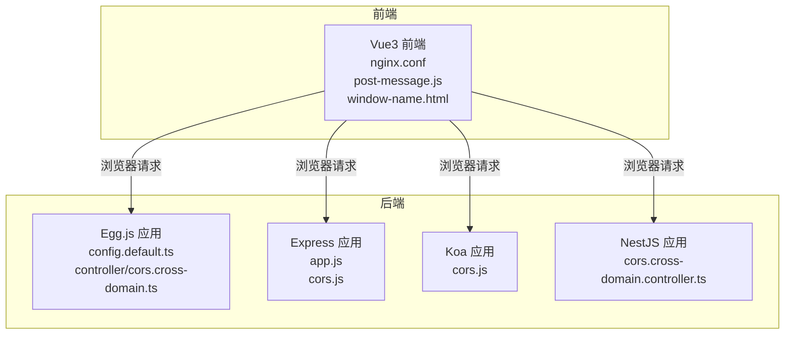
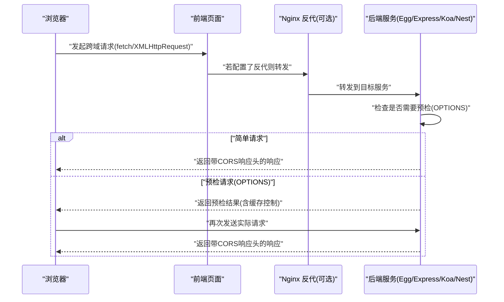
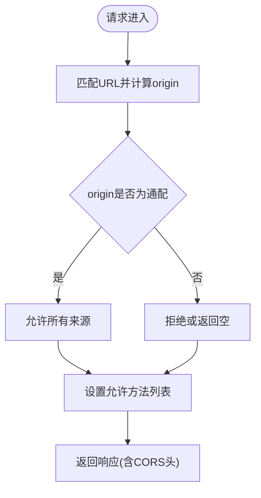
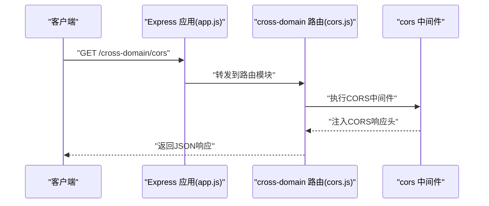
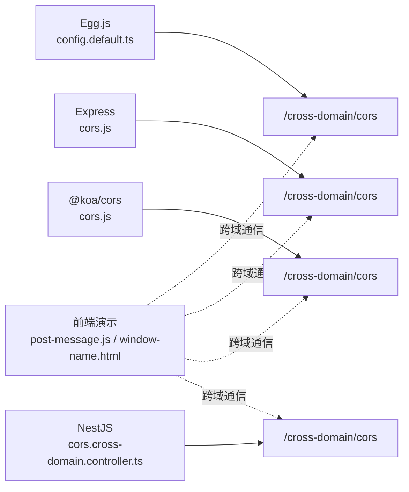

# CORS跨域处理

<cite>
**本文引用的文件**
- [practice/nodejs-service/egg/cross-domain/config/config.default.ts](file://practice/nodejs-service/egg/cross-domain/config/config.default.ts)
- [practice/nodejs-service/egg/cross-domain/app/module/cross-domain/controller/cors.cross-domain.ts](file://practice/nodejs-service/egg/cross-domain/app/module/cross-domain/controller/cors.cross-domain.ts)
- [practice/nodejs-service/express/cross-domain/cross-domain/cors.js](file://practice/nodejs-service/express/cross-domain/cross-domain/cors.js)
- [practice/nodejs-service/express/cross-domain/app.js](file://practice/nodejs-service/express/cross-domain/app.js)
- [practice/nodejs-service/koa/cross-domain/cross-domain/cors.js](file://practice/nodejs-service/koa/cross-domain/cross-domain/cors.js)
- [practice/nodejs-service/nest/cross-domain/src/cross-domain/cors.cross-domain.controller.ts](file://practice/nodejs-service/nest/cross-domain/src/cross-domain/cors.cross-domain.controller.ts)
- [practice/vue3-frontend/cross-domain/nginx-conf/nginx.conf](file://practice/vue3-frontend/cross-domain/nginx-conf/nginx.conf)
- [practice/vue3-frontend/cross-domain/public/post-message.js](file://practice/vue3-frontend/cross-domain/public/post-message.js)
- [practice/vue3-frontend/cross-domain/public/window-name.html](file://practice/vue3-frontend/cross-domain/public/window-name.html)
</cite>

## 目录
1. [引言](#引言)
2. [项目结构](#项目结构)
3. [核心组件](#核心组件)
4. [架构总览](#架构总览)
5. [详细组件分析](#详细组件分析)
6. [依赖关系分析](#依赖关系分析)
7. [性能考量](#性能考量)
8. [故障排查指南](#故障排查指南)
9. [结论](#结论)
10. [附录](#附录)

## 引言
本技术文档围绕CORS（跨域资源共享）展开，系统讲解其工作原理与HTTP头部机制，并结合Egg.js、Express、Koa三个后端框架以及Nest.js的实际实现，给出可操作的配置与最佳实践。同时覆盖前端JavaScript中fetch与XMLHttpRequest的跨域请求配置要点、预检请求（OPTIONS）的处理与缓存策略、完整配置清单与常见问题解决方案。

## 项目结构
该仓库在“practice/nodejs-service”目录下提供了多框架的CORS示例，在“practice/vue3-frontend/cross-domain”目录下提供了前端跨域演示资源与Nginx反向代理配置，便于本地联调与验证。

图示来源
- [practice/vue3-frontend/cross-domain/nginx-conf/nginx.conf:22-44](file://practice/vue3-frontend/cross-domain/nginx-conf/nginx.conf#L22-L44)
- [practice/nodejs-service/egg/cross-domain/config/config.default.ts:31-41](file://practice/nodejs-service/egg/cross-domain/config/config.default.ts#L31-L41)
- [practice/nodejs-service/egg/cross-domain/app/module/cross-domain/controller/cors.cross-domain.ts:11-19](file://practice/nodejs-service/egg/cross-domain/app/module/cross-domain/controller/cors.cross-domain.ts#L11-L19)
- [practice/nodejs-service/express/cross-domain/app.js:13-22](file://practice/nodejs-service/express/cross-domain/app.js#L13-L22)
- [practice/nodejs-service/express/cross-domain/cross-domain/cors.js:3-14](file://practice/nodejs-service/express/cross-domain/cross-domain/cors.js#L3-L14)
- [practice/nodejs-service/koa/cross-domain/cross-domain/cors.js:3-13](file://practice/nodejs-service/koa/cross-domain/cross-domain/cors.js#L3-L13)
- [practice/nodejs-service/nest/cross-domain/src/cross-domain/cors.cross-domain.controller.ts:3-9](file://practice/nodejs-service/nest/cross-domain/src/cross-domain/cors.cross-domain.controller.ts#L3-L9)

章节来源
- [practice/vue3-frontend/cross-domain/nginx-conf/nginx.conf:22-44](file://practice/vue3-frontend/cross-domain/nginx-conf/nginx.conf#L22-L44)
- [practice/nodejs-service/egg/cross-domain/config/config.default.ts:31-41](file://practice/nodejs-service/egg/cross-domain/config/config.default.ts#L31-L41)
- [practice/nodejs-service/express/cross-domain/app.js:13-22](file://practice/nodejs-service/express/cross-domain/app.js#L13-L22)
- [practice/nodejs-service/express/cross-domain/cross-domain/cors.js:3-14](file://practice/nodejs-service/express/cross-domain/cross-domain/cors.js#L3-L14)
- [practice/nodejs-service/koa/cross-domain/cross-domain/cors.js:3-13](file://practice/nodejs-service/koa/cross-domain/cross-domain/cors.js#L3-L13)
- [practice/nodejs-service/nest/cross-domain/src/cross-domain/cors.cross-domain.controller.ts:3-9](file://practice/nodejs-service/nest/cross-domain/src/cross-domain/cors.cross-domain.controller.ts#L3-L9)

## 核心组件
- Egg.js CORS配置：通过应用级配置启用CORS，支持动态origin与允许的方法列表。
- Express 路由级CORS：使用中间件对特定路由启用CORS。
- Koa 路由级CORS：使用中间件对特定路由启用CORS。
- NestJS 控制器级CORS：在控制器层暴露CORS接口。
- 前端演示：包含postMessage与window.name等跨域通信方式的演示页面。

章节来源
- [practice/nodejs-service/egg/cross-domain/config/config.default.ts:31-41](file://practice/nodejs-service/egg/cross-domain/config/config.default.ts#L31-L41)
- [practice/nodejs-service/egg/cross-domain/app/module/cross-domain/controller/cors.cross-domain.ts:11-19](file://practice/nodejs-service/egg/cross-domain/app/module/cross-domain/controller/cors.cross-domain.ts#L11-L19)
- [practice/nodejs-service/express/cross-domain/cross-domain/cors.js:3-14](file://practice/nodejs-service/express/cross-domain/cross-domain/cors.js#L3-L14)
- [practice/nodejs-service/koa/cross-domain/cross-domain/cors.js:3-13](file://practice/nodejs-service/koa/cross-domain/cross-domain/cors.js#L3-L13)
- [practice/nodejs-service/nest/cross-domain/src/cross-domain/cors.cross-domain.controller.ts:3-9](file://practice/nodejs-service/nest/cross-domain/src/cross-domain/cors.cross-domain.controller.ts#L3-L9)

## 架构总览
下图展示了从浏览器到后端服务的典型CORS交互流程，包括简单请求与预检请求两种路径。

图示来源
- [practice/vue3-frontend/cross-domain/nginx-conf/nginx.conf:22-44](file://practice/vue3-frontend/cross-domain/nginx-conf/nginx.conf#L22-L44)
- [practice/nodejs-service/egg/cross-domain/config/config.default.ts:31-41](file://practice/nodejs-service/egg/cross-domain/config/config.default.ts#L31-L41)
- [practice/nodejs-service/express/cross-domain/app.js:13-22](file://practice/nodejs-service/express/cross-domain/app.js#L13-L22)

## 详细组件分析

### Egg.js CORS 配置与实现
- 应用级CORS配置：通过config.cors定义origin与allowMethods等选项；origin支持函数按URL动态返回值。
- 控制器接口：定义GET /cross-domain/cors，返回消息体。
- 安全性：domainWhiteList设置为通配，便于演示但生产环境建议收窄白名单。

图示来源
- [practice/nodejs-service/egg/cross-domain/config/config.default.ts:31-41](file://practice/nodejs-service/egg/cross-domain/config/config.default.ts#L31-L41)
- [practice/nodejs-service/egg/cross-domain/app/module/cross-domain/controller/cors.cross-domain.ts:11-19](file://practice/nodejs-service/egg/cross-domain/app/module/cross-domain/controller/cors.cross-domain.ts#L11-L19)

章节来源
- [practice/nodejs-service/egg/cross-domain/config/config.default.ts:31-41](file://practice/nodejs-service/egg/cross-domain/config/config.default.ts#L31-L41)
- [practice/nodejs-service/egg/cross-domain/app/module/cross-domain/controller/cors.cross-domain.ts:11-19](file://practice/nodejs-service/egg/cross-domain/app/module/cross-domain/controller/cors.cross-domain.ts#L11-L19)

### Express 路由级CORS 实现
- 使用cors中间件对特定路由启用CORS，支持自定义配置对象。
- 应用入口注册路由模块，挂载到“/cross-domain”。

图示来源
- [practice/nodejs-service/express/cross-domain/app.js:13-22](file://practice/nodejs-service/express/cross-domain/app.js#L13-L22)
- [practice/nodejs-service/express/cross-domain/cross-domain/cors.js:3-14](file://practice/nodejs-service/express/cross-domain/cross-domain/cors.js#L3-L14)

章节来源
- [practice/nodejs-service/express/cross-domain/app.js:13-22](file://practice/nodejs-service/express/cross-domain/app.js#L13-L22)
- [practice/nodejs-service/express/cross-domain/cross-domain/cors.js:3-14](file://practice/nodejs-service/express/cross-domain/cross-domain/cors.js#L3-L14)

### Koa 路由级CORS 实现
- 使用@koa/cors中间件对特定路由启用CORS。
- 与Express类似，仅对单一路由生效。

章节来源
- [practice/nodejs-service/koa/cross-domain/cross-domain/cors.js:3-13](file://practice/nodejs-service/koa/cross-domain/cross-domain/cors.js#L3-L13)

### NestJS 控制器级CORS 实现
- 在控制器上暴露GET /cross-domain/cors接口，返回消息体。
- 适合快速验证跨域响应是否正确返回。

章节来源
- [practice/nodejs-service/nest/cross-domain/src/cross-domain/cors.cross-domain.controller.ts:3-9](file://practice/nodejs-service/nest/cross-domain/src/cross-domain/cors.cross-domain.controller.ts#L3-L9)

### 前端跨域演示与配置
- postMessage：通过window.postMessage进行父子窗口通信，演示跨域消息传递。
- window.name：利用window.name在同源检测基础上进行数据交换。
- Nginx反向代理：提供多端口服务与代理配置，便于本地联调不同域场景。

章节来源
- [practice/vue3-frontend/cross-domain/public/post-message.js:1-8](file://practice/vue3-frontend/cross-domain/public/post-message.js#L1-L8)
- [practice/vue3-frontend/cross-domain/public/window-name.html:24-57](file://practice/vue3-frontend/cross-domain/public/window-name.html#L24-L57)
- [practice/vue3-frontend/cross-domain/nginx-conf/nginx.conf:22-44](file://practice/vue3-frontend/cross-domain/nginx-conf/nginx.conf#L22-L44)

## 依赖关系分析
- Egg.js：通过应用配置启用CORS，影响全局路由。
- Express/Koa：通过中间件对指定路由启用CORS，更细粒度。
- NestJS：通过控制器暴露接口，便于集成测试。
- 前端：通过postMessage与window.name实现跨域通信，不依赖后端CORS中间件。

图示来源
- [practice/nodejs-service/egg/cross-domain/config/config.default.ts:31-41](file://practice/nodejs-service/egg/cross-domain/config/config.default.ts#L31-L41)
- [practice/nodejs-service/express/cross-domain/cross-domain/cors.js:3-14](file://practice/nodejs-service/express/cross-domain/cross-domain/cors.js#L3-L14)
- [practice/nodejs-service/koa/cross-domain/cross-domain/cors.js:3-13](file://practice/nodejs-service/koa/cross-domain/cross-domain/cors.js#L3-L13)
- [practice/nodejs-service/nest/cross-domain/src/cross-domain/cors.cross-domain.controller.ts:3-9](file://practice/nodejs-service/nest/cross-domain/src/cross-domain/cors.cross-domain.controller.ts#L3-L9)
- [practice/vue3-frontend/cross-domain/public/post-message.js:1-8](file://practice/vue3-frontend/cross-domain/public/post-message.js#L1-L8)
- [practice/vue3-frontend/cross-domain/public/window-name.html:24-57](file://practice/vue3-frontend/cross-domain/public/window-name.html#L24-L57)

## 性能考量
- 预检请求缓存：通过合理设置预检响应的缓存时间，减少重复OPTIONS请求次数。
- 最小化CORS头：仅暴露必要的origin与methods，避免通配符滥用导致安全风险与性能损耗。
- 中间件位置：Express/Koa中将CORS中间件置于路由之前，确保所有路由均被覆盖。
- 反向代理：Nginx可作为统一入口，集中处理CORS与静态资源分发。

## 故障排查指南
- 现象：浏览器报跨域错误
  - 检查后端是否正确注入CORS响应头（origin、allow-methods等）
  - 确认请求方法是否在allowMethods范围内
  - 若为复杂请求，确认预检请求已正确返回并被浏览器缓存
- 现象：预检频繁触发
  - 检查后端预检响应的缓存控制头是否设置
  - 减少请求头变化，避免每次触发新的预检
- 现象：生产环境白名单失效
  - Egg.js的domainWhiteList与CORS配置需协同校验
  - 将通配符替换为具体域名，提升安全性

章节来源
- [practice/nodejs-service/egg/cross-domain/config/config.default.ts:24-41](file://practice/nodejs-service/egg/cross-domain/config/config.default.ts#L24-L41)

## 结论
通过在Egg.js、Express、Koa与NestJS中分别实现CORS，结合前端postMessage与window.name演示，可以构建一套完整的跨域处理方案。实践中应根据业务场景选择合适的CORS作用范围（应用级或路由级），并重视预检请求的缓存与白名单配置，以兼顾安全与性能。

## 附录

### CORS关键响应头与含义
- Access-Control-Allow-Origin：允许访问的来源，可为具体域名或通配符
- Access-Control-Allow-Methods：允许的HTTP方法集合
- Access-Control-Allow-Headers：允许携带的请求头集合
- Access-Control-Max-Age：预检请求结果缓存时长（秒）

### 预检请求（OPTIONS）处理与缓存策略
- 流程：浏览器在复杂请求前发送OPTIONS预检，后端返回允许的方法与头信息，并可设置缓存时间
- 缓存：通过Max-Age减少后续相同预检的重复请求

### 前端JavaScript跨域请求配置要点
- fetch：默认不携带cookie，如需携带需设置credentials
- XMLHttpRequest：可通过withCredentials控制是否携带凭据
- postMessage：适用于父子窗口跨域通信
- window.name：在同源检测基础上进行数据交换

### 完整CORS配置清单（示例项）
- Egg.js
  - origin函数：按URL动态返回允许来源
  - allowMethods：声明允许的HTTP方法
- Express/Koa
  - 中间件参数：配置允许来源与方法
- NestJS
  - 控制器接口：暴露CORS可用的REST端点
- 前端
  - 请求头与凭据设置
  - postMessage与window.name的使用场景