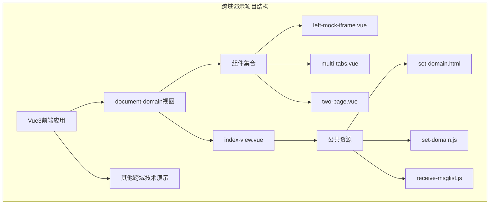
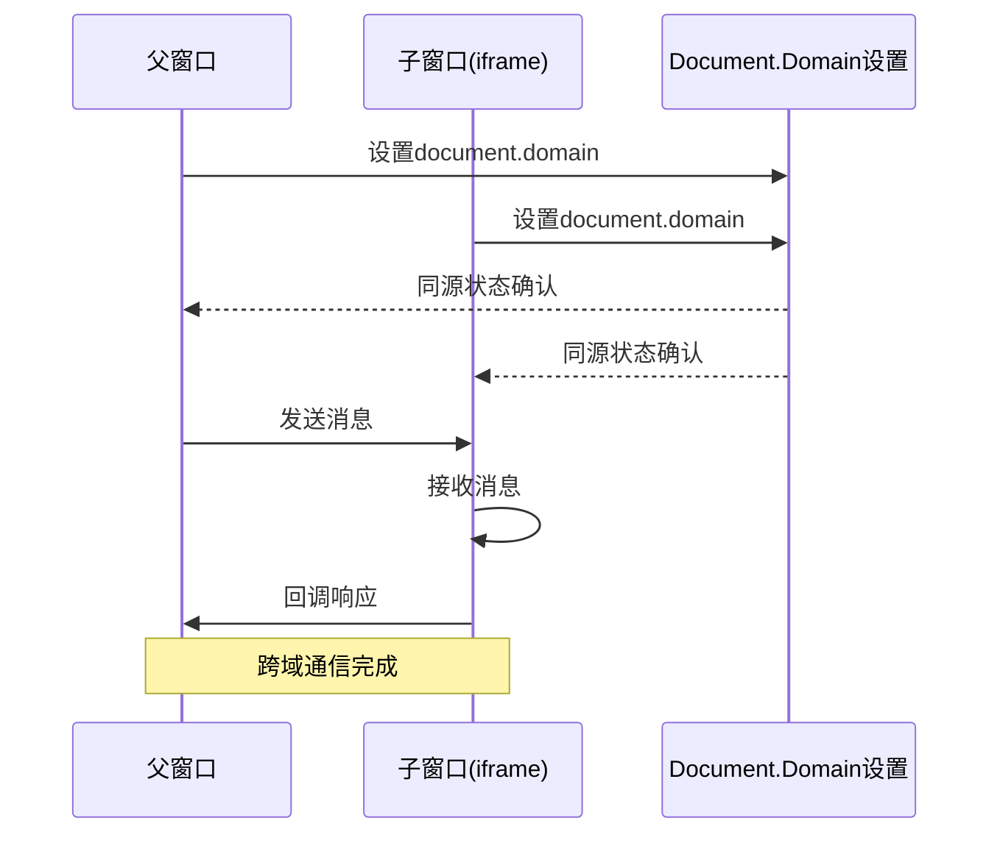
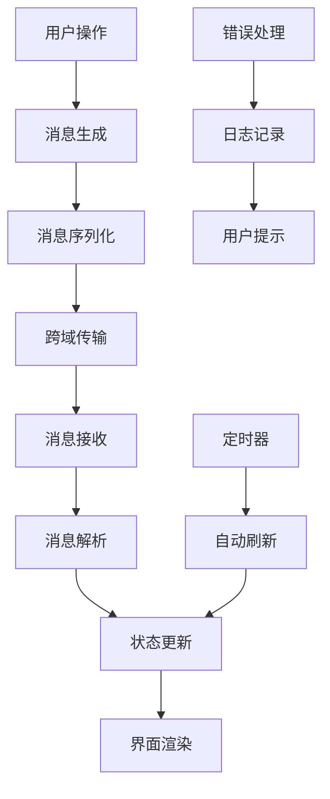
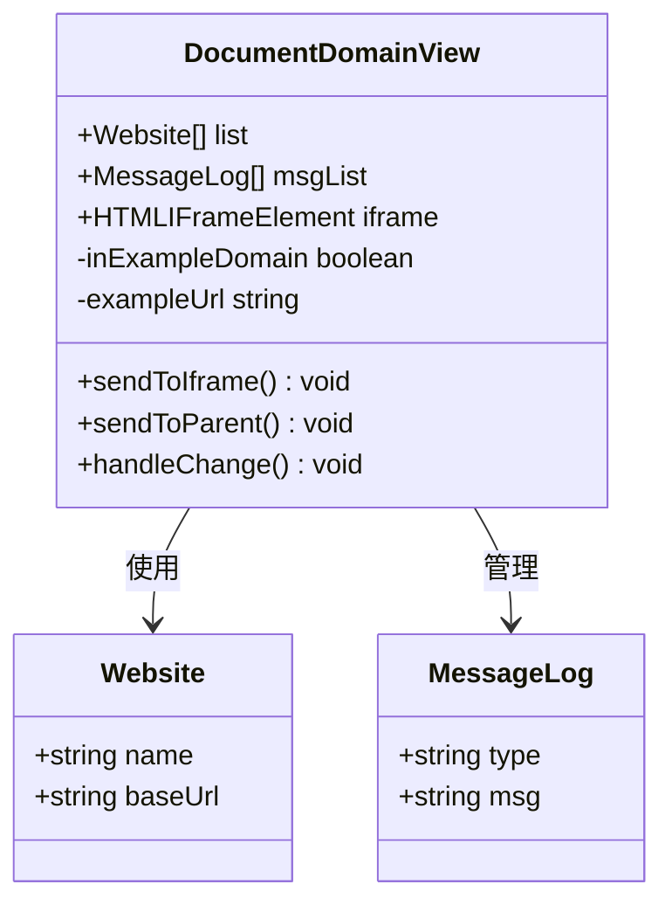
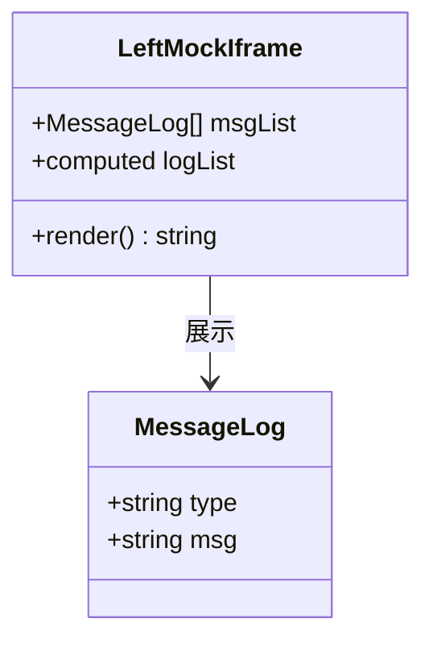
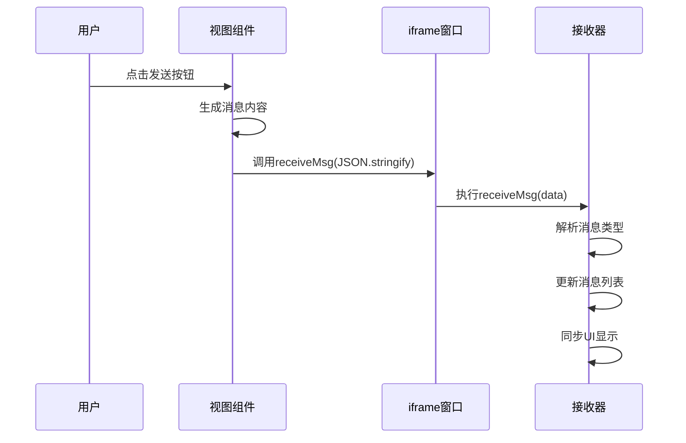
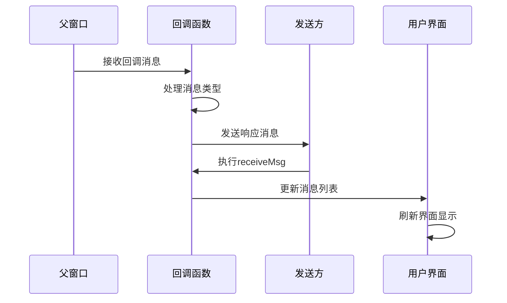
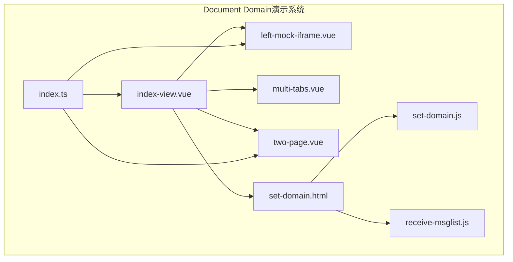
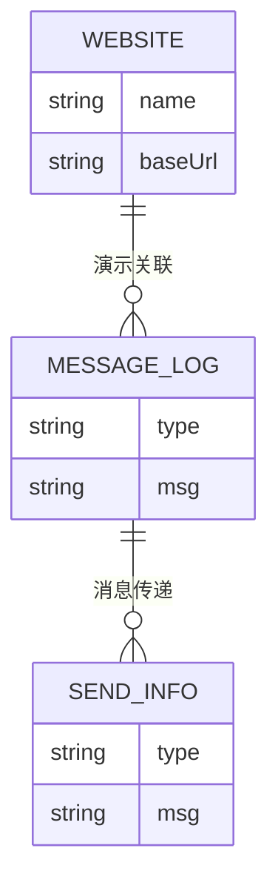

# Document Domain跨域处理

<cite>
**本文档引用的文件**
- [set-domain.html](file://practice/vue3-frontend/cross-domain/public/set-domain.html)
- [set-domain.js](file://practice/vue3-frontend/cross-domain/public/set-domain.js)
- [receive-msglist.js](file://practice/vue3-frontend/cross-domain/public/receive-msglist.js)
- [index-view.vue](file://practice/vue3-frontend/cross-domain/src/views/document-domain/index-view.vue)
- [left-mock-iframe.vue](file://practice/vue3-frontend/cross-domain/src/components/left-mock-iframe.vue)
- [index.ts](file://practice/vue3-frontend/cross-domain/src/types/index.ts)
</cite>

## 目录
1. [引言](#引言)
2. [项目结构](#项目结构)
3. [核心组件](#核心组件)
4. [架构概览](#架构概览)
5. [详细组件分析](#详细组件分析)
6. [依赖关系分析](#依赖关系分析)
7. [性能考虑](#性能考虑)
8. [故障排除指南](#故障排除指南)
9. [结论](#结论)
10. [附录](#附录)

## 引言

Document Domain跨域处理是一种基于浏览器同源策略的特殊机制，允许在相同顶级域名下的不同子域名之间进行跨域通信。这种技术通过设置document.domain属性，将页面的域名提升到同一顶级域级别，从而绕过浏览器的同源策略限制。

在现代Web开发中，随着微服务架构和单页应用的普及，跨域通信已成为一个重要的技术话题。Document Domain作为一种传统的跨域解决方案，在特定场景下仍然具有实用价值，特别是在需要与遗留系统集成或处理复杂的企业级应用场景时。

## 项目结构

该项目采用Vue 3前端框架构建，专门用于演示各种跨域处理技术。Document Domain演示位于cross-domain模块中，包含了完整的实现示例和测试环境。

**图表来源**
- [index-view.vue:1-123](file://practice/vue3-frontend/cross-domain/src/views/document-domain/index-view.vue#L1-L123)
- [left-mock-iframe.vue:1-51](file://practice/vue3-frontend/cross-domain/src/components/left-mock-iframe.vue#L1-L51)

**章节来源**
- [index-view.vue:1-123](file://practice/vue3-frontend/cross-domain/src/views/document-domain/index-view.vue#L1-L123)
- [left-mock-iframe.vue:1-51](file://practice/vue3-frontend/cross-domain/src/components/left-mock-iframe.vue#L1-L51)

## 核心组件

### Document Domain实现原理

Document Domain跨域处理的核心在于理解浏览器的同源策略和域的概念。同源策略要求两个页面必须满足相同的协议、主机名和端口才能相互访问。而Document Domain技术通过以下方式实现跨域通信：

1. **域的层次结构**：浏览器将域分为顶级域、二级域等层级
2. **域的提升机制**：通过设置document.domain，可以将页面的域提升到更高级别的域
3. **通信边界**：只有在同一顶级域下的页面才能通过这种方式通信

### 主要实现文件

#### set-domain.html - 基础配置页面
该文件展示了Document Domain的基本配置方法，通过设置document.domain属性来实现跨域通信的基础环境。

#### set-domain.js - 跨域通信接口
提供了与父窗口通信的接口函数，包括消息发送和接收功能。

#### receive-msglist.js - 消息处理逻辑
实现了消息列表的同步和显示功能，处理来自不同窗口的消息数据。

**章节来源**
- [set-domain.html:1-18](file://practice/vue3-frontend/cross-domain/public/set-domain.html#L1-L18)
- [set-domain.js:1-9](file://practice/vue3-frontend/cross-domain/public/set-domain.js#L1-L9)
- [receive-msglist.js:1-48](file://practice/vue3-frontend/cross-domain/public/receive-msglist.js#L1-L48)

## 架构概览

Document Domain跨域处理的架构设计基于双页面通信模型，通过iframe实现父子窗口之间的数据交换。

**图表来源**
- [index-view.vue:25-75](file://practice/vue3-frontend/cross-domain/src/views/document-domain/index-view.vue#L25-L75)
- [set-domain.js:5-8](file://practice/vue3-frontend/cross-domain/public/set-domain.js#L5-L8)

### 数据流架构

**图表来源**
- [receive-msglist.js:26-47](file://practice/vue3-frontend/cross-domain/public/receive-msglist.js#L26-L47)
- [index-view.vue:25-75](file://practice/vue3-frontend/cross-domain/src/views/document-domain/index-view.vue#L25-L75)

## 详细组件分析

### Vue组件架构

#### index-view.vue - 主控制器
作为Document Domain演示的核心组件，负责管理整个跨域通信流程。

**图表来源**
- [index-view.vue:1-123](file://practice/vue3-frontend/cross-domain/src/views/document-domain/index-view.vue#L1-L123)
- [index.ts:13-26](file://practice/vue3-frontend/cross-domain/src/types/index.ts#L13-L26)

#### 左侧模拟iframe组件
提供了一个模拟的iframe内容展示区域，用于演示跨域通信的效果。

**图表来源**
- [left-mock-iframe.vue:1-51](file://practice/vue3-frontend/cross-domain/src/components/left-mock-iframe.vue#L1-L51)
- [index.ts:18-26](file://practice/vue3-frontend/cross-domain/src/types/index.ts#L18-L26)

**章节来源**
- [index-view.vue:1-123](file://practice/vue3-frontend/cross-domain/src/views/document-domain/index-view.vue#L1-L123)
- [left-mock-iframe.vue:1-51](file://practice/vue3-frontend/cross-domain/src/components/left-mock-iframe.vue#L1-L51)
- [index.ts:1-27](file://practice/vue3-frontend/cross-domain/src/types/index.ts#L1-L27)

### 跨域通信流程

#### 消息发送流程

**图表来源**
- [index-view.vue:25-42](file://practice/vue3-frontend/cross-domain/src/views/document-domain/index-view.vue#L25-L42)
- [receive-msglist.js:26-47](file://practice/vue3-frontend/cross-domain/public/receive-msglist.js#L26-L47)

#### 消息接收流程

**图表来源**
- [index-view.vue:48-75](file://practice/vue3-frontend/cross-domain/src/views/document-domain/index-view.vue#L48-L75)
- [receive-msglist.js:34-47](file://practice/vue3-frontend/cross-domain/public/receive-msglist.js#L34-L47)

**章节来源**
- [index-view.vue:25-75](file://practice/vue3-frontend/cross-domain/src/views/document-domain/index-view.vue#L25-L75)
- [receive-msglist.js:26-47](file://practice/vue3-frontend/cross-domain/public/receive-msglist.js#L26-L47)

## 依赖关系分析

### 组件依赖图

**图表来源**
- [index-view.vue:4-6](file://practice/vue3-frontend/cross-domain/src/views/document-domain/index-view.vue#L4-L6)
- [left-mock-iframe.vue:1-51](file://practice/vue3-frontend/cross-domain/src/components/left-mock-iframe.vue#L1-L51)

### 类型定义关系

**图表来源**
- [index.ts:13-26](file://practice/vue3-frontend/cross-domain/src/types/index.ts#L13-L26)

**章节来源**
- [index-view.vue:1-123](file://practice/vue3-frontend/cross-domain/src/views/document-domain/index-view.vue#L1-L123)
- [index.ts:1-27](file://practice/vue3-frontend/cross-domain/src/types/index.ts#L1-L27)

## 性能考虑

### 内存管理
- **事件监听器清理**：在组件卸载时及时移除事件监听器，避免内存泄漏
- **消息缓存控制**：限制消息列表长度，防止无限增长导致性能问题
- **DOM操作优化**：批量更新DOM，减少重排重绘次数

### 通信效率
- **消息序列化**：使用JSON格式进行消息传输，确保数据完整性
- **异步处理**：采用异步方式处理跨域通信，避免阻塞主线程
- **错误恢复**：实现重试机制和错误处理，提高系统稳定性

## 故障排除指南

### 常见问题及解决方案

#### 域设置失败
当document.domain设置不正确时，会出现跨域访问被拒绝的情况。需要确保：
- 父子窗口都设置了相同的顶级域名
- 域名格式正确，不包含端口号
- 浏览器支持该特性（现代浏览器已有限制）

#### 消息接收异常
如果消息无法正常接收，检查以下几点：
- 确认iframe加载完成后再发送消息
- 验证消息格式是否符合预期
- 检查跨域通信接口是否正确实现

#### 性能问题
当消息量过大时可能出现性能问题：
- 实现消息列表长度限制
- 优化DOM更新频率
- 使用虚拟滚动等技术处理大量数据

**章节来源**
- [receive-msglist.js:26-47](file://practice/vue3-frontend/cross-domain/public/receive-msglist.js#L26-L47)
- [index-view.vue:59-62](file://practice/vue3-frontend/cross-domain/src/views/document-domain/index-view.vue#L59-L62)

## 结论

Document Domain跨域处理作为一种传统的跨域解决方案，在特定场景下仍然具有实用价值。通过合理设置document.domain属性，可以在相同顶级域名下的不同子域名之间实现安全有效的跨域通信。

然而，需要注意的是，随着Web安全标准的不断提高，现代浏览器对Document Domain的支持正在逐步减少。在新项目中，建议优先考虑CORS、postMessage等更安全、更标准化的跨域解决方案。

对于需要维护的遗留系统，Document Domain仍然是一个可行的选择，但应该配合其他安全措施使用，并定期评估迁移到现代方案的可能性。

## 附录

### 最佳实践指南

#### 安全考虑
- 始终验证消息来源和内容
- 实施适当的输入验证和过滤
- 使用HTTPS协议确保通信安全
- 定期审查和更新安全策略

#### 兼容性处理
- 检测浏览器支持情况
- 提供降级方案和回退机制
- 实现优雅的错误处理
- 记录详细的日志信息

#### 性能优化
- 实现消息队列和批处理
- 优化DOM操作和事件处理
- 使用Web Workers处理复杂计算
- 实施缓存策略减少重复请求