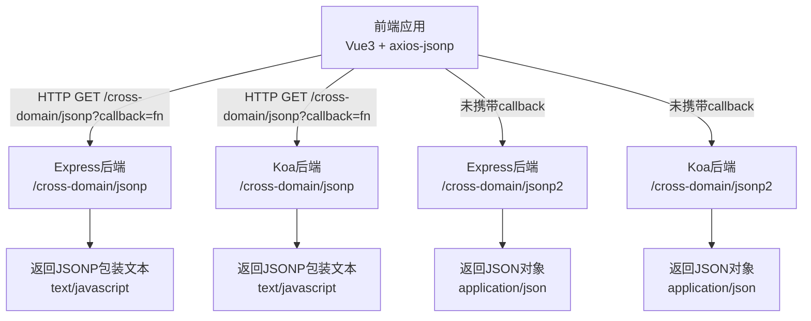
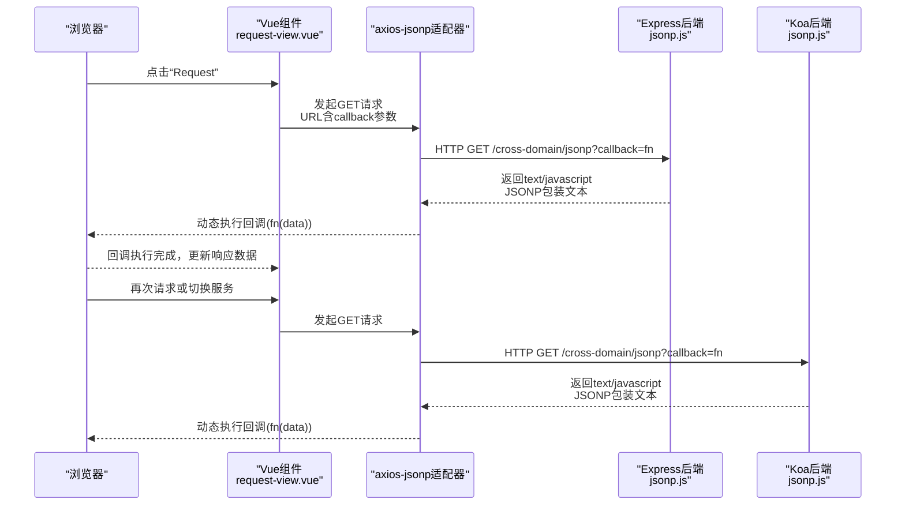
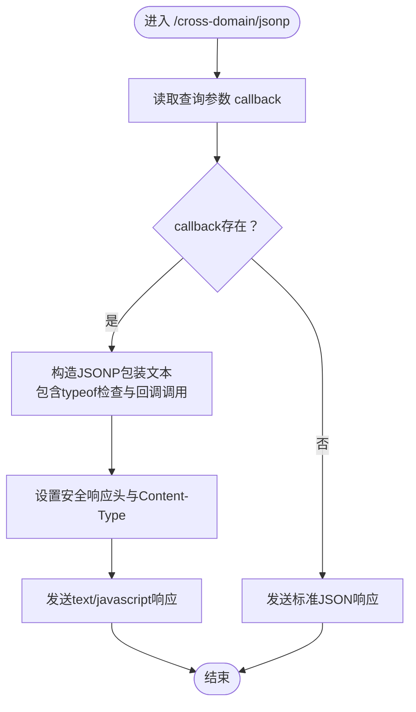
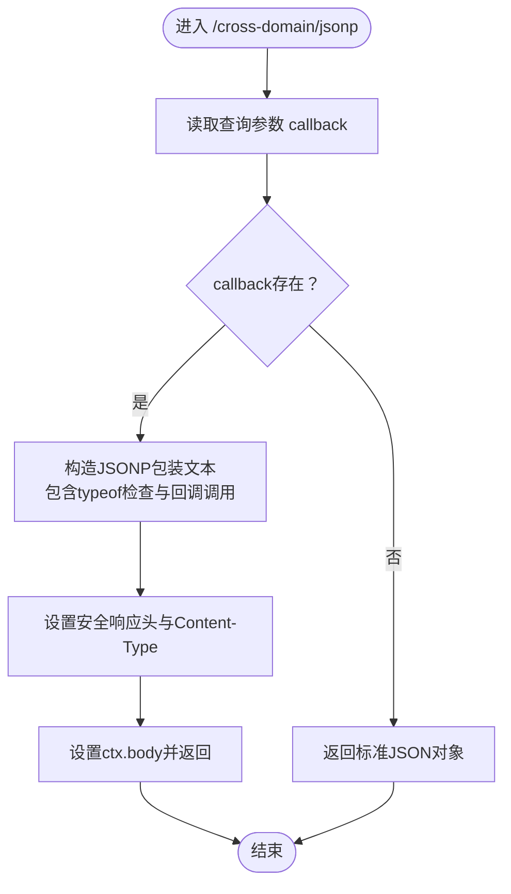
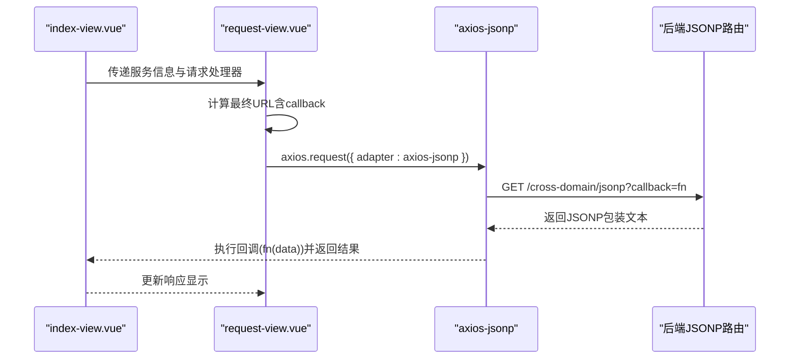
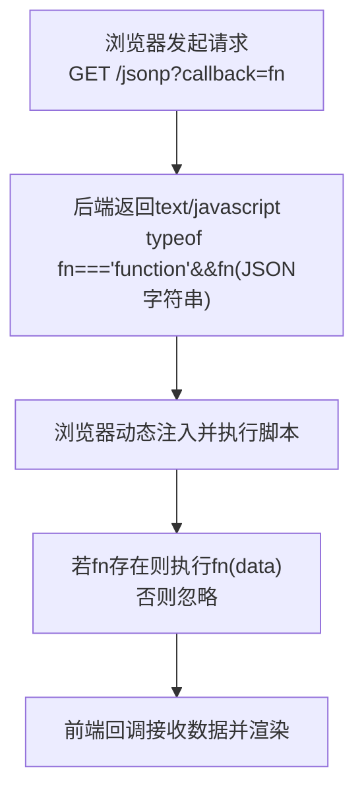
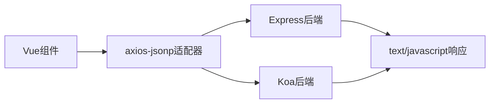

# JSONP跨域处理

<cite>
**本文引用的文件**   
- [express/jsonp.js](file://practice/nodejs-service/express/cross-domain/cross-domain/jsonp.js)
- [koa/jsonp.js](file://practice/nodejs-service/koa/cross-domain/cross-domain/jsonp.js)
- [前端视图组件](file://practice/vue3-frontend/cross-domain/src/views/jsonp/index-view.vue)
- [请求组件](file://practice/vue3-frontend/cross-domain/src/components/request-view.vue)
- [axios-jsonp类型声明](file://practice/vue3-frontend/cross-domain/axios-jsonp.d.ts)
</cite>

## 目录
1. [引言](#引言)
2. [项目结构](#项目结构)
3. [核心组件](#核心组件)
4. [架构总览](#架构总览)
5. [详细组件分析](#详细组件分析)
6. [依赖关系分析](#依赖关系分析)
7. [性能考量](#性能考量)
8. [故障排查指南](#故障排查指南)
9. [结论](#结论)
10. [附录](#附录)

## 引言
本文件围绕JSONP（JSON with Padding）跨域处理进行系统化技术说明，涵盖其工作原理、动态脚本注入机制、callback参数与回调执行流程，并结合仓库中的Express与Koa后端实现及Vue前端示例，给出安全注意事项、局限性与适用场景，以及可直接复用的实现路径与错误处理建议。

## 项目结构
该仓库在多个Node.js框架中提供了JSONP跨域示例，前端通过Vue组件演示如何使用axios-jsonp适配器发起JSONP请求。关键位置如下：
- 后端（Express/Koa）：在各自路由模块中提供 /cross-domain/jsonp 接口，返回JSONP包装响应或直接JSON响应
- 前端（Vue3）：通过axios-jsonp适配器封装GET请求，自动附加callback查询参数并解析动态脚本

**图表来源**
- [express/jsonp.js:6-20](file://practice/nodejs-service/express/cross-domain/cross-domain/jsonp.js#L6-L20)
- [koa/jsonp.js:8-22](file://practice/nodejs-service/koa/cross-domain/cross-domain/jsonp.js#L8-L22)
- [前端视图组件:30-36](file://practice/vue3-frontend/cross-domain/src/views/jsonp/index-view.vue#L30-L36)
- [请求组件:22-28](file://practice/vue3-frontend/cross-domain/src/components/request-view.vue#L22-L28)

**章节来源**
- [express/jsonp.js:1-24](file://practice/nodejs-service/express/cross-domain/cross-domain/jsonp.js#L1-L24)
- [koa/jsonp.js:1-26](file://practice/nodejs-service/koa/cross-domain/cross-domain/jsonp.js#L1-L26)
- [前端视图组件:1-94](file://practice/vue3-frontend/cross-domain/src/views/jsonp/index-view.vue#L1-L94)
- [请求组件:1-72](file://practice/vue3-frontend/cross-domain/src/components/request-view.vue#L1-L72)

## 核心组件
- Express后端JSONP路由
  - 路由：/cross-domain/jsonp
  - 行为：当存在callback查询参数时，构造“JSONP包装文本”，设置安全响应头，以text/javascript返回；否则返回标准JSON
  - 另一条路由：/cross-domain/jsonp2 使用res.jsonp直接输出JSONP响应
- Koa后端JSONP路由
  - 路由：/cross-domain/jsonp
  - 行为：与Express类似，但采用ctx上下文写入响应头与内容
- 前端Vue组件
  - 使用axios.request并指定adapter为axios-jsonp，自动拼接callback参数并解析动态脚本
  - 请求组件负责根据服务基地址与路径生成最终URL并触发请求

**章节来源**
- [express/jsonp.js:6-20](file://practice/nodejs-service/express/cross-domain/cross-domain/jsonp.js#L6-L20)
- [koa/jsonp.js:8-22](file://practice/nodejs-service/koa/cross-domain/cross-domain/jsonp.js#L8-L22)
- [前端视图组件:30-36](file://practice/vue3-frontend/cross-domain/src/views/jsonp/index-view.vue#L30-L36)
- [请求组件:22-28](file://practice/vue3-frontend/cross-domain/src/components/request-view.vue#L22-L28)

## 架构总览
下图展示从浏览器到后端再到前端回调执行的完整链路，包括Express与Koa两种实现路径：

**图表来源**
- [express/jsonp.js:6-16](file://practice/nodejs-service/express/cross-domain/cross-domain/jsonp.js#L6-L16)
- [koa/jsonp.js:8-18](file://practice/nodejs-service/koa/cross-domain/cross-domain/jsonp.js#L8-L18)
- [前端视图组件:30-36](file://practice/vue3-frontend/cross-domain/src/views/jsonp/index-view.vue#L30-L36)
- [请求组件:22-28](file://practice/vue3-frontend/cross-domain/src/components/request-view.vue#L22-L28)

## 详细组件分析

### Express后端JSONP实现
- 路由绑定：bindJsonpRouter内注册GET /cross-domain/jsonp
- 参数校验：读取req.query.callback
- 安全响应头：设置X-Content-Type-Options: nosniff
- 内容类型：设置Content-Type为text/javascript
- 包装策略：若存在callback，则构造“typeof fn==='function'&&fn(JSON字符串)”形式的文本；否则返回标准JSON
- 备选路由：/cross-domain/jsonp2使用res.jsonp简化实现

**图表来源**
- [express/jsonp.js:6-16](file://practice/nodejs-service/express/cross-domain/cross-domain/jsonp.js#L6-L16)

**章节来源**
- [express/jsonp.js:6-20](file://practice/nodejs-service/express/cross-domain/cross-domain/jsonp.js#L6-L20)

### Koa后端JSONP实现
- 路由绑定：bindJsonpRouter内注册GET /cross-domain/jsonp
- 参数校验：读取ctx.query.callback
- 包装策略：与Express一致，先做typeof检查再调用回调
- 安全响应头：设置X-Content-Type-Options: nosniff
- 内容类型：设置Content-Type为text/javascript

**图表来源**
- [koa/jsonp.js:8-18](file://practice/nodejs-service/koa/cross-domain/cross-domain/jsonp.js#L8-L18)

**章节来源**
- [koa/jsonp.js:8-22](file://practice/nodejs-service/koa/cross-domain/cross-domain/jsonp.js#L8-L22)

### 前端JSONP请求实现（Vue + axios-jsonp）
- 组件职责：index-view.vue通过axios.request并传入adapter为axios-jsonp，自动附加callback参数
- 请求组件：request-view.vue根据服务基地址与路径计算最终URL，点击按钮触发请求并将结果回填到界面
- 类型声明：axios-jsonp.d.ts导出AxiosAdapter类型，便于TS环境正确推断

**图表来源**
- [前端视图组件:30-36](file://practice/vue3-frontend/cross-domain/src/views/jsonp/index-view.vue#L30-L36)
- [请求组件:22-28](file://practice/vue3-frontend/cross-domain/src/components/request-view.vue#L22-L28)
- [axios-jsonp类型声明:1-6](file://practice/vue3-frontend/cross-domain/axios-jsonp.d.ts#L1-L6)

**章节来源**
- [前端视图组件:30-36](file://practice/vue3-frontend/cross-domain/src/views/jsonp/index-view.vue#L30-L36)
- [请求组件:22-28](file://practice/vue3-frontend/cross-domain/src/components/request-view.vue#L22-L28)
- [axios-jsonp类型声明:1-6](file://practice/vue3-frontend/cross-domain/axios-jsonp.d.ts#L1-L6)

### JSONP工作原理与动态脚本注入
- 基本思想：利用<script>标签不受同源策略限制的特性，将后端返回的“函数调用”作为脚本执行
- callback参数：前端通过查询参数指定回调函数名，后端将其包裹在“typeof fn==='function'&&fn(...)”中，确保只有当全局存在该函数时才执行
- 执行时机：浏览器收到text/javascript响应后立即解析并执行，回调函数被调用，传入JSON字符串经解析后的数据对象

[此图为概念性流程图，不对应具体源码文件，故无图表来源]

## 依赖关系分析
- 前端对后端的依赖
  - Vue组件依赖axios与axios-jsonp适配器，后者负责自动添加callback参数并处理动态脚本执行
  - 请求组件依赖服务基地址与路由路径，组合成最终请求URL
- 后端对中间件/框架的依赖
  - Express/Koa路由层负责读取查询参数、设置响应头与内容类型
  - 两者均对callback参数进行存在性判断与安全检查（typeof）

**图表来源**
- [前端视图组件:30-36](file://practice/vue3-frontend/cross-domain/src/views/jsonp/index-view.vue#L30-L36)
- [请求组件:22-28](file://practice/vue3-frontend/cross-domain/src/components/request-view.vue#L22-L28)
- [express/jsonp.js:6-16](file://practice/nodejs-service/express/cross-domain/cross-domain/jsonp.js#L6-L16)
- [koa/jsonp.js:8-18](file://practice/nodejs-service/koa/cross-domain/cross-domain/jsonp.js#L8-L18)

**章节来源**
- [前端视图组件:30-36](file://practice/vue3-frontend/cross-domain/src/views/jsonp/index-view.vue#L30-L36)
- [请求组件:22-28](file://practice/vue3-frontend/cross-domain/src/components/request-view.vue#L22-L28)
- [express/jsonp.js:6-16](file://practice/nodejs-service/express/cross-domain/cross-domain/jsonp.js#L6-L16)
- [koa/jsonp.js:8-18](file://practice/nodejs-service/koa/cross-domain/cross-domain/jsonp.js#L8-L18)

## 性能考量
- 仅GET请求：JSONP天然受限于HTTP GET，无法通过请求体传递复杂数据，也不支持自定义请求头
- 安全开销：后端需进行typeof检查，避免恶意脚本注入导致的任意代码执行
- 响应体积：JSONP包装文本通常比标准JSON略大，且需考虑callback名称长度
- 兼容性：现代浏览器仍支持，但建议优先考虑CORS等更安全的方案

[本节为通用指导，无需章节来源]

## 故障排查指南
- callback缺失
  - 现象：后端返回标准JSON而非JSONP包装文本
  - 处理：确认前端是否正确传入callback参数（axios-jsonp会自动添加）
- 回调未执行
  - 现象：浏览器控制台报错或无响应
  - 排查：检查后端是否返回text/javascript；确认callback名称在全局作用域可用；核对typeof检查逻辑
- 安全响应头
  - 建议：始终设置X-Content-Type-Options: nosniff，防止MIME混淆攻击
- CORS与JSONP混用
  - 建议：同一接口尽量统一跨域方案，避免客户端/服务端策略不一致导致的兼容性问题

**章节来源**
- [express/jsonp.js:10-12](file://practice/nodejs-service/express/cross-domain/cross-domain/jsonp.js#L10-L12)
- [koa/jsonp.js:16-17](file://practice/nodejs-service/koa/cross-domain/cross-domain/jsonp.js#L16-L17)

## 结论
JSONP作为一种经典的跨域解决方案，在仅支持GET且需要兼容老旧环境时仍有价值。通过仓库中的Express与Koa实现可见，其核心在于对callback参数的识别与“typeof检查+函数调用”的包装策略。前端配合axios-jsonp适配器可无缝发起请求并解析响应。然而，考虑到安全性与功能限制，建议在新项目中优先采用CORS，并在必要时再回退至JSONP。

[本节为总结性内容，无需章节来源]

## 附录
- 快速定位实现路径
  - Express后端JSONP路由：[express/jsonp.js:6-20](file://practice/nodejs-service/express/cross-domain/cross-domain/jsonp.js#L6-L20)
  - Koa后端JSONP路由：[koa/jsonp.js:8-18](file://practice/nodejs-service/koa/cross-domain/cross-domain/jsonp.js#L8-L18)
  - 前端请求组件：[请求组件:22-28](file://practice/vue3-frontend/cross-domain/src/components/request-view.vue#L22-L28)
  - 前端视图与适配器：[前端视图组件:30-36](file://practice/vue3-frontend/cross-domain/src/views/jsonp/index-view.vue#L30-L36)，[axios-jsonp类型声明:1-6](file://practice/vue3-frontend/cross-domain/axios-jsonp.d.ts#L1-L6)
- 安全最佳实践
  - 后端：始终设置X-Content-Type-Options: nosniff；严格校验callback名称来源；避免直接拼接用户输入到回调调用中
  - 前端：使用受信任的axios-jsonp版本；避免在不可信环境中暴露全局回调函数