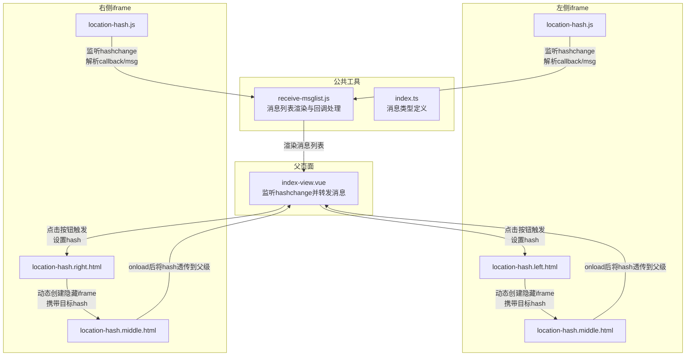
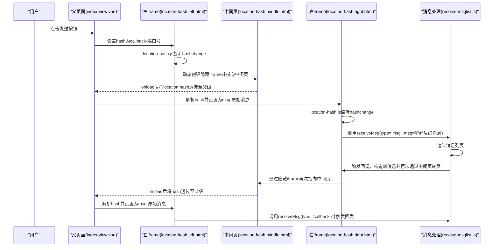
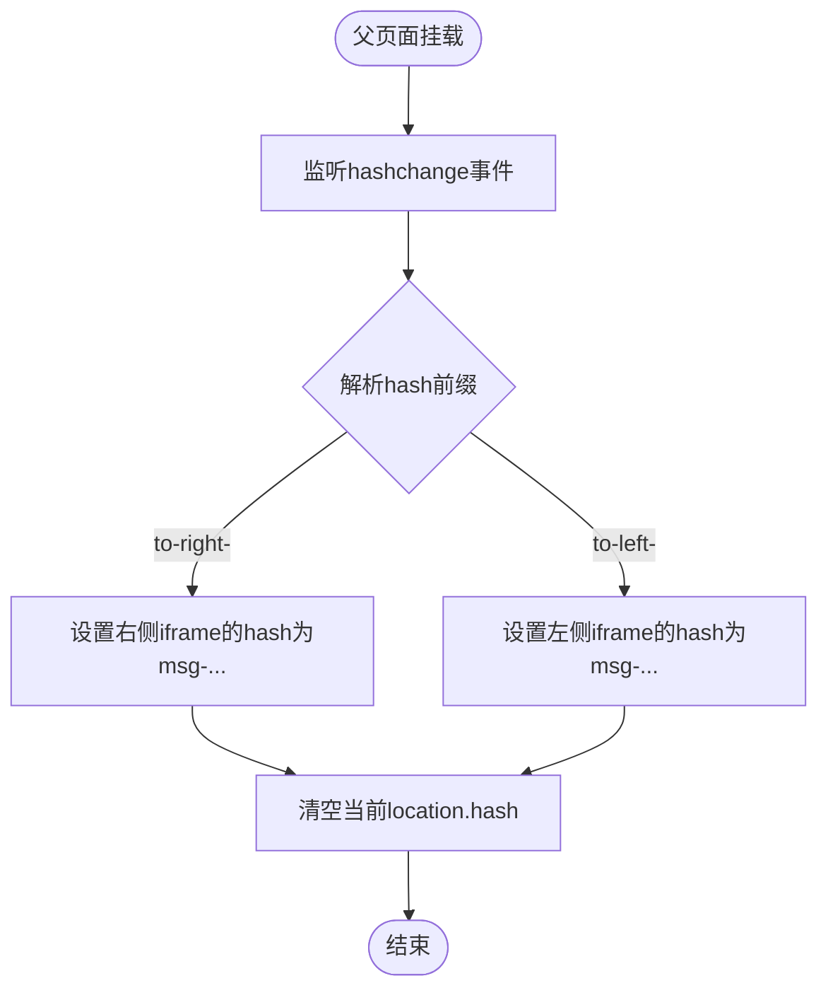
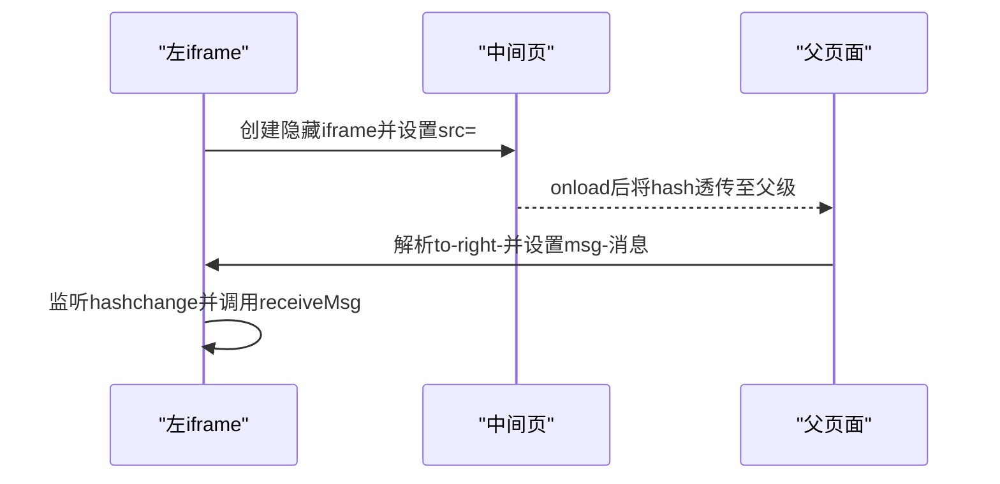
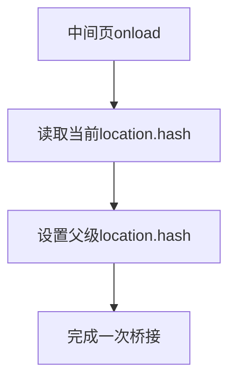
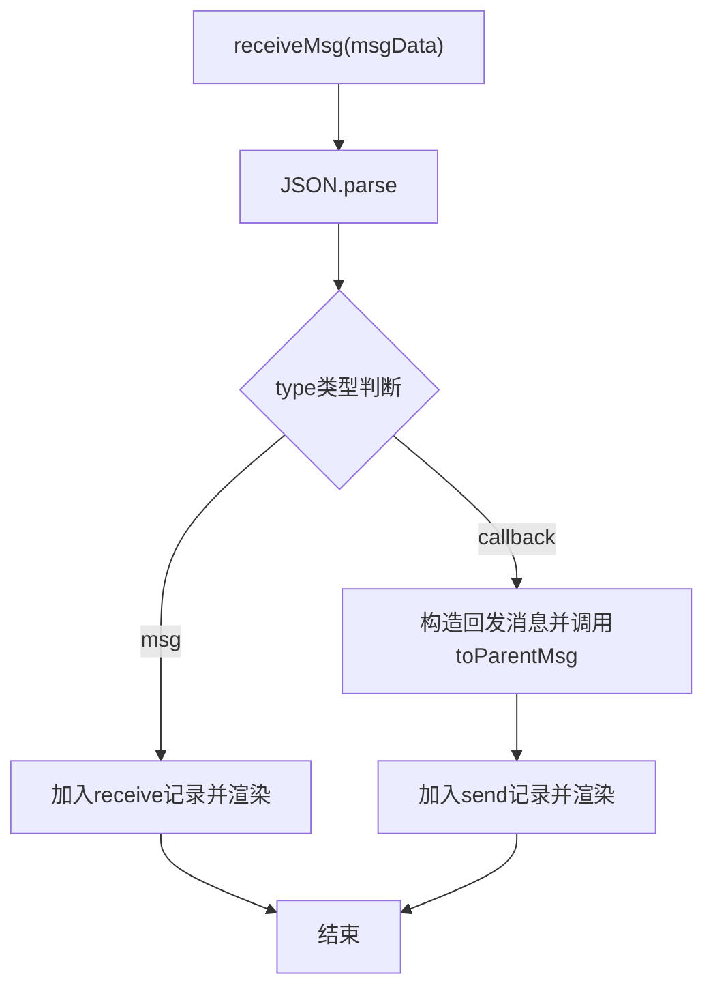
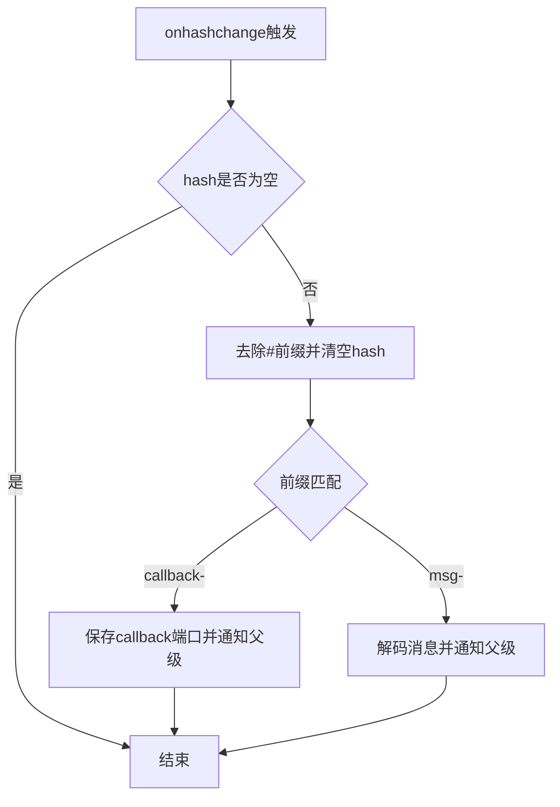
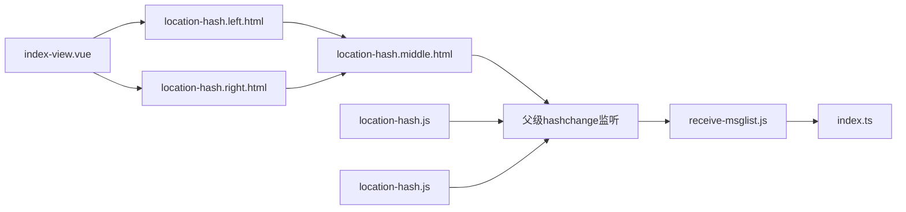

# Location Hash跨域通信

<cite>
**本文档引用的文件**
- [location-hash.js](file://practice/vue3-frontend/cross-domain/public/location-hash.js)
- [location-hash-middle.js](file://practice/vue3-frontend/cross-domain/public/location-hash-middle.js)
- [location-hash.left.html](file://practice/vue3-frontend/cross-domain/public/location-hash.left.html)
- [location-hash.right.html](file://practice/vue3-frontend/cross-domain/public/location-hash.right.html)
- [location-hash.middle.html](file://practice/vue3-frontend/cross-domain/public/location-hash.middle.html)
- [receive-msglist.js](file://practice/vue3-frontend/cross-domain/public/receive-msglist.js)
- [index-view.vue](file://practice/vue3-frontend/cross-domain/src/views/location-hash/index-view.vue)
- [two-page.vue](file://practice/vue3-frontend/cross-domain/src/components/two-page.vue)
- [left-mock-iframe.vue](file://practice/vue3-frontend/cross-domain/src/components/left-mock-iframe.vue)
- [multi-tabs.vue](file://practice/vue3-frontend/cross-domain/src/components/multi-tabs.vue)
- [index.ts](file://practice/vue3-frontend/cross-domain/src/types/index.ts)
- [README.md](file://practice/vue3-frontend/cross-domain/README.md)
</cite>

## 目录
1. [简介](#简介)
2. [项目结构](#项目结构)
3. [核心组件](#核心组件)
4. [架构总览](#架构总览)
5. [详细组件分析](#详细组件分析)
6. [依赖关系分析](#依赖关系分析)
7. [性能考量](#性能考量)
8. [故障排查指南](#故障排查指南)
9. [结论](#结论)
10. [附录](#附录)

## 简介
本技术文档围绕基于URL hash的跨域通信方案进行系统化阐述，重点解释通过URL片段标识符（hash）在父子窗口间传递数据的机制与实现细节。该方案利用浏览器同源策略对hash变更的监听能力，结合中间页桥接，实现不同端口或子域间的低耦合通信。文档涵盖hashchange事件监听、数据同步策略、父子窗口通信流程、数据截断处理与轮询机制建议、适用场景与性能考量，并提供可复用的实现思路与可靠性保障措施。

## 项目结构
该演示位于前端工程的跨域通信示例模块中，采用“父页面+左右两个iframe”的布局，通过中间页作为桥接，完成跨域数据传递与回显展示。

**图表来源**
- [index-view.vue:1-96](file://practice/vue3-frontend/cross-domain/src/views/location-hash/index-view.vue#L1-L96)
- [location-hash.left.html:1-30](file://practice/vue3-frontend/cross-domain/public/location-hash.left.html#L1-L30)
- [location-hash.right.html:1-30](file://practice/vue3-frontend/cross-domain/public/location-hash.right.html#L1-L30)
- [location-hash.middle.html:1-17](file://practice/vue3-frontend/cross-domain/public/location-hash.middle.html#L1-L17)
- [location-hash.js:1-16](file://practice/vue3-frontend/cross-domain/public/location-hash.js#L1-L16)
- [receive-msglist.js:1-48](file://practice/vue3-frontend/cross-domain/public/receive-msglist.js#L1-L48)
- [index.ts:1-27](file://practice/vue3-frontend/cross-domain/src/types/index.ts#L1-L27)

**章节来源**
- [README.md:1-15](file://practice/vue3-frontend/cross-domain/README.md#L1-L15)
- [index-view.vue:1-96](file://practice/vue3-frontend/cross-domain/src/views/location-hash/index-view.vue#L1-L96)

## 核心组件
- 父页面控制器：负责监听顶层窗口的hashchange事件，根据路由方向将消息写入对应iframe的hash中；同时负责清空当前hash，避免重复触发。
- 左右iframe页面：各自加载独立的hash监听脚本，解析来自父级的消息并调用公共消息处理函数。
- 中间页桥接：在iframe onload后，将当前hash透传给父级，形成“跨域→同源→跨域”的桥接链路。
- 消息处理与展示：统一的接收与渲染逻辑，支持消息类型识别、列表截断与UI同步。

**章节来源**
- [index-view.vue:20-49](file://practice/vue3-frontend/cross-domain/src/views/location-hash/index-view.vue#L20-L49)
- [location-hash.js:1-16](file://practice/vue3-frontend/cross-domain/public/location-hash.js#L1-L16)
- [location-hash-middle.js:1-4](file://practice/vue3-frontend/cross-domain/public/location-hash-middle.js#L1-L4)
- [receive-msglist.js:26-47](file://practice/vue3-frontend/cross-domain/public/receive-msglist.js#L26-L47)

## 架构总览
下图展示了从用户交互到消息最终渲染的完整链路，包括hash变更、中间页桥接与消息分发。

**图表来源**
- [index-view.vue:26-49](file://practice/vue3-frontend/cross-domain/src/views/location-hash/index-view.vue#L26-L49)
- [location-hash.left.html:16-26](file://practice/vue3-frontend/cross-domain/public/location-hash.left.html#L16-L26)
- [location-hash.right.html:16-26](file://practice/vue3-frontend/cross-domain/public/location-hash.right.html#L16-L26)
- [location-hash.middle.html:14-14](file://practice/vue3-frontend/cross-domain/public/location-hash.middle.html#L14-L14)
- [location-hash.js:2-14](file://practice/vue3-frontend/cross-domain/public/location-hash.js#L2-L14)
- [receive-msglist.js:26-47](file://practice/vue3-frontend/cross-domain/public/receive-msglist.js#L26-L47)

## 详细组件分析

### 父页面控制器（index-view.vue）
- 作用：作为消息发起方与中转站，维护左右iframe引用，监听顶层hashchange事件，按方向将消息写入对应iframe的hash中。
- 关键点：
  - 使用URL对象修改iframe的hash，确保不破坏其他查询参数。
  - 在hashchange回调中清空当前hash，防止重复触发。
  - 通过“to-left-/to-right-”前缀区分消息方向，分别写入“msg-”格式的消息体。

**图表来源**
- [index-view.vue:38-49](file://practice/vue3-frontend/cross-domain/src/views/location-hash/index-view.vue#L38-L49)

**章节来源**
- [index-view.vue:20-49](file://practice/vue3-frontend/cross-domain/src/views/location-hash/index-view.vue#L20-L49)

### 左右iframe页面（location-hash.left.html / location-hash.right.html）
- 作用：每个iframe内嵌独立的hash监听脚本，负责接收父级消息并调用公共消息处理函数。
- 关键点：
  - 通过动态创建隐藏iframe的方式，将消息经由中间页桥接到父级。
  - 在onload后延时移除临时iframe，减少DOM污染。
  - 通过window.from/window.to标识自身角色，便于消息回发时确定方向。

**图表来源**
- [location-hash.left.html:16-26](file://practice/vue3-frontend/cross-domain/public/location-hash.left.html#L16-L26)
- [location-hash.middle.html:14-14](file://practice/vue3-frontend/cross-domain/public/location-hash.middle.html#L14-L14)
- [index-view.vue:43-47](file://practice/vue3-frontend/cross-domain/src/views/location-hash/index-view.vue#L43-L47)

**章节来源**
- [location-hash.left.html:1-30](file://practice/vue3-frontend/cross-domain/public/location-hash.left.html#L1-L30)
- [location-hash.right.html:1-30](file://practice/vue3-frontend/cross-domain/public/location-hash.right.html#L1-L30)

### 中间页桥接（location-hash.middle.html + location-hash-middle.js）
- 作用：作为iframe与父级之间的桥接层，在onload时将当前hash直接透传给父级，从而绕过跨域限制。
- 关键点：
  - 仅在onload时执行一次透传，避免重复写入。
  - 与父页面的hashchange监听配合，形成稳定的双向通道。

**图表来源**
- [location-hash.middle.html:14-14](file://practice/vue3-frontend/cross-domain/public/location-hash.middle.html#L14-L14)
- [location-hash-middle.js:1-4](file://practice/vue3-frontend/cross-domain/public/location-hash-middle.js#L1-L4)

**章节来源**
- [location-hash.middle.html:1-17](file://practice/vue3-frontend/cross-domain/public/location-hash.middle.html#L1-L17)
- [location-hash-middle.js:1-4](file://practice/vue3-frontend/cross-domain/public/location-hash-middle.js#L1-L4)

### 消息处理与展示（receive-msglist.js + 类型定义）
- 作用：统一解析消息、维护消息列表、渲染UI，并在收到callback时自动回发一条测试消息。
- 关键点：
  - 支持两种消息类型：msg（普通消息）、callback（回调握手）。
  - 对消息列表进行逆序与截断，仅保留最近N条，避免DOM膨胀。
  - 异常捕获，保证解析失败不影响整体流程。

**图表来源**
- [receive-msglist.js:26-47](file://practice/vue3-frontend/cross-domain/public/receive-msglist.js#L26-L47)
- [index.ts:18-26](file://practice/vue3-frontend/cross-domain/src/types/index.ts#L18-L26)

**章节来源**
- [receive-msglist.js:1-48](file://practice/vue3-frontend/cross-domain/public/receive-msglist.js#L1-L48)
- [index.ts:1-27](file://practice/vue3-frontend/cross-domain/src/types/index.ts#L1-L27)

### hash监听与解析（location-hash.js）
- 作用：在iframe内部监听hashchange事件，解析callback与msg两类消息，触发父级消息处理函数。
- 关键点：
  - 去除#前缀并清空当前hash，防止重复消费。
  - 对msg内容进行URL解码，确保中文等字符正确显示。
  - 将解析结果以JSON字符串形式传递给父级处理函数。

**图表来源**
- [location-hash.js:2-14](file://practice/vue3-frontend/cross-domain/public/location-hash.js#L2-L14)

**章节来源**
- [location-hash.js:1-16](file://practice/vue3-frontend/cross-domain/public/location-hash.js#L1-L16)

### 组件化封装（two-page.vue / left-mock-iframe.vue / multi-tabs.vue）
- 作用：提供通用的布局与交互组件，简化页面组织与事件绑定。
- 关键点：
  - two-page.vue：提供左右区域与按钮事件发射，便于在父页面中绑定发送逻辑。
  - left-mock-iframe.vue：展示消息列表，支持截断与逆序显示。
  - multi-tabs.vue：作为容器承载多个通信方式的视图切换。

**章节来源**
- [two-page.vue:1-84](file://practice/vue3-frontend/cross-domain/src/components/two-page.vue#L1-L84)
- [left-mock-iframe.vue:1-51](file://practice/vue3-frontend/cross-domain/src/components/left-mock-iframe.vue#L1-L51)
- [multi-tabs.vue:1-78](file://practice/vue3-frontend/cross-domain/src/components/multi-tabs.vue#L1-L78)

## 依赖关系分析
- 父页面依赖iframe的hash变更行为，通过URL对象安全地更新hash。
- 左右iframe依赖中间页桥接，通过隐藏iframe触发onload，实现hash透传。
- 所有iframe共享同一套消息处理逻辑，确保一致性。
- 类型定义集中于index.ts，便于跨组件共享。

**图表来源**
- [index-view.vue:1-96](file://practice/vue3-frontend/cross-domain/src/views/location-hash/index-view.vue#L1-L96)
- [location-hash.left.html:1-30](file://practice/vue3-frontend/cross-domain/public/location-hash.left.html#L1-L30)
- [location-hash.right.html:1-30](file://practice/vue3-frontend/cross-domain/public/location-hash.right.html#L1-L30)
- [location-hash.middle.html:1-17](file://practice/vue3-frontend/cross-domain/public/location-hash.middle.html#L1-L17)
- [location-hash.js:1-16](file://practice/vue3-frontend/cross-domain/public/location-hash.js#L1-L16)
- [receive-msglist.js:1-48](file://practice/vue3-frontend/cross-domain/public/receive-msglist.js#L1-L48)
- [index.ts:1-27](file://practice/vue3-frontend/cross-domain/src/types/index.ts#L1-L27)

**章节来源**
- [index-view.vue:1-96](file://practice/vue3-frontend/cross-domain/src/views/location-hash/index-view.vue#L1-L96)
- [location-hash.js:1-16](file://practice/vue3-frontend/cross-domain/public/location-hash.js#L1-L16)
- [receive-msglist.js:1-48](file://practice/vue3-frontend/cross-domain/public/receive-msglist.js#L1-L48)

## 性能考量
- DOM操作最小化：仅在必要时创建/移除隐藏iframe，且在onload后立即清理，降低DOM开销。
- 消息列表截断：限制展示数量，避免长列表导致的渲染压力。
- hash变更频率控制：父页面在处理完hash后立即清空，避免重复触发与多次渲染。
- 字符串处理成本：URL解码仅在必要时进行，避免无谓的计算。

[本节为通用性能建议，无需特定文件引用]

## 故障排查指南
- 现象：消息未到达或重复触发
  - 排查父页面是否在hashchange回调中清空了当前hash。
  - 检查中间页onload是否成功将hash透传至父级。
- 现象：中文或特殊字符乱码
  - 确认iframe内的消息是否经过URL解码后再渲染。
- 现象：消息列表不更新
  - 检查receive-msglist.js的渲染函数是否被正确调用。
  - 确保消息类型与前缀匹配（callback-/msg-）。
- 现象：iframe无法移除或内存泄漏
  - 确认在onload后设置了合理的延时再移除临时iframe。

**章节来源**
- [index-view.vue:38-49](file://practice/vue3-frontend/cross-domain/src/views/location-hash/index-view.vue#L38-L49)
- [location-hash.js:2-14](file://practice/vue3-frontend/cross-domain/public/location-hash.js#L2-L14)
- [receive-msglist.js:26-47](file://practice/vue3-frontend/cross-domain/public/receive-msglist.js#L26-L47)

## 结论
Location Hash跨域通信通过“父级监听+iframe桥接+中间页透传”的组合，实现了低耦合、易理解的跨域数据传递。其优势在于兼容性好、实现简单；但受限于URL长度与hash可见性，适合轻量级数据与非敏感场景。通过消息截断、延迟清理与异常捕获等手段，可在保证可靠性的同时兼顾性能与用户体验。

[本节为总结性内容，无需特定文件引用]

## 附录

### 数据截断与轮询机制建议
- 截断策略：在消息列表渲染前进行逆序与截断，仅保留最近N条，避免DOM膨胀与渲染卡顿。
- 轮询替代：若需周期性状态同步，可在父页面设置定时器，定期写入带时间戳的hash，iframe侧解析后决定是否处理。

**章节来源**
- [receive-msglist.js:3-20](file://practice/vue3-frontend/cross-domain/public/receive-msglist.js#L3-L20)

### 可靠性保障措施
- 异常捕获：消息解析与渲染均包裹try/catch，避免单点错误影响整体流程。
- 前缀校验：严格匹配callback-/msg-前缀，防止误判与重复消费。
- 清理策略：hash消费后立即清空，隐藏iframe在onload后延时移除，降低副作用。

**章节来源**
- [receive-msglist.js:44-47](file://practice/vue3-frontend/cross-domain/public/receive-msglist.js#L44-L47)
- [location-hash.js:4-5](file://practice/vue3-frontend/cross-domain/public/location-hash.js#L4-L5)
- [location-hash.left.html:21-25](file://practice/vue3-frontend/cross-domain/public/location-hash.left.html#L21-L25)
- [location-hash.right.html:21-25](file://practice/vue3-frontend/cross-domain/public/location-hash.right.html#L21-L25)