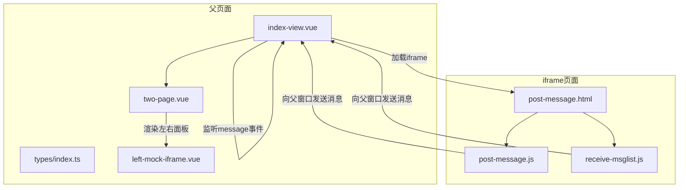
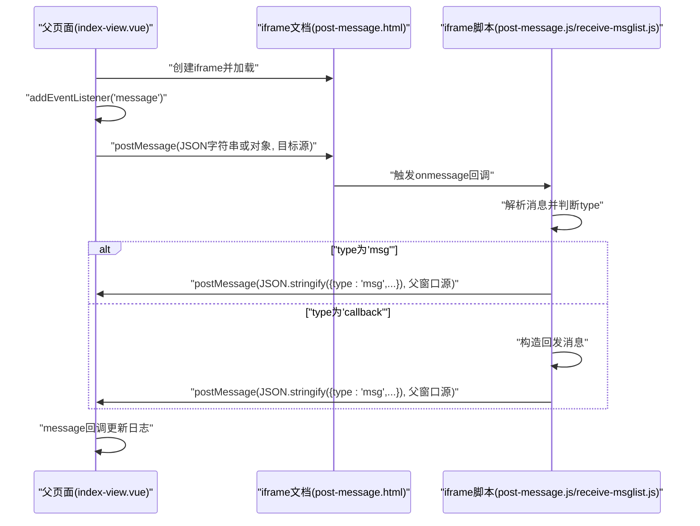
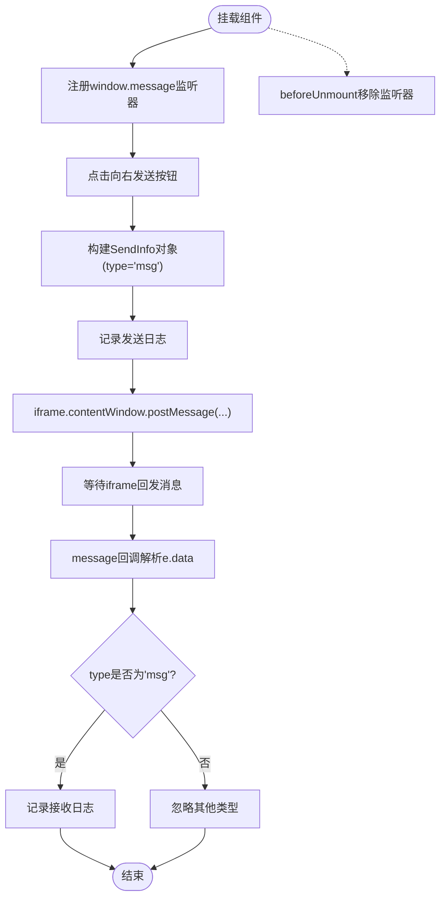
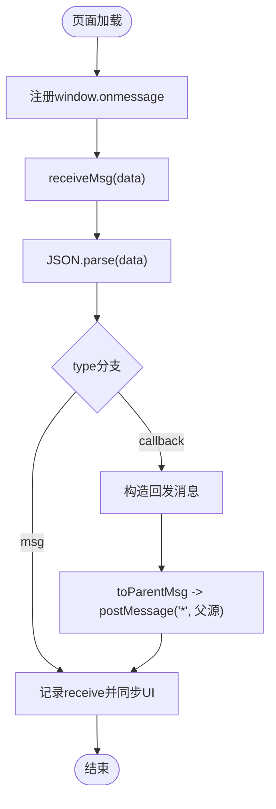
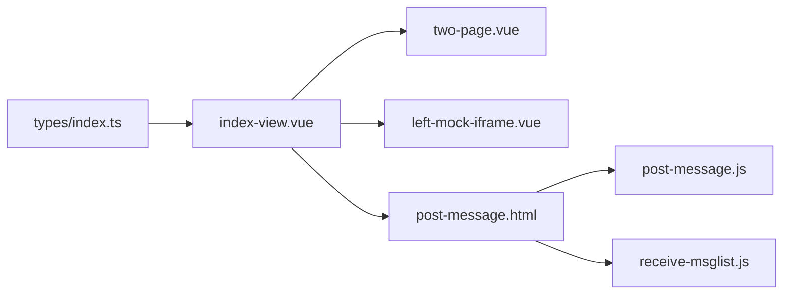

# PostMessage跨域通信

<cite>
**本文引用的文件**
- [post-message.html](file://practice/vue3-frontend/cross-domain/public/post-message.html)
- [post-message.js](file://practice/vue3-frontend/cross-domain/public/post-message.js)
- [receive-msglist.js](file://practice/vue3-frontend/cross-domain/public/receive-msglist.js)
- [index-view.vue](file://practice/vue3-frontend/cross-domain/src/views/post-message/index-view.vue)
- [types/index.ts](file://practice/vue3-frontend/cross-domain/src/types/index.ts)
- [left-mock-iframe.vue](file://practice/vue3-frontend/cross-domain/src/components/left-mock-iframe.vue)
- [two-page.vue](file://practice/vue3-frontend/cross-domain/src/components/two-page.vue)
- [location-hash.js](file://practice/vue3-frontend/cross-domain/public/location-hash.js)
- [window-name.html](file://practice/vue3-frontend/cross-domain/public/window-name.html)
- [set-domain.html](file://practice/vue3-frontend/cross-domain/public/set-domain.html)
- [set-domain.js](file://practice/vue3-frontend/cross-domain/public/set-domain.js)
</cite>

## 目录
1. [简介](#简介)
2. [项目结构](#项目结构)
3. [核心组件](#核心组件)
4. [架构总览](#架构总览)
5. [详细组件分析](#详细组件分析)
6. [依赖关系分析](#依赖关系分析)
7. [性能考量](#性能考量)
8. [故障排查指南](#故障排查指南)
9. [结论](#结论)
10. [附录](#附录)

## 简介
本技术文档围绕HTML5跨文档消息传递API（window.postMessage）展开，系统阐述其工作原理、消息发送与接收机制、目标源验证、消息格式规范，并结合仓库中的父子窗口与iframe跨域通信示例，给出消息监听器注册与移除、安全性考虑与最佳实践、以及完整的双向通信实现思路与错误处理策略。

## 项目结构
该示例工程位于前端练习目录中，围绕“PostMessage跨域通信”主题提供了两类场景：
- 同域与跨域iframe通信：通过一个父页面嵌入不同端口的iframe，演示postMessage在同域与跨域下的消息收发。
- 辅助通信方式：包含基于location.hash与window.name的替代方案，便于理解跨域通信的多种手段。

图表来源
- [index-view.vue:1-108](file://practice/vue3-frontend/cross-domain/src/views/post-message/index-view.vue#L1-L108)
- [post-message.html:1-15](file://practice/vue3-frontend/cross-domain/public/post-message.html#L1-L15)
- [post-message.js:1-8](file://practice/vue3-frontend/cross-domain/public/post-message.js#L1-L8)
- [receive-msglist.js:1-48](file://practice/vue3-frontend/cross-domain/public/receive-msglist.js#L1-L48)

章节来源
- [post-message.html:1-15](file://practice/vue3-frontend/cross-domain/public/post-message.html#L1-L15)
- [index-view.vue:1-108](file://practice/vue3-frontend/cross-domain/src/views/post-message/index-view.vue#L1-L108)

## 核心组件
- 父页面视图组件：负责创建iframe、注册/移除message监听器、向iframe发送消息、接收来自iframe的消息并记录日志。
- iframe页面脚本：注册message监听器、解析消息、根据消息类型进行回发或展示。
- 消息格式与类型：统一使用JSON字符串或对象，约定type字段标识消息类型（如'callback'/'msg'），msg承载业务数据。
- 类型定义：集中定义Website、MessageLog、SendInfo等接口，确保父子双方对消息结构一致。

章节来源
- [index-view.vue:21-59](file://practice/vue3-frontend/cross-domain/src/views/post-message/index-view.vue#L21-L59)
- [post-message.js:1-8](file://practice/vue3-frontend/cross-domain/public/post-message.js#L1-L8)
- [receive-msglist.js:26-47](file://practice/vue3-frontend/cross-domain/public/receive-msglist.js#L26-L47)
- [types/index.ts:13-27](file://practice/vue3-frontend/cross-domain/src/types/index.ts#L13-L27)

## 架构总览
下图展示了典型的父子窗口/iframe跨域通信流程：父页面通过postMessage向iframe发送消息；iframe收到消息后，按约定格式回发给父页面，双方均通过message事件监听器完成解耦。

图表来源
- [index-view.vue:25-69](file://practice/vue3-frontend/cross-domain/src/views/post-message/index-view.vue#L25-L69)
- [post-message.js:1-8](file://practice/vue3-frontend/cross-domain/public/post-message.js#L1-L8)
- [receive-msglist.js:26-47](file://practice/vue3-frontend/cross-domain/public/receive-msglist.js#L26-L47)

## 详细组件分析

### 父页面视图组件（index-view.vue）
- 负责：
  - 维护可切换的网站列表（同域/跨域），用于iframe的src设置。
  - 注册window.message监听器，解析来自iframe的消息并更新本地日志。
  - 提供按钮事件，向iframe发送'callback'或'msg'类型消息。
  - 在组件卸载时移除message监听器，避免内存泄漏。
- 关键点：
  - 使用contentWindow.postMessage向iframe发送消息，目标源为当前website.baseUrl。
  - message回调中先解析e.data，再根据type分支处理，仅当type为'msg'时记录到本地日志。

图表来源
- [index-view.vue:25-59](file://practice/vue3-frontend/cross-domain/src/views/post-message/index-view.vue#L25-L59)

章节来源
- [index-view.vue:21-69](file://practice/vue3-frontend/cross-domain/src/views/post-message/index-view.vue#L21-L69)
- [types/index.ts:18-27](file://practice/vue3-frontend/cross-domain/src/types/index.ts#L18-L27)

### iframe页面与脚本（post-message.html + post-message.js + receive-msglist.js）
- 负责：
  - 注册window.onmessage监听器，统一调用receiveMsg处理消息。
  - 将消息转换为JSON字符串后通过window.parent.postMessage回发，目标源使用通配符（示例中为'*'，实际生产应限定具体源）。
  - receiveMsg根据type分发逻辑：当收到'msg'时直接展示；当收到'callback'时构造回发消息并再次回发。
  - 提供同步消息列表的UI展示函数，限制显示条数并反转顺序以呈现最新消息在前。
- 安全提示：
  - 示例中目标源使用通配符，仅为演示方便；生产环境务必校验e.origin并限定可信源。

图表来源
- [post-message.html:1-15](file://practice/vue3-frontend/cross-domain/public/post-message.html#L1-L15)
- [post-message.js:1-8](file://practice/vue3-frontend/cross-domain/public/post-message.js#L1-L8)
- [receive-msglist.js:26-47](file://practice/vue3-frontend/cross-domain/public/receive-msglist.js#L26-L47)

章节来源
- [post-message.html:1-15](file://practice/vue3-frontend/cross-domain/public/post-message.html#L1-L15)
- [post-message.js:1-8](file://practice/vue3-frontend/cross-domain/public/post-message.js#L1-L8)
- [receive-msglist.js:1-48](file://practice/vue3-frontend/cross-domain/public/receive-msglist.js#L1-L48)

### 消息监听器的注册与移除
- 注册：在父页面挂载时添加window.addEventListener('message', handler)。
- 移除：在beforeUnmount阶段移除监听器，防止重复绑定与内存泄漏。
- 建议：在handler内部严格校验e.origin与e.data结构，避免误处理非预期消息。

章节来源
- [index-view.vue:53-59](file://practice/vue3-frontend/cross-domain/src/views/post-message/index-view.vue#L53-L59)

### 双向通信实现要点
- 发送方：将消息序列化为JSON字符串或对象，指定精确的目标源（建议使用具体域名而非通配符）。
- 接收方：在onmessage回调中解析消息，区分type并执行相应业务逻辑，必要时构造回发消息。
- 日志与可视化：维护消息列表，限制长度并反转展示，便于调试与观察。

章节来源
- [index-view.vue:25-69](file://practice/vue3-frontend/cross-domain/src/views/post-message/index-view.vue#L25-L69)
- [receive-msglist.js:3-20](file://practice/vue3-frontend/cross-domain/public/receive-msglist.js#L3-L20)

### 其他跨域通信方式参考
- 基于location.hash的通信：iframe监听hash变化，解析msg-与callback-前缀，触发receiveMsg。
- 基于window.name的通信：利用window.name在同域/跨域间传递信息，适合一次性数据传递场景。

章节来源
- [location-hash.js:1-15](file://practice/vue3-frontend/cross-domain/public/location-hash.js#L1-L15)
- [window-name.html:24-58](file://practice/vue3-frontend/cross-domain/public/window-name.html#L24-L58)

## 依赖关系分析
- 父页面依赖：
  - 视图组件two-page.vue与left-mock-iframe.vue用于布局与日志展示。
  - types/index.ts提供消息结构类型定义。
- iframe页面依赖：
  - post-message.html作为入口，引入post-message.js与receive-msglist.js。
- 组件耦合：
  - 父子通过postMessage解耦，消息格式由类型定义约束，降低耦合度。
  - UI层与通信层分离，便于扩展与测试。

图表来源
- [types/index.ts:1-27](file://practice/vue3-frontend/cross-domain/src/types/index.ts#L1-L27)
- [index-view.vue:1-10](file://practice/vue3-frontend/cross-domain/src/views/post-message/index-view.vue#L1-L10)
- [two-page.vue:1-84](file://practice/vue3-frontend/cross-domain/src/components/two-page.vue#L1-L84)
- [left-mock-iframe.vue:1-51](file://practice/vue3-frontend/cross-domain/src/components/left-mock-iframe.vue#L1-L51)
- [post-message.html:1-15](file://practice/vue3-frontend/cross-domain/public/post-message.html#L1-L15)
- [post-message.js:1-8](file://practice/vue3-frontend/cross-domain/public/post-message.js#L1-L8)
- [receive-msglist.js:1-48](file://practice/vue3-frontend/cross-domain/public/receive-msglist.js#L1-L48)

## 性能考量
- 避免频繁序列化/反序列化：在高频消息场景下，尽量复用对象或采用二进制传输（如需要）。
- 控制消息量：UI侧限制消息列表长度，减少DOM操作开销。
- 监听器管理：及时移除监听器，避免重复绑定导致的性能与内存问题。
- 目标源校验：在接收端严格校验e.origin，避免无效消息处理带来的额外开销。

## 故障排查指南
- 无法接收到消息
  - 检查iframe是否正确加载且已注册onmessage监听器。
  - 确认父页面postMessage的目标源与iframe页面期望的一致。
- 消息未被识别
  - 确保消息为JSON字符串或对象，且包含type字段。
  - 在接收端增加对未知type的默认分支与日志输出。
- 回发消息失败
  - 检查window.parent是否可用（跨域时需确保iframe与父窗口满足同源或可通信条件）。
  - 若使用通配符目标源，建议改为具体源以提升安全性与稳定性。
- 内存泄漏
  - 确保在beforeUnmount中移除message监听器。

章节来源
- [index-view.vue:53-59](file://practice/vue3-frontend/cross-domain/src/views/post-message/index-view.vue#L53-L59)
- [receive-msglist.js:44-47](file://practice/vue3-frontend/cross-domain/public/receive-msglist.js#L44-L47)

## 结论
PostMessage是实现父子窗口/iframe跨域通信的标准API。通过统一的消息格式、严格的源校验与监听器生命周期管理，可以在保证安全性的前提下实现稳定高效的双向通信。建议在生产环境中：
- 明确限定目标源，避免使用通配符；
- 对消息进行结构化与类型化管理；
- 在UI层做好消息限流与展示优化；
- 在组件层面规范监听器的注册与移除。

## 附录
- 安全最佳实践清单
  - 在接收端始终校验e.origin，仅允许来自可信源的消息。
  - 对e.data进行严格解析与类型检查，捕获异常并记录日志。
  - 避免在消息中传递敏感信息；如需传递，采用加密或签名机制。
  - 在组件卸载时清理所有事件监听器与定时器。
- 参考实现位置
  - 父页面消息监听与发送：[index-view.vue:25-69](file://practice/vue3-frontend/cross-domain/src/views/post-message/index-view.vue#L25-L69)
  - iframe消息接收与回发：[post-message.js:1-8](file://practice/vue3-frontend/cross-domain/public/post-message.js#L1-L8)、[receive-msglist.js:26-47](file://practice/vue3-frontend/cross-domain/public/receive-msglist.js#L26-L47)
  - 消息类型定义：[types/index.ts:18-27](file://practice/vue3-frontend/cross-domain/src/types/index.ts#L18-L27)