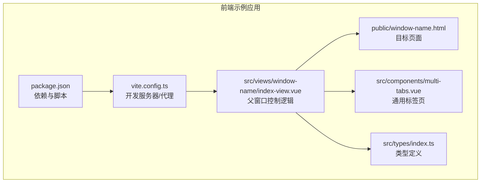
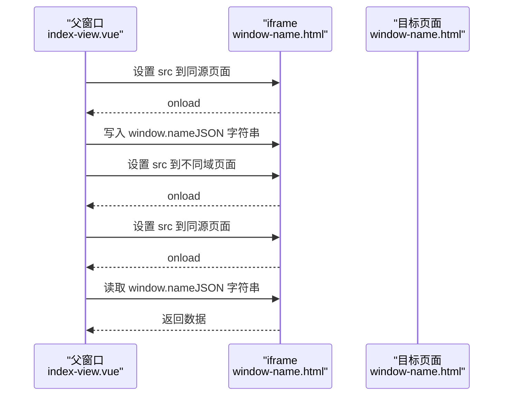
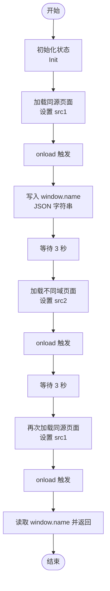
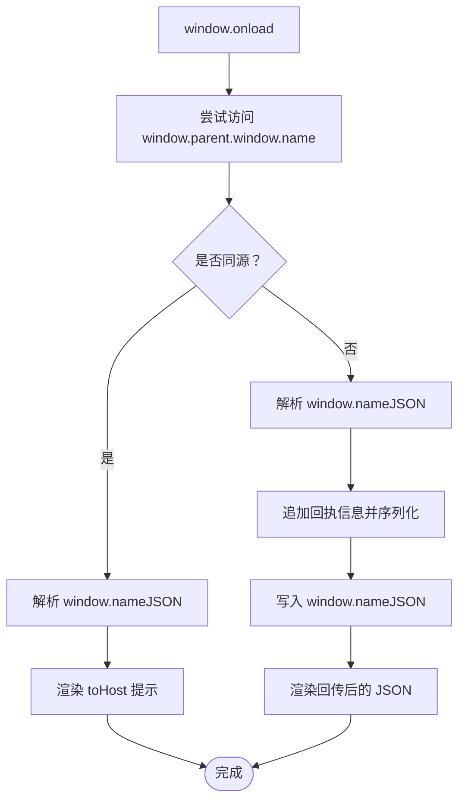
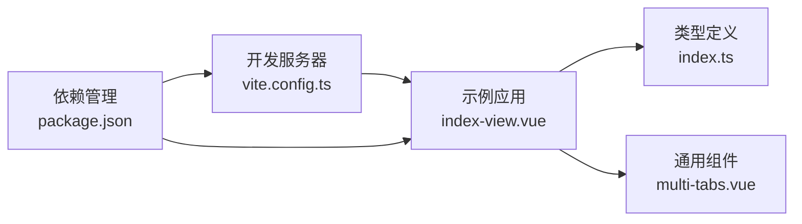

# Window Name跨域通信

<cite>
**本文引用的文件**
- [public/window-name.html](file://practice/vue3-frontend/cross-domain/public/window-name.html)
- [src/views/window-name/index-view.vue](file://practice/vue3-frontend/cross-domain/src/views/window-name/index-view.vue)
- [src/components/multi-tabs.vue](file://practice/vue3-frontend/cross-domain/src/components/multi-tabs.vue)
- [src/types/index.ts](file://practice/vue3-frontend/cross-domain/src/types/index.ts)
- [vite.config.ts](file://practice/vue3-frontend/cross-domain/vite.config.ts)
- [package.json](file://practice/vue3-frontend/cross-domain/package.json)
- [README.md](file://practice/vue3-frontend/cross-domain/README.md)
</cite>

## 目录
1. [引言](#引言)
2. [项目结构](#项目结构)
3. [核心组件](#核心组件)
4. [架构总览](#架构总览)
5. [详细组件分析](#详细组件分析)
6. [依赖分析](#依赖分析)
7. [性能考虑](#性能考虑)
8. [故障排查指南](#故障排查指南)
9. [结论](#结论)
10. [附录](#附录)

## 引言
本技术文档围绕“Window Name 跨域通信”展开，系统阐述其工作原理、数据传递机制与实现细节，并结合仓库中的示例代码给出父子窗口间的数据流转流程、编码与解码方法、时序控制策略、适用场景与局限性，以及最佳实践建议。读者无需深入前端框架即可理解并复用该模式。

## 项目结构
本项目为一个用于演示多种跨域通信方式的前端示例工程，其中“Window Name”作为其中一个可交互示例页面。关键目录与文件如下：
- 示例页面：public/window-name.html（目标页面，承载 window.name 数据读写）
- 视图组件：src/views/window-name/index-view.vue（父窗口控制逻辑与状态机）
- 公共组件：src/components/multi-tabs.vue（通用标签页容器）
- 类型定义：src/types/index.ts（消息与网站类型接口）
- 构建与开发配置：vite.config.ts、package.json、README.md

图表来源
- [public/window-name.html](file://practice/vue3-frontend/cross-domain/public/window-name.html)
- [src/views/window-name/index-view.vue](file://practice/vue3-frontend/cross-domain/src/views/window-name/index-view.vue)
- [src/components/multi-tabs.vue](file://practice/vue3-frontend/cross-domain/src/components/multi-tabs.vue)
- [src/types/index.ts](file://practice/vue3-frontend/cross-domain/src/types/index.ts)
- [vite.config.ts](file://practice/vue3-frontend/cross-domain/vite.config.ts)
- [package.json](file://practice/vue3-frontend/cross-domain/package.json)

章节来源
- [README.md](file://practice/vue3-frontend/cross-domain/README.md)
- [package.json](file://practice/vue3-frontend/cross-domain/package.json)

## 核心组件
- 父窗口控制组件（index-view.vue）：负责在不同域名间切换 iframe 源，设置/读取 window.name，驱动步骤状态机，展示交互流程。
- 目标页面（public/window-name.html）：在加载完成后解析 window.name，判断是否同源，按需回写数据，展示当前 window.name 内容。
- 通用标签页组件（multi-tabs.vue）：提供统一的标题、按钮与插槽内容布局。
- 类型定义（index.ts）：定义消息体结构与网站信息结构，确保数据契约一致。

章节来源
- [src/views/window-name/index-view.vue](file://practice/vue3-frontend/cross-domain/src/views/window-name/index-view.vue)
- [public/window-name.html](file://practice/vue3-frontend/cross-domain/public/window-name.html)
- [src/components/multi-tabs.vue](file://practice/vue3-frontend/cross-domain/src/components/multi-tabs.vue)
- [src/types/index.ts](file://practice/vue3-frontend/cross-domain/src/types/index.ts)

## 架构总览
下图展示了“Window Name 跨域通信”的端到端流程：父窗口先在同一域名下向 iframe 的 window.name 写入数据；随后切换到不同域名的 iframe 页面，iframe 在 onload 后读取并回写数据；最后再回到同源页面读取 iframe 回传的数据，完成一次往返。

图表来源
- [src/views/window-name/index-view.vue](file://practice/vue3-frontend/cross-domain/src/views/window-name/index-view.vue)
- [public/window-name.html](file://practice/vue3-frontend/cross-domain/public/window-name.html)

## 详细组件分析

### 父窗口控制组件（index-view.vue）
- 步骤状态机：通过枚举与响应式状态管理四个阶段（Init/Send/Callback/Receive），并联动步骤条组件更新 UI。
- 域名切换策略：
  - 同源页面：写入 window.name，携带发送方与接收方主机信息。
  - 不同域页面：仅加载，不直接写入，等待 iframe 侧在 onload 后读取并回写。
  - 再次同源页面：从 iframe.contentWindow.name 读取回传数据。
- 数据结构：SendInfo 接口包含 type、msg、fromHost、toHost，用于标识消息类型与路由方向。
- 时序控制：使用 Promise 链与定时器（sleep）保证跨域跳转后有足够时间完成 onload 与数据交换。

图表来源
- [src/views/window-name/index-view.vue](file://practice/vue3-frontend/cross-domain/src/views/window-name/index-view.vue)

章节来源
- [src/views/window-name/index-view.vue](file://practice/vue3-frontend/cross-domain/src/views/window-name/index-view.vue)
- [src/types/index.ts](file://practice/vue3-frontend/cross-domain/src/types/index.ts)

### 目标页面（public/window-name.html）
- 同源判定：尝试访问 window.parent.window.name，若成功则标记为同源；否则视为不同源。
- onload 后处理：
  - 解析 window.name（期望为 JSON 字符串）。
  - 若同源：根据消息中的 toHost 生成提示链接。
  - 若不同源：根据 fromHost 生成提示链接，并向 window.name 写回包含回执信息的新 JSON。
  - 将最终 JSON 字符串渲染到页面文本域，便于观察数据流转。

图表来源
- [public/window-name.html](file://practice/vue3-frontend/cross-domain/public/window-name.html)

章节来源
- [public/window-name.html](file://practice/vue3-frontend/cross-domain/public/window-name.html)

### 通用标签页组件（multi-tabs.vue）
- 提供标题、按钮区域与内容插槽，作为各跨域示例的统一容器。
- 与父组件配合，展示步骤状态与操作入口。

章节来源
- [src/components/multi-tabs.vue](file://practice/vue3-frontend/cross-domain/src/components/multi-tabs.vue)

## 依赖分析
- 开发工具链：Vite 作为构建与本地开发服务器，支持热更新与代理配置。
- 依赖管理：Vue 3、Vue Router、Ant Design Vue 等，提供组件化与路由能力。
- 代理配置：vite.config.ts 中配置了多条代理规则，便于本地联调不同端口的服务。

图表来源
- [vite.config.ts](file://practice/vue3-frontend/cross-domain/vite.config.ts)
- [package.json](file://practice/vue3-frontend/cross-domain/package.json)
- [src/views/window-name/index-view.vue](file://practice/vue3-frontend/cross-domain/src/views/window-name/index-view.vue)
- [src/types/index.ts](file://practice/vue3-frontend/cross-domain/src/types/index.ts)
- [src/components/multi-tabs.vue](file://practice/vue3-frontend/cross-domain/src/components/multi-tabs.vue)

章节来源
- [vite.config.ts](file://practice/vue3-frontend/cross-domain/vite.config.ts)
- [package.json](file://practice/vue3-frontend/cross-domain/package.json)

## 性能考虑
- 加载与切换成本：频繁切换 iframe 源会触发页面重建与资源加载，应尽量减少不必要的跳转。
- 数据体积：window.name 为字符串，建议对大对象进行压缩或分块传输，避免超长字符串导致的解析与渲染开销。
- 时序稳定性：使用 Promise 与定时器保障 onload 时机，避免过早读取导致空值。
- 缓存与复用：在同源阶段复用已加载的 iframe 实例，减少跨域跳转次数。

## 故障排查指南
- 无法访问 window.parent.window.name
  - 可能原因：不同源限制导致访问异常。
  - 处理建议：在目标页面中捕获异常并降级处理；确认父窗口与 iframe 的同源判定逻辑。
- window.name 解析失败
  - 可能原因：写入的不是合法 JSON 字符串。
  - 处理建议：在父窗口严格序列化数据；在目标页面增加 try/catch 并记录错误日志。
- onload 未触发或时序错乱
  - 可能原因：网络延迟或跨域跳转尚未完成。
  - 处理建议：使用 Promise 包装 onload；在关键节点增加状态检查与重试。
- 数据丢失或覆盖
  - 可能原因：多次写入 window.name 未做版本控制或去重。
  - 处理建议：引入唯一标识（如时间戳、随机数）与幂等校验；在读取后及时清理或替换。

章节来源
- [public/window-name.html](file://practice/vue3-frontend/cross-domain/public/window-name.html)
- [src/views/window-name/index-view.vue](file://practice/vue3-frontend/cross-domain/src/views/window-name/index-view.vue)

## 结论
Window Name 跨域通信通过 window.name 的持久性与同页面内可读写特性，在父子窗口间实现了跨域数据传递。其实现要点包括：
- 明确的步骤状态机与时序控制；
- 严格的 JSON 编解码与错误处理；
- 同源/不同源分支下的差异化行为；
- 对数据体积与时序稳定性的优化。

该模式适用于简单数据回传与轻量消息场景，但不适合高并发、大数据量或强实时性需求。对于复杂场景，建议结合 postMessage 或服务端代理等方案。

## 附录

### 数据编码与解码规范
- 编码：父窗口在写入前将对象序列化为 JSON 字符串。
- 解码：目标页面在 onload 后解析 JSON 字符串，若失败则回退默认值。
- 回写：不同源场景下，目标页面在解析后追加回执信息并重新序列化写回。

章节来源
- [src/views/window-name/index-view.vue](file://practice/vue3-frontend/cross-domain/src/views/window-name/index-view.vue)
- [public/window-name.html](file://practice/vue3-frontend/cross-domain/public/window-name.html)

### 时序控制最佳实践
- 使用 Promise 包装 iframe.onload，确保异步顺序可控。
- 在每次跨域跳转后加入固定延时，保证页面完全就绪。
- 在读取 window.name 前进行存在性与格式校验，避免空值与异常。

章节来源
- [src/views/window-name/index-view.vue](file://practice/vue3-frontend/cross-domain/src/views/window-name/index-view.vue)

### 适用场景与局限性
- 适用场景
  - 轻量数据回传（如令牌、用户标识、路由参数）。
  - 与第三方页面嵌入时的最小侵入式通信。
- 局限性
  - 仅支持字符串形式的数据，不适合二进制或大对象。
  - 依赖页面生命周期与 onload 时机，易受网络与浏览器策略影响。
  - 安全性较低，需配合来源校验与签名机制。

章节来源
- [public/window-name.html](file://practice/vue3-frontend/cross-domain/public/window-name.html)
- [src/views/window-name/index-view.vue](file://practice/vue3-frontend/cross-domain/src/views/window-name/index-view.vue)